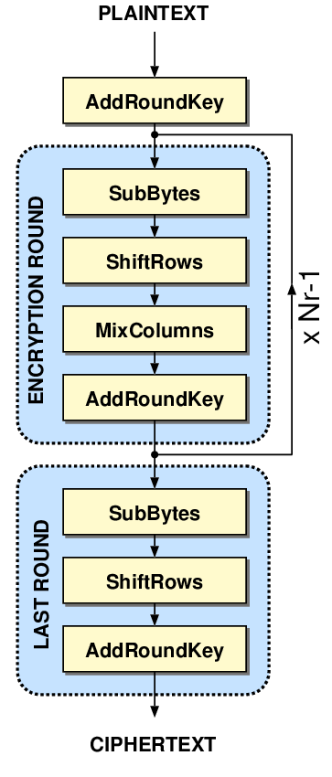

Topic 2, Part 2 - CPA on Hardware AES Implementation
====================================================

**SUMMARY:** *By now you should have a pretty good understanding of how
software implementations of AES are vulnerable to CPA attacks. You might
be wondering: are hardware implementations of AES also vulnerable to CPA
attacks?*

*In this lab, we’ll perform a CPA attack on the hardware AES
implementation in the STM32F415. We’ll also introduce LASCAR for
increased performance when analyzing large datasets.*

**LEARNING OUTCOMES:** \* Understanding how leakage differs between
software AES and hardware AES implementations \* Using LASCAR for CPA
attacks \* Identifying different leakage points

Capture traces as normal. We’ll need to select the HWAES crypto target
instead of TINYAES or MBEDTLS. Also we don’t need to capture as many
traces - the whole AES block will fit in less than 2000 traces. We’ll
also boost the gain a little bit - HWAES won’t result in as big of power
spikes:

**In [1]:**

.. code:: ipython3

    SCOPETYPE = 'OPENADC'
    PLATFORM = 'CW308_STM32F4'
    VERSION = 'HARDWARE'
    SS_VER = 'SS_VER_2_1'
    
    allowable_exceptions = None
    CRYPTO_TARGET = 'TINYAES128C'

**In [2]:**

.. code:: ipython3

    try:
        from lascar import *
    except Exception as e:
        raise ImportError("You need to install lascar at https://github.com/Ledger-Donjon/lascar") from e

**Out [2]:**

::

    ---------------------------------------------------------------------------

    ModuleNotFoundError                       Traceback (most recent call last)

    Cell In[2], line 2
          1 try:
    ----> 2     from lascar import *
          3 except Exception as e:

    File ~/.pyenv/versions/cwtests/lib/python3.10/site-packages/lascar/__init__.py:53
         48 # Write logs to a rotating logfile
         49 # rotating_file_handler = logging.handlers.RotatingFileHandler("lascar.log", maxBytes=1e6, backupCount=0)
         50 # rotating_file_handler.setFormatter(formatter)
         51 # logger.addHandler(rotating_file_handler)
    ---> 53 from .session import Session
         54 from .engine import *

    File ~/.pyenv/versions/cwtests/lib/python3.10/site-packages/lascar/session.py:23
         22 import numpy as np
    ---> 23 from .engine import MeanEngine, VarEngine
         24 from .output import (
         25     MultipleOutputMethod,
         26     DictOutputMethod,
         27     OutputMethod,
         28     NullOutputMethod,
         29 )

    File ~/.pyenv/versions/cwtests/lib/python3.10/site-packages/lascar/engine/__init__.py:19
          1 # This file is part of lascar
          2 #
          3 # lascar is free software: you can redistribute it and/or modify
       (...)
         16 #
         17 # Copyright 2018 Manuel San Pedro, Victor Servant, Charles Guillemet, Ledger SAS - manuel.sanpedro@ledger.fr, victor.servant@ledger.fr, charles@ledger.fr
    ---> 19 from .engine import ContainerDumpEngine
         20 from .engine import MeanEngine

    File ~/.pyenv/versions/cwtests/lib/python3.10/site-packages/lascar/engine/engine.py:24
         23 import numpy as np
    ---> 24 from lascar.output.parse_results import parse_output_basic
         27 class Engine:

    File ~/.pyenv/versions/cwtests/lib/python3.10/site-packages/lascar/output/__init__.py:23
         22 from .console_output_method import ConsoleOutputMethod
    ---> 23 from .hdf5_output_method import Hdf5OutputMethod
         24 from .pickle_output_method import DictOutputMethod

    File ~/.pyenv/versions/cwtests/lib/python3.10/site-packages/lascar/output/hdf5_output_method.py:19
          1 # This file is part of lascar
          2 #
          3 # lascar is free software: you can redistribute it and/or modify
       (...)
         16 #
         17 # Copyright 2018 Manuel San Pedro, Victor Servant, Charles Guillemet, Ledger SAS - manuel.sanpedro@ledger.fr, victor.servant@ledger.fr, charles@ledger.fr
    ---> 19 import h5py
         21 from . import OutputMethod

    ModuleNotFoundError: No module named 'h5py'

    
    The above exception was the direct cause of the following exception:

    ImportError                               Traceback (most recent call last)

    Cell In[2], line 4
          2     from lascar import *
          3 except Exception as e:
    ----> 4     raise ImportError("You need to install lascar at https://github.com/Ledger-Donjon/lascar") from e

    ImportError: You need to install lascar at https://github.com/Ledger-Donjon/lascar

**In [3]:**

.. code:: ipython3

    CRYPTO_TARGET = 'HWAES' # overwrite auto inserted CRYPTO_TARGET

**In [4]:**

.. code:: ipython3

    if VERSION == 'HARDWARE':
        
        #!/usr/bin/env python
        # coding: utf-8
        
        # # Topic 2, Part 2 - CPA on Hardware AES Implementation
        
        # ---
        # NOTE: This lab references some (commercial) training material on [ChipWhisperer.io](https://www.ChipWhisperer.io). You can freely execute and use the lab per the open-source license (including using it in your own courses if you distribute similarly), but you must maintain notice about this source location. Consider joining our training course to enjoy the full experience.
        # 
        # ---
        
        # Capture traces as normal. We'll need to select the HWAES crypto target instead of TINYAES or MBEDTLS. Also we don't need to capture as many traces - the whole AES block will fit in less than 2000 traces. We'll also boost the gain a little bit - HWAES won't result in as big of power spikes:
        
        # In[ ]:
        
        
        #SCOPETYPE = 'OPENADC'
        #PLATFORM = 'CW308_STM32F4'
        #CRYPTO_TARGET = 'HWAES'
        
        
        # In[ ]:
        
        
        
        #!/usr/bin/env python
        # coding: utf-8
        
        # In[ ]:
        
        
        import chipwhisperer as cw
        
        try:
            if not scope.connectStatus:
                scope.con()
        except NameError:
            scope = cw.scope(hw_location=(5, 7))
        
        try:
            if SS_VER == "SS_VER_2_1":
                target_type = cw.targets.SimpleSerial2
            elif SS_VER == "SS_VER_2_0":
                raise OSError("SS_VER_2_0 is deprecated. Use SS_VER_2_1")
            else:
                target_type = cw.targets.SimpleSerial
        except:
            SS_VER="SS_VER_1_1"
            target_type = cw.targets.SimpleSerial
        
        try:
            target = cw.target(scope, target_type)
        except:
            print("INFO: Caught exception on reconnecting to target - attempting to reconnect to scope first.")
            print("INFO: This is a work-around when USB has died without Python knowing. Ignore errors above this line.")
            scope = cw.scope(hw_location=(5, 7))
            target = cw.target(scope, target_type)
        
        
        print("INFO: Found ChipWhisperer😍")
        
        
        # In[ ]:
        
        
        if "STM" in PLATFORM or PLATFORM == "CWLITEARM" or PLATFORM == "CWNANO":
            prog = cw.programmers.STM32FProgrammer
        elif PLATFORM == "CW303" or PLATFORM == "CWLITEXMEGA":
            prog = cw.programmers.XMEGAProgrammer
        elif "neorv32" in PLATFORM.lower():
            prog = cw.programmers.NEORV32Programmer
        elif PLATFORM == "CW308_SAM4S" or PLATFORM == "CWHUSKY":
            prog = cw.programmers.SAM4SProgrammer
        else:
            prog = None
        
        
        # In[ ]:
        
        
        import time
        time.sleep(0.05)
        scope.default_setup()
        
        def reset_target(scope):
            if PLATFORM == "CW303" or PLATFORM == "CWLITEXMEGA":
                scope.io.pdic = 'low'
                time.sleep(0.1)
                scope.io.pdic = 'high_z' #XMEGA doesn't like pdic driven high
                time.sleep(0.1) #xmega needs more startup time
            elif "neorv32" in PLATFORM.lower():
                raise IOError("Default iCE40 neorv32 build does not have external reset - reprogram device to reset")
            elif PLATFORM == "CW308_SAM4S" or PLATFORM == "CWHUSKY":
                scope.io.nrst = 'low'
                time.sleep(0.25)
                scope.io.nrst = 'high_z'
                time.sleep(0.25)
            else:  
                scope.io.nrst = 'low'
                time.sleep(0.05)
                scope.io.nrst = 'high_z'
                time.sleep(0.05)
        
        
    
        
        
        # In[ ]:
        
        
        try:
            get_ipython().run_cell_magic('bash', '-s "$PLATFORM" "$CRYPTO_TARGET" "$SS_VER"', 'cd ../../../firmware/mcu/simpleserial-aes\nmake PLATFORM=$1 CRYPTO_TARGET=$2 SS_VER=$3\n &> /tmp/tmp.txt')
        except:
            x=open("/tmp/tmp.txt").read(); print(x); raise OSError(x)
    
        
        
        # In[ ]:
        
        
        fw_path = '../../../firmware/mcu/simpleserial-aes/simpleserial-aes-{}.hex'.format(PLATFORM)
        cw.program_target(scope, prog, fw_path)
        
        
        # In[ ]:
        
        
        project = cw.create_project("traces/STM32F4_HW_AES.cwp", overwrite=True)
        
        
        # In[ ]:
        
        
        #Capture Traces
        from tqdm.notebook import trange, trange
        import numpy as np
        import time
        
        ktp = cw.ktp.Basic()
        
        traces = []
        N = 20000  # Number of traces
        scope.adc.samples=2000
        
        scope.gain.db = 32
        scope.glitch.arm_timing = "no_glitch"
        
        
        for i in trange(N, desc='Capturing traces'):
            key, text = ktp.next()  # manual creation of a key, text pair can be substituted here
        
            trace = cw.capture_trace(scope, target, text, key)
            if trace is None:
                continue
            project.traces.append(trace)
        
        print(scope.adc.trig_count)
        
        
        # In[ ]:
        
        
        scope.dis()
        target.dis()
        
        

**Out [4]:**

.. parsed-literal::

    INFO: Found ChipWhisperer😍
    scope.gain.mode                          changed from low                       to high                     
    scope.gain.gain                          changed from 0                         to 30                       
    scope.gain.db                            changed from 5.5                       to 24.8359375               
    scope.adc.basic\_mode                     changed from low                       to rising\_edge              
    scope.adc.samples                        changed from 98134                     to 5000                     
    scope.adc.trig\_count                     changed from 10997990                  to 22148604                 
    scope.clock.adc\_src                      changed from clkgen\_x1                 to clkgen\_x4                
    scope.clock.adc\_freq                     changed from 29538459                  to 30678600                 
    scope.clock.adc\_rate                     changed from 29538459.0                to 30678600.0               
    scope.clock.clkgen\_div                   changed from 1                         to 26                       
    scope.clock.clkgen\_freq                  changed from 192000000.0               to 7384615.384615385        
    scope.io.tio1                            changed from serial\_tx                 to serial\_rx                
    scope.io.tio2                            changed from serial\_rx                 to serial\_tx                
    scope.io.hs2                             changed from None                      to clkgen                   
    Building for platform CW308\_STM32F4 with CRYPTO\_TARGET=HWAES
    SS\_VER set to SS\_VER\_2\_1
    SS\_VER set to SS\_VER\_2\_1
    Blank crypto options, building for AES128
    .
    Welcome to another exciting ChipWhisperer target build!!
    arm-none-eabi-gcc (15:9-2019-q4-0ubuntu1) 9.2.1 20191025 (release) [ARM/arm-9-branch revision 277599]
    Copyright (C) 2019 Free Software Foundation, Inc.
    This is free software; see the source for copying conditions.  There is NO
    warranty; not even for MERCHANTABILITY or FITNESS FOR A PARTICULAR PURPOSE.
    
    Size after:
       text	   data	    bss	    dec	    hex	filename
       4936	   1612	   1544	   8092	   1f9c	simpleserial-aes-CW308\_STM32F4.elf
    +--------------------------------------------------------
    + Built for platform CW308T: STM32F4 Target with:
    + CRYPTO\_TARGET = HWAES
    + CRYPTO\_OPTIONS = AES128C
    +--------------------------------------------------------
    Detected known STMF32: STM32F40xxx/41xxx
    Extended erase (0x44), this can take ten seconds or more
    Attempting to program 6547 bytes at 0x8000000
    STM32F Programming flash...
    STM32F Reading flash...
    Verified flash OK, 6547 bytes

.. parsed-literal::

    Capturing traces:   0%|          | 0/20000 [00:00<?, ?it/s]

.. parsed-literal::

    31440

Introducing LASCAR
------------------

With how many traces we’re capturing, analyzing our traces will take a
lot of time with ChipWhisperer - Analyzer wasn’t designed for
performance. It is for this reason that we will be using LASCAR, an open
source side channel analysis library with a bigger emphasis on speed
than ChipWhisperer Analyzer. Normally, it would take a bit of work to
massage ChipWhisperer into the LASCAR format; however, ChipWhisperer has
recently integrated some basic LASCAR support, making it easy to combine
LASCAR and ChipWhisperer projects! Note that this support is a WIP and
not offically documented - the interface can change at any time!

Basic setup is as follows:

**In [5]:**

.. code:: ipython3

    import chipwhisperer.common.api.lascar as cw_lascar
    from lascar import *
    cw_container = cw_lascar.CWContainer(project, project.textouts, end=1000) #optional start and end args set start and end points for analysis
    guess_range = range(256)

**Out [5]:**

.. parsed-literal::

    Unable to import LASCAR

::

    ---------------------------------------------------------------------------

    NameError                                 Traceback (most recent call last)

    Cell In[5], line 1
    ----> 1 import chipwhisperer.common.api.lascar as cw_lascar
          2 from lascar import *
          3 cw_container = cw_lascar.CWContainer(project, project.textouts, end=1000) #optional start and end args set start and end points for analysis

    File ~/chipwhisperer/software/chipwhisperer/common/api/lascar.py:10
          7     print("Unable to import LASCAR")
          9 import numpy as np
    ---> 10 class CWContainer(Container):
         11     def __init__(self, project, values, start=None, end=None, **kwargs):
         13         v = [val for val in values]

    NameError: name 'Container' is not defined

Leakage Model
-------------

Thus far, we’ve been exclusively focusing on software AES. Here, each
AES operation (shift rows, add round key, mix columns, etc) is
implemented using one basic operation (XOR, reads/writes, multiplies,
etc.) per clock cycle. With a hardware implementation, it’s often
possible to not only combine basic operations into a block that can run
in a single clock cycle, but also combine multiple AES operations and
run them in a single block! For example, the CW305 FPGA board can run
each round of AES in a single clock cycle!

Because of this, running a CPA attack on hardware AES is much trickier
than on software AES. In software, we found that it was easy to search
for the outputs of the s-boxes because these values would need to be
loaded from memory onto a high-capacitance data bus. This is not
necessarily true for hardware AES, where the output of the s-boxes may
be directly fed into the next stage of the algorithm. In general, we may
need some more knowledge of the hardware implementation to successfully
complete an attack. That being said, if we take a look at a block
diagram of AES:

|image0|

the last round jumps out for a few reasons:

-  It’s not far removed from the ciphertext or the plaintext
-  It’s got an AddRoundKey and a SubBytes, meaning we get a nonlinear
   addition of the key between the ciphertext and the input of the round
-  There’s no Mix Columns

Let’s make a guess at the implementation and say that it’ll do the last
round in a single clock cycle and store the input and output in the same
memory block. Our reset assumption that allowed us to simply use the
Hamming weight instead of the Hamming distance also probably won’t be
valid here. As such, let’s use the Hamming distance between the output
and the input of the last round.

ChipWhisperer now includes a few leakage models for use with LASCAR:

**In [6]:**

.. code:: ipython3

    leakage = cw_lascar.lastround_HD_gen

**Out [6]:**

::

    ---------------------------------------------------------------------------

    NameError                                 Traceback (most recent call last)

    Cell In[6], line 1
    ----> 1 leakage = cw_lascar.lastround_HD_gen

    NameError: name 'cw_lascar' is not defined

Then, we can actually run the analysis. It should chew through our 15k
traces in only a minute or two!

**In [7]:**

.. code:: ipython3

    cpa_engines = [CpaEngine("cpa_%02d" % i, leakage(i), guess_range) for i in range(16)]
    session = Session(cw_container, engines=cpa_engines).run(batch_size=50)

**Out [7]:**

::

    ---------------------------------------------------------------------------

    NameError                                 Traceback (most recent call last)

    Cell In[7], line 1
    ----> 1 cpa_engines = [CpaEngine("cpa_%02d" % i, leakage(i), guess_range) for i in range(16)]
          2 session = Session(cw_container, engines=cpa_engines).run(batch_size=50)

    Cell In[7], line 1, in <listcomp>(.0)
    ----> 1 cpa_engines = [CpaEngine("cpa_%02d" % i, leakage(i), guess_range) for i in range(16)]
          2 session = Session(cw_container, engines=cpa_engines).run(batch_size=50)

    NameError: name 'CpaEngine' is not defined

Let’s print out our results and plot the correlation of our guesses:

**In [8]:**

.. code:: ipython3

    import chipwhisperer.analyzer as cwa
    plt = cw.plot([])
    key_guess = []
    last_round_key = cwa.aes_funcs.key_schedule_rounds(list(project.keys[0]),0,10)
    #actual = last_round_key
    
    for i in range(16):
        results = cpa_engines[i].finalize()
        guess = abs(results).max(1).argsort()[-1]
        guess2 = abs(results).max(1).argsort()[-2]
        print("Best Guess is {:02X} (Corr = {})".format(guess, abs(results).max()))
        actual = last_round_key[i]
        if guess != actual:
            plt *= cw.plot(results[guess]).opts(color='green')
        else:
            plt *= cw.plot(results[guess2]).opts(color='green')
        plt *= cw.plot(results[actual]).opts(color='red')
        key_guess.append(guess)
    
        
    plt

**Out [8]:**

.. raw:: html

    

        
    

.. raw:: html

    

        

      

    

    
    

::

    ---------------------------------------------------------------------------

    NameError                                 Traceback (most recent call last)

    Cell In[8], line 8
          5 #actual = last_round_key
          7 for i in range(16):
    ----> 8     results = cpa_engines[i].finalize()
          9     guess = abs(results).max(1).argsort()[-1]
         10     guess2 = abs(results).max(1).argsort()[-2]

    NameError: name 'cpa_engines' is not defined

ChipWhisperer also includes a class to interpret the results of the
analysis:

**In [9]:**

.. code:: ipython3

    import chipwhisperer.analyzer as cwa
    last_round_key = cwa.aes_funcs.key_schedule_rounds(list(project.keys[0]),0,10)
    disp = cw_lascar.LascarDisplay(cpa_engines, last_round_key)
    disp.show_pge()

**Out [9]:**

::

    ---------------------------------------------------------------------------

    NameError                                 Traceback (most recent call last)

    Cell In[9], line 3
          1 import chipwhisperer.analyzer as cwa
          2 last_round_key = cwa.aes_funcs.key_schedule_rounds(list(project.keys[0]),0,10)
    ----> 3 disp = cw_lascar.LascarDisplay(cpa_engines, last_round_key)
          4 disp.show_pge()

    NameError: name 'cw_lascar' is not defined

Interestingly, you should see that the attack has worked fairly well for
most of the bytes. All of them, in fact, except bytes 0, 4, 8, and 12.
Looking the correlation plot, you should see two large spikes instead of
one like you might expect. Try focusing the attack on either one of
these points by adjusting ``start=`` and ``end=`` when making the
``cw_container`` and try answering the following questions:

-  Which spike was our expected leakage actually at (last round state
   diff)?
-  How might you be able to tell that the attack failed for certain
   bytes at the incorrect leakage point?
-  Why might this other spike be occuring?

**In [10]:**

.. code:: ipython3

    scope.dis()
    target.dis()

**Out [10]:**

.. parsed-literal::

    (ChipWhisperer Scope ERROR\|File naeusbchip.py:113) Scope already disconnected!

**In [11]:**

.. code:: ipython3

    pge_avg = 0
    for i in range(16):
        pge_avg += disp.results().calc_PGE(i)
        
    pge_avg /= 16
    assert pge_avg < 5, "PGE AVG: {}".format(pge_avg)

**Out [11]:**

::

    ---------------------------------------------------------------------------

    NameError                                 Traceback (most recent call last)

    Cell In[11], line 3
          1 pge_avg = 0
          2 for i in range(16):
    ----> 3     pge_avg += disp.results().calc_PGE(i)
          5 pge_avg /= 16
          6 assert pge_avg < 5, "PGE AVG: {}".format(pge_avg)

    NameError: name 'disp' is not defined

