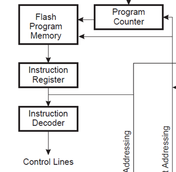
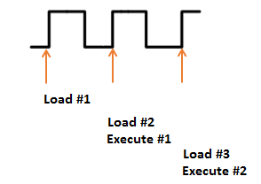
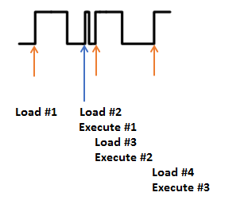
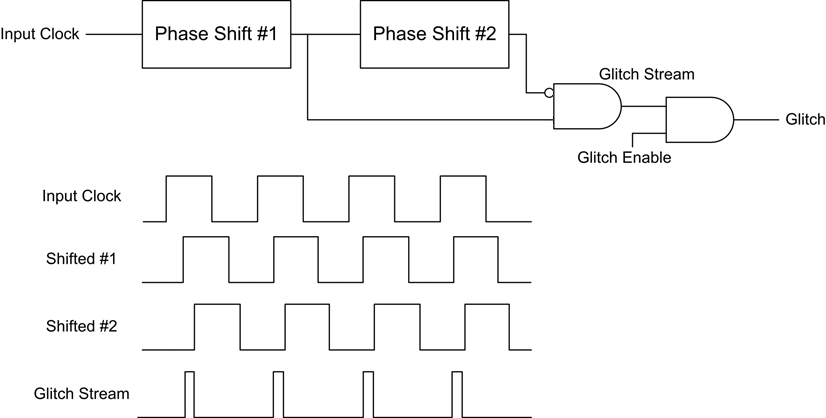
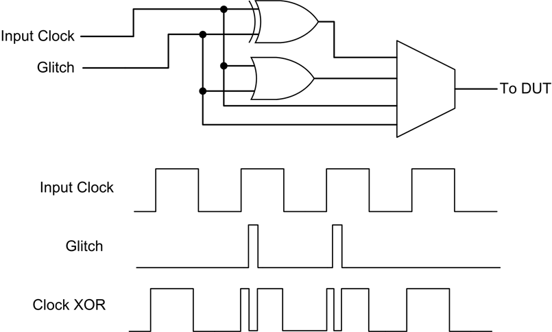

Part 1, Topic 1: Introduction to Clock Glitching (MAIN)
=======================================================

**SUMMARY:** *Microcontrollers and FPGAs have a number of operating
conditions that must be met in order for the device to work properly.
Outside of these conditions, devices will begin to malfunction, with
more extreme violations causing the device to stop entirely or even
become damaged. By going outside these operating conditions for very
small amounts of time, we can cause a varitey of temporary malfunctions*

*In this lab, we’ll explore clock glitching, which inserts short
glitches into a device’s clock. This will be used to get a target that’s
summing numbers in a loop to arrive at the wrong result.*

**LEARNING OUTCOMES:**

-  Understand effects of clock glitching
-  Exploring ChipWhisperer’s glitch module
-  Using clock glitching to disrupt a target’s algorithm

Clock Glitching Theory
----------------------

Digital hardware devices almost always expect some form of reliable
clock. We can manipulate the clock being presented to the device to
cause unintended behaviour. We’ll be concentrating on microcontrollers
here, however other digital devices (e.g. hardware encryption
accelerators) can also have faults injected using this technique.

Consider a microcontroller first. The following figure is an excerpt
from the Atmel AVR ATMega328P datasheet:

   A2_1

Rather than loading each instruction from FLASH and performing the
entire execution, the system has a pipeline to speed up the execution
process. This means that an instruction is being decoded while the next
one is being retrieved, as the following diagram shows:

   A2_2

But if we modify the clock, we could have a situation where the system
doesn’t have enough time to actually perform an instruction. Consider
the following, where Execute #1 is effectively skipped. Before the
system has time to actually execute it another clock edge comes, causing
the microcontroller to start execution of the next instruction:

   A2_3

This causes the microcontroller to skip an instruction. Such attacks can
be immensely powerful in practice. Consider for example the following
code from ``linux-util-2.24``:

.. code:: c

   /*
    *   auth.c -- PAM authorization code, common between chsh and chfn
    *   (c) 2012 by Cody Maloney <cmaloney@theoreticalchaos.com>
    *
    *   this program is free software.  you can redistribute it and
    *   modify it under the terms of the gnu general public license.
    *   there is no warranty.
    *
    */

   #include "auth.h"
   #include "pamfail.h"

   int auth_pam(const char *service_name, uid_t uid, const char *username)
   {
       if (uid != 0) {
           pam_handle_t *pamh = NULL;
           struct pam_conv conv = { misc_conv, NULL };
           int retcode;

           retcode = pam_start(service_name, username, &conv, &pamh);
           if (pam_fail_check(pamh, retcode))
               return FALSE;

           retcode = pam_authenticate(pamh, 0);
           if (pam_fail_check(pamh, retcode))
               return FALSE;

           retcode = pam_acct_mgmt(pamh, 0);
           if (retcode == PAM_NEW_AUTHTOK_REQD)
               retcode =
                   pam_chauthtok(pamh, PAM_CHANGE_EXPIRED_AUTHTOK);
           if (pam_fail_check(pamh, retcode))
               return FALSE;

           retcode = pam_setcred(pamh, 0);
           if (pam_fail_check(pamh, retcode))
               return FALSE;

           pam_end(pamh, 0);
           /* no need to establish a session; this isn't a
            * session-oriented activity...  */
       }
       return TRUE;
   }

This is the login code for the Linux OS. Note that if we could skip the
check of ``if (uid != 0)`` and simply branch to the end, we could avoid
having to enter a password. This is the power of glitch attacks - not
that we are breaking encryption, but simply bypassing the entire
authentication module!

Glitch Hardware
~~~~~~~~~~~~~~~

The ChipWhisperer Glitch system uses the same synchronous methodology as
its Side Channel Analysis (SCA) capture. A system clock (which can come
from either the ChipWhisperer or the Device Under Test (DUT)) is used to
generate the glitches. These glitches are then inserted back into the
clock, although it’s possible to use the glitches alone for other
purposes (i.e. for voltage glitching, EM glitching).

The generation of glitches is done with two variable phase shift
modules, configured as follows:

   A2_4

In CW-Husky there is one important difference: the phase shift 1 output
is not inverted before it is ANDed with the phase shift 2 output.

The enable line is used to determine when glitches are inserted.
Glitches can be inserted continuously (useful for development) or
triggered by some event. The following figure shows how the glitch can
be muxd to output to the Device Under Test (DUT).

   A2_5

Hardware Support: CW-Lite/Pro
~~~~~~~~~~~~~~~~~~~~~~~~~~~~~

The phase shift blocks use the Digital Clock Manager (DCM) blocks within
the FPGA. These blocks have limited support for run-time configuration
of parameters such as phase delay and frequency generation, and for
maximum performance the configuration must be fixed at design time. The
Xilinx-provided run-time adjustment can shift the phase only by about
+/- 5nS in 30pS increments (exact values vary with operating
conditions).

For most operating conditions this is insufficient - if attacking a
target at 7.37MHz the clock cycle would have a period of 136nS. In order
to provide a larger adjustment range, an advanced FPGA feature called
Partial Reconfiguration (PR) is used. The PR system requires special
partial bitstreams which contain modifications to the FPGA bitstream.
These are stored as two files inside a “firmware” zip which contains
both the FPGA bitstream along with a file called ``glitchwidth.p`` and a
file called ``glitchoffset.p``. If a lone bitstream is being loaded into
the FPGA (i.e. not from the zip-file), the partial reconfiguration
system is disabled, as loading incorrect partial reconfiguration files
could damage the FPGA. This damage is mostly theoretical, more likely
the FPGA will fail to function correctly.

If in the course of following this tutorial you find the FPGA appears to
stop responding (i.e. certain features no longer work correctly), it
could be the partial reconfiguration data is incorrect.

We’ll look at how to interface with these features later in the
tutorial.

Hardware Support: CW-Husky
~~~~~~~~~~~~~~~~~~~~~~~~~~

The clock-generation logic in Husky’s 7-series FPGA is considerably
different than the 6-series FPGAs used in CW-Lite/Pro. The DCM is gone
and replaced by the much more powerful (and power hungry…) Mixed Mode
Clock Manager (MMCM). In particular for our glitching application, MMCMs
allow fine phase shift adjustments over an unlimited range, in steps as
small as 15ps. And all this without having to dynamically reconfigure
the FPGA bitfile! For this reason, the format for specifying the glitch
offset and width is different from what it was for CW-Lite/Pro. Instead
of specifiying a percentage of the source clock period, you now specify
the actual number of phase shift steps. The duration of one phase shift
step is 1/56 of the MMCM VCO clock period, which can itself be
configured to be anyhwere in the range from 600 MHz to 1200 MHz (via
``scope.clock.pll.update_fpga_vco()``).

While the MMCM is more powerful than the DCM with respect to its
features, it also requires a lot more power. For this reason, the glitch
generation circuitry is disabled by default and must be explicitly
turned on. Fear not, Husky also uses Xilinx’s XADC module to
continuously monitor its temperature, and all MMCMs are automatically
turned off at when the temperature starts getting too high, well below
dangerous levels are reached (run ``scope.XADC`` to see all its
statistics and settings).

**In [1]:**

.. code:: ipython3

    SCOPETYPE = 'OPENADC'
    PLATFORM = 'CW308_SAM4S'
    SS_VER = 'SS_VER_2_1'
    
    VERSION = 'HARDWARE'
    allowable_exceptions = None
    CRYPTO_TARGET = 'TINYAES128C'
    LONG_TEST = 'No'

**In [2]:**

.. code:: ipython3

    
    #!/usr/bin/env python
    # coding: utf-8
    
    # In[ ]:
    
    
    import chipwhisperer as cw
    
    try:
        if not scope.connectStatus:
            scope.con()
    except NameError:
        scope = cw.scope(hw_location=(5, 8))
    
    try:
        if SS_VER == "SS_VER_2_1":
            target_type = cw.targets.SimpleSerial2
        elif SS_VER == "SS_VER_2_0":
            raise OSError("SS_VER_2_0 is deprecated. Use SS_VER_2_1")
        else:
            target_type = cw.targets.SimpleSerial
    except:
        SS_VER="SS_VER_1_1"
        target_type = cw.targets.SimpleSerial
    
    try:
        target = cw.target(scope, target_type)
    except:
        print("INFO: Caught exception on reconnecting to target - attempting to reconnect to scope first.")
        print("INFO: This is a work-around when USB has died without Python knowing. Ignore errors above this line.")
        scope = cw.scope(hw_location=(5, 8))
        target = cw.target(scope, target_type)
    
    
    print("INFO: Found ChipWhisperer😍")
    
    
    # In[ ]:
    
    
    if "STM" in PLATFORM or PLATFORM == "CWLITEARM" or PLATFORM == "CWNANO":
        prog = cw.programmers.STM32FProgrammer
    elif PLATFORM == "CW303" or PLATFORM == "CWLITEXMEGA":
        prog = cw.programmers.XMEGAProgrammer
    elif "neorv32" in PLATFORM.lower():
        prog = cw.programmers.NEORV32Programmer
    elif PLATFORM == "CW308_SAM4S" or PLATFORM == "CWHUSKY":
        prog = cw.programmers.SAM4SProgrammer
    else:
        prog = None
    
    
    # In[ ]:
    
    
    import time
    time.sleep(0.05)
    scope.default_setup()
    
    def reset_target(scope):
        if PLATFORM == "CW303" or PLATFORM == "CWLITEXMEGA":
            scope.io.pdic = 'low'
            time.sleep(0.1)
            scope.io.pdic = 'high_z' #XMEGA doesn't like pdic driven high
            time.sleep(0.1) #xmega needs more startup time
        elif "neorv32" in PLATFORM.lower():
            raise IOError("Default iCE40 neorv32 build does not have external reset - reprogram device to reset")
        elif PLATFORM == "CW308_SAM4S" or PLATFORM == "CWHUSKY":
            scope.io.nrst = 'low'
            time.sleep(0.25)
            scope.io.nrst = 'high_z'
            time.sleep(0.25)
        else:  
            scope.io.nrst = 'low'
            time.sleep(0.05)
            scope.io.nrst = 'high_z'
            time.sleep(0.05)
    
    

**Out [2]:**

.. parsed-literal::

    INFO: Found ChipWhisperer😍
    scope.gain.gain                          changed from 0                         to 22                       
    scope.gain.db                            changed from 15.0                      to 25.091743119266056       
    scope.adc.samples                        changed from 131124                    to 5000                     
    scope.clock.clkgen\_freq                  changed from 0                         to 7370129.87012987         
    scope.clock.adc\_freq                     changed from 0                         to 29480519.48051948        
    scope.clock.extclk\_monitor\_enabled       changed from True                      to False                    
    scope.clock.extclk\_tolerance             changed from 1144409.1796875           to 13096723.705530167       
    scope.io.tio1                            changed from serial\_tx                 to serial\_rx                
    scope.io.tio2                            changed from serial\_rx                 to serial\_tx                
    scope.io.hs2                             changed from None                      to clkgen                   
    scope.glitch.phase\_shift\_steps           changed from 0                         to 4592                     
    scope.trace.capture.trigger\_source       changed from trace trigger, rule #0    to firmware trigger         

**In [3]:**

.. code:: bash

    %%bash -s "$PLATFORM" "$SS_VER"
    cd ../../../firmware/mcu/simpleserial-glitch
    make PLATFORM=$1 CRYPTO_TARGET=NONE SS_VER=$2 -j

**Out [3]:**

.. parsed-literal::

    SS\_VER set to SS\_VER\_2\_1
    SS\_VER set to SS\_VER\_2\_1
    .
    arm-none-eabi-gcc (15:9-2019-q4-0ubuntu1) 9.2.1 20191025 (release) [ARM/arm-9-branch revision 277599]
    Copyright (C) 2019 Free Software Foundation, Inc.
    This is free software; see the source for copying conditions.  There is NO
    warranty; not even for MERCHANTABILITY or FITNESS FOR A PARTICULAR PURPOSE.
    
    Welcome to another exciting ChipWhisperer target build!!
    Size after:
    +--------------------------------------------------------
    + Built for platform Microchip SAM4S with:
       text	   data	    bss	    dec	    hex	filename
       3392	      4	   4324	   7720	   1e28	simpleserial-glitch-CW308\_SAM4S.elf
    + CRYPTO\_TARGET = NONE
    + CRYPTO\_OPTIONS = 
    +--------------------------------------------------------

**In [4]:**

.. code:: ipython3

    fw_path = "../../../firmware/mcu/simpleserial-glitch/simpleserial-glitch-{}.hex".format(PLATFORM)
    cw.program_target(scope, prog, fw_path)
    if SS_VER=='SS_VER_2_1':
        target.reset_comms()

We’ll probably crash the target a few times while we’re trying some
glitching. Create a function to reset the target:

**In [5]:**

.. code:: ipython3

    if PLATFORM == "CWLITEXMEGA":
        def reboot_flush():            
            scope.io.pdic = False
            time.sleep(0.1)
            scope.io.pdic = "high_z"
            time.sleep(0.1)
            #Flush garbage too
            target.flush()
    else:
        def reboot_flush():            
            scope.io.nrst = False
            time.sleep(0.05)
            scope.io.nrst = "high_z"
            time.sleep(0.05)
            #Flush garbage too
            target.flush()

Communication
-------------

For this lab, we’ll be introducing a new method:
``target.simpleserial_read_witherrors()``. We’re expecting a
simpleserial response back; however, glitch will often cause the target
to crash and return an invalid string. This method will handle all that
for us. It’ll also tell us whether the response was valid and what the
error return code was. Use as follows:

**In [6]:**

.. code:: ipython3

    #Do glitch loop
    target.simpleserial_write('g', bytearray([]))
    
    val = target.simpleserial_read_witherrors('r', 4, glitch_timeout=10)#For loop check
    valid = val['valid']
    if valid:
        response = val['payload']
        raw_serial = val['full_response']
        error_code = val['rv']
    
    #print(bytearray(val['full_response'].encode('latin-1')))
    print(val)

**Out [6]:**

.. parsed-literal::

    {'valid': True, 'payload': CWbytearray(b'c4 09 00 00'), 'full\_response': CWbytearray(b'00 72 04 c4 09 00 00 15 00'), 'rv': bytearray(b'\x00')}

Target Firmware
---------------

For this lab, our goal is to get the following code to preduce an
incorrect result:

.. code:: c

   uint8_t glitch_loop(uint8_t* in)
   {
       volatile uint16_t i, j;
       volatile uint32_t cnt;
       cnt = 0;
       trigger_high();
       for(i=0; i<50; i++){
           for(j=0; j<50; j++){
               cnt++;
           }
       }
       trigger_low();
       simpleserial_put('r', 4, (uint8_t*)&cnt);
       return (cnt != 2500);
   }

As you can see, we’ve got a simple loop. This is a really good place to
start glitching for 2 reasons:

1. We’ve got a really long portion of time with a lot of instructions to
   glitch. In contrast, with the Linux example we’re be trying to target
   a single instruction.

2. For some glitching scenarios, we’re looking for a pretty specific
   glitch effect. In the Linux example, we might be banking on the
   glitch causing the target to skip an instruction instead of
   corrupting the comparison since that’s a lot more likely to get us
   where we want in the code path. For this simple loop calculation,
   pretty much any malfunction will show up in the result.

Glitch Module
-------------

All the settings/methods for the glitch module can be accessed under
``scope.glitch``. As usual, documentation for the settings and methods
can be accessed on
`ReadtheDocs <https://chipwhisperer.readthedocs.io/en/latest/api.html>`__
or with the python ``help`` command:

**In [7]:**

.. code:: ipython3

    help(scope.glitch)

**Out [7]:**

.. parsed-literal::

    Help on GlitchSettings in module chipwhisperer.capture.scopes.cwhardware.ChipWhispererGlitch object:
    
    class GlitchSettings(chipwhisperer.common.utils.util.DisableNewAttr)
     \|  GlitchSettings(cwglitch)
     \|  
     \|  Method resolution order:
     \|      GlitchSettings
     \|      chipwhisperer.common.utils.util.DisableNewAttr
     \|      builtins.object
     \|  
     \|  Methods defined here:
     \|  
     \|  \_\_init\_\_(self, cwglitch)
     \|      Initialize self.  See help(type(self)) for accurate signature.
     \|  
     \|  \_\_repr\_\_(self)
     \|      Return repr(self).
     \|  
     \|  \_\_str\_\_(self)
     \|      Return str(self).
     \|  
     \|  manualTrigger(self)
     \|  
     \|  manual\_trigger(self) -> None
     \|      Manually trigger the glitch output.
     \|      
     \|      This trigger is most useful in Manual trigger mode, where this is the
     \|      only way to cause a glitch.
     \|      
     \|      Note that for ChipWhisperer-Husky, this method will only cause a glitch
     \|      in manual mode, while on the Lite/Pro, this method will always insert a glitch.
     \|  
     \|  readStatus(self) -> tuple
     \|      Read the status of the two glitch DCMs.
     \|      
     \|      Returns:
     \|          A tuple with 4 elements::
     \|      
     \|           \* phase1: Phase shift of DCM1 (N/A for Husky),
     \|           \* phase2: Phase shift of DCM2 (N/A for Husky),
     \|           \* lock1: Whether DCM1 is locked,
     \|           \* lock2: Whether DCM2 is locked
     \|  
     \|  resetDCMs(self, keepPhase=True)
     \|      Reset the two glitch DCMs.
     \|      
     \|      This is automatically run after changing the glitch width or offset,
     \|      so this function is typically not necessary.
     \|  
     \|  ----------------------------------------------------------------------
     \|  Readonly properties defined here:
     \|  
     \|  actual\_num\_glitches
     \|      The number of glitches that were generated during the previous
     \|      glitch event (should equal scope.glitch.num\_glitches; for debugging).
     \|      CW-Husky only.
     \|  
     \|  mmcm\_locked
     \|      Whether the Xilinx MMCMs (aka DCMs/PLLs) used to generate glitches
     \|      are locked or not.
     \|  
     \|  phase\_shift\_steps
     \|      The number of phase shift steps per target clock period.
     \|      Husky only.
     \|      To change, modify clock.pll.update\_fpga\_vco()
     \|      
     \|      :Getter: Returns the number of steps.
     \|  
     \|  ----------------------------------------------------------------------
     \|  Data descriptors defined here:
     \|  
     \|  arm\_timing
     \|      When to arm the glitch in single-shot mode.
     \|      
     \|      If the glitch module is in "ext\_single" trigger mode, it must be armed
     \|      when the scope is armed. There are two timings for this event:
     \|      
     \|       \* "no\_glitch": The glitch module is not armed. Gives a moderate speedup to capture.
     \|       \* "before\_scope": The glitch module is armed first.
     \|       \* "after\_scope": The scope is armed first. This is the default.
     \|      
     \|      This setting may be helpful if trigger events are happening very early.
     \|      
     \|      If the glitch module is not in external trigger single-shot mode, this
     \|      setting has no effect.
     \|      
     \|      :Getter: Return the current arm timing ("before\_scope" or "after\_scope")
     \|      
     \|      :Setter: Change the arm timing
     \|      
     \|      Raises:
     \|         ValueError: if value not listed above
     \|  
     \|  clk\_src
     \|      The clock signal that the glitch DCM is using as input.
     \|      
     \|      This DCM can be clocked from three different sources:
     \|       \* "target": The HS1 clock from the target device (can also be AUX clock for Husky)
     \|       \* "clkgen": The CLKGEN DCM output (N/A for Husky)
     \|       \* "pll": Husky's on-board PLL clock (Husky only)
     \|      
     \|      :Getter:
     \|         Return the clock signal currently in use
     \|      
     \|      :Setter:
     \|         Change the glitch clock source
     \|      
     \|      Raises:
     \|         ValueError: New value not one of "target", "clkgen" or "pll"
     \|  
     \|  enabled
     \|      Husky only. Whether the Xilinx MMCMs used to generate glitches are
     \|      powered on or not. 7-series MMCMs are power hungry and are estimated
     \|      to consume half of the FPGA's power. If you run into temperature
     \|      issues and don't require glitching, you can power down these MMCMs.
     \|  
     \|  ext\_offset
     \|      How long the glitch module waits between a trigger and a glitch.
     \|      
     \|      After the glitch module is triggered, it waits for a number of clock
     \|      cycles before generating glitch pulses. This delay allows the glitch to
     \|      be inserted at a precise moment during the target's execution to glitch
     \|      specific instructions.
     \|      
     \|      For CW-Husky when scope.glitch.num\_glitches > 1, this parameter is a
     \|      list with scope.glitch.num\_glitches elements, each element
     \|      representing the ext\_offset value for the corresponding glitch,
     \|      relative to the previous glitch. If ext\_offset[i] = j, glitch i will
     \|      be issued 2+j cycles after the start of glitch i-1.
     \|      
     \|      For CW-Lite/Pro, scope.glitch.num\_glitches is not supported so this is
     \|      a simply an integer.
     \|      
     \|      Has no effect when trigger\_src = 'manual' or 'continuous'.
     \|      
     \|      .. note::
     \|          It is possible to get more precise offsets by clocking the
     \|          glitch module faster than the target board.
     \|      
     \|      This offset must be in the range [0, 2\*\*32).
     \|      
     \|      :Getter: Return the current external trigger offset(s). For CW-lite/pro
     \|         or when num\_glitches=1, this is an integer (for backwards
     \|         compatibility).  Otherwise, it is a MultiGlitchList, which behaves as a list,
     \|         but allows ext\_offset[x] = y to set settings for glitch x.
     \|      
     \|      :Setter: Set the external trigger offset(s). Integer for CW-lite/pro,
     \|         list of integers for Husky.
     \|      
     \|      Raises:
     \|         TypeError: if offset not an integer, or list of integers for Husky
     \|         ValueError: if any offset outside of range [0, 2\*\*32)
     \|  
     \|  num\_glitches
     \|      The number of glitch events to generate. CW-Husky only.
     \|      
     \|      Each glitch event uses the same offset and width settings. 
     \|      Glitch event x uses repeat[x] and ext\_offset[x].
     \|      
     \|      This parameter has no effect when scope.glitch.trigger\_src is set to
     \|      "manual" or "continuous".
     \|      
     \|      .. note:: Subsequent glitches are offset from the previous glitch.
     \|      
     \|      Raises:
     \|         ValueError: number outside of [1, 32].
     \|  
     \|  offset
     \|      The offset from a rising clock edge to a glitch pulse rising edge.
     \|      
     \|      For CW-Husky, offset is expressed as the number of phase shift steps.
     \|      Minimum offset is obtained at 0 (rising edge of glitch aligned with
     \|      rising edge of glitch source clock). At
     \|      scope.glitch.phase\_shift\_steps/2, the glitch rising edge is aligned
     \|      with the glitch source clock falling edge. Negative values are
     \|      allowed, but -x is equivalent to scope.glitch.phase\_shift\_steps-x. The
     \|      setting rolls over (+x is equivalent to
     \|      scope.glitch.phase\_shift\_steps+x). Run the notebook in
     \|      jupyter/demos/husky\_glitch.ipynb to visualize glitch settings.
     \|      
     \|      For other capture hardware (CW-lite, CW-pro), offset is expressed 
     \|      as a percentage of one period.
     \|      A pulse may begin anywhere from -49.8% to 49.8% away from a rising
     \|      edge, allowing glitches to be swept over the entire clock cycle.
     \|      
     \|      .. warning:: very large negative offset <-45 may result in double glitches
     \|          (CW-lite/pro only).
     \|      
     \|      :Getter: Return an int (Husky) or float (CW-lite/pro) with the current
     \|          glitch offset.
     \|      
     \|      :Setter: Set the glitch offset. For CW-lite/pro, the new value is
     \|          rounded to the nearest possible offset.
     \|      
     \|      Raises:
     \|         UserWarning: value outside range [-50, 50] (value is rounded)
     \|             (CW-lite/pro only)
     \|  
     \|  offset\_fine
     \|      The fine adjustment value on the glitch offset. N/A for Husky.
     \|      
     \|      This is a dimensionless number that makes small adjustments to the
     \|      glitch pulses' offset. Valid range is [-255, 255].
     \|      
     \|      .. warning:: This value is write-only. Reads will always return 0.
     \|      
     \|      :Getter: Returns 0
     \|      
     \|      :Setter: Update the glitch fine offset
     \|      
     \|      Raises:
     \|         TypeError: if offset not an integer
     \|         ValueError: if offset is outside of [-255, 255]
     \|  
     \|  output
     \|      The type of output produced by the glitch module.
     \|      
     \|      There are 5 ways that the glitch module can combine the clock with its
     \|      glitch pulses:
     \|      
     \|       \* "clock\_only": Output only the original input clock.
     \|       \* "glitch\_only": Output only the glitch pulses - do not use the clock.
     \|       \* "clock\_or": Output is high if either the clock or glitch are high.
     \|       \* "clock\_xor": Output is high if clock and glitch are different.
     \|       \* "enable\_only": Output is high for glitch.repeat cycles.
     \|      
     \|      Some of these settings are only useful in certain scenarios:
     \|       \* Clock glitching: "clock\_or" or "clock\_xor"
     \|       \* Voltage glitching: "glitch\_only" or "enable\_only"
     \|      
     \|      :Getter: Return the current glitch output mode (one of above strings)
     \|      
     \|      :Setter: Change the glitch output mode.
     \|      
     \|      Raises:
     \|         ValueError: if value not in above strings
     \|  
     \|  repeat
     \|      The number of glitch pulses to generate per trigger.
     \|      
     \|      When the glitch module is triggered, it produces a number of pulses
     \|      that can be combined with the clock signal. This setting allows for
     \|      the glitch module to produce stronger glitches (especially during
     \|      voltage glitching).
     \|      
     \|      For CW-Husky when scope.glitch.num\_glitches > 1, this parameter is a
     \|      list with scope.glitch.num\_glitches elements, each element
     \|      representing the repeat value for the corresponding glitch. The
     \|      maximum legal value for repeat[i] is ext\_offset[i+1]+1. If an
     \|      illegal value is specified, the glitch output may be held high for
     \|      up to 8192 cycles.
     \|      
     \|      For CW-Lite/Pro, scope.glitch.num\_glitches is not supported so this is
     \|      a simply an integer.
     \|      
     \|      Has no effect when trigger\_src = 'continuous'.
     \|      
     \|      Repeat counter must be in the range [1, 8192].
     \|      
     \|      :Getter: Return the current repeat value. For CW-lite/pro or when
     \|         num\_glitches=1, this is an integer (for backwards compatibility).
     \|         Otherwise, it is a list of integers.
     \|      
     \|      :Setter: Set the repeat counter. Integer for CW-lite/pro, list of
     \|         integers for Husky.
     \|      
     \|      Raises:
     \|         TypeError: if value not an integer, or list of integers for Husky
     \|         ValueError: if any value outside [1, 8192]
     \|  
     \|  state
     \|      Glitch FSM state. CW-Husky only. For debug.
     \|      Writing any value resets the FSM to its idle state.
     \|  
     \|  trigger\_src
     \|      The trigger signal for the glitch pulses.
     \|      
     \|      The glitch module can use four different types of triggers:
     \|       \* "continuous": Constantly trigger glitches. The following
     \|          scope.glitch parameters have no bearing in this mode: ext\_offset,
     \|          repeat, num\_glitches.
     \|       \* "manual": Only trigger glitches by calling :code:\`manual\_trigger()\`. The
     \|          following scope.glitch parameters have no bearing in this mode:
     \|          ext\_offset, num\_glitches. In this mode, calling :code:\`scope.arm()\` will
     \|          trigger a glitch as well.
     \|       \* "ext\_single": Use the trigger module. Once the scope is armed, one
     \|          set of glitch events is emitted when the trigger condition is
     \|          satisfied. Subsequent trigger conditions are ignored unless the
     \|          scope is re-armed.
     \|       \* "ext\_continuous": Use the trigger module. A set of glitch events is
     \|          emitted each time the trigger condition is satisfied, whether or
     \|          not the scope is armed.
     \|      
     \|       .. warning:: calling :code:\`scope.arm()\` in manual gitch mode will cause a glitch to trigger.
     \|      
     \|      :Getter: Return the current trigger source.
     \|      
     \|      :Setter: Change the trigger source.
     \|      
     \|      Raises:
     \|         ValueError: value not listed above.
     \|  
     \|  width
     \|      The width of a single glitch pulse.
     \|      
     \|      For CW-Husky, width is expressed as the number of phase shift steps.
     \|      Minimum width is obtained at 0. Maximum width is obtained at
     \|      scope.glitch.phase\_shift\_steps/2. Negative values are allowed, but -x
     \|      is equivalent to scope.glitch.phase\_shift\_steps-x. The setting rolls
     \|      over (+x is equivalent to scope.glitch.phase\_shift\_steps+x). Run the
     \|      notebook in jupyter/demos/husky\_glitch.ipynb to visualize glitch
     \|      settings.
     \|      
     \|      For other capture hardware (CW-lite, CW-pro), width is expressed as a
     \|      percentage of one period. One pulse can range from -49.8% to roughly
     \|      49.8% of a period. The system may not be reliable at 0%. Note that
     \|      negative widths are allowed; these act as if they are positive widths
     \|      on the other half of the clock cycle.
     \|      
     \|      :Getter: Return an int (Husky) or float (others) with the current
     \|          glitch width.
     \|      
     \|      :Setter: Update the glitch pulse width. For CW-lite/pro, the value is
     \|          adjusted to the closest possible glitch width.
     \|      
     \|      Raises:
     \|         UserWarning: Width outside of [-49.8, 49.8]. The value is rounded
     \|             to one of these. (CW-lite/pro only)
     \|  
     \|  width\_fine
     \|      The fine adjustment value on the glitch width. N/A for Husky.
     \|      
     \|      This is a dimensionless number that makes small adjustments to the
     \|      glitch pulses' width. Valid range is [-255, 255].
     \|      
     \|      .. warning:: This value is write-only. Reads will always return 0.
     \|      
     \|      :Getter: Returns 0
     \|      
     \|      :Setter: Update the glitch fine width
     \|      
     \|      Raises:
     \|         TypeError: offset not an integer
     \|         ValueError: offset is outside of [-255, 255]
     \|  
     \|  ----------------------------------------------------------------------
     \|  Data and other attributes defined here:
     \|  
     \|  \_\_annotations\_\_ = {}
     \|  
     \|  ----------------------------------------------------------------------
     \|  Methods inherited from chipwhisperer.common.utils.util.DisableNewAttr:
     \|  
     \|  \_\_setattr\_\_(self, name, value)
     \|      Implement setattr(self, name, value).
     \|  
     \|  add\_read\_only(self, name)
     \|  
     \|  disable\_newattr(self)
     \|  
     \|  disable\_strict\_newattr(self)
     \|  
     \|  enable\_newattr(self)
     \|  
     \|  remove\_read\_only(self, name)
     \|  
     \|  ----------------------------------------------------------------------
     \|  Data descriptors inherited from chipwhisperer.common.utils.util.DisableNewAttr:
     \|  
     \|  \_\_dict\_\_
     \|      dictionary for instance variables (if defined)
     \|  
     \|  \_\_weakref\_\_
     \|      list of weak references to the object (if defined)
    

We’ll first go over settings that differ between the CW Husky and the CW Lite/Pro:
^^^^^^^^^^^^^^^^^^^^^^^^^^^^^^^^^^^^^^^^^^^^^^^^^^^^^^^^^^^^^^^^^^^^^^^^^^^^^^^^^^

-  clk_src

..

   The clock signal that the glitch DCM is using as input. Can be set to
   “target” or “clkgen” In this case, we’ll be providing the clock to
   the target, so we’ll want this set to “clkgen”.

   On CW Husky, a separate PLL is used to clock the glitch module
   instead of the clkgen module. The equivalent setting here for
   “clkgen” is “pll” \* offset

..

   Where in the output clock to place the glitch. Can be in the range
   ``[-48.8, 48.8]``. Often, we’ll want to try many offsets when trying
   to glitch a target.

   On CW Husky, the range will depend on frequency of the PLL used to
   drive the glitch module (settable which can be configured to be
   anyhwere in the range from 600 MHz to 1200 MHz via
   ``scope.clock.pll.update_fpga_vco()``), but, when the glitch module
   is active, the range will be ``[0, scope.glitch.phase_shift_steps]``.
   \* width

..

   How wide to make the glitch. Can be in the range ``[-50, 50]``,
   though there is no reason to use widths < 0. Wider glitches more
   easily cause glitches, but are also more likely to crash the target,
   meaning we’ll often want to try a range of widths when attacking a
   target.

   Like offset, the range will be
   ``[0, scope.glitch.phase_shift_steps]``.

These settings, on the other hand, are the same between the Husky and the Lite/Pro:
^^^^^^^^^^^^^^^^^^^^^^^^^^^^^^^^^^^^^^^^^^^^^^^^^^^^^^^^^^^^^^^^^^^^^^^^^^^^^^^^^^^

-  output

..

   The output produced by the glitch module. For clock glitching,
   clock_xor is often the most useful option, as this inverts the clock
   during the glitch. \* ext_offset

   The number of clock cycles after the trigger to put the glitch. \*
   repeat

..

   The number of clock cycles to repeat the glitch for. Higher values
   increase the number of instructions that can be glitched, but often
   increase the risk of crashing the target.

-  trigger_src

..

   How to trigger the glitch. For this tutorial, we want to
   automatically trigger the glitch from the trigger pin only after
   arming the ChipWhipserer, so we’ll use ``ext_single``

In addition, we’ll need to tell ChipWhipserer to use the glitch module’s
output as a clock source for the target by setting
``scope.io.hs2 = "glitch"``. We’ll also setup a large ``repeat`` to make
glitching easier.

CW Glitch Controller
--------------------

To make creating a glitch loop easier, ChipWhisperer includes a glitch
controller. We’ll start of by initializing it with different potential
results of the attack. You define these to be whatever you want, but
often three groups are sufficient:

1. ``"success"``, where our glitch had the desired effect
2. ``"reset"``, where our glitch had an undesirable effect. Often, this
   effect is crashing or resetting the target, which is why we’re
   calling it ``"reset"``
3. ``"normal"``, where you glitch didn’t have a noticable effect.

We also need to tell it what glitch parameters we want to scan through,
in this case width and offset. We’ll also add a “tries” parameter which,
as the name suggests, is just there to try each setting multiple times:

**In [8]:**

.. code:: ipython3

    gc = cw.GlitchController(groups=["success", "reset", "normal"], parameters=["width", "offset", "ext_offset", "tries"])

One of the niceties of the glitch controller is that it can display our
current settings. This will update in real time as we use the glitch
controller!

**In [9]:**

.. code:: ipython3

    gc.display_stats()

**Out [9]:**

.. parsed-literal::

    IntText(value=0, description='success count:', disabled=True)

.. parsed-literal::

    IntText(value=0, description='reset count:', disabled=True)

.. parsed-literal::

    IntText(value=0, description='normal count:', disabled=True)

.. parsed-literal::

    FloatSlider(value=0.0, continuous_update=False, description='width setting:', disabled=True, max=10.0, readout…

.. parsed-literal::

    FloatSlider(value=0.0, continuous_update=False, description='offset setting:', disabled=True, max=10.0, readou…

.. parsed-literal::

    FloatSlider(value=0.0, continuous_update=False, description='ext_offset setting:', disabled=True, max=10.0, re…

.. parsed-literal::

    FloatSlider(value=0.0, continuous_update=False, description='tries setting:', disabled=True, max=10.0, readout…

We can also make a settings map that can also update in realtime as
well:

**In [10]:**

.. code:: ipython3

    gc.glitch_plot(plotdots={"success":"+g", "reset":"xr", "normal":None})

**Out [10]:**

.. raw:: html

    

        
    

.. raw:: html

    

        

      

    

    
    

.. raw:: html

    

        

      

    

    
    

Here ``plotdots`` is a dictionary that specifies how you want to plot
each group. In this case, we’re plotting ``"success"`` as a green ``+``
(``"+g"``), ``"reset"`` as a red ``x`` (``"xr"``), and we won’t be
plotting glitch attempts where nothing abnormal happens (``None``)

This plot will auto update its bounds as points are added. If you want
to specify the axis bounds, you can do so as follows:

.. code:: python

   gc.glitch_plot(plotdots={"success":"+g", "reset":"xr", "normal":None}, x_bound=(-48, 48), y_bound=(-48, 48))

You can also select which parameters you want to use for x and y, either
by index, or by its name:

.. code:: python

   # will flip width and offset axes
   gc.glitch_plot(plotdots={"success":"+g", "reset":"xr", "normal":None}, x_index=1, y_index=0)
   # or
   gc.glitch_plot(plotdots={"success":"+g", "reset":"xr", "normal":None}, x_index="offset", y_index="width")

You can set ranges for each glitch setting:

**In [11]:**

.. code:: ipython3

    gc.set_range("width", -5, 5)
    gc.set_range("offset", -5, 5)

Each setting moves from min to max based on the global step:

**In [12]:**

.. code:: ipython3

    gc.set_global_step([5.0, 2.5])

We can print out all the glitch settings to see how this looks:

**In [13]:**

.. code:: ipython3

    for glitch_setting in gc.glitch_values():
        print("offset: {:4.1f}; width: {:4.1f}".format(glitch_setting[1], glitch_setting[0]))

**Out [13]:**

.. parsed-literal::

    offset: -5.0; width: -5.0
    offset: -5.0; width: -5.0
    offset: -5.0; width: -5.0
    offset: -5.0; width: -5.0
    offset: -5.0; width: -5.0
    offset: -5.0; width: -5.0
    offset: -5.0; width: -5.0
    offset: -5.0; width: -5.0
    offset: -5.0; width: -5.0
    offset: -5.0; width: -5.0
    offset: -5.0; width: -5.0
    offset: -5.0; width: -5.0
    offset: -5.0; width: -5.0
    offset: -5.0; width: -5.0
    offset: -5.0; width: -5.0
    offset: -5.0; width: -5.0
    offset: -5.0; width: -5.0
    offset: -5.0; width: -5.0
    offset: -5.0; width: -5.0
    offset: -5.0; width: -5.0
    offset: -5.0; width: -5.0
    offset: -5.0; width: -5.0
    offset: -5.0; width: -5.0
    offset: -5.0; width: -5.0
    offset: -5.0; width: -5.0
    offset: -5.0; width: -5.0
    offset: -5.0; width: -5.0
    offset: -5.0; width: -5.0
    offset: -5.0; width: -5.0
    offset: -5.0; width: -5.0
    offset: -5.0; width: -5.0
    offset: -5.0; width: -5.0
    offset: -5.0; width: -5.0
    offset: -5.0; width: -5.0
    offset: -5.0; width: -5.0
    offset: -5.0; width: -5.0
    offset: -5.0; width: -5.0
    offset: -5.0; width: -5.0
    offset: -5.0; width: -5.0
    offset: -5.0; width: -5.0
    offset: -5.0; width: -5.0
    offset: -5.0; width: -5.0
    offset: -5.0; width: -5.0
    offset: -5.0; width: -5.0
    offset: -5.0; width: -5.0
    offset: -5.0; width: -5.0
    offset: -5.0; width: -5.0
    offset: -5.0; width: -5.0
    offset: -5.0; width: -5.0
    offset:  0.0; width: -5.0
    offset:  0.0; width: -5.0
    offset:  0.0; width: -5.0
    offset:  0.0; width: -5.0
    offset:  0.0; width: -5.0
    offset:  0.0; width: -5.0
    offset:  0.0; width: -5.0
    offset:  0.0; width: -5.0
    offset:  0.0; width: -5.0
    offset:  0.0; width: -5.0
    offset:  0.0; width: -5.0
    offset:  0.0; width: -5.0
    offset:  0.0; width: -5.0
    offset:  0.0; width: -5.0
    offset:  0.0; width: -5.0
    offset:  0.0; width: -5.0
    offset:  0.0; width: -5.0
    offset:  0.0; width: -5.0
    offset:  0.0; width: -5.0
    offset:  0.0; width: -5.0
    offset:  0.0; width: -5.0
    offset:  0.0; width: -5.0
    offset:  0.0; width: -5.0
    offset:  0.0; width: -5.0
    offset:  0.0; width: -5.0
    offset:  0.0; width: -5.0
    offset:  0.0; width: -5.0
    offset:  0.0; width: -5.0
    offset:  0.0; width: -5.0
    offset:  0.0; width: -5.0
    offset:  0.0; width: -5.0
    offset:  0.0; width: -5.0
    offset:  0.0; width: -5.0
    offset:  0.0; width: -5.0
    offset:  0.0; width: -5.0
    offset:  0.0; width: -5.0
    offset:  0.0; width: -5.0
    offset:  0.0; width: -5.0
    offset:  0.0; width: -5.0
    offset:  0.0; width: -5.0
    offset:  0.0; width: -5.0
    offset:  0.0; width: -5.0
    offset:  0.0; width: -5.0
    offset:  0.0; width: -5.0
    offset:  0.0; width: -5.0
    offset:  0.0; width: -5.0
    offset:  0.0; width: -5.0
    offset:  0.0; width: -5.0
    offset:  0.0; width: -5.0
    offset:  5.0; width: -5.0
    offset:  5.0; width: -5.0
    offset:  5.0; width: -5.0
    offset:  5.0; width: -5.0
    offset:  5.0; width: -5.0
    offset:  5.0; width: -5.0
    offset:  5.0; width: -5.0
    offset:  5.0; width: -5.0
    offset:  5.0; width: -5.0
    offset:  5.0; width: -5.0
    offset:  5.0; width: -5.0
    offset:  5.0; width: -5.0
    offset:  5.0; width: -5.0
    offset:  5.0; width: -5.0
    offset:  5.0; width: -5.0
    offset:  5.0; width: -5.0
    offset:  5.0; width: -5.0
    offset:  5.0; width: -5.0
    offset:  5.0; width: -5.0
    offset:  5.0; width: -5.0
    offset:  5.0; width: -5.0
    offset:  5.0; width: -5.0
    offset:  5.0; width: -5.0
    offset:  5.0; width: -5.0
    offset:  5.0; width: -5.0
    offset:  5.0; width: -5.0
    offset:  5.0; width: -5.0
    offset:  5.0; width: -5.0
    offset:  5.0; width: -5.0
    offset:  5.0; width: -5.0
    offset:  5.0; width: -5.0
    offset:  5.0; width: -5.0
    offset:  5.0; width: -5.0
    offset:  5.0; width: -5.0
    offset:  5.0; width: -5.0
    offset:  5.0; width: -5.0
    offset:  5.0; width: -5.0
    offset:  5.0; width: -5.0
    offset:  5.0; width: -5.0
    offset:  5.0; width: -5.0
    offset:  5.0; width: -5.0
    offset:  5.0; width: -5.0
    offset:  5.0; width: -5.0
    offset:  5.0; width: -5.0
    offset:  5.0; width: -5.0
    offset:  5.0; width: -5.0
    offset:  5.0; width: -5.0
    offset:  5.0; width: -5.0
    offset:  5.0; width: -5.0
    offset: -2.5; width: -5.0
    offset: -2.5; width: -5.0
    offset: -2.5; width: -5.0
    offset: -2.5; width: -5.0
    offset: -2.5; width: -5.0
    offset: -2.5; width: -5.0
    offset: -2.5; width: -5.0
    offset: -2.5; width: -5.0
    offset: -2.5; width: -5.0
    offset: -2.5; width: -5.0
    offset: -2.5; width: -5.0
    offset: -2.5; width: -5.0
    offset: -2.5; width: -5.0
    offset: -2.5; width: -5.0
    offset: -2.5; width: -5.0
    offset: -2.5; width: -5.0
    offset: -2.5; width: -5.0
    offset: -2.5; width: -5.0
    offset: -2.5; width: -5.0
    offset: -2.5; width: -5.0
    offset: -2.5; width: -5.0
    offset: -2.5; width: -5.0
    offset: -2.5; width: -5.0
    offset: -2.5; width: -5.0
    offset: -2.5; width: -5.0
    offset: -2.5; width: -5.0
    offset: -2.5; width: -5.0
    offset: -2.5; width: -5.0
    offset: -2.5; width: -5.0
    offset: -2.5; width: -5.0
    offset: -2.5; width: -5.0
    offset: -2.5; width: -5.0
    offset: -2.5; width: -5.0
    offset: -2.5; width: -5.0
    offset: -2.5; width: -5.0
    offset: -2.5; width: -5.0
    offset: -2.5; width: -5.0
    offset: -2.5; width: -5.0
    offset: -2.5; width: -5.0
    offset: -2.5; width: -5.0
    offset: -2.5; width: -5.0
    offset: -2.5; width: -5.0
    offset: -2.5; width: -5.0
    offset: -2.5; width: -5.0
    offset: -2.5; width: -5.0
    offset: -2.5; width: -5.0
    offset: -2.5; width: -5.0
    offset: -2.5; width: -5.0
    offset: -2.5; width: -5.0
    offset:  0.0; width: -5.0
    offset:  0.0; width: -5.0
    offset:  0.0; width: -5.0
    offset:  0.0; width: -5.0
    offset:  0.0; width: -5.0
    offset:  0.0; width: -5.0
    offset:  0.0; width: -5.0
    offset:  0.0; width: -5.0
    offset:  0.0; width: -5.0
    offset:  0.0; width: -5.0
    offset:  0.0; width: -5.0
    offset:  0.0; width: -5.0
    offset:  0.0; width: -5.0
    offset:  0.0; width: -5.0
    offset:  0.0; width: -5.0
    offset:  0.0; width: -5.0
    offset:  0.0; width: -5.0
    offset:  0.0; width: -5.0
    offset:  0.0; width: -5.0
    offset:  0.0; width: -5.0
    offset:  0.0; width: -5.0
    offset:  0.0; width: -5.0
    offset:  0.0; width: -5.0
    offset:  0.0; width: -5.0
    offset:  0.0; width: -5.0
    offset:  0.0; width: -5.0
    offset:  0.0; width: -5.0
    offset:  0.0; width: -5.0
    offset:  0.0; width: -5.0
    offset:  0.0; width: -5.0
    offset:  0.0; width: -5.0
    offset:  0.0; width: -5.0
    offset:  0.0; width: -5.0
    offset:  0.0; width: -5.0
    offset:  0.0; width: -5.0
    offset:  0.0; width: -5.0
    offset:  0.0; width: -5.0
    offset:  0.0; width: -5.0
    offset:  0.0; width: -5.0
    offset:  0.0; width: -5.0
    offset:  0.0; width: -5.0
    offset:  0.0; width: -5.0
    offset:  0.0; width: -5.0
    offset:  0.0; width: -5.0
    offset:  0.0; width: -5.0
    offset:  0.0; width: -5.0
    offset:  0.0; width: -5.0
    offset:  0.0; width: -5.0
    offset:  0.0; width: -5.0
    offset:  2.5; width: -5.0
    offset:  2.5; width: -5.0
    offset:  2.5; width: -5.0
    offset:  2.5; width: -5.0
    offset:  2.5; width: -5.0
    offset:  2.5; width: -5.0
    offset:  2.5; width: -5.0
    offset:  2.5; width: -5.0
    offset:  2.5; width: -5.0
    offset:  2.5; width: -5.0
    offset:  2.5; width: -5.0
    offset:  2.5; width: -5.0
    offset:  2.5; width: -5.0
    offset:  2.5; width: -5.0
    offset:  2.5; width: -5.0
    offset:  2.5; width: -5.0
    offset:  2.5; width: -5.0
    offset:  2.5; width: -5.0
    offset:  2.5; width: -5.0
    offset:  2.5; width: -5.0
    offset:  2.5; width: -5.0
    offset:  2.5; width: -5.0
    offset:  2.5; width: -5.0
    offset:  2.5; width: -5.0
    offset:  2.5; width: -5.0
    offset:  2.5; width: -5.0
    offset:  2.5; width: -5.0
    offset:  2.5; width: -5.0
    offset:  2.5; width: -5.0
    offset:  2.5; width: -5.0
    offset:  2.5; width: -5.0
    offset:  2.5; width: -5.0
    offset:  2.5; width: -5.0
    offset:  2.5; width: -5.0
    offset:  2.5; width: -5.0
    offset:  2.5; width: -5.0
    offset:  2.5; width: -5.0
    offset:  2.5; width: -5.0
    offset:  2.5; width: -5.0
    offset:  2.5; width: -5.0
    offset:  2.5; width: -5.0
    offset:  2.5; width: -5.0
    offset:  2.5; width: -5.0
    offset:  2.5; width: -5.0
    offset:  2.5; width: -5.0
    offset:  2.5; width: -5.0
    offset:  2.5; width: -5.0
    offset:  2.5; width: -5.0
    offset:  2.5; width: -5.0
    offset:  5.0; width: -5.0
    offset:  5.0; width: -5.0
    offset:  5.0; width: -5.0
    offset:  5.0; width: -5.0
    offset:  5.0; width: -5.0
    offset:  5.0; width: -5.0
    offset:  5.0; width: -5.0
    offset:  5.0; width: -5.0
    offset:  5.0; width: -5.0
    offset:  5.0; width: -5.0
    offset:  5.0; width: -5.0
    offset:  5.0; width: -5.0
    offset:  5.0; width: -5.0
    offset:  5.0; width: -5.0
    offset:  5.0; width: -5.0
    offset:  5.0; width: -5.0
    offset:  5.0; width: -5.0
    offset:  5.0; width: -5.0
    offset:  5.0; width: -5.0
    offset:  5.0; width: -5.0
    offset:  5.0; width: -5.0
    offset:  5.0; width: -5.0
    offset:  5.0; width: -5.0
    offset:  5.0; width: -5.0
    offset:  5.0; width: -5.0
    offset:  5.0; width: -5.0
    offset:  5.0; width: -5.0
    offset:  5.0; width: -5.0
    offset:  5.0; width: -5.0
    offset:  5.0; width: -5.0
    offset:  5.0; width: -5.0
    offset:  5.0; width: -5.0
    offset:  5.0; width: -5.0
    offset:  5.0; width: -5.0
    offset:  5.0; width: -5.0
    offset:  5.0; width: -5.0
    offset:  5.0; width: -5.0
    offset:  5.0; width: -5.0
    offset:  5.0; width: -5.0
    offset:  5.0; width: -5.0
    offset:  5.0; width: -5.0
    offset:  5.0; width: -5.0
    offset:  5.0; width: -5.0
    offset:  5.0; width: -5.0
    offset:  5.0; width: -5.0
    offset:  5.0; width: -5.0
    offset:  5.0; width: -5.0
    offset:  5.0; width: -5.0
    offset:  5.0; width: -5.0
    offset: -5.0; width:  0.0
    offset: -5.0; width:  0.0
    offset: -5.0; width:  0.0
    offset: -5.0; width:  0.0
    offset: -5.0; width:  0.0
    offset: -5.0; width:  0.0
    offset: -5.0; width:  0.0
    offset: -5.0; width:  0.0
    offset: -5.0; width:  0.0
    offset: -5.0; width:  0.0
    offset: -5.0; width:  0.0
    offset: -5.0; width:  0.0
    offset: -5.0; width:  0.0
    offset: -5.0; width:  0.0
    offset: -5.0; width:  0.0
    offset: -5.0; width:  0.0
    offset: -5.0; width:  0.0
    offset: -5.0; width:  0.0
    offset: -5.0; width:  0.0
    offset: -5.0; width:  0.0
    offset: -5.0; width:  0.0
    offset: -5.0; width:  0.0
    offset: -5.0; width:  0.0
    offset: -5.0; width:  0.0
    offset: -5.0; width:  0.0
    offset: -5.0; width:  0.0
    offset: -5.0; width:  0.0
    offset: -5.0; width:  0.0
    offset: -5.0; width:  0.0
    offset: -5.0; width:  0.0
    offset: -5.0; width:  0.0
    offset: -5.0; width:  0.0
    offset: -5.0; width:  0.0
    offset: -5.0; width:  0.0
    offset: -5.0; width:  0.0
    offset: -5.0; width:  0.0
    offset: -5.0; width:  0.0
    offset: -5.0; width:  0.0
    offset: -5.0; width:  0.0
    offset: -5.0; width:  0.0
    offset: -5.0; width:  0.0
    offset: -5.0; width:  0.0
    offset: -5.0; width:  0.0
    offset: -5.0; width:  0.0
    offset: -5.0; width:  0.0
    offset: -5.0; width:  0.0
    offset: -5.0; width:  0.0
    offset: -5.0; width:  0.0
    offset: -5.0; width:  0.0
    offset:  0.0; width:  0.0
    offset:  0.0; width:  0.0
    offset:  0.0; width:  0.0
    offset:  0.0; width:  0.0
    offset:  0.0; width:  0.0
    offset:  0.0; width:  0.0
    offset:  0.0; width:  0.0
    offset:  0.0; width:  0.0
    offset:  0.0; width:  0.0
    offset:  0.0; width:  0.0
    offset:  0.0; width:  0.0
    offset:  0.0; width:  0.0
    offset:  0.0; width:  0.0
    offset:  0.0; width:  0.0
    offset:  0.0; width:  0.0
    offset:  0.0; width:  0.0
    offset:  0.0; width:  0.0
    offset:  0.0; width:  0.0
    offset:  0.0; width:  0.0
    offset:  0.0; width:  0.0
    offset:  0.0; width:  0.0
    offset:  0.0; width:  0.0
    offset:  0.0; width:  0.0
    offset:  0.0; width:  0.0
    offset:  0.0; width:  0.0
    offset:  0.0; width:  0.0
    offset:  0.0; width:  0.0
    offset:  0.0; width:  0.0
    offset:  0.0; width:  0.0
    offset:  0.0; width:  0.0
    offset:  0.0; width:  0.0
    offset:  0.0; width:  0.0
    offset:  0.0; width:  0.0
    offset:  0.0; width:  0.0
    offset:  0.0; width:  0.0
    offset:  0.0; width:  0.0
    offset:  0.0; width:  0.0
    offset:  0.0; width:  0.0
    offset:  0.0; width:  0.0
    offset:  0.0; width:  0.0
    offset:  0.0; width:  0.0
    offset:  0.0; width:  0.0
    offset:  0.0; width:  0.0
    offset:  0.0; width:  0.0
    offset:  0.0; width:  0.0
    offset:  0.0; width:  0.0
    offset:  0.0; width:  0.0
    offset:  0.0; width:  0.0
    offset:  0.0; width:  0.0
    offset:  5.0; width:  0.0
    offset:  5.0; width:  0.0
    offset:  5.0; width:  0.0
    offset:  5.0; width:  0.0
    offset:  5.0; width:  0.0
    offset:  5.0; width:  0.0
    offset:  5.0; width:  0.0
    offset:  5.0; width:  0.0
    offset:  5.0; width:  0.0
    offset:  5.0; width:  0.0
    offset:  5.0; width:  0.0
    offset:  5.0; width:  0.0
    offset:  5.0; width:  0.0
    offset:  5.0; width:  0.0
    offset:  5.0; width:  0.0
    offset:  5.0; width:  0.0
    offset:  5.0; width:  0.0
    offset:  5.0; width:  0.0
    offset:  5.0; width:  0.0
    offset:  5.0; width:  0.0
    offset:  5.0; width:  0.0
    offset:  5.0; width:  0.0
    offset:  5.0; width:  0.0
    offset:  5.0; width:  0.0
    offset:  5.0; width:  0.0
    offset:  5.0; width:  0.0
    offset:  5.0; width:  0.0
    offset:  5.0; width:  0.0
    offset:  5.0; width:  0.0
    offset:  5.0; width:  0.0
    offset:  5.0; width:  0.0
    offset:  5.0; width:  0.0
    offset:  5.0; width:  0.0
    offset:  5.0; width:  0.0
    offset:  5.0; width:  0.0
    offset:  5.0; width:  0.0
    offset:  5.0; width:  0.0
    offset:  5.0; width:  0.0
    offset:  5.0; width:  0.0
    offset:  5.0; width:  0.0
    offset:  5.0; width:  0.0
    offset:  5.0; width:  0.0
    offset:  5.0; width:  0.0
    offset:  5.0; width:  0.0
    offset:  5.0; width:  0.0
    offset:  5.0; width:  0.0
    offset:  5.0; width:  0.0
    offset:  5.0; width:  0.0
    offset:  5.0; width:  0.0
    offset: -2.5; width:  0.0
    offset: -2.5; width:  0.0
    offset: -2.5; width:  0.0
    offset: -2.5; width:  0.0
    offset: -2.5; width:  0.0
    offset: -2.5; width:  0.0
    offset: -2.5; width:  0.0
    offset: -2.5; width:  0.0
    offset: -2.5; width:  0.0
    offset: -2.5; width:  0.0
    offset: -2.5; width:  0.0
    offset: -2.5; width:  0.0
    offset: -2.5; width:  0.0
    offset: -2.5; width:  0.0
    offset: -2.5; width:  0.0
    offset: -2.5; width:  0.0
    offset: -2.5; width:  0.0
    offset: -2.5; width:  0.0
    offset: -2.5; width:  0.0
    offset: -2.5; width:  0.0
    offset: -2.5; width:  0.0
    offset: -2.5; width:  0.0
    offset: -2.5; width:  0.0
    offset: -2.5; width:  0.0
    offset: -2.5; width:  0.0
    offset: -2.5; width:  0.0
    offset: -2.5; width:  0.0
    offset: -2.5; width:  0.0
    offset: -2.5; width:  0.0
    offset: -2.5; width:  0.0
    offset: -2.5; width:  0.0
    offset: -2.5; width:  0.0
    offset: -2.5; width:  0.0
    offset: -2.5; width:  0.0
    offset: -2.5; width:  0.0
    offset: -2.5; width:  0.0
    offset: -2.5; width:  0.0
    offset: -2.5; width:  0.0
    offset: -2.5; width:  0.0
    offset: -2.5; width:  0.0
    offset: -2.5; width:  0.0
    offset: -2.5; width:  0.0
    offset: -2.5; width:  0.0
    offset: -2.5; width:  0.0
    offset: -2.5; width:  0.0
    offset: -2.5; width:  0.0
    offset: -2.5; width:  0.0
    offset: -2.5; width:  0.0
    offset: -2.5; width:  0.0
    offset:  0.0; width:  0.0
    offset:  0.0; width:  0.0
    offset:  0.0; width:  0.0
    offset:  0.0; width:  0.0
    offset:  0.0; width:  0.0
    offset:  0.0; width:  0.0
    offset:  0.0; width:  0.0
    offset:  0.0; width:  0.0
    offset:  0.0; width:  0.0
    offset:  0.0; width:  0.0
    offset:  0.0; width:  0.0
    offset:  0.0; width:  0.0
    offset:  0.0; width:  0.0
    offset:  0.0; width:  0.0
    offset:  0.0; width:  0.0
    offset:  0.0; width:  0.0
    offset:  0.0; width:  0.0
    offset:  0.0; width:  0.0
    offset:  0.0; width:  0.0
    offset:  0.0; width:  0.0
    offset:  0.0; width:  0.0
    offset:  0.0; width:  0.0
    offset:  0.0; width:  0.0
    offset:  0.0; width:  0.0
    offset:  0.0; width:  0.0
    offset:  0.0; width:  0.0
    offset:  0.0; width:  0.0
    offset:  0.0; width:  0.0
    offset:  0.0; width:  0.0
    offset:  0.0; width:  0.0
    offset:  0.0; width:  0.0
    offset:  0.0; width:  0.0
    offset:  0.0; width:  0.0
    offset:  0.0; width:  0.0
    offset:  0.0; width:  0.0
    offset:  0.0; width:  0.0
    offset:  0.0; width:  0.0
    offset:  0.0; width:  0.0
    offset:  0.0; width:  0.0
    offset:  0.0; width:  0.0
    offset:  0.0; width:  0.0
    offset:  0.0; width:  0.0
    offset:  0.0; width:  0.0
    offset:  0.0; width:  0.0
    offset:  0.0; width:  0.0
    offset:  0.0; width:  0.0
    offset:  0.0; width:  0.0
    offset:  0.0; width:  0.0
    offset:  0.0; width:  0.0
    offset:  2.5; width:  0.0
    offset:  2.5; width:  0.0
    offset:  2.5; width:  0.0
    offset:  2.5; width:  0.0
    offset:  2.5; width:  0.0
    offset:  2.5; width:  0.0
    offset:  2.5; width:  0.0
    offset:  2.5; width:  0.0
    offset:  2.5; width:  0.0
    offset:  2.5; width:  0.0
    offset:  2.5; width:  0.0
    offset:  2.5; width:  0.0
    offset:  2.5; width:  0.0
    offset:  2.5; width:  0.0
    offset:  2.5; width:  0.0
    offset:  2.5; width:  0.0
    offset:  2.5; width:  0.0
    offset:  2.5; width:  0.0
    offset:  2.5; width:  0.0
    offset:  2.5; width:  0.0
    offset:  2.5; width:  0.0
    offset:  2.5; width:  0.0
    offset:  2.5; width:  0.0
    offset:  2.5; width:  0.0
    offset:  2.5; width:  0.0
    offset:  2.5; width:  0.0
    offset:  2.5; width:  0.0
    offset:  2.5; width:  0.0
    offset:  2.5; width:  0.0
    offset:  2.5; width:  0.0
    offset:  2.5; width:  0.0
    offset:  2.5; width:  0.0
    offset:  2.5; width:  0.0
    offset:  2.5; width:  0.0
    offset:  2.5; width:  0.0
    offset:  2.5; width:  0.0
    offset:  2.5; width:  0.0
    offset:  2.5; width:  0.0
    offset:  2.5; width:  0.0
    offset:  2.5; width:  0.0
    offset:  2.5; width:  0.0
    offset:  2.5; width:  0.0
    offset:  2.5; width:  0.0
    offset:  2.5; width:  0.0
    offset:  2.5; width:  0.0
    offset:  2.5; width:  0.0
    offset:  2.5; width:  0.0
    offset:  2.5; width:  0.0
    offset:  2.5; width:  0.0
    offset:  5.0; width:  0.0
    offset:  5.0; width:  0.0
    offset:  5.0; width:  0.0
    offset:  5.0; width:  0.0
    offset:  5.0; width:  0.0
    offset:  5.0; width:  0.0
    offset:  5.0; width:  0.0
    offset:  5.0; width:  0.0
    offset:  5.0; width:  0.0
    offset:  5.0; width:  0.0
    offset:  5.0; width:  0.0
    offset:  5.0; width:  0.0
    offset:  5.0; width:  0.0
    offset:  5.0; width:  0.0
    offset:  5.0; width:  0.0
    offset:  5.0; width:  0.0
    offset:  5.0; width:  0.0
    offset:  5.0; width:  0.0
    offset:  5.0; width:  0.0
    offset:  5.0; width:  0.0
    offset:  5.0; width:  0.0
    offset:  5.0; width:  0.0
    offset:  5.0; width:  0.0
    offset:  5.0; width:  0.0
    offset:  5.0; width:  0.0
    offset:  5.0; width:  0.0
    offset:  5.0; width:  0.0
    offset:  5.0; width:  0.0
    offset:  5.0; width:  0.0
    offset:  5.0; width:  0.0
    offset:  5.0; width:  0.0
    offset:  5.0; width:  0.0
    offset:  5.0; width:  0.0
    offset:  5.0; width:  0.0
    offset:  5.0; width:  0.0
    offset:  5.0; width:  0.0
    offset:  5.0; width:  0.0
    offset:  5.0; width:  0.0
    offset:  5.0; width:  0.0
    offset:  5.0; width:  0.0
    offset:  5.0; width:  0.0
    offset:  5.0; width:  0.0
    offset:  5.0; width:  0.0
    offset:  5.0; width:  0.0
    offset:  5.0; width:  0.0
    offset:  5.0; width:  0.0
    offset:  5.0; width:  0.0
    offset:  5.0; width:  0.0
    offset:  5.0; width:  0.0
    offset: -5.0; width:  5.0
    offset: -5.0; width:  5.0
    offset: -5.0; width:  5.0
    offset: -5.0; width:  5.0
    offset: -5.0; width:  5.0
    offset: -5.0; width:  5.0
    offset: -5.0; width:  5.0
    offset: -5.0; width:  5.0
    offset: -5.0; width:  5.0
    offset: -5.0; width:  5.0
    offset: -5.0; width:  5.0
    offset: -5.0; width:  5.0
    offset: -5.0; width:  5.0
    offset: -5.0; width:  5.0
    offset: -5.0; width:  5.0
    offset: -5.0; width:  5.0
    offset: -5.0; width:  5.0
    offset: -5.0; width:  5.0
    offset: -5.0; width:  5.0
    offset: -5.0; width:  5.0
    offset: -5.0; width:  5.0
    offset: -5.0; width:  5.0
    offset: -5.0; width:  5.0
    offset: -5.0; width:  5.0
    offset: -5.0; width:  5.0
    offset: -5.0; width:  5.0
    offset: -5.0; width:  5.0
    offset: -5.0; width:  5.0
    offset: -5.0; width:  5.0
    offset: -5.0; width:  5.0
    offset: -5.0; width:  5.0
    offset: -5.0; width:  5.0
    offset: -5.0; width:  5.0
    offset: -5.0; width:  5.0
    offset: -5.0; width:  5.0
    offset: -5.0; width:  5.0
    offset: -5.0; width:  5.0
    offset: -5.0; width:  5.0
    offset: -5.0; width:  5.0
    offset: -5.0; width:  5.0
    offset: -5.0; width:  5.0
    offset: -5.0; width:  5.0
    offset: -5.0; width:  5.0
    offset: -5.0; width:  5.0
    offset: -5.0; width:  5.0
    offset: -5.0; width:  5.0
    offset: -5.0; width:  5.0
    offset: -5.0; width:  5.0
    offset: -5.0; width:  5.0
    offset:  0.0; width:  5.0
    offset:  0.0; width:  5.0
    offset:  0.0; width:  5.0
    offset:  0.0; width:  5.0
    offset:  0.0; width:  5.0
    offset:  0.0; width:  5.0
    offset:  0.0; width:  5.0
    offset:  0.0; width:  5.0
    offset:  0.0; width:  5.0
    offset:  0.0; width:  5.0
    offset:  0.0; width:  5.0
    offset:  0.0; width:  5.0
    offset:  0.0; width:  5.0
    offset:  0.0; width:  5.0
    offset:  0.0; width:  5.0
    offset:  0.0; width:  5.0
    offset:  0.0; width:  5.0
    offset:  0.0; width:  5.0
    offset:  0.0; width:  5.0
    offset:  0.0; width:  5.0
    offset:  0.0; width:  5.0
    offset:  0.0; width:  5.0
    offset:  0.0; width:  5.0
    offset:  0.0; width:  5.0
    offset:  0.0; width:  5.0
    offset:  0.0; width:  5.0
    offset:  0.0; width:  5.0
    offset:  0.0; width:  5.0
    offset:  0.0; width:  5.0
    offset:  0.0; width:  5.0
    offset:  0.0; width:  5.0
    offset:  0.0; width:  5.0
    offset:  0.0; width:  5.0
    offset:  0.0; width:  5.0
    offset:  0.0; width:  5.0
    offset:  0.0; width:  5.0
    offset:  0.0; width:  5.0
    offset:  0.0; width:  5.0
    offset:  0.0; width:  5.0
    offset:  0.0; width:  5.0
    offset:  0.0; width:  5.0
    offset:  0.0; width:  5.0
    offset:  0.0; width:  5.0
    offset:  0.0; width:  5.0
    offset:  0.0; width:  5.0
    offset:  0.0; width:  5.0
    offset:  0.0; width:  5.0
    offset:  0.0; width:  5.0
    offset:  0.0; width:  5.0
    offset:  5.0; width:  5.0
    offset:  5.0; width:  5.0
    offset:  5.0; width:  5.0
    offset:  5.0; width:  5.0
    offset:  5.0; width:  5.0
    offset:  5.0; width:  5.0
    offset:  5.0; width:  5.0
    offset:  5.0; width:  5.0
    offset:  5.0; width:  5.0
    offset:  5.0; width:  5.0
    offset:  5.0; width:  5.0
    offset:  5.0; width:  5.0
    offset:  5.0; width:  5.0
    offset:  5.0; width:  5.0
    offset:  5.0; width:  5.0
    offset:  5.0; width:  5.0
    offset:  5.0; width:  5.0
    offset:  5.0; width:  5.0
    offset:  5.0; width:  5.0
    offset:  5.0; width:  5.0
    offset:  5.0; width:  5.0
    offset:  5.0; width:  5.0
    offset:  5.0; width:  5.0
    offset:  5.0; width:  5.0
    offset:  5.0; width:  5.0
    offset:  5.0; width:  5.0
    offset:  5.0; width:  5.0
    offset:  5.0; width:  5.0
    offset:  5.0; width:  5.0
    offset:  5.0; width:  5.0
    offset:  5.0; width:  5.0
    offset:  5.0; width:  5.0
    offset:  5.0; width:  5.0
    offset:  5.0; width:  5.0
    offset:  5.0; width:  5.0
    offset:  5.0; width:  5.0
    offset:  5.0; width:  5.0
    offset:  5.0; width:  5.0
    offset:  5.0; width:  5.0
    offset:  5.0; width:  5.0
    offset:  5.0; width:  5.0
    offset:  5.0; width:  5.0
    offset:  5.0; width:  5.0
    offset:  5.0; width:  5.0
    offset:  5.0; width:  5.0
    offset:  5.0; width:  5.0
    offset:  5.0; width:  5.0
    offset:  5.0; width:  5.0
    offset:  5.0; width:  5.0
    offset: -2.5; width:  5.0
    offset: -2.5; width:  5.0
    offset: -2.5; width:  5.0
    offset: -2.5; width:  5.0
    offset: -2.5; width:  5.0
    offset: -2.5; width:  5.0
    offset: -2.5; width:  5.0
    offset: -2.5; width:  5.0
    offset: -2.5; width:  5.0
    offset: -2.5; width:  5.0
    offset: -2.5; width:  5.0
    offset: -2.5; width:  5.0
    offset: -2.5; width:  5.0
    offset: -2.5; width:  5.0
    offset: -2.5; width:  5.0
    offset: -2.5; width:  5.0
    offset: -2.5; width:  5.0
    offset: -2.5; width:  5.0
    offset: -2.5; width:  5.0
    offset: -2.5; width:  5.0
    offset: -2.5; width:  5.0
    offset: -2.5; width:  5.0
    offset: -2.5; width:  5.0
    offset: -2.5; width:  5.0
    offset: -2.5; width:  5.0
    offset: -2.5; width:  5.0
    offset: -2.5; width:  5.0
    offset: -2.5; width:  5.0
    offset: -2.5; width:  5.0
    offset: -2.5; width:  5.0
    offset: -2.5; width:  5.0
    offset: -2.5; width:  5.0
    offset: -2.5; width:  5.0
    offset: -2.5; width:  5.0
    offset: -2.5; width:  5.0
    offset: -2.5; width:  5.0
    offset: -2.5; width:  5.0
    offset: -2.5; width:  5.0
    offset: -2.5; width:  5.0
    offset: -2.5; width:  5.0
    offset: -2.5; width:  5.0
    offset: -2.5; width:  5.0
    offset: -2.5; width:  5.0
    offset: -2.5; width:  5.0
    offset: -2.5; width:  5.0
    offset: -2.5; width:  5.0
    offset: -2.5; width:  5.0
    offset: -2.5; width:  5.0
    offset: -2.5; width:  5.0
    offset:  0.0; width:  5.0
    offset:  0.0; width:  5.0
    offset:  0.0; width:  5.0
    offset:  0.0; width:  5.0
    offset:  0.0; width:  5.0
    offset:  0.0; width:  5.0
    offset:  0.0; width:  5.0
    offset:  0.0; width:  5.0
    offset:  0.0; width:  5.0
    offset:  0.0; width:  5.0
    offset:  0.0; width:  5.0
    offset:  0.0; width:  5.0
    offset:  0.0; width:  5.0
    offset:  0.0; width:  5.0
    offset:  0.0; width:  5.0
    offset:  0.0; width:  5.0
    offset:  0.0; width:  5.0
    offset:  0.0; width:  5.0
    offset:  0.0; width:  5.0
    offset:  0.0; width:  5.0
    offset:  0.0; width:  5.0
    offset:  0.0; width:  5.0
    offset:  0.0; width:  5.0
    offset:  0.0; width:  5.0
    offset:  0.0; width:  5.0
    offset:  0.0; width:  5.0
    offset:  0.0; width:  5.0
    offset:  0.0; width:  5.0
    offset:  0.0; width:  5.0
    offset:  0.0; width:  5.0
    offset:  0.0; width:  5.0
    offset:  0.0; width:  5.0
    offset:  0.0; width:  5.0
    offset:  0.0; width:  5.0
    offset:  0.0; width:  5.0
    offset:  0.0; width:  5.0
    offset:  0.0; width:  5.0
    offset:  0.0; width:  5.0
    offset:  0.0; width:  5.0
    offset:  0.0; width:  5.0
    offset:  0.0; width:  5.0
    offset:  0.0; width:  5.0
    offset:  0.0; width:  5.0
    offset:  0.0; width:  5.0
    offset:  0.0; width:  5.0
    offset:  0.0; width:  5.0
    offset:  0.0; width:  5.0
    offset:  0.0; width:  5.0
    offset:  0.0; width:  5.0
    offset:  2.5; width:  5.0
    offset:  2.5; width:  5.0
    offset:  2.5; width:  5.0
    offset:  2.5; width:  5.0
    offset:  2.5; width:  5.0
    offset:  2.5; width:  5.0
    offset:  2.5; width:  5.0
    offset:  2.5; width:  5.0
    offset:  2.5; width:  5.0
    offset:  2.5; width:  5.0
    offset:  2.5; width:  5.0
    offset:  2.5; width:  5.0
    offset:  2.5; width:  5.0
    offset:  2.5; width:  5.0
    offset:  2.5; width:  5.0
    offset:  2.5; width:  5.0
    offset:  2.5; width:  5.0
    offset:  2.5; width:  5.0
    offset:  2.5; width:  5.0
    offset:  2.5; width:  5.0
    offset:  2.5; width:  5.0
    offset:  2.5; width:  5.0
    offset:  2.5; width:  5.0
    offset:  2.5; width:  5.0
    offset:  2.5; width:  5.0
    offset:  2.5; width:  5.0
    offset:  2.5; width:  5.0
    offset:  2.5; width:  5.0
    offset:  2.5; width:  5.0
    offset:  2.5; width:  5.0
    offset:  2.5; width:  5.0
    offset:  2.5; width:  5.0
    offset:  2.5; width:  5.0
    offset:  2.5; width:  5.0
    offset:  2.5; width:  5.0
    offset:  2.5; width:  5.0
    offset:  2.5; width:  5.0
    offset:  2.5; width:  5.0
    offset:  2.5; width:  5.0
    offset:  2.5; width:  5.0
    offset:  2.5; width:  5.0
    offset:  2.5; width:  5.0
    offset:  2.5; width:  5.0
    offset:  2.5; width:  5.0
    offset:  2.5; width:  5.0
    offset:  2.5; width:  5.0
    offset:  2.5; width:  5.0
    offset:  2.5; width:  5.0
    offset:  2.5; width:  5.0
    offset:  5.0; width:  5.0
    offset:  5.0; width:  5.0
    offset:  5.0; width:  5.0
    offset:  5.0; width:  5.0
    offset:  5.0; width:  5.0
    offset:  5.0; width:  5.0
    offset:  5.0; width:  5.0
    offset:  5.0; width:  5.0
    offset:  5.0; width:  5.0
    offset:  5.0; width:  5.0
    offset:  5.0; width:  5.0
    offset:  5.0; width:  5.0
    offset:  5.0; width:  5.0
    offset:  5.0; width:  5.0
    offset:  5.0; width:  5.0
    offset:  5.0; width:  5.0
    offset:  5.0; width:  5.0
    offset:  5.0; width:  5.0
    offset:  5.0; width:  5.0
    offset:  5.0; width:  5.0
    offset:  5.0; width:  5.0
    offset:  5.0; width:  5.0
    offset:  5.0; width:  5.0
    offset:  5.0; width:  5.0
    offset:  5.0; width:  5.0
    offset:  5.0; width:  5.0
    offset:  5.0; width:  5.0
    offset:  5.0; width:  5.0
    offset:  5.0; width:  5.0
    offset:  5.0; width:  5.0
    offset:  5.0; width:  5.0
    offset:  5.0; width:  5.0
    offset:  5.0; width:  5.0
    offset:  5.0; width:  5.0
    offset:  5.0; width:  5.0
    offset:  5.0; width:  5.0
    offset:  5.0; width:  5.0
    offset:  5.0; width:  5.0
    offset:  5.0; width:  5.0
    offset:  5.0; width:  5.0
    offset:  5.0; width:  5.0
    offset:  5.0; width:  5.0
    offset:  5.0; width:  5.0
    offset:  5.0; width:  5.0
    offset:  5.0; width:  5.0
    offset:  5.0; width:  5.0
    offset:  5.0; width:  5.0
    offset:  5.0; width:  5.0
    offset:  5.0; width:  5.0
    offset: -5.0; width: -2.5
    offset: -5.0; width: -2.5
    offset: -5.0; width: -2.5
    offset: -5.0; width: -2.5
    offset: -5.0; width: -2.5
    offset: -5.0; width: -2.5
    offset: -5.0; width: -2.5
    offset: -5.0; width: -2.5
    offset: -5.0; width: -2.5
    offset: -5.0; width: -2.5
    offset: -5.0; width: -2.5
    offset: -5.0; width: -2.5
    offset: -5.0; width: -2.5
    offset: -5.0; width: -2.5
    offset: -5.0; width: -2.5
    offset: -5.0; width: -2.5
    offset: -5.0; width: -2.5
    offset: -5.0; width: -2.5
    offset: -5.0; width: -2.5
    offset: -5.0; width: -2.5
    offset: -5.0; width: -2.5
    offset: -5.0; width: -2.5
    offset: -5.0; width: -2.5
    offset: -5.0; width: -2.5
    offset: -5.0; width: -2.5
    offset: -5.0; width: -2.5
    offset: -5.0; width: -2.5
    offset: -5.0; width: -2.5
    offset: -5.0; width: -2.5
    offset: -5.0; width: -2.5
    offset: -5.0; width: -2.5
    offset: -5.0; width: -2.5
    offset: -5.0; width: -2.5
    offset: -5.0; width: -2.5
    offset: -5.0; width: -2.5
    offset: -5.0; width: -2.5
    offset: -5.0; width: -2.5
    offset: -5.0; width: -2.5
    offset: -5.0; width: -2.5
    offset: -5.0; width: -2.5
    offset: -5.0; width: -2.5
    offset: -5.0; width: -2.5
    offset: -5.0; width: -2.5
    offset: -5.0; width: -2.5
    offset: -5.0; width: -2.5
    offset: -5.0; width: -2.5
    offset: -5.0; width: -2.5
    offset: -5.0; width: -2.5
    offset: -5.0; width: -2.5
    offset:  0.0; width: -2.5
    offset:  0.0; width: -2.5
    offset:  0.0; width: -2.5
    offset:  0.0; width: -2.5
    offset:  0.0; width: -2.5
    offset:  0.0; width: -2.5
    offset:  0.0; width: -2.5
    offset:  0.0; width: -2.5
    offset:  0.0; width: -2.5
    offset:  0.0; width: -2.5
    offset:  0.0; width: -2.5
    offset:  0.0; width: -2.5
    offset:  0.0; width: -2.5
    offset:  0.0; width: -2.5
    offset:  0.0; width: -2.5
    offset:  0.0; width: -2.5
    offset:  0.0; width: -2.5
    offset:  0.0; width: -2.5
    offset:  0.0; width: -2.5
    offset:  0.0; width: -2.5
    offset:  0.0; width: -2.5
    offset:  0.0; width: -2.5
    offset:  0.0; width: -2.5
    offset:  0.0; width: -2.5
    offset:  0.0; width: -2.5
    offset:  0.0; width: -2.5
    offset:  0.0; width: -2.5
    offset:  0.0; width: -2.5
    offset:  0.0; width: -2.5
    offset:  0.0; width: -2.5
    offset:  0.0; width: -2.5
    offset:  0.0; width: -2.5
    offset:  0.0; width: -2.5
    offset:  0.0; width: -2.5
    offset:  0.0; width: -2.5
    offset:  0.0; width: -2.5
    offset:  0.0; width: -2.5
    offset:  0.0; width: -2.5
    offset:  0.0; width: -2.5
    offset:  0.0; width: -2.5
    offset:  0.0; width: -2.5
    offset:  0.0; width: -2.5
    offset:  0.0; width: -2.5
    offset:  0.0; width: -2.5
    offset:  0.0; width: -2.5
    offset:  0.0; width: -2.5
    offset:  0.0; width: -2.5
    offset:  0.0; width: -2.5
    offset:  0.0; width: -2.5
    offset:  5.0; width: -2.5
    offset:  5.0; width: -2.5
    offset:  5.0; width: -2.5
    offset:  5.0; width: -2.5
    offset:  5.0; width: -2.5
    offset:  5.0; width: -2.5
    offset:  5.0; width: -2.5
    offset:  5.0; width: -2.5
    offset:  5.0; width: -2.5
    offset:  5.0; width: -2.5
    offset:  5.0; width: -2.5
    offset:  5.0; width: -2.5
    offset:  5.0; width: -2.5
    offset:  5.0; width: -2.5
    offset:  5.0; width: -2.5
    offset:  5.0; width: -2.5
    offset:  5.0; width: -2.5
    offset:  5.0; width: -2.5
    offset:  5.0; width: -2.5
    offset:  5.0; width: -2.5
    offset:  5.0; width: -2.5
    offset:  5.0; width: -2.5
    offset:  5.0; width: -2.5
    offset:  5.0; width: -2.5
    offset:  5.0; width: -2.5
    offset:  5.0; width: -2.5
    offset:  5.0; width: -2.5
    offset:  5.0; width: -2.5
    offset:  5.0; width: -2.5
    offset:  5.0; width: -2.5
    offset:  5.0; width: -2.5
    offset:  5.0; width: -2.5
    offset:  5.0; width: -2.5
    offset:  5.0; width: -2.5
    offset:  5.0; width: -2.5
    offset:  5.0; width: -2.5
    offset:  5.0; width: -2.5
    offset:  5.0; width: -2.5
    offset:  5.0; width: -2.5
    offset:  5.0; width: -2.5
    offset:  5.0; width: -2.5
    offset:  5.0; width: -2.5
    offset:  5.0; width: -2.5
    offset:  5.0; width: -2.5
    offset:  5.0; width: -2.5
    offset:  5.0; width: -2.5
    offset:  5.0; width: -2.5
    offset:  5.0; width: -2.5
    offset:  5.0; width: -2.5
    offset: -2.5; width: -2.5
    offset: -2.5; width: -2.5
    offset: -2.5; width: -2.5
    offset: -2.5; width: -2.5
    offset: -2.5; width: -2.5
    offset: -2.5; width: -2.5
    offset: -2.5; width: -2.5
    offset: -2.5; width: -2.5
    offset: -2.5; width: -2.5
    offset: -2.5; width: -2.5
    offset: -2.5; width: -2.5
    offset: -2.5; width: -2.5
    offset: -2.5; width: -2.5
    offset: -2.5; width: -2.5
    offset: -2.5; width: -2.5
    offset: -2.5; width: -2.5
    offset: -2.5; width: -2.5
    offset: -2.5; width: -2.5
    offset: -2.5; width: -2.5
    offset: -2.5; width: -2.5
    offset: -2.5; width: -2.5
    offset: -2.5; width: -2.5
    offset: -2.5; width: -2.5
    offset: -2.5; width: -2.5
    offset: -2.5; width: -2.5
    offset: -2.5; width: -2.5
    offset: -2.5; width: -2.5
    offset: -2.5; width: -2.5
    offset: -2.5; width: -2.5
    offset: -2.5; width: -2.5
    offset: -2.5; width: -2.5
    offset: -2.5; width: -2.5
    offset: -2.5; width: -2.5
    offset: -2.5; width: -2.5
    offset: -2.5; width: -2.5
    offset: -2.5; width: -2.5
    offset: -2.5; width: -2.5
    offset: -2.5; width: -2.5
    offset: -2.5; width: -2.5
    offset: -2.5; width: -2.5
    offset: -2.5; width: -2.5
    offset: -2.5; width: -2.5
    offset: -2.5; width: -2.5
    offset: -2.5; width: -2.5
    offset: -2.5; width: -2.5
    offset: -2.5; width: -2.5
    offset: -2.5; width: -2.5
    offset: -2.5; width: -2.5
    offset: -2.5; width: -2.5
    offset:  0.0; width: -2.5
    offset:  0.0; width: -2.5
    offset:  0.0; width: -2.5
    offset:  0.0; width: -2.5
    offset:  0.0; width: -2.5
    offset:  0.0; width: -2.5
    offset:  0.0; width: -2.5
    offset:  0.0; width: -2.5
    offset:  0.0; width: -2.5
    offset:  0.0; width: -2.5
    offset:  0.0; width: -2.5
    offset:  0.0; width: -2.5
    offset:  0.0; width: -2.5
    offset:  0.0; width: -2.5
    offset:  0.0; width: -2.5
    offset:  0.0; width: -2.5
    offset:  0.0; width: -2.5
    offset:  0.0; width: -2.5
    offset:  0.0; width: -2.5
    offset:  0.0; width: -2.5
    offset:  0.0; width: -2.5
    offset:  0.0; width: -2.5
    offset:  0.0; width: -2.5
    offset:  0.0; width: -2.5
    offset:  0.0; width: -2.5
    offset:  0.0; width: -2.5
    offset:  0.0; width: -2.5
    offset:  0.0; width: -2.5
    offset:  0.0; width: -2.5
    offset:  0.0; width: -2.5
    offset:  0.0; width: -2.5
    offset:  0.0; width: -2.5
    offset:  0.0; width: -2.5
    offset:  0.0; width: -2.5
    offset:  0.0; width: -2.5
    offset:  0.0; width: -2.5
    offset:  0.0; width: -2.5
    offset:  0.0; width: -2.5
    offset:  0.0; width: -2.5
    offset:  0.0; width: -2.5
    offset:  0.0; width: -2.5
    offset:  0.0; width: -2.5
    offset:  0.0; width: -2.5
    offset:  0.0; width: -2.5
    offset:  0.0; width: -2.5
    offset:  0.0; width: -2.5
    offset:  0.0; width: -2.5
    offset:  0.0; width: -2.5
    offset:  0.0; width: -2.5
    offset:  2.5; width: -2.5
    offset:  2.5; width: -2.5
    offset:  2.5; width: -2.5
    offset:  2.5; width: -2.5
    offset:  2.5; width: -2.5
    offset:  2.5; width: -2.5
    offset:  2.5; width: -2.5
    offset:  2.5; width: -2.5
    offset:  2.5; width: -2.5
    offset:  2.5; width: -2.5
    offset:  2.5; width: -2.5
    offset:  2.5; width: -2.5
    offset:  2.5; width: -2.5
    offset:  2.5; width: -2.5
    offset:  2.5; width: -2.5
    offset:  2.5; width: -2.5
    offset:  2.5; width: -2.5
    offset:  2.5; width: -2.5
    offset:  2.5; width: -2.5
    offset:  2.5; width: -2.5
    offset:  2.5; width: -2.5
    offset:  2.5; width: -2.5
    offset:  2.5; width: -2.5
    offset:  2.5; width: -2.5
    offset:  2.5; width: -2.5
    offset:  2.5; width: -2.5
    offset:  2.5; width: -2.5
    offset:  2.5; width: -2.5
    offset:  2.5; width: -2.5
    offset:  2.5; width: -2.5
    offset:  2.5; width: -2.5
    offset:  2.5; width: -2.5
    offset:  2.5; width: -2.5
    offset:  2.5; width: -2.5
    offset:  2.5; width: -2.5
    offset:  2.5; width: -2.5
    offset:  2.5; width: -2.5
    offset:  2.5; width: -2.5
    offset:  2.5; width: -2.5
    offset:  2.5; width: -2.5
    offset:  2.5; width: -2.5
    offset:  2.5; width: -2.5
    offset:  2.5; width: -2.5
    offset:  2.5; width: -2.5
    offset:  2.5; width: -2.5
    offset:  2.5; width: -2.5
    offset:  2.5; width: -2.5
    offset:  2.5; width: -2.5
    offset:  2.5; width: -2.5
    offset:  5.0; width: -2.5
    offset:  5.0; width: -2.5
    offset:  5.0; width: -2.5
    offset:  5.0; width: -2.5
    offset:  5.0; width: -2.5
    offset:  5.0; width: -2.5
    offset:  5.0; width: -2.5
    offset:  5.0; width: -2.5
    offset:  5.0; width: -2.5
    offset:  5.0; width: -2.5
    offset:  5.0; width: -2.5
    offset:  5.0; width: -2.5
    offset:  5.0; width: -2.5
    offset:  5.0; width: -2.5
    offset:  5.0; width: -2.5
    offset:  5.0; width: -2.5
    offset:  5.0; width: -2.5
    offset:  5.0; width: -2.5
    offset:  5.0; width: -2.5
    offset:  5.0; width: -2.5
    offset:  5.0; width: -2.5
    offset:  5.0; width: -2.5
    offset:  5.0; width: -2.5
    offset:  5.0; width: -2.5
    offset:  5.0; width: -2.5
    offset:  5.0; width: -2.5
    offset:  5.0; width: -2.5
    offset:  5.0; width: -2.5
    offset:  5.0; width: -2.5
    offset:  5.0; width: -2.5
    offset:  5.0; width: -2.5
    offset:  5.0; width: -2.5
    offset:  5.0; width: -2.5
    offset:  5.0; width: -2.5
    offset:  5.0; width: -2.5
    offset:  5.0; width: -2.5
    offset:  5.0; width: -2.5
    offset:  5.0; width: -2.5
    offset:  5.0; width: -2.5
    offset:  5.0; width: -2.5
    offset:  5.0; width: -2.5
    offset:  5.0; width: -2.5
    offset:  5.0; width: -2.5
    offset:  5.0; width: -2.5
    offset:  5.0; width: -2.5
    offset:  5.0; width: -2.5
    offset:  5.0; width: -2.5
    offset:  5.0; width: -2.5
    offset:  5.0; width: -2.5
    offset: -5.0; width:  0.0
    offset: -5.0; width:  0.0
    offset: -5.0; width:  0.0
    offset: -5.0; width:  0.0
    offset: -5.0; width:  0.0
    offset: -5.0; width:  0.0
    offset: -5.0; width:  0.0
    offset: -5.0; width:  0.0
    offset: -5.0; width:  0.0
    offset: -5.0; width:  0.0
    offset: -5.0; width:  0.0
    offset: -5.0; width:  0.0
    offset: -5.0; width:  0.0
    offset: -5.0; width:  0.0
    offset: -5.0; width:  0.0
    offset: -5.0; width:  0.0
    offset: -5.0; width:  0.0
    offset: -5.0; width:  0.0
    offset: -5.0; width:  0.0
    offset: -5.0; width:  0.0
    offset: -5.0; width:  0.0
    offset: -5.0; width:  0.0
    offset: -5.0; width:  0.0
    offset: -5.0; width:  0.0
    offset: -5.0; width:  0.0
    offset: -5.0; width:  0.0
    offset: -5.0; width:  0.0
    offset: -5.0; width:  0.0
    offset: -5.0; width:  0.0
    offset: -5.0; width:  0.0
    offset: -5.0; width:  0.0
    offset: -5.0; width:  0.0
    offset: -5.0; width:  0.0
    offset: -5.0; width:  0.0
    offset: -5.0; width:  0.0
    offset: -5.0; width:  0.0
    offset: -5.0; width:  0.0
    offset: -5.0; width:  0.0
    offset: -5.0; width:  0.0
    offset: -5.0; width:  0.0
    offset: -5.0; width:  0.0
    offset: -5.0; width:  0.0
    offset: -5.0; width:  0.0
    offset: -5.0; width:  0.0
    offset: -5.0; width:  0.0
    offset: -5.0; width:  0.0
    offset: -5.0; width:  0.0
    offset: -5.0; width:  0.0
    offset: -5.0; width:  0.0
    offset:  0.0; width:  0.0
    offset:  0.0; width:  0.0
    offset:  0.0; width:  0.0
    offset:  0.0; width:  0.0
    offset:  0.0; width:  0.0
    offset:  0.0; width:  0.0
    offset:  0.0; width:  0.0
    offset:  0.0; width:  0.0
    offset:  0.0; width:  0.0
    offset:  0.0; width:  0.0
    offset:  0.0; width:  0.0
    offset:  0.0; width:  0.0
    offset:  0.0; width:  0.0
    offset:  0.0; width:  0.0
    offset:  0.0; width:  0.0
    offset:  0.0; width:  0.0
    offset:  0.0; width:  0.0
    offset:  0.0; width:  0.0
    offset:  0.0; width:  0.0
    offset:  0.0; width:  0.0
    offset:  0.0; width:  0.0
    offset:  0.0; width:  0.0
    offset:  0.0; width:  0.0
    offset:  0.0; width:  0.0
    offset:  0.0; width:  0.0
    offset:  0.0; width:  0.0
    offset:  0.0; width:  0.0
    offset:  0.0; width:  0.0
    offset:  0.0; width:  0.0
    offset:  0.0; width:  0.0
    offset:  0.0; width:  0.0
    offset:  0.0; width:  0.0
    offset:  0.0; width:  0.0
    offset:  0.0; width:  0.0
    offset:  0.0; width:  0.0
    offset:  0.0; width:  0.0
    offset:  0.0; width:  0.0
    offset:  0.0; width:  0.0
    offset:  0.0; width:  0.0
    offset:  0.0; width:  0.0
    offset:  0.0; width:  0.0
    offset:  0.0; width:  0.0
    offset:  0.0; width:  0.0
    offset:  0.0; width:  0.0
    offset:  0.0; width:  0.0
    offset:  0.0; width:  0.0
    offset:  0.0; width:  0.0
    offset:  0.0; width:  0.0
    offset:  0.0; width:  0.0
    offset:  5.0; width:  0.0
    offset:  5.0; width:  0.0
    offset:  5.0; width:  0.0
    offset:  5.0; width:  0.0
    offset:  5.0; width:  0.0
    offset:  5.0; width:  0.0
    offset:  5.0; width:  0.0
    offset:  5.0; width:  0.0
    offset:  5.0; width:  0.0
    offset:  5.0; width:  0.0
    offset:  5.0; width:  0.0
    offset:  5.0; width:  0.0
    offset:  5.0; width:  0.0
    offset:  5.0; width:  0.0
    offset:  5.0; width:  0.0
    offset:  5.0; width:  0.0
    offset:  5.0; width:  0.0
    offset:  5.0; width:  0.0
    offset:  5.0; width:  0.0
    offset:  5.0; width:  0.0
    offset:  5.0; width:  0.0
    offset:  5.0; width:  0.0
    offset:  5.0; width:  0.0
    offset:  5.0; width:  0.0
    offset:  5.0; width:  0.0
    offset:  5.0; width:  0.0
    offset:  5.0; width:  0.0
    offset:  5.0; width:  0.0
    offset:  5.0; width:  0.0
    offset:  5.0; width:  0.0
    offset:  5.0; width:  0.0
    offset:  5.0; width:  0.0
    offset:  5.0; width:  0.0
    offset:  5.0; width:  0.0
    offset:  5.0; width:  0.0
    offset:  5.0; width:  0.0
    offset:  5.0; width:  0.0
    offset:  5.0; width:  0.0
    offset:  5.0; width:  0.0
    offset:  5.0; width:  0.0
    offset:  5.0; width:  0.0
    offset:  5.0; width:  0.0
    offset:  5.0; width:  0.0
    offset:  5.0; width:  0.0
    offset:  5.0; width:  0.0
    offset:  5.0; width:  0.0
    offset:  5.0; width:  0.0
    offset:  5.0; width:  0.0
    offset:  5.0; width:  0.0
    offset: -2.5; width:  0.0
    offset: -2.5; width:  0.0
    offset: -2.5; width:  0.0
    offset: -2.5; width:  0.0
    offset: -2.5; width:  0.0
    offset: -2.5; width:  0.0
    offset: -2.5; width:  0.0
    offset: -2.5; width:  0.0
    offset: -2.5; width:  0.0
    offset: -2.5; width:  0.0
    offset: -2.5; width:  0.0
    offset: -2.5; width:  0.0
    offset: -2.5; width:  0.0
    offset: -2.5; width:  0.0
    offset: -2.5; width:  0.0
    offset: -2.5; width:  0.0
    offset: -2.5; width:  0.0
    offset: -2.5; width:  0.0
    offset: -2.5; width:  0.0
    offset: -2.5; width:  0.0
    offset: -2.5; width:  0.0
    offset: -2.5; width:  0.0
    offset: -2.5; width:  0.0
    offset: -2.5; width:  0.0
    offset: -2.5; width:  0.0
    offset: -2.5; width:  0.0
    offset: -2.5; width:  0.0
    offset: -2.5; width:  0.0
    offset: -2.5; width:  0.0
    offset: -2.5; width:  0.0
    offset: -2.5; width:  0.0
    offset: -2.5; width:  0.0
    offset: -2.5; width:  0.0
    offset: -2.5; width:  0.0
    offset: -2.5; width:  0.0
    offset: -2.5; width:  0.0
    offset: -2.5; width:  0.0
    offset: -2.5; width:  0.0
    offset: -2.5; width:  0.0
    offset: -2.5; width:  0.0
    offset: -2.5; width:  0.0
    offset: -2.5; width:  0.0
    offset: -2.5; width:  0.0
    offset: -2.5; width:  0.0
    offset: -2.5; width:  0.0
    offset: -2.5; width:  0.0
    offset: -2.5; width:  0.0
    offset: -2.5; width:  0.0
    offset: -2.5; width:  0.0
    offset:  0.0; width:  0.0
    offset:  0.0; width:  0.0
    offset:  0.0; width:  0.0
    offset:  0.0; width:  0.0
    offset:  0.0; width:  0.0
    offset:  0.0; width:  0.0
    offset:  0.0; width:  0.0
    offset:  0.0; width:  0.0
    offset:  0.0; width:  0.0
    offset:  0.0; width:  0.0
    offset:  0.0; width:  0.0
    offset:  0.0; width:  0.0
    offset:  0.0; width:  0.0
    offset:  0.0; width:  0.0
    offset:  0.0; width:  0.0
    offset:  0.0; width:  0.0
    offset:  0.0; width:  0.0
    offset:  0.0; width:  0.0
    offset:  0.0; width:  0.0
    offset:  0.0; width:  0.0
    offset:  0.0; width:  0.0
    offset:  0.0; width:  0.0
    offset:  0.0; width:  0.0
    offset:  0.0; width:  0.0
    offset:  0.0; width:  0.0
    offset:  0.0; width:  0.0
    offset:  0.0; width:  0.0
    offset:  0.0; width:  0.0
    offset:  0.0; width:  0.0
    offset:  0.0; width:  0.0
    offset:  0.0; width:  0.0
    offset:  0.0; width:  0.0
    offset:  0.0; width:  0.0
    offset:  0.0; width:  0.0
    offset:  0.0; width:  0.0
    offset:  0.0; width:  0.0
    offset:  0.0; width:  0.0
    offset:  0.0; width:  0.0
    offset:  0.0; width:  0.0
    offset:  0.0; width:  0.0
    offset:  0.0; width:  0.0
    offset:  0.0; width:  0.0
    offset:  0.0; width:  0.0
    offset:  0.0; width:  0.0
    offset:  0.0; width:  0.0
    offset:  0.0; width:  0.0
    offset:  0.0; width:  0.0
    offset:  0.0; width:  0.0
    offset:  0.0; width:  0.0
    offset:  2.5; width:  0.0
    offset:  2.5; width:  0.0
    offset:  2.5; width:  0.0
    offset:  2.5; width:  0.0
    offset:  2.5; width:  0.0
    offset:  2.5; width:  0.0
    offset:  2.5; width:  0.0
    offset:  2.5; width:  0.0
    offset:  2.5; width:  0.0
    offset:  2.5; width:  0.0
    offset:  2.5; width:  0.0
    offset:  2.5; width:  0.0
    offset:  2.5; width:  0.0
    offset:  2.5; width:  0.0
    offset:  2.5; width:  0.0
    offset:  2.5; width:  0.0
    offset:  2.5; width:  0.0
    offset:  2.5; width:  0.0
    offset:  2.5; width:  0.0
    offset:  2.5; width:  0.0
    offset:  2.5; width:  0.0
    offset:  2.5; width:  0.0
    offset:  2.5; width:  0.0
    offset:  2.5; width:  0.0
    offset:  2.5; width:  0.0
    offset:  2.5; width:  0.0
    offset:  2.5; width:  0.0
    offset:  2.5; width:  0.0
    offset:  2.5; width:  0.0
    offset:  2.5; width:  0.0
    offset:  2.5; width:  0.0
    offset:  2.5; width:  0.0
    offset:  2.5; width:  0.0
    offset:  2.5; width:  0.0
    offset:  2.5; width:  0.0
    offset:  2.5; width:  0.0
    offset:  2.5; width:  0.0
    offset:  2.5; width:  0.0
    offset:  2.5; width:  0.0
    offset:  2.5; width:  0.0
    offset:  2.5; width:  0.0
    offset:  2.5; width:  0.0
    offset:  2.5; width:  0.0
    offset:  2.5; width:  0.0
    offset:  2.5; width:  0.0
    offset:  2.5; width:  0.0
    offset:  2.5; width:  0.0
    offset:  2.5; width:  0.0
    offset:  2.5; width:  0.0
    offset:  5.0; width:  0.0
    offset:  5.0; width:  0.0
    offset:  5.0; width:  0.0
    offset:  5.0; width:  0.0
    offset:  5.0; width:  0.0
    offset:  5.0; width:  0.0
    offset:  5.0; width:  0.0
    offset:  5.0; width:  0.0
    offset:  5.0; width:  0.0
    offset:  5.0; width:  0.0
    offset:  5.0; width:  0.0
    offset:  5.0; width:  0.0
    offset:  5.0; width:  0.0
    offset:  5.0; width:  0.0
    offset:  5.0; width:  0.0
    offset:  5.0; width:  0.0
    offset:  5.0; width:  0.0
    offset:  5.0; width:  0.0
    offset:  5.0; width:  0.0
    offset:  5.0; width:  0.0
    offset:  5.0; width:  0.0
    offset:  5.0; width:  0.0
    offset:  5.0; width:  0.0
    offset:  5.0; width:  0.0
    offset:  5.0; width:  0.0
    offset:  5.0; width:  0.0
    offset:  5.0; width:  0.0
    offset:  5.0; width:  0.0
    offset:  5.0; width:  0.0
    offset:  5.0; width:  0.0
    offset:  5.0; width:  0.0
    offset:  5.0; width:  0.0
    offset:  5.0; width:  0.0
    offset:  5.0; width:  0.0
    offset:  5.0; width:  0.0
    offset:  5.0; width:  0.0
    offset:  5.0; width:  0.0
    offset:  5.0; width:  0.0
    offset:  5.0; width:  0.0
    offset:  5.0; width:  0.0
    offset:  5.0; width:  0.0
    offset:  5.0; width:  0.0
    offset:  5.0; width:  0.0
    offset:  5.0; width:  0.0
    offset:  5.0; width:  0.0
    offset:  5.0; width:  0.0
    offset:  5.0; width:  0.0
    offset:  5.0; width:  0.0
    offset:  5.0; width:  0.0
    offset: -5.0; width:  2.5
    offset: -5.0; width:  2.5
    offset: -5.0; width:  2.5
    offset: -5.0; width:  2.5
    offset: -5.0; width:  2.5
    offset: -5.0; width:  2.5
    offset: -5.0; width:  2.5
    offset: -5.0; width:  2.5
    offset: -5.0; width:  2.5
    offset: -5.0; width:  2.5
    offset: -5.0; width:  2.5
    offset: -5.0; width:  2.5
    offset: -5.0; width:  2.5
    offset: -5.0; width:  2.5
    offset: -5.0; width:  2.5
    offset: -5.0; width:  2.5
    offset: -5.0; width:  2.5
    offset: -5.0; width:  2.5
    offset: -5.0; width:  2.5
    offset: -5.0; width:  2.5
    offset: -5.0; width:  2.5
    offset: -5.0; width:  2.5
    offset: -5.0; width:  2.5
    offset: -5.0; width:  2.5
    offset: -5.0; width:  2.5
    offset: -5.0; width:  2.5
    offset: -5.0; width:  2.5
    offset: -5.0; width:  2.5
    offset: -5.0; width:  2.5
    offset: -5.0; width:  2.5
    offset: -5.0; width:  2.5
    offset: -5.0; width:  2.5
    offset: -5.0; width:  2.5
    offset: -5.0; width:  2.5
    offset: -5.0; width:  2.5
    offset: -5.0; width:  2.5
    offset: -5.0; width:  2.5
    offset: -5.0; width:  2.5
    offset: -5.0; width:  2.5
    offset: -5.0; width:  2.5
    offset: -5.0; width:  2.5
    offset: -5.0; width:  2.5
    offset: -5.0; width:  2.5
    offset: -5.0; width:  2.5
    offset: -5.0; width:  2.5
    offset: -5.0; width:  2.5
    offset: -5.0; width:  2.5
    offset: -5.0; width:  2.5
    offset: -5.0; width:  2.5
    offset:  0.0; width:  2.5
    offset:  0.0; width:  2.5
    offset:  0.0; width:  2.5
    offset:  0.0; width:  2.5
    offset:  0.0; width:  2.5
    offset:  0.0; width:  2.5
    offset:  0.0; width:  2.5
    offset:  0.0; width:  2.5
    offset:  0.0; width:  2.5
    offset:  0.0; width:  2.5
    offset:  0.0; width:  2.5
    offset:  0.0; width:  2.5
    offset:  0.0; width:  2.5
    offset:  0.0; width:  2.5
    offset:  0.0; width:  2.5
    offset:  0.0; width:  2.5
    offset:  0.0; width:  2.5
    offset:  0.0; width:  2.5
    offset:  0.0; width:  2.5
    offset:  0.0; width:  2.5
    offset:  0.0; width:  2.5
    offset:  0.0; width:  2.5
    offset:  0.0; width:  2.5
    offset:  0.0; width:  2.5
    offset:  0.0; width:  2.5
    offset:  0.0; width:  2.5
    offset:  0.0; width:  2.5
    offset:  0.0; width:  2.5
    offset:  0.0; width:  2.5
    offset:  0.0; width:  2.5
    offset:  0.0; width:  2.5
    offset:  0.0; width:  2.5
    offset:  0.0; width:  2.5
    offset:  0.0; width:  2.5
    offset:  0.0; width:  2.5
    offset:  0.0; width:  2.5
    offset:  0.0; width:  2.5
    offset:  0.0; width:  2.5
    offset:  0.0; width:  2.5
    offset:  0.0; width:  2.5
    offset:  0.0; width:  2.5
    offset:  0.0; width:  2.5
    offset:  0.0; width:  2.5
    offset:  0.0; width:  2.5
    offset:  0.0; width:  2.5
    offset:  0.0; width:  2.5
    offset:  0.0; width:  2.5
    offset:  0.0; width:  2.5
    offset:  0.0; width:  2.5
    offset:  5.0; width:  2.5
    offset:  5.0; width:  2.5
    offset:  5.0; width:  2.5
    offset:  5.0; width:  2.5
    offset:  5.0; width:  2.5
    offset:  5.0; width:  2.5
    offset:  5.0; width:  2.5
    offset:  5.0; width:  2.5
    offset:  5.0; width:  2.5
    offset:  5.0; width:  2.5
    offset:  5.0; width:  2.5
    offset:  5.0; width:  2.5
    offset:  5.0; width:  2.5
    offset:  5.0; width:  2.5
    offset:  5.0; width:  2.5
    offset:  5.0; width:  2.5
    offset:  5.0; width:  2.5
    offset:  5.0; width:  2.5
    offset:  5.0; width:  2.5
    offset:  5.0; width:  2.5
    offset:  5.0; width:  2.5
    offset:  5.0; width:  2.5
    offset:  5.0; width:  2.5
    offset:  5.0; width:  2.5
    offset:  5.0; width:  2.5
    offset:  5.0; width:  2.5
    offset:  5.0; width:  2.5
    offset:  5.0; width:  2.5
    offset:  5.0; width:  2.5
    offset:  5.0; width:  2.5
    offset:  5.0; width:  2.5
    offset:  5.0; width:  2.5
    offset:  5.0; width:  2.5
    offset:  5.0; width:  2.5
    offset:  5.0; width:  2.5
    offset:  5.0; width:  2.5
    offset:  5.0; width:  2.5
    offset:  5.0; width:  2.5
    offset:  5.0; width:  2.5
    offset:  5.0; width:  2.5
    offset:  5.0; width:  2.5
    offset:  5.0; width:  2.5
    offset:  5.0; width:  2.5
    offset:  5.0; width:  2.5
    offset:  5.0; width:  2.5
    offset:  5.0; width:  2.5
    offset:  5.0; width:  2.5
    offset:  5.0; width:  2.5
    offset:  5.0; width:  2.5
    offset: -2.5; width:  2.5
    offset: -2.5; width:  2.5
    offset: -2.5; width:  2.5
    offset: -2.5; width:  2.5
    offset: -2.5; width:  2.5
    offset: -2.5; width:  2.5
    offset: -2.5; width:  2.5
    offset: -2.5; width:  2.5
    offset: -2.5; width:  2.5
    offset: -2.5; width:  2.5
    offset: -2.5; width:  2.5
    offset: -2.5; width:  2.5
    offset: -2.5; width:  2.5
    offset: -2.5; width:  2.5
    offset: -2.5; width:  2.5
    offset: -2.5; width:  2.5
    offset: -2.5; width:  2.5
    offset: -2.5; width:  2.5
    offset: -2.5; width:  2.5
    offset: -2.5; width:  2.5
    offset: -2.5; width:  2.5
    offset: -2.5; width:  2.5
    offset: -2.5; width:  2.5
    offset: -2.5; width:  2.5
    offset: -2.5; width:  2.5
    offset: -2.5; width:  2.5
    offset: -2.5; width:  2.5
    offset: -2.5; width:  2.5
    offset: -2.5; width:  2.5
    offset: -2.5; width:  2.5
    offset: -2.5; width:  2.5
    offset: -2.5; width:  2.5
    offset: -2.5; width:  2.5
    offset: -2.5; width:  2.5
    offset: -2.5; width:  2.5
    offset: -2.5; width:  2.5
    offset: -2.5; width:  2.5
    offset: -2.5; width:  2.5
    offset: -2.5; width:  2.5
    offset: -2.5; width:  2.5
    offset: -2.5; width:  2.5
    offset: -2.5; width:  2.5
    offset: -2.5; width:  2.5
    offset: -2.5; width:  2.5
    offset: -2.5; width:  2.5
    offset: -2.5; width:  2.5
    offset: -2.5; width:  2.5
    offset: -2.5; width:  2.5
    offset: -2.5; width:  2.5
    offset:  0.0; width:  2.5
    offset:  0.0; width:  2.5
    offset:  0.0; width:  2.5
    offset:  0.0; width:  2.5
    offset:  0.0; width:  2.5
    offset:  0.0; width:  2.5
    offset:  0.0; width:  2.5
    offset:  0.0; width:  2.5
    offset:  0.0; width:  2.5
    offset:  0.0; width:  2.5
    offset:  0.0; width:  2.5
    offset:  0.0; width:  2.5
    offset:  0.0; width:  2.5
    offset:  0.0; width:  2.5
    offset:  0.0; width:  2.5
    offset:  0.0; width:  2.5
    offset:  0.0; width:  2.5
    offset:  0.0; width:  2.5
    offset:  0.0; width:  2.5
    offset:  0.0; width:  2.5
    offset:  0.0; width:  2.5
    offset:  0.0; width:  2.5
    offset:  0.0; width:  2.5
    offset:  0.0; width:  2.5
    offset:  0.0; width:  2.5
    offset:  0.0; width:  2.5
    offset:  0.0; width:  2.5
    offset:  0.0; width:  2.5
    offset:  0.0; width:  2.5
    offset:  0.0; width:  2.5
    offset:  0.0; width:  2.5
    offset:  0.0; width:  2.5
    offset:  0.0; width:  2.5
    offset:  0.0; width:  2.5
    offset:  0.0; width:  2.5
    offset:  0.0; width:  2.5
    offset:  0.0; width:  2.5
    offset:  0.0; width:  2.5
    offset:  0.0; width:  2.5
    offset:  0.0; width:  2.5
    offset:  0.0; width:  2.5
    offset:  0.0; width:  2.5
    offset:  0.0; width:  2.5
    offset:  0.0; width:  2.5
    offset:  0.0; width:  2.5
    offset:  0.0; width:  2.5
    offset:  0.0; width:  2.5
    offset:  0.0; width:  2.5
    offset:  0.0; width:  2.5
    offset:  2.5; width:  2.5
    offset:  2.5; width:  2.5
    offset:  2.5; width:  2.5
    offset:  2.5; width:  2.5
    offset:  2.5; width:  2.5
    offset:  2.5; width:  2.5
    offset:  2.5; width:  2.5
    offset:  2.5; width:  2.5
    offset:  2.5; width:  2.5
    offset:  2.5; width:  2.5
    offset:  2.5; width:  2.5
    offset:  2.5; width:  2.5
    offset:  2.5; width:  2.5
    offset:  2.5; width:  2.5
    offset:  2.5; width:  2.5
    offset:  2.5; width:  2.5
    offset:  2.5; width:  2.5
    offset:  2.5; width:  2.5
    offset:  2.5; width:  2.5
    offset:  2.5; width:  2.5
    offset:  2.5; width:  2.5
    offset:  2.5; width:  2.5
    offset:  2.5; width:  2.5
    offset:  2.5; width:  2.5
    offset:  2.5; width:  2.5
    offset:  2.5; width:  2.5
    offset:  2.5; width:  2.5
    offset:  2.5; width:  2.5
    offset:  2.5; width:  2.5
    offset:  2.5; width:  2.5
    offset:  2.5; width:  2.5
    offset:  2.5; width:  2.5
    offset:  2.5; width:  2.5
    offset:  2.5; width:  2.5
    offset:  2.5; width:  2.5
    offset:  2.5; width:  2.5
    offset:  2.5; width:  2.5
    offset:  2.5; width:  2.5
    offset:  2.5; width:  2.5
    offset:  2.5; width:  2.5
    offset:  2.5; width:  2.5
    offset:  2.5; width:  2.5
    offset:  2.5; width:  2.5
    offset:  2.5; width:  2.5
    offset:  2.5; width:  2.5
    offset:  2.5; width:  2.5
    offset:  2.5; width:  2.5
    offset:  2.5; width:  2.5
    offset:  2.5; width:  2.5
    offset:  5.0; width:  2.5
    offset:  5.0; width:  2.5
    offset:  5.0; width:  2.5
    offset:  5.0; width:  2.5
    offset:  5.0; width:  2.5
    offset:  5.0; width:  2.5
    offset:  5.0; width:  2.5
    offset:  5.0; width:  2.5
    offset:  5.0; width:  2.5
    offset:  5.0; width:  2.5
    offset:  5.0; width:  2.5
    offset:  5.0; width:  2.5
    offset:  5.0; width:  2.5
    offset:  5.0; width:  2.5
    offset:  5.0; width:  2.5
    offset:  5.0; width:  2.5
    offset:  5.0; width:  2.5
    offset:  5.0; width:  2.5
    offset:  5.0; width:  2.5
    offset:  5.0; width:  2.5
    offset:  5.0; width:  2.5
    offset:  5.0; width:  2.5
    offset:  5.0; width:  2.5
    offset:  5.0; width:  2.5
    offset:  5.0; width:  2.5
    offset:  5.0; width:  2.5
    offset:  5.0; width:  2.5
    offset:  5.0; width:  2.5
    offset:  5.0; width:  2.5
    offset:  5.0; width:  2.5
    offset:  5.0; width:  2.5
    offset:  5.0; width:  2.5
    offset:  5.0; width:  2.5
    offset:  5.0; width:  2.5
    offset:  5.0; width:  2.5
    offset:  5.0; width:  2.5
    offset:  5.0; width:  2.5
    offset:  5.0; width:  2.5
    offset:  5.0; width:  2.5
    offset:  5.0; width:  2.5
    offset:  5.0; width:  2.5
    offset:  5.0; width:  2.5
    offset:  5.0; width:  2.5
    offset:  5.0; width:  2.5
    offset:  5.0; width:  2.5
    offset:  5.0; width:  2.5
    offset:  5.0; width:  2.5
    offset:  5.0; width:  2.5
    offset:  5.0; width:  2.5
    offset: -5.0; width:  5.0
    offset: -5.0; width:  5.0
    offset: -5.0; width:  5.0
    offset: -5.0; width:  5.0
    offset: -5.0; width:  5.0
    offset: -5.0; width:  5.0
    offset: -5.0; width:  5.0
    offset: -5.0; width:  5.0
    offset: -5.0; width:  5.0
    offset: -5.0; width:  5.0
    offset: -5.0; width:  5.0
    offset: -5.0; width:  5.0
    offset: -5.0; width:  5.0
    offset: -5.0; width:  5.0
    offset: -5.0; width:  5.0
    offset: -5.0; width:  5.0
    offset: -5.0; width:  5.0
    offset: -5.0; width:  5.0
    offset: -5.0; width:  5.0
    offset: -5.0; width:  5.0
    offset: -5.0; width:  5.0
    offset: -5.0; width:  5.0
    offset: -5.0; width:  5.0
    offset: -5.0; width:  5.0
    offset: -5.0; width:  5.0
    offset: -5.0; width:  5.0
    offset: -5.0; width:  5.0
    offset: -5.0; width:  5.0
    offset: -5.0; width:  5.0
    offset: -5.0; width:  5.0
    offset: -5.0; width:  5.0
    offset: -5.0; width:  5.0
    offset: -5.0; width:  5.0
    offset: -5.0; width:  5.0
    offset: -5.0; width:  5.0
    offset: -5.0; width:  5.0
    offset: -5.0; width:  5.0
    offset: -5.0; width:  5.0
    offset: -5.0; width:  5.0
    offset: -5.0; width:  5.0
    offset: -5.0; width:  5.0
    offset: -5.0; width:  5.0
    offset: -5.0; width:  5.0
    offset: -5.0; width:  5.0
    offset: -5.0; width:  5.0
    offset: -5.0; width:  5.0
    offset: -5.0; width:  5.0
    offset: -5.0; width:  5.0
    offset: -5.0; width:  5.0
    offset:  0.0; width:  5.0
    offset:  0.0; width:  5.0
    offset:  0.0; width:  5.0
    offset:  0.0; width:  5.0
    offset:  0.0; width:  5.0
    offset:  0.0; width:  5.0
    offset:  0.0; width:  5.0
    offset:  0.0; width:  5.0
    offset:  0.0; width:  5.0
    offset:  0.0; width:  5.0
    offset:  0.0; width:  5.0
    offset:  0.0; width:  5.0
    offset:  0.0; width:  5.0
    offset:  0.0; width:  5.0
    offset:  0.0; width:  5.0
    offset:  0.0; width:  5.0
    offset:  0.0; width:  5.0
    offset:  0.0; width:  5.0
    offset:  0.0; width:  5.0
    offset:  0.0; width:  5.0
    offset:  0.0; width:  5.0
    offset:  0.0; width:  5.0
    offset:  0.0; width:  5.0
    offset:  0.0; width:  5.0
    offset:  0.0; width:  5.0
    offset:  0.0; width:  5.0
    offset:  0.0; width:  5.0
    offset:  0.0; width:  5.0
    offset:  0.0; width:  5.0
    offset:  0.0; width:  5.0
    offset:  0.0; width:  5.0
    offset:  0.0; width:  5.0
    offset:  0.0; width:  5.0
    offset:  0.0; width:  5.0
    offset:  0.0; width:  5.0
    offset:  0.0; width:  5.0
    offset:  0.0; width:  5.0
    offset:  0.0; width:  5.0
    offset:  0.0; width:  5.0
    offset:  0.0; width:  5.0
    offset:  0.0; width:  5.0
    offset:  0.0; width:  5.0
    offset:  0.0; width:  5.0
    offset:  0.0; width:  5.0
    offset:  0.0; width:  5.0
    offset:  0.0; width:  5.0
    offset:  0.0; width:  5.0
    offset:  0.0; width:  5.0
    offset:  0.0; width:  5.0
    offset:  5.0; width:  5.0
    offset:  5.0; width:  5.0
    offset:  5.0; width:  5.0
    offset:  5.0; width:  5.0
    offset:  5.0; width:  5.0
    offset:  5.0; width:  5.0
    offset:  5.0; width:  5.0
    offset:  5.0; width:  5.0
    offset:  5.0; width:  5.0
    offset:  5.0; width:  5.0
    offset:  5.0; width:  5.0
    offset:  5.0; width:  5.0
    offset:  5.0; width:  5.0
    offset:  5.0; width:  5.0
    offset:  5.0; width:  5.0
    offset:  5.0; width:  5.0
    offset:  5.0; width:  5.0
    offset:  5.0; width:  5.0
    offset:  5.0; width:  5.0
    offset:  5.0; width:  5.0
    offset:  5.0; width:  5.0
    offset:  5.0; width:  5.0
    offset:  5.0; width:  5.0
    offset:  5.0; width:  5.0
    offset:  5.0; width:  5.0
    offset:  5.0; width:  5.0
    offset:  5.0; width:  5.0
    offset:  5.0; width:  5.0
    offset:  5.0; width:  5.0
    offset:  5.0; width:  5.0
    offset:  5.0; width:  5.0
    offset:  5.0; width:  5.0
    offset:  5.0; width:  5.0
    offset:  5.0; width:  5.0
    offset:  5.0; width:  5.0
    offset:  5.0; width:  5.0
    offset:  5.0; width:  5.0
    offset:  5.0; width:  5.0
    offset:  5.0; width:  5.0
    offset:  5.0; width:  5.0
    offset:  5.0; width:  5.0
    offset:  5.0; width:  5.0
    offset:  5.0; width:  5.0
    offset:  5.0; width:  5.0
    offset:  5.0; width:  5.0
    offset:  5.0; width:  5.0
    offset:  5.0; width:  5.0
    offset:  5.0; width:  5.0
    offset:  5.0; width:  5.0
    offset: -2.5; width:  5.0
    offset: -2.5; width:  5.0
    offset: -2.5; width:  5.0
    offset: -2.5; width:  5.0
    offset: -2.5; width:  5.0
    offset: -2.5; width:  5.0
    offset: -2.5; width:  5.0
    offset: -2.5; width:  5.0
    offset: -2.5; width:  5.0
    offset: -2.5; width:  5.0
    offset: -2.5; width:  5.0
    offset: -2.5; width:  5.0
    offset: -2.5; width:  5.0
    offset: -2.5; width:  5.0
    offset: -2.5; width:  5.0
    offset: -2.5; width:  5.0
    offset: -2.5; width:  5.0
    offset: -2.5; width:  5.0
    offset: -2.5; width:  5.0
    offset: -2.5; width:  5.0
    offset: -2.5; width:  5.0
    offset: -2.5; width:  5.0
    offset: -2.5; width:  5.0
    offset: -2.5; width:  5.0
    offset: -2.5; width:  5.0
    offset: -2.5; width:  5.0
    offset: -2.5; width:  5.0
    offset: -2.5; width:  5.0
    offset: -2.5; width:  5.0
    offset: -2.5; width:  5.0
    offset: -2.5; width:  5.0
    offset: -2.5; width:  5.0
    offset: -2.5; width:  5.0
    offset: -2.5; width:  5.0
    offset: -2.5; width:  5.0
    offset: -2.5; width:  5.0
    offset: -2.5; width:  5.0
    offset: -2.5; width:  5.0
    offset: -2.5; width:  5.0
    offset: -2.5; width:  5.0
    offset: -2.5; width:  5.0
    offset: -2.5; width:  5.0
    offset: -2.5; width:  5.0
    offset: -2.5; width:  5.0
    offset: -2.5; width:  5.0
    offset: -2.5; width:  5.0
    offset: -2.5; width:  5.0
    offset: -2.5; width:  5.0
    offset: -2.5; width:  5.0
    offset:  0.0; width:  5.0
    offset:  0.0; width:  5.0
    offset:  0.0; width:  5.0
    offset:  0.0; width:  5.0
    offset:  0.0; width:  5.0
    offset:  0.0; width:  5.0
    offset:  0.0; width:  5.0
    offset:  0.0; width:  5.0
    offset:  0.0; width:  5.0
    offset:  0.0; width:  5.0
    offset:  0.0; width:  5.0
    offset:  0.0; width:  5.0
    offset:  0.0; width:  5.0
    offset:  0.0; width:  5.0
    offset:  0.0; width:  5.0
    offset:  0.0; width:  5.0
    offset:  0.0; width:  5.0
    offset:  0.0; width:  5.0
    offset:  0.0; width:  5.0
    offset:  0.0; width:  5.0
    offset:  0.0; width:  5.0
    offset:  0.0; width:  5.0
    offset:  0.0; width:  5.0
    offset:  0.0; width:  5.0
    offset:  0.0; width:  5.0
    offset:  0.0; width:  5.0
    offset:  0.0; width:  5.0
    offset:  0.0; width:  5.0
    offset:  0.0; width:  5.0
    offset:  0.0; width:  5.0
    offset:  0.0; width:  5.0
    offset:  0.0; width:  5.0
    offset:  0.0; width:  5.0
    offset:  0.0; width:  5.0
    offset:  0.0; width:  5.0
    offset:  0.0; width:  5.0
    offset:  0.0; width:  5.0
    offset:  0.0; width:  5.0
    offset:  0.0; width:  5.0
    offset:  0.0; width:  5.0
    offset:  0.0; width:  5.0
    offset:  0.0; width:  5.0
    offset:  0.0; width:  5.0
    offset:  0.0; width:  5.0
    offset:  0.0; width:  5.0
    offset:  0.0; width:  5.0
    offset:  0.0; width:  5.0
    offset:  0.0; width:  5.0
    offset:  0.0; width:  5.0
    offset:  2.5; width:  5.0
    offset:  2.5; width:  5.0
    offset:  2.5; width:  5.0
    offset:  2.5; width:  5.0
    offset:  2.5; width:  5.0
    offset:  2.5; width:  5.0
    offset:  2.5; width:  5.0
    offset:  2.5; width:  5.0
    offset:  2.5; width:  5.0
    offset:  2.5; width:  5.0
    offset:  2.5; width:  5.0
    offset:  2.5; width:  5.0
    offset:  2.5; width:  5.0
    offset:  2.5; width:  5.0
    offset:  2.5; width:  5.0
    offset:  2.5; width:  5.0
    offset:  2.5; width:  5.0
    offset:  2.5; width:  5.0
    offset:  2.5; width:  5.0
    offset:  2.5; width:  5.0
    offset:  2.5; width:  5.0
    offset:  2.5; width:  5.0
    offset:  2.5; width:  5.0
    offset:  2.5; width:  5.0
    offset:  2.5; width:  5.0
    offset:  2.5; width:  5.0
    offset:  2.5; width:  5.0
    offset:  2.5; width:  5.0
    offset:  2.5; width:  5.0
    offset:  2.5; width:  5.0
    offset:  2.5; width:  5.0
    offset:  2.5; width:  5.0
    offset:  2.5; width:  5.0
    offset:  2.5; width:  5.0
    offset:  2.5; width:  5.0
    offset:  2.5; width:  5.0
    offset:  2.5; width:  5.0
    offset:  2.5; width:  5.0
    offset:  2.5; width:  5.0
    offset:  2.5; width:  5.0
    offset:  2.5; width:  5.0
    offset:  2.5; width:  5.0
    offset:  2.5; width:  5.0
    offset:  2.5; width:  5.0
    offset:  2.5; width:  5.0
    offset:  2.5; width:  5.0
    offset:  2.5; width:  5.0
    offset:  2.5; width:  5.0
    offset:  2.5; width:  5.0
    offset:  5.0; width:  5.0
    offset:  5.0; width:  5.0
    offset:  5.0; width:  5.0
    offset:  5.0; width:  5.0
    offset:  5.0; width:  5.0
    offset:  5.0; width:  5.0
    offset:  5.0; width:  5.0
    offset:  5.0; width:  5.0
    offset:  5.0; width:  5.0
    offset:  5.0; width:  5.0
    offset:  5.0; width:  5.0
    offset:  5.0; width:  5.0
    offset:  5.0; width:  5.0
    offset:  5.0; width:  5.0
    offset:  5.0; width:  5.0
    offset:  5.0; width:  5.0
    offset:  5.0; width:  5.0
    offset:  5.0; width:  5.0
    offset:  5.0; width:  5.0
    offset:  5.0; width:  5.0
    offset:  5.0; width:  5.0
    offset:  5.0; width:  5.0
    offset:  5.0; width:  5.0
    offset:  5.0; width:  5.0
    offset:  5.0; width:  5.0
    offset:  5.0; width:  5.0
    offset:  5.0; width:  5.0
    offset:  5.0; width:  5.0
    offset:  5.0; width:  5.0
    offset:  5.0; width:  5.0
    offset:  5.0; width:  5.0
    offset:  5.0; width:  5.0
    offset:  5.0; width:  5.0
    offset:  5.0; width:  5.0
    offset:  5.0; width:  5.0
    offset:  5.0; width:  5.0
    offset:  5.0; width:  5.0
    offset:  5.0; width:  5.0
    offset:  5.0; width:  5.0
    offset:  5.0; width:  5.0
    offset:  5.0; width:  5.0
    offset:  5.0; width:  5.0
    offset:  5.0; width:  5.0
    offset:  5.0; width:  5.0
    offset:  5.0; width:  5.0
    offset:  5.0; width:  5.0
    offset:  5.0; width:  5.0
    offset:  5.0; width:  5.0
    offset:  5.0; width:  5.0

You can tell the glitch controller when you’ve reached a particular
result state like so:

**In [14]:**

.. code:: ipython3

    #gc.add("reset", (scope.glitch.width, scope.glitch.offset)) or simply gc.add("reset")
    #gc.add("success", (scope.glitch.width, scope.glitch.offset)) or simply gc.add("success")

As of ChipWhisperer 5.7, you can skip the glitch width and glitch offset
parameters. In this case, the glitch controller will use its internal
values for the coordinates. Note that due to rounding, this will usually
be a bit different from the actual hardware value on the Lite/Pro;
however, the values will still correspond to the correct settings on
your ChipWhisperer.

We’ll start off with the following settings. It’s usually best to use
“clock_xor” with clock glitching, which will insert a glitch if the
clock is high or the clock is low.

For CW-Husky, we must first explicitly turn on the glitch circuitry (it
is off by default for power savings):

**In [15]:**

.. code:: ipython3

    if scope._is_husky:
        scope.glitch.enabled = True

We’ll start off with the following settings. It’s usually best to use
“clock_xor” with clock glitching, which will insert a glitch if the
clock is high or the clock is low.

**In [16]:**

.. code:: ipython3

    #Basic setup
    # set glitch clock
    if scope._is_husky:
        scope.glitch.clk_src = "pll"
    else:
        scope.glitch.clk_src = "clkgen" 
    
    scope.glitch.output = "clock_xor" # glitch_out = clk ^ glitch
    scope.glitch.trigger_src = "ext_single" # glitch only after scope.arm() called
    
    scope.io.hs2 = "glitch"  # output glitch_out on the clock line
    print(scope.glitch)

**Out [16]:**

.. parsed-literal::

    enabled           = True
    num\_glitches      = 1
    clk\_src           = pll
    mmcm\_locked       = True
    width             = 0
    offset            = 0
    trigger\_src       = ext\_single
    arm\_timing        = after\_scope
    ext\_offset        = 0
    repeat            = 1
    output            = clock\_xor
    phase\_shift\_steps = 4592
    

These settings are often a good starting point for all clock glitching,
so, new with ChipWhisperer 5.7, we’ve got a method that sets all of this
up for you:

**In [17]:**

.. code:: ipython3

    scope.cglitch_setup()

**Out [17]:**

.. parsed-literal::

    scope.clock.extclk\_tolerance             changed from 13096723.705530167        to 149880108.32439613       
    scope.io.hs2                             changed from glitch                    to clkgen                   
    scope.glitch.enabled                     changed from True                      to False                    
    scope.glitch.mmcm\_locked                 changed from True                      to False                    

You should have all you need to construct your glitch loop. We’ll get
you started, but the rest is up to you! Also, some stuff to keep in
mind:

-  You’ll need to detect crashes, successful glitches, and normal
   returns from the target. Don’t be afraid to experiment with the loop:
   you can always restart it and rerun the code.
-  You can cover a larger set of glitch settings by starting with large
   glitch controller steps to get idea where some interesting locations
   are, then repeating the glitch loop with small steps in interesting
   areas. Where there’s one successful glitch, there’s probably more!
-  You can speed up your glitch campaign substantially by only plotting
   crashes and successes, since they’re typically much rarer than normal
   behaviour in the target
-  On CW-Husky, glitch offset and width are specified in number of phase
   shift steps, whereas on CW-Lite/Pro, they are specified in percentage
   of clock period. The code provided below sets appropriate starting
   ranges for each case. Run ``help(scope.glitch)`` to understand this
   better.

**In [18]:**

.. code:: ipython3

    from tqdm.notebook import trange
    import struct
    
    # width and offset numbers have a very different meaning for Husky vs Lite/Pro;
    # see help(scope.glitch) for details
    num_tries = 1
    gc.set_range("tries", 1, num_tries)
    if scope._is_husky:
        gc.set_range("width", 0, scope.glitch.phase_shift_steps//2)
        gc.set_range("offset", 0, scope.glitch.phase_shift_steps)
        gc.set_global_step([100]) # reduce if you don't get any glitches
        scope.adc.lo_gain_errors_disabled = True
        scope.adc.clip_errors_disabled = True
    else:
        gc.set_range("width", 0, 48)
        gc.set_range("offset", -48, 48)
        gc.set_global_step([8, 4, 2, 1])
        
    scope.glitch.repeat = 1
    gc.set_step("tries", 1)
    scope.adc.timeout = 0.1
    gc.set_range("ext_offset", 0, 40)
    gc.set_step("ext_offset", 1)
    
    reboot_flush()
    broken = False
    for glitch_setting in gc.glitch_values():
        scope.glitch.offset = glitch_setting[1]
        scope.glitch.width = glitch_setting[0]
        scope.glitch.ext_offset = glitch_setting[2]
        # ###################
        # Add your code here
        # ###################
        #raise NotImplementedError("Add your code here, and delete this.")
    
        # ###################
        # START SOLUTION
        # ###################
        if scope.adc.state:
            # can detect crash here (fast) before timing out (slow)
            print("Trigger still high!")
            gc.add("reset")
    
            #Device is slow to boot?
            reboot_flush()
    
        scope.arm()
    
        #Do glitch loop
        target.simpleserial_write('g', bytearray([]))
    
        ret = scope.capture()
        
        loff = scope.glitch.offset
        lwid = scope.glitch.width
    
        if ret:
            print('Timeout - no trigger')
            gc.add("reset")
    
            #Device is slow to boot?
            reboot_flush()
    
        else:
            val = target.simpleserial_read_witherrors('r', 4, glitch_timeout=10, timeout=50)#For loop check
            if val['valid'] is False:
                gc.add("reset")
            else:
    
                #print(val['payload'])
                if val['payload'] is None:
                    print(val['payload'])
                    continue #what
                #gcnt = struct.unpack("<b", val['payload'])[0] #for code-flow check
                gcnt = struct.unpack("<I", val['payload'])[0]
    
                #print(gcnt)                
                # for table display purposes
                #if gnt != 0: #for code-flow check
                if gcnt != 2500: #for loop check
                    broken = True
                    gc.add("success")
                    print(val['payload'])
                    print("🐙", end="")
                    break # <-- remove this to try for multiple glitches
                else:
                    gc.add("normal")
        # ###################
        # END SOLUTION
        # ###################
    
    print("Done glitching")

**Out [18]:**

.. parsed-literal::

    Trigger still high!

.. parsed-literal::

    (ChipWhisperer Target WARNING\|File SimpleSerial2.py:514) Unexpected start to command 114
    (ChipWhisperer Target ERROR\|File SimpleSerial2.py:288) Device reported error 0xc4
    (ChipWhisperer Target ERROR\|File SimpleSerial2.py:290) CWbytearray(b'00 72 04 c4 09 00 00 15 00')

.. parsed-literal::

    CWbytearray(b'39 07 00 38')
    🐙Done glitching

Results
~~~~~~~

In addition to plotting, the glitch controller also has the capability
to return results as a list that groups paramters and results. These
results give both the number of each result, as well as the rate of each
result:

**In [19]:**

.. code:: ipython3

    gc.calc()

**Out [19]:**

.. parsed-literal::

    [((0, 0, 0, 1),
      {'total': 1,
       'success': 0,
       'success_rate': 0.0,
       'reset': 0,
       'reset_rate': 0.0,
       'normal': 1,
       'normal_rate': 1.0}),
     ((0, 0, 1, 1),
      {'total': 1,
       'success': 0,
       'success_rate': 0.0,
       'reset': 0,
       'reset_rate': 0.0,
       'normal': 1,
       'normal_rate': 1.0}),
     ((0, 0, 2, 1),
      {'total': 1,
       'success': 0,
       'success_rate': 0.0,
       'reset': 0,
       'reset_rate': 0.0,
       'normal': 1,
       'normal_rate': 1.0}),
     ((0, 0, 3, 1),
      {'total': 1,
       'success': 0,
       'success_rate': 0.0,
       'reset': 0,
       'reset_rate': 0.0,
       'normal': 1,
       'normal_rate': 1.0}),
     ((0, 0, 4, 1),
      {'total': 1,
       'success': 0,
       'success_rate': 0.0,
       'reset': 0,
       'reset_rate': 0.0,
       'normal': 1,
       'normal_rate': 1.0}),
     ((0, 0, 5, 1),
      {'total': 1,
       'success': 0,
       'success_rate': 0.0,
       'reset': 0,
       'reset_rate': 0.0,
       'normal': 1,
       'normal_rate': 1.0}),
     ((0, 0, 6, 1),
      {'total': 1,
       'success': 0,
       'success_rate': 0.0,
       'reset': 0,
       'reset_rate': 0.0,
       'normal': 1,
       'normal_rate': 1.0}),
     ((0, 0, 7, 1),
      {'total': 1,
       'success': 0,
       'success_rate': 0.0,
       'reset': 0,
       'reset_rate': 0.0,
       'normal': 1,
       'normal_rate': 1.0}),
     ((0, 0, 8, 1),
      {'total': 1,
       'success': 0,
       'success_rate': 0.0,
       'reset': 0,
       'reset_rate': 0.0,
       'normal': 1,
       'normal_rate': 1.0}),
     ((0, 0, 9, 1),
      {'total': 1,
       'success': 0,
       'success_rate': 0.0,
       'reset': 0,
       'reset_rate': 0.0,
       'normal': 1,
       'normal_rate': 1.0}),
     ((0, 0, 10, 1),
      {'total': 1,
       'success': 0,
       'success_rate': 0.0,
       'reset': 0,
       'reset_rate': 0.0,
       'normal': 1,
       'normal_rate': 1.0}),
     ((0, 0, 11, 1),
      {'total': 1,
       'success': 0,
       'success_rate': 0.0,
       'reset': 0,
       'reset_rate': 0.0,
       'normal': 1,
       'normal_rate': 1.0}),
     ((0, 0, 12, 1),
      {'total': 1,
       'success': 0,
       'success_rate': 0.0,
       'reset': 0,
       'reset_rate': 0.0,
       'normal': 1,
       'normal_rate': 1.0}),
     ((0, 0, 13, 1),
      {'total': 1,
       'success': 0,
       'success_rate': 0.0,
       'reset': 0,
       'reset_rate': 0.0,
       'normal': 1,
       'normal_rate': 1.0}),
     ((0, 0, 14, 1),
      {'total': 1,
       'success': 0,
       'success_rate': 0.0,
       'reset': 0,
       'reset_rate': 0.0,
       'normal': 1,
       'normal_rate': 1.0}),
     ((0, 0, 15, 1),
      {'total': 1,
       'success': 0,
       'success_rate': 0.0,
       'reset': 0,
       'reset_rate': 0.0,
       'normal': 1,
       'normal_rate': 1.0}),
     ((0, 0, 16, 1),
      {'total': 1,
       'success': 0,
       'success_rate': 0.0,
       'reset': 0,
       'reset_rate': 0.0,
       'normal': 1,
       'normal_rate': 1.0}),
     ((0, 0, 17, 1),
      {'total': 1,
       'success': 0,
       'success_rate': 0.0,
       'reset': 0,
       'reset_rate': 0.0,
       'normal': 1,
       'normal_rate': 1.0}),
     ((0, 0, 18, 1),
      {'total': 1,
       'success': 0,
       'success_rate': 0.0,
       'reset': 0,
       'reset_rate': 0.0,
       'normal': 1,
       'normal_rate': 1.0}),
     ((0, 0, 19, 1),
      {'total': 1,
       'success': 0,
       'success_rate': 0.0,
       'reset': 0,
       'reset_rate': 0.0,
       'normal': 1,
       'normal_rate': 1.0}),
     ((0, 0, 20, 1),
      {'total': 1,
       'success': 0,
       'success_rate': 0.0,
       'reset': 0,
       'reset_rate': 0.0,
       'normal': 1,
       'normal_rate': 1.0}),
     ((0, 0, 21, 1),
      {'total': 1,
       'success': 0,
       'success_rate': 0.0,
       'reset': 0,
       'reset_rate': 0.0,
       'normal': 1,
       'normal_rate': 1.0}),
     ((0, 0, 22, 1),
      {'total': 1,
       'success': 0,
       'success_rate': 0.0,
       'reset': 0,
       'reset_rate': 0.0,
       'normal': 1,
       'normal_rate': 1.0}),
     ((0, 0, 23, 1),
      {'total': 1,
       'success': 0,
       'success_rate': 0.0,
       'reset': 0,
       'reset_rate': 0.0,
       'normal': 1,
       'normal_rate': 1.0}),
     ((0, 0, 24, 1),
      {'total': 1,
       'success': 0,
       'success_rate': 0.0,
       'reset': 0,
       'reset_rate': 0.0,
       'normal': 1,
       'normal_rate': 1.0}),
     ((0, 0, 25, 1),
      {'total': 1,
       'success': 0,
       'success_rate': 0.0,
       'reset': 0,
       'reset_rate': 0.0,
       'normal': 1,
       'normal_rate': 1.0}),
     ((0, 0, 26, 1),
      {'total': 1,
       'success': 0,
       'success_rate': 0.0,
       'reset': 0,
       'reset_rate': 0.0,
       'normal': 1,
       'normal_rate': 1.0}),
     ((0, 0, 27, 1),
      {'total': 1,
       'success': 0,
       'success_rate': 0.0,
       'reset': 0,
       'reset_rate': 0.0,
       'normal': 1,
       'normal_rate': 1.0}),
     ((0, 0, 28, 1),
      {'total': 1,
       'success': 0,
       'success_rate': 0.0,
       'reset': 0,
       'reset_rate': 0.0,
       'normal': 1,
       'normal_rate': 1.0}),
     ((0, 0, 29, 1),
      {'total': 1,
       'success': 0,
       'success_rate': 0.0,
       'reset': 0,
       'reset_rate': 0.0,
       'normal': 1,
       'normal_rate': 1.0}),
     ((0, 0, 30, 1),
      {'total': 1,
       'success': 0,
       'success_rate': 0.0,
       'reset': 0,
       'reset_rate': 0.0,
       'normal': 1,
       'normal_rate': 1.0}),
     ((0, 0, 31, 1),
      {'total': 1,
       'success': 0,
       'success_rate': 0.0,
       'reset': 0,
       'reset_rate': 0.0,
       'normal': 1,
       'normal_rate': 1.0}),
     ((0, 0, 32, 1),
      {'total': 1,
       'success': 0,
       'success_rate': 0.0,
       'reset': 0,
       'reset_rate': 0.0,
       'normal': 1,
       'normal_rate': 1.0}),
     ((0, 0, 33, 1),
      {'total': 1,
       'success': 0,
       'success_rate': 0.0,
       'reset': 0,
       'reset_rate': 0.0,
       'normal': 1,
       'normal_rate': 1.0}),
     ((0, 0, 34, 1),
      {'total': 1,
       'success': 0,
       'success_rate': 0.0,
       'reset': 0,
       'reset_rate': 0.0,
       'normal': 1,
       'normal_rate': 1.0}),
     ((0, 0, 35, 1),
      {'total': 1,
       'success': 0,
       'success_rate': 0.0,
       'reset': 0,
       'reset_rate': 0.0,
       'normal': 1,
       'normal_rate': 1.0}),
     ((0, 0, 36, 1),
      {'total': 1,
       'success': 0,
       'success_rate': 0.0,
       'reset': 0,
       'reset_rate': 0.0,
       'normal': 1,
       'normal_rate': 1.0}),
     ((0, 0, 37, 1),
      {'total': 1,
       'success': 0,
       'success_rate': 0.0,
       'reset': 0,
       'reset_rate': 0.0,
       'normal': 1,
       'normal_rate': 1.0}),
     ((0, 0, 38, 1),
      {'total': 1,
       'success': 0,
       'success_rate': 0.0,
       'reset': 0,
       'reset_rate': 0.0,
       'normal': 1,
       'normal_rate': 1.0}),
     ((0, 0, 39, 1),
      {'total': 1,
       'success': 0,
       'success_rate': 0.0,
       'reset': 0,
       'reset_rate': 0.0,
       'normal': 1,
       'normal_rate': 1.0}),
     ((0, 0, 40, 1),
      {'total': 1,
       'success': 0,
       'success_rate': 0.0,
       'reset': 0,
       'reset_rate': 0.0,
       'normal': 1,
       'normal_rate': 1.0}),
     ((0, 100, 0, 1),
      {'total': 1,
       'success': 0,
       'success_rate': 0.0,
       'reset': 0,
       'reset_rate': 0.0,
       'normal': 1,
       'normal_rate': 1.0}),
     ((0, 100, 1, 1),
      {'total': 1,
       'success': 0,
       'success_rate': 0.0,
       'reset': 0,
       'reset_rate': 0.0,
       'normal': 1,
       'normal_rate': 1.0}),
     ((0, 100, 2, 1),
      {'total': 1,
       'success': 0,
       'success_rate': 0.0,
       'reset': 0,
       'reset_rate': 0.0,
       'normal': 1,
       'normal_rate': 1.0}),
     ((0, 100, 3, 1),
      {'total': 1,
       'success': 0,
       'success_rate': 0.0,
       'reset': 0,
       'reset_rate': 0.0,
       'normal': 1,
       'normal_rate': 1.0}),
     ((0, 100, 4, 1),
      {'total': 1,
       'success': 0,
       'success_rate': 0.0,
       'reset': 0,
       'reset_rate': 0.0,
       'normal': 1,
       'normal_rate': 1.0}),
     ((0, 100, 5, 1),
      {'total': 1,
       'success': 0,
       'success_rate': 0.0,
       'reset': 0,
       'reset_rate': 0.0,
       'normal': 1,
       'normal_rate': 1.0}),
     ((0, 100, 6, 1),
      {'total': 1,
       'success': 0,
       'success_rate': 0.0,
       'reset': 0,
       'reset_rate': 0.0,
       'normal': 1,
       'normal_rate': 1.0}),
     ((0, 100, 7, 1),
      {'total': 1,
       'success': 0,
       'success_rate': 0.0,
       'reset': 0,
       'reset_rate': 0.0,
       'normal': 1,
       'normal_rate': 1.0}),
     ((0, 100, 8, 1),
      {'total': 1,
       'success': 0,
       'success_rate': 0.0,
       'reset': 0,
       'reset_rate': 0.0,
       'normal': 1,
       'normal_rate': 1.0}),
     ((0, 100, 9, 1),
      {'total': 1,
       'success': 0,
       'success_rate': 0.0,
       'reset': 0,
       'reset_rate': 0.0,
       'normal': 1,
       'normal_rate': 1.0}),
     ((0, 100, 10, 1),
      {'total': 1,
       'success': 0,
       'success_rate': 0.0,
       'reset': 0,
       'reset_rate': 0.0,
       'normal': 1,
       'normal_rate': 1.0}),
     ((0, 100, 11, 1),
      {'total': 1,
       'success': 0,
       'success_rate': 0.0,
       'reset': 0,
       'reset_rate': 0.0,
       'normal': 1,
       'normal_rate': 1.0}),
     ((0, 100, 12, 1),
      {'total': 1,
       'success': 0,
       'success_rate': 0.0,
       'reset': 0,
       'reset_rate': 0.0,
       'normal': 1,
       'normal_rate': 1.0}),
     ((0, 100, 13, 1),
      {'total': 1,
       'success': 0,
       'success_rate': 0.0,
       'reset': 0,
       'reset_rate': 0.0,
       'normal': 1,
       'normal_rate': 1.0}),
     ((0, 100, 14, 1),
      {'total': 1,
       'success': 0,
       'success_rate': 0.0,
       'reset': 0,
       'reset_rate': 0.0,
       'normal': 1,
       'normal_rate': 1.0}),
     ((0, 100, 15, 1),
      {'total': 1,
       'success': 0,
       'success_rate': 0.0,
       'reset': 0,
       'reset_rate': 0.0,
       'normal': 1,
       'normal_rate': 1.0}),
     ((0, 100, 16, 1),
      {'total': 1,
       'success': 0,
       'success_rate': 0.0,
       'reset': 0,
       'reset_rate': 0.0,
       'normal': 1,
       'normal_rate': 1.0}),
     ((0, 100, 17, 1),
      {'total': 1,
       'success': 0,
       'success_rate': 0.0,
       'reset': 0,
       'reset_rate': 0.0,
       'normal': 1,
       'normal_rate': 1.0}),
     ((0, 100, 18, 1),
      {'total': 1,
       'success': 0,
       'success_rate': 0.0,
       'reset': 0,
       'reset_rate': 0.0,
       'normal': 1,
       'normal_rate': 1.0}),
     ((0, 100, 19, 1),
      {'total': 1,
       'success': 0,
       'success_rate': 0.0,
       'reset': 0,
       'reset_rate': 0.0,
       'normal': 1,
       'normal_rate': 1.0}),
     ((0, 100, 20, 1),
      {'total': 1,
       'success': 0,
       'success_rate': 0.0,
       'reset': 0,
       'reset_rate': 0.0,
       'normal': 1,
       'normal_rate': 1.0}),
     ((0, 100, 21, 1),
      {'total': 1,
       'success': 0,
       'success_rate': 0.0,
       'reset': 0,
       'reset_rate': 0.0,
       'normal': 1,
       'normal_rate': 1.0}),
     ((0, 100, 22, 1),
      {'total': 1,
       'success': 0,
       'success_rate': 0.0,
       'reset': 0,
       'reset_rate': 0.0,
       'normal': 1,
       'normal_rate': 1.0}),
     ((0, 100, 23, 1),
      {'total': 1,
       'success': 0,
       'success_rate': 0.0,
       'reset': 0,
       'reset_rate': 0.0,
       'normal': 1,
       'normal_rate': 1.0}),
     ((0, 100, 24, 1),
      {'total': 1,
       'success': 0,
       'success_rate': 0.0,
       'reset': 0,
       'reset_rate': 0.0,
       'normal': 1,
       'normal_rate': 1.0}),
     ((0, 100, 25, 1),
      {'total': 1,
       'success': 0,
       'success_rate': 0.0,
       'reset': 0,
       'reset_rate': 0.0,
       'normal': 1,
       'normal_rate': 1.0}),
     ((0, 100, 26, 1),
      {'total': 1,
       'success': 0,
       'success_rate': 0.0,
       'reset': 0,
       'reset_rate': 0.0,
       'normal': 1,
       'normal_rate': 1.0}),
     ((0, 100, 27, 1),
      {'total': 1,
       'success': 0,
       'success_rate': 0.0,
       'reset': 0,
       'reset_rate': 0.0,
       'normal': 1,
       'normal_rate': 1.0}),
     ((0, 100, 28, 1),
      {'total': 1,
       'success': 0,
       'success_rate': 0.0,
       'reset': 0,
       'reset_rate': 0.0,
       'normal': 1,
       'normal_rate': 1.0}),
     ((0, 100, 29, 1),
      {'total': 1,
       'success': 0,
       'success_rate': 0.0,
       'reset': 0,
       'reset_rate': 0.0,
       'normal': 1,
       'normal_rate': 1.0}),
     ((0, 100, 30, 1),
      {'total': 1,
       'success': 0,
       'success_rate': 0.0,
       'reset': 0,
       'reset_rate': 0.0,
       'normal': 1,
       'normal_rate': 1.0}),
     ((0, 100, 31, 1),
      {'total': 1,
       'success': 0,
       'success_rate': 0.0,
       'reset': 0,
       'reset_rate': 0.0,
       'normal': 1,
       'normal_rate': 1.0}),
     ((0, 100, 32, 1),
      {'total': 1,
       'success': 0,
       'success_rate': 0.0,
       'reset': 0,
       'reset_rate': 0.0,
       'normal': 1,
       'normal_rate': 1.0}),
     ((0, 100, 33, 1),
      {'total': 1,
       'success': 0,
       'success_rate': 0.0,
       'reset': 0,
       'reset_rate': 0.0,
       'normal': 1,
       'normal_rate': 1.0}),
     ((0, 100, 34, 1),
      {'total': 1,
       'success': 0,
       'success_rate': 0.0,
       'reset': 0,
       'reset_rate': 0.0,
       'normal': 1,
       'normal_rate': 1.0}),
     ((0, 100, 35, 1),
      {'total': 1,
       'success': 0,
       'success_rate': 0.0,
       'reset': 0,
       'reset_rate': 0.0,
       'normal': 1,
       'normal_rate': 1.0}),
     ((0, 100, 36, 1),
      {'total': 1,
       'success': 0,
       'success_rate': 0.0,
       'reset': 0,
       'reset_rate': 0.0,
       'normal': 1,
       'normal_rate': 1.0}),
     ((0, 100, 37, 1),
      {'total': 1,
       'success': 0,
       'success_rate': 0.0,
       'reset': 0,
       'reset_rate': 0.0,
       'normal': 1,
       'normal_rate': 1.0}),
     ((0, 100, 38, 1),
      {'total': 1,
       'success': 0,
       'success_rate': 0.0,
       'reset': 0,
       'reset_rate': 0.0,
       'normal': 1,
       'normal_rate': 1.0}),
     ((0, 100, 39, 1),
      {'total': 1,
       'success': 0,
       'success_rate': 0.0,
       'reset': 0,
       'reset_rate': 0.0,
       'normal': 1,
       'normal_rate': 1.0}),
     ((0, 100, 40, 1),
      {'total': 1,
       'success': 0,
       'success_rate': 0.0,
       'reset': 0,
       'reset_rate': 0.0,
       'normal': 1,
       'normal_rate': 1.0}),
     ((0, 200, 0, 1),
      {'total': 1,
       'success': 0,
       'success_rate': 0.0,
       'reset': 0,
       'reset_rate': 0.0,
       'normal': 1,
       'normal_rate': 1.0}),
     ((0, 200, 1, 1),
      {'total': 1,
       'success': 0,
       'success_rate': 0.0,
       'reset': 0,
       'reset_rate': 0.0,
       'normal': 1,
       'normal_rate': 1.0}),
     ((0, 200, 2, 1),
      {'total': 1,
       'success': 0,
       'success_rate': 0.0,
       'reset': 0,
       'reset_rate': 0.0,
       'normal': 1,
       'normal_rate': 1.0}),
     ((0, 200, 3, 1),
      {'total': 1,
       'success': 0,
       'success_rate': 0.0,
       'reset': 0,
       'reset_rate': 0.0,
       'normal': 1,
       'normal_rate': 1.0}),
     ((0, 200, 4, 1),
      {'total': 1,
       'success': 0,
       'success_rate': 0.0,
       'reset': 0,
       'reset_rate': 0.0,
       'normal': 1,
       'normal_rate': 1.0}),
     ((0, 200, 5, 1),
      {'total': 1,
       'success': 0,
       'success_rate': 0.0,
       'reset': 0,
       'reset_rate': 0.0,
       'normal': 1,
       'normal_rate': 1.0}),
     ((0, 200, 6, 1),
      {'total': 1,
       'success': 0,
       'success_rate': 0.0,
       'reset': 0,
       'reset_rate': 0.0,
       'normal': 1,
       'normal_rate': 1.0}),
     ((0, 200, 7, 1),
      {'total': 1,
       'success': 0,
       'success_rate': 0.0,
       'reset': 0,
       'reset_rate': 0.0,
       'normal': 1,
       'normal_rate': 1.0}),
     ((0, 200, 8, 1),
      {'total': 1,
       'success': 0,
       'success_rate': 0.0,
       'reset': 0,
       'reset_rate': 0.0,
       'normal': 1,
       'normal_rate': 1.0}),
     ((0, 200, 9, 1),
      {'total': 1,
       'success': 0,
       'success_rate': 0.0,
       'reset': 0,
       'reset_rate': 0.0,
       'normal': 1,
       'normal_rate': 1.0}),
     ((0, 200, 10, 1),
      {'total': 1,
       'success': 0,
       'success_rate': 0.0,
       'reset': 0,
       'reset_rate': 0.0,
       'normal': 1,
       'normal_rate': 1.0}),
     ((0, 200, 11, 1),
      {'total': 1,
       'success': 0,
       'success_rate': 0.0,
       'reset': 0,
       'reset_rate': 0.0,
       'normal': 1,
       'normal_rate': 1.0}),
     ((0, 200, 12, 1),
      {'total': 1,
       'success': 0,
       'success_rate': 0.0,
       'reset': 0,
       'reset_rate': 0.0,
       'normal': 1,
       'normal_rate': 1.0}),
     ((0, 200, 13, 1),
      {'total': 1,
       'success': 0,
       'success_rate': 0.0,
       'reset': 0,
       'reset_rate': 0.0,
       'normal': 1,
       'normal_rate': 1.0}),
     ((0, 200, 14, 1),
      {'total': 1,
       'success': 0,
       'success_rate': 0.0,
       'reset': 0,
       'reset_rate': 0.0,
       'normal': 1,
       'normal_rate': 1.0}),
     ((0, 200, 15, 1),
      {'total': 1,
       'success': 0,
       'success_rate': 0.0,
       'reset': 0,
       'reset_rate': 0.0,
       'normal': 1,
       'normal_rate': 1.0}),
     ((0, 200, 16, 1),
      {'total': 1,
       'success': 0,
       'success_rate': 0.0,
       'reset': 0,
       'reset_rate': 0.0,
       'normal': 1,
       'normal_rate': 1.0}),
     ((0, 200, 17, 1),
      {'total': 1,
       'success': 0,
       'success_rate': 0.0,
       'reset': 0,
       'reset_rate': 0.0,
       'normal': 1,
       'normal_rate': 1.0}),
     ((0, 200, 18, 1),
      {'total': 1,
       'success': 0,
       'success_rate': 0.0,
       'reset': 0,
       'reset_rate': 0.0,
       'normal': 1,
       'normal_rate': 1.0}),
     ((0, 200, 19, 1),
      {'total': 1,
       'success': 0,
       'success_rate': 0.0,
       'reset': 0,
       'reset_rate': 0.0,
       'normal': 1,
       'normal_rate': 1.0}),
     ((0, 200, 20, 1),
      {'total': 1,
       'success': 0,
       'success_rate': 0.0,
       'reset': 0,
       'reset_rate': 0.0,
       'normal': 1,
       'normal_rate': 1.0}),
     ((0, 200, 21, 1),
      {'total': 1,
       'success': 0,
       'success_rate': 0.0,
       'reset': 0,
       'reset_rate': 0.0,
       'normal': 1,
       'normal_rate': 1.0}),
     ((0, 200, 22, 1),
      {'total': 1,
       'success': 0,
       'success_rate': 0.0,
       'reset': 0,
       'reset_rate': 0.0,
       'normal': 1,
       'normal_rate': 1.0}),
     ((0, 200, 23, 1),
      {'total': 1,
       'success': 0,
       'success_rate': 0.0,
       'reset': 0,
       'reset_rate': 0.0,
       'normal': 1,
       'normal_rate': 1.0}),
     ((0, 200, 24, 1),
      {'total': 1,
       'success': 0,
       'success_rate': 0.0,
       'reset': 0,
       'reset_rate': 0.0,
       'normal': 1,
       'normal_rate': 1.0}),
     ((0, 200, 25, 1),
      {'total': 1,
       'success': 0,
       'success_rate': 0.0,
       'reset': 0,
       'reset_rate': 0.0,
       'normal': 1,
       'normal_rate': 1.0}),
     ((0, 200, 26, 1),
      {'total': 1,
       'success': 0,
       'success_rate': 0.0,
       'reset': 0,
       'reset_rate': 0.0,
       'normal': 1,
       'normal_rate': 1.0}),
     ((0, 200, 27, 1),
      {'total': 1,
       'success': 0,
       'success_rate': 0.0,
       'reset': 0,
       'reset_rate': 0.0,
       'normal': 1,
       'normal_rate': 1.0}),
     ((0, 200, 28, 1),
      {'total': 1,
       'success': 0,
       'success_rate': 0.0,
       'reset': 0,
       'reset_rate': 0.0,
       'normal': 1,
       'normal_rate': 1.0}),
     ((0, 200, 29, 1),
      {'total': 1,
       'success': 0,
       'success_rate': 0.0,
       'reset': 0,
       'reset_rate': 0.0,
       'normal': 1,
       'normal_rate': 1.0}),
     ((0, 200, 30, 1),
      {'total': 1,
       'success': 0,
       'success_rate': 0.0,
       'reset': 0,
       'reset_rate': 0.0,
       'normal': 1,
       'normal_rate': 1.0}),
     ((0, 200, 31, 1),
      {'total': 1,
       'success': 0,
       'success_rate': 0.0,
       'reset': 0,
       'reset_rate': 0.0,
       'normal': 1,
       'normal_rate': 1.0}),
     ((0, 200, 32, 1),
      {'total': 1,
       'success': 0,
       'success_rate': 0.0,
       'reset': 0,
       'reset_rate': 0.0,
       'normal': 1,
       'normal_rate': 1.0}),
     ((0, 200, 33, 1),
      {'total': 1,
       'success': 0,
       'success_rate': 0.0,
       'reset': 0,
       'reset_rate': 0.0,
       'normal': 1,
       'normal_rate': 1.0}),
     ((0, 200, 34, 1),
      {'total': 1,
       'success': 0,
       'success_rate': 0.0,
       'reset': 0,
       'reset_rate': 0.0,
       'normal': 1,
       'normal_rate': 1.0}),
     ((0, 200, 35, 1),
      {'total': 1,
       'success': 0,
       'success_rate': 0.0,
       'reset': 0,
       'reset_rate': 0.0,
       'normal': 1,
       'normal_rate': 1.0}),
     ((0, 200, 36, 1),
      {'total': 1,
       'success': 0,
       'success_rate': 0.0,
       'reset': 0,
       'reset_rate': 0.0,
       'normal': 1,
       'normal_rate': 1.0}),
     ((0, 200, 37, 1),
      {'total': 1,
       'success': 0,
       'success_rate': 0.0,
       'reset': 0,
       'reset_rate': 0.0,
       'normal': 1,
       'normal_rate': 1.0}),
     ((0, 200, 38, 1),
      {'total': 1,
       'success': 0,
       'success_rate': 0.0,
       'reset': 0,
       'reset_rate': 0.0,
       'normal': 1,
       'normal_rate': 1.0}),
     ((0, 200, 39, 1),
      {'total': 1,
       'success': 0,
       'success_rate': 0.0,
       'reset': 0,
       'reset_rate': 0.0,
       'normal': 1,
       'normal_rate': 1.0}),
     ((0, 200, 40, 1),
      {'total': 1,
       'success': 0,
       'success_rate': 0.0,
       'reset': 0,
       'reset_rate': 0.0,
       'normal': 1,
       'normal_rate': 1.0}),
     ((0, 300, 0, 1),
      {'total': 1,
       'success': 0,
       'success_rate': 0.0,
       'reset': 0,
       'reset_rate': 0.0,
       'normal': 1,
       'normal_rate': 1.0}),
     ((0, 300, 1, 1),
      {'total': 1,
       'success': 0,
       'success_rate': 0.0,
       'reset': 0,
       'reset_rate': 0.0,
       'normal': 1,
       'normal_rate': 1.0}),
     ((0, 300, 2, 1),
      {'total': 1,
       'success': 0,
       'success_rate': 0.0,
       'reset': 0,
       'reset_rate': 0.0,
       'normal': 1,
       'normal_rate': 1.0}),
     ((0, 300, 3, 1),
      {'total': 1,
       'success': 0,
       'success_rate': 0.0,
       'reset': 0,
       'reset_rate': 0.0,
       'normal': 1,
       'normal_rate': 1.0}),
     ((0, 300, 4, 1),
      {'total': 1,
       'success': 0,
       'success_rate': 0.0,
       'reset': 0,
       'reset_rate': 0.0,
       'normal': 1,
       'normal_rate': 1.0}),
     ((0, 300, 5, 1),
      {'total': 1,
       'success': 0,
       'success_rate': 0.0,
       'reset': 0,
       'reset_rate': 0.0,
       'normal': 1,
       'normal_rate': 1.0}),
     ((0, 300, 6, 1),
      {'total': 1,
       'success': 0,
       'success_rate': 0.0,
       'reset': 0,
       'reset_rate': 0.0,
       'normal': 1,
       'normal_rate': 1.0}),
     ((0, 300, 7, 1),
      {'total': 1,
       'success': 0,
       'success_rate': 0.0,
       'reset': 0,
       'reset_rate': 0.0,
       'normal': 1,
       'normal_rate': 1.0}),
     ((0, 300, 8, 1),
      {'total': 1,
       'success': 0,
       'success_rate': 0.0,
       'reset': 0,
       'reset_rate': 0.0,
       'normal': 1,
       'normal_rate': 1.0}),
     ((0, 300, 9, 1),
      {'total': 1,
       'success': 0,
       'success_rate': 0.0,
       'reset': 0,
       'reset_rate': 0.0,
       'normal': 1,
       'normal_rate': 1.0}),
     ((0, 300, 10, 1),
      {'total': 1,
       'success': 0,
       'success_rate': 0.0,
       'reset': 0,
       'reset_rate': 0.0,
       'normal': 1,
       'normal_rate': 1.0}),
     ((0, 300, 11, 1),
      {'total': 1,
       'success': 0,
       'success_rate': 0.0,
       'reset': 0,
       'reset_rate': 0.0,
       'normal': 1,
       'normal_rate': 1.0}),
     ((0, 300, 12, 1),
      {'total': 1,
       'success': 0,
       'success_rate': 0.0,
       'reset': 0,
       'reset_rate': 0.0,
       'normal': 1,
       'normal_rate': 1.0}),
     ((0, 300, 13, 1),
      {'total': 1,
       'success': 0,
       'success_rate': 0.0,
       'reset': 0,
       'reset_rate': 0.0,
       'normal': 1,
       'normal_rate': 1.0}),
     ((0, 300, 14, 1),
      {'total': 1,
       'success': 0,
       'success_rate': 0.0,
       'reset': 0,
       'reset_rate': 0.0,
       'normal': 1,
       'normal_rate': 1.0}),
     ((0, 300, 15, 1),
      {'total': 1,
       'success': 0,
       'success_rate': 0.0,
       'reset': 0,
       'reset_rate': 0.0,
       'normal': 1,
       'normal_rate': 1.0}),
     ((0, 300, 16, 1),
      {'total': 1,
       'success': 0,
       'success_rate': 0.0,
       'reset': 0,
       'reset_rate': 0.0,
       'normal': 1,
       'normal_rate': 1.0}),
     ((0, 300, 17, 1),
      {'total': 1,
       'success': 0,
       'success_rate': 0.0,
       'reset': 0,
       'reset_rate': 0.0,
       'normal': 1,
       'normal_rate': 1.0}),
     ((0, 300, 18, 1),
      {'total': 1,
       'success': 0,
       'success_rate': 0.0,
       'reset': 0,
       'reset_rate': 0.0,
       'normal': 1,
       'normal_rate': 1.0}),
     ((0, 300, 19, 1),
      {'total': 1,
       'success': 0,
       'success_rate': 0.0,
       'reset': 0,
       'reset_rate': 0.0,
       'normal': 1,
       'normal_rate': 1.0}),
     ((0, 300, 20, 1),
      {'total': 1,
       'success': 0,
       'success_rate': 0.0,
       'reset': 0,
       'reset_rate': 0.0,
       'normal': 1,
       'normal_rate': 1.0}),
     ((0, 300, 21, 1),
      {'total': 1,
       'success': 0,
       'success_rate': 0.0,
       'reset': 0,
       'reset_rate': 0.0,
       'normal': 1,
       'normal_rate': 1.0}),
     ((0, 300, 22, 1),
      {'total': 1,
       'success': 0,
       'success_rate': 0.0,
       'reset': 0,
       'reset_rate': 0.0,
       'normal': 1,
       'normal_rate': 1.0}),
     ((0, 300, 23, 1),
      {'total': 1,
       'success': 0,
       'success_rate': 0.0,
       'reset': 0,
       'reset_rate': 0.0,
       'normal': 1,
       'normal_rate': 1.0}),
     ((0, 300, 24, 1),
      {'total': 1,
       'success': 0,
       'success_rate': 0.0,
       'reset': 0,
       'reset_rate': 0.0,
       'normal': 1,
       'normal_rate': 1.0}),
     ((0, 300, 25, 1),
      {'total': 1,
       'success': 0,
       'success_rate': 0.0,
       'reset': 0,
       'reset_rate': 0.0,
       'normal': 1,
       'normal_rate': 1.0}),
     ((0, 300, 26, 1),
      {'total': 1,
       'success': 0,
       'success_rate': 0.0,
       'reset': 0,
       'reset_rate': 0.0,
       'normal': 1,
       'normal_rate': 1.0}),
     ((0, 300, 27, 1),
      {'total': 1,
       'success': 0,
       'success_rate': 0.0,
       'reset': 0,
       'reset_rate': 0.0,
       'normal': 1,
       'normal_rate': 1.0}),
     ((0, 300, 28, 1),
      {'total': 1,
       'success': 0,
       'success_rate': 0.0,
       'reset': 0,
       'reset_rate': 0.0,
       'normal': 1,
       'normal_rate': 1.0}),
     ((0, 300, 29, 1),
      {'total': 1,
       'success': 0,
       'success_rate': 0.0,
       'reset': 0,
       'reset_rate': 0.0,
       'normal': 1,
       'normal_rate': 1.0}),
     ((0, 300, 30, 1),
      {'total': 1,
       'success': 0,
       'success_rate': 0.0,
       'reset': 0,
       'reset_rate': 0.0,
       'normal': 1,
       'normal_rate': 1.0}),
     ((0, 300, 31, 1),
      {'total': 1,
       'success': 0,
       'success_rate': 0.0,
       'reset': 0,
       'reset_rate': 0.0,
       'normal': 1,
       'normal_rate': 1.0}),
     ((0, 300, 32, 1),
      {'total': 1,
       'success': 0,
       'success_rate': 0.0,
       'reset': 0,
       'reset_rate': 0.0,
       'normal': 1,
       'normal_rate': 1.0}),
     ((0, 300, 33, 1),
      {'total': 1,
       'success': 0,
       'success_rate': 0.0,
       'reset': 0,
       'reset_rate': 0.0,
       'normal': 1,
       'normal_rate': 1.0}),
     ((0, 300, 34, 1),
      {'total': 1,
       'success': 0,
       'success_rate': 0.0,
       'reset': 0,
       'reset_rate': 0.0,
       'normal': 1,
       'normal_rate': 1.0}),
     ((0, 300, 35, 1),
      {'total': 1,
       'success': 0,
       'success_rate': 0.0,
       'reset': 0,
       'reset_rate': 0.0,
       'normal': 1,
       'normal_rate': 1.0}),
     ((0, 300, 36, 1),
      {'total': 1,
       'success': 0,
       'success_rate': 0.0,
       'reset': 0,
       'reset_rate': 0.0,
       'normal': 1,
       'normal_rate': 1.0}),
     ((0, 300, 37, 1),
      {'total': 1,
       'success': 0,
       'success_rate': 0.0,
       'reset': 0,
       'reset_rate': 0.0,
       'normal': 1,
       'normal_rate': 1.0}),
     ((0, 300, 38, 1),
      {'total': 1,
       'success': 0,
       'success_rate': 0.0,
       'reset': 0,
       'reset_rate': 0.0,
       'normal': 1,
       'normal_rate': 1.0}),
     ((0, 300, 39, 1),
      {'total': 1,
       'success': 0,
       'success_rate': 0.0,
       'reset': 0,
       'reset_rate': 0.0,
       'normal': 1,
       'normal_rate': 1.0}),
     ((0, 300, 40, 1),
      {'total': 1,
       'success': 0,
       'success_rate': 0.0,
       'reset': 0,
       'reset_rate': 0.0,
       'normal': 1,
       'normal_rate': 1.0}),
     ((0, 400, 0, 1),
      {'total': 1,
       'success': 0,
       'success_rate': 0.0,
       'reset': 0,
       'reset_rate': 0.0,
       'normal': 1,
       'normal_rate': 1.0}),
     ((0, 400, 1, 1),
      {'total': 1,
       'success': 0,
       'success_rate': 0.0,
       'reset': 0,
       'reset_rate': 0.0,
       'normal': 1,
       'normal_rate': 1.0}),
     ((0, 400, 2, 1),
      {'total': 1,
       'success': 0,
       'success_rate': 0.0,
       'reset': 0,
       'reset_rate': 0.0,
       'normal': 1,
       'normal_rate': 1.0}),
     ((0, 400, 3, 1),
      {'total': 1,
       'success': 0,
       'success_rate': 0.0,
       'reset': 0,
       'reset_rate': 0.0,
       'normal': 1,
       'normal_rate': 1.0}),
     ((0, 400, 4, 1),
      {'total': 1,
       'success': 0,
       'success_rate': 0.0,
       'reset': 0,
       'reset_rate': 0.0,
       'normal': 1,
       'normal_rate': 1.0}),
     ((0, 400, 5, 1),
      {'total': 1,
       'success': 0,
       'success_rate': 0.0,
       'reset': 0,
       'reset_rate': 0.0,
       'normal': 1,
       'normal_rate': 1.0}),
     ((0, 400, 6, 1),
      {'total': 1,
       'success': 0,
       'success_rate': 0.0,
       'reset': 0,
       'reset_rate': 0.0,
       'normal': 1,
       'normal_rate': 1.0}),
     ((0, 400, 7, 1),
      {'total': 1,
       'success': 0,
       'success_rate': 0.0,
       'reset': 0,
       'reset_rate': 0.0,
       'normal': 1,
       'normal_rate': 1.0}),
     ((0, 400, 8, 1),
      {'total': 1,
       'success': 0,
       'success_rate': 0.0,
       'reset': 0,
       'reset_rate': 0.0,
       'normal': 1,
       'normal_rate': 1.0}),
     ((0, 400, 9, 1),
      {'total': 1,
       'success': 0,
       'success_rate': 0.0,
       'reset': 0,
       'reset_rate': 0.0,
       'normal': 1,
       'normal_rate': 1.0}),
     ((0, 400, 10, 1),
      {'total': 1,
       'success': 0,
       'success_rate': 0.0,
       'reset': 0,
       'reset_rate': 0.0,
       'normal': 1,
       'normal_rate': 1.0}),
     ((0, 400, 11, 1),
      {'total': 1,
       'success': 0,
       'success_rate': 0.0,
       'reset': 0,
       'reset_rate': 0.0,
       'normal': 1,
       'normal_rate': 1.0}),
     ((0, 400, 12, 1),
      {'total': 1,
       'success': 0,
       'success_rate': 0.0,
       'reset': 0,
       'reset_rate': 0.0,
       'normal': 1,
       'normal_rate': 1.0}),
     ((0, 400, 13, 1),
      {'total': 1,
       'success': 0,
       'success_rate': 0.0,
       'reset': 0,
       'reset_rate': 0.0,
       'normal': 1,
       'normal_rate': 1.0}),
     ((0, 400, 14, 1),
      {'total': 1,
       'success': 0,
       'success_rate': 0.0,
       'reset': 0,
       'reset_rate': 0.0,
       'normal': 1,
       'normal_rate': 1.0}),
     ((0, 400, 15, 1),
      {'total': 1,
       'success': 0,
       'success_rate': 0.0,
       'reset': 0,
       'reset_rate': 0.0,
       'normal': 1,
       'normal_rate': 1.0}),
     ((0, 400, 16, 1),
      {'total': 1,
       'success': 0,
       'success_rate': 0.0,
       'reset': 0,
       'reset_rate': 0.0,
       'normal': 1,
       'normal_rate': 1.0}),
     ((0, 400, 17, 1),
      {'total': 1,
       'success': 0,
       'success_rate': 0.0,
       'reset': 0,
       'reset_rate': 0.0,
       'normal': 1,
       'normal_rate': 1.0}),
     ((0, 400, 18, 1),
      {'total': 1,
       'success': 0,
       'success_rate': 0.0,
       'reset': 0,
       'reset_rate': 0.0,
       'normal': 1,
       'normal_rate': 1.0}),
     ((0, 400, 19, 1),
      {'total': 1,
       'success': 0,
       'success_rate': 0.0,
       'reset': 0,
       'reset_rate': 0.0,
       'normal': 1,
       'normal_rate': 1.0}),
     ((0, 400, 20, 1),
      {'total': 1,
       'success': 0,
       'success_rate': 0.0,
       'reset': 0,
       'reset_rate': 0.0,
       'normal': 1,
       'normal_rate': 1.0}),
     ((0, 400, 21, 1),
      {'total': 1,
       'success': 0,
       'success_rate': 0.0,
       'reset': 0,
       'reset_rate': 0.0,
       'normal': 1,
       'normal_rate': 1.0}),
     ((0, 400, 22, 1),
      {'total': 1,
       'success': 0,
       'success_rate': 0.0,
       'reset': 0,
       'reset_rate': 0.0,
       'normal': 1,
       'normal_rate': 1.0}),
     ((0, 400, 23, 1),
      {'total': 1,
       'success': 0,
       'success_rate': 0.0,
       'reset': 0,
       'reset_rate': 0.0,
       'normal': 1,
       'normal_rate': 1.0}),
     ((0, 400, 24, 1),
      {'total': 1,
       'success': 0,
       'success_rate': 0.0,
       'reset': 0,
       'reset_rate': 0.0,
       'normal': 1,
       'normal_rate': 1.0}),
     ((0, 400, 25, 1),
      {'total': 1,
       'success': 0,
       'success_rate': 0.0,
       'reset': 0,
       'reset_rate': 0.0,
       'normal': 1,
       'normal_rate': 1.0}),
     ((0, 400, 26, 1),
      {'total': 1,
       'success': 0,
       'success_rate': 0.0,
       'reset': 0,
       'reset_rate': 0.0,
       'normal': 1,
       'normal_rate': 1.0}),
     ((0, 400, 27, 1),
      {'total': 1,
       'success': 0,
       'success_rate': 0.0,
       'reset': 0,
       'reset_rate': 0.0,
       'normal': 1,
       'normal_rate': 1.0}),
     ((0, 400, 28, 1),
      {'total': 1,
       'success': 0,
       'success_rate': 0.0,
       'reset': 0,
       'reset_rate': 0.0,
       'normal': 1,
       'normal_rate': 1.0}),
     ((0, 400, 29, 1),
      {'total': 1,
       'success': 0,
       'success_rate': 0.0,
       'reset': 0,
       'reset_rate': 0.0,
       'normal': 1,
       'normal_rate': 1.0}),
     ((0, 400, 30, 1),
      {'total': 1,
       'success': 0,
       'success_rate': 0.0,
       'reset': 0,
       'reset_rate': 0.0,
       'normal': 1,
       'normal_rate': 1.0}),
     ((0, 400, 31, 1),
      {'total': 1,
       'success': 0,
       'success_rate': 0.0,
       'reset': 0,
       'reset_rate': 0.0,
       'normal': 1,
       'normal_rate': 1.0}),
     ((0, 400, 32, 1),
      {'total': 1,
       'success': 0,
       'success_rate': 0.0,
       'reset': 0,
       'reset_rate': 0.0,
       'normal': 1,
       'normal_rate': 1.0}),
     ((0, 400, 33, 1),
      {'total': 1,
       'success': 0,
       'success_rate': 0.0,
       'reset': 0,
       'reset_rate': 0.0,
       'normal': 1,
       'normal_rate': 1.0}),
     ((0, 400, 34, 1),
      {'total': 1,
       'success': 0,
       'success_rate': 0.0,
       'reset': 0,
       'reset_rate': 0.0,
       'normal': 1,
       'normal_rate': 1.0}),
     ((0, 400, 35, 1),
      {'total': 1,
       'success': 0,
       'success_rate': 0.0,
       'reset': 0,
       'reset_rate': 0.0,
       'normal': 1,
       'normal_rate': 1.0}),
     ((0, 400, 36, 1),
      {'total': 1,
       'success': 0,
       'success_rate': 0.0,
       'reset': 0,
       'reset_rate': 0.0,
       'normal': 1,
       'normal_rate': 1.0}),
     ((0, 400, 37, 1),
      {'total': 1,
       'success': 0,
       'success_rate': 0.0,
       'reset': 0,
       'reset_rate': 0.0,
       'normal': 1,
       'normal_rate': 1.0}),
     ((0, 400, 38, 1),
      {'total': 1,
       'success': 0,
       'success_rate': 0.0,
       'reset': 0,
       'reset_rate': 0.0,
       'normal': 1,
       'normal_rate': 1.0}),
     ((0, 400, 39, 1),
      {'total': 1,
       'success': 0,
       'success_rate': 0.0,
       'reset': 0,
       'reset_rate': 0.0,
       'normal': 1,
       'normal_rate': 1.0}),
     ((0, 400, 40, 1),
      {'total': 1,
       'success': 0,
       'success_rate': 0.0,
       'reset': 0,
       'reset_rate': 0.0,
       'normal': 1,
       'normal_rate': 1.0}),
     ((0, 500, 0, 1),
      {'total': 1,
       'success': 0,
       'success_rate': 0.0,
       'reset': 0,
       'reset_rate': 0.0,
       'normal': 1,
       'normal_rate': 1.0}),
     ((0, 500, 1, 1),
      {'total': 1,
       'success': 0,
       'success_rate': 0.0,
       'reset': 0,
       'reset_rate': 0.0,
       'normal': 1,
       'normal_rate': 1.0}),
     ((0, 500, 2, 1),
      {'total': 1,
       'success': 0,
       'success_rate': 0.0,
       'reset': 0,
       'reset_rate': 0.0,
       'normal': 1,
       'normal_rate': 1.0}),
     ((0, 500, 3, 1),
      {'total': 1,
       'success': 0,
       'success_rate': 0.0,
       'reset': 0,
       'reset_rate': 0.0,
       'normal': 1,
       'normal_rate': 1.0}),
     ((0, 500, 4, 1),
      {'total': 1,
       'success': 0,
       'success_rate': 0.0,
       'reset': 0,
       'reset_rate': 0.0,
       'normal': 1,
       'normal_rate': 1.0}),
     ((0, 500, 5, 1),
      {'total': 1,
       'success': 0,
       'success_rate': 0.0,
       'reset': 0,
       'reset_rate': 0.0,
       'normal': 1,
       'normal_rate': 1.0}),
     ((0, 500, 6, 1),
      {'total': 1,
       'success': 0,
       'success_rate': 0.0,
       'reset': 0,
       'reset_rate': 0.0,
       'normal': 1,
       'normal_rate': 1.0}),
     ((0, 500, 7, 1),
      {'total': 1,
       'success': 0,
       'success_rate': 0.0,
       'reset': 0,
       'reset_rate': 0.0,
       'normal': 1,
       'normal_rate': 1.0}),
     ((0, 500, 8, 1),
      {'total': 1,
       'success': 0,
       'success_rate': 0.0,
       'reset': 0,
       'reset_rate': 0.0,
       'normal': 1,
       'normal_rate': 1.0}),
     ((0, 500, 9, 1),
      {'total': 1,
       'success': 0,
       'success_rate': 0.0,
       'reset': 0,
       'reset_rate': 0.0,
       'normal': 1,
       'normal_rate': 1.0}),
     ((0, 500, 10, 1),
      {'total': 1,
       'success': 0,
       'success_rate': 0.0,
       'reset': 0,
       'reset_rate': 0.0,
       'normal': 1,
       'normal_rate': 1.0}),
     ((0, 500, 11, 1),
      {'total': 1,
       'success': 0,
       'success_rate': 0.0,
       'reset': 0,
       'reset_rate': 0.0,
       'normal': 1,
       'normal_rate': 1.0}),
     ((0, 500, 12, 1),
      {'total': 1,
       'success': 0,
       'success_rate': 0.0,
       'reset': 0,
       'reset_rate': 0.0,
       'normal': 1,
       'normal_rate': 1.0}),
     ((0, 500, 13, 1),
      {'total': 1,
       'success': 0,
       'success_rate': 0.0,
       'reset': 0,
       'reset_rate': 0.0,
       'normal': 1,
       'normal_rate': 1.0}),
     ((0, 500, 14, 1),
      {'total': 1,
       'success': 0,
       'success_rate': 0.0,
       'reset': 0,
       'reset_rate': 0.0,
       'normal': 1,
       'normal_rate': 1.0}),
     ((0, 500, 15, 1),
      {'total': 1,
       'success': 0,
       'success_rate': 0.0,
       'reset': 0,
       'reset_rate': 0.0,
       'normal': 1,
       'normal_rate': 1.0}),
     ((0, 500, 16, 1),
      {'total': 1,
       'success': 0,
       'success_rate': 0.0,
       'reset': 0,
       'reset_rate': 0.0,
       'normal': 1,
       'normal_rate': 1.0}),
     ((0, 500, 17, 1),
      {'total': 1,
       'success': 0,
       'success_rate': 0.0,
       'reset': 0,
       'reset_rate': 0.0,
       'normal': 1,
       'normal_rate': 1.0}),
     ((0, 500, 18, 1),
      {'total': 1,
       'success': 0,
       'success_rate': 0.0,
       'reset': 0,
       'reset_rate': 0.0,
       'normal': 1,
       'normal_rate': 1.0}),
     ((0, 500, 19, 1),
      {'total': 1,
       'success': 0,
       'success_rate': 0.0,
       'reset': 0,
       'reset_rate': 0.0,
       'normal': 1,
       'normal_rate': 1.0}),
     ((0, 500, 20, 1),
      {'total': 1,
       'success': 0,
       'success_rate': 0.0,
       'reset': 0,
       'reset_rate': 0.0,
       'normal': 1,
       'normal_rate': 1.0}),
     ((0, 500, 21, 1),
      {'total': 1,
       'success': 0,
       'success_rate': 0.0,
       'reset': 0,
       'reset_rate': 0.0,
       'normal': 1,
       'normal_rate': 1.0}),
     ((0, 500, 22, 1),
      {'total': 1,
       'success': 0,
       'success_rate': 0.0,
       'reset': 0,
       'reset_rate': 0.0,
       'normal': 1,
       'normal_rate': 1.0}),
     ((0, 500, 23, 1),
      {'total': 1,
       'success': 0,
       'success_rate': 0.0,
       'reset': 0,
       'reset_rate': 0.0,
       'normal': 1,
       'normal_rate': 1.0}),
     ((0, 500, 24, 1),
      {'total': 1,
       'success': 0,
       'success_rate': 0.0,
       'reset': 0,
       'reset_rate': 0.0,
       'normal': 1,
       'normal_rate': 1.0}),
     ((0, 500, 25, 1),
      {'total': 1,
       'success': 0,
       'success_rate': 0.0,
       'reset': 0,
       'reset_rate': 0.0,
       'normal': 1,
       'normal_rate': 1.0}),
     ((0, 500, 26, 1),
      {'total': 1,
       'success': 0,
       'success_rate': 0.0,
       'reset': 0,
       'reset_rate': 0.0,
       'normal': 1,
       'normal_rate': 1.0}),
     ((0, 500, 27, 1),
      {'total': 1,
       'success': 0,
       'success_rate': 0.0,
       'reset': 0,
       'reset_rate': 0.0,
       'normal': 1,
       'normal_rate': 1.0}),
     ((0, 500, 28, 1),
      {'total': 1,
       'success': 0,
       'success_rate': 0.0,
       'reset': 0,
       'reset_rate': 0.0,
       'normal': 1,
       'normal_rate': 1.0}),
     ((0, 500, 29, 1),
      {'total': 1,
       'success': 0,
       'success_rate': 0.0,
       'reset': 0,
       'reset_rate': 0.0,
       'normal': 1,
       'normal_rate': 1.0}),
     ((0, 500, 30, 1),
      {'total': 1,
       'success': 0,
       'success_rate': 0.0,
       'reset': 0,
       'reset_rate': 0.0,
       'normal': 1,
       'normal_rate': 1.0}),
     ((0, 500, 31, 1),
      {'total': 1,
       'success': 0,
       'success_rate': 0.0,
       'reset': 0,
       'reset_rate': 0.0,
       'normal': 1,
       'normal_rate': 1.0}),
     ((0, 500, 32, 1),
      {'total': 1,
       'success': 0,
       'success_rate': 0.0,
       'reset': 0,
       'reset_rate': 0.0,
       'normal': 1,
       'normal_rate': 1.0}),
     ((0, 500, 33, 1),
      {'total': 1,
       'success': 0,
       'success_rate': 0.0,
       'reset': 0,
       'reset_rate': 0.0,
       'normal': 1,
       'normal_rate': 1.0}),
     ((0, 500, 34, 1),
      {'total': 1,
       'success': 0,
       'success_rate': 0.0,
       'reset': 0,
       'reset_rate': 0.0,
       'normal': 1,
       'normal_rate': 1.0}),
     ((0, 500, 35, 1),
      {'total': 1,
       'success': 0,
       'success_rate': 0.0,
       'reset': 0,
       'reset_rate': 0.0,
       'normal': 1,
       'normal_rate': 1.0}),
     ((0, 500, 36, 1),
      {'total': 1,
       'success': 0,
       'success_rate': 0.0,
       'reset': 0,
       'reset_rate': 0.0,
       'normal': 1,
       'normal_rate': 1.0}),
     ((0, 500, 37, 1),
      {'total': 1,
       'success': 0,
       'success_rate': 0.0,
       'reset': 0,
       'reset_rate': 0.0,
       'normal': 1,
       'normal_rate': 1.0}),
     ((0, 500, 38, 1),
      {'total': 1,
       'success': 0,
       'success_rate': 0.0,
       'reset': 0,
       'reset_rate': 0.0,
       'normal': 1,
       'normal_rate': 1.0}),
     ((0, 500, 39, 1),
      {'total': 1,
       'success': 0,
       'success_rate': 0.0,
       'reset': 0,
       'reset_rate': 0.0,
       'normal': 1,
       'normal_rate': 1.0}),
     ((0, 500, 40, 1),
      {'total': 1,
       'success': 0,
       'success_rate': 0.0,
       'reset': 0,
       'reset_rate': 0.0,
       'normal': 1,
       'normal_rate': 1.0}),
     ((0, 600, 0, 1),
      {'total': 1,
       'success': 0,
       'success_rate': 0.0,
       'reset': 0,
       'reset_rate': 0.0,
       'normal': 1,
       'normal_rate': 1.0}),
     ((0, 600, 1, 1),
      {'total': 1,
       'success': 0,
       'success_rate': 0.0,
       'reset': 0,
       'reset_rate': 0.0,
       'normal': 1,
       'normal_rate': 1.0}),
     ((0, 600, 2, 1),
      {'total': 1,
       'success': 0,
       'success_rate': 0.0,
       'reset': 0,
       'reset_rate': 0.0,
       'normal': 1,
       'normal_rate': 1.0}),
     ((0, 600, 3, 1),
      {'total': 1,
       'success': 0,
       'success_rate': 0.0,
       'reset': 0,
       'reset_rate': 0.0,
       'normal': 1,
       'normal_rate': 1.0}),
     ((0, 600, 4, 1),
      {'total': 1,
       'success': 0,
       'success_rate': 0.0,
       'reset': 0,
       'reset_rate': 0.0,
       'normal': 1,
       'normal_rate': 1.0}),
     ((0, 600, 5, 1),
      {'total': 1,
       'success': 0,
       'success_rate': 0.0,
       'reset': 0,
       'reset_rate': 0.0,
       'normal': 1,
       'normal_rate': 1.0}),
     ((0, 600, 6, 1),
      {'total': 1,
       'success': 0,
       'success_rate': 0.0,
       'reset': 0,
       'reset_rate': 0.0,
       'normal': 1,
       'normal_rate': 1.0}),
     ((0, 600, 7, 1),
      {'total': 1,
       'success': 0,
       'success_rate': 0.0,
       'reset': 0,
       'reset_rate': 0.0,
       'normal': 1,
       'normal_rate': 1.0}),
     ((0, 600, 8, 1),
      {'total': 1,
       'success': 0,
       'success_rate': 0.0,
       'reset': 0,
       'reset_rate': 0.0,
       'normal': 1,
       'normal_rate': 1.0}),
     ((0, 600, 9, 1),
      {'total': 1,
       'success': 0,
       'success_rate': 0.0,
       'reset': 0,
       'reset_rate': 0.0,
       'normal': 1,
       'normal_rate': 1.0}),
     ((0, 600, 10, 1),
      {'total': 1,
       'success': 0,
       'success_rate': 0.0,
       'reset': 0,
       'reset_rate': 0.0,
       'normal': 1,
       'normal_rate': 1.0}),
     ((0, 600, 11, 1),
      {'total': 1,
       'success': 0,
       'success_rate': 0.0,
       'reset': 0,
       'reset_rate': 0.0,
       'normal': 1,
       'normal_rate': 1.0}),
     ((0, 600, 12, 1),
      {'total': 1,
       'success': 0,
       'success_rate': 0.0,
       'reset': 0,
       'reset_rate': 0.0,
       'normal': 1,
       'normal_rate': 1.0}),
     ((0, 600, 13, 1),
      {'total': 1,
       'success': 0,
       'success_rate': 0.0,
       'reset': 0,
       'reset_rate': 0.0,
       'normal': 1,
       'normal_rate': 1.0}),
     ((0, 600, 14, 1),
      {'total': 1,
       'success': 0,
       'success_rate': 0.0,
       'reset': 0,
       'reset_rate': 0.0,
       'normal': 1,
       'normal_rate': 1.0}),
     ((0, 600, 15, 1),
      {'total': 1,
       'success': 0,
       'success_rate': 0.0,
       'reset': 0,
       'reset_rate': 0.0,
       'normal': 1,
       'normal_rate': 1.0}),
     ((0, 600, 16, 1),
      {'total': 1,
       'success': 0,
       'success_rate': 0.0,
       'reset': 0,
       'reset_rate': 0.0,
       'normal': 1,
       'normal_rate': 1.0}),
     ((0, 600, 17, 1),
      {'total': 1,
       'success': 0,
       'success_rate': 0.0,
       'reset': 0,
       'reset_rate': 0.0,
       'normal': 1,
       'normal_rate': 1.0}),
     ((0, 600, 18, 1),
      {'total': 1,
       'success': 0,
       'success_rate': 0.0,
       'reset': 0,
       'reset_rate': 0.0,
       'normal': 1,
       'normal_rate': 1.0}),
     ((0, 600, 19, 1),
      {'total': 1,
       'success': 0,
       'success_rate': 0.0,
       'reset': 0,
       'reset_rate': 0.0,
       'normal': 1,
       'normal_rate': 1.0}),
     ((0, 600, 20, 1),
      {'total': 1,
       'success': 0,
       'success_rate': 0.0,
       'reset': 0,
       'reset_rate': 0.0,
       'normal': 1,
       'normal_rate': 1.0}),
     ((0, 600, 21, 1),
      {'total': 1,
       'success': 0,
       'success_rate': 0.0,
       'reset': 0,
       'reset_rate': 0.0,
       'normal': 1,
       'normal_rate': 1.0}),
     ((0, 600, 22, 1),
      {'total': 1,
       'success': 0,
       'success_rate': 0.0,
       'reset': 0,
       'reset_rate': 0.0,
       'normal': 1,
       'normal_rate': 1.0}),
     ((0, 600, 23, 1),
      {'total': 1,
       'success': 0,
       'success_rate': 0.0,
       'reset': 0,
       'reset_rate': 0.0,
       'normal': 1,
       'normal_rate': 1.0}),
     ((0, 600, 24, 1),
      {'total': 1,
       'success': 0,
       'success_rate': 0.0,
       'reset': 0,
       'reset_rate': 0.0,
       'normal': 1,
       'normal_rate': 1.0}),
     ((0, 600, 25, 1),
      {'total': 1,
       'success': 0,
       'success_rate': 0.0,
       'reset': 0,
       'reset_rate': 0.0,
       'normal': 1,
       'normal_rate': 1.0}),
     ((0, 600, 26, 1),
      {'total': 1,
       'success': 0,
       'success_rate': 0.0,
       'reset': 0,
       'reset_rate': 0.0,
       'normal': 1,
       'normal_rate': 1.0}),
     ((0, 600, 27, 1),
      {'total': 1,
       'success': 0,
       'success_rate': 0.0,
       'reset': 0,
       'reset_rate': 0.0,
       'normal': 1,
       'normal_rate': 1.0}),
     ((0, 600, 28, 1),
      {'total': 1,
       'success': 0,
       'success_rate': 0.0,
       'reset': 0,
       'reset_rate': 0.0,
       'normal': 1,
       'normal_rate': 1.0}),
     ((0, 600, 29, 1),
      {'total': 1,
       'success': 0,
       'success_rate': 0.0,
       'reset': 0,
       'reset_rate': 0.0,
       'normal': 1,
       'normal_rate': 1.0}),
     ((0, 600, 30, 1),
      {'total': 1,
       'success': 0,
       'success_rate': 0.0,
       'reset': 0,
       'reset_rate': 0.0,
       'normal': 1,
       'normal_rate': 1.0}),
     ((0, 600, 31, 1),
      {'total': 1,
       'success': 0,
       'success_rate': 0.0,
       'reset': 0,
       'reset_rate': 0.0,
       'normal': 1,
       'normal_rate': 1.0}),
     ((0, 600, 32, 1),
      {'total': 1,
       'success': 0,
       'success_rate': 0.0,
       'reset': 0,
       'reset_rate': 0.0,
       'normal': 1,
       'normal_rate': 1.0}),
     ((0, 600, 33, 1),
      {'total': 1,
       'success': 0,
       'success_rate': 0.0,
       'reset': 0,
       'reset_rate': 0.0,
       'normal': 1,
       'normal_rate': 1.0}),
     ((0, 600, 34, 1),
      {'total': 1,
       'success': 0,
       'success_rate': 0.0,
       'reset': 0,
       'reset_rate': 0.0,
       'normal': 1,
       'normal_rate': 1.0}),
     ((0, 600, 35, 1),
      {'total': 1,
       'success': 0,
       'success_rate': 0.0,
       'reset': 0,
       'reset_rate': 0.0,
       'normal': 1,
       'normal_rate': 1.0}),
     ((0, 600, 36, 1),
      {'total': 1,
       'success': 0,
       'success_rate': 0.0,
       'reset': 0,
       'reset_rate': 0.0,
       'normal': 1,
       'normal_rate': 1.0}),
     ((0, 600, 37, 1),
      {'total': 1,
       'success': 0,
       'success_rate': 0.0,
       'reset': 0,
       'reset_rate': 0.0,
       'normal': 1,
       'normal_rate': 1.0}),
     ((0, 600, 38, 1),
      {'total': 1,
       'success': 0,
       'success_rate': 0.0,
       'reset': 0,
       'reset_rate': 0.0,
       'normal': 1,
       'normal_rate': 1.0}),
     ((0, 600, 39, 1),
      {'total': 1,
       'success': 0,
       'success_rate': 0.0,
       'reset': 0,
       'reset_rate': 0.0,
       'normal': 1,
       'normal_rate': 1.0}),
     ((0, 600, 40, 1),
      {'total': 1,
       'success': 0,
       'success_rate': 0.0,
       'reset': 0,
       'reset_rate': 0.0,
       'normal': 1,
       'normal_rate': 1.0}),
     ((0, 700, 0, 1),
      {'total': 1,
       'success': 0,
       'success_rate': 0.0,
       'reset': 0,
       'reset_rate': 0.0,
       'normal': 1,
       'normal_rate': 1.0}),
     ((0, 700, 1, 1),
      {'total': 1,
       'success': 0,
       'success_rate': 0.0,
       'reset': 0,
       'reset_rate': 0.0,
       'normal': 1,
       'normal_rate': 1.0}),
     ((0, 700, 2, 1),
      {'total': 1,
       'success': 0,
       'success_rate': 0.0,
       'reset': 0,
       'reset_rate': 0.0,
       'normal': 1,
       'normal_rate': 1.0}),
     ((0, 700, 3, 1),
      {'total': 1,
       'success': 0,
       'success_rate': 0.0,
       'reset': 0,
       'reset_rate': 0.0,
       'normal': 1,
       'normal_rate': 1.0}),
     ((0, 700, 4, 1),
      {'total': 1,
       'success': 0,
       'success_rate': 0.0,
       'reset': 0,
       'reset_rate': 0.0,
       'normal': 1,
       'normal_rate': 1.0}),
     ((0, 700, 5, 1),
      {'total': 1,
       'success': 0,
       'success_rate': 0.0,
       'reset': 0,
       'reset_rate': 0.0,
       'normal': 1,
       'normal_rate': 1.0}),
     ((0, 700, 6, 1),
      {'total': 1,
       'success': 0,
       'success_rate': 0.0,
       'reset': 0,
       'reset_rate': 0.0,
       'normal': 1,
       'normal_rate': 1.0}),
     ((0, 700, 7, 1),
      {'total': 1,
       'success': 0,
       'success_rate': 0.0,
       'reset': 0,
       'reset_rate': 0.0,
       'normal': 1,
       'normal_rate': 1.0}),
     ((0, 700, 8, 1),
      {'total': 1,
       'success': 0,
       'success_rate': 0.0,
       'reset': 0,
       'reset_rate': 0.0,
       'normal': 1,
       'normal_rate': 1.0}),
     ((0, 700, 9, 1),
      {'total': 1,
       'success': 0,
       'success_rate': 0.0,
       'reset': 0,
       'reset_rate': 0.0,
       'normal': 1,
       'normal_rate': 1.0}),
     ((0, 700, 10, 1),
      {'total': 1,
       'success': 0,
       'success_rate': 0.0,
       'reset': 0,
       'reset_rate': 0.0,
       'normal': 1,
       'normal_rate': 1.0}),
     ((0, 700, 11, 1),
      {'total': 1,
       'success': 0,
       'success_rate': 0.0,
       'reset': 0,
       'reset_rate': 0.0,
       'normal': 1,
       'normal_rate': 1.0}),
     ((0, 700, 12, 1),
      {'total': 1,
       'success': 0,
       'success_rate': 0.0,
       'reset': 0,
       'reset_rate': 0.0,
       'normal': 1,
       'normal_rate': 1.0}),
     ((0, 700, 13, 1),
      {'total': 1,
       'success': 0,
       'success_rate': 0.0,
       'reset': 0,
       'reset_rate': 0.0,
       'normal': 1,
       'normal_rate': 1.0}),
     ((0, 700, 14, 1),
      {'total': 1,
       'success': 0,
       'success_rate': 0.0,
       'reset': 0,
       'reset_rate': 0.0,
       'normal': 1,
       'normal_rate': 1.0}),
     ((0, 700, 15, 1),
      {'total': 1,
       'success': 0,
       'success_rate': 0.0,
       'reset': 0,
       'reset_rate': 0.0,
       'normal': 1,
       'normal_rate': 1.0}),
     ((0, 700, 16, 1),
      {'total': 1,
       'success': 0,
       'success_rate': 0.0,
       'reset': 0,
       'reset_rate': 0.0,
       'normal': 1,
       'normal_rate': 1.0}),
     ((0, 700, 17, 1),
      {'total': 1,
       'success': 0,
       'success_rate': 0.0,
       'reset': 0,
       'reset_rate': 0.0,
       'normal': 1,
       'normal_rate': 1.0}),
     ((0, 700, 18, 1),
      {'total': 1,
       'success': 0,
       'success_rate': 0.0,
       'reset': 0,
       'reset_rate': 0.0,
       'normal': 1,
       'normal_rate': 1.0}),
     ((0, 700, 19, 1),
      {'total': 1,
       'success': 0,
       'success_rate': 0.0,
       'reset': 0,
       'reset_rate': 0.0,
       'normal': 1,
       'normal_rate': 1.0}),
     ((0, 700, 20, 1),
      {'total': 1,
       'success': 0,
       'success_rate': 0.0,
       'reset': 0,
       'reset_rate': 0.0,
       'normal': 1,
       'normal_rate': 1.0}),
     ((0, 700, 21, 1),
      {'total': 1,
       'success': 0,
       'success_rate': 0.0,
       'reset': 0,
       'reset_rate': 0.0,
       'normal': 1,
       'normal_rate': 1.0}),
     ((0, 700, 22, 1),
      {'total': 1,
       'success': 0,
       'success_rate': 0.0,
       'reset': 0,
       'reset_rate': 0.0,
       'normal': 1,
       'normal_rate': 1.0}),
     ((0, 700, 23, 1),
      {'total': 1,
       'success': 0,
       'success_rate': 0.0,
       'reset': 0,
       'reset_rate': 0.0,
       'normal': 1,
       'normal_rate': 1.0}),
     ((0, 700, 24, 1),
      {'total': 1,
       'success': 0,
       'success_rate': 0.0,
       'reset': 0,
       'reset_rate': 0.0,
       'normal': 1,
       'normal_rate': 1.0}),
     ((0, 700, 25, 1),
      {'total': 1,
       'success': 0,
       'success_rate': 0.0,
       'reset': 0,
       'reset_rate': 0.0,
       'normal': 1,
       'normal_rate': 1.0}),
     ((0, 700, 26, 1),
      {'total': 1,
       'success': 0,
       'success_rate': 0.0,
       'reset': 0,
       'reset_rate': 0.0,
       'normal': 1,
       'normal_rate': 1.0}),
     ((0, 700, 27, 1),
      {'total': 1,
       'success': 0,
       'success_rate': 0.0,
       'reset': 0,
       'reset_rate': 0.0,
       'normal': 1,
       'normal_rate': 1.0}),
     ((0, 700, 28, 1),
      {'total': 1,
       'success': 0,
       'success_rate': 0.0,
       'reset': 0,
       'reset_rate': 0.0,
       'normal': 1,
       'normal_rate': 1.0}),
     ((0, 700, 29, 1),
      {'total': 1,
       'success': 0,
       'success_rate': 0.0,
       'reset': 0,
       'reset_rate': 0.0,
       'normal': 1,
       'normal_rate': 1.0}),
     ((0, 700, 30, 1),
      {'total': 1,
       'success': 0,
       'success_rate': 0.0,
       'reset': 0,
       'reset_rate': 0.0,
       'normal': 1,
       'normal_rate': 1.0}),
     ((0, 700, 31, 1),
      {'total': 1,
       'success': 0,
       'success_rate': 0.0,
       'reset': 0,
       'reset_rate': 0.0,
       'normal': 1,
       'normal_rate': 1.0}),
     ((0, 700, 32, 1),
      {'total': 1,
       'success': 0,
       'success_rate': 0.0,
       'reset': 0,
       'reset_rate': 0.0,
       'normal': 1,
       'normal_rate': 1.0}),
     ((0, 700, 33, 1),
      {'total': 1,
       'success': 0,
       'success_rate': 0.0,
       'reset': 0,
       'reset_rate': 0.0,
       'normal': 1,
       'normal_rate': 1.0}),
     ((0, 700, 34, 1),
      {'total': 1,
       'success': 0,
       'success_rate': 0.0,
       'reset': 0,
       'reset_rate': 0.0,
       'normal': 1,
       'normal_rate': 1.0}),
     ((0, 700, 35, 1),
      {'total': 1,
       'success': 0,
       'success_rate': 0.0,
       'reset': 0,
       'reset_rate': 0.0,
       'normal': 1,
       'normal_rate': 1.0}),
     ((0, 700, 36, 1),
      {'total': 1,
       'success': 0,
       'success_rate': 0.0,
       'reset': 0,
       'reset_rate': 0.0,
       'normal': 1,
       'normal_rate': 1.0}),
     ((0, 700, 37, 1),
      {'total': 1,
       'success': 0,
       'success_rate': 0.0,
       'reset': 0,
       'reset_rate': 0.0,
       'normal': 1,
       'normal_rate': 1.0}),
     ((0, 700, 38, 1),
      {'total': 1,
       'success': 0,
       'success_rate': 0.0,
       'reset': 0,
       'reset_rate': 0.0,
       'normal': 1,
       'normal_rate': 1.0}),
     ((0, 700, 39, 1),
      {'total': 1,
       'success': 0,
       'success_rate': 0.0,
       'reset': 0,
       'reset_rate': 0.0,
       'normal': 1,
       'normal_rate': 1.0}),
     ((0, 700, 40, 1),
      {'total': 1,
       'success': 0,
       'success_rate': 0.0,
       'reset': 0,
       'reset_rate': 0.0,
       'normal': 1,
       'normal_rate': 1.0}),
     ((0, 800, 0, 1),
      {'total': 1,
       'success': 0,
       'success_rate': 0.0,
       'reset': 0,
       'reset_rate': 0.0,
       'normal': 1,
       'normal_rate': 1.0}),
     ((0, 800, 1, 1),
      {'total': 1,
       'success': 0,
       'success_rate': 0.0,
       'reset': 0,
       'reset_rate': 0.0,
       'normal': 1,
       'normal_rate': 1.0}),
     ((0, 800, 2, 1),
      {'total': 1,
       'success': 0,
       'success_rate': 0.0,
       'reset': 0,
       'reset_rate': 0.0,
       'normal': 1,
       'normal_rate': 1.0}),
     ((0, 800, 3, 1),
      {'total': 1,
       'success': 0,
       'success_rate': 0.0,
       'reset': 0,
       'reset_rate': 0.0,
       'normal': 1,
       'normal_rate': 1.0}),
     ((0, 800, 4, 1),
      {'total': 1,
       'success': 0,
       'success_rate': 0.0,
       'reset': 0,
       'reset_rate': 0.0,
       'normal': 1,
       'normal_rate': 1.0}),
     ((0, 800, 5, 1),
      {'total': 1,
       'success': 0,
       'success_rate': 0.0,
       'reset': 0,
       'reset_rate': 0.0,
       'normal': 1,
       'normal_rate': 1.0}),
     ((0, 800, 6, 1),
      {'total': 1,
       'success': 0,
       'success_rate': 0.0,
       'reset': 0,
       'reset_rate': 0.0,
       'normal': 1,
       'normal_rate': 1.0}),
     ((0, 800, 7, 1),
      {'total': 1,
       'success': 0,
       'success_rate': 0.0,
       'reset': 0,
       'reset_rate': 0.0,
       'normal': 1,
       'normal_rate': 1.0}),
     ((0, 800, 8, 1),
      {'total': 1,
       'success': 0,
       'success_rate': 0.0,
       'reset': 0,
       'reset_rate': 0.0,
       'normal': 1,
       'normal_rate': 1.0}),
     ((0, 800, 9, 1),
      {'total': 1,
       'success': 0,
       'success_rate': 0.0,
       'reset': 0,
       'reset_rate': 0.0,
       'normal': 1,
       'normal_rate': 1.0}),
     ((0, 800, 10, 1),
      {'total': 1,
       'success': 0,
       'success_rate': 0.0,
       'reset': 0,
       'reset_rate': 0.0,
       'normal': 1,
       'normal_rate': 1.0}),
     ((0, 800, 11, 1),
      {'total': 1,
       'success': 0,
       'success_rate': 0.0,
       'reset': 0,
       'reset_rate': 0.0,
       'normal': 1,
       'normal_rate': 1.0}),
     ((0, 800, 12, 1),
      {'total': 1,
       'success': 0,
       'success_rate': 0.0,
       'reset': 0,
       'reset_rate': 0.0,
       'normal': 1,
       'normal_rate': 1.0}),
     ((0, 800, 13, 1),
      {'total': 1,
       'success': 0,
       'success_rate': 0.0,
       'reset': 0,
       'reset_rate': 0.0,
       'normal': 1,
       'normal_rate': 1.0}),
     ((0, 800, 14, 1),
      {'total': 1,
       'success': 0,
       'success_rate': 0.0,
       'reset': 0,
       'reset_rate': 0.0,
       'normal': 1,
       'normal_rate': 1.0}),
     ((0, 800, 15, 1),
      {'total': 1,
       'success': 0,
       'success_rate': 0.0,
       'reset': 0,
       'reset_rate': 0.0,
       'normal': 1,
       'normal_rate': 1.0}),
     ((0, 800, 16, 1),
      {'total': 1,
       'success': 0,
       'success_rate': 0.0,
       'reset': 0,
       'reset_rate': 0.0,
       'normal': 1,
       'normal_rate': 1.0}),
     ((0, 800, 17, 1),
      {'total': 1,
       'success': 0,
       'success_rate': 0.0,
       'reset': 0,
       'reset_rate': 0.0,
       'normal': 1,
       'normal_rate': 1.0}),
     ((0, 800, 18, 1),
      {'total': 1,
       'success': 0,
       'success_rate': 0.0,
       'reset': 0,
       'reset_rate': 0.0,
       'normal': 1,
       'normal_rate': 1.0}),
     ((0, 800, 19, 1),
      {'total': 1,
       'success': 0,
       'success_rate': 0.0,
       'reset': 0,
       'reset_rate': 0.0,
       'normal': 1,
       'normal_rate': 1.0}),
     ((0, 800, 20, 1),
      {'total': 1,
       'success': 0,
       'success_rate': 0.0,
       'reset': 0,
       'reset_rate': 0.0,
       'normal': 1,
       'normal_rate': 1.0}),
     ((0, 800, 21, 1),
      {'total': 1,
       'success': 0,
       'success_rate': 0.0,
       'reset': 0,
       'reset_rate': 0.0,
       'normal': 1,
       'normal_rate': 1.0}),
     ((0, 800, 22, 1),
      {'total': 1,
       'success': 0,
       'success_rate': 0.0,
       'reset': 0,
       'reset_rate': 0.0,
       'normal': 1,
       'normal_rate': 1.0}),
     ((0, 800, 23, 1),
      {'total': 1,
       'success': 0,
       'success_rate': 0.0,
       'reset': 0,
       'reset_rate': 0.0,
       'normal': 1,
       'normal_rate': 1.0}),
     ((0, 800, 24, 1),
      {'total': 1,
       'success': 0,
       'success_rate': 0.0,
       'reset': 0,
       'reset_rate': 0.0,
       'normal': 1,
       'normal_rate': 1.0}),
     ((0, 800, 25, 1),
      {'total': 1,
       'success': 0,
       'success_rate': 0.0,
       'reset': 0,
       'reset_rate': 0.0,
       'normal': 1,
       'normal_rate': 1.0}),
     ((0, 800, 26, 1),
      {'total': 1,
       'success': 0,
       'success_rate': 0.0,
       'reset': 0,
       'reset_rate': 0.0,
       'normal': 1,
       'normal_rate': 1.0}),
     ((0, 800, 27, 1),
      {'total': 1,
       'success': 0,
       'success_rate': 0.0,
       'reset': 0,
       'reset_rate': 0.0,
       'normal': 1,
       'normal_rate': 1.0}),
     ((0, 800, 28, 1),
      {'total': 1,
       'success': 0,
       'success_rate': 0.0,
       'reset': 0,
       'reset_rate': 0.0,
       'normal': 1,
       'normal_rate': 1.0}),
     ((0, 800, 29, 1),
      {'total': 1,
       'success': 0,
       'success_rate': 0.0,
       'reset': 0,
       'reset_rate': 0.0,
       'normal': 1,
       'normal_rate': 1.0}),
     ((0, 800, 30, 1),
      {'total': 1,
       'success': 0,
       'success_rate': 0.0,
       'reset': 0,
       'reset_rate': 0.0,
       'normal': 1,
       'normal_rate': 1.0}),
     ((0, 800, 31, 1),
      {'total': 1,
       'success': 0,
       'success_rate': 0.0,
       'reset': 0,
       'reset_rate': 0.0,
       'normal': 1,
       'normal_rate': 1.0}),
     ((0, 800, 32, 1),
      {'total': 1,
       'success': 0,
       'success_rate': 0.0,
       'reset': 0,
       'reset_rate': 0.0,
       'normal': 1,
       'normal_rate': 1.0}),
     ((0, 800, 33, 1),
      {'total': 1,
       'success': 0,
       'success_rate': 0.0,
       'reset': 0,
       'reset_rate': 0.0,
       'normal': 1,
       'normal_rate': 1.0}),
     ((0, 800, 34, 1),
      {'total': 1,
       'success': 0,
       'success_rate': 0.0,
       'reset': 0,
       'reset_rate': 0.0,
       'normal': 1,
       'normal_rate': 1.0}),
     ((0, 800, 35, 1),
      {'total': 1,
       'success': 0,
       'success_rate': 0.0,
       'reset': 0,
       'reset_rate': 0.0,
       'normal': 1,
       'normal_rate': 1.0}),
     ((0, 800, 36, 1),
      {'total': 1,
       'success': 0,
       'success_rate': 0.0,
       'reset': 0,
       'reset_rate': 0.0,
       'normal': 1,
       'normal_rate': 1.0}),
     ((0, 800, 37, 1),
      {'total': 1,
       'success': 0,
       'success_rate': 0.0,
       'reset': 0,
       'reset_rate': 0.0,
       'normal': 1,
       'normal_rate': 1.0}),
     ((0, 800, 38, 1),
      {'total': 1,
       'success': 0,
       'success_rate': 0.0,
       'reset': 0,
       'reset_rate': 0.0,
       'normal': 1,
       'normal_rate': 1.0}),
     ((0, 800, 39, 1),
      {'total': 1,
       'success': 0,
       'success_rate': 0.0,
       'reset': 0,
       'reset_rate': 0.0,
       'normal': 1,
       'normal_rate': 1.0}),
     ((0, 800, 40, 1),
      {'total': 1,
       'success': 0,
       'success_rate': 0.0,
       'reset': 0,
       'reset_rate': 0.0,
       'normal': 1,
       'normal_rate': 1.0}),
     ((0, 900, 0, 1),
      {'total': 1,
       'success': 0,
       'success_rate': 0.0,
       'reset': 0,
       'reset_rate': 0.0,
       'normal': 1,
       'normal_rate': 1.0}),
     ((0, 900, 1, 1),
      {'total': 1,
       'success': 0,
       'success_rate': 0.0,
       'reset': 0,
       'reset_rate': 0.0,
       'normal': 1,
       'normal_rate': 1.0}),
     ((0, 900, 2, 1),
      {'total': 1,
       'success': 0,
       'success_rate': 0.0,
       'reset': 0,
       'reset_rate': 0.0,
       'normal': 1,
       'normal_rate': 1.0}),
     ((0, 900, 3, 1),
      {'total': 1,
       'success': 0,
       'success_rate': 0.0,
       'reset': 0,
       'reset_rate': 0.0,
       'normal': 1,
       'normal_rate': 1.0}),
     ((0, 900, 4, 1),
      {'total': 1,
       'success': 0,
       'success_rate': 0.0,
       'reset': 0,
       'reset_rate': 0.0,
       'normal': 1,
       'normal_rate': 1.0}),
     ((0, 900, 5, 1),
      {'total': 1,
       'success': 0,
       'success_rate': 0.0,
       'reset': 0,
       'reset_rate': 0.0,
       'normal': 1,
       'normal_rate': 1.0}),
     ((0, 900, 6, 1),
      {'total': 1,
       'success': 0,
       'success_rate': 0.0,
       'reset': 0,
       'reset_rate': 0.0,
       'normal': 1,
       'normal_rate': 1.0}),
     ((0, 900, 7, 1),
      {'total': 1,
       'success': 0,
       'success_rate': 0.0,
       'reset': 0,
       'reset_rate': 0.0,
       'normal': 1,
       'normal_rate': 1.0}),
     ((0, 900, 8, 1),
      {'total': 1,
       'success': 0,
       'success_rate': 0.0,
       'reset': 0,
       'reset_rate': 0.0,
       'normal': 1,
       'normal_rate': 1.0}),
     ((0, 900, 9, 1),
      {'total': 1,
       'success': 0,
       'success_rate': 0.0,
       'reset': 0,
       'reset_rate': 0.0,
       'normal': 1,
       'normal_rate': 1.0}),
     ((0, 900, 10, 1),
      {'total': 1,
       'success': 0,
       'success_rate': 0.0,
       'reset': 0,
       'reset_rate': 0.0,
       'normal': 1,
       'normal_rate': 1.0}),
     ((0, 900, 11, 1),
      {'total': 1,
       'success': 0,
       'success_rate': 0.0,
       'reset': 0,
       'reset_rate': 0.0,
       'normal': 1,
       'normal_rate': 1.0}),
     ((0, 900, 12, 1),
      {'total': 1,
       'success': 0,
       'success_rate': 0.0,
       'reset': 0,
       'reset_rate': 0.0,
       'normal': 1,
       'normal_rate': 1.0}),
     ((0, 900, 13, 1),
      {'total': 1,
       'success': 0,
       'success_rate': 0.0,
       'reset': 0,
       'reset_rate': 0.0,
       'normal': 1,
       'normal_rate': 1.0}),
     ((0, 900, 14, 1),
      {'total': 1,
       'success': 0,
       'success_rate': 0.0,
       'reset': 0,
       'reset_rate': 0.0,
       'normal': 1,
       'normal_rate': 1.0}),
     ((0, 900, 15, 1),
      {'total': 1,
       'success': 0,
       'success_rate': 0.0,
       'reset': 0,
       'reset_rate': 0.0,
       'normal': 1,
       'normal_rate': 1.0}),
     ((0, 900, 16, 1),
      {'total': 1,
       'success': 0,
       'success_rate': 0.0,
       'reset': 0,
       'reset_rate': 0.0,
       'normal': 1,
       'normal_rate': 1.0}),
     ((0, 900, 17, 1),
      {'total': 1,
       'success': 0,
       'success_rate': 0.0,
       'reset': 0,
       'reset_rate': 0.0,
       'normal': 1,
       'normal_rate': 1.0}),
     ((0, 900, 18, 1),
      {'total': 1,
       'success': 0,
       'success_rate': 0.0,
       'reset': 0,
       'reset_rate': 0.0,
       'normal': 1,
       'normal_rate': 1.0}),
     ((0, 900, 19, 1),
      {'total': 1,
       'success': 0,
       'success_rate': 0.0,
       'reset': 0,
       'reset_rate': 0.0,
       'normal': 1,
       'normal_rate': 1.0}),
     ((0, 900, 20, 1),
      {'total': 1,
       'success': 0,
       'success_rate': 0.0,
       'reset': 0,
       'reset_rate': 0.0,
       'normal': 1,
       'normal_rate': 1.0}),
     ((0, 900, 21, 1),
      {'total': 1,
       'success': 0,
       'success_rate': 0.0,
       'reset': 0,
       'reset_rate': 0.0,
       'normal': 1,
       'normal_rate': 1.0}),
     ((0, 900, 22, 1),
      {'total': 1,
       'success': 0,
       'success_rate': 0.0,
       'reset': 0,
       'reset_rate': 0.0,
       'normal': 1,
       'normal_rate': 1.0}),
     ((0, 900, 23, 1),
      {'total': 1,
       'success': 0,
       'success_rate': 0.0,
       'reset': 0,
       'reset_rate': 0.0,
       'normal': 1,
       'normal_rate': 1.0}),
     ((0, 900, 24, 1),
      {'total': 1,
       'success': 0,
       'success_rate': 0.0,
       'reset': 0,
       'reset_rate': 0.0,
       'normal': 1,
       'normal_rate': 1.0}),
     ((0, 900, 25, 1),
      {'total': 1,
       'success': 0,
       'success_rate': 0.0,
       'reset': 0,
       'reset_rate': 0.0,
       'normal': 1,
       'normal_rate': 1.0}),
     ((0, 900, 26, 1),
      {'total': 1,
       'success': 0,
       'success_rate': 0.0,
       'reset': 0,
       'reset_rate': 0.0,
       'normal': 1,
       'normal_rate': 1.0}),
     ((0, 900, 27, 1),
      {'total': 1,
       'success': 0,
       'success_rate': 0.0,
       'reset': 0,
       'reset_rate': 0.0,
       'normal': 1,
       'normal_rate': 1.0}),
     ((0, 900, 28, 1),
      {'total': 1,
       'success': 0,
       'success_rate': 0.0,
       'reset': 0,
       'reset_rate': 0.0,
       'normal': 1,
       'normal_rate': 1.0}),
     ((0, 900, 29, 1),
      {'total': 1,
       'success': 0,
       'success_rate': 0.0,
       'reset': 0,
       'reset_rate': 0.0,
       'normal': 1,
       'normal_rate': 1.0}),
     ((0, 900, 30, 1),
      {'total': 1,
       'success': 0,
       'success_rate': 0.0,
       'reset': 0,
       'reset_rate': 0.0,
       'normal': 1,
       'normal_rate': 1.0}),
     ((0, 900, 31, 1),
      {'total': 1,
       'success': 0,
       'success_rate': 0.0,
       'reset': 0,
       'reset_rate': 0.0,
       'normal': 1,
       'normal_rate': 1.0}),
     ((0, 900, 32, 1),
      {'total': 1,
       'success': 0,
       'success_rate': 0.0,
       'reset': 0,
       'reset_rate': 0.0,
       'normal': 1,
       'normal_rate': 1.0}),
     ((0, 900, 33, 1),
      {'total': 1,
       'success': 0,
       'success_rate': 0.0,
       'reset': 0,
       'reset_rate': 0.0,
       'normal': 1,
       'normal_rate': 1.0}),
     ((0, 900, 34, 1),
      {'total': 1,
       'success': 0,
       'success_rate': 0.0,
       'reset': 0,
       'reset_rate': 0.0,
       'normal': 1,
       'normal_rate': 1.0}),
     ((0, 900, 35, 1),
      {'total': 1,
       'success': 0,
       'success_rate': 0.0,
       'reset': 0,
       'reset_rate': 0.0,
       'normal': 1,
       'normal_rate': 1.0}),
     ((0, 900, 36, 1),
      {'total': 1,
       'success': 0,
       'success_rate': 0.0,
       'reset': 0,
       'reset_rate': 0.0,
       'normal': 1,
       'normal_rate': 1.0}),
     ((0, 900, 37, 1),
      {'total': 1,
       'success': 0,
       'success_rate': 0.0,
       'reset': 0,
       'reset_rate': 0.0,
       'normal': 1,
       'normal_rate': 1.0}),
     ((0, 900, 38, 1),
      {'total': 1,
       'success': 0,
       'success_rate': 0.0,
       'reset': 0,
       'reset_rate': 0.0,
       'normal': 1,
       'normal_rate': 1.0}),
     ((0, 900, 39, 1),
      {'total': 1,
       'success': 0,
       'success_rate': 0.0,
       'reset': 0,
       'reset_rate': 0.0,
       'normal': 1,
       'normal_rate': 1.0}),
     ((0, 900, 40, 1),
      {'total': 1,
       'success': 0,
       'success_rate': 0.0,
       'reset': 0,
       'reset_rate': 0.0,
       'normal': 1,
       'normal_rate': 1.0}),
     ((0, 1000, 0, 1),
      {'total': 1,
       'success': 0,
       'success_rate': 0.0,
       'reset': 0,
       'reset_rate': 0.0,
       'normal': 1,
       'normal_rate': 1.0}),
     ((0, 1000, 1, 1),
      {'total': 1,
       'success': 0,
       'success_rate': 0.0,
       'reset': 0,
       'reset_rate': 0.0,
       'normal': 1,
       'normal_rate': 1.0}),
     ((0, 1000, 2, 1),
      {'total': 1,
       'success': 0,
       'success_rate': 0.0,
       'reset': 0,
       'reset_rate': 0.0,
       'normal': 1,
       'normal_rate': 1.0}),
     ((0, 1000, 3, 1),
      {'total': 1,
       'success': 0,
       'success_rate': 0.0,
       'reset': 0,
       'reset_rate': 0.0,
       'normal': 1,
       'normal_rate': 1.0}),
     ((0, 1000, 4, 1),
      {'total': 1,
       'success': 0,
       'success_rate': 0.0,
       'reset': 0,
       'reset_rate': 0.0,
       'normal': 1,
       'normal_rate': 1.0}),
     ((0, 1000, 5, 1),
      {'total': 1,
       'success': 0,
       'success_rate': 0.0,
       'reset': 0,
       'reset_rate': 0.0,
       'normal': 1,
       'normal_rate': 1.0}),
     ((0, 1000, 6, 1),
      {'total': 1,
       'success': 0,
       'success_rate': 0.0,
       'reset': 0,
       'reset_rate': 0.0,
       'normal': 1,
       'normal_rate': 1.0}),
     ((0, 1000, 7, 1),
      {'total': 1,
       'success': 0,
       'success_rate': 0.0,
       'reset': 0,
       'reset_rate': 0.0,
       'normal': 1,
       'normal_rate': 1.0}),
     ((0, 1000, 8, 1),
      {'total': 1,
       'success': 0,
       'success_rate': 0.0,
       'reset': 0,
       'reset_rate': 0.0,
       'normal': 1,
       'normal_rate': 1.0}),
     ((0, 1000, 9, 1),
      {'total': 1,
       'success': 0,
       'success_rate': 0.0,
       'reset': 0,
       'reset_rate': 0.0,
       'normal': 1,
       'normal_rate': 1.0}),
     ((0, 1000, 10, 1),
      {'total': 1,
       'success': 0,
       'success_rate': 0.0,
       'reset': 0,
       'reset_rate': 0.0,
       'normal': 1,
       'normal_rate': 1.0}),
     ((0, 1000, 11, 1),
      {'total': 1,
       'success': 0,
       'success_rate': 0.0,
       'reset': 0,
       'reset_rate': 0.0,
       'normal': 1,
       'normal_rate': 1.0}),
     ((0, 1000, 12, 1),
      {'total': 1,
       'success': 0,
       'success_rate': 0.0,
       'reset': 0,
       'reset_rate': 0.0,
       'normal': 1,
       'normal_rate': 1.0}),
     ((0, 1000, 13, 1),
      {'total': 1,
       'success': 0,
       'success_rate': 0.0,
       'reset': 0,
       'reset_rate': 0.0,
       'normal': 1,
       'normal_rate': 1.0}),
     ((0, 1000, 14, 1),
      {'total': 1,
       'success': 0,
       'success_rate': 0.0,
       'reset': 0,
       'reset_rate': 0.0,
       'normal': 1,
       'normal_rate': 1.0}),
     ((0, 1000, 15, 1),
      {'total': 1,
       'success': 0,
       'success_rate': 0.0,
       'reset': 0,
       'reset_rate': 0.0,
       'normal': 1,
       'normal_rate': 1.0}),
     ((0, 1000, 16, 1),
      {'total': 1,
       'success': 0,
       'success_rate': 0.0,
       'reset': 0,
       'reset_rate': 0.0,
       'normal': 1,
       'normal_rate': 1.0}),
     ((0, 1000, 17, 1),
      {'total': 1,
       'success': 0,
       'success_rate': 0.0,
       'reset': 0,
       'reset_rate': 0.0,
       'normal': 1,
       'normal_rate': 1.0}),
     ((0, 1000, 18, 1),
      {'total': 1,
       'success': 0,
       'success_rate': 0.0,
       'reset': 0,
       'reset_rate': 0.0,
       'normal': 1,
       'normal_rate': 1.0}),
     ((0, 1000, 19, 1),
      {'total': 1,
       'success': 0,
       'success_rate': 0.0,
       'reset': 0,
       'reset_rate': 0.0,
       'normal': 1,
       'normal_rate': 1.0}),
     ((0, 1000, 20, 1),
      {'total': 1,
       'success': 0,
       'success_rate': 0.0,
       'reset': 0,
       'reset_rate': 0.0,
       'normal': 1,
       'normal_rate': 1.0}),
     ((0, 1000, 21, 1),
      {'total': 1,
       'success': 0,
       'success_rate': 0.0,
       'reset': 0,
       'reset_rate': 0.0,
       'normal': 1,
       'normal_rate': 1.0}),
     ((0, 1000, 22, 1),
      {'total': 1,
       'success': 0,
       'success_rate': 0.0,
       'reset': 0,
       'reset_rate': 0.0,
       'normal': 1,
       'normal_rate': 1.0}),
     ((0, 1000, 23, 1),
      {'total': 1,
       'success': 0,
       'success_rate': 0.0,
       'reset': 0,
       'reset_rate': 0.0,
       'normal': 1,
       'normal_rate': 1.0}),
     ((0, 1000, 24, 1),
      {'total': 1,
       'success': 0,
       'success_rate': 0.0,
       'reset': 0,
       'reset_rate': 0.0,
       'normal': 1,
       'normal_rate': 1.0}),
     ((0, 1000, 25, 1),
      {'total': 1,
       'success': 0,
       'success_rate': 0.0,
       'reset': 0,
       'reset_rate': 0.0,
       'normal': 1,
       'normal_rate': 1.0}),
     ((0, 1000, 26, 1),
      {'total': 1,
       'success': 0,
       'success_rate': 0.0,
       'reset': 0,
       'reset_rate': 0.0,
       'normal': 1,
       'normal_rate': 1.0}),
     ((0, 1000, 27, 1),
      {'total': 1,
       'success': 0,
       'success_rate': 0.0,
       'reset': 0,
       'reset_rate': 0.0,
       'normal': 1,
       'normal_rate': 1.0}),
     ((0, 1000, 28, 1),
      {'total': 1,
       'success': 0,
       'success_rate': 0.0,
       'reset': 0,
       'reset_rate': 0.0,
       'normal': 1,
       'normal_rate': 1.0}),
     ((0, 1000, 29, 1),
      {'total': 1,
       'success': 0,
       'success_rate': 0.0,
       'reset': 0,
       'reset_rate': 0.0,
       'normal': 1,
       'normal_rate': 1.0}),
     ((0, 1000, 30, 1),
      {'total': 1,
       'success': 0,
       'success_rate': 0.0,
       'reset': 0,
       'reset_rate': 0.0,
       'normal': 1,
       'normal_rate': 1.0}),
     ((0, 1000, 31, 1),
      {'total': 1,
       'success': 0,
       'success_rate': 0.0,
       'reset': 0,
       'reset_rate': 0.0,
       'normal': 1,
       'normal_rate': 1.0}),
     ((0, 1000, 32, 1),
      {'total': 1,
       'success': 0,
       'success_rate': 0.0,
       'reset': 0,
       'reset_rate': 0.0,
       'normal': 1,
       'normal_rate': 1.0}),
     ((0, 1000, 33, 1),
      {'total': 1,
       'success': 0,
       'success_rate': 0.0,
       'reset': 0,
       'reset_rate': 0.0,
       'normal': 1,
       'normal_rate': 1.0}),
     ((0, 1000, 34, 1),
      {'total': 1,
       'success': 0,
       'success_rate': 0.0,
       'reset': 0,
       'reset_rate': 0.0,
       'normal': 1,
       'normal_rate': 1.0}),
     ((0, 1000, 35, 1),
      {'total': 1,
       'success': 0,
       'success_rate': 0.0,
       'reset': 0,
       'reset_rate': 0.0,
       'normal': 1,
       'normal_rate': 1.0}),
     ((0, 1000, 36, 1),
      {'total': 1,
       'success': 0,
       'success_rate': 0.0,
       'reset': 0,
       'reset_rate': 0.0,
       'normal': 1,
       'normal_rate': 1.0}),
     ((0, 1000, 37, 1),
      {'total': 1,
       'success': 0,
       'success_rate': 0.0,
       'reset': 0,
       'reset_rate': 0.0,
       'normal': 1,
       'normal_rate': 1.0}),
     ((0, 1000, 38, 1),
      {'total': 1,
       'success': 0,
       'success_rate': 0.0,
       'reset': 0,
       'reset_rate': 0.0,
       'normal': 1,
       'normal_rate': 1.0}),
     ((0, 1000, 39, 1),
      {'total': 1,
       'success': 0,
       'success_rate': 0.0,
       'reset': 0,
       'reset_rate': 0.0,
       'normal': 1,
       'normal_rate': 1.0}),
     ((0, 1000, 40, 1),
      {'total': 1,
       'success': 0,
       'success_rate': 0.0,
       'reset': 0,
       'reset_rate': 0.0,
       'normal': 1,
       'normal_rate': 1.0}),
     ((0, 1100, 0, 1),
      {'total': 1,
       'success': 0,
       'success_rate': 0.0,
       'reset': 0,
       'reset_rate': 0.0,
       'normal': 1,
       'normal_rate': 1.0}),
     ((0, 1100, 1, 1),
      {'total': 1,
       'success': 0,
       'success_rate': 0.0,
       'reset': 0,
       'reset_rate': 0.0,
       'normal': 1,
       'normal_rate': 1.0}),
     ((0, 1100, 2, 1),
      {'total': 1,
       'success': 0,
       'success_rate': 0.0,
       'reset': 0,
       'reset_rate': 0.0,
       'normal': 1,
       'normal_rate': 1.0}),
     ((0, 1100, 3, 1),
      {'total': 1,
       'success': 0,
       'success_rate': 0.0,
       'reset': 0,
       'reset_rate': 0.0,
       'normal': 1,
       'normal_rate': 1.0}),
     ((0, 1100, 4, 1),
      {'total': 1,
       'success': 0,
       'success_rate': 0.0,
       'reset': 0,
       'reset_rate': 0.0,
       'normal': 1,
       'normal_rate': 1.0}),
     ((0, 1100, 5, 1),
      {'total': 1,
       'success': 0,
       'success_rate': 0.0,
       'reset': 0,
       'reset_rate': 0.0,
       'normal': 1,
       'normal_rate': 1.0}),
     ((0, 1100, 6, 1),
      {'total': 1,
       'success': 0,
       'success_rate': 0.0,
       'reset': 0,
       'reset_rate': 0.0,
       'normal': 1,
       'normal_rate': 1.0}),
     ((0, 1100, 7, 1),
      {'total': 1,
       'success': 0,
       'success_rate': 0.0,
       'reset': 0,
       'reset_rate': 0.0,
       'normal': 1,
       'normal_rate': 1.0}),
     ((0, 1100, 8, 1),
      {'total': 1,
       'success': 0,
       'success_rate': 0.0,
       'reset': 0,
       'reset_rate': 0.0,
       'normal': 1,
       'normal_rate': 1.0}),
     ((0, 1100, 9, 1),
      {'total': 1,
       'success': 0,
       'success_rate': 0.0,
       'reset': 0,
       'reset_rate': 0.0,
       'normal': 1,
       'normal_rate': 1.0}),
     ((0, 1100, 10, 1),
      {'total': 1,
       'success': 0,
       'success_rate': 0.0,
       'reset': 0,
       'reset_rate': 0.0,
       'normal': 1,
       'normal_rate': 1.0}),
     ((0, 1100, 11, 1),
      {'total': 1,
       'success': 0,
       'success_rate': 0.0,
       'reset': 0,
       'reset_rate': 0.0,
       'normal': 1,
       'normal_rate': 1.0}),
     ((0, 1100, 12, 1),
      {'total': 1,
       'success': 0,
       'success_rate': 0.0,
       'reset': 0,
       'reset_rate': 0.0,
       'normal': 1,
       'normal_rate': 1.0}),
     ((0, 1100, 13, 1),
      {'total': 1,
       'success': 0,
       'success_rate': 0.0,
       'reset': 0,
       'reset_rate': 0.0,
       'normal': 1,
       'normal_rate': 1.0}),
     ((0, 1100, 14, 1),
      {'total': 1,
       'success': 0,
       'success_rate': 0.0,
       'reset': 0,
       'reset_rate': 0.0,
       'normal': 1,
       'normal_rate': 1.0}),
     ((0, 1100, 15, 1),
      {'total': 1,
       'success': 0,
       'success_rate': 0.0,
       'reset': 0,
       'reset_rate': 0.0,
       'normal': 1,
       'normal_rate': 1.0}),
     ((0, 1100, 16, 1),
      {'total': 1,
       'success': 0,
       'success_rate': 0.0,
       'reset': 0,
       'reset_rate': 0.0,
       'normal': 1,
       'normal_rate': 1.0}),
     ((0, 1100, 17, 1),
      {'total': 1,
       'success': 0,
       'success_rate': 0.0,
       'reset': 0,
       'reset_rate': 0.0,
       'normal': 1,
       'normal_rate': 1.0}),
     ((0, 1100, 18, 1),
      {'total': 1,
       'success': 0,
       'success_rate': 0.0,
       'reset': 0,
       'reset_rate': 0.0,
       'normal': 1,
       'normal_rate': 1.0}),
     ((0, 1100, 19, 1),
      {'total': 1,
       'success': 0,
       'success_rate': 0.0,
       'reset': 0,
       'reset_rate': 0.0,
       'normal': 1,
       'normal_rate': 1.0}),
     ((0, 1100, 20, 1),
      {'total': 1,
       'success': 0,
       'success_rate': 0.0,
       'reset': 0,
       'reset_rate': 0.0,
       'normal': 1,
       'normal_rate': 1.0}),
     ((0, 1100, 21, 1),
      {'total': 1,
       'success': 0,
       'success_rate': 0.0,
       'reset': 0,
       'reset_rate': 0.0,
       'normal': 1,
       'normal_rate': 1.0}),
     ((0, 1100, 22, 1),
      {'total': 1,
       'success': 0,
       'success_rate': 0.0,
       'reset': 0,
       'reset_rate': 0.0,
       'normal': 1,
       'normal_rate': 1.0}),
     ((0, 1100, 23, 1),
      {'total': 1,
       'success': 0,
       'success_rate': 0.0,
       'reset': 0,
       'reset_rate': 0.0,
       'normal': 1,
       'normal_rate': 1.0}),
     ((0, 1100, 24, 1),
      {'total': 1,
       'success': 0,
       'success_rate': 0.0,
       'reset': 0,
       'reset_rate': 0.0,
       'normal': 1,
       'normal_rate': 1.0}),
     ((0, 1100, 25, 1),
      {'total': 1,
       'success': 0,
       'success_rate': 0.0,
       'reset': 0,
       'reset_rate': 0.0,
       'normal': 1,
       'normal_rate': 1.0}),
     ((0, 1100, 26, 1),
      {'total': 1,
       'success': 0,
       'success_rate': 0.0,
       'reset': 0,
       'reset_rate': 0.0,
       'normal': 1,
       'normal_rate': 1.0}),
     ((0, 1100, 27, 1),
      {'total': 1,
       'success': 0,
       'success_rate': 0.0,
       'reset': 0,
       'reset_rate': 0.0,
       'normal': 1,
       'normal_rate': 1.0}),
     ((0, 1100, 28, 1),
      {'total': 1,
       'success': 0,
       'success_rate': 0.0,
       'reset': 0,
       'reset_rate': 0.0,
       'normal': 1,
       'normal_rate': 1.0}),
     ((0, 1100, 29, 1),
      {'total': 1,
       'success': 0,
       'success_rate': 0.0,
       'reset': 0,
       'reset_rate': 0.0,
       'normal': 1,
       'normal_rate': 1.0}),
     ((0, 1100, 30, 1),
      {'total': 1,
       'success': 0,
       'success_rate': 0.0,
       'reset': 0,
       'reset_rate': 0.0,
       'normal': 1,
       'normal_rate': 1.0}),
     ((0, 1100, 31, 1),
      {'total': 1,
       'success': 0,
       'success_rate': 0.0,
       'reset': 0,
       'reset_rate': 0.0,
       'normal': 1,
       'normal_rate': 1.0}),
     ((0, 1100, 32, 1),
      {'total': 1,
       'success': 0,
       'success_rate': 0.0,
       'reset': 0,
       'reset_rate': 0.0,
       'normal': 1,
       'normal_rate': 1.0}),
     ((0, 1100, 33, 1),
      {'total': 1,
       'success': 0,
       'success_rate': 0.0,
       'reset': 0,
       'reset_rate': 0.0,
       'normal': 1,
       'normal_rate': 1.0}),
     ((0, 1100, 34, 1),
      {'total': 1,
       'success': 0,
       'success_rate': 0.0,
       'reset': 0,
       'reset_rate': 0.0,
       'normal': 1,
       'normal_rate': 1.0}),
     ((0, 1100, 35, 1),
      {'total': 1,
       'success': 0,
       'success_rate': 0.0,
       'reset': 0,
       'reset_rate': 0.0,
       'normal': 1,
       'normal_rate': 1.0}),
     ((0, 1100, 36, 1),
      {'total': 1,
       'success': 0,
       'success_rate': 0.0,
       'reset': 0,
       'reset_rate': 0.0,
       'normal': 1,
       'normal_rate': 1.0}),
     ((0, 1100, 37, 1),
      {'total': 1,
       'success': 0,
       'success_rate': 0.0,
       'reset': 0,
       'reset_rate': 0.0,
       'normal': 1,
       'normal_rate': 1.0}),
     ((0, 1100, 38, 1),
      {'total': 1,
       'success': 0,
       'success_rate': 0.0,
       'reset': 0,
       'reset_rate': 0.0,
       'normal': 1,
       'normal_rate': 1.0}),
     ((0, 1100, 39, 1),
      {'total': 1,
       'success': 0,
       'success_rate': 0.0,
       'reset': 0,
       'reset_rate': 0.0,
       'normal': 1,
       'normal_rate': 1.0}),
     ((0, 1100, 40, 1),
      {'total': 1,
       'success': 0,
       'success_rate': 0.0,
       'reset': 0,
       'reset_rate': 0.0,
       'normal': 1,
       'normal_rate': 1.0}),
     ((0, 1200, 0, 1),
      {'total': 1,
       'success': 0,
       'success_rate': 0.0,
       'reset': 0,
       'reset_rate': 0.0,
       'normal': 1,
       'normal_rate': 1.0}),
     ((0, 1200, 1, 1),
      {'total': 1,
       'success': 0,
       'success_rate': 0.0,
       'reset': 0,
       'reset_rate': 0.0,
       'normal': 1,
       'normal_rate': 1.0}),
     ((0, 1200, 2, 1),
      {'total': 1,
       'success': 0,
       'success_rate': 0.0,
       'reset': 0,
       'reset_rate': 0.0,
       'normal': 1,
       'normal_rate': 1.0}),
     ((0, 1200, 3, 1),
      {'total': 1,
       'success': 0,
       'success_rate': 0.0,
       'reset': 0,
       'reset_rate': 0.0,
       'normal': 1,
       'normal_rate': 1.0}),
     ((0, 1200, 4, 1),
      {'total': 1,
       'success': 0,
       'success_rate': 0.0,
       'reset': 0,
       'reset_rate': 0.0,
       'normal': 1,
       'normal_rate': 1.0}),
     ((0, 1200, 5, 1),
      {'total': 1,
       'success': 0,
       'success_rate': 0.0,
       'reset': 0,
       'reset_rate': 0.0,
       'normal': 1,
       'normal_rate': 1.0}),
     ((0, 1200, 6, 1),
      {'total': 1,
       'success': 0,
       'success_rate': 0.0,
       'reset': 0,
       'reset_rate': 0.0,
       'normal': 1,
       'normal_rate': 1.0}),
     ((0, 1200, 7, 1),
      {'total': 1,
       'success': 0,
       'success_rate': 0.0,
       'reset': 0,
       'reset_rate': 0.0,
       'normal': 1,
       'normal_rate': 1.0}),
     ((0, 1200, 8, 1),
      {'total': 1,
       'success': 0,
       'success_rate': 0.0,
       'reset': 0,
       'reset_rate': 0.0,
       'normal': 1,
       'normal_rate': 1.0}),
     ((0, 1200, 9, 1),
      {'total': 1,
       'success': 0,
       'success_rate': 0.0,
       'reset': 0,
       'reset_rate': 0.0,
       'normal': 1,
       'normal_rate': 1.0}),
     ((0, 1200, 10, 1),
      {'total': 1,
       'success': 0,
       'success_rate': 0.0,
       'reset': 0,
       'reset_rate': 0.0,
       'normal': 1,
       'normal_rate': 1.0}),
     ((0, 1200, 11, 1),
      {'total': 1,
       'success': 0,
       'success_rate': 0.0,
       'reset': 0,
       'reset_rate': 0.0,
       'normal': 1,
       'normal_rate': 1.0}),
     ((0, 1200, 12, 1),
      {'total': 1,
       'success': 0,
       'success_rate': 0.0,
       'reset': 0,
       'reset_rate': 0.0,
       'normal': 1,
       'normal_rate': 1.0}),
     ((0, 1200, 13, 1),
      {'total': 1,
       'success': 0,
       'success_rate': 0.0,
       'reset': 0,
       'reset_rate': 0.0,
       'normal': 1,
       'normal_rate': 1.0}),
     ((0, 1200, 14, 1),
      {'total': 1,
       'success': 0,
       'success_rate': 0.0,
       'reset': 0,
       'reset_rate': 0.0,
       'normal': 1,
       'normal_rate': 1.0}),
     ((0, 1200, 15, 1),
      {'total': 1,
       'success': 0,
       'success_rate': 0.0,
       'reset': 0,
       'reset_rate': 0.0,
       'normal': 1,
       'normal_rate': 1.0}),
     ((0, 1200, 16, 1),
      {'total': 1,
       'success': 0,
       'success_rate': 0.0,
       'reset': 0,
       'reset_rate': 0.0,
       'normal': 1,
       'normal_rate': 1.0}),
     ((0, 1200, 17, 1),
      {'total': 1,
       'success': 0,
       'success_rate': 0.0,
       'reset': 0,
       'reset_rate': 0.0,
       'normal': 1,
       'normal_rate': 1.0}),
     ((0, 1200, 18, 1),
      {'total': 1,
       'success': 0,
       'success_rate': 0.0,
       'reset': 0,
       'reset_rate': 0.0,
       'normal': 1,
       'normal_rate': 1.0}),
     ((0, 1200, 19, 1),
      {'total': 1,
       'success': 0,
       'success_rate': 0.0,
       'reset': 0,
       'reset_rate': 0.0,
       'normal': 1,
       'normal_rate': 1.0}),
     ((0, 1200, 20, 1),
      {'total': 1,
       'success': 0,
       'success_rate': 0.0,
       'reset': 0,
       'reset_rate': 0.0,
       'normal': 1,
       'normal_rate': 1.0}),
     ((0, 1200, 21, 1),
      {'total': 1,
       'success': 0,
       'success_rate': 0.0,
       'reset': 0,
       'reset_rate': 0.0,
       'normal': 1,
       'normal_rate': 1.0}),
     ((0, 1200, 22, 1),
      {'total': 1,
       'success': 0,
       'success_rate': 0.0,
       'reset': 0,
       'reset_rate': 0.0,
       'normal': 1,
       'normal_rate': 1.0}),
     ((0, 1200, 23, 1),
      {'total': 1,
       'success': 0,
       'success_rate': 0.0,
       'reset': 0,
       'reset_rate': 0.0,
       'normal': 1,
       'normal_rate': 1.0}),
     ((0, 1200, 24, 1),
      {'total': 1,
       'success': 0,
       'success_rate': 0.0,
       'reset': 0,
       'reset_rate': 0.0,
       'normal': 1,
       'normal_rate': 1.0}),
     ((0, 1200, 25, 1),
      {'total': 1,
       'success': 0,
       'success_rate': 0.0,
       'reset': 0,
       'reset_rate': 0.0,
       'normal': 1,
       'normal_rate': 1.0}),
     ((0, 1200, 26, 1),
      {'total': 1,
       'success': 0,
       'success_rate': 0.0,
       'reset': 0,
       'reset_rate': 0.0,
       'normal': 1,
       'normal_rate': 1.0}),
     ((0, 1200, 27, 1),
      {'total': 1,
       'success': 0,
       'success_rate': 0.0,
       'reset': 0,
       'reset_rate': 0.0,
       'normal': 1,
       'normal_rate': 1.0}),
     ((0, 1200, 28, 1),
      {'total': 1,
       'success': 0,
       'success_rate': 0.0,
       'reset': 0,
       'reset_rate': 0.0,
       'normal': 1,
       'normal_rate': 1.0}),
     ((0, 1200, 29, 1),
      {'total': 1,
       'success': 0,
       'success_rate': 0.0,
       'reset': 0,
       'reset_rate': 0.0,
       'normal': 1,
       'normal_rate': 1.0}),
     ((0, 1200, 30, 1),
      {'total': 1,
       'success': 0,
       'success_rate': 0.0,
       'reset': 0,
       'reset_rate': 0.0,
       'normal': 1,
       'normal_rate': 1.0}),
     ((0, 1200, 31, 1),
      {'total': 1,
       'success': 0,
       'success_rate': 0.0,
       'reset': 0,
       'reset_rate': 0.0,
       'normal': 1,
       'normal_rate': 1.0}),
     ((0, 1200, 32, 1),
      {'total': 1,
       'success': 0,
       'success_rate': 0.0,
       'reset': 0,
       'reset_rate': 0.0,
       'normal': 1,
       'normal_rate': 1.0}),
     ((0, 1200, 33, 1),
      {'total': 1,
       'success': 0,
       'success_rate': 0.0,
       'reset': 0,
       'reset_rate': 0.0,
       'normal': 1,
       'normal_rate': 1.0}),
     ((0, 1200, 34, 1),
      {'total': 1,
       'success': 0,
       'success_rate': 0.0,
       'reset': 0,
       'reset_rate': 0.0,
       'normal': 1,
       'normal_rate': 1.0}),
     ((0, 1200, 35, 1),
      {'total': 1,
       'success': 0,
       'success_rate': 0.0,
       'reset': 0,
       'reset_rate': 0.0,
       'normal': 1,
       'normal_rate': 1.0}),
     ((0, 1200, 36, 1),
      {'total': 1,
       'success': 0,
       'success_rate': 0.0,
       'reset': 0,
       'reset_rate': 0.0,
       'normal': 1,
       'normal_rate': 1.0}),
     ((0, 1200, 37, 1),
      {'total': 1,
       'success': 0,
       'success_rate': 0.0,
       'reset': 0,
       'reset_rate': 0.0,
       'normal': 1,
       'normal_rate': 1.0}),
     ((0, 1200, 38, 1),
      {'total': 1,
       'success': 0,
       'success_rate': 0.0,
       'reset': 0,
       'reset_rate': 0.0,
       'normal': 1,
       'normal_rate': 1.0}),
     ((0, 1200, 39, 1),
      {'total': 1,
       'success': 0,
       'success_rate': 0.0,
       'reset': 0,
       'reset_rate': 0.0,
       'normal': 1,
       'normal_rate': 1.0}),
     ((0, 1200, 40, 1),
      {'total': 1,
       'success': 0,
       'success_rate': 0.0,
       'reset': 0,
       'reset_rate': 0.0,
       'normal': 1,
       'normal_rate': 1.0}),
     ((0, 1300, 0, 1),
      {'total': 1,
       'success': 0,
       'success_rate': 0.0,
       'reset': 0,
       'reset_rate': 0.0,
       'normal': 1,
       'normal_rate': 1.0}),
     ((0, 1300, 1, 1),
      {'total': 1,
       'success': 0,
       'success_rate': 0.0,
       'reset': 0,
       'reset_rate': 0.0,
       'normal': 1,
       'normal_rate': 1.0}),
     ((0, 1300, 2, 1),
      {'total': 1,
       'success': 0,
       'success_rate': 0.0,
       'reset': 0,
       'reset_rate': 0.0,
       'normal': 1,
       'normal_rate': 1.0}),
     ((0, 1300, 3, 1),
      {'total': 1,
       'success': 0,
       'success_rate': 0.0,
       'reset': 0,
       'reset_rate': 0.0,
       'normal': 1,
       'normal_rate': 1.0}),
     ((0, 1300, 4, 1),
      {'total': 1,
       'success': 0,
       'success_rate': 0.0,
       'reset': 0,
       'reset_rate': 0.0,
       'normal': 1,
       'normal_rate': 1.0}),
     ((0, 1300, 5, 1),
      {'total': 1,
       'success': 0,
       'success_rate': 0.0,
       'reset': 0,
       'reset_rate': 0.0,
       'normal': 1,
       'normal_rate': 1.0}),
     ((0, 1300, 6, 1),
      {'total': 1,
       'success': 0,
       'success_rate': 0.0,
       'reset': 0,
       'reset_rate': 0.0,
       'normal': 1,
       'normal_rate': 1.0}),
     ((0, 1300, 7, 1),
      {'total': 1,
       'success': 0,
       'success_rate': 0.0,
       'reset': 0,
       'reset_rate': 0.0,
       'normal': 1,
       'normal_rate': 1.0}),
     ((0, 1300, 8, 1),
      {'total': 1,
       'success': 0,
       'success_rate': 0.0,
       'reset': 0,
       'reset_rate': 0.0,
       'normal': 1,
       'normal_rate': 1.0}),
     ((0, 1300, 9, 1),
      {'total': 1,
       'success': 0,
       'success_rate': 0.0,
       'reset': 0,
       'reset_rate': 0.0,
       'normal': 1,
       'normal_rate': 1.0}),
     ((0, 1300, 10, 1),
      {'total': 1,
       'success': 0,
       'success_rate': 0.0,
       'reset': 0,
       'reset_rate': 0.0,
       'normal': 1,
       'normal_rate': 1.0}),
     ((0, 1300, 11, 1),
      {'total': 1,
       'success': 0,
       'success_rate': 0.0,
       'reset': 0,
       'reset_rate': 0.0,
       'normal': 1,
       'normal_rate': 1.0}),
     ((0, 1300, 12, 1),
      {'total': 1,
       'success': 0,
       'success_rate': 0.0,
       'reset': 0,
       'reset_rate': 0.0,
       'normal': 1,
       'normal_rate': 1.0}),
     ((0, 1300, 13, 1),
      {'total': 1,
       'success': 0,
       'success_rate': 0.0,
       'reset': 0,
       'reset_rate': 0.0,
       'normal': 1,
       'normal_rate': 1.0}),
     ((0, 1300, 14, 1),
      {'total': 1,
       'success': 0,
       'success_rate': 0.0,
       'reset': 0,
       'reset_rate': 0.0,
       'normal': 1,
       'normal_rate': 1.0}),
     ((0, 1300, 15, 1),
      {'total': 1,
       'success': 0,
       'success_rate': 0.0,
       'reset': 0,
       'reset_rate': 0.0,
       'normal': 1,
       'normal_rate': 1.0}),
     ((0, 1300, 16, 1),
      {'total': 1,
       'success': 0,
       'success_rate': 0.0,
       'reset': 0,
       'reset_rate': 0.0,
       'normal': 1,
       'normal_rate': 1.0}),
     ((0, 1300, 17, 1),
      {'total': 1,
       'success': 0,
       'success_rate': 0.0,
       'reset': 0,
       'reset_rate': 0.0,
       'normal': 1,
       'normal_rate': 1.0}),
     ((0, 1300, 18, 1),
      {'total': 1,
       'success': 0,
       'success_rate': 0.0,
       'reset': 0,
       'reset_rate': 0.0,
       'normal': 1,
       'normal_rate': 1.0}),
     ((0, 1300, 19, 1),
      {'total': 1,
       'success': 0,
       'success_rate': 0.0,
       'reset': 0,
       'reset_rate': 0.0,
       'normal': 1,
       'normal_rate': 1.0}),
     ((0, 1300, 20, 1),
      {'total': 1,
       'success': 0,
       'success_rate': 0.0,
       'reset': 0,
       'reset_rate': 0.0,
       'normal': 1,
       'normal_rate': 1.0}),
     ((0, 1300, 21, 1),
      {'total': 1,
       'success': 0,
       'success_rate': 0.0,
       'reset': 0,
       'reset_rate': 0.0,
       'normal': 1,
       'normal_rate': 1.0}),
     ((0, 1300, 22, 1),
      {'total': 1,
       'success': 0,
       'success_rate': 0.0,
       'reset': 0,
       'reset_rate': 0.0,
       'normal': 1,
       'normal_rate': 1.0}),
     ((0, 1300, 23, 1),
      {'total': 1,
       'success': 0,
       'success_rate': 0.0,
       'reset': 0,
       'reset_rate': 0.0,
       'normal': 1,
       'normal_rate': 1.0}),
     ((0, 1300, 24, 1),
      {'total': 1,
       'success': 0,
       'success_rate': 0.0,
       'reset': 0,
       'reset_rate': 0.0,
       'normal': 1,
       'normal_rate': 1.0}),
     ((0, 1300, 25, 1),
      {'total': 1,
       'success': 0,
       'success_rate': 0.0,
       'reset': 0,
       'reset_rate': 0.0,
       'normal': 1,
       'normal_rate': 1.0}),
     ((0, 1300, 26, 1),
      {'total': 1,
       'success': 0,
       'success_rate': 0.0,
       'reset': 0,
       'reset_rate': 0.0,
       'normal': 1,
       'normal_rate': 1.0}),
     ((0, 1300, 27, 1),
      {'total': 1,
       'success': 0,
       'success_rate': 0.0,
       'reset': 0,
       'reset_rate': 0.0,
       'normal': 1,
       'normal_rate': 1.0}),
     ((0, 1300, 28, 1),
      {'total': 1,
       'success': 0,
       'success_rate': 0.0,
       'reset': 0,
       'reset_rate': 0.0,
       'normal': 1,
       'normal_rate': 1.0}),
     ((0, 1300, 29, 1),
      {'total': 1,
       'success': 0,
       'success_rate': 0.0,
       'reset': 0,
       'reset_rate': 0.0,
       'normal': 1,
       'normal_rate': 1.0}),
     ((0, 1300, 30, 1),
      {'total': 1,
       'success': 0,
       'success_rate': 0.0,
       'reset': 0,
       'reset_rate': 0.0,
       'normal': 1,
       'normal_rate': 1.0}),
     ((0, 1300, 31, 1),
      {'total': 1,
       'success': 0,
       'success_rate': 0.0,
       'reset': 0,
       'reset_rate': 0.0,
       'normal': 1,
       'normal_rate': 1.0}),
     ((0, 1300, 32, 1),
      {'total': 1,
       'success': 0,
       'success_rate': 0.0,
       'reset': 0,
       'reset_rate': 0.0,
       'normal': 1,
       'normal_rate': 1.0}),
     ((0, 1300, 33, 1),
      {'total': 1,
       'success': 0,
       'success_rate': 0.0,
       'reset': 0,
       'reset_rate': 0.0,
       'normal': 1,
       'normal_rate': 1.0}),
     ((0, 1300, 34, 1),
      {'total': 1,
       'success': 0,
       'success_rate': 0.0,
       'reset': 0,
       'reset_rate': 0.0,
       'normal': 1,
       'normal_rate': 1.0}),
     ((0, 1300, 35, 1),
      {'total': 1,
       'success': 0,
       'success_rate': 0.0,
       'reset': 0,
       'reset_rate': 0.0,
       'normal': 1,
       'normal_rate': 1.0}),
     ((0, 1300, 36, 1),
      {'total': 1,
       'success': 0,
       'success_rate': 0.0,
       'reset': 0,
       'reset_rate': 0.0,
       'normal': 1,
       'normal_rate': 1.0}),
     ((0, 1300, 37, 1),
      {'total': 1,
       'success': 0,
       'success_rate': 0.0,
       'reset': 0,
       'reset_rate': 0.0,
       'normal': 1,
       'normal_rate': 1.0}),
     ((0, 1300, 38, 1),
      {'total': 1,
       'success': 0,
       'success_rate': 0.0,
       'reset': 0,
       'reset_rate': 0.0,
       'normal': 1,
       'normal_rate': 1.0}),
     ((0, 1300, 39, 1),
      {'total': 1,
       'success': 0,
       'success_rate': 0.0,
       'reset': 0,
       'reset_rate': 0.0,
       'normal': 1,
       'normal_rate': 1.0}),
     ((0, 1300, 40, 1),
      {'total': 1,
       'success': 0,
       'success_rate': 0.0,
       'reset': 0,
       'reset_rate': 0.0,
       'normal': 1,
       'normal_rate': 1.0}),
     ((0, 1400, 0, 1),
      {'total': 1,
       'success': 0,
       'success_rate': 0.0,
       'reset': 0,
       'reset_rate': 0.0,
       'normal': 1,
       'normal_rate': 1.0}),
     ((0, 1400, 1, 1),
      {'total': 1,
       'success': 0,
       'success_rate': 0.0,
       'reset': 0,
       'reset_rate': 0.0,
       'normal': 1,
       'normal_rate': 1.0}),
     ((0, 1400, 2, 1),
      {'total': 1,
       'success': 0,
       'success_rate': 0.0,
       'reset': 0,
       'reset_rate': 0.0,
       'normal': 1,
       'normal_rate': 1.0}),
     ((0, 1400, 3, 1),
      {'total': 1,
       'success': 0,
       'success_rate': 0.0,
       'reset': 0,
       'reset_rate': 0.0,
       'normal': 1,
       'normal_rate': 1.0}),
     ((0, 1400, 4, 1),
      {'total': 1,
       'success': 0,
       'success_rate': 0.0,
       'reset': 0,
       'reset_rate': 0.0,
       'normal': 1,
       'normal_rate': 1.0}),
     ((0, 1400, 5, 1),
      {'total': 1,
       'success': 0,
       'success_rate': 0.0,
       'reset': 0,
       'reset_rate': 0.0,
       'normal': 1,
       'normal_rate': 1.0}),
     ((0, 1400, 6, 1),
      {'total': 1,
       'success': 0,
       'success_rate': 0.0,
       'reset': 0,
       'reset_rate': 0.0,
       'normal': 1,
       'normal_rate': 1.0}),
     ((0, 1400, 7, 1),
      {'total': 1,
       'success': 0,
       'success_rate': 0.0,
       'reset': 0,
       'reset_rate': 0.0,
       'normal': 1,
       'normal_rate': 1.0}),
     ((0, 1400, 8, 1),
      {'total': 1,
       'success': 0,
       'success_rate': 0.0,
       'reset': 0,
       'reset_rate': 0.0,
       'normal': 1,
       'normal_rate': 1.0}),
     ((0, 1400, 9, 1),
      {'total': 1,
       'success': 0,
       'success_rate': 0.0,
       'reset': 0,
       'reset_rate': 0.0,
       'normal': 1,
       'normal_rate': 1.0}),
     ((0, 1400, 10, 1),
      {'total': 1,
       'success': 0,
       'success_rate': 0.0,
       'reset': 0,
       'reset_rate': 0.0,
       'normal': 1,
       'normal_rate': 1.0}),
     ((0, 1400, 11, 1),
      {'total': 1,
       'success': 0,
       'success_rate': 0.0,
       'reset': 0,
       'reset_rate': 0.0,
       'normal': 1,
       'normal_rate': 1.0}),
     ((0, 1400, 12, 1),
      {'total': 1,
       'success': 0,
       'success_rate': 0.0,
       'reset': 0,
       'reset_rate': 0.0,
       'normal': 1,
       'normal_rate': 1.0}),
     ((0, 1400, 13, 1),
      {'total': 1,
       'success': 0,
       'success_rate': 0.0,
       'reset': 0,
       'reset_rate': 0.0,
       'normal': 1,
       'normal_rate': 1.0}),
     ((0, 1400, 14, 1),
      {'total': 1,
       'success': 0,
       'success_rate': 0.0,
       'reset': 0,
       'reset_rate': 0.0,
       'normal': 1,
       'normal_rate': 1.0}),
     ((0, 1400, 15, 1),
      {'total': 1,
       'success': 0,
       'success_rate': 0.0,
       'reset': 0,
       'reset_rate': 0.0,
       'normal': 1,
       'normal_rate': 1.0}),
     ((0, 1400, 16, 1),
      {'total': 1,
       'success': 0,
       'success_rate': 0.0,
       'reset': 0,
       'reset_rate': 0.0,
       'normal': 1,
       'normal_rate': 1.0}),
     ((0, 1400, 17, 1),
      {'total': 1,
       'success': 0,
       'success_rate': 0.0,
       'reset': 0,
       'reset_rate': 0.0,
       'normal': 1,
       'normal_rate': 1.0}),
     ((0, 1400, 18, 1),
      {'total': 1,
       'success': 0,
       'success_rate': 0.0,
       'reset': 0,
       'reset_rate': 0.0,
       'normal': 1,
       'normal_rate': 1.0}),
     ((0, 1400, 19, 1),
      {'total': 1,
       'success': 0,
       'success_rate': 0.0,
       'reset': 0,
       'reset_rate': 0.0,
       'normal': 1,
       'normal_rate': 1.0}),
     ((0, 1400, 20, 1),
      {'total': 1,
       'success': 0,
       'success_rate': 0.0,
       'reset': 0,
       'reset_rate': 0.0,
       'normal': 1,
       'normal_rate': 1.0}),
     ((0, 1400, 21, 1),
      {'total': 1,
       'success': 0,
       'success_rate': 0.0,
       'reset': 0,
       'reset_rate': 0.0,
       'normal': 1,
       'normal_rate': 1.0}),
     ((0, 1400, 22, 1),
      {'total': 1,
       'success': 0,
       'success_rate': 0.0,
       'reset': 0,
       'reset_rate': 0.0,
       'normal': 1,
       'normal_rate': 1.0}),
     ((0, 1400, 23, 1),
      {'total': 1,
       'success': 0,
       'success_rate': 0.0,
       'reset': 0,
       'reset_rate': 0.0,
       'normal': 1,
       'normal_rate': 1.0}),
     ((0, 1400, 24, 1),
      {'total': 1,
       'success': 0,
       'success_rate': 0.0,
       'reset': 0,
       'reset_rate': 0.0,
       'normal': 1,
       'normal_rate': 1.0}),
     ((0, 1400, 25, 1),
      {'total': 1,
       'success': 0,
       'success_rate': 0.0,
       'reset': 0,
       'reset_rate': 0.0,
       'normal': 1,
       'normal_rate': 1.0}),
     ((0, 1400, 26, 1),
      {'total': 1,
       'success': 0,
       'success_rate': 0.0,
       'reset': 0,
       'reset_rate': 0.0,
       'normal': 1,
       'normal_rate': 1.0}),
     ((0, 1400, 27, 1),
      {'total': 1,
       'success': 0,
       'success_rate': 0.0,
       'reset': 0,
       'reset_rate': 0.0,
       'normal': 1,
       'normal_rate': 1.0}),
     ((0, 1400, 28, 1),
      {'total': 1,
       'success': 0,
       'success_rate': 0.0,
       'reset': 0,
       'reset_rate': 0.0,
       'normal': 1,
       'normal_rate': 1.0}),
     ((0, 1400, 29, 1),
      {'total': 1,
       'success': 0,
       'success_rate': 0.0,
       'reset': 0,
       'reset_rate': 0.0,
       'normal': 1,
       'normal_rate': 1.0}),
     ((0, 1400, 30, 1),
      {'total': 1,
       'success': 0,
       'success_rate': 0.0,
       'reset': 0,
       'reset_rate': 0.0,
       'normal': 1,
       'normal_rate': 1.0}),
     ((0, 1400, 31, 1),
      {'total': 1,
       'success': 0,
       'success_rate': 0.0,
       'reset': 0,
       'reset_rate': 0.0,
       'normal': 1,
       'normal_rate': 1.0}),
     ((0, 1400, 32, 1),
      {'total': 1,
       'success': 0,
       'success_rate': 0.0,
       'reset': 0,
       'reset_rate': 0.0,
       'normal': 1,
       'normal_rate': 1.0}),
     ((0, 1400, 33, 1),
      {'total': 1,
       'success': 0,
       'success_rate': 0.0,
       'reset': 0,
       'reset_rate': 0.0,
       'normal': 1,
       'normal_rate': 1.0}),
     ((0, 1400, 34, 1),
      {'total': 1,
       'success': 0,
       'success_rate': 0.0,
       'reset': 0,
       'reset_rate': 0.0,
       'normal': 1,
       'normal_rate': 1.0}),
     ((0, 1400, 35, 1),
      {'total': 1,
       'success': 0,
       'success_rate': 0.0,
       'reset': 0,
       'reset_rate': 0.0,
       'normal': 1,
       'normal_rate': 1.0}),
     ((0, 1400, 36, 1),
      {'total': 1,
       'success': 0,
       'success_rate': 0.0,
       'reset': 0,
       'reset_rate': 0.0,
       'normal': 1,
       'normal_rate': 1.0}),
     ((0, 1400, 37, 1),
      {'total': 1,
       'success': 0,
       'success_rate': 0.0,
       'reset': 0,
       'reset_rate': 0.0,
       'normal': 1,
       'normal_rate': 1.0}),
     ((0, 1400, 38, 1),
      {'total': 1,
       'success': 0,
       'success_rate': 0.0,
       'reset': 0,
       'reset_rate': 0.0,
       'normal': 1,
       'normal_rate': 1.0}),
     ((0, 1400, 39, 1),
      {'total': 1,
       'success': 0,
       'success_rate': 0.0,
       'reset': 0,
       'reset_rate': 0.0,
       'normal': 1,
       'normal_rate': 1.0}),
     ((0, 1400, 40, 1),
      {'total': 1,
       'success': 0,
       'success_rate': 0.0,
       'reset': 0,
       'reset_rate': 0.0,
       'normal': 1,
       'normal_rate': 1.0}),
     ((0, 1500, 0, 1),
      {'total': 1,
       'success': 0,
       'success_rate': 0.0,
       'reset': 0,
       'reset_rate': 0.0,
       'normal': 1,
       'normal_rate': 1.0}),
     ((0, 1500, 1, 1),
      {'total': 1,
       'success': 0,
       'success_rate': 0.0,
       'reset': 0,
       'reset_rate': 0.0,
       'normal': 1,
       'normal_rate': 1.0}),
     ((0, 1500, 2, 1),
      {'total': 1,
       'success': 0,
       'success_rate': 0.0,
       'reset': 0,
       'reset_rate': 0.0,
       'normal': 1,
       'normal_rate': 1.0}),
     ((0, 1500, 3, 1),
      {'total': 1,
       'success': 0,
       'success_rate': 0.0,
       'reset': 0,
       'reset_rate': 0.0,
       'normal': 1,
       'normal_rate': 1.0}),
     ((0, 1500, 4, 1),
      {'total': 1,
       'success': 0,
       'success_rate': 0.0,
       'reset': 0,
       'reset_rate': 0.0,
       'normal': 1,
       'normal_rate': 1.0}),
     ((0, 1500, 5, 1),
      {'total': 1,
       'success': 0,
       'success_rate': 0.0,
       'reset': 0,
       'reset_rate': 0.0,
       'normal': 1,
       'normal_rate': 1.0}),
     ((0, 1500, 6, 1),
      {'total': 1,
       'success': 0,
       'success_rate': 0.0,
       'reset': 0,
       'reset_rate': 0.0,
       'normal': 1,
       'normal_rate': 1.0}),
     ((0, 1500, 7, 1),
      {'total': 1,
       'success': 0,
       'success_rate': 0.0,
       'reset': 0,
       'reset_rate': 0.0,
       'normal': 1,
       'normal_rate': 1.0}),
     ((0, 1500, 8, 1),
      {'total': 1,
       'success': 0,
       'success_rate': 0.0,
       'reset': 0,
       'reset_rate': 0.0,
       'normal': 1,
       'normal_rate': 1.0}),
     ((0, 1500, 9, 1),
      {'total': 1,
       'success': 0,
       'success_rate': 0.0,
       'reset': 0,
       'reset_rate': 0.0,
       'normal': 1,
       'normal_rate': 1.0}),
     ((0, 1500, 10, 1),
      {'total': 1,
       'success': 0,
       'success_rate': 0.0,
       'reset': 0,
       'reset_rate': 0.0,
       'normal': 1,
       'normal_rate': 1.0}),
     ((0, 1500, 11, 1),
      {'total': 1,
       'success': 0,
       'success_rate': 0.0,
       'reset': 0,
       'reset_rate': 0.0,
       'normal': 1,
       'normal_rate': 1.0}),
     ((0, 1500, 12, 1),
      {'total': 1,
       'success': 0,
       'success_rate': 0.0,
       'reset': 0,
       'reset_rate': 0.0,
       'normal': 1,
       'normal_rate': 1.0}),
     ((0, 1500, 13, 1),
      {'total': 1,
       'success': 0,
       'success_rate': 0.0,
       'reset': 0,
       'reset_rate': 0.0,
       'normal': 1,
       'normal_rate': 1.0}),
     ((0, 1500, 14, 1),
      {'total': 1,
       'success': 0,
       'success_rate': 0.0,
       'reset': 0,
       'reset_rate': 0.0,
       'normal': 1,
       'normal_rate': 1.0}),
     ((0, 1500, 15, 1),
      {'total': 1,
       'success': 0,
       'success_rate': 0.0,
       'reset': 0,
       'reset_rate': 0.0,
       'normal': 1,
       'normal_rate': 1.0}),
     ((0, 1500, 16, 1),
      {'total': 1,
       'success': 0,
       'success_rate': 0.0,
       'reset': 0,
       'reset_rate': 0.0,
       'normal': 1,
       'normal_rate': 1.0}),
     ((0, 1500, 17, 1),
      {'total': 1,
       'success': 0,
       'success_rate': 0.0,
       'reset': 0,
       'reset_rate': 0.0,
       'normal': 1,
       'normal_rate': 1.0}),
     ((0, 1500, 18, 1),
      {'total': 1,
       'success': 0,
       'success_rate': 0.0,
       'reset': 0,
       'reset_rate': 0.0,
       'normal': 1,
       'normal_rate': 1.0}),
     ((0, 1500, 19, 1),
      {'total': 1,
       'success': 0,
       'success_rate': 0.0,
       'reset': 0,
       'reset_rate': 0.0,
       'normal': 1,
       'normal_rate': 1.0}),
     ((0, 1500, 20, 1),
      {'total': 1,
       'success': 0,
       'success_rate': 0.0,
       'reset': 0,
       'reset_rate': 0.0,
       'normal': 1,
       'normal_rate': 1.0}),
     ((0, 1500, 21, 1),
      {'total': 1,
       'success': 0,
       'success_rate': 0.0,
       'reset': 0,
       'reset_rate': 0.0,
       'normal': 1,
       'normal_rate': 1.0}),
     ((0, 1500, 22, 1),
      {'total': 1,
       'success': 0,
       'success_rate': 0.0,
       'reset': 0,
       'reset_rate': 0.0,
       'normal': 1,
       'normal_rate': 1.0}),
     ((0, 1500, 23, 1),
      {'total': 1,
       'success': 0,
       'success_rate': 0.0,
       'reset': 0,
       'reset_rate': 0.0,
       'normal': 1,
       'normal_rate': 1.0}),
     ((0, 1500, 24, 1),
      {'total': 1,
       'success': 0,
       'success_rate': 0.0,
       'reset': 0,
       'reset_rate': 0.0,
       'normal': 1,
       'normal_rate': 1.0}),
     ((0, 1500, 25, 1),
      {'total': 1,
       'success': 0,
       'success_rate': 0.0,
       'reset': 0,
       'reset_rate': 0.0,
       'normal': 1,
       'normal_rate': 1.0}),
     ((0, 1500, 26, 1),
      {'total': 1,
       'success': 0,
       'success_rate': 0.0,
       'reset': 0,
       'reset_rate': 0.0,
       'normal': 1,
       'normal_rate': 1.0}),
     ((0, 1500, 27, 1),
      {'total': 1,
       'success': 0,
       'success_rate': 0.0,
       'reset': 0,
       'reset_rate': 0.0,
       'normal': 1,
       'normal_rate': 1.0}),
     ((0, 1500, 28, 1),
      {'total': 1,
       'success': 0,
       'success_rate': 0.0,
       'reset': 0,
       'reset_rate': 0.0,
       'normal': 1,
       'normal_rate': 1.0}),
     ((0, 1500, 29, 1),
      {'total': 1,
       'success': 0,
       'success_rate': 0.0,
       'reset': 0,
       'reset_rate': 0.0,
       'normal': 1,
       'normal_rate': 1.0}),
     ((0, 1500, 30, 1),
      {'total': 1,
       'success': 0,
       'success_rate': 0.0,
       'reset': 0,
       'reset_rate': 0.0,
       'normal': 1,
       'normal_rate': 1.0}),
     ((0, 1500, 31, 1),
      {'total': 1,
       'success': 0,
       'success_rate': 0.0,
       'reset': 0,
       'reset_rate': 0.0,
       'normal': 1,
       'normal_rate': 1.0}),
     ((0, 1500, 32, 1),
      {'total': 1,
       'success': 0,
       'success_rate': 0.0,
       'reset': 0,
       'reset_rate': 0.0,
       'normal': 1,
       'normal_rate': 1.0}),
     ((0, 1500, 33, 1),
      {'total': 1,
       'success': 0,
       'success_rate': 0.0,
       'reset': 0,
       'reset_rate': 0.0,
       'normal': 1,
       'normal_rate': 1.0}),
     ((0, 1500, 34, 1),
      {'total': 1,
       'success': 0,
       'success_rate': 0.0,
       'reset': 0,
       'reset_rate': 0.0,
       'normal': 1,
       'normal_rate': 1.0}),
     ((0, 1500, 35, 1),
      {'total': 1,
       'success': 0,
       'success_rate': 0.0,
       'reset': 0,
       'reset_rate': 0.0,
       'normal': 1,
       'normal_rate': 1.0}),
     ((0, 1500, 36, 1),
      {'total': 1,
       'success': 0,
       'success_rate': 0.0,
       'reset': 0,
       'reset_rate': 0.0,
       'normal': 1,
       'normal_rate': 1.0}),
     ((0, 1500, 37, 1),
      {'total': 1,
       'success': 0,
       'success_rate': 0.0,
       'reset': 0,
       'reset_rate': 0.0,
       'normal': 1,
       'normal_rate': 1.0}),
     ((0, 1500, 38, 1),
      {'total': 1,
       'success': 0,
       'success_rate': 0.0,
       'reset': 0,
       'reset_rate': 0.0,
       'normal': 1,
       'normal_rate': 1.0}),
     ((0, 1500, 39, 1),
      {'total': 1,
       'success': 0,
       'success_rate': 0.0,
       'reset': 0,
       'reset_rate': 0.0,
       'normal': 1,
       'normal_rate': 1.0}),
     ((0, 1500, 40, 1),
      {'total': 1,
       'success': 0,
       'success_rate': 0.0,
       'reset': 0,
       'reset_rate': 0.0,
       'normal': 1,
       'normal_rate': 1.0}),
     ((0, 1600, 0, 1),
      {'total': 1,
       'success': 0,
       'success_rate': 0.0,
       'reset': 0,
       'reset_rate': 0.0,
       'normal': 1,
       'normal_rate': 1.0}),
     ((0, 1600, 1, 1),
      {'total': 1,
       'success': 0,
       'success_rate': 0.0,
       'reset': 0,
       'reset_rate': 0.0,
       'normal': 1,
       'normal_rate': 1.0}),
     ((0, 1600, 2, 1),
      {'total': 1,
       'success': 0,
       'success_rate': 0.0,
       'reset': 0,
       'reset_rate': 0.0,
       'normal': 1,
       'normal_rate': 1.0}),
     ((0, 1600, 3, 1),
      {'total': 1,
       'success': 0,
       'success_rate': 0.0,
       'reset': 0,
       'reset_rate': 0.0,
       'normal': 1,
       'normal_rate': 1.0}),
     ((0, 1600, 4, 1),
      {'total': 1,
       'success': 0,
       'success_rate': 0.0,
       'reset': 0,
       'reset_rate': 0.0,
       'normal': 1,
       'normal_rate': 1.0}),
     ((0, 1600, 5, 1),
      {'total': 1,
       'success': 0,
       'success_rate': 0.0,
       'reset': 0,
       'reset_rate': 0.0,
       'normal': 1,
       'normal_rate': 1.0}),
     ((0, 1600, 6, 1),
      {'total': 1,
       'success': 0,
       'success_rate': 0.0,
       'reset': 0,
       'reset_rate': 0.0,
       'normal': 1,
       'normal_rate': 1.0}),
     ((0, 1600, 7, 1),
      {'total': 1,
       'success': 0,
       'success_rate': 0.0,
       'reset': 0,
       'reset_rate': 0.0,
       'normal': 1,
       'normal_rate': 1.0}),
     ((0, 1600, 8, 1),
      {'total': 1,
       'success': 0,
       'success_rate': 0.0,
       'reset': 0,
       'reset_rate': 0.0,
       'normal': 1,
       'normal_rate': 1.0}),
     ((0, 1600, 9, 1),
      {'total': 1,
       'success': 0,
       'success_rate': 0.0,
       'reset': 0,
       'reset_rate': 0.0,
       'normal': 1,
       'normal_rate': 1.0}),
     ((0, 1600, 10, 1),
      {'total': 1,
       'success': 0,
       'success_rate': 0.0,
       'reset': 0,
       'reset_rate': 0.0,
       'normal': 1,
       'normal_rate': 1.0}),
     ((0, 1600, 11, 1),
      {'total': 1,
       'success': 0,
       'success_rate': 0.0,
       'reset': 0,
       'reset_rate': 0.0,
       'normal': 1,
       'normal_rate': 1.0}),
     ((0, 1600, 12, 1),
      {'total': 1,
       'success': 0,
       'success_rate': 0.0,
       'reset': 0,
       'reset_rate': 0.0,
       'normal': 1,
       'normal_rate': 1.0}),
     ((0, 1600, 13, 1),
      {'total': 1,
       'success': 0,
       'success_rate': 0.0,
       'reset': 0,
       'reset_rate': 0.0,
       'normal': 1,
       'normal_rate': 1.0}),
     ((0, 1600, 14, 1),
      {'total': 1,
       'success': 0,
       'success_rate': 0.0,
       'reset': 0,
       'reset_rate': 0.0,
       'normal': 1,
       'normal_rate': 1.0}),
     ((0, 1600, 15, 1),
      {'total': 1,
       'success': 0,
       'success_rate': 0.0,
       'reset': 0,
       'reset_rate': 0.0,
       'normal': 1,
       'normal_rate': 1.0}),
     ((0, 1600, 16, 1),
      {'total': 1,
       'success': 0,
       'success_rate': 0.0,
       'reset': 0,
       'reset_rate': 0.0,
       'normal': 1,
       'normal_rate': 1.0}),
     ((0, 1600, 17, 1),
      {'total': 1,
       'success': 0,
       'success_rate': 0.0,
       'reset': 0,
       'reset_rate': 0.0,
       'normal': 1,
       'normal_rate': 1.0}),
     ((0, 1600, 18, 1),
      {'total': 1,
       'success': 0,
       'success_rate': 0.0,
       'reset': 0,
       'reset_rate': 0.0,
       'normal': 1,
       'normal_rate': 1.0}),
     ((0, 1600, 19, 1),
      {'total': 1,
       'success': 0,
       'success_rate': 0.0,
       'reset': 0,
       'reset_rate': 0.0,
       'normal': 1,
       'normal_rate': 1.0}),
     ((0, 1600, 20, 1),
      {'total': 1,
       'success': 0,
       'success_rate': 0.0,
       'reset': 0,
       'reset_rate': 0.0,
       'normal': 1,
       'normal_rate': 1.0}),
     ((0, 1600, 21, 1),
      {'total': 1,
       'success': 0,
       'success_rate': 0.0,
       'reset': 0,
       'reset_rate': 0.0,
       'normal': 1,
       'normal_rate': 1.0}),
     ((0, 1600, 22, 1),
      {'total': 1,
       'success': 0,
       'success_rate': 0.0,
       'reset': 0,
       'reset_rate': 0.0,
       'normal': 1,
       'normal_rate': 1.0}),
     ((0, 1600, 23, 1),
      {'total': 1,
       'success': 0,
       'success_rate': 0.0,
       'reset': 0,
       'reset_rate': 0.0,
       'normal': 1,
       'normal_rate': 1.0}),
     ((0, 1600, 24, 1),
      {'total': 1,
       'success': 0,
       'success_rate': 0.0,
       'reset': 0,
       'reset_rate': 0.0,
       'normal': 1,
       'normal_rate': 1.0}),
     ((0, 1600, 25, 1),
      {'total': 1,
       'success': 0,
       'success_rate': 0.0,
       'reset': 0,
       'reset_rate': 0.0,
       'normal': 1,
       'normal_rate': 1.0}),
     ((0, 1600, 26, 1),
      {'total': 1,
       'success': 0,
       'success_rate': 0.0,
       'reset': 0,
       'reset_rate': 0.0,
       'normal': 1,
       'normal_rate': 1.0}),
     ((0, 1600, 27, 1),
      {'total': 1,
       'success': 0,
       'success_rate': 0.0,
       'reset': 0,
       'reset_rate': 0.0,
       'normal': 1,
       'normal_rate': 1.0}),
     ((0, 1600, 28, 1),
      {'total': 1,
       'success': 0,
       'success_rate': 0.0,
       'reset': 0,
       'reset_rate': 0.0,
       'normal': 1,
       'normal_rate': 1.0}),
     ((0, 1600, 29, 1),
      {'total': 1,
       'success': 0,
       'success_rate': 0.0,
       'reset': 0,
       'reset_rate': 0.0,
       'normal': 1,
       'normal_rate': 1.0}),
     ((0, 1600, 30, 1),
      {'total': 1,
       'success': 0,
       'success_rate': 0.0,
       'reset': 0,
       'reset_rate': 0.0,
       'normal': 1,
       'normal_rate': 1.0}),
     ((0, 1600, 31, 1),
      {'total': 1,
       'success': 0,
       'success_rate': 0.0,
       'reset': 0,
       'reset_rate': 0.0,
       'normal': 1,
       'normal_rate': 1.0}),
     ((0, 1600, 32, 1),
      {'total': 1,
       'success': 0,
       'success_rate': 0.0,
       'reset': 0,
       'reset_rate': 0.0,
       'normal': 1,
       'normal_rate': 1.0}),
     ((0, 1600, 33, 1),
      {'total': 1,
       'success': 0,
       'success_rate': 0.0,
       'reset': 0,
       'reset_rate': 0.0,
       'normal': 1,
       'normal_rate': 1.0}),
     ((0, 1600, 34, 1),
      {'total': 1,
       'success': 0,
       'success_rate': 0.0,
       'reset': 0,
       'reset_rate': 0.0,
       'normal': 1,
       'normal_rate': 1.0}),
     ((0, 1600, 35, 1),
      {'total': 1,
       'success': 0,
       'success_rate': 0.0,
       'reset': 0,
       'reset_rate': 0.0,
       'normal': 1,
       'normal_rate': 1.0}),
     ((0, 1600, 36, 1),
      {'total': 1,
       'success': 0,
       'success_rate': 0.0,
       'reset': 0,
       'reset_rate': 0.0,
       'normal': 1,
       'normal_rate': 1.0}),
     ((0, 1600, 37, 1),
      {'total': 1,
       'success': 0,
       'success_rate': 0.0,
       'reset': 0,
       'reset_rate': 0.0,
       'normal': 1,
       'normal_rate': 1.0}),
     ((0, 1600, 38, 1),
      {'total': 1,
       'success': 0,
       'success_rate': 0.0,
       'reset': 0,
       'reset_rate': 0.0,
       'normal': 1,
       'normal_rate': 1.0}),
     ((0, 1600, 39, 1),
      {'total': 1,
       'success': 0,
       'success_rate': 0.0,
       'reset': 0,
       'reset_rate': 0.0,
       'normal': 1,
       'normal_rate': 1.0}),
     ((0, 1600, 40, 1),
      {'total': 1,
       'success': 0,
       'success_rate': 0.0,
       'reset': 0,
       'reset_rate': 0.0,
       'normal': 1,
       'normal_rate': 1.0}),
     ((0, 1700, 0, 1),
      {'total': 1,
       'success': 0,
       'success_rate': 0.0,
       'reset': 0,
       'reset_rate': 0.0,
       'normal': 1,
       'normal_rate': 1.0}),
     ((0, 1700, 1, 1),
      {'total': 1,
       'success': 0,
       'success_rate': 0.0,
       'reset': 0,
       'reset_rate': 0.0,
       'normal': 1,
       'normal_rate': 1.0}),
     ((0, 1700, 2, 1),
      {'total': 1,
       'success': 0,
       'success_rate': 0.0,
       'reset': 0,
       'reset_rate': 0.0,
       'normal': 1,
       'normal_rate': 1.0}),
     ((0, 1700, 3, 1),
      {'total': 1,
       'success': 0,
       'success_rate': 0.0,
       'reset': 0,
       'reset_rate': 0.0,
       'normal': 1,
       'normal_rate': 1.0}),
     ((0, 1700, 4, 1),
      {'total': 1,
       'success': 0,
       'success_rate': 0.0,
       'reset': 0,
       'reset_rate': 0.0,
       'normal': 1,
       'normal_rate': 1.0}),
     ((0, 1700, 5, 1),
      {'total': 1,
       'success': 0,
       'success_rate': 0.0,
       'reset': 0,
       'reset_rate': 0.0,
       'normal': 1,
       'normal_rate': 1.0}),
     ((0, 1700, 6, 1),
      {'total': 1,
       'success': 0,
       'success_rate': 0.0,
       'reset': 0,
       'reset_rate': 0.0,
       'normal': 1,
       'normal_rate': 1.0}),
     ((0, 1700, 7, 1),
      {'total': 1,
       'success': 0,
       'success_rate': 0.0,
       'reset': 0,
       'reset_rate': 0.0,
       'normal': 1,
       'normal_rate': 1.0}),
     ((0, 1700, 8, 1),
      {'total': 1,
       'success': 0,
       'success_rate': 0.0,
       'reset': 0,
       'reset_rate': 0.0,
       'normal': 1,
       'normal_rate': 1.0}),
     ((0, 1700, 9, 1),
      {'total': 1,
       'success': 0,
       'success_rate': 0.0,
       'reset': 0,
       'reset_rate': 0.0,
       'normal': 1,
       'normal_rate': 1.0}),
     ((0, 1700, 10, 1),
      {'total': 1,
       'success': 0,
       'success_rate': 0.0,
       'reset': 0,
       'reset_rate': 0.0,
       'normal': 1,
       'normal_rate': 1.0}),
     ((0, 1700, 11, 1),
      {'total': 1,
       'success': 0,
       'success_rate': 0.0,
       'reset': 0,
       'reset_rate': 0.0,
       'normal': 1,
       'normal_rate': 1.0}),
     ((0, 1700, 12, 1),
      {'total': 1,
       'success': 0,
       'success_rate': 0.0,
       'reset': 0,
       'reset_rate': 0.0,
       'normal': 1,
       'normal_rate': 1.0}),
     ((0, 1700, 13, 1),
      {'total': 1,
       'success': 0,
       'success_rate': 0.0,
       'reset': 0,
       'reset_rate': 0.0,
       'normal': 1,
       'normal_rate': 1.0}),
     ((0, 1700, 14, 1),
      {'total': 1,
       'success': 0,
       'success_rate': 0.0,
       'reset': 0,
       'reset_rate': 0.0,
       'normal': 1,
       'normal_rate': 1.0}),
     ((0, 1700, 15, 1),
      {'total': 1,
       'success': 0,
       'success_rate': 0.0,
       'reset': 0,
       'reset_rate': 0.0,
       'normal': 1,
       'normal_rate': 1.0}),
     ((0, 1700, 16, 1),
      {'total': 1,
       'success': 0,
       'success_rate': 0.0,
       'reset': 0,
       'reset_rate': 0.0,
       'normal': 1,
       'normal_rate': 1.0}),
     ((0, 1700, 17, 1),
      {'total': 1,
       'success': 0,
       'success_rate': 0.0,
       'reset': 0,
       'reset_rate': 0.0,
       'normal': 1,
       'normal_rate': 1.0}),
     ((0, 1700, 18, 1),
      {'total': 1,
       'success': 0,
       'success_rate': 0.0,
       'reset': 0,
       'reset_rate': 0.0,
       'normal': 1,
       'normal_rate': 1.0}),
     ((0, 1700, 19, 1),
      {'total': 1,
       'success': 0,
       'success_rate': 0.0,
       'reset': 0,
       'reset_rate': 0.0,
       'normal': 1,
       'normal_rate': 1.0}),
     ((0, 1700, 20, 1),
      {'total': 1,
       'success': 0,
       'success_rate': 0.0,
       'reset': 0,
       'reset_rate': 0.0,
       'normal': 1,
       'normal_rate': 1.0}),
     ((0, 1700, 21, 1),
      {'total': 1,
       'success': 0,
       'success_rate': 0.0,
       'reset': 0,
       'reset_rate': 0.0,
       'normal': 1,
       'normal_rate': 1.0}),
     ((0, 1700, 22, 1),
      {'total': 1,
       'success': 0,
       'success_rate': 0.0,
       'reset': 0,
       'reset_rate': 0.0,
       'normal': 1,
       'normal_rate': 1.0}),
     ((0, 1700, 23, 1),
      {'total': 1,
       'success': 0,
       'success_rate': 0.0,
       'reset': 0,
       'reset_rate': 0.0,
       'normal': 1,
       'normal_rate': 1.0}),
     ((0, 1700, 24, 1),
      {'total': 1,
       'success': 0,
       'success_rate': 0.0,
       'reset': 0,
       'reset_rate': 0.0,
       'normal': 1,
       'normal_rate': 1.0}),
     ((0, 1700, 25, 1),
      {'total': 1,
       'success': 0,
       'success_rate': 0.0,
       'reset': 0,
       'reset_rate': 0.0,
       'normal': 1,
       'normal_rate': 1.0}),
     ((0, 1700, 26, 1),
      {'total': 1,
       'success': 0,
       'success_rate': 0.0,
       'reset': 0,
       'reset_rate': 0.0,
       'normal': 1,
       'normal_rate': 1.0}),
     ((0, 1700, 27, 1),
      {'total': 1,
       'success': 0,
       'success_rate': 0.0,
       'reset': 0,
       'reset_rate': 0.0,
       'normal': 1,
       'normal_rate': 1.0}),
     ((0, 1700, 28, 1),
      {'total': 1,
       'success': 0,
       'success_rate': 0.0,
       'reset': 0,
       'reset_rate': 0.0,
       'normal': 1,
       'normal_rate': 1.0}),
     ((0, 1700, 29, 1),
      {'total': 1,
       'success': 0,
       'success_rate': 0.0,
       'reset': 0,
       'reset_rate': 0.0,
       'normal': 1,
       'normal_rate': 1.0}),
     ((0, 1700, 30, 1),
      {'total': 1,
       'success': 0,
       'success_rate': 0.0,
       'reset': 0,
       'reset_rate': 0.0,
       'normal': 1,
       'normal_rate': 1.0}),
     ((0, 1700, 31, 1),
      {'total': 1,
       'success': 0,
       'success_rate': 0.0,
       'reset': 0,
       'reset_rate': 0.0,
       'normal': 1,
       'normal_rate': 1.0}),
     ((0, 1700, 32, 1),
      {'total': 1,
       'success': 0,
       'success_rate': 0.0,
       'reset': 0,
       'reset_rate': 0.0,
       'normal': 1,
       'normal_rate': 1.0}),
     ((0, 1700, 33, 1),
      {'total': 1,
       'success': 0,
       'success_rate': 0.0,
       'reset': 0,
       'reset_rate': 0.0,
       'normal': 1,
       'normal_rate': 1.0}),
     ((0, 1700, 34, 1),
      {'total': 1,
       'success': 0,
       'success_rate': 0.0,
       'reset': 0,
       'reset_rate': 0.0,
       'normal': 1,
       'normal_rate': 1.0}),
     ((0, 1700, 35, 1),
      {'total': 1,
       'success': 0,
       'success_rate': 0.0,
       'reset': 0,
       'reset_rate': 0.0,
       'normal': 1,
       'normal_rate': 1.0}),
     ((0, 1700, 36, 1),
      {'total': 1,
       'success': 0,
       'success_rate': 0.0,
       'reset': 0,
       'reset_rate': 0.0,
       'normal': 1,
       'normal_rate': 1.0}),
     ((0, 1700, 37, 1),
      {'total': 1,
       'success': 0,
       'success_rate': 0.0,
       'reset': 0,
       'reset_rate': 0.0,
       'normal': 1,
       'normal_rate': 1.0}),
     ((0, 1700, 38, 1),
      {'total': 1,
       'success': 0,
       'success_rate': 0.0,
       'reset': 0,
       'reset_rate': 0.0,
       'normal': 1,
       'normal_rate': 1.0}),
     ((0, 1700, 39, 1),
      {'total': 1,
       'success': 0,
       'success_rate': 0.0,
       'reset': 0,
       'reset_rate': 0.0,
       'normal': 1,
       'normal_rate': 1.0}),
     ((0, 1700, 40, 1),
      {'total': 1,
       'success': 0,
       'success_rate': 0.0,
       'reset': 0,
       'reset_rate': 0.0,
       'normal': 1,
       'normal_rate': 1.0}),
     ((0, 1800, 0, 1),
      {'total': 1,
       'success': 0,
       'success_rate': 0.0,
       'reset': 0,
       'reset_rate': 0.0,
       'normal': 1,
       'normal_rate': 1.0}),
     ((0, 1800, 1, 1),
      {'total': 1,
       'success': 0,
       'success_rate': 0.0,
       'reset': 0,
       'reset_rate': 0.0,
       'normal': 1,
       'normal_rate': 1.0}),
     ((0, 1800, 2, 1),
      {'total': 1,
       'success': 0,
       'success_rate': 0.0,
       'reset': 0,
       'reset_rate': 0.0,
       'normal': 1,
       'normal_rate': 1.0}),
     ((0, 1800, 3, 1),
      {'total': 1,
       'success': 0,
       'success_rate': 0.0,
       'reset': 0,
       'reset_rate': 0.0,
       'normal': 1,
       'normal_rate': 1.0}),
     ((0, 1800, 4, 1),
      {'total': 1,
       'success': 0,
       'success_rate': 0.0,
       'reset': 0,
       'reset_rate': 0.0,
       'normal': 1,
       'normal_rate': 1.0}),
     ((0, 1800, 5, 1),
      {'total': 1,
       'success': 0,
       'success_rate': 0.0,
       'reset': 0,
       'reset_rate': 0.0,
       'normal': 1,
       'normal_rate': 1.0}),
     ((0, 1800, 6, 1),
      {'total': 1,
       'success': 0,
       'success_rate': 0.0,
       'reset': 0,
       'reset_rate': 0.0,
       'normal': 1,
       'normal_rate': 1.0}),
     ((0, 1800, 7, 1),
      {'total': 1,
       'success': 0,
       'success_rate': 0.0,
       'reset': 0,
       'reset_rate': 0.0,
       'normal': 1,
       'normal_rate': 1.0}),
     ((0, 1800, 8, 1),
      {'total': 1,
       'success': 0,
       'success_rate': 0.0,
       'reset': 0,
       'reset_rate': 0.0,
       'normal': 1,
       'normal_rate': 1.0}),
     ((0, 1800, 9, 1),
      {'total': 1,
       'success': 0,
       'success_rate': 0.0,
       'reset': 0,
       'reset_rate': 0.0,
       'normal': 1,
       'normal_rate': 1.0}),
     ((0, 1800, 10, 1),
      {'total': 1,
       'success': 0,
       'success_rate': 0.0,
       'reset': 0,
       'reset_rate': 0.0,
       'normal': 1,
       'normal_rate': 1.0}),
     ((0, 1800, 11, 1),
      {'total': 1,
       'success': 0,
       'success_rate': 0.0,
       'reset': 0,
       'reset_rate': 0.0,
       'normal': 1,
       'normal_rate': 1.0}),
     ((0, 1800, 12, 1),
      {'total': 1,
       'success': 0,
       'success_rate': 0.0,
       'reset': 0,
       'reset_rate': 0.0,
       'normal': 1,
       'normal_rate': 1.0}),
     ((0, 1800, 13, 1),
      {'total': 1,
       'success': 0,
       'success_rate': 0.0,
       'reset': 0,
       'reset_rate': 0.0,
       'normal': 1,
       'normal_rate': 1.0}),
     ((0, 1800, 14, 1),
      {'total': 1,
       'success': 0,
       'success_rate': 0.0,
       'reset': 0,
       'reset_rate': 0.0,
       'normal': 1,
       'normal_rate': 1.0}),
     ((0, 1800, 15, 1),
      {'total': 1,
       'success': 0,
       'success_rate': 0.0,
       'reset': 0,
       'reset_rate': 0.0,
       'normal': 1,
       'normal_rate': 1.0}),
     ((0, 1800, 16, 1),
      {'total': 1,
       'success': 0,
       'success_rate': 0.0,
       'reset': 0,
       'reset_rate': 0.0,
       'normal': 1,
       'normal_rate': 1.0}),
     ((0, 1800, 17, 1),
      {'total': 1,
       'success': 0,
       'success_rate': 0.0,
       'reset': 0,
       'reset_rate': 0.0,
       'normal': 1,
       'normal_rate': 1.0}),
     ((0, 1800, 18, 1),
      {'total': 1,
       'success': 0,
       'success_rate': 0.0,
       'reset': 0,
       'reset_rate': 0.0,
       'normal': 1,
       'normal_rate': 1.0}),
     ((0, 1800, 19, 1),
      {'total': 1,
       'success': 0,
       'success_rate': 0.0,
       'reset': 0,
       'reset_rate': 0.0,
       'normal': 1,
       'normal_rate': 1.0}),
     ((0, 1800, 20, 1),
      {'total': 1,
       'success': 0,
       'success_rate': 0.0,
       'reset': 0,
       'reset_rate': 0.0,
       'normal': 1,
       'normal_rate': 1.0}),
     ((0, 1800, 21, 1),
      {'total': 1,
       'success': 0,
       'success_rate': 0.0,
       'reset': 0,
       'reset_rate': 0.0,
       'normal': 1,
       'normal_rate': 1.0}),
     ((0, 1800, 22, 1),
      {'total': 1,
       'success': 0,
       'success_rate': 0.0,
       'reset': 0,
       'reset_rate': 0.0,
       'normal': 1,
       'normal_rate': 1.0}),
     ((0, 1800, 23, 1),
      {'total': 1,
       'success': 0,
       'success_rate': 0.0,
       'reset': 0,
       'reset_rate': 0.0,
       'normal': 1,
       'normal_rate': 1.0}),
     ((0, 1800, 24, 1),
      {'total': 1,
       'success': 0,
       'success_rate': 0.0,
       'reset': 0,
       'reset_rate': 0.0,
       'normal': 1,
       'normal_rate': 1.0}),
     ((0, 1800, 25, 1),
      {'total': 1,
       'success': 0,
       'success_rate': 0.0,
       'reset': 0,
       'reset_rate': 0.0,
       'normal': 1,
       'normal_rate': 1.0}),
     ((0, 1800, 26, 1),
      {'total': 1,
       'success': 0,
       'success_rate': 0.0,
       'reset': 0,
       'reset_rate': 0.0,
       'normal': 1,
       'normal_rate': 1.0}),
     ((0, 1800, 27, 1),
      {'total': 1,
       'success': 0,
       'success_rate': 0.0,
       'reset': 0,
       'reset_rate': 0.0,
       'normal': 1,
       'normal_rate': 1.0}),
     ((0, 1800, 28, 1),
      {'total': 1,
       'success': 0,
       'success_rate': 0.0,
       'reset': 0,
       'reset_rate': 0.0,
       'normal': 1,
       'normal_rate': 1.0}),
     ((0, 1800, 29, 1),
      {'total': 1,
       'success': 0,
       'success_rate': 0.0,
       'reset': 0,
       'reset_rate': 0.0,
       'normal': 1,
       'normal_rate': 1.0}),
     ((0, 1800, 30, 1),
      {'total': 1,
       'success': 0,
       'success_rate': 0.0,
       'reset': 0,
       'reset_rate': 0.0,
       'normal': 1,
       'normal_rate': 1.0}),
     ((0, 1800, 31, 1),
      {'total': 1,
       'success': 0,
       'success_rate': 0.0,
       'reset': 0,
       'reset_rate': 0.0,
       'normal': 1,
       'normal_rate': 1.0}),
     ((0, 1800, 32, 1),
      {'total': 1,
       'success': 0,
       'success_rate': 0.0,
       'reset': 0,
       'reset_rate': 0.0,
       'normal': 1,
       'normal_rate': 1.0}),
     ((0, 1800, 33, 1),
      {'total': 1,
       'success': 0,
       'success_rate': 0.0,
       'reset': 0,
       'reset_rate': 0.0,
       'normal': 1,
       'normal_rate': 1.0}),
     ((0, 1800, 34, 1),
      {'total': 1,
       'success': 0,
       'success_rate': 0.0,
       'reset': 0,
       'reset_rate': 0.0,
       'normal': 1,
       'normal_rate': 1.0}),
     ((0, 1800, 35, 1),
      {'total': 1,
       'success': 0,
       'success_rate': 0.0,
       'reset': 0,
       'reset_rate': 0.0,
       'normal': 1,
       'normal_rate': 1.0}),
     ((0, 1800, 36, 1),
      {'total': 1,
       'success': 0,
       'success_rate': 0.0,
       'reset': 0,
       'reset_rate': 0.0,
       'normal': 1,
       'normal_rate': 1.0}),
     ((0, 1800, 37, 1),
      {'total': 1,
       'success': 0,
       'success_rate': 0.0,
       'reset': 0,
       'reset_rate': 0.0,
       'normal': 1,
       'normal_rate': 1.0}),
     ((0, 1800, 38, 1),
      {'total': 1,
       'success': 0,
       'success_rate': 0.0,
       'reset': 0,
       'reset_rate': 0.0,
       'normal': 1,
       'normal_rate': 1.0}),
     ((0, 1800, 39, 1),
      {'total': 1,
       'success': 0,
       'success_rate': 0.0,
       'reset': 0,
       'reset_rate': 0.0,
       'normal': 1,
       'normal_rate': 1.0}),
     ((0, 1800, 40, 1),
      {'total': 1,
       'success': 0,
       'success_rate': 0.0,
       'reset': 0,
       'reset_rate': 0.0,
       'normal': 1,
       'normal_rate': 1.0}),
     ((0, 1900, 0, 1),
      {'total': 1,
       'success': 0,
       'success_rate': 0.0,
       'reset': 0,
       'reset_rate': 0.0,
       'normal': 1,
       'normal_rate': 1.0}),
     ((0, 1900, 1, 1),
      {'total': 1,
       'success': 0,
       'success_rate': 0.0,
       'reset': 0,
       'reset_rate': 0.0,
       'normal': 1,
       'normal_rate': 1.0}),
     ((0, 1900, 2, 1),
      {'total': 1,
       'success': 0,
       'success_rate': 0.0,
       'reset': 0,
       'reset_rate': 0.0,
       'normal': 1,
       'normal_rate': 1.0}),
     ((0, 1900, 3, 1),
      {'total': 1,
       'success': 0,
       'success_rate': 0.0,
       'reset': 0,
       'reset_rate': 0.0,
       'normal': 1,
       'normal_rate': 1.0}),
     ((0, 1900, 4, 1),
      {'total': 1,
       'success': 0,
       'success_rate': 0.0,
       'reset': 0,
       'reset_rate': 0.0,
       'normal': 1,
       'normal_rate': 1.0}),
     ((0, 1900, 5, 1),
      {'total': 1,
       'success': 0,
       'success_rate': 0.0,
       'reset': 0,
       'reset_rate': 0.0,
       'normal': 1,
       'normal_rate': 1.0}),
     ((0, 1900, 6, 1),
      {'total': 1,
       'success': 0,
       'success_rate': 0.0,
       'reset': 0,
       'reset_rate': 0.0,
       'normal': 1,
       'normal_rate': 1.0}),
     ((0, 1900, 7, 1),
      {'total': 1,
       'success': 0,
       'success_rate': 0.0,
       'reset': 0,
       'reset_rate': 0.0,
       'normal': 1,
       'normal_rate': 1.0}),
     ((0, 1900, 8, 1),
      {'total': 1,
       'success': 0,
       'success_rate': 0.0,
       'reset': 0,
       'reset_rate': 0.0,
       'normal': 1,
       'normal_rate': 1.0}),
     ((0, 1900, 9, 1),
      {'total': 1,
       'success': 0,
       'success_rate': 0.0,
       'reset': 0,
       'reset_rate': 0.0,
       'normal': 1,
       'normal_rate': 1.0}),
     ((0, 1900, 10, 1),
      {'total': 1,
       'success': 0,
       'success_rate': 0.0,
       'reset': 0,
       'reset_rate': 0.0,
       'normal': 1,
       'normal_rate': 1.0}),
     ((0, 1900, 11, 1),
      {'total': 1,
       'success': 0,
       'success_rate': 0.0,
       'reset': 0,
       'reset_rate': 0.0,
       'normal': 1,
       'normal_rate': 1.0}),
     ((0, 1900, 12, 1),
      {'total': 1,
       'success': 0,
       'success_rate': 0.0,
       'reset': 0,
       'reset_rate': 0.0,
       'normal': 1,
       'normal_rate': 1.0}),
     ((0, 1900, 13, 1),
      {'total': 1,
       'success': 0,
       'success_rate': 0.0,
       'reset': 0,
       'reset_rate': 0.0,
       'normal': 1,
       'normal_rate': 1.0}),
     ((0, 1900, 14, 1),
      {'total': 1,
       'success': 0,
       'success_rate': 0.0,
       'reset': 0,
       'reset_rate': 0.0,
       'normal': 1,
       'normal_rate': 1.0}),
     ((0, 1900, 15, 1),
      {'total': 1,
       'success': 0,
       'success_rate': 0.0,
       'reset': 0,
       'reset_rate': 0.0,
       'normal': 1,
       'normal_rate': 1.0}),
     ((0, 1900, 16, 1),
      {'total': 1,
       'success': 0,
       'success_rate': 0.0,
       'reset': 0,
       'reset_rate': 0.0,
       'normal': 1,
       'normal_rate': 1.0}),
     ((0, 1900, 17, 1),
      {'total': 1,
       'success': 0,
       'success_rate': 0.0,
       'reset': 0,
       'reset_rate': 0.0,
       'normal': 1,
       'normal_rate': 1.0}),
     ((0, 1900, 18, 1),
      {'total': 1,
       'success': 0,
       'success_rate': 0.0,
       'reset': 0,
       'reset_rate': 0.0,
       'normal': 1,
       'normal_rate': 1.0}),
     ((0, 1900, 19, 1),
      {'total': 1,
       'success': 0,
       'success_rate': 0.0,
       'reset': 0,
       'reset_rate': 0.0,
       'normal': 1,
       'normal_rate': 1.0}),
     ((0, 1900, 20, 1),
      {'total': 1,
       'success': 0,
       'success_rate': 0.0,
       'reset': 0,
       'reset_rate': 0.0,
       'normal': 1,
       'normal_rate': 1.0}),
     ((0, 1900, 21, 1),
      {'total': 1,
       'success': 0,
       'success_rate': 0.0,
       'reset': 0,
       'reset_rate': 0.0,
       'normal': 1,
       'normal_rate': 1.0}),
     ((0, 1900, 22, 1),
      {'total': 1,
       'success': 0,
       'success_rate': 0.0,
       'reset': 0,
       'reset_rate': 0.0,
       'normal': 1,
       'normal_rate': 1.0}),
     ((0, 1900, 23, 1),
      {'total': 1,
       'success': 0,
       'success_rate': 0.0,
       'reset': 0,
       'reset_rate': 0.0,
       'normal': 1,
       'normal_rate': 1.0}),
     ((0, 1900, 24, 1),
      {'total': 1,
       'success': 0,
       'success_rate': 0.0,
       'reset': 0,
       'reset_rate': 0.0,
       'normal': 1,
       'normal_rate': 1.0}),
     ((0, 1900, 25, 1),
      {'total': 1,
       'success': 0,
       'success_rate': 0.0,
       'reset': 0,
       'reset_rate': 0.0,
       'normal': 1,
       'normal_rate': 1.0}),
     ((0, 1900, 26, 1),
      {'total': 1,
       'success': 0,
       'success_rate': 0.0,
       'reset': 0,
       'reset_rate': 0.0,
       'normal': 1,
       'normal_rate': 1.0}),
     ((0, 1900, 27, 1),
      {'total': 1,
       'success': 0,
       'success_rate': 0.0,
       'reset': 0,
       'reset_rate': 0.0,
       'normal': 1,
       'normal_rate': 1.0}),
     ((0, 1900, 28, 1),
      {'total': 1,
       'success': 0,
       'success_rate': 0.0,
       'reset': 0,
       'reset_rate': 0.0,
       'normal': 1,
       'normal_rate': 1.0}),
     ((0, 1900, 29, 1),
      {'total': 1,
       'success': 0,
       'success_rate': 0.0,
       'reset': 0,
       'reset_rate': 0.0,
       'normal': 1,
       'normal_rate': 1.0}),
     ((0, 1900, 30, 1),
      {'total': 1,
       'success': 0,
       'success_rate': 0.0,
       'reset': 0,
       'reset_rate': 0.0,
       'normal': 1,
       'normal_rate': 1.0}),
     ((0, 1900, 31, 1),
      {'total': 1,
       'success': 0,
       'success_rate': 0.0,
       'reset': 0,
       'reset_rate': 0.0,
       'normal': 1,
       'normal_rate': 1.0}),
     ((0, 1900, 32, 1),
      {'total': 1,
       'success': 0,
       'success_rate': 0.0,
       'reset': 0,
       'reset_rate': 0.0,
       'normal': 1,
       'normal_rate': 1.0}),
     ((0, 1900, 33, 1),
      {'total': 1,
       'success': 0,
       'success_rate': 0.0,
       'reset': 0,
       'reset_rate': 0.0,
       'normal': 1,
       'normal_rate': 1.0}),
     ((0, 1900, 34, 1),
      {'total': 1,
       'success': 0,
       'success_rate': 0.0,
       'reset': 0,
       'reset_rate': 0.0,
       'normal': 1,
       'normal_rate': 1.0}),
     ((0, 1900, 35, 1),
      {'total': 1,
       'success': 0,
       'success_rate': 0.0,
       'reset': 0,
       'reset_rate': 0.0,
       'normal': 1,
       'normal_rate': 1.0}),
     ((0, 1900, 36, 1),
      {'total': 1,
       'success': 0,
       'success_rate': 0.0,
       'reset': 0,
       'reset_rate': 0.0,
       'normal': 1,
       'normal_rate': 1.0}),
     ((0, 1900, 37, 1),
      {'total': 1,
       'success': 0,
       'success_rate': 0.0,
       'reset': 0,
       'reset_rate': 0.0,
       'normal': 1,
       'normal_rate': 1.0}),
     ((0, 1900, 38, 1),
      {'total': 1,
       'success': 0,
       'success_rate': 0.0,
       'reset': 0,
       'reset_rate': 0.0,
       'normal': 1,
       'normal_rate': 1.0}),
     ((0, 1900, 39, 1),
      {'total': 1,
       'success': 0,
       'success_rate': 0.0,
       'reset': 0,
       'reset_rate': 0.0,
       'normal': 1,
       'normal_rate': 1.0}),
     ((0, 1900, 40, 1),
      {'total': 1,
       'success': 0,
       'success_rate': 0.0,
       'reset': 0,
       'reset_rate': 0.0,
       'normal': 1,
       'normal_rate': 1.0}),
     ((0, 2000, 0, 1),
      {'total': 1,
       'success': 0,
       'success_rate': 0.0,
       'reset': 0,
       'reset_rate': 0.0,
       'normal': 1,
       'normal_rate': 1.0}),
     ((0, 2000, 1, 1),
      {'total': 1,
       'success': 0,
       'success_rate': 0.0,
       'reset': 0,
       'reset_rate': 0.0,
       'normal': 1,
       'normal_rate': 1.0}),
     ((0, 2000, 2, 1),
      {'total': 1,
       'success': 0,
       'success_rate': 0.0,
       'reset': 0,
       'reset_rate': 0.0,
       'normal': 1,
       'normal_rate': 1.0}),
     ((0, 2000, 3, 1),
      {'total': 1,
       'success': 0,
       'success_rate': 0.0,
       'reset': 0,
       'reset_rate': 0.0,
       'normal': 1,
       'normal_rate': 1.0}),
     ((0, 2000, 4, 1),
      {'total': 1,
       'success': 0,
       'success_rate': 0.0,
       'reset': 0,
       'reset_rate': 0.0,
       'normal': 1,
       'normal_rate': 1.0}),
     ((0, 2000, 5, 1),
      {'total': 1,
       'success': 0,
       'success_rate': 0.0,
       'reset': 0,
       'reset_rate': 0.0,
       'normal': 1,
       'normal_rate': 1.0}),
     ((0, 2000, 6, 1),
      {'total': 1,
       'success': 0,
       'success_rate': 0.0,
       'reset': 0,
       'reset_rate': 0.0,
       'normal': 1,
       'normal_rate': 1.0}),
     ((0, 2000, 7, 1),
      {'total': 1,
       'success': 0,
       'success_rate': 0.0,
       'reset': 0,
       'reset_rate': 0.0,
       'normal': 1,
       'normal_rate': 1.0}),
     ((0, 2000, 8, 1),
      {'total': 1,
       'success': 0,
       'success_rate': 0.0,
       'reset': 0,
       'reset_rate': 0.0,
       'normal': 1,
       'normal_rate': 1.0}),
     ((0, 2000, 9, 1),
      {'total': 1,
       'success': 0,
       'success_rate': 0.0,
       'reset': 0,
       'reset_rate': 0.0,
       'normal': 1,
       'normal_rate': 1.0}),
     ((0, 2000, 10, 1),
      {'total': 1,
       'success': 0,
       'success_rate': 0.0,
       'reset': 0,
       'reset_rate': 0.0,
       'normal': 1,
       'normal_rate': 1.0}),
     ((0, 2000, 11, 1),
      {'total': 1,
       'success': 0,
       'success_rate': 0.0,
       'reset': 0,
       'reset_rate': 0.0,
       'normal': 1,
       'normal_rate': 1.0}),
     ((0, 2000, 12, 1),
      {'total': 1,
       'success': 0,
       'success_rate': 0.0,
       'reset': 0,
       'reset_rate': 0.0,
       'normal': 1,
       'normal_rate': 1.0}),
     ((0, 2000, 13, 1),
      {'total': 1,
       'success': 0,
       'success_rate': 0.0,
       'reset': 0,
       'reset_rate': 0.0,
       'normal': 1,
       'normal_rate': 1.0}),
     ((0, 2000, 14, 1),
      {'total': 1,
       'success': 0,
       'success_rate': 0.0,
       'reset': 0,
       'reset_rate': 0.0,
       'normal': 1,
       'normal_rate': 1.0}),
     ((0, 2000, 15, 1),
      {'total': 1,
       'success': 0,
       'success_rate': 0.0,
       'reset': 0,
       'reset_rate': 0.0,
       'normal': 1,
       'normal_rate': 1.0}),
     ((0, 2000, 16, 1),
      {'total': 1,
       'success': 0,
       'success_rate': 0.0,
       'reset': 0,
       'reset_rate': 0.0,
       'normal': 1,
       'normal_rate': 1.0}),
     ((0, 2000, 17, 1),
      {'total': 1,
       'success': 0,
       'success_rate': 0.0,
       'reset': 0,
       'reset_rate': 0.0,
       'normal': 1,
       'normal_rate': 1.0}),
     ((0, 2000, 18, 1),
      {'total': 1,
       'success': 0,
       'success_rate': 0.0,
       'reset': 0,
       'reset_rate': 0.0,
       'normal': 1,
       'normal_rate': 1.0}),
     ((0, 2000, 19, 1),
      {'total': 1,
       'success': 0,
       'success_rate': 0.0,
       'reset': 0,
       'reset_rate': 0.0,
       'normal': 1,
       'normal_rate': 1.0}),
     ((0, 2000, 20, 1),
      {'total': 1,
       'success': 0,
       'success_rate': 0.0,
       'reset': 0,
       'reset_rate': 0.0,
       'normal': 1,
       'normal_rate': 1.0}),
     ((0, 2000, 21, 1),
      {'total': 1,
       'success': 0,
       'success_rate': 0.0,
       'reset': 0,
       'reset_rate': 0.0,
       'normal': 1,
       'normal_rate': 1.0}),
     ((0, 2000, 22, 1),
      {'total': 1,
       'success': 0,
       'success_rate': 0.0,
       'reset': 0,
       'reset_rate': 0.0,
       'normal': 1,
       'normal_rate': 1.0}),
     ((0, 2000, 23, 1),
      {'total': 1,
       'success': 0,
       'success_rate': 0.0,
       'reset': 0,
       'reset_rate': 0.0,
       'normal': 1,
       'normal_rate': 1.0}),
     ((0, 2000, 24, 1),
      {'total': 1,
       'success': 0,
       'success_rate': 0.0,
       'reset': 0,
       'reset_rate': 0.0,
       'normal': 1,
       'normal_rate': 1.0}),
     ((0, 2000, 25, 1),
      {'total': 1,
       'success': 0,
       'success_rate': 0.0,
       'reset': 0,
       'reset_rate': 0.0,
       'normal': 1,
       'normal_rate': 1.0}),
     ((0, 2000, 26, 1),
      {'total': 1,
       'success': 0,
       'success_rate': 0.0,
       'reset': 0,
       'reset_rate': 0.0,
       'normal': 1,
       'normal_rate': 1.0}),
     ((0, 2000, 27, 1),
      {'total': 1,
       'success': 0,
       'success_rate': 0.0,
       'reset': 0,
       'reset_rate': 0.0,
       'normal': 1,
       'normal_rate': 1.0}),
     ((0, 2000, 28, 1),
      {'total': 1,
       'success': 0,
       'success_rate': 0.0,
       'reset': 0,
       'reset_rate': 0.0,
       'normal': 1,
       'normal_rate': 1.0}),
     ((0, 2000, 29, 1),
      {'total': 1,
       'success': 0,
       'success_rate': 0.0,
       'reset': 0,
       'reset_rate': 0.0,
       'normal': 1,
       'normal_rate': 1.0}),
     ((0, 2000, 30, 1),
      {'total': 1,
       'success': 0,
       'success_rate': 0.0,
       'reset': 0,
       'reset_rate': 0.0,
       'normal': 1,
       'normal_rate': 1.0}),
     ((0, 2000, 31, 1),
      {'total': 1,
       'success': 0,
       'success_rate': 0.0,
       'reset': 0,
       'reset_rate': 0.0,
       'normal': 1,
       'normal_rate': 1.0}),
     ((0, 2000, 32, 1),
      {'total': 1,
       'success': 0,
       'success_rate': 0.0,
       'reset': 0,
       'reset_rate': 0.0,
       'normal': 1,
       'normal_rate': 1.0}),
     ((0, 2000, 33, 1),
      {'total': 1,
       'success': 0,
       'success_rate': 0.0,
       'reset': 0,
       'reset_rate': 0.0,
       'normal': 1,
       'normal_rate': 1.0}),
     ((0, 2000, 34, 1),
      {'total': 1,
       'success': 0,
       'success_rate': 0.0,
       'reset': 0,
       'reset_rate': 0.0,
       'normal': 1,
       'normal_rate': 1.0}),
     ((0, 2000, 35, 1),
      {'total': 1,
       'success': 0,
       'success_rate': 0.0,
       'reset': 0,
       'reset_rate': 0.0,
       'normal': 1,
       'normal_rate': 1.0}),
     ((0, 2000, 36, 1),
      {'total': 1,
       'success': 0,
       'success_rate': 0.0,
       'reset': 0,
       'reset_rate': 0.0,
       'normal': 1,
       'normal_rate': 1.0}),
     ((0, 2000, 37, 1),
      {'total': 1,
       'success': 0,
       'success_rate': 0.0,
       'reset': 0,
       'reset_rate': 0.0,
       'normal': 1,
       'normal_rate': 1.0}),
     ((0, 2000, 38, 1),
      {'total': 1,
       'success': 0,
       'success_rate': 0.0,
       'reset': 0,
       'reset_rate': 0.0,
       'normal': 1,
       'normal_rate': 1.0}),
     ((0, 2000, 39, 1),
      {'total': 1,
       'success': 0,
       'success_rate': 0.0,
       'reset': 0,
       'reset_rate': 0.0,
       'normal': 1,
       'normal_rate': 1.0}),
     ((0, 2000, 40, 1),
      {'total': 1,
       'success': 0,
       'success_rate': 0.0,
       'reset': 0,
       'reset_rate': 0.0,
       'normal': 1,
       'normal_rate': 1.0}),
     ((0, 2100, 0, 1),
      {'total': 1,
       'success': 0,
       'success_rate': 0.0,
       'reset': 0,
       'reset_rate': 0.0,
       'normal': 1,
       'normal_rate': 1.0}),
     ((0, 2100, 1, 1),
      {'total': 1,
       'success': 0,
       'success_rate': 0.0,
       'reset': 0,
       'reset_rate': 0.0,
       'normal': 1,
       'normal_rate': 1.0}),
     ((0, 2100, 2, 1),
      {'total': 1,
       'success': 0,
       'success_rate': 0.0,
       'reset': 0,
       'reset_rate': 0.0,
       'normal': 1,
       'normal_rate': 1.0}),
     ((0, 2100, 3, 1),
      {'total': 1,
       'success': 0,
       'success_rate': 0.0,
       'reset': 0,
       'reset_rate': 0.0,
       'normal': 1,
       'normal_rate': 1.0}),
     ((0, 2100, 4, 1),
      {'total': 1,
       'success': 0,
       'success_rate': 0.0,
       'reset': 0,
       'reset_rate': 0.0,
       'normal': 1,
       'normal_rate': 1.0}),
     ((0, 2100, 5, 1),
      {'total': 1,
       'success': 0,
       'success_rate': 0.0,
       'reset': 0,
       'reset_rate': 0.0,
       'normal': 1,
       'normal_rate': 1.0}),
     ((0, 2100, 6, 1),
      {'total': 1,
       'success': 0,
       'success_rate': 0.0,
       'reset': 0,
       'reset_rate': 0.0,
       'normal': 1,
       'normal_rate': 1.0}),
     ((0, 2100, 7, 1),
      {'total': 1,
       'success': 0,
       'success_rate': 0.0,
       'reset': 0,
       'reset_rate': 0.0,
       'normal': 1,
       'normal_rate': 1.0}),
     ((0, 2100, 8, 1),
      {'total': 1,
       'success': 0,
       'success_rate': 0.0,
       'reset': 0,
       'reset_rate': 0.0,
       'normal': 1,
       'normal_rate': 1.0}),
     ((0, 2100, 9, 1),
      {'total': 1,
       'success': 0,
       'success_rate': 0.0,
       'reset': 0,
       'reset_rate': 0.0,
       'normal': 1,
       'normal_rate': 1.0}),
     ((0, 2100, 10, 1),
      {'total': 1,
       'success': 0,
       'success_rate': 0.0,
       'reset': 0,
       'reset_rate': 0.0,
       'normal': 1,
       'normal_rate': 1.0}),
     ((0, 2100, 11, 1),
      {'total': 1,
       'success': 0,
       'success_rate': 0.0,
       'reset': 0,
       'reset_rate': 0.0,
       'normal': 1,
       'normal_rate': 1.0}),
     ((0, 2100, 12, 1),
      {'total': 1,
       'success': 0,
       'success_rate': 0.0,
       'reset': 0,
       'reset_rate': 0.0,
       'normal': 1,
       'normal_rate': 1.0}),
     ((0, 2100, 13, 1),
      {'total': 1,
       'success': 0,
       'success_rate': 0.0,
       'reset': 0,
       'reset_rate': 0.0,
       'normal': 1,
       'normal_rate': 1.0}),
     ((0, 2100, 14, 1),
      {'total': 1,
       'success': 0,
       'success_rate': 0.0,
       'reset': 0,
       'reset_rate': 0.0,
       'normal': 1,
       'normal_rate': 1.0}),
     ((0, 2100, 15, 1),
      {'total': 1,
       'success': 0,
       'success_rate': 0.0,
       'reset': 0,
       'reset_rate': 0.0,
       'normal': 1,
       'normal_rate': 1.0}),
     ((0, 2100, 16, 1),
      {'total': 1,
       'success': 0,
       'success_rate': 0.0,
       'reset': 0,
       'reset_rate': 0.0,
       'normal': 1,
       'normal_rate': 1.0}),
     ((0, 2100, 17, 1),
      {'total': 1,
       'success': 0,
       'success_rate': 0.0,
       'reset': 0,
       'reset_rate': 0.0,
       'normal': 1,
       'normal_rate': 1.0}),
     ((0, 2100, 18, 1),
      {'total': 1,
       'success': 0,
       'success_rate': 0.0,
       'reset': 0,
       'reset_rate': 0.0,
       'normal': 1,
       'normal_rate': 1.0}),
     ((0, 2100, 19, 1),
      {'total': 1,
       'success': 0,
       'success_rate': 0.0,
       'reset': 0,
       'reset_rate': 0.0,
       'normal': 1,
       'normal_rate': 1.0}),
     ((0, 2100, 20, 1),
      {'total': 1,
       'success': 0,
       'success_rate': 0.0,
       'reset': 0,
       'reset_rate': 0.0,
       'normal': 1,
       'normal_rate': 1.0}),
     ((0, 2100, 21, 1),
      {'total': 1,
       'success': 0,
       'success_rate': 0.0,
       'reset': 0,
       'reset_rate': 0.0,
       'normal': 1,
       'normal_rate': 1.0}),
     ((0, 2100, 22, 1),
      {'total': 1,
       'success': 0,
       'success_rate': 0.0,
       'reset': 0,
       'reset_rate': 0.0,
       'normal': 1,
       'normal_rate': 1.0}),
     ((0, 2100, 23, 1),
      {'total': 1,
       'success': 0,
       'success_rate': 0.0,
       'reset': 0,
       'reset_rate': 0.0,
       'normal': 1,
       'normal_rate': 1.0}),
     ((0, 2100, 24, 1),
      {'total': 1,
       'success': 0,
       'success_rate': 0.0,
       'reset': 0,
       'reset_rate': 0.0,
       'normal': 1,
       'normal_rate': 1.0}),
     ((0, 2100, 25, 1),
      {'total': 1,
       'success': 0,
       'success_rate': 0.0,
       'reset': 0,
       'reset_rate': 0.0,
       'normal': 1,
       'normal_rate': 1.0}),
     ((0, 2100, 26, 1),
      {'total': 1,
       'success': 0,
       'success_rate': 0.0,
       'reset': 0,
       'reset_rate': 0.0,
       'normal': 1,
       'normal_rate': 1.0}),
     ((0, 2100, 27, 1),
      {'total': 1,
       'success': 0,
       'success_rate': 0.0,
       'reset': 0,
       'reset_rate': 0.0,
       'normal': 1,
       'normal_rate': 1.0}),
     ((0, 2100, 28, 1),
      {'total': 1,
       'success': 0,
       'success_rate': 0.0,
       'reset': 0,
       'reset_rate': 0.0,
       'normal': 1,
       'normal_rate': 1.0}),
     ((0, 2100, 29, 1),
      {'total': 1,
       'success': 0,
       'success_rate': 0.0,
       'reset': 0,
       'reset_rate': 0.0,
       'normal': 1,
       'normal_rate': 1.0}),
     ((0, 2100, 30, 1),
      {'total': 1,
       'success': 0,
       'success_rate': 0.0,
       'reset': 0,
       'reset_rate': 0.0,
       'normal': 1,
       'normal_rate': 1.0}),
     ((0, 2100, 31, 1),
      {'total': 1,
       'success': 0,
       'success_rate': 0.0,
       'reset': 0,
       'reset_rate': 0.0,
       'normal': 1,
       'normal_rate': 1.0}),
     ((0, 2100, 32, 1),
      {'total': 1,
       'success': 0,
       'success_rate': 0.0,
       'reset': 0,
       'reset_rate': 0.0,
       'normal': 1,
       'normal_rate': 1.0}),
     ((0, 2100, 33, 1),
      {'total': 1,
       'success': 0,
       'success_rate': 0.0,
       'reset': 0,
       'reset_rate': 0.0,
       'normal': 1,
       'normal_rate': 1.0}),
     ((0, 2100, 34, 1),
      {'total': 1,
       'success': 0,
       'success_rate': 0.0,
       'reset': 0,
       'reset_rate': 0.0,
       'normal': 1,
       'normal_rate': 1.0}),
     ((0, 2100, 35, 1),
      {'total': 1,
       'success': 0,
       'success_rate': 0.0,
       'reset': 0,
       'reset_rate': 0.0,
       'normal': 1,
       'normal_rate': 1.0}),
     ((0, 2100, 36, 1),
      {'total': 1,
       'success': 0,
       'success_rate': 0.0,
       'reset': 0,
       'reset_rate': 0.0,
       'normal': 1,
       'normal_rate': 1.0}),
     ((0, 2100, 37, 1),
      {'total': 1,
       'success': 0,
       'success_rate': 0.0,
       'reset': 0,
       'reset_rate': 0.0,
       'normal': 1,
       'normal_rate': 1.0}),
     ((0, 2100, 38, 1),
      {'total': 1,
       'success': 0,
       'success_rate': 0.0,
       'reset': 0,
       'reset_rate': 0.0,
       'normal': 1,
       'normal_rate': 1.0}),
     ((0, 2100, 39, 1),
      {'total': 1,
       'success': 0,
       'success_rate': 0.0,
       'reset': 0,
       'reset_rate': 0.0,
       'normal': 1,
       'normal_rate': 1.0}),
     ((0, 2100, 40, 1),
      {'total': 1,
       'success': 0,
       'success_rate': 0.0,
       'reset': 0,
       'reset_rate': 0.0,
       'normal': 1,
       'normal_rate': 1.0}),
     ((0, 2200, 0, 1),
      {'total': 1,
       'success': 0,
       'success_rate': 0.0,
       'reset': 0,
       'reset_rate': 0.0,
       'normal': 1,
       'normal_rate': 1.0}),
     ((0, 2200, 1, 1),
      {'total': 1,
       'success': 0,
       'success_rate': 0.0,
       'reset': 0,
       'reset_rate': 0.0,
       'normal': 1,
       'normal_rate': 1.0}),
     ((0, 2200, 2, 1),
      {'total': 1,
       'success': 0,
       'success_rate': 0.0,
       'reset': 0,
       'reset_rate': 0.0,
       'normal': 1,
       'normal_rate': 1.0}),
     ((0, 2200, 3, 1),
      {'total': 1,
       'success': 0,
       'success_rate': 0.0,
       'reset': 0,
       'reset_rate': 0.0,
       'normal': 1,
       'normal_rate': 1.0}),
     ((0, 2200, 4, 1),
      {'total': 1,
       'success': 0,
       'success_rate': 0.0,
       'reset': 0,
       'reset_rate': 0.0,
       'normal': 1,
       'normal_rate': 1.0}),
     ((0, 2200, 5, 1),
      {'total': 1,
       'success': 0,
       'success_rate': 0.0,
       'reset': 0,
       'reset_rate': 0.0,
       'normal': 1,
       'normal_rate': 1.0}),
     ((0, 2200, 6, 1),
      {'total': 1,
       'success': 0,
       'success_rate': 0.0,
       'reset': 0,
       'reset_rate': 0.0,
       'normal': 1,
       'normal_rate': 1.0}),
     ((0, 2200, 7, 1),
      {'total': 1,
       'success': 0,
       'success_rate': 0.0,
       'reset': 0,
       'reset_rate': 0.0,
       'normal': 1,
       'normal_rate': 1.0}),
     ((0, 2200, 8, 1),
      {'total': 1,
       'success': 0,
       'success_rate': 0.0,
       'reset': 0,
       'reset_rate': 0.0,
       'normal': 1,
       'normal_rate': 1.0}),
     ((0, 2200, 9, 1),
      {'total': 1,
       'success': 0,
       'success_rate': 0.0,
       'reset': 0,
       'reset_rate': 0.0,
       'normal': 1,
       'normal_rate': 1.0}),
     ((0, 2200, 10, 1),
      {'total': 1,
       'success': 0,
       'success_rate': 0.0,
       'reset': 0,
       'reset_rate': 0.0,
       'normal': 1,
       'normal_rate': 1.0}),
     ((0, 2200, 11, 1),
      {'total': 1,
       'success': 0,
       'success_rate': 0.0,
       'reset': 0,
       'reset_rate': 0.0,
       'normal': 1,
       'normal_rate': 1.0}),
     ((0, 2200, 12, 1),
      {'total': 1,
       'success': 0,
       'success_rate': 0.0,
       'reset': 0,
       'reset_rate': 0.0,
       'normal': 1,
       'normal_rate': 1.0}),
     ((0, 2200, 13, 1),
      {'total': 1,
       'success': 0,
       'success_rate': 0.0,
       'reset': 0,
       'reset_rate': 0.0,
       'normal': 1,
       'normal_rate': 1.0}),
     ((0, 2200, 14, 1),
      {'total': 1,
       'success': 0,
       'success_rate': 0.0,
       'reset': 0,
       'reset_rate': 0.0,
       'normal': 1,
       'normal_rate': 1.0}),
     ((0, 2200, 15, 1),
      {'total': 1,
       'success': 0,
       'success_rate': 0.0,
       'reset': 0,
       'reset_rate': 0.0,
       'normal': 1,
       'normal_rate': 1.0}),
     ((0, 2200, 16, 1),
      {'total': 1,
       'success': 0,
       'success_rate': 0.0,
       'reset': 0,
       'reset_rate': 0.0,
       'normal': 1,
       'normal_rate': 1.0}),
     ((0, 2200, 17, 1),
      {'total': 1,
       'success': 0,
       'success_rate': 0.0,
       'reset': 0,
       'reset_rate': 0.0,
       'normal': 1,
       'normal_rate': 1.0}),
     ((0, 2200, 18, 1),
      {'total': 1,
       'success': 0,
       'success_rate': 0.0,
       'reset': 0,
       'reset_rate': 0.0,
       'normal': 1,
       'normal_rate': 1.0}),
     ((0, 2200, 19, 1),
      {'total': 1,
       'success': 0,
       'success_rate': 0.0,
       'reset': 0,
       'reset_rate': 0.0,
       'normal': 1,
       'normal_rate': 1.0}),
     ((0, 2200, 20, 1),
      {'total': 1,
       'success': 0,
       'success_rate': 0.0,
       'reset': 0,
       'reset_rate': 0.0,
       'normal': 1,
       'normal_rate': 1.0}),
     ((0, 2200, 21, 1),
      {'total': 1,
       'success': 0,
       'success_rate': 0.0,
       'reset': 0,
       'reset_rate': 0.0,
       'normal': 1,
       'normal_rate': 1.0}),
     ((0, 2200, 22, 1),
      {'total': 1,
       'success': 0,
       'success_rate': 0.0,
       'reset': 0,
       'reset_rate': 0.0,
       'normal': 1,
       'normal_rate': 1.0}),
     ((0, 2200, 23, 1),
      {'total': 1,
       'success': 0,
       'success_rate': 0.0,
       'reset': 0,
       'reset_rate': 0.0,
       'normal': 1,
       'normal_rate': 1.0}),
     ((0, 2200, 24, 1),
      {'total': 1,
       'success': 0,
       'success_rate': 0.0,
       'reset': 0,
       'reset_rate': 0.0,
       'normal': 1,
       'normal_rate': 1.0}),
     ((0, 2200, 25, 1),
      {'total': 1,
       'success': 0,
       'success_rate': 0.0,
       'reset': 0,
       'reset_rate': 0.0,
       'normal': 1,
       'normal_rate': 1.0}),
     ((0, 2200, 26, 1),
      {'total': 1,
       'success': 0,
       'success_rate': 0.0,
       'reset': 0,
       'reset_rate': 0.0,
       'normal': 1,
       'normal_rate': 1.0}),
     ((0, 2200, 27, 1),
      {'total': 1,
       'success': 0,
       'success_rate': 0.0,
       'reset': 0,
       'reset_rate': 0.0,
       'normal': 1,
       'normal_rate': 1.0}),
     ((0, 2200, 28, 1),
      {'total': 1,
       'success': 0,
       'success_rate': 0.0,
       'reset': 0,
       'reset_rate': 0.0,
       'normal': 1,
       'normal_rate': 1.0}),
     ((0, 2200, 29, 1),
      {'total': 1,
       'success': 0,
       'success_rate': 0.0,
       'reset': 0,
       'reset_rate': 0.0,
       'normal': 1,
       'normal_rate': 1.0}),
     ((0, 2200, 30, 1),
      {'total': 1,
       'success': 0,
       'success_rate': 0.0,
       'reset': 0,
       'reset_rate': 0.0,
       'normal': 1,
       'normal_rate': 1.0}),
     ((0, 2200, 31, 1),
      {'total': 1,
       'success': 0,
       'success_rate': 0.0,
       'reset': 0,
       'reset_rate': 0.0,
       'normal': 1,
       'normal_rate': 1.0}),
     ((0, 2200, 32, 1),
      {'total': 1,
       'success': 0,
       'success_rate': 0.0,
       'reset': 0,
       'reset_rate': 0.0,
       'normal': 1,
       'normal_rate': 1.0}),
     ((0, 2200, 33, 1),
      {'total': 1,
       'success': 0,
       'success_rate': 0.0,
       'reset': 0,
       'reset_rate': 0.0,
       'normal': 1,
       'normal_rate': 1.0}),
     ((0, 2200, 34, 1),
      {'total': 1,
       'success': 0,
       'success_rate': 0.0,
       'reset': 0,
       'reset_rate': 0.0,
       'normal': 1,
       'normal_rate': 1.0}),
     ((0, 2200, 35, 1),
      {'total': 1,
       'success': 0,
       'success_rate': 0.0,
       'reset': 0,
       'reset_rate': 0.0,
       'normal': 1,
       'normal_rate': 1.0}),
     ((0, 2200, 36, 1),
      {'total': 1,
       'success': 0,
       'success_rate': 0.0,
       'reset': 0,
       'reset_rate': 0.0,
       'normal': 1,
       'normal_rate': 1.0}),
     ((0, 2200, 37, 1),
      {'total': 1,
       'success': 0,
       'success_rate': 0.0,
       'reset': 0,
       'reset_rate': 0.0,
       'normal': 1,
       'normal_rate': 1.0}),
     ((0, 2200, 38, 1),
      {'total': 1,
       'success': 0,
       'success_rate': 0.0,
       'reset': 0,
       'reset_rate': 0.0,
       'normal': 1,
       'normal_rate': 1.0}),
     ((0, 2200, 39, 1),
      {'total': 1,
       'success': 0,
       'success_rate': 0.0,
       'reset': 0,
       'reset_rate': 0.0,
       'normal': 1,
       'normal_rate': 1.0}),
     ((0, 2200, 40, 1),
      {'total': 1,
       'success': 0,
       'success_rate': 0.0,
       'reset': 0,
       'reset_rate': 0.0,
       'normal': 1,
       'normal_rate': 1.0}),
     ((0, 2300, 0, 1),
      {'total': 1,
       'success': 0,
       'success_rate': 0.0,
       'reset': 0,
       'reset_rate': 0.0,
       'normal': 1,
       'normal_rate': 1.0}),
     ((0, 2300, 1, 1),
      {'total': 1,
       'success': 0,
       'success_rate': 0.0,
       'reset': 0,
       'reset_rate': 0.0,
       'normal': 1,
       'normal_rate': 1.0}),
     ((0, 2300, 2, 1),
      {'total': 1,
       'success': 0,
       'success_rate': 0.0,
       'reset': 0,
       'reset_rate': 0.0,
       'normal': 1,
       'normal_rate': 1.0}),
     ((0, 2300, 3, 1),
      {'total': 1,
       'success': 0,
       'success_rate': 0.0,
       'reset': 1,
       'reset_rate': 1.0,
       'normal': 0,
       'normal_rate': 0.0}),
     ((0, 2300, 4, 1),
      {'total': 2,
       'success': 0,
       'success_rate': 0.0,
       'reset': 1,
       'reset_rate': 0.5,
       'normal': 1,
       'normal_rate': 0.5}),
     ((0, 2300, 5, 1),
      {'total': 1,
       'success': 0,
       'success_rate': 0.0,
       'reset': 0,
       'reset_rate': 0.0,
       'normal': 1,
       'normal_rate': 1.0}),
     ((0, 2300, 6, 1),
      {'total': 1,
       'success': 0,
       'success_rate': 0.0,
       'reset': 0,
       'reset_rate': 0.0,
       'normal': 1,
       'normal_rate': 1.0}),
     ((0, 2300, 7, 1),
      {'total': 1,
       'success': 0,
       'success_rate': 0.0,
       'reset': 0,
       'reset_rate': 0.0,
       'normal': 1,
       'normal_rate': 1.0}),
     ((0, 2300, 8, 1),
      {'total': 1,
       'success': 0,
       'success_rate': 0.0,
       'reset': 0,
       'reset_rate': 0.0,
       'normal': 1,
       'normal_rate': 1.0}),
     ((0, 2300, 9, 1),
      {'total': 1,
       'success': 0,
       'success_rate': 0.0,
       'reset': 0,
       'reset_rate': 0.0,
       'normal': 1,
       'normal_rate': 1.0}),
     ((0, 2300, 10, 1),
      {'total': 1,
       'success': 0,
       'success_rate': 0.0,
       'reset': 0,
       'reset_rate': 0.0,
       'normal': 1,
       'normal_rate': 1.0}),
     ((0, 2300, 11, 1),
      {'total': 1,
       'success': 0,
       'success_rate': 0.0,
       'reset': 0,
       'reset_rate': 0.0,
       'normal': 1,
       'normal_rate': 1.0}),
     ((0, 2300, 12, 1),
      {'total': 1,
       'success': 0,
       'success_rate': 0.0,
       'reset': 0,
       'reset_rate': 0.0,
       'normal': 1,
       'normal_rate': 1.0}),
     ((0, 2300, 13, 1),
      {'total': 1,
       'success': 0,
       'success_rate': 0.0,
       'reset': 0,
       'reset_rate': 0.0,
       'normal': 1,
       'normal_rate': 1.0}),
     ((0, 2300, 14, 1),
      {'total': 1,
       'success': 0,
       'success_rate': 0.0,
       'reset': 0,
       'reset_rate': 0.0,
       'normal': 1,
       'normal_rate': 1.0}),
     ((0, 2300, 15, 1),
      {'total': 1,
       'success': 0,
       'success_rate': 0.0,
       'reset': 0,
       'reset_rate': 0.0,
       'normal': 1,
       'normal_rate': 1.0}),
     ((0, 2300, 16, 1),
      {'total': 1,
       'success': 0,
       'success_rate': 0.0,
       'reset': 0,
       'reset_rate': 0.0,
       'normal': 1,
       'normal_rate': 1.0}),
     ((0, 2300, 17, 1),
      {'total': 1,
       'success': 0,
       'success_rate': 0.0,
       'reset': 0,
       'reset_rate': 0.0,
       'normal': 1,
       'normal_rate': 1.0}),
     ((0, 2300, 18, 1),
      {'total': 1,
       'success': 0,
       'success_rate': 0.0,
       'reset': 0,
       'reset_rate': 0.0,
       'normal': 1,
       'normal_rate': 1.0}),
     ((0, 2300, 19, 1),
      {'total': 1,
       'success': 0,
       'success_rate': 0.0,
       'reset': 0,
       'reset_rate': 0.0,
       'normal': 1,
       'normal_rate': 1.0}),
     ((0, 2300, 20, 1),
      {'total': 1,
       'success': 0,
       'success_rate': 0.0,
       'reset': 0,
       'reset_rate': 0.0,
       'normal': 1,
       'normal_rate': 1.0}),
     ((0, 2300, 21, 1),
      {'total': 1,
       'success': 0,
       'success_rate': 0.0,
       'reset': 0,
       'reset_rate': 0.0,
       'normal': 1,
       'normal_rate': 1.0}),
     ((0, 2300, 22, 1),
      {'total': 1,
       'success': 0,
       'success_rate': 0.0,
       'reset': 0,
       'reset_rate': 0.0,
       'normal': 1,
       'normal_rate': 1.0}),
     ((0, 2300, 23, 1),
      {'total': 1,
       'success': 0,
       'success_rate': 0.0,
       'reset': 0,
       'reset_rate': 0.0,
       'normal': 1,
       'normal_rate': 1.0}),
     ((0, 2300, 24, 1),
      {'total': 1,
       'success': 0,
       'success_rate': 0.0,
       'reset': 0,
       'reset_rate': 0.0,
       'normal': 1,
       'normal_rate': 1.0}),
     ((0, 2300, 25, 1),
      {'total': 1,
       'success': 0,
       'success_rate': 0.0,
       'reset': 0,
       'reset_rate': 0.0,
       'normal': 1,
       'normal_rate': 1.0}),
     ((0, 2300, 26, 1),
      {'total': 1,
       'success': 0,
       'success_rate': 0.0,
       'reset': 0,
       'reset_rate': 0.0,
       'normal': 1,
       'normal_rate': 1.0}),
     ((0, 2300, 27, 1),
      {'total': 1,
       'success': 0,
       'success_rate': 0.0,
       'reset': 0,
       'reset_rate': 0.0,
       'normal': 1,
       'normal_rate': 1.0}),
     ((0, 2300, 28, 1),
      {'total': 1,
       'success': 0,
       'success_rate': 0.0,
       'reset': 0,
       'reset_rate': 0.0,
       'normal': 1,
       'normal_rate': 1.0}),
     ((0, 2300, 29, 1),
      {'total': 1,
       'success': 1,
       'success_rate': 1.0,
       'reset': 0,
       'reset_rate': 0.0,
       'normal': 0,
       'normal_rate': 0.0})]

You can also get results back with some parameters ignored. Results from
parameters that now match will be grouped. This is particularly useful
with something like the ``"tries"`` parameter, as you don’t typically
care whether a glitch was successful on your first, second, or third
attempt:

**In [20]:**

.. code:: ipython3

    results = gc.calc(ignore_params="tries")
    results

**Out [20]:**

.. parsed-literal::

    [((0, 0, 0),
      {'total': 1,
       'success': 0,
       'success_rate': 0.0,
       'reset': 0,
       'reset_rate': 0.0,
       'normal': 1,
       'normal_rate': 1.0}),
     ((0, 0, 1),
      {'total': 1,
       'success': 0,
       'success_rate': 0.0,
       'reset': 0,
       'reset_rate': 0.0,
       'normal': 1,
       'normal_rate': 1.0}),
     ((0, 0, 2),
      {'total': 1,
       'success': 0,
       'success_rate': 0.0,
       'reset': 0,
       'reset_rate': 0.0,
       'normal': 1,
       'normal_rate': 1.0}),
     ((0, 0, 3),
      {'total': 1,
       'success': 0,
       'success_rate': 0.0,
       'reset': 0,
       'reset_rate': 0.0,
       'normal': 1,
       'normal_rate': 1.0}),
     ((0, 0, 4),
      {'total': 1,
       'success': 0,
       'success_rate': 0.0,
       'reset': 0,
       'reset_rate': 0.0,
       'normal': 1,
       'normal_rate': 1.0}),
     ((0, 0, 5),
      {'total': 1,
       'success': 0,
       'success_rate': 0.0,
       'reset': 0,
       'reset_rate': 0.0,
       'normal': 1,
       'normal_rate': 1.0}),
     ((0, 0, 6),
      {'total': 1,
       'success': 0,
       'success_rate': 0.0,
       'reset': 0,
       'reset_rate': 0.0,
       'normal': 1,
       'normal_rate': 1.0}),
     ((0, 0, 7),
      {'total': 1,
       'success': 0,
       'success_rate': 0.0,
       'reset': 0,
       'reset_rate': 0.0,
       'normal': 1,
       'normal_rate': 1.0}),
     ((0, 0, 8),
      {'total': 1,
       'success': 0,
       'success_rate': 0.0,
       'reset': 0,
       'reset_rate': 0.0,
       'normal': 1,
       'normal_rate': 1.0}),
     ((0, 0, 9),
      {'total': 1,
       'success': 0,
       'success_rate': 0.0,
       'reset': 0,
       'reset_rate': 0.0,
       'normal': 1,
       'normal_rate': 1.0}),
     ((0, 0, 10),
      {'total': 1,
       'success': 0,
       'success_rate': 0.0,
       'reset': 0,
       'reset_rate': 0.0,
       'normal': 1,
       'normal_rate': 1.0}),
     ((0, 0, 11),
      {'total': 1,
       'success': 0,
       'success_rate': 0.0,
       'reset': 0,
       'reset_rate': 0.0,
       'normal': 1,
       'normal_rate': 1.0}),
     ((0, 0, 12),
      {'total': 1,
       'success': 0,
       'success_rate': 0.0,
       'reset': 0,
       'reset_rate': 0.0,
       'normal': 1,
       'normal_rate': 1.0}),
     ((0, 0, 13),
      {'total': 1,
       'success': 0,
       'success_rate': 0.0,
       'reset': 0,
       'reset_rate': 0.0,
       'normal': 1,
       'normal_rate': 1.0}),
     ((0, 0, 14),
      {'total': 1,
       'success': 0,
       'success_rate': 0.0,
       'reset': 0,
       'reset_rate': 0.0,
       'normal': 1,
       'normal_rate': 1.0}),
     ((0, 0, 15),
      {'total': 1,
       'success': 0,
       'success_rate': 0.0,
       'reset': 0,
       'reset_rate': 0.0,
       'normal': 1,
       'normal_rate': 1.0}),
     ((0, 0, 16),
      {'total': 1,
       'success': 0,
       'success_rate': 0.0,
       'reset': 0,
       'reset_rate': 0.0,
       'normal': 1,
       'normal_rate': 1.0}),
     ((0, 0, 17),
      {'total': 1,
       'success': 0,
       'success_rate': 0.0,
       'reset': 0,
       'reset_rate': 0.0,
       'normal': 1,
       'normal_rate': 1.0}),
     ((0, 0, 18),
      {'total': 1,
       'success': 0,
       'success_rate': 0.0,
       'reset': 0,
       'reset_rate': 0.0,
       'normal': 1,
       'normal_rate': 1.0}),
     ((0, 0, 19),
      {'total': 1,
       'success': 0,
       'success_rate': 0.0,
       'reset': 0,
       'reset_rate': 0.0,
       'normal': 1,
       'normal_rate': 1.0}),
     ((0, 0, 20),
      {'total': 1,
       'success': 0,
       'success_rate': 0.0,
       'reset': 0,
       'reset_rate': 0.0,
       'normal': 1,
       'normal_rate': 1.0}),
     ((0, 0, 21),
      {'total': 1,
       'success': 0,
       'success_rate': 0.0,
       'reset': 0,
       'reset_rate': 0.0,
       'normal': 1,
       'normal_rate': 1.0}),
     ((0, 0, 22),
      {'total': 1,
       'success': 0,
       'success_rate': 0.0,
       'reset': 0,
       'reset_rate': 0.0,
       'normal': 1,
       'normal_rate': 1.0}),
     ((0, 0, 23),
      {'total': 1,
       'success': 0,
       'success_rate': 0.0,
       'reset': 0,
       'reset_rate': 0.0,
       'normal': 1,
       'normal_rate': 1.0}),
     ((0, 0, 24),
      {'total': 1,
       'success': 0,
       'success_rate': 0.0,
       'reset': 0,
       'reset_rate': 0.0,
       'normal': 1,
       'normal_rate': 1.0}),
     ((0, 0, 25),
      {'total': 1,
       'success': 0,
       'success_rate': 0.0,
       'reset': 0,
       'reset_rate': 0.0,
       'normal': 1,
       'normal_rate': 1.0}),
     ((0, 0, 26),
      {'total': 1,
       'success': 0,
       'success_rate': 0.0,
       'reset': 0,
       'reset_rate': 0.0,
       'normal': 1,
       'normal_rate': 1.0}),
     ((0, 0, 27),
      {'total': 1,
       'success': 0,
       'success_rate': 0.0,
       'reset': 0,
       'reset_rate': 0.0,
       'normal': 1,
       'normal_rate': 1.0}),
     ((0, 0, 28),
      {'total': 1,
       'success': 0,
       'success_rate': 0.0,
       'reset': 0,
       'reset_rate': 0.0,
       'normal': 1,
       'normal_rate': 1.0}),
     ((0, 0, 29),
      {'total': 1,
       'success': 0,
       'success_rate': 0.0,
       'reset': 0,
       'reset_rate': 0.0,
       'normal': 1,
       'normal_rate': 1.0}),
     ((0, 0, 30),
      {'total': 1,
       'success': 0,
       'success_rate': 0.0,
       'reset': 0,
       'reset_rate': 0.0,
       'normal': 1,
       'normal_rate': 1.0}),
     ((0, 0, 31),
      {'total': 1,
       'success': 0,
       'success_rate': 0.0,
       'reset': 0,
       'reset_rate': 0.0,
       'normal': 1,
       'normal_rate': 1.0}),
     ((0, 0, 32),
      {'total': 1,
       'success': 0,
       'success_rate': 0.0,
       'reset': 0,
       'reset_rate': 0.0,
       'normal': 1,
       'normal_rate': 1.0}),
     ((0, 0, 33),
      {'total': 1,
       'success': 0,
       'success_rate': 0.0,
       'reset': 0,
       'reset_rate': 0.0,
       'normal': 1,
       'normal_rate': 1.0}),
     ((0, 0, 34),
      {'total': 1,
       'success': 0,
       'success_rate': 0.0,
       'reset': 0,
       'reset_rate': 0.0,
       'normal': 1,
       'normal_rate': 1.0}),
     ((0, 0, 35),
      {'total': 1,
       'success': 0,
       'success_rate': 0.0,
       'reset': 0,
       'reset_rate': 0.0,
       'normal': 1,
       'normal_rate': 1.0}),
     ((0, 0, 36),
      {'total': 1,
       'success': 0,
       'success_rate': 0.0,
       'reset': 0,
       'reset_rate': 0.0,
       'normal': 1,
       'normal_rate': 1.0}),
     ((0, 0, 37),
      {'total': 1,
       'success': 0,
       'success_rate': 0.0,
       'reset': 0,
       'reset_rate': 0.0,
       'normal': 1,
       'normal_rate': 1.0}),
     ((0, 0, 38),
      {'total': 1,
       'success': 0,
       'success_rate': 0.0,
       'reset': 0,
       'reset_rate': 0.0,
       'normal': 1,
       'normal_rate': 1.0}),
     ((0, 0, 39),
      {'total': 1,
       'success': 0,
       'success_rate': 0.0,
       'reset': 0,
       'reset_rate': 0.0,
       'normal': 1,
       'normal_rate': 1.0}),
     ((0, 0, 40),
      {'total': 1,
       'success': 0,
       'success_rate': 0.0,
       'reset': 0,
       'reset_rate': 0.0,
       'normal': 1,
       'normal_rate': 1.0}),
     ((0, 100, 0),
      {'total': 1,
       'success': 0,
       'success_rate': 0.0,
       'reset': 0,
       'reset_rate': 0.0,
       'normal': 1,
       'normal_rate': 1.0}),
     ((0, 100, 1),
      {'total': 1,
       'success': 0,
       'success_rate': 0.0,
       'reset': 0,
       'reset_rate': 0.0,
       'normal': 1,
       'normal_rate': 1.0}),
     ((0, 100, 2),
      {'total': 1,
       'success': 0,
       'success_rate': 0.0,
       'reset': 0,
       'reset_rate': 0.0,
       'normal': 1,
       'normal_rate': 1.0}),
     ((0, 100, 3),
      {'total': 1,
       'success': 0,
       'success_rate': 0.0,
       'reset': 0,
       'reset_rate': 0.0,
       'normal': 1,
       'normal_rate': 1.0}),
     ((0, 100, 4),
      {'total': 1,
       'success': 0,
       'success_rate': 0.0,
       'reset': 0,
       'reset_rate': 0.0,
       'normal': 1,
       'normal_rate': 1.0}),
     ((0, 100, 5),
      {'total': 1,
       'success': 0,
       'success_rate': 0.0,
       'reset': 0,
       'reset_rate': 0.0,
       'normal': 1,
       'normal_rate': 1.0}),
     ((0, 100, 6),
      {'total': 1,
       'success': 0,
       'success_rate': 0.0,
       'reset': 0,
       'reset_rate': 0.0,
       'normal': 1,
       'normal_rate': 1.0}),
     ((0, 100, 7),
      {'total': 1,
       'success': 0,
       'success_rate': 0.0,
       'reset': 0,
       'reset_rate': 0.0,
       'normal': 1,
       'normal_rate': 1.0}),
     ((0, 100, 8),
      {'total': 1,
       'success': 0,
       'success_rate': 0.0,
       'reset': 0,
       'reset_rate': 0.0,
       'normal': 1,
       'normal_rate': 1.0}),
     ((0, 100, 9),
      {'total': 1,
       'success': 0,
       'success_rate': 0.0,
       'reset': 0,
       'reset_rate': 0.0,
       'normal': 1,
       'normal_rate': 1.0}),
     ((0, 100, 10),
      {'total': 1,
       'success': 0,
       'success_rate': 0.0,
       'reset': 0,
       'reset_rate': 0.0,
       'normal': 1,
       'normal_rate': 1.0}),
     ((0, 100, 11),
      {'total': 1,
       'success': 0,
       'success_rate': 0.0,
       'reset': 0,
       'reset_rate': 0.0,
       'normal': 1,
       'normal_rate': 1.0}),
     ((0, 100, 12),
      {'total': 1,
       'success': 0,
       'success_rate': 0.0,
       'reset': 0,
       'reset_rate': 0.0,
       'normal': 1,
       'normal_rate': 1.0}),
     ((0, 100, 13),
      {'total': 1,
       'success': 0,
       'success_rate': 0.0,
       'reset': 0,
       'reset_rate': 0.0,
       'normal': 1,
       'normal_rate': 1.0}),
     ((0, 100, 14),
      {'total': 1,
       'success': 0,
       'success_rate': 0.0,
       'reset': 0,
       'reset_rate': 0.0,
       'normal': 1,
       'normal_rate': 1.0}),
     ((0, 100, 15),
      {'total': 1,
       'success': 0,
       'success_rate': 0.0,
       'reset': 0,
       'reset_rate': 0.0,
       'normal': 1,
       'normal_rate': 1.0}),
     ((0, 100, 16),
      {'total': 1,
       'success': 0,
       'success_rate': 0.0,
       'reset': 0,
       'reset_rate': 0.0,
       'normal': 1,
       'normal_rate': 1.0}),
     ((0, 100, 17),
      {'total': 1,
       'success': 0,
       'success_rate': 0.0,
       'reset': 0,
       'reset_rate': 0.0,
       'normal': 1,
       'normal_rate': 1.0}),
     ((0, 100, 18),
      {'total': 1,
       'success': 0,
       'success_rate': 0.0,
       'reset': 0,
       'reset_rate': 0.0,
       'normal': 1,
       'normal_rate': 1.0}),
     ((0, 100, 19),
      {'total': 1,
       'success': 0,
       'success_rate': 0.0,
       'reset': 0,
       'reset_rate': 0.0,
       'normal': 1,
       'normal_rate': 1.0}),
     ((0, 100, 20),
      {'total': 1,
       'success': 0,
       'success_rate': 0.0,
       'reset': 0,
       'reset_rate': 0.0,
       'normal': 1,
       'normal_rate': 1.0}),
     ((0, 100, 21),
      {'total': 1,
       'success': 0,
       'success_rate': 0.0,
       'reset': 0,
       'reset_rate': 0.0,
       'normal': 1,
       'normal_rate': 1.0}),
     ((0, 100, 22),
      {'total': 1,
       'success': 0,
       'success_rate': 0.0,
       'reset': 0,
       'reset_rate': 0.0,
       'normal': 1,
       'normal_rate': 1.0}),
     ((0, 100, 23),
      {'total': 1,
       'success': 0,
       'success_rate': 0.0,
       'reset': 0,
       'reset_rate': 0.0,
       'normal': 1,
       'normal_rate': 1.0}),
     ((0, 100, 24),
      {'total': 1,
       'success': 0,
       'success_rate': 0.0,
       'reset': 0,
       'reset_rate': 0.0,
       'normal': 1,
       'normal_rate': 1.0}),
     ((0, 100, 25),
      {'total': 1,
       'success': 0,
       'success_rate': 0.0,
       'reset': 0,
       'reset_rate': 0.0,
       'normal': 1,
       'normal_rate': 1.0}),
     ((0, 100, 26),
      {'total': 1,
       'success': 0,
       'success_rate': 0.0,
       'reset': 0,
       'reset_rate': 0.0,
       'normal': 1,
       'normal_rate': 1.0}),
     ((0, 100, 27),
      {'total': 1,
       'success': 0,
       'success_rate': 0.0,
       'reset': 0,
       'reset_rate': 0.0,
       'normal': 1,
       'normal_rate': 1.0}),
     ((0, 100, 28),
      {'total': 1,
       'success': 0,
       'success_rate': 0.0,
       'reset': 0,
       'reset_rate': 0.0,
       'normal': 1,
       'normal_rate': 1.0}),
     ((0, 100, 29),
      {'total': 1,
       'success': 0,
       'success_rate': 0.0,
       'reset': 0,
       'reset_rate': 0.0,
       'normal': 1,
       'normal_rate': 1.0}),
     ((0, 100, 30),
      {'total': 1,
       'success': 0,
       'success_rate': 0.0,
       'reset': 0,
       'reset_rate': 0.0,
       'normal': 1,
       'normal_rate': 1.0}),
     ((0, 100, 31),
      {'total': 1,
       'success': 0,
       'success_rate': 0.0,
       'reset': 0,
       'reset_rate': 0.0,
       'normal': 1,
       'normal_rate': 1.0}),
     ((0, 100, 32),
      {'total': 1,
       'success': 0,
       'success_rate': 0.0,
       'reset': 0,
       'reset_rate': 0.0,
       'normal': 1,
       'normal_rate': 1.0}),
     ((0, 100, 33),
      {'total': 1,
       'success': 0,
       'success_rate': 0.0,
       'reset': 0,
       'reset_rate': 0.0,
       'normal': 1,
       'normal_rate': 1.0}),
     ((0, 100, 34),
      {'total': 1,
       'success': 0,
       'success_rate': 0.0,
       'reset': 0,
       'reset_rate': 0.0,
       'normal': 1,
       'normal_rate': 1.0}),
     ((0, 100, 35),
      {'total': 1,
       'success': 0,
       'success_rate': 0.0,
       'reset': 0,
       'reset_rate': 0.0,
       'normal': 1,
       'normal_rate': 1.0}),
     ((0, 100, 36),
      {'total': 1,
       'success': 0,
       'success_rate': 0.0,
       'reset': 0,
       'reset_rate': 0.0,
       'normal': 1,
       'normal_rate': 1.0}),
     ((0, 100, 37),
      {'total': 1,
       'success': 0,
       'success_rate': 0.0,
       'reset': 0,
       'reset_rate': 0.0,
       'normal': 1,
       'normal_rate': 1.0}),
     ((0, 100, 38),
      {'total': 1,
       'success': 0,
       'success_rate': 0.0,
       'reset': 0,
       'reset_rate': 0.0,
       'normal': 1,
       'normal_rate': 1.0}),
     ((0, 100, 39),
      {'total': 1,
       'success': 0,
       'success_rate': 0.0,
       'reset': 0,
       'reset_rate': 0.0,
       'normal': 1,
       'normal_rate': 1.0}),
     ((0, 100, 40),
      {'total': 1,
       'success': 0,
       'success_rate': 0.0,
       'reset': 0,
       'reset_rate': 0.0,
       'normal': 1,
       'normal_rate': 1.0}),
     ((0, 200, 0),
      {'total': 1,
       'success': 0,
       'success_rate': 0.0,
       'reset': 0,
       'reset_rate': 0.0,
       'normal': 1,
       'normal_rate': 1.0}),
     ((0, 200, 1),
      {'total': 1,
       'success': 0,
       'success_rate': 0.0,
       'reset': 0,
       'reset_rate': 0.0,
       'normal': 1,
       'normal_rate': 1.0}),
     ((0, 200, 2),
      {'total': 1,
       'success': 0,
       'success_rate': 0.0,
       'reset': 0,
       'reset_rate': 0.0,
       'normal': 1,
       'normal_rate': 1.0}),
     ((0, 200, 3),
      {'total': 1,
       'success': 0,
       'success_rate': 0.0,
       'reset': 0,
       'reset_rate': 0.0,
       'normal': 1,
       'normal_rate': 1.0}),
     ((0, 200, 4),
      {'total': 1,
       'success': 0,
       'success_rate': 0.0,
       'reset': 0,
       'reset_rate': 0.0,
       'normal': 1,
       'normal_rate': 1.0}),
     ((0, 200, 5),
      {'total': 1,
       'success': 0,
       'success_rate': 0.0,
       'reset': 0,
       'reset_rate': 0.0,
       'normal': 1,
       'normal_rate': 1.0}),
     ((0, 200, 6),
      {'total': 1,
       'success': 0,
       'success_rate': 0.0,
       'reset': 0,
       'reset_rate': 0.0,
       'normal': 1,
       'normal_rate': 1.0}),
     ((0, 200, 7),
      {'total': 1,
       'success': 0,
       'success_rate': 0.0,
       'reset': 0,
       'reset_rate': 0.0,
       'normal': 1,
       'normal_rate': 1.0}),
     ((0, 200, 8),
      {'total': 1,
       'success': 0,
       'success_rate': 0.0,
       'reset': 0,
       'reset_rate': 0.0,
       'normal': 1,
       'normal_rate': 1.0}),
     ((0, 200, 9),
      {'total': 1,
       'success': 0,
       'success_rate': 0.0,
       'reset': 0,
       'reset_rate': 0.0,
       'normal': 1,
       'normal_rate': 1.0}),
     ((0, 200, 10),
      {'total': 1,
       'success': 0,
       'success_rate': 0.0,
       'reset': 0,
       'reset_rate': 0.0,
       'normal': 1,
       'normal_rate': 1.0}),
     ((0, 200, 11),
      {'total': 1,
       'success': 0,
       'success_rate': 0.0,
       'reset': 0,
       'reset_rate': 0.0,
       'normal': 1,
       'normal_rate': 1.0}),
     ((0, 200, 12),
      {'total': 1,
       'success': 0,
       'success_rate': 0.0,
       'reset': 0,
       'reset_rate': 0.0,
       'normal': 1,
       'normal_rate': 1.0}),
     ((0, 200, 13),
      {'total': 1,
       'success': 0,
       'success_rate': 0.0,
       'reset': 0,
       'reset_rate': 0.0,
       'normal': 1,
       'normal_rate': 1.0}),
     ((0, 200, 14),
      {'total': 1,
       'success': 0,
       'success_rate': 0.0,
       'reset': 0,
       'reset_rate': 0.0,
       'normal': 1,
       'normal_rate': 1.0}),
     ((0, 200, 15),
      {'total': 1,
       'success': 0,
       'success_rate': 0.0,
       'reset': 0,
       'reset_rate': 0.0,
       'normal': 1,
       'normal_rate': 1.0}),
     ((0, 200, 16),
      {'total': 1,
       'success': 0,
       'success_rate': 0.0,
       'reset': 0,
       'reset_rate': 0.0,
       'normal': 1,
       'normal_rate': 1.0}),
     ((0, 200, 17),
      {'total': 1,
       'success': 0,
       'success_rate': 0.0,
       'reset': 0,
       'reset_rate': 0.0,
       'normal': 1,
       'normal_rate': 1.0}),
     ((0, 200, 18),
      {'total': 1,
       'success': 0,
       'success_rate': 0.0,
       'reset': 0,
       'reset_rate': 0.0,
       'normal': 1,
       'normal_rate': 1.0}),
     ((0, 200, 19),
      {'total': 1,
       'success': 0,
       'success_rate': 0.0,
       'reset': 0,
       'reset_rate': 0.0,
       'normal': 1,
       'normal_rate': 1.0}),
     ((0, 200, 20),
      {'total': 1,
       'success': 0,
       'success_rate': 0.0,
       'reset': 0,
       'reset_rate': 0.0,
       'normal': 1,
       'normal_rate': 1.0}),
     ((0, 200, 21),
      {'total': 1,
       'success': 0,
       'success_rate': 0.0,
       'reset': 0,
       'reset_rate': 0.0,
       'normal': 1,
       'normal_rate': 1.0}),
     ((0, 200, 22),
      {'total': 1,
       'success': 0,
       'success_rate': 0.0,
       'reset': 0,
       'reset_rate': 0.0,
       'normal': 1,
       'normal_rate': 1.0}),
     ((0, 200, 23),
      {'total': 1,
       'success': 0,
       'success_rate': 0.0,
       'reset': 0,
       'reset_rate': 0.0,
       'normal': 1,
       'normal_rate': 1.0}),
     ((0, 200, 24),
      {'total': 1,
       'success': 0,
       'success_rate': 0.0,
       'reset': 0,
       'reset_rate': 0.0,
       'normal': 1,
       'normal_rate': 1.0}),
     ((0, 200, 25),
      {'total': 1,
       'success': 0,
       'success_rate': 0.0,
       'reset': 0,
       'reset_rate': 0.0,
       'normal': 1,
       'normal_rate': 1.0}),
     ((0, 200, 26),
      {'total': 1,
       'success': 0,
       'success_rate': 0.0,
       'reset': 0,
       'reset_rate': 0.0,
       'normal': 1,
       'normal_rate': 1.0}),
     ((0, 200, 27),
      {'total': 1,
       'success': 0,
       'success_rate': 0.0,
       'reset': 0,
       'reset_rate': 0.0,
       'normal': 1,
       'normal_rate': 1.0}),
     ((0, 200, 28),
      {'total': 1,
       'success': 0,
       'success_rate': 0.0,
       'reset': 0,
       'reset_rate': 0.0,
       'normal': 1,
       'normal_rate': 1.0}),
     ((0, 200, 29),
      {'total': 1,
       'success': 0,
       'success_rate': 0.0,
       'reset': 0,
       'reset_rate': 0.0,
       'normal': 1,
       'normal_rate': 1.0}),
     ((0, 200, 30),
      {'total': 1,
       'success': 0,
       'success_rate': 0.0,
       'reset': 0,
       'reset_rate': 0.0,
       'normal': 1,
       'normal_rate': 1.0}),
     ((0, 200, 31),
      {'total': 1,
       'success': 0,
       'success_rate': 0.0,
       'reset': 0,
       'reset_rate': 0.0,
       'normal': 1,
       'normal_rate': 1.0}),
     ((0, 200, 32),
      {'total': 1,
       'success': 0,
       'success_rate': 0.0,
       'reset': 0,
       'reset_rate': 0.0,
       'normal': 1,
       'normal_rate': 1.0}),
     ((0, 200, 33),
      {'total': 1,
       'success': 0,
       'success_rate': 0.0,
       'reset': 0,
       'reset_rate': 0.0,
       'normal': 1,
       'normal_rate': 1.0}),
     ((0, 200, 34),
      {'total': 1,
       'success': 0,
       'success_rate': 0.0,
       'reset': 0,
       'reset_rate': 0.0,
       'normal': 1,
       'normal_rate': 1.0}),
     ((0, 200, 35),
      {'total': 1,
       'success': 0,
       'success_rate': 0.0,
       'reset': 0,
       'reset_rate': 0.0,
       'normal': 1,
       'normal_rate': 1.0}),
     ((0, 200, 36),
      {'total': 1,
       'success': 0,
       'success_rate': 0.0,
       'reset': 0,
       'reset_rate': 0.0,
       'normal': 1,
       'normal_rate': 1.0}),
     ((0, 200, 37),
      {'total': 1,
       'success': 0,
       'success_rate': 0.0,
       'reset': 0,
       'reset_rate': 0.0,
       'normal': 1,
       'normal_rate': 1.0}),
     ((0, 200, 38),
      {'total': 1,
       'success': 0,
       'success_rate': 0.0,
       'reset': 0,
       'reset_rate': 0.0,
       'normal': 1,
       'normal_rate': 1.0}),
     ((0, 200, 39),
      {'total': 1,
       'success': 0,
       'success_rate': 0.0,
       'reset': 0,
       'reset_rate': 0.0,
       'normal': 1,
       'normal_rate': 1.0}),
     ((0, 200, 40),
      {'total': 1,
       'success': 0,
       'success_rate': 0.0,
       'reset': 0,
       'reset_rate': 0.0,
       'normal': 1,
       'normal_rate': 1.0}),
     ((0, 300, 0),
      {'total': 1,
       'success': 0,
       'success_rate': 0.0,
       'reset': 0,
       'reset_rate': 0.0,
       'normal': 1,
       'normal_rate': 1.0}),
     ((0, 300, 1),
      {'total': 1,
       'success': 0,
       'success_rate': 0.0,
       'reset': 0,
       'reset_rate': 0.0,
       'normal': 1,
       'normal_rate': 1.0}),
     ((0, 300, 2),
      {'total': 1,
       'success': 0,
       'success_rate': 0.0,
       'reset': 0,
       'reset_rate': 0.0,
       'normal': 1,
       'normal_rate': 1.0}),
     ((0, 300, 3),
      {'total': 1,
       'success': 0,
       'success_rate': 0.0,
       'reset': 0,
       'reset_rate': 0.0,
       'normal': 1,
       'normal_rate': 1.0}),
     ((0, 300, 4),
      {'total': 1,
       'success': 0,
       'success_rate': 0.0,
       'reset': 0,
       'reset_rate': 0.0,
       'normal': 1,
       'normal_rate': 1.0}),
     ((0, 300, 5),
      {'total': 1,
       'success': 0,
       'success_rate': 0.0,
       'reset': 0,
       'reset_rate': 0.0,
       'normal': 1,
       'normal_rate': 1.0}),
     ((0, 300, 6),
      {'total': 1,
       'success': 0,
       'success_rate': 0.0,
       'reset': 0,
       'reset_rate': 0.0,
       'normal': 1,
       'normal_rate': 1.0}),
     ((0, 300, 7),
      {'total': 1,
       'success': 0,
       'success_rate': 0.0,
       'reset': 0,
       'reset_rate': 0.0,
       'normal': 1,
       'normal_rate': 1.0}),
     ((0, 300, 8),
      {'total': 1,
       'success': 0,
       'success_rate': 0.0,
       'reset': 0,
       'reset_rate': 0.0,
       'normal': 1,
       'normal_rate': 1.0}),
     ((0, 300, 9),
      {'total': 1,
       'success': 0,
       'success_rate': 0.0,
       'reset': 0,
       'reset_rate': 0.0,
       'normal': 1,
       'normal_rate': 1.0}),
     ((0, 300, 10),
      {'total': 1,
       'success': 0,
       'success_rate': 0.0,
       'reset': 0,
       'reset_rate': 0.0,
       'normal': 1,
       'normal_rate': 1.0}),
     ((0, 300, 11),
      {'total': 1,
       'success': 0,
       'success_rate': 0.0,
       'reset': 0,
       'reset_rate': 0.0,
       'normal': 1,
       'normal_rate': 1.0}),
     ((0, 300, 12),
      {'total': 1,
       'success': 0,
       'success_rate': 0.0,
       'reset': 0,
       'reset_rate': 0.0,
       'normal': 1,
       'normal_rate': 1.0}),
     ((0, 300, 13),
      {'total': 1,
       'success': 0,
       'success_rate': 0.0,
       'reset': 0,
       'reset_rate': 0.0,
       'normal': 1,
       'normal_rate': 1.0}),
     ((0, 300, 14),
      {'total': 1,
       'success': 0,
       'success_rate': 0.0,
       'reset': 0,
       'reset_rate': 0.0,
       'normal': 1,
       'normal_rate': 1.0}),
     ((0, 300, 15),
      {'total': 1,
       'success': 0,
       'success_rate': 0.0,
       'reset': 0,
       'reset_rate': 0.0,
       'normal': 1,
       'normal_rate': 1.0}),
     ((0, 300, 16),
      {'total': 1,
       'success': 0,
       'success_rate': 0.0,
       'reset': 0,
       'reset_rate': 0.0,
       'normal': 1,
       'normal_rate': 1.0}),
     ((0, 300, 17),
      {'total': 1,
       'success': 0,
       'success_rate': 0.0,
       'reset': 0,
       'reset_rate': 0.0,
       'normal': 1,
       'normal_rate': 1.0}),
     ((0, 300, 18),
      {'total': 1,
       'success': 0,
       'success_rate': 0.0,
       'reset': 0,
       'reset_rate': 0.0,
       'normal': 1,
       'normal_rate': 1.0}),
     ((0, 300, 19),
      {'total': 1,
       'success': 0,
       'success_rate': 0.0,
       'reset': 0,
       'reset_rate': 0.0,
       'normal': 1,
       'normal_rate': 1.0}),
     ((0, 300, 20),
      {'total': 1,
       'success': 0,
       'success_rate': 0.0,
       'reset': 0,
       'reset_rate': 0.0,
       'normal': 1,
       'normal_rate': 1.0}),
     ((0, 300, 21),
      {'total': 1,
       'success': 0,
       'success_rate': 0.0,
       'reset': 0,
       'reset_rate': 0.0,
       'normal': 1,
       'normal_rate': 1.0}),
     ((0, 300, 22),
      {'total': 1,
       'success': 0,
       'success_rate': 0.0,
       'reset': 0,
       'reset_rate': 0.0,
       'normal': 1,
       'normal_rate': 1.0}),
     ((0, 300, 23),
      {'total': 1,
       'success': 0,
       'success_rate': 0.0,
       'reset': 0,
       'reset_rate': 0.0,
       'normal': 1,
       'normal_rate': 1.0}),
     ((0, 300, 24),
      {'total': 1,
       'success': 0,
       'success_rate': 0.0,
       'reset': 0,
       'reset_rate': 0.0,
       'normal': 1,
       'normal_rate': 1.0}),
     ((0, 300, 25),
      {'total': 1,
       'success': 0,
       'success_rate': 0.0,
       'reset': 0,
       'reset_rate': 0.0,
       'normal': 1,
       'normal_rate': 1.0}),
     ((0, 300, 26),
      {'total': 1,
       'success': 0,
       'success_rate': 0.0,
       'reset': 0,
       'reset_rate': 0.0,
       'normal': 1,
       'normal_rate': 1.0}),
     ((0, 300, 27),
      {'total': 1,
       'success': 0,
       'success_rate': 0.0,
       'reset': 0,
       'reset_rate': 0.0,
       'normal': 1,
       'normal_rate': 1.0}),
     ((0, 300, 28),
      {'total': 1,
       'success': 0,
       'success_rate': 0.0,
       'reset': 0,
       'reset_rate': 0.0,
       'normal': 1,
       'normal_rate': 1.0}),
     ((0, 300, 29),
      {'total': 1,
       'success': 0,
       'success_rate': 0.0,
       'reset': 0,
       'reset_rate': 0.0,
       'normal': 1,
       'normal_rate': 1.0}),
     ((0, 300, 30),
      {'total': 1,
       'success': 0,
       'success_rate': 0.0,
       'reset': 0,
       'reset_rate': 0.0,
       'normal': 1,
       'normal_rate': 1.0}),
     ((0, 300, 31),
      {'total': 1,
       'success': 0,
       'success_rate': 0.0,
       'reset': 0,
       'reset_rate': 0.0,
       'normal': 1,
       'normal_rate': 1.0}),
     ((0, 300, 32),
      {'total': 1,
       'success': 0,
       'success_rate': 0.0,
       'reset': 0,
       'reset_rate': 0.0,
       'normal': 1,
       'normal_rate': 1.0}),
     ((0, 300, 33),
      {'total': 1,
       'success': 0,
       'success_rate': 0.0,
       'reset': 0,
       'reset_rate': 0.0,
       'normal': 1,
       'normal_rate': 1.0}),
     ((0, 300, 34),
      {'total': 1,
       'success': 0,
       'success_rate': 0.0,
       'reset': 0,
       'reset_rate': 0.0,
       'normal': 1,
       'normal_rate': 1.0}),
     ((0, 300, 35),
      {'total': 1,
       'success': 0,
       'success_rate': 0.0,
       'reset': 0,
       'reset_rate': 0.0,
       'normal': 1,
       'normal_rate': 1.0}),
     ((0, 300, 36),
      {'total': 1,
       'success': 0,
       'success_rate': 0.0,
       'reset': 0,
       'reset_rate': 0.0,
       'normal': 1,
       'normal_rate': 1.0}),
     ((0, 300, 37),
      {'total': 1,
       'success': 0,
       'success_rate': 0.0,
       'reset': 0,
       'reset_rate': 0.0,
       'normal': 1,
       'normal_rate': 1.0}),
     ((0, 300, 38),
      {'total': 1,
       'success': 0,
       'success_rate': 0.0,
       'reset': 0,
       'reset_rate': 0.0,
       'normal': 1,
       'normal_rate': 1.0}),
     ((0, 300, 39),
      {'total': 1,
       'success': 0,
       'success_rate': 0.0,
       'reset': 0,
       'reset_rate': 0.0,
       'normal': 1,
       'normal_rate': 1.0}),
     ((0, 300, 40),
      {'total': 1,
       'success': 0,
       'success_rate': 0.0,
       'reset': 0,
       'reset_rate': 0.0,
       'normal': 1,
       'normal_rate': 1.0}),
     ((0, 400, 0),
      {'total': 1,
       'success': 0,
       'success_rate': 0.0,
       'reset': 0,
       'reset_rate': 0.0,
       'normal': 1,
       'normal_rate': 1.0}),
     ((0, 400, 1),
      {'total': 1,
       'success': 0,
       'success_rate': 0.0,
       'reset': 0,
       'reset_rate': 0.0,
       'normal': 1,
       'normal_rate': 1.0}),
     ((0, 400, 2),
      {'total': 1,
       'success': 0,
       'success_rate': 0.0,
       'reset': 0,
       'reset_rate': 0.0,
       'normal': 1,
       'normal_rate': 1.0}),
     ((0, 400, 3),
      {'total': 1,
       'success': 0,
       'success_rate': 0.0,
       'reset': 0,
       'reset_rate': 0.0,
       'normal': 1,
       'normal_rate': 1.0}),
     ((0, 400, 4),
      {'total': 1,
       'success': 0,
       'success_rate': 0.0,
       'reset': 0,
       'reset_rate': 0.0,
       'normal': 1,
       'normal_rate': 1.0}),
     ((0, 400, 5),
      {'total': 1,
       'success': 0,
       'success_rate': 0.0,
       'reset': 0,
       'reset_rate': 0.0,
       'normal': 1,
       'normal_rate': 1.0}),
     ((0, 400, 6),
      {'total': 1,
       'success': 0,
       'success_rate': 0.0,
       'reset': 0,
       'reset_rate': 0.0,
       'normal': 1,
       'normal_rate': 1.0}),
     ((0, 400, 7),
      {'total': 1,
       'success': 0,
       'success_rate': 0.0,
       'reset': 0,
       'reset_rate': 0.0,
       'normal': 1,
       'normal_rate': 1.0}),
     ((0, 400, 8),
      {'total': 1,
       'success': 0,
       'success_rate': 0.0,
       'reset': 0,
       'reset_rate': 0.0,
       'normal': 1,
       'normal_rate': 1.0}),
     ((0, 400, 9),
      {'total': 1,
       'success': 0,
       'success_rate': 0.0,
       'reset': 0,
       'reset_rate': 0.0,
       'normal': 1,
       'normal_rate': 1.0}),
     ((0, 400, 10),
      {'total': 1,
       'success': 0,
       'success_rate': 0.0,
       'reset': 0,
       'reset_rate': 0.0,
       'normal': 1,
       'normal_rate': 1.0}),
     ((0, 400, 11),
      {'total': 1,
       'success': 0,
       'success_rate': 0.0,
       'reset': 0,
       'reset_rate': 0.0,
       'normal': 1,
       'normal_rate': 1.0}),
     ((0, 400, 12),
      {'total': 1,
       'success': 0,
       'success_rate': 0.0,
       'reset': 0,
       'reset_rate': 0.0,
       'normal': 1,
       'normal_rate': 1.0}),
     ((0, 400, 13),
      {'total': 1,
       'success': 0,
       'success_rate': 0.0,
       'reset': 0,
       'reset_rate': 0.0,
       'normal': 1,
       'normal_rate': 1.0}),
     ((0, 400, 14),
      {'total': 1,
       'success': 0,
       'success_rate': 0.0,
       'reset': 0,
       'reset_rate': 0.0,
       'normal': 1,
       'normal_rate': 1.0}),
     ((0, 400, 15),
      {'total': 1,
       'success': 0,
       'success_rate': 0.0,
       'reset': 0,
       'reset_rate': 0.0,
       'normal': 1,
       'normal_rate': 1.0}),
     ((0, 400, 16),
      {'total': 1,
       'success': 0,
       'success_rate': 0.0,
       'reset': 0,
       'reset_rate': 0.0,
       'normal': 1,
       'normal_rate': 1.0}),
     ((0, 400, 17),
      {'total': 1,
       'success': 0,
       'success_rate': 0.0,
       'reset': 0,
       'reset_rate': 0.0,
       'normal': 1,
       'normal_rate': 1.0}),
     ((0, 400, 18),
      {'total': 1,
       'success': 0,
       'success_rate': 0.0,
       'reset': 0,
       'reset_rate': 0.0,
       'normal': 1,
       'normal_rate': 1.0}),
     ((0, 400, 19),
      {'total': 1,
       'success': 0,
       'success_rate': 0.0,
       'reset': 0,
       'reset_rate': 0.0,
       'normal': 1,
       'normal_rate': 1.0}),
     ((0, 400, 20),
      {'total': 1,
       'success': 0,
       'success_rate': 0.0,
       'reset': 0,
       'reset_rate': 0.0,
       'normal': 1,
       'normal_rate': 1.0}),
     ((0, 400, 21),
      {'total': 1,
       'success': 0,
       'success_rate': 0.0,
       'reset': 0,
       'reset_rate': 0.0,
       'normal': 1,
       'normal_rate': 1.0}),
     ((0, 400, 22),
      {'total': 1,
       'success': 0,
       'success_rate': 0.0,
       'reset': 0,
       'reset_rate': 0.0,
       'normal': 1,
       'normal_rate': 1.0}),
     ((0, 400, 23),
      {'total': 1,
       'success': 0,
       'success_rate': 0.0,
       'reset': 0,
       'reset_rate': 0.0,
       'normal': 1,
       'normal_rate': 1.0}),
     ((0, 400, 24),
      {'total': 1,
       'success': 0,
       'success_rate': 0.0,
       'reset': 0,
       'reset_rate': 0.0,
       'normal': 1,
       'normal_rate': 1.0}),
     ((0, 400, 25),
      {'total': 1,
       'success': 0,
       'success_rate': 0.0,
       'reset': 0,
       'reset_rate': 0.0,
       'normal': 1,
       'normal_rate': 1.0}),
     ((0, 400, 26),
      {'total': 1,
       'success': 0,
       'success_rate': 0.0,
       'reset': 0,
       'reset_rate': 0.0,
       'normal': 1,
       'normal_rate': 1.0}),
     ((0, 400, 27),
      {'total': 1,
       'success': 0,
       'success_rate': 0.0,
       'reset': 0,
       'reset_rate': 0.0,
       'normal': 1,
       'normal_rate': 1.0}),
     ((0, 400, 28),
      {'total': 1,
       'success': 0,
       'success_rate': 0.0,
       'reset': 0,
       'reset_rate': 0.0,
       'normal': 1,
       'normal_rate': 1.0}),
     ((0, 400, 29),
      {'total': 1,
       'success': 0,
       'success_rate': 0.0,
       'reset': 0,
       'reset_rate': 0.0,
       'normal': 1,
       'normal_rate': 1.0}),
     ((0, 400, 30),
      {'total': 1,
       'success': 0,
       'success_rate': 0.0,
       'reset': 0,
       'reset_rate': 0.0,
       'normal': 1,
       'normal_rate': 1.0}),
     ((0, 400, 31),
      {'total': 1,
       'success': 0,
       'success_rate': 0.0,
       'reset': 0,
       'reset_rate': 0.0,
       'normal': 1,
       'normal_rate': 1.0}),
     ((0, 400, 32),
      {'total': 1,
       'success': 0,
       'success_rate': 0.0,
       'reset': 0,
       'reset_rate': 0.0,
       'normal': 1,
       'normal_rate': 1.0}),
     ((0, 400, 33),
      {'total': 1,
       'success': 0,
       'success_rate': 0.0,
       'reset': 0,
       'reset_rate': 0.0,
       'normal': 1,
       'normal_rate': 1.0}),
     ((0, 400, 34),
      {'total': 1,
       'success': 0,
       'success_rate': 0.0,
       'reset': 0,
       'reset_rate': 0.0,
       'normal': 1,
       'normal_rate': 1.0}),
     ((0, 400, 35),
      {'total': 1,
       'success': 0,
       'success_rate': 0.0,
       'reset': 0,
       'reset_rate': 0.0,
       'normal': 1,
       'normal_rate': 1.0}),
     ((0, 400, 36),
      {'total': 1,
       'success': 0,
       'success_rate': 0.0,
       'reset': 0,
       'reset_rate': 0.0,
       'normal': 1,
       'normal_rate': 1.0}),
     ((0, 400, 37),
      {'total': 1,
       'success': 0,
       'success_rate': 0.0,
       'reset': 0,
       'reset_rate': 0.0,
       'normal': 1,
       'normal_rate': 1.0}),
     ((0, 400, 38),
      {'total': 1,
       'success': 0,
       'success_rate': 0.0,
       'reset': 0,
       'reset_rate': 0.0,
       'normal': 1,
       'normal_rate': 1.0}),
     ((0, 400, 39),
      {'total': 1,
       'success': 0,
       'success_rate': 0.0,
       'reset': 0,
       'reset_rate': 0.0,
       'normal': 1,
       'normal_rate': 1.0}),
     ((0, 400, 40),
      {'total': 1,
       'success': 0,
       'success_rate': 0.0,
       'reset': 0,
       'reset_rate': 0.0,
       'normal': 1,
       'normal_rate': 1.0}),
     ((0, 500, 0),
      {'total': 1,
       'success': 0,
       'success_rate': 0.0,
       'reset': 0,
       'reset_rate': 0.0,
       'normal': 1,
       'normal_rate': 1.0}),
     ((0, 500, 1),
      {'total': 1,
       'success': 0,
       'success_rate': 0.0,
       'reset': 0,
       'reset_rate': 0.0,
       'normal': 1,
       'normal_rate': 1.0}),
     ((0, 500, 2),
      {'total': 1,
       'success': 0,
       'success_rate': 0.0,
       'reset': 0,
       'reset_rate': 0.0,
       'normal': 1,
       'normal_rate': 1.0}),
     ((0, 500, 3),
      {'total': 1,
       'success': 0,
       'success_rate': 0.0,
       'reset': 0,
       'reset_rate': 0.0,
       'normal': 1,
       'normal_rate': 1.0}),
     ((0, 500, 4),
      {'total': 1,
       'success': 0,
       'success_rate': 0.0,
       'reset': 0,
       'reset_rate': 0.0,
       'normal': 1,
       'normal_rate': 1.0}),
     ((0, 500, 5),
      {'total': 1,
       'success': 0,
       'success_rate': 0.0,
       'reset': 0,
       'reset_rate': 0.0,
       'normal': 1,
       'normal_rate': 1.0}),
     ((0, 500, 6),
      {'total': 1,
       'success': 0,
       'success_rate': 0.0,
       'reset': 0,
       'reset_rate': 0.0,
       'normal': 1,
       'normal_rate': 1.0}),
     ((0, 500, 7),
      {'total': 1,
       'success': 0,
       'success_rate': 0.0,
       'reset': 0,
       'reset_rate': 0.0,
       'normal': 1,
       'normal_rate': 1.0}),
     ((0, 500, 8),
      {'total': 1,
       'success': 0,
       'success_rate': 0.0,
       'reset': 0,
       'reset_rate': 0.0,
       'normal': 1,
       'normal_rate': 1.0}),
     ((0, 500, 9),
      {'total': 1,
       'success': 0,
       'success_rate': 0.0,
       'reset': 0,
       'reset_rate': 0.0,
       'normal': 1,
       'normal_rate': 1.0}),
     ((0, 500, 10),
      {'total': 1,
       'success': 0,
       'success_rate': 0.0,
       'reset': 0,
       'reset_rate': 0.0,
       'normal': 1,
       'normal_rate': 1.0}),
     ((0, 500, 11),
      {'total': 1,
       'success': 0,
       'success_rate': 0.0,
       'reset': 0,
       'reset_rate': 0.0,
       'normal': 1,
       'normal_rate': 1.0}),
     ((0, 500, 12),
      {'total': 1,
       'success': 0,
       'success_rate': 0.0,
       'reset': 0,
       'reset_rate': 0.0,
       'normal': 1,
       'normal_rate': 1.0}),
     ((0, 500, 13),
      {'total': 1,
       'success': 0,
       'success_rate': 0.0,
       'reset': 0,
       'reset_rate': 0.0,
       'normal': 1,
       'normal_rate': 1.0}),
     ((0, 500, 14),
      {'total': 1,
       'success': 0,
       'success_rate': 0.0,
       'reset': 0,
       'reset_rate': 0.0,
       'normal': 1,
       'normal_rate': 1.0}),
     ((0, 500, 15),
      {'total': 1,
       'success': 0,
       'success_rate': 0.0,
       'reset': 0,
       'reset_rate': 0.0,
       'normal': 1,
       'normal_rate': 1.0}),
     ((0, 500, 16),
      {'total': 1,
       'success': 0,
       'success_rate': 0.0,
       'reset': 0,
       'reset_rate': 0.0,
       'normal': 1,
       'normal_rate': 1.0}),
     ((0, 500, 17),
      {'total': 1,
       'success': 0,
       'success_rate': 0.0,
       'reset': 0,
       'reset_rate': 0.0,
       'normal': 1,
       'normal_rate': 1.0}),
     ((0, 500, 18),
      {'total': 1,
       'success': 0,
       'success_rate': 0.0,
       'reset': 0,
       'reset_rate': 0.0,
       'normal': 1,
       'normal_rate': 1.0}),
     ((0, 500, 19),
      {'total': 1,
       'success': 0,
       'success_rate': 0.0,
       'reset': 0,
       'reset_rate': 0.0,
       'normal': 1,
       'normal_rate': 1.0}),
     ((0, 500, 20),
      {'total': 1,
       'success': 0,
       'success_rate': 0.0,
       'reset': 0,
       'reset_rate': 0.0,
       'normal': 1,
       'normal_rate': 1.0}),
     ((0, 500, 21),
      {'total': 1,
       'success': 0,
       'success_rate': 0.0,
       'reset': 0,
       'reset_rate': 0.0,
       'normal': 1,
       'normal_rate': 1.0}),
     ((0, 500, 22),
      {'total': 1,
       'success': 0,
       'success_rate': 0.0,
       'reset': 0,
       'reset_rate': 0.0,
       'normal': 1,
       'normal_rate': 1.0}),
     ((0, 500, 23),
      {'total': 1,
       'success': 0,
       'success_rate': 0.0,
       'reset': 0,
       'reset_rate': 0.0,
       'normal': 1,
       'normal_rate': 1.0}),
     ((0, 500, 24),
      {'total': 1,
       'success': 0,
       'success_rate': 0.0,
       'reset': 0,
       'reset_rate': 0.0,
       'normal': 1,
       'normal_rate': 1.0}),
     ((0, 500, 25),
      {'total': 1,
       'success': 0,
       'success_rate': 0.0,
       'reset': 0,
       'reset_rate': 0.0,
       'normal': 1,
       'normal_rate': 1.0}),
     ((0, 500, 26),
      {'total': 1,
       'success': 0,
       'success_rate': 0.0,
       'reset': 0,
       'reset_rate': 0.0,
       'normal': 1,
       'normal_rate': 1.0}),
     ((0, 500, 27),
      {'total': 1,
       'success': 0,
       'success_rate': 0.0,
       'reset': 0,
       'reset_rate': 0.0,
       'normal': 1,
       'normal_rate': 1.0}),
     ((0, 500, 28),
      {'total': 1,
       'success': 0,
       'success_rate': 0.0,
       'reset': 0,
       'reset_rate': 0.0,
       'normal': 1,
       'normal_rate': 1.0}),
     ((0, 500, 29),
      {'total': 1,
       'success': 0,
       'success_rate': 0.0,
       'reset': 0,
       'reset_rate': 0.0,
       'normal': 1,
       'normal_rate': 1.0}),
     ((0, 500, 30),
      {'total': 1,
       'success': 0,
       'success_rate': 0.0,
       'reset': 0,
       'reset_rate': 0.0,
       'normal': 1,
       'normal_rate': 1.0}),
     ((0, 500, 31),
      {'total': 1,
       'success': 0,
       'success_rate': 0.0,
       'reset': 0,
       'reset_rate': 0.0,
       'normal': 1,
       'normal_rate': 1.0}),
     ((0, 500, 32),
      {'total': 1,
       'success': 0,
       'success_rate': 0.0,
       'reset': 0,
       'reset_rate': 0.0,
       'normal': 1,
       'normal_rate': 1.0}),
     ((0, 500, 33),
      {'total': 1,
       'success': 0,
       'success_rate': 0.0,
       'reset': 0,
       'reset_rate': 0.0,
       'normal': 1,
       'normal_rate': 1.0}),
     ((0, 500, 34),
      {'total': 1,
       'success': 0,
       'success_rate': 0.0,
       'reset': 0,
       'reset_rate': 0.0,
       'normal': 1,
       'normal_rate': 1.0}),
     ((0, 500, 35),
      {'total': 1,
       'success': 0,
       'success_rate': 0.0,
       'reset': 0,
       'reset_rate': 0.0,
       'normal': 1,
       'normal_rate': 1.0}),
     ((0, 500, 36),
      {'total': 1,
       'success': 0,
       'success_rate': 0.0,
       'reset': 0,
       'reset_rate': 0.0,
       'normal': 1,
       'normal_rate': 1.0}),
     ((0, 500, 37),
      {'total': 1,
       'success': 0,
       'success_rate': 0.0,
       'reset': 0,
       'reset_rate': 0.0,
       'normal': 1,
       'normal_rate': 1.0}),
     ((0, 500, 38),
      {'total': 1,
       'success': 0,
       'success_rate': 0.0,
       'reset': 0,
       'reset_rate': 0.0,
       'normal': 1,
       'normal_rate': 1.0}),
     ((0, 500, 39),
      {'total': 1,
       'success': 0,
       'success_rate': 0.0,
       'reset': 0,
       'reset_rate': 0.0,
       'normal': 1,
       'normal_rate': 1.0}),
     ((0, 500, 40),
      {'total': 1,
       'success': 0,
       'success_rate': 0.0,
       'reset': 0,
       'reset_rate': 0.0,
       'normal': 1,
       'normal_rate': 1.0}),
     ((0, 600, 0),
      {'total': 1,
       'success': 0,
       'success_rate': 0.0,
       'reset': 0,
       'reset_rate': 0.0,
       'normal': 1,
       'normal_rate': 1.0}),
     ((0, 600, 1),
      {'total': 1,
       'success': 0,
       'success_rate': 0.0,
       'reset': 0,
       'reset_rate': 0.0,
       'normal': 1,
       'normal_rate': 1.0}),
     ((0, 600, 2),
      {'total': 1,
       'success': 0,
       'success_rate': 0.0,
       'reset': 0,
       'reset_rate': 0.0,
       'normal': 1,
       'normal_rate': 1.0}),
     ((0, 600, 3),
      {'total': 1,
       'success': 0,
       'success_rate': 0.0,
       'reset': 0,
       'reset_rate': 0.0,
       'normal': 1,
       'normal_rate': 1.0}),
     ((0, 600, 4),
      {'total': 1,
       'success': 0,
       'success_rate': 0.0,
       'reset': 0,
       'reset_rate': 0.0,
       'normal': 1,
       'normal_rate': 1.0}),
     ((0, 600, 5),
      {'total': 1,
       'success': 0,
       'success_rate': 0.0,
       'reset': 0,
       'reset_rate': 0.0,
       'normal': 1,
       'normal_rate': 1.0}),
     ((0, 600, 6),
      {'total': 1,
       'success': 0,
       'success_rate': 0.0,
       'reset': 0,
       'reset_rate': 0.0,
       'normal': 1,
       'normal_rate': 1.0}),
     ((0, 600, 7),
      {'total': 1,
       'success': 0,
       'success_rate': 0.0,
       'reset': 0,
       'reset_rate': 0.0,
       'normal': 1,
       'normal_rate': 1.0}),
     ((0, 600, 8),
      {'total': 1,
       'success': 0,
       'success_rate': 0.0,
       'reset': 0,
       'reset_rate': 0.0,
       'normal': 1,
       'normal_rate': 1.0}),
     ((0, 600, 9),
      {'total': 1,
       'success': 0,
       'success_rate': 0.0,
       'reset': 0,
       'reset_rate': 0.0,
       'normal': 1,
       'normal_rate': 1.0}),
     ((0, 600, 10),
      {'total': 1,
       'success': 0,
       'success_rate': 0.0,
       'reset': 0,
       'reset_rate': 0.0,
       'normal': 1,
       'normal_rate': 1.0}),
     ((0, 600, 11),
      {'total': 1,
       'success': 0,
       'success_rate': 0.0,
       'reset': 0,
       'reset_rate': 0.0,
       'normal': 1,
       'normal_rate': 1.0}),
     ((0, 600, 12),
      {'total': 1,
       'success': 0,
       'success_rate': 0.0,
       'reset': 0,
       'reset_rate': 0.0,
       'normal': 1,
       'normal_rate': 1.0}),
     ((0, 600, 13),
      {'total': 1,
       'success': 0,
       'success_rate': 0.0,
       'reset': 0,
       'reset_rate': 0.0,
       'normal': 1,
       'normal_rate': 1.0}),
     ((0, 600, 14),
      {'total': 1,
       'success': 0,
       'success_rate': 0.0,
       'reset': 0,
       'reset_rate': 0.0,
       'normal': 1,
       'normal_rate': 1.0}),
     ((0, 600, 15),
      {'total': 1,
       'success': 0,
       'success_rate': 0.0,
       'reset': 0,
       'reset_rate': 0.0,
       'normal': 1,
       'normal_rate': 1.0}),
     ((0, 600, 16),
      {'total': 1,
       'success': 0,
       'success_rate': 0.0,
       'reset': 0,
       'reset_rate': 0.0,
       'normal': 1,
       'normal_rate': 1.0}),
     ((0, 600, 17),
      {'total': 1,
       'success': 0,
       'success_rate': 0.0,
       'reset': 0,
       'reset_rate': 0.0,
       'normal': 1,
       'normal_rate': 1.0}),
     ((0, 600, 18),
      {'total': 1,
       'success': 0,
       'success_rate': 0.0,
       'reset': 0,
       'reset_rate': 0.0,
       'normal': 1,
       'normal_rate': 1.0}),
     ((0, 600, 19),
      {'total': 1,
       'success': 0,
       'success_rate': 0.0,
       'reset': 0,
       'reset_rate': 0.0,
       'normal': 1,
       'normal_rate': 1.0}),
     ((0, 600, 20),
      {'total': 1,
       'success': 0,
       'success_rate': 0.0,
       'reset': 0,
       'reset_rate': 0.0,
       'normal': 1,
       'normal_rate': 1.0}),
     ((0, 600, 21),
      {'total': 1,
       'success': 0,
       'success_rate': 0.0,
       'reset': 0,
       'reset_rate': 0.0,
       'normal': 1,
       'normal_rate': 1.0}),
     ((0, 600, 22),
      {'total': 1,
       'success': 0,
       'success_rate': 0.0,
       'reset': 0,
       'reset_rate': 0.0,
       'normal': 1,
       'normal_rate': 1.0}),
     ((0, 600, 23),
      {'total': 1,
       'success': 0,
       'success_rate': 0.0,
       'reset': 0,
       'reset_rate': 0.0,
       'normal': 1,
       'normal_rate': 1.0}),
     ((0, 600, 24),
      {'total': 1,
       'success': 0,
       'success_rate': 0.0,
       'reset': 0,
       'reset_rate': 0.0,
       'normal': 1,
       'normal_rate': 1.0}),
     ((0, 600, 25),
      {'total': 1,
       'success': 0,
       'success_rate': 0.0,
       'reset': 0,
       'reset_rate': 0.0,
       'normal': 1,
       'normal_rate': 1.0}),
     ((0, 600, 26),
      {'total': 1,
       'success': 0,
       'success_rate': 0.0,
       'reset': 0,
       'reset_rate': 0.0,
       'normal': 1,
       'normal_rate': 1.0}),
     ((0, 600, 27),
      {'total': 1,
       'success': 0,
       'success_rate': 0.0,
       'reset': 0,
       'reset_rate': 0.0,
       'normal': 1,
       'normal_rate': 1.0}),
     ((0, 600, 28),
      {'total': 1,
       'success': 0,
       'success_rate': 0.0,
       'reset': 0,
       'reset_rate': 0.0,
       'normal': 1,
       'normal_rate': 1.0}),
     ((0, 600, 29),
      {'total': 1,
       'success': 0,
       'success_rate': 0.0,
       'reset': 0,
       'reset_rate': 0.0,
       'normal': 1,
       'normal_rate': 1.0}),
     ((0, 600, 30),
      {'total': 1,
       'success': 0,
       'success_rate': 0.0,
       'reset': 0,
       'reset_rate': 0.0,
       'normal': 1,
       'normal_rate': 1.0}),
     ((0, 600, 31),
      {'total': 1,
       'success': 0,
       'success_rate': 0.0,
       'reset': 0,
       'reset_rate': 0.0,
       'normal': 1,
       'normal_rate': 1.0}),
     ((0, 600, 32),
      {'total': 1,
       'success': 0,
       'success_rate': 0.0,
       'reset': 0,
       'reset_rate': 0.0,
       'normal': 1,
       'normal_rate': 1.0}),
     ((0, 600, 33),
      {'total': 1,
       'success': 0,
       'success_rate': 0.0,
       'reset': 0,
       'reset_rate': 0.0,
       'normal': 1,
       'normal_rate': 1.0}),
     ((0, 600, 34),
      {'total': 1,
       'success': 0,
       'success_rate': 0.0,
       'reset': 0,
       'reset_rate': 0.0,
       'normal': 1,
       'normal_rate': 1.0}),
     ((0, 600, 35),
      {'total': 1,
       'success': 0,
       'success_rate': 0.0,
       'reset': 0,
       'reset_rate': 0.0,
       'normal': 1,
       'normal_rate': 1.0}),
     ((0, 600, 36),
      {'total': 1,
       'success': 0,
       'success_rate': 0.0,
       'reset': 0,
       'reset_rate': 0.0,
       'normal': 1,
       'normal_rate': 1.0}),
     ((0, 600, 37),
      {'total': 1,
       'success': 0,
       'success_rate': 0.0,
       'reset': 0,
       'reset_rate': 0.0,
       'normal': 1,
       'normal_rate': 1.0}),
     ((0, 600, 38),
      {'total': 1,
       'success': 0,
       'success_rate': 0.0,
       'reset': 0,
       'reset_rate': 0.0,
       'normal': 1,
       'normal_rate': 1.0}),
     ((0, 600, 39),
      {'total': 1,
       'success': 0,
       'success_rate': 0.0,
       'reset': 0,
       'reset_rate': 0.0,
       'normal': 1,
       'normal_rate': 1.0}),
     ((0, 600, 40),
      {'total': 1,
       'success': 0,
       'success_rate': 0.0,
       'reset': 0,
       'reset_rate': 0.0,
       'normal': 1,
       'normal_rate': 1.0}),
     ((0, 700, 0),
      {'total': 1,
       'success': 0,
       'success_rate': 0.0,
       'reset': 0,
       'reset_rate': 0.0,
       'normal': 1,
       'normal_rate': 1.0}),
     ((0, 700, 1),
      {'total': 1,
       'success': 0,
       'success_rate': 0.0,
       'reset': 0,
       'reset_rate': 0.0,
       'normal': 1,
       'normal_rate': 1.0}),
     ((0, 700, 2),
      {'total': 1,
       'success': 0,
       'success_rate': 0.0,
       'reset': 0,
       'reset_rate': 0.0,
       'normal': 1,
       'normal_rate': 1.0}),
     ((0, 700, 3),
      {'total': 1,
       'success': 0,
       'success_rate': 0.0,
       'reset': 0,
       'reset_rate': 0.0,
       'normal': 1,
       'normal_rate': 1.0}),
     ((0, 700, 4),
      {'total': 1,
       'success': 0,
       'success_rate': 0.0,
       'reset': 0,
       'reset_rate': 0.0,
       'normal': 1,
       'normal_rate': 1.0}),
     ((0, 700, 5),
      {'total': 1,
       'success': 0,
       'success_rate': 0.0,
       'reset': 0,
       'reset_rate': 0.0,
       'normal': 1,
       'normal_rate': 1.0}),
     ((0, 700, 6),
      {'total': 1,
       'success': 0,
       'success_rate': 0.0,
       'reset': 0,
       'reset_rate': 0.0,
       'normal': 1,
       'normal_rate': 1.0}),
     ((0, 700, 7),
      {'total': 1,
       'success': 0,
       'success_rate': 0.0,
       'reset': 0,
       'reset_rate': 0.0,
       'normal': 1,
       'normal_rate': 1.0}),
     ((0, 700, 8),
      {'total': 1,
       'success': 0,
       'success_rate': 0.0,
       'reset': 0,
       'reset_rate': 0.0,
       'normal': 1,
       'normal_rate': 1.0}),
     ((0, 700, 9),
      {'total': 1,
       'success': 0,
       'success_rate': 0.0,
       'reset': 0,
       'reset_rate': 0.0,
       'normal': 1,
       'normal_rate': 1.0}),
     ((0, 700, 10),
      {'total': 1,
       'success': 0,
       'success_rate': 0.0,
       'reset': 0,
       'reset_rate': 0.0,
       'normal': 1,
       'normal_rate': 1.0}),
     ((0, 700, 11),
      {'total': 1,
       'success': 0,
       'success_rate': 0.0,
       'reset': 0,
       'reset_rate': 0.0,
       'normal': 1,
       'normal_rate': 1.0}),
     ((0, 700, 12),
      {'total': 1,
       'success': 0,
       'success_rate': 0.0,
       'reset': 0,
       'reset_rate': 0.0,
       'normal': 1,
       'normal_rate': 1.0}),
     ((0, 700, 13),
      {'total': 1,
       'success': 0,
       'success_rate': 0.0,
       'reset': 0,
       'reset_rate': 0.0,
       'normal': 1,
       'normal_rate': 1.0}),
     ((0, 700, 14),
      {'total': 1,
       'success': 0,
       'success_rate': 0.0,
       'reset': 0,
       'reset_rate': 0.0,
       'normal': 1,
       'normal_rate': 1.0}),
     ((0, 700, 15),
      {'total': 1,
       'success': 0,
       'success_rate': 0.0,
       'reset': 0,
       'reset_rate': 0.0,
       'normal': 1,
       'normal_rate': 1.0}),
     ((0, 700, 16),
      {'total': 1,
       'success': 0,
       'success_rate': 0.0,
       'reset': 0,
       'reset_rate': 0.0,
       'normal': 1,
       'normal_rate': 1.0}),
     ((0, 700, 17),
      {'total': 1,
       'success': 0,
       'success_rate': 0.0,
       'reset': 0,
       'reset_rate': 0.0,
       'normal': 1,
       'normal_rate': 1.0}),
     ((0, 700, 18),
      {'total': 1,
       'success': 0,
       'success_rate': 0.0,
       'reset': 0,
       'reset_rate': 0.0,
       'normal': 1,
       'normal_rate': 1.0}),
     ((0, 700, 19),
      {'total': 1,
       'success': 0,
       'success_rate': 0.0,
       'reset': 0,
       'reset_rate': 0.0,
       'normal': 1,
       'normal_rate': 1.0}),
     ((0, 700, 20),
      {'total': 1,
       'success': 0,
       'success_rate': 0.0,
       'reset': 0,
       'reset_rate': 0.0,
       'normal': 1,
       'normal_rate': 1.0}),
     ((0, 700, 21),
      {'total': 1,
       'success': 0,
       'success_rate': 0.0,
       'reset': 0,
       'reset_rate': 0.0,
       'normal': 1,
       'normal_rate': 1.0}),
     ((0, 700, 22),
      {'total': 1,
       'success': 0,
       'success_rate': 0.0,
       'reset': 0,
       'reset_rate': 0.0,
       'normal': 1,
       'normal_rate': 1.0}),
     ((0, 700, 23),
      {'total': 1,
       'success': 0,
       'success_rate': 0.0,
       'reset': 0,
       'reset_rate': 0.0,
       'normal': 1,
       'normal_rate': 1.0}),
     ((0, 700, 24),
      {'total': 1,
       'success': 0,
       'success_rate': 0.0,
       'reset': 0,
       'reset_rate': 0.0,
       'normal': 1,
       'normal_rate': 1.0}),
     ((0, 700, 25),
      {'total': 1,
       'success': 0,
       'success_rate': 0.0,
       'reset': 0,
       'reset_rate': 0.0,
       'normal': 1,
       'normal_rate': 1.0}),
     ((0, 700, 26),
      {'total': 1,
       'success': 0,
       'success_rate': 0.0,
       'reset': 0,
       'reset_rate': 0.0,
       'normal': 1,
       'normal_rate': 1.0}),
     ((0, 700, 27),
      {'total': 1,
       'success': 0,
       'success_rate': 0.0,
       'reset': 0,
       'reset_rate': 0.0,
       'normal': 1,
       'normal_rate': 1.0}),
     ((0, 700, 28),
      {'total': 1,
       'success': 0,
       'success_rate': 0.0,
       'reset': 0,
       'reset_rate': 0.0,
       'normal': 1,
       'normal_rate': 1.0}),
     ((0, 700, 29),
      {'total': 1,
       'success': 0,
       'success_rate': 0.0,
       'reset': 0,
       'reset_rate': 0.0,
       'normal': 1,
       'normal_rate': 1.0}),
     ((0, 700, 30),
      {'total': 1,
       'success': 0,
       'success_rate': 0.0,
       'reset': 0,
       'reset_rate': 0.0,
       'normal': 1,
       'normal_rate': 1.0}),
     ((0, 700, 31),
      {'total': 1,
       'success': 0,
       'success_rate': 0.0,
       'reset': 0,
       'reset_rate': 0.0,
       'normal': 1,
       'normal_rate': 1.0}),
     ((0, 700, 32),
      {'total': 1,
       'success': 0,
       'success_rate': 0.0,
       'reset': 0,
       'reset_rate': 0.0,
       'normal': 1,
       'normal_rate': 1.0}),
     ((0, 700, 33),
      {'total': 1,
       'success': 0,
       'success_rate': 0.0,
       'reset': 0,
       'reset_rate': 0.0,
       'normal': 1,
       'normal_rate': 1.0}),
     ((0, 700, 34),
      {'total': 1,
       'success': 0,
       'success_rate': 0.0,
       'reset': 0,
       'reset_rate': 0.0,
       'normal': 1,
       'normal_rate': 1.0}),
     ((0, 700, 35),
      {'total': 1,
       'success': 0,
       'success_rate': 0.0,
       'reset': 0,
       'reset_rate': 0.0,
       'normal': 1,
       'normal_rate': 1.0}),
     ((0, 700, 36),
      {'total': 1,
       'success': 0,
       'success_rate': 0.0,
       'reset': 0,
       'reset_rate': 0.0,
       'normal': 1,
       'normal_rate': 1.0}),
     ((0, 700, 37),
      {'total': 1,
       'success': 0,
       'success_rate': 0.0,
       'reset': 0,
       'reset_rate': 0.0,
       'normal': 1,
       'normal_rate': 1.0}),
     ((0, 700, 38),
      {'total': 1,
       'success': 0,
       'success_rate': 0.0,
       'reset': 0,
       'reset_rate': 0.0,
       'normal': 1,
       'normal_rate': 1.0}),
     ((0, 700, 39),
      {'total': 1,
       'success': 0,
       'success_rate': 0.0,
       'reset': 0,
       'reset_rate': 0.0,
       'normal': 1,
       'normal_rate': 1.0}),
     ((0, 700, 40),
      {'total': 1,
       'success': 0,
       'success_rate': 0.0,
       'reset': 0,
       'reset_rate': 0.0,
       'normal': 1,
       'normal_rate': 1.0}),
     ((0, 800, 0),
      {'total': 1,
       'success': 0,
       'success_rate': 0.0,
       'reset': 0,
       'reset_rate': 0.0,
       'normal': 1,
       'normal_rate': 1.0}),
     ((0, 800, 1),
      {'total': 1,
       'success': 0,
       'success_rate': 0.0,
       'reset': 0,
       'reset_rate': 0.0,
       'normal': 1,
       'normal_rate': 1.0}),
     ((0, 800, 2),
      {'total': 1,
       'success': 0,
       'success_rate': 0.0,
       'reset': 0,
       'reset_rate': 0.0,
       'normal': 1,
       'normal_rate': 1.0}),
     ((0, 800, 3),
      {'total': 1,
       'success': 0,
       'success_rate': 0.0,
       'reset': 0,
       'reset_rate': 0.0,
       'normal': 1,
       'normal_rate': 1.0}),
     ((0, 800, 4),
      {'total': 1,
       'success': 0,
       'success_rate': 0.0,
       'reset': 0,
       'reset_rate': 0.0,
       'normal': 1,
       'normal_rate': 1.0}),
     ((0, 800, 5),
      {'total': 1,
       'success': 0,
       'success_rate': 0.0,
       'reset': 0,
       'reset_rate': 0.0,
       'normal': 1,
       'normal_rate': 1.0}),
     ((0, 800, 6),
      {'total': 1,
       'success': 0,
       'success_rate': 0.0,
       'reset': 0,
       'reset_rate': 0.0,
       'normal': 1,
       'normal_rate': 1.0}),
     ((0, 800, 7),
      {'total': 1,
       'success': 0,
       'success_rate': 0.0,
       'reset': 0,
       'reset_rate': 0.0,
       'normal': 1,
       'normal_rate': 1.0}),
     ((0, 800, 8),
      {'total': 1,
       'success': 0,
       'success_rate': 0.0,
       'reset': 0,
       'reset_rate': 0.0,
       'normal': 1,
       'normal_rate': 1.0}),
     ((0, 800, 9),
      {'total': 1,
       'success': 0,
       'success_rate': 0.0,
       'reset': 0,
       'reset_rate': 0.0,
       'normal': 1,
       'normal_rate': 1.0}),
     ((0, 800, 10),
      {'total': 1,
       'success': 0,
       'success_rate': 0.0,
       'reset': 0,
       'reset_rate': 0.0,
       'normal': 1,
       'normal_rate': 1.0}),
     ((0, 800, 11),
      {'total': 1,
       'success': 0,
       'success_rate': 0.0,
       'reset': 0,
       'reset_rate': 0.0,
       'normal': 1,
       'normal_rate': 1.0}),
     ((0, 800, 12),
      {'total': 1,
       'success': 0,
       'success_rate': 0.0,
       'reset': 0,
       'reset_rate': 0.0,
       'normal': 1,
       'normal_rate': 1.0}),
     ((0, 800, 13),
      {'total': 1,
       'success': 0,
       'success_rate': 0.0,
       'reset': 0,
       'reset_rate': 0.0,
       'normal': 1,
       'normal_rate': 1.0}),
     ((0, 800, 14),
      {'total': 1,
       'success': 0,
       'success_rate': 0.0,
       'reset': 0,
       'reset_rate': 0.0,
       'normal': 1,
       'normal_rate': 1.0}),
     ((0, 800, 15),
      {'total': 1,
       'success': 0,
       'success_rate': 0.0,
       'reset': 0,
       'reset_rate': 0.0,
       'normal': 1,
       'normal_rate': 1.0}),
     ((0, 800, 16),
      {'total': 1,
       'success': 0,
       'success_rate': 0.0,
       'reset': 0,
       'reset_rate': 0.0,
       'normal': 1,
       'normal_rate': 1.0}),
     ((0, 800, 17),
      {'total': 1,
       'success': 0,
       'success_rate': 0.0,
       'reset': 0,
       'reset_rate': 0.0,
       'normal': 1,
       'normal_rate': 1.0}),
     ((0, 800, 18),
      {'total': 1,
       'success': 0,
       'success_rate': 0.0,
       'reset': 0,
       'reset_rate': 0.0,
       'normal': 1,
       'normal_rate': 1.0}),
     ((0, 800, 19),
      {'total': 1,
       'success': 0,
       'success_rate': 0.0,
       'reset': 0,
       'reset_rate': 0.0,
       'normal': 1,
       'normal_rate': 1.0}),
     ((0, 800, 20),
      {'total': 1,
       'success': 0,
       'success_rate': 0.0,
       'reset': 0,
       'reset_rate': 0.0,
       'normal': 1,
       'normal_rate': 1.0}),
     ((0, 800, 21),
      {'total': 1,
       'success': 0,
       'success_rate': 0.0,
       'reset': 0,
       'reset_rate': 0.0,
       'normal': 1,
       'normal_rate': 1.0}),
     ((0, 800, 22),
      {'total': 1,
       'success': 0,
       'success_rate': 0.0,
       'reset': 0,
       'reset_rate': 0.0,
       'normal': 1,
       'normal_rate': 1.0}),
     ((0, 800, 23),
      {'total': 1,
       'success': 0,
       'success_rate': 0.0,
       'reset': 0,
       'reset_rate': 0.0,
       'normal': 1,
       'normal_rate': 1.0}),
     ((0, 800, 24),
      {'total': 1,
       'success': 0,
       'success_rate': 0.0,
       'reset': 0,
       'reset_rate': 0.0,
       'normal': 1,
       'normal_rate': 1.0}),
     ((0, 800, 25),
      {'total': 1,
       'success': 0,
       'success_rate': 0.0,
       'reset': 0,
       'reset_rate': 0.0,
       'normal': 1,
       'normal_rate': 1.0}),
     ((0, 800, 26),
      {'total': 1,
       'success': 0,
       'success_rate': 0.0,
       'reset': 0,
       'reset_rate': 0.0,
       'normal': 1,
       'normal_rate': 1.0}),
     ((0, 800, 27),
      {'total': 1,
       'success': 0,
       'success_rate': 0.0,
       'reset': 0,
       'reset_rate': 0.0,
       'normal': 1,
       'normal_rate': 1.0}),
     ((0, 800, 28),
      {'total': 1,
       'success': 0,
       'success_rate': 0.0,
       'reset': 0,
       'reset_rate': 0.0,
       'normal': 1,
       'normal_rate': 1.0}),
     ((0, 800, 29),
      {'total': 1,
       'success': 0,
       'success_rate': 0.0,
       'reset': 0,
       'reset_rate': 0.0,
       'normal': 1,
       'normal_rate': 1.0}),
     ((0, 800, 30),
      {'total': 1,
       'success': 0,
       'success_rate': 0.0,
       'reset': 0,
       'reset_rate': 0.0,
       'normal': 1,
       'normal_rate': 1.0}),
     ((0, 800, 31),
      {'total': 1,
       'success': 0,
       'success_rate': 0.0,
       'reset': 0,
       'reset_rate': 0.0,
       'normal': 1,
       'normal_rate': 1.0}),
     ((0, 800, 32),
      {'total': 1,
       'success': 0,
       'success_rate': 0.0,
       'reset': 0,
       'reset_rate': 0.0,
       'normal': 1,
       'normal_rate': 1.0}),
     ((0, 800, 33),
      {'total': 1,
       'success': 0,
       'success_rate': 0.0,
       'reset': 0,
       'reset_rate': 0.0,
       'normal': 1,
       'normal_rate': 1.0}),
     ((0, 800, 34),
      {'total': 1,
       'success': 0,
       'success_rate': 0.0,
       'reset': 0,
       'reset_rate': 0.0,
       'normal': 1,
       'normal_rate': 1.0}),
     ((0, 800, 35),
      {'total': 1,
       'success': 0,
       'success_rate': 0.0,
       'reset': 0,
       'reset_rate': 0.0,
       'normal': 1,
       'normal_rate': 1.0}),
     ((0, 800, 36),
      {'total': 1,
       'success': 0,
       'success_rate': 0.0,
       'reset': 0,
       'reset_rate': 0.0,
       'normal': 1,
       'normal_rate': 1.0}),
     ((0, 800, 37),
      {'total': 1,
       'success': 0,
       'success_rate': 0.0,
       'reset': 0,
       'reset_rate': 0.0,
       'normal': 1,
       'normal_rate': 1.0}),
     ((0, 800, 38),
      {'total': 1,
       'success': 0,
       'success_rate': 0.0,
       'reset': 0,
       'reset_rate': 0.0,
       'normal': 1,
       'normal_rate': 1.0}),
     ((0, 800, 39),
      {'total': 1,
       'success': 0,
       'success_rate': 0.0,
       'reset': 0,
       'reset_rate': 0.0,
       'normal': 1,
       'normal_rate': 1.0}),
     ((0, 800, 40),
      {'total': 1,
       'success': 0,
       'success_rate': 0.0,
       'reset': 0,
       'reset_rate': 0.0,
       'normal': 1,
       'normal_rate': 1.0}),
     ((0, 900, 0),
      {'total': 1,
       'success': 0,
       'success_rate': 0.0,
       'reset': 0,
       'reset_rate': 0.0,
       'normal': 1,
       'normal_rate': 1.0}),
     ((0, 900, 1),
      {'total': 1,
       'success': 0,
       'success_rate': 0.0,
       'reset': 0,
       'reset_rate': 0.0,
       'normal': 1,
       'normal_rate': 1.0}),
     ((0, 900, 2),
      {'total': 1,
       'success': 0,
       'success_rate': 0.0,
       'reset': 0,
       'reset_rate': 0.0,
       'normal': 1,
       'normal_rate': 1.0}),
     ((0, 900, 3),
      {'total': 1,
       'success': 0,
       'success_rate': 0.0,
       'reset': 0,
       'reset_rate': 0.0,
       'normal': 1,
       'normal_rate': 1.0}),
     ((0, 900, 4),
      {'total': 1,
       'success': 0,
       'success_rate': 0.0,
       'reset': 0,
       'reset_rate': 0.0,
       'normal': 1,
       'normal_rate': 1.0}),
     ((0, 900, 5),
      {'total': 1,
       'success': 0,
       'success_rate': 0.0,
       'reset': 0,
       'reset_rate': 0.0,
       'normal': 1,
       'normal_rate': 1.0}),
     ((0, 900, 6),
      {'total': 1,
       'success': 0,
       'success_rate': 0.0,
       'reset': 0,
       'reset_rate': 0.0,
       'normal': 1,
       'normal_rate': 1.0}),
     ((0, 900, 7),
      {'total': 1,
       'success': 0,
       'success_rate': 0.0,
       'reset': 0,
       'reset_rate': 0.0,
       'normal': 1,
       'normal_rate': 1.0}),
     ((0, 900, 8),
      {'total': 1,
       'success': 0,
       'success_rate': 0.0,
       'reset': 0,
       'reset_rate': 0.0,
       'normal': 1,
       'normal_rate': 1.0}),
     ((0, 900, 9),
      {'total': 1,
       'success': 0,
       'success_rate': 0.0,
       'reset': 0,
       'reset_rate': 0.0,
       'normal': 1,
       'normal_rate': 1.0}),
     ((0, 900, 10),
      {'total': 1,
       'success': 0,
       'success_rate': 0.0,
       'reset': 0,
       'reset_rate': 0.0,
       'normal': 1,
       'normal_rate': 1.0}),
     ((0, 900, 11),
      {'total': 1,
       'success': 0,
       'success_rate': 0.0,
       'reset': 0,
       'reset_rate': 0.0,
       'normal': 1,
       'normal_rate': 1.0}),
     ((0, 900, 12),
      {'total': 1,
       'success': 0,
       'success_rate': 0.0,
       'reset': 0,
       'reset_rate': 0.0,
       'normal': 1,
       'normal_rate': 1.0}),
     ((0, 900, 13),
      {'total': 1,
       'success': 0,
       'success_rate': 0.0,
       'reset': 0,
       'reset_rate': 0.0,
       'normal': 1,
       'normal_rate': 1.0}),
     ((0, 900, 14),
      {'total': 1,
       'success': 0,
       'success_rate': 0.0,
       'reset': 0,
       'reset_rate': 0.0,
       'normal': 1,
       'normal_rate': 1.0}),
     ((0, 900, 15),
      {'total': 1,
       'success': 0,
       'success_rate': 0.0,
       'reset': 0,
       'reset_rate': 0.0,
       'normal': 1,
       'normal_rate': 1.0}),
     ((0, 900, 16),
      {'total': 1,
       'success': 0,
       'success_rate': 0.0,
       'reset': 0,
       'reset_rate': 0.0,
       'normal': 1,
       'normal_rate': 1.0}),
     ((0, 900, 17),
      {'total': 1,
       'success': 0,
       'success_rate': 0.0,
       'reset': 0,
       'reset_rate': 0.0,
       'normal': 1,
       'normal_rate': 1.0}),
     ((0, 900, 18),
      {'total': 1,
       'success': 0,
       'success_rate': 0.0,
       'reset': 0,
       'reset_rate': 0.0,
       'normal': 1,
       'normal_rate': 1.0}),
     ((0, 900, 19),
      {'total': 1,
       'success': 0,
       'success_rate': 0.0,
       'reset': 0,
       'reset_rate': 0.0,
       'normal': 1,
       'normal_rate': 1.0}),
     ((0, 900, 20),
      {'total': 1,
       'success': 0,
       'success_rate': 0.0,
       'reset': 0,
       'reset_rate': 0.0,
       'normal': 1,
       'normal_rate': 1.0}),
     ((0, 900, 21),
      {'total': 1,
       'success': 0,
       'success_rate': 0.0,
       'reset': 0,
       'reset_rate': 0.0,
       'normal': 1,
       'normal_rate': 1.0}),
     ((0, 900, 22),
      {'total': 1,
       'success': 0,
       'success_rate': 0.0,
       'reset': 0,
       'reset_rate': 0.0,
       'normal': 1,
       'normal_rate': 1.0}),
     ((0, 900, 23),
      {'total': 1,
       'success': 0,
       'success_rate': 0.0,
       'reset': 0,
       'reset_rate': 0.0,
       'normal': 1,
       'normal_rate': 1.0}),
     ((0, 900, 24),
      {'total': 1,
       'success': 0,
       'success_rate': 0.0,
       'reset': 0,
       'reset_rate': 0.0,
       'normal': 1,
       'normal_rate': 1.0}),
     ((0, 900, 25),
      {'total': 1,
       'success': 0,
       'success_rate': 0.0,
       'reset': 0,
       'reset_rate': 0.0,
       'normal': 1,
       'normal_rate': 1.0}),
     ((0, 900, 26),
      {'total': 1,
       'success': 0,
       'success_rate': 0.0,
       'reset': 0,
       'reset_rate': 0.0,
       'normal': 1,
       'normal_rate': 1.0}),
     ((0, 900, 27),
      {'total': 1,
       'success': 0,
       'success_rate': 0.0,
       'reset': 0,
       'reset_rate': 0.0,
       'normal': 1,
       'normal_rate': 1.0}),
     ((0, 900, 28),
      {'total': 1,
       'success': 0,
       'success_rate': 0.0,
       'reset': 0,
       'reset_rate': 0.0,
       'normal': 1,
       'normal_rate': 1.0}),
     ((0, 900, 29),
      {'total': 1,
       'success': 0,
       'success_rate': 0.0,
       'reset': 0,
       'reset_rate': 0.0,
       'normal': 1,
       'normal_rate': 1.0}),
     ((0, 900, 30),
      {'total': 1,
       'success': 0,
       'success_rate': 0.0,
       'reset': 0,
       'reset_rate': 0.0,
       'normal': 1,
       'normal_rate': 1.0}),
     ((0, 900, 31),
      {'total': 1,
       'success': 0,
       'success_rate': 0.0,
       'reset': 0,
       'reset_rate': 0.0,
       'normal': 1,
       'normal_rate': 1.0}),
     ((0, 900, 32),
      {'total': 1,
       'success': 0,
       'success_rate': 0.0,
       'reset': 0,
       'reset_rate': 0.0,
       'normal': 1,
       'normal_rate': 1.0}),
     ((0, 900, 33),
      {'total': 1,
       'success': 0,
       'success_rate': 0.0,
       'reset': 0,
       'reset_rate': 0.0,
       'normal': 1,
       'normal_rate': 1.0}),
     ((0, 900, 34),
      {'total': 1,
       'success': 0,
       'success_rate': 0.0,
       'reset': 0,
       'reset_rate': 0.0,
       'normal': 1,
       'normal_rate': 1.0}),
     ((0, 900, 35),
      {'total': 1,
       'success': 0,
       'success_rate': 0.0,
       'reset': 0,
       'reset_rate': 0.0,
       'normal': 1,
       'normal_rate': 1.0}),
     ((0, 900, 36),
      {'total': 1,
       'success': 0,
       'success_rate': 0.0,
       'reset': 0,
       'reset_rate': 0.0,
       'normal': 1,
       'normal_rate': 1.0}),
     ((0, 900, 37),
      {'total': 1,
       'success': 0,
       'success_rate': 0.0,
       'reset': 0,
       'reset_rate': 0.0,
       'normal': 1,
       'normal_rate': 1.0}),
     ((0, 900, 38),
      {'total': 1,
       'success': 0,
       'success_rate': 0.0,
       'reset': 0,
       'reset_rate': 0.0,
       'normal': 1,
       'normal_rate': 1.0}),
     ((0, 900, 39),
      {'total': 1,
       'success': 0,
       'success_rate': 0.0,
       'reset': 0,
       'reset_rate': 0.0,
       'normal': 1,
       'normal_rate': 1.0}),
     ((0, 900, 40),
      {'total': 1,
       'success': 0,
       'success_rate': 0.0,
       'reset': 0,
       'reset_rate': 0.0,
       'normal': 1,
       'normal_rate': 1.0}),
     ((0, 1000, 0),
      {'total': 1,
       'success': 0,
       'success_rate': 0.0,
       'reset': 0,
       'reset_rate': 0.0,
       'normal': 1,
       'normal_rate': 1.0}),
     ((0, 1000, 1),
      {'total': 1,
       'success': 0,
       'success_rate': 0.0,
       'reset': 0,
       'reset_rate': 0.0,
       'normal': 1,
       'normal_rate': 1.0}),
     ((0, 1000, 2),
      {'total': 1,
       'success': 0,
       'success_rate': 0.0,
       'reset': 0,
       'reset_rate': 0.0,
       'normal': 1,
       'normal_rate': 1.0}),
     ((0, 1000, 3),
      {'total': 1,
       'success': 0,
       'success_rate': 0.0,
       'reset': 0,
       'reset_rate': 0.0,
       'normal': 1,
       'normal_rate': 1.0}),
     ((0, 1000, 4),
      {'total': 1,
       'success': 0,
       'success_rate': 0.0,
       'reset': 0,
       'reset_rate': 0.0,
       'normal': 1,
       'normal_rate': 1.0}),
     ((0, 1000, 5),
      {'total': 1,
       'success': 0,
       'success_rate': 0.0,
       'reset': 0,
       'reset_rate': 0.0,
       'normal': 1,
       'normal_rate': 1.0}),
     ((0, 1000, 6),
      {'total': 1,
       'success': 0,
       'success_rate': 0.0,
       'reset': 0,
       'reset_rate': 0.0,
       'normal': 1,
       'normal_rate': 1.0}),
     ((0, 1000, 7),
      {'total': 1,
       'success': 0,
       'success_rate': 0.0,
       'reset': 0,
       'reset_rate': 0.0,
       'normal': 1,
       'normal_rate': 1.0}),
     ((0, 1000, 8),
      {'total': 1,
       'success': 0,
       'success_rate': 0.0,
       'reset': 0,
       'reset_rate': 0.0,
       'normal': 1,
       'normal_rate': 1.0}),
     ((0, 1000, 9),
      {'total': 1,
       'success': 0,
       'success_rate': 0.0,
       'reset': 0,
       'reset_rate': 0.0,
       'normal': 1,
       'normal_rate': 1.0}),
     ((0, 1000, 10),
      {'total': 1,
       'success': 0,
       'success_rate': 0.0,
       'reset': 0,
       'reset_rate': 0.0,
       'normal': 1,
       'normal_rate': 1.0}),
     ((0, 1000, 11),
      {'total': 1,
       'success': 0,
       'success_rate': 0.0,
       'reset': 0,
       'reset_rate': 0.0,
       'normal': 1,
       'normal_rate': 1.0}),
     ((0, 1000, 12),
      {'total': 1,
       'success': 0,
       'success_rate': 0.0,
       'reset': 0,
       'reset_rate': 0.0,
       'normal': 1,
       'normal_rate': 1.0}),
     ((0, 1000, 13),
      {'total': 1,
       'success': 0,
       'success_rate': 0.0,
       'reset': 0,
       'reset_rate': 0.0,
       'normal': 1,
       'normal_rate': 1.0}),
     ((0, 1000, 14),
      {'total': 1,
       'success': 0,
       'success_rate': 0.0,
       'reset': 0,
       'reset_rate': 0.0,
       'normal': 1,
       'normal_rate': 1.0}),
     ((0, 1000, 15),
      {'total': 1,
       'success': 0,
       'success_rate': 0.0,
       'reset': 0,
       'reset_rate': 0.0,
       'normal': 1,
       'normal_rate': 1.0}),
     ((0, 1000, 16),
      {'total': 1,
       'success': 0,
       'success_rate': 0.0,
       'reset': 0,
       'reset_rate': 0.0,
       'normal': 1,
       'normal_rate': 1.0}),
     ((0, 1000, 17),
      {'total': 1,
       'success': 0,
       'success_rate': 0.0,
       'reset': 0,
       'reset_rate': 0.0,
       'normal': 1,
       'normal_rate': 1.0}),
     ((0, 1000, 18),
      {'total': 1,
       'success': 0,
       'success_rate': 0.0,
       'reset': 0,
       'reset_rate': 0.0,
       'normal': 1,
       'normal_rate': 1.0}),
     ((0, 1000, 19),
      {'total': 1,
       'success': 0,
       'success_rate': 0.0,
       'reset': 0,
       'reset_rate': 0.0,
       'normal': 1,
       'normal_rate': 1.0}),
     ((0, 1000, 20),
      {'total': 1,
       'success': 0,
       'success_rate': 0.0,
       'reset': 0,
       'reset_rate': 0.0,
       'normal': 1,
       'normal_rate': 1.0}),
     ((0, 1000, 21),
      {'total': 1,
       'success': 0,
       'success_rate': 0.0,
       'reset': 0,
       'reset_rate': 0.0,
       'normal': 1,
       'normal_rate': 1.0}),
     ((0, 1000, 22),
      {'total': 1,
       'success': 0,
       'success_rate': 0.0,
       'reset': 0,
       'reset_rate': 0.0,
       'normal': 1,
       'normal_rate': 1.0}),
     ((0, 1000, 23),
      {'total': 1,
       'success': 0,
       'success_rate': 0.0,
       'reset': 0,
       'reset_rate': 0.0,
       'normal': 1,
       'normal_rate': 1.0}),
     ((0, 1000, 24),
      {'total': 1,
       'success': 0,
       'success_rate': 0.0,
       'reset': 0,
       'reset_rate': 0.0,
       'normal': 1,
       'normal_rate': 1.0}),
     ((0, 1000, 25),
      {'total': 1,
       'success': 0,
       'success_rate': 0.0,
       'reset': 0,
       'reset_rate': 0.0,
       'normal': 1,
       'normal_rate': 1.0}),
     ((0, 1000, 26),
      {'total': 1,
       'success': 0,
       'success_rate': 0.0,
       'reset': 0,
       'reset_rate': 0.0,
       'normal': 1,
       'normal_rate': 1.0}),
     ((0, 1000, 27),
      {'total': 1,
       'success': 0,
       'success_rate': 0.0,
       'reset': 0,
       'reset_rate': 0.0,
       'normal': 1,
       'normal_rate': 1.0}),
     ((0, 1000, 28),
      {'total': 1,
       'success': 0,
       'success_rate': 0.0,
       'reset': 0,
       'reset_rate': 0.0,
       'normal': 1,
       'normal_rate': 1.0}),
     ((0, 1000, 29),
      {'total': 1,
       'success': 0,
       'success_rate': 0.0,
       'reset': 0,
       'reset_rate': 0.0,
       'normal': 1,
       'normal_rate': 1.0}),
     ((0, 1000, 30),
      {'total': 1,
       'success': 0,
       'success_rate': 0.0,
       'reset': 0,
       'reset_rate': 0.0,
       'normal': 1,
       'normal_rate': 1.0}),
     ((0, 1000, 31),
      {'total': 1,
       'success': 0,
       'success_rate': 0.0,
       'reset': 0,
       'reset_rate': 0.0,
       'normal': 1,
       'normal_rate': 1.0}),
     ((0, 1000, 32),
      {'total': 1,
       'success': 0,
       'success_rate': 0.0,
       'reset': 0,
       'reset_rate': 0.0,
       'normal': 1,
       'normal_rate': 1.0}),
     ((0, 1000, 33),
      {'total': 1,
       'success': 0,
       'success_rate': 0.0,
       'reset': 0,
       'reset_rate': 0.0,
       'normal': 1,
       'normal_rate': 1.0}),
     ((0, 1000, 34),
      {'total': 1,
       'success': 0,
       'success_rate': 0.0,
       'reset': 0,
       'reset_rate': 0.0,
       'normal': 1,
       'normal_rate': 1.0}),
     ((0, 1000, 35),
      {'total': 1,
       'success': 0,
       'success_rate': 0.0,
       'reset': 0,
       'reset_rate': 0.0,
       'normal': 1,
       'normal_rate': 1.0}),
     ((0, 1000, 36),
      {'total': 1,
       'success': 0,
       'success_rate': 0.0,
       'reset': 0,
       'reset_rate': 0.0,
       'normal': 1,
       'normal_rate': 1.0}),
     ((0, 1000, 37),
      {'total': 1,
       'success': 0,
       'success_rate': 0.0,
       'reset': 0,
       'reset_rate': 0.0,
       'normal': 1,
       'normal_rate': 1.0}),
     ((0, 1000, 38),
      {'total': 1,
       'success': 0,
       'success_rate': 0.0,
       'reset': 0,
       'reset_rate': 0.0,
       'normal': 1,
       'normal_rate': 1.0}),
     ((0, 1000, 39),
      {'total': 1,
       'success': 0,
       'success_rate': 0.0,
       'reset': 0,
       'reset_rate': 0.0,
       'normal': 1,
       'normal_rate': 1.0}),
     ((0, 1000, 40),
      {'total': 1,
       'success': 0,
       'success_rate': 0.0,
       'reset': 0,
       'reset_rate': 0.0,
       'normal': 1,
       'normal_rate': 1.0}),
     ((0, 1100, 0),
      {'total': 1,
       'success': 0,
       'success_rate': 0.0,
       'reset': 0,
       'reset_rate': 0.0,
       'normal': 1,
       'normal_rate': 1.0}),
     ((0, 1100, 1),
      {'total': 1,
       'success': 0,
       'success_rate': 0.0,
       'reset': 0,
       'reset_rate': 0.0,
       'normal': 1,
       'normal_rate': 1.0}),
     ((0, 1100, 2),
      {'total': 1,
       'success': 0,
       'success_rate': 0.0,
       'reset': 0,
       'reset_rate': 0.0,
       'normal': 1,
       'normal_rate': 1.0}),
     ((0, 1100, 3),
      {'total': 1,
       'success': 0,
       'success_rate': 0.0,
       'reset': 0,
       'reset_rate': 0.0,
       'normal': 1,
       'normal_rate': 1.0}),
     ((0, 1100, 4),
      {'total': 1,
       'success': 0,
       'success_rate': 0.0,
       'reset': 0,
       'reset_rate': 0.0,
       'normal': 1,
       'normal_rate': 1.0}),
     ((0, 1100, 5),
      {'total': 1,
       'success': 0,
       'success_rate': 0.0,
       'reset': 0,
       'reset_rate': 0.0,
       'normal': 1,
       'normal_rate': 1.0}),
     ((0, 1100, 6),
      {'total': 1,
       'success': 0,
       'success_rate': 0.0,
       'reset': 0,
       'reset_rate': 0.0,
       'normal': 1,
       'normal_rate': 1.0}),
     ((0, 1100, 7),
      {'total': 1,
       'success': 0,
       'success_rate': 0.0,
       'reset': 0,
       'reset_rate': 0.0,
       'normal': 1,
       'normal_rate': 1.0}),
     ((0, 1100, 8),
      {'total': 1,
       'success': 0,
       'success_rate': 0.0,
       'reset': 0,
       'reset_rate': 0.0,
       'normal': 1,
       'normal_rate': 1.0}),
     ((0, 1100, 9),
      {'total': 1,
       'success': 0,
       'success_rate': 0.0,
       'reset': 0,
       'reset_rate': 0.0,
       'normal': 1,
       'normal_rate': 1.0}),
     ((0, 1100, 10),
      {'total': 1,
       'success': 0,
       'success_rate': 0.0,
       'reset': 0,
       'reset_rate': 0.0,
       'normal': 1,
       'normal_rate': 1.0}),
     ((0, 1100, 11),
      {'total': 1,
       'success': 0,
       'success_rate': 0.0,
       'reset': 0,
       'reset_rate': 0.0,
       'normal': 1,
       'normal_rate': 1.0}),
     ((0, 1100, 12),
      {'total': 1,
       'success': 0,
       'success_rate': 0.0,
       'reset': 0,
       'reset_rate': 0.0,
       'normal': 1,
       'normal_rate': 1.0}),
     ((0, 1100, 13),
      {'total': 1,
       'success': 0,
       'success_rate': 0.0,
       'reset': 0,
       'reset_rate': 0.0,
       'normal': 1,
       'normal_rate': 1.0}),
     ((0, 1100, 14),
      {'total': 1,
       'success': 0,
       'success_rate': 0.0,
       'reset': 0,
       'reset_rate': 0.0,
       'normal': 1,
       'normal_rate': 1.0}),
     ((0, 1100, 15),
      {'total': 1,
       'success': 0,
       'success_rate': 0.0,
       'reset': 0,
       'reset_rate': 0.0,
       'normal': 1,
       'normal_rate': 1.0}),
     ((0, 1100, 16),
      {'total': 1,
       'success': 0,
       'success_rate': 0.0,
       'reset': 0,
       'reset_rate': 0.0,
       'normal': 1,
       'normal_rate': 1.0}),
     ((0, 1100, 17),
      {'total': 1,
       'success': 0,
       'success_rate': 0.0,
       'reset': 0,
       'reset_rate': 0.0,
       'normal': 1,
       'normal_rate': 1.0}),
     ((0, 1100, 18),
      {'total': 1,
       'success': 0,
       'success_rate': 0.0,
       'reset': 0,
       'reset_rate': 0.0,
       'normal': 1,
       'normal_rate': 1.0}),
     ((0, 1100, 19),
      {'total': 1,
       'success': 0,
       'success_rate': 0.0,
       'reset': 0,
       'reset_rate': 0.0,
       'normal': 1,
       'normal_rate': 1.0}),
     ((0, 1100, 20),
      {'total': 1,
       'success': 0,
       'success_rate': 0.0,
       'reset': 0,
       'reset_rate': 0.0,
       'normal': 1,
       'normal_rate': 1.0}),
     ((0, 1100, 21),
      {'total': 1,
       'success': 0,
       'success_rate': 0.0,
       'reset': 0,
       'reset_rate': 0.0,
       'normal': 1,
       'normal_rate': 1.0}),
     ((0, 1100, 22),
      {'total': 1,
       'success': 0,
       'success_rate': 0.0,
       'reset': 0,
       'reset_rate': 0.0,
       'normal': 1,
       'normal_rate': 1.0}),
     ((0, 1100, 23),
      {'total': 1,
       'success': 0,
       'success_rate': 0.0,
       'reset': 0,
       'reset_rate': 0.0,
       'normal': 1,
       'normal_rate': 1.0}),
     ((0, 1100, 24),
      {'total': 1,
       'success': 0,
       'success_rate': 0.0,
       'reset': 0,
       'reset_rate': 0.0,
       'normal': 1,
       'normal_rate': 1.0}),
     ((0, 1100, 25),
      {'total': 1,
       'success': 0,
       'success_rate': 0.0,
       'reset': 0,
       'reset_rate': 0.0,
       'normal': 1,
       'normal_rate': 1.0}),
     ((0, 1100, 26),
      {'total': 1,
       'success': 0,
       'success_rate': 0.0,
       'reset': 0,
       'reset_rate': 0.0,
       'normal': 1,
       'normal_rate': 1.0}),
     ((0, 1100, 27),
      {'total': 1,
       'success': 0,
       'success_rate': 0.0,
       'reset': 0,
       'reset_rate': 0.0,
       'normal': 1,
       'normal_rate': 1.0}),
     ((0, 1100, 28),
      {'total': 1,
       'success': 0,
       'success_rate': 0.0,
       'reset': 0,
       'reset_rate': 0.0,
       'normal': 1,
       'normal_rate': 1.0}),
     ((0, 1100, 29),
      {'total': 1,
       'success': 0,
       'success_rate': 0.0,
       'reset': 0,
       'reset_rate': 0.0,
       'normal': 1,
       'normal_rate': 1.0}),
     ((0, 1100, 30),
      {'total': 1,
       'success': 0,
       'success_rate': 0.0,
       'reset': 0,
       'reset_rate': 0.0,
       'normal': 1,
       'normal_rate': 1.0}),
     ((0, 1100, 31),
      {'total': 1,
       'success': 0,
       'success_rate': 0.0,
       'reset': 0,
       'reset_rate': 0.0,
       'normal': 1,
       'normal_rate': 1.0}),
     ((0, 1100, 32),
      {'total': 1,
       'success': 0,
       'success_rate': 0.0,
       'reset': 0,
       'reset_rate': 0.0,
       'normal': 1,
       'normal_rate': 1.0}),
     ((0, 1100, 33),
      {'total': 1,
       'success': 0,
       'success_rate': 0.0,
       'reset': 0,
       'reset_rate': 0.0,
       'normal': 1,
       'normal_rate': 1.0}),
     ((0, 1100, 34),
      {'total': 1,
       'success': 0,
       'success_rate': 0.0,
       'reset': 0,
       'reset_rate': 0.0,
       'normal': 1,
       'normal_rate': 1.0}),
     ((0, 1100, 35),
      {'total': 1,
       'success': 0,
       'success_rate': 0.0,
       'reset': 0,
       'reset_rate': 0.0,
       'normal': 1,
       'normal_rate': 1.0}),
     ((0, 1100, 36),
      {'total': 1,
       'success': 0,
       'success_rate': 0.0,
       'reset': 0,
       'reset_rate': 0.0,
       'normal': 1,
       'normal_rate': 1.0}),
     ((0, 1100, 37),
      {'total': 1,
       'success': 0,
       'success_rate': 0.0,
       'reset': 0,
       'reset_rate': 0.0,
       'normal': 1,
       'normal_rate': 1.0}),
     ((0, 1100, 38),
      {'total': 1,
       'success': 0,
       'success_rate': 0.0,
       'reset': 0,
       'reset_rate': 0.0,
       'normal': 1,
       'normal_rate': 1.0}),
     ((0, 1100, 39),
      {'total': 1,
       'success': 0,
       'success_rate': 0.0,
       'reset': 0,
       'reset_rate': 0.0,
       'normal': 1,
       'normal_rate': 1.0}),
     ((0, 1100, 40),
      {'total': 1,
       'success': 0,
       'success_rate': 0.0,
       'reset': 0,
       'reset_rate': 0.0,
       'normal': 1,
       'normal_rate': 1.0}),
     ((0, 1200, 0),
      {'total': 1,
       'success': 0,
       'success_rate': 0.0,
       'reset': 0,
       'reset_rate': 0.0,
       'normal': 1,
       'normal_rate': 1.0}),
     ((0, 1200, 1),
      {'total': 1,
       'success': 0,
       'success_rate': 0.0,
       'reset': 0,
       'reset_rate': 0.0,
       'normal': 1,
       'normal_rate': 1.0}),
     ((0, 1200, 2),
      {'total': 1,
       'success': 0,
       'success_rate': 0.0,
       'reset': 0,
       'reset_rate': 0.0,
       'normal': 1,
       'normal_rate': 1.0}),
     ((0, 1200, 3),
      {'total': 1,
       'success': 0,
       'success_rate': 0.0,
       'reset': 0,
       'reset_rate': 0.0,
       'normal': 1,
       'normal_rate': 1.0}),
     ((0, 1200, 4),
      {'total': 1,
       'success': 0,
       'success_rate': 0.0,
       'reset': 0,
       'reset_rate': 0.0,
       'normal': 1,
       'normal_rate': 1.0}),
     ((0, 1200, 5),
      {'total': 1,
       'success': 0,
       'success_rate': 0.0,
       'reset': 0,
       'reset_rate': 0.0,
       'normal': 1,
       'normal_rate': 1.0}),
     ((0, 1200, 6),
      {'total': 1,
       'success': 0,
       'success_rate': 0.0,
       'reset': 0,
       'reset_rate': 0.0,
       'normal': 1,
       'normal_rate': 1.0}),
     ((0, 1200, 7),
      {'total': 1,
       'success': 0,
       'success_rate': 0.0,
       'reset': 0,
       'reset_rate': 0.0,
       'normal': 1,
       'normal_rate': 1.0}),
     ((0, 1200, 8),
      {'total': 1,
       'success': 0,
       'success_rate': 0.0,
       'reset': 0,
       'reset_rate': 0.0,
       'normal': 1,
       'normal_rate': 1.0}),
     ((0, 1200, 9),
      {'total': 1,
       'success': 0,
       'success_rate': 0.0,
       'reset': 0,
       'reset_rate': 0.0,
       'normal': 1,
       'normal_rate': 1.0}),
     ((0, 1200, 10),
      {'total': 1,
       'success': 0,
       'success_rate': 0.0,
       'reset': 0,
       'reset_rate': 0.0,
       'normal': 1,
       'normal_rate': 1.0}),
     ((0, 1200, 11),
      {'total': 1,
       'success': 0,
       'success_rate': 0.0,
       'reset': 0,
       'reset_rate': 0.0,
       'normal': 1,
       'normal_rate': 1.0}),
     ((0, 1200, 12),
      {'total': 1,
       'success': 0,
       'success_rate': 0.0,
       'reset': 0,
       'reset_rate': 0.0,
       'normal': 1,
       'normal_rate': 1.0}),
     ((0, 1200, 13),
      {'total': 1,
       'success': 0,
       'success_rate': 0.0,
       'reset': 0,
       'reset_rate': 0.0,
       'normal': 1,
       'normal_rate': 1.0}),
     ((0, 1200, 14),
      {'total': 1,
       'success': 0,
       'success_rate': 0.0,
       'reset': 0,
       'reset_rate': 0.0,
       'normal': 1,
       'normal_rate': 1.0}),
     ((0, 1200, 15),
      {'total': 1,
       'success': 0,
       'success_rate': 0.0,
       'reset': 0,
       'reset_rate': 0.0,
       'normal': 1,
       'normal_rate': 1.0}),
     ((0, 1200, 16),
      {'total': 1,
       'success': 0,
       'success_rate': 0.0,
       'reset': 0,
       'reset_rate': 0.0,
       'normal': 1,
       'normal_rate': 1.0}),
     ((0, 1200, 17),
      {'total': 1,
       'success': 0,
       'success_rate': 0.0,
       'reset': 0,
       'reset_rate': 0.0,
       'normal': 1,
       'normal_rate': 1.0}),
     ((0, 1200, 18),
      {'total': 1,
       'success': 0,
       'success_rate': 0.0,
       'reset': 0,
       'reset_rate': 0.0,
       'normal': 1,
       'normal_rate': 1.0}),
     ((0, 1200, 19),
      {'total': 1,
       'success': 0,
       'success_rate': 0.0,
       'reset': 0,
       'reset_rate': 0.0,
       'normal': 1,
       'normal_rate': 1.0}),
     ((0, 1200, 20),
      {'total': 1,
       'success': 0,
       'success_rate': 0.0,
       'reset': 0,
       'reset_rate': 0.0,
       'normal': 1,
       'normal_rate': 1.0}),
     ((0, 1200, 21),
      {'total': 1,
       'success': 0,
       'success_rate': 0.0,
       'reset': 0,
       'reset_rate': 0.0,
       'normal': 1,
       'normal_rate': 1.0}),
     ((0, 1200, 22),
      {'total': 1,
       'success': 0,
       'success_rate': 0.0,
       'reset': 0,
       'reset_rate': 0.0,
       'normal': 1,
       'normal_rate': 1.0}),
     ((0, 1200, 23),
      {'total': 1,
       'success': 0,
       'success_rate': 0.0,
       'reset': 0,
       'reset_rate': 0.0,
       'normal': 1,
       'normal_rate': 1.0}),
     ((0, 1200, 24),
      {'total': 1,
       'success': 0,
       'success_rate': 0.0,
       'reset': 0,
       'reset_rate': 0.0,
       'normal': 1,
       'normal_rate': 1.0}),
     ((0, 1200, 25),
      {'total': 1,
       'success': 0,
       'success_rate': 0.0,
       'reset': 0,
       'reset_rate': 0.0,
       'normal': 1,
       'normal_rate': 1.0}),
     ((0, 1200, 26),
      {'total': 1,
       'success': 0,
       'success_rate': 0.0,
       'reset': 0,
       'reset_rate': 0.0,
       'normal': 1,
       'normal_rate': 1.0}),
     ((0, 1200, 27),
      {'total': 1,
       'success': 0,
       'success_rate': 0.0,
       'reset': 0,
       'reset_rate': 0.0,
       'normal': 1,
       'normal_rate': 1.0}),
     ((0, 1200, 28),
      {'total': 1,
       'success': 0,
       'success_rate': 0.0,
       'reset': 0,
       'reset_rate': 0.0,
       'normal': 1,
       'normal_rate': 1.0}),
     ((0, 1200, 29),
      {'total': 1,
       'success': 0,
       'success_rate': 0.0,
       'reset': 0,
       'reset_rate': 0.0,
       'normal': 1,
       'normal_rate': 1.0}),
     ((0, 1200, 30),
      {'total': 1,
       'success': 0,
       'success_rate': 0.0,
       'reset': 0,
       'reset_rate': 0.0,
       'normal': 1,
       'normal_rate': 1.0}),
     ((0, 1200, 31),
      {'total': 1,
       'success': 0,
       'success_rate': 0.0,
       'reset': 0,
       'reset_rate': 0.0,
       'normal': 1,
       'normal_rate': 1.0}),
     ((0, 1200, 32),
      {'total': 1,
       'success': 0,
       'success_rate': 0.0,
       'reset': 0,
       'reset_rate': 0.0,
       'normal': 1,
       'normal_rate': 1.0}),
     ((0, 1200, 33),
      {'total': 1,
       'success': 0,
       'success_rate': 0.0,
       'reset': 0,
       'reset_rate': 0.0,
       'normal': 1,
       'normal_rate': 1.0}),
     ((0, 1200, 34),
      {'total': 1,
       'success': 0,
       'success_rate': 0.0,
       'reset': 0,
       'reset_rate': 0.0,
       'normal': 1,
       'normal_rate': 1.0}),
     ((0, 1200, 35),
      {'total': 1,
       'success': 0,
       'success_rate': 0.0,
       'reset': 0,
       'reset_rate': 0.0,
       'normal': 1,
       'normal_rate': 1.0}),
     ((0, 1200, 36),
      {'total': 1,
       'success': 0,
       'success_rate': 0.0,
       'reset': 0,
       'reset_rate': 0.0,
       'normal': 1,
       'normal_rate': 1.0}),
     ((0, 1200, 37),
      {'total': 1,
       'success': 0,
       'success_rate': 0.0,
       'reset': 0,
       'reset_rate': 0.0,
       'normal': 1,
       'normal_rate': 1.0}),
     ((0, 1200, 38),
      {'total': 1,
       'success': 0,
       'success_rate': 0.0,
       'reset': 0,
       'reset_rate': 0.0,
       'normal': 1,
       'normal_rate': 1.0}),
     ((0, 1200, 39),
      {'total': 1,
       'success': 0,
       'success_rate': 0.0,
       'reset': 0,
       'reset_rate': 0.0,
       'normal': 1,
       'normal_rate': 1.0}),
     ((0, 1200, 40),
      {'total': 1,
       'success': 0,
       'success_rate': 0.0,
       'reset': 0,
       'reset_rate': 0.0,
       'normal': 1,
       'normal_rate': 1.0}),
     ((0, 1300, 0),
      {'total': 1,
       'success': 0,
       'success_rate': 0.0,
       'reset': 0,
       'reset_rate': 0.0,
       'normal': 1,
       'normal_rate': 1.0}),
     ((0, 1300, 1),
      {'total': 1,
       'success': 0,
       'success_rate': 0.0,
       'reset': 0,
       'reset_rate': 0.0,
       'normal': 1,
       'normal_rate': 1.0}),
     ((0, 1300, 2),
      {'total': 1,
       'success': 0,
       'success_rate': 0.0,
       'reset': 0,
       'reset_rate': 0.0,
       'normal': 1,
       'normal_rate': 1.0}),
     ((0, 1300, 3),
      {'total': 1,
       'success': 0,
       'success_rate': 0.0,
       'reset': 0,
       'reset_rate': 0.0,
       'normal': 1,
       'normal_rate': 1.0}),
     ((0, 1300, 4),
      {'total': 1,
       'success': 0,
       'success_rate': 0.0,
       'reset': 0,
       'reset_rate': 0.0,
       'normal': 1,
       'normal_rate': 1.0}),
     ((0, 1300, 5),
      {'total': 1,
       'success': 0,
       'success_rate': 0.0,
       'reset': 0,
       'reset_rate': 0.0,
       'normal': 1,
       'normal_rate': 1.0}),
     ((0, 1300, 6),
      {'total': 1,
       'success': 0,
       'success_rate': 0.0,
       'reset': 0,
       'reset_rate': 0.0,
       'normal': 1,
       'normal_rate': 1.0}),
     ((0, 1300, 7),
      {'total': 1,
       'success': 0,
       'success_rate': 0.0,
       'reset': 0,
       'reset_rate': 0.0,
       'normal': 1,
       'normal_rate': 1.0}),
     ((0, 1300, 8),
      {'total': 1,
       'success': 0,
       'success_rate': 0.0,
       'reset': 0,
       'reset_rate': 0.0,
       'normal': 1,
       'normal_rate': 1.0}),
     ((0, 1300, 9),
      {'total': 1,
       'success': 0,
       'success_rate': 0.0,
       'reset': 0,
       'reset_rate': 0.0,
       'normal': 1,
       'normal_rate': 1.0}),
     ((0, 1300, 10),
      {'total': 1,
       'success': 0,
       'success_rate': 0.0,
       'reset': 0,
       'reset_rate': 0.0,
       'normal': 1,
       'normal_rate': 1.0}),
     ((0, 1300, 11),
      {'total': 1,
       'success': 0,
       'success_rate': 0.0,
       'reset': 0,
       'reset_rate': 0.0,
       'normal': 1,
       'normal_rate': 1.0}),
     ((0, 1300, 12),
      {'total': 1,
       'success': 0,
       'success_rate': 0.0,
       'reset': 0,
       'reset_rate': 0.0,
       'normal': 1,
       'normal_rate': 1.0}),
     ((0, 1300, 13),
      {'total': 1,
       'success': 0,
       'success_rate': 0.0,
       'reset': 0,
       'reset_rate': 0.0,
       'normal': 1,
       'normal_rate': 1.0}),
     ((0, 1300, 14),
      {'total': 1,
       'success': 0,
       'success_rate': 0.0,
       'reset': 0,
       'reset_rate': 0.0,
       'normal': 1,
       'normal_rate': 1.0}),
     ((0, 1300, 15),
      {'total': 1,
       'success': 0,
       'success_rate': 0.0,
       'reset': 0,
       'reset_rate': 0.0,
       'normal': 1,
       'normal_rate': 1.0}),
     ((0, 1300, 16),
      {'total': 1,
       'success': 0,
       'success_rate': 0.0,
       'reset': 0,
       'reset_rate': 0.0,
       'normal': 1,
       'normal_rate': 1.0}),
     ((0, 1300, 17),
      {'total': 1,
       'success': 0,
       'success_rate': 0.0,
       'reset': 0,
       'reset_rate': 0.0,
       'normal': 1,
       'normal_rate': 1.0}),
     ((0, 1300, 18),
      {'total': 1,
       'success': 0,
       'success_rate': 0.0,
       'reset': 0,
       'reset_rate': 0.0,
       'normal': 1,
       'normal_rate': 1.0}),
     ((0, 1300, 19),
      {'total': 1,
       'success': 0,
       'success_rate': 0.0,
       'reset': 0,
       'reset_rate': 0.0,
       'normal': 1,
       'normal_rate': 1.0}),
     ((0, 1300, 20),
      {'total': 1,
       'success': 0,
       'success_rate': 0.0,
       'reset': 0,
       'reset_rate': 0.0,
       'normal': 1,
       'normal_rate': 1.0}),
     ((0, 1300, 21),
      {'total': 1,
       'success': 0,
       'success_rate': 0.0,
       'reset': 0,
       'reset_rate': 0.0,
       'normal': 1,
       'normal_rate': 1.0}),
     ((0, 1300, 22),
      {'total': 1,
       'success': 0,
       'success_rate': 0.0,
       'reset': 0,
       'reset_rate': 0.0,
       'normal': 1,
       'normal_rate': 1.0}),
     ((0, 1300, 23),
      {'total': 1,
       'success': 0,
       'success_rate': 0.0,
       'reset': 0,
       'reset_rate': 0.0,
       'normal': 1,
       'normal_rate': 1.0}),
     ((0, 1300, 24),
      {'total': 1,
       'success': 0,
       'success_rate': 0.0,
       'reset': 0,
       'reset_rate': 0.0,
       'normal': 1,
       'normal_rate': 1.0}),
     ((0, 1300, 25),
      {'total': 1,
       'success': 0,
       'success_rate': 0.0,
       'reset': 0,
       'reset_rate': 0.0,
       'normal': 1,
       'normal_rate': 1.0}),
     ((0, 1300, 26),
      {'total': 1,
       'success': 0,
       'success_rate': 0.0,
       'reset': 0,
       'reset_rate': 0.0,
       'normal': 1,
       'normal_rate': 1.0}),
     ((0, 1300, 27),
      {'total': 1,
       'success': 0,
       'success_rate': 0.0,
       'reset': 0,
       'reset_rate': 0.0,
       'normal': 1,
       'normal_rate': 1.0}),
     ((0, 1300, 28),
      {'total': 1,
       'success': 0,
       'success_rate': 0.0,
       'reset': 0,
       'reset_rate': 0.0,
       'normal': 1,
       'normal_rate': 1.0}),
     ((0, 1300, 29),
      {'total': 1,
       'success': 0,
       'success_rate': 0.0,
       'reset': 0,
       'reset_rate': 0.0,
       'normal': 1,
       'normal_rate': 1.0}),
     ((0, 1300, 30),
      {'total': 1,
       'success': 0,
       'success_rate': 0.0,
       'reset': 0,
       'reset_rate': 0.0,
       'normal': 1,
       'normal_rate': 1.0}),
     ((0, 1300, 31),
      {'total': 1,
       'success': 0,
       'success_rate': 0.0,
       'reset': 0,
       'reset_rate': 0.0,
       'normal': 1,
       'normal_rate': 1.0}),
     ((0, 1300, 32),
      {'total': 1,
       'success': 0,
       'success_rate': 0.0,
       'reset': 0,
       'reset_rate': 0.0,
       'normal': 1,
       'normal_rate': 1.0}),
     ((0, 1300, 33),
      {'total': 1,
       'success': 0,
       'success_rate': 0.0,
       'reset': 0,
       'reset_rate': 0.0,
       'normal': 1,
       'normal_rate': 1.0}),
     ((0, 1300, 34),
      {'total': 1,
       'success': 0,
       'success_rate': 0.0,
       'reset': 0,
       'reset_rate': 0.0,
       'normal': 1,
       'normal_rate': 1.0}),
     ((0, 1300, 35),
      {'total': 1,
       'success': 0,
       'success_rate': 0.0,
       'reset': 0,
       'reset_rate': 0.0,
       'normal': 1,
       'normal_rate': 1.0}),
     ((0, 1300, 36),
      {'total': 1,
       'success': 0,
       'success_rate': 0.0,
       'reset': 0,
       'reset_rate': 0.0,
       'normal': 1,
       'normal_rate': 1.0}),
     ((0, 1300, 37),
      {'total': 1,
       'success': 0,
       'success_rate': 0.0,
       'reset': 0,
       'reset_rate': 0.0,
       'normal': 1,
       'normal_rate': 1.0}),
     ((0, 1300, 38),
      {'total': 1,
       'success': 0,
       'success_rate': 0.0,
       'reset': 0,
       'reset_rate': 0.0,
       'normal': 1,
       'normal_rate': 1.0}),
     ((0, 1300, 39),
      {'total': 1,
       'success': 0,
       'success_rate': 0.0,
       'reset': 0,
       'reset_rate': 0.0,
       'normal': 1,
       'normal_rate': 1.0}),
     ((0, 1300, 40),
      {'total': 1,
       'success': 0,
       'success_rate': 0.0,
       'reset': 0,
       'reset_rate': 0.0,
       'normal': 1,
       'normal_rate': 1.0}),
     ((0, 1400, 0),
      {'total': 1,
       'success': 0,
       'success_rate': 0.0,
       'reset': 0,
       'reset_rate': 0.0,
       'normal': 1,
       'normal_rate': 1.0}),
     ((0, 1400, 1),
      {'total': 1,
       'success': 0,
       'success_rate': 0.0,
       'reset': 0,
       'reset_rate': 0.0,
       'normal': 1,
       'normal_rate': 1.0}),
     ((0, 1400, 2),
      {'total': 1,
       'success': 0,
       'success_rate': 0.0,
       'reset': 0,
       'reset_rate': 0.0,
       'normal': 1,
       'normal_rate': 1.0}),
     ((0, 1400, 3),
      {'total': 1,
       'success': 0,
       'success_rate': 0.0,
       'reset': 0,
       'reset_rate': 0.0,
       'normal': 1,
       'normal_rate': 1.0}),
     ((0, 1400, 4),
      {'total': 1,
       'success': 0,
       'success_rate': 0.0,
       'reset': 0,
       'reset_rate': 0.0,
       'normal': 1,
       'normal_rate': 1.0}),
     ((0, 1400, 5),
      {'total': 1,
       'success': 0,
       'success_rate': 0.0,
       'reset': 0,
       'reset_rate': 0.0,
       'normal': 1,
       'normal_rate': 1.0}),
     ((0, 1400, 6),
      {'total': 1,
       'success': 0,
       'success_rate': 0.0,
       'reset': 0,
       'reset_rate': 0.0,
       'normal': 1,
       'normal_rate': 1.0}),
     ((0, 1400, 7),
      {'total': 1,
       'success': 0,
       'success_rate': 0.0,
       'reset': 0,
       'reset_rate': 0.0,
       'normal': 1,
       'normal_rate': 1.0}),
     ((0, 1400, 8),
      {'total': 1,
       'success': 0,
       'success_rate': 0.0,
       'reset': 0,
       'reset_rate': 0.0,
       'normal': 1,
       'normal_rate': 1.0}),
     ((0, 1400, 9),
      {'total': 1,
       'success': 0,
       'success_rate': 0.0,
       'reset': 0,
       'reset_rate': 0.0,
       'normal': 1,
       'normal_rate': 1.0}),
     ((0, 1400, 10),
      {'total': 1,
       'success': 0,
       'success_rate': 0.0,
       'reset': 0,
       'reset_rate': 0.0,
       'normal': 1,
       'normal_rate': 1.0}),
     ((0, 1400, 11),
      {'total': 1,
       'success': 0,
       'success_rate': 0.0,
       'reset': 0,
       'reset_rate': 0.0,
       'normal': 1,
       'normal_rate': 1.0}),
     ((0, 1400, 12),
      {'total': 1,
       'success': 0,
       'success_rate': 0.0,
       'reset': 0,
       'reset_rate': 0.0,
       'normal': 1,
       'normal_rate': 1.0}),
     ((0, 1400, 13),
      {'total': 1,
       'success': 0,
       'success_rate': 0.0,
       'reset': 0,
       'reset_rate': 0.0,
       'normal': 1,
       'normal_rate': 1.0}),
     ((0, 1400, 14),
      {'total': 1,
       'success': 0,
       'success_rate': 0.0,
       'reset': 0,
       'reset_rate': 0.0,
       'normal': 1,
       'normal_rate': 1.0}),
     ((0, 1400, 15),
      {'total': 1,
       'success': 0,
       'success_rate': 0.0,
       'reset': 0,
       'reset_rate': 0.0,
       'normal': 1,
       'normal_rate': 1.0}),
     ((0, 1400, 16),
      {'total': 1,
       'success': 0,
       'success_rate': 0.0,
       'reset': 0,
       'reset_rate': 0.0,
       'normal': 1,
       'normal_rate': 1.0}),
     ((0, 1400, 17),
      {'total': 1,
       'success': 0,
       'success_rate': 0.0,
       'reset': 0,
       'reset_rate': 0.0,
       'normal': 1,
       'normal_rate': 1.0}),
     ((0, 1400, 18),
      {'total': 1,
       'success': 0,
       'success_rate': 0.0,
       'reset': 0,
       'reset_rate': 0.0,
       'normal': 1,
       'normal_rate': 1.0}),
     ((0, 1400, 19),
      {'total': 1,
       'success': 0,
       'success_rate': 0.0,
       'reset': 0,
       'reset_rate': 0.0,
       'normal': 1,
       'normal_rate': 1.0}),
     ((0, 1400, 20),
      {'total': 1,
       'success': 0,
       'success_rate': 0.0,
       'reset': 0,
       'reset_rate': 0.0,
       'normal': 1,
       'normal_rate': 1.0}),
     ((0, 1400, 21),
      {'total': 1,
       'success': 0,
       'success_rate': 0.0,
       'reset': 0,
       'reset_rate': 0.0,
       'normal': 1,
       'normal_rate': 1.0}),
     ((0, 1400, 22),
      {'total': 1,
       'success': 0,
       'success_rate': 0.0,
       'reset': 0,
       'reset_rate': 0.0,
       'normal': 1,
       'normal_rate': 1.0}),
     ((0, 1400, 23),
      {'total': 1,
       'success': 0,
       'success_rate': 0.0,
       'reset': 0,
       'reset_rate': 0.0,
       'normal': 1,
       'normal_rate': 1.0}),
     ((0, 1400, 24),
      {'total': 1,
       'success': 0,
       'success_rate': 0.0,
       'reset': 0,
       'reset_rate': 0.0,
       'normal': 1,
       'normal_rate': 1.0}),
     ((0, 1400, 25),
      {'total': 1,
       'success': 0,
       'success_rate': 0.0,
       'reset': 0,
       'reset_rate': 0.0,
       'normal': 1,
       'normal_rate': 1.0}),
     ((0, 1400, 26),
      {'total': 1,
       'success': 0,
       'success_rate': 0.0,
       'reset': 0,
       'reset_rate': 0.0,
       'normal': 1,
       'normal_rate': 1.0}),
     ((0, 1400, 27),
      {'total': 1,
       'success': 0,
       'success_rate': 0.0,
       'reset': 0,
       'reset_rate': 0.0,
       'normal': 1,
       'normal_rate': 1.0}),
     ((0, 1400, 28),
      {'total': 1,
       'success': 0,
       'success_rate': 0.0,
       'reset': 0,
       'reset_rate': 0.0,
       'normal': 1,
       'normal_rate': 1.0}),
     ((0, 1400, 29),
      {'total': 1,
       'success': 0,
       'success_rate': 0.0,
       'reset': 0,
       'reset_rate': 0.0,
       'normal': 1,
       'normal_rate': 1.0}),
     ((0, 1400, 30),
      {'total': 1,
       'success': 0,
       'success_rate': 0.0,
       'reset': 0,
       'reset_rate': 0.0,
       'normal': 1,
       'normal_rate': 1.0}),
     ((0, 1400, 31),
      {'total': 1,
       'success': 0,
       'success_rate': 0.0,
       'reset': 0,
       'reset_rate': 0.0,
       'normal': 1,
       'normal_rate': 1.0}),
     ((0, 1400, 32),
      {'total': 1,
       'success': 0,
       'success_rate': 0.0,
       'reset': 0,
       'reset_rate': 0.0,
       'normal': 1,
       'normal_rate': 1.0}),
     ((0, 1400, 33),
      {'total': 1,
       'success': 0,
       'success_rate': 0.0,
       'reset': 0,
       'reset_rate': 0.0,
       'normal': 1,
       'normal_rate': 1.0}),
     ((0, 1400, 34),
      {'total': 1,
       'success': 0,
       'success_rate': 0.0,
       'reset': 0,
       'reset_rate': 0.0,
       'normal': 1,
       'normal_rate': 1.0}),
     ((0, 1400, 35),
      {'total': 1,
       'success': 0,
       'success_rate': 0.0,
       'reset': 0,
       'reset_rate': 0.0,
       'normal': 1,
       'normal_rate': 1.0}),
     ((0, 1400, 36),
      {'total': 1,
       'success': 0,
       'success_rate': 0.0,
       'reset': 0,
       'reset_rate': 0.0,
       'normal': 1,
       'normal_rate': 1.0}),
     ((0, 1400, 37),
      {'total': 1,
       'success': 0,
       'success_rate': 0.0,
       'reset': 0,
       'reset_rate': 0.0,
       'normal': 1,
       'normal_rate': 1.0}),
     ((0, 1400, 38),
      {'total': 1,
       'success': 0,
       'success_rate': 0.0,
       'reset': 0,
       'reset_rate': 0.0,
       'normal': 1,
       'normal_rate': 1.0}),
     ((0, 1400, 39),
      {'total': 1,
       'success': 0,
       'success_rate': 0.0,
       'reset': 0,
       'reset_rate': 0.0,
       'normal': 1,
       'normal_rate': 1.0}),
     ((0, 1400, 40),
      {'total': 1,
       'success': 0,
       'success_rate': 0.0,
       'reset': 0,
       'reset_rate': 0.0,
       'normal': 1,
       'normal_rate': 1.0}),
     ((0, 1500, 0),
      {'total': 1,
       'success': 0,
       'success_rate': 0.0,
       'reset': 0,
       'reset_rate': 0.0,
       'normal': 1,
       'normal_rate': 1.0}),
     ((0, 1500, 1),
      {'total': 1,
       'success': 0,
       'success_rate': 0.0,
       'reset': 0,
       'reset_rate': 0.0,
       'normal': 1,
       'normal_rate': 1.0}),
     ((0, 1500, 2),
      {'total': 1,
       'success': 0,
       'success_rate': 0.0,
       'reset': 0,
       'reset_rate': 0.0,
       'normal': 1,
       'normal_rate': 1.0}),
     ((0, 1500, 3),
      {'total': 1,
       'success': 0,
       'success_rate': 0.0,
       'reset': 0,
       'reset_rate': 0.0,
       'normal': 1,
       'normal_rate': 1.0}),
     ((0, 1500, 4),
      {'total': 1,
       'success': 0,
       'success_rate': 0.0,
       'reset': 0,
       'reset_rate': 0.0,
       'normal': 1,
       'normal_rate': 1.0}),
     ((0, 1500, 5),
      {'total': 1,
       'success': 0,
       'success_rate': 0.0,
       'reset': 0,
       'reset_rate': 0.0,
       'normal': 1,
       'normal_rate': 1.0}),
     ((0, 1500, 6),
      {'total': 1,
       'success': 0,
       'success_rate': 0.0,
       'reset': 0,
       'reset_rate': 0.0,
       'normal': 1,
       'normal_rate': 1.0}),
     ((0, 1500, 7),
      {'total': 1,
       'success': 0,
       'success_rate': 0.0,
       'reset': 0,
       'reset_rate': 0.0,
       'normal': 1,
       'normal_rate': 1.0}),
     ((0, 1500, 8),
      {'total': 1,
       'success': 0,
       'success_rate': 0.0,
       'reset': 0,
       'reset_rate': 0.0,
       'normal': 1,
       'normal_rate': 1.0}),
     ((0, 1500, 9),
      {'total': 1,
       'success': 0,
       'success_rate': 0.0,
       'reset': 0,
       'reset_rate': 0.0,
       'normal': 1,
       'normal_rate': 1.0}),
     ((0, 1500, 10),
      {'total': 1,
       'success': 0,
       'success_rate': 0.0,
       'reset': 0,
       'reset_rate': 0.0,
       'normal': 1,
       'normal_rate': 1.0}),
     ((0, 1500, 11),
      {'total': 1,
       'success': 0,
       'success_rate': 0.0,
       'reset': 0,
       'reset_rate': 0.0,
       'normal': 1,
       'normal_rate': 1.0}),
     ((0, 1500, 12),
      {'total': 1,
       'success': 0,
       'success_rate': 0.0,
       'reset': 0,
       'reset_rate': 0.0,
       'normal': 1,
       'normal_rate': 1.0}),
     ((0, 1500, 13),
      {'total': 1,
       'success': 0,
       'success_rate': 0.0,
       'reset': 0,
       'reset_rate': 0.0,
       'normal': 1,
       'normal_rate': 1.0}),
     ((0, 1500, 14),
      {'total': 1,
       'success': 0,
       'success_rate': 0.0,
       'reset': 0,
       'reset_rate': 0.0,
       'normal': 1,
       'normal_rate': 1.0}),
     ((0, 1500, 15),
      {'total': 1,
       'success': 0,
       'success_rate': 0.0,
       'reset': 0,
       'reset_rate': 0.0,
       'normal': 1,
       'normal_rate': 1.0}),
     ((0, 1500, 16),
      {'total': 1,
       'success': 0,
       'success_rate': 0.0,
       'reset': 0,
       'reset_rate': 0.0,
       'normal': 1,
       'normal_rate': 1.0}),
     ((0, 1500, 17),
      {'total': 1,
       'success': 0,
       'success_rate': 0.0,
       'reset': 0,
       'reset_rate': 0.0,
       'normal': 1,
       'normal_rate': 1.0}),
     ((0, 1500, 18),
      {'total': 1,
       'success': 0,
       'success_rate': 0.0,
       'reset': 0,
       'reset_rate': 0.0,
       'normal': 1,
       'normal_rate': 1.0}),
     ((0, 1500, 19),
      {'total': 1,
       'success': 0,
       'success_rate': 0.0,
       'reset': 0,
       'reset_rate': 0.0,
       'normal': 1,
       'normal_rate': 1.0}),
     ((0, 1500, 20),
      {'total': 1,
       'success': 0,
       'success_rate': 0.0,
       'reset': 0,
       'reset_rate': 0.0,
       'normal': 1,
       'normal_rate': 1.0}),
     ((0, 1500, 21),
      {'total': 1,
       'success': 0,
       'success_rate': 0.0,
       'reset': 0,
       'reset_rate': 0.0,
       'normal': 1,
       'normal_rate': 1.0}),
     ((0, 1500, 22),
      {'total': 1,
       'success': 0,
       'success_rate': 0.0,
       'reset': 0,
       'reset_rate': 0.0,
       'normal': 1,
       'normal_rate': 1.0}),
     ((0, 1500, 23),
      {'total': 1,
       'success': 0,
       'success_rate': 0.0,
       'reset': 0,
       'reset_rate': 0.0,
       'normal': 1,
       'normal_rate': 1.0}),
     ((0, 1500, 24),
      {'total': 1,
       'success': 0,
       'success_rate': 0.0,
       'reset': 0,
       'reset_rate': 0.0,
       'normal': 1,
       'normal_rate': 1.0}),
     ((0, 1500, 25),
      {'total': 1,
       'success': 0,
       'success_rate': 0.0,
       'reset': 0,
       'reset_rate': 0.0,
       'normal': 1,
       'normal_rate': 1.0}),
     ((0, 1500, 26),
      {'total': 1,
       'success': 0,
       'success_rate': 0.0,
       'reset': 0,
       'reset_rate': 0.0,
       'normal': 1,
       'normal_rate': 1.0}),
     ((0, 1500, 27),
      {'total': 1,
       'success': 0,
       'success_rate': 0.0,
       'reset': 0,
       'reset_rate': 0.0,
       'normal': 1,
       'normal_rate': 1.0}),
     ((0, 1500, 28),
      {'total': 1,
       'success': 0,
       'success_rate': 0.0,
       'reset': 0,
       'reset_rate': 0.0,
       'normal': 1,
       'normal_rate': 1.0}),
     ((0, 1500, 29),
      {'total': 1,
       'success': 0,
       'success_rate': 0.0,
       'reset': 0,
       'reset_rate': 0.0,
       'normal': 1,
       'normal_rate': 1.0}),
     ((0, 1500, 30),
      {'total': 1,
       'success': 0,
       'success_rate': 0.0,
       'reset': 0,
       'reset_rate': 0.0,
       'normal': 1,
       'normal_rate': 1.0}),
     ((0, 1500, 31),
      {'total': 1,
       'success': 0,
       'success_rate': 0.0,
       'reset': 0,
       'reset_rate': 0.0,
       'normal': 1,
       'normal_rate': 1.0}),
     ((0, 1500, 32),
      {'total': 1,
       'success': 0,
       'success_rate': 0.0,
       'reset': 0,
       'reset_rate': 0.0,
       'normal': 1,
       'normal_rate': 1.0}),
     ((0, 1500, 33),
      {'total': 1,
       'success': 0,
       'success_rate': 0.0,
       'reset': 0,
       'reset_rate': 0.0,
       'normal': 1,
       'normal_rate': 1.0}),
     ((0, 1500, 34),
      {'total': 1,
       'success': 0,
       'success_rate': 0.0,
       'reset': 0,
       'reset_rate': 0.0,
       'normal': 1,
       'normal_rate': 1.0}),
     ((0, 1500, 35),
      {'total': 1,
       'success': 0,
       'success_rate': 0.0,
       'reset': 0,
       'reset_rate': 0.0,
       'normal': 1,
       'normal_rate': 1.0}),
     ((0, 1500, 36),
      {'total': 1,
       'success': 0,
       'success_rate': 0.0,
       'reset': 0,
       'reset_rate': 0.0,
       'normal': 1,
       'normal_rate': 1.0}),
     ((0, 1500, 37),
      {'total': 1,
       'success': 0,
       'success_rate': 0.0,
       'reset': 0,
       'reset_rate': 0.0,
       'normal': 1,
       'normal_rate': 1.0}),
     ((0, 1500, 38),
      {'total': 1,
       'success': 0,
       'success_rate': 0.0,
       'reset': 0,
       'reset_rate': 0.0,
       'normal': 1,
       'normal_rate': 1.0}),
     ((0, 1500, 39),
      {'total': 1,
       'success': 0,
       'success_rate': 0.0,
       'reset': 0,
       'reset_rate': 0.0,
       'normal': 1,
       'normal_rate': 1.0}),
     ((0, 1500, 40),
      {'total': 1,
       'success': 0,
       'success_rate': 0.0,
       'reset': 0,
       'reset_rate': 0.0,
       'normal': 1,
       'normal_rate': 1.0}),
     ((0, 1600, 0),
      {'total': 1,
       'success': 0,
       'success_rate': 0.0,
       'reset': 0,
       'reset_rate': 0.0,
       'normal': 1,
       'normal_rate': 1.0}),
     ((0, 1600, 1),
      {'total': 1,
       'success': 0,
       'success_rate': 0.0,
       'reset': 0,
       'reset_rate': 0.0,
       'normal': 1,
       'normal_rate': 1.0}),
     ((0, 1600, 2),
      {'total': 1,
       'success': 0,
       'success_rate': 0.0,
       'reset': 0,
       'reset_rate': 0.0,
       'normal': 1,
       'normal_rate': 1.0}),
     ((0, 1600, 3),
      {'total': 1,
       'success': 0,
       'success_rate': 0.0,
       'reset': 0,
       'reset_rate': 0.0,
       'normal': 1,
       'normal_rate': 1.0}),
     ((0, 1600, 4),
      {'total': 1,
       'success': 0,
       'success_rate': 0.0,
       'reset': 0,
       'reset_rate': 0.0,
       'normal': 1,
       'normal_rate': 1.0}),
     ((0, 1600, 5),
      {'total': 1,
       'success': 0,
       'success_rate': 0.0,
       'reset': 0,
       'reset_rate': 0.0,
       'normal': 1,
       'normal_rate': 1.0}),
     ((0, 1600, 6),
      {'total': 1,
       'success': 0,
       'success_rate': 0.0,
       'reset': 0,
       'reset_rate': 0.0,
       'normal': 1,
       'normal_rate': 1.0}),
     ((0, 1600, 7),
      {'total': 1,
       'success': 0,
       'success_rate': 0.0,
       'reset': 0,
       'reset_rate': 0.0,
       'normal': 1,
       'normal_rate': 1.0}),
     ((0, 1600, 8),
      {'total': 1,
       'success': 0,
       'success_rate': 0.0,
       'reset': 0,
       'reset_rate': 0.0,
       'normal': 1,
       'normal_rate': 1.0}),
     ((0, 1600, 9),
      {'total': 1,
       'success': 0,
       'success_rate': 0.0,
       'reset': 0,
       'reset_rate': 0.0,
       'normal': 1,
       'normal_rate': 1.0}),
     ((0, 1600, 10),
      {'total': 1,
       'success': 0,
       'success_rate': 0.0,
       'reset': 0,
       'reset_rate': 0.0,
       'normal': 1,
       'normal_rate': 1.0}),
     ((0, 1600, 11),
      {'total': 1,
       'success': 0,
       'success_rate': 0.0,
       'reset': 0,
       'reset_rate': 0.0,
       'normal': 1,
       'normal_rate': 1.0}),
     ((0, 1600, 12),
      {'total': 1,
       'success': 0,
       'success_rate': 0.0,
       'reset': 0,
       'reset_rate': 0.0,
       'normal': 1,
       'normal_rate': 1.0}),
     ((0, 1600, 13),
      {'total': 1,
       'success': 0,
       'success_rate': 0.0,
       'reset': 0,
       'reset_rate': 0.0,
       'normal': 1,
       'normal_rate': 1.0}),
     ((0, 1600, 14),
      {'total': 1,
       'success': 0,
       'success_rate': 0.0,
       'reset': 0,
       'reset_rate': 0.0,
       'normal': 1,
       'normal_rate': 1.0}),
     ((0, 1600, 15),
      {'total': 1,
       'success': 0,
       'success_rate': 0.0,
       'reset': 0,
       'reset_rate': 0.0,
       'normal': 1,
       'normal_rate': 1.0}),
     ((0, 1600, 16),
      {'total': 1,
       'success': 0,
       'success_rate': 0.0,
       'reset': 0,
       'reset_rate': 0.0,
       'normal': 1,
       'normal_rate': 1.0}),
     ((0, 1600, 17),
      {'total': 1,
       'success': 0,
       'success_rate': 0.0,
       'reset': 0,
       'reset_rate': 0.0,
       'normal': 1,
       'normal_rate': 1.0}),
     ((0, 1600, 18),
      {'total': 1,
       'success': 0,
       'success_rate': 0.0,
       'reset': 0,
       'reset_rate': 0.0,
       'normal': 1,
       'normal_rate': 1.0}),
     ((0, 1600, 19),
      {'total': 1,
       'success': 0,
       'success_rate': 0.0,
       'reset': 0,
       'reset_rate': 0.0,
       'normal': 1,
       'normal_rate': 1.0}),
     ((0, 1600, 20),
      {'total': 1,
       'success': 0,
       'success_rate': 0.0,
       'reset': 0,
       'reset_rate': 0.0,
       'normal': 1,
       'normal_rate': 1.0}),
     ((0, 1600, 21),
      {'total': 1,
       'success': 0,
       'success_rate': 0.0,
       'reset': 0,
       'reset_rate': 0.0,
       'normal': 1,
       'normal_rate': 1.0}),
     ((0, 1600, 22),
      {'total': 1,
       'success': 0,
       'success_rate': 0.0,
       'reset': 0,
       'reset_rate': 0.0,
       'normal': 1,
       'normal_rate': 1.0}),
     ((0, 1600, 23),
      {'total': 1,
       'success': 0,
       'success_rate': 0.0,
       'reset': 0,
       'reset_rate': 0.0,
       'normal': 1,
       'normal_rate': 1.0}),
     ((0, 1600, 24),
      {'total': 1,
       'success': 0,
       'success_rate': 0.0,
       'reset': 0,
       'reset_rate': 0.0,
       'normal': 1,
       'normal_rate': 1.0}),
     ((0, 1600, 25),
      {'total': 1,
       'success': 0,
       'success_rate': 0.0,
       'reset': 0,
       'reset_rate': 0.0,
       'normal': 1,
       'normal_rate': 1.0}),
     ((0, 1600, 26),
      {'total': 1,
       'success': 0,
       'success_rate': 0.0,
       'reset': 0,
       'reset_rate': 0.0,
       'normal': 1,
       'normal_rate': 1.0}),
     ((0, 1600, 27),
      {'total': 1,
       'success': 0,
       'success_rate': 0.0,
       'reset': 0,
       'reset_rate': 0.0,
       'normal': 1,
       'normal_rate': 1.0}),
     ((0, 1600, 28),
      {'total': 1,
       'success': 0,
       'success_rate': 0.0,
       'reset': 0,
       'reset_rate': 0.0,
       'normal': 1,
       'normal_rate': 1.0}),
     ((0, 1600, 29),
      {'total': 1,
       'success': 0,
       'success_rate': 0.0,
       'reset': 0,
       'reset_rate': 0.0,
       'normal': 1,
       'normal_rate': 1.0}),
     ((0, 1600, 30),
      {'total': 1,
       'success': 0,
       'success_rate': 0.0,
       'reset': 0,
       'reset_rate': 0.0,
       'normal': 1,
       'normal_rate': 1.0}),
     ((0, 1600, 31),
      {'total': 1,
       'success': 0,
       'success_rate': 0.0,
       'reset': 0,
       'reset_rate': 0.0,
       'normal': 1,
       'normal_rate': 1.0}),
     ((0, 1600, 32),
      {'total': 1,
       'success': 0,
       'success_rate': 0.0,
       'reset': 0,
       'reset_rate': 0.0,
       'normal': 1,
       'normal_rate': 1.0}),
     ((0, 1600, 33),
      {'total': 1,
       'success': 0,
       'success_rate': 0.0,
       'reset': 0,
       'reset_rate': 0.0,
       'normal': 1,
       'normal_rate': 1.0}),
     ((0, 1600, 34),
      {'total': 1,
       'success': 0,
       'success_rate': 0.0,
       'reset': 0,
       'reset_rate': 0.0,
       'normal': 1,
       'normal_rate': 1.0}),
     ((0, 1600, 35),
      {'total': 1,
       'success': 0,
       'success_rate': 0.0,
       'reset': 0,
       'reset_rate': 0.0,
       'normal': 1,
       'normal_rate': 1.0}),
     ((0, 1600, 36),
      {'total': 1,
       'success': 0,
       'success_rate': 0.0,
       'reset': 0,
       'reset_rate': 0.0,
       'normal': 1,
       'normal_rate': 1.0}),
     ((0, 1600, 37),
      {'total': 1,
       'success': 0,
       'success_rate': 0.0,
       'reset': 0,
       'reset_rate': 0.0,
       'normal': 1,
       'normal_rate': 1.0}),
     ((0, 1600, 38),
      {'total': 1,
       'success': 0,
       'success_rate': 0.0,
       'reset': 0,
       'reset_rate': 0.0,
       'normal': 1,
       'normal_rate': 1.0}),
     ((0, 1600, 39),
      {'total': 1,
       'success': 0,
       'success_rate': 0.0,
       'reset': 0,
       'reset_rate': 0.0,
       'normal': 1,
       'normal_rate': 1.0}),
     ((0, 1600, 40),
      {'total': 1,
       'success': 0,
       'success_rate': 0.0,
       'reset': 0,
       'reset_rate': 0.0,
       'normal': 1,
       'normal_rate': 1.0}),
     ((0, 1700, 0),
      {'total': 1,
       'success': 0,
       'success_rate': 0.0,
       'reset': 0,
       'reset_rate': 0.0,
       'normal': 1,
       'normal_rate': 1.0}),
     ((0, 1700, 1),
      {'total': 1,
       'success': 0,
       'success_rate': 0.0,
       'reset': 0,
       'reset_rate': 0.0,
       'normal': 1,
       'normal_rate': 1.0}),
     ((0, 1700, 2),
      {'total': 1,
       'success': 0,
       'success_rate': 0.0,
       'reset': 0,
       'reset_rate': 0.0,
       'normal': 1,
       'normal_rate': 1.0}),
     ((0, 1700, 3),
      {'total': 1,
       'success': 0,
       'success_rate': 0.0,
       'reset': 0,
       'reset_rate': 0.0,
       'normal': 1,
       'normal_rate': 1.0}),
     ((0, 1700, 4),
      {'total': 1,
       'success': 0,
       'success_rate': 0.0,
       'reset': 0,
       'reset_rate': 0.0,
       'normal': 1,
       'normal_rate': 1.0}),
     ((0, 1700, 5),
      {'total': 1,
       'success': 0,
       'success_rate': 0.0,
       'reset': 0,
       'reset_rate': 0.0,
       'normal': 1,
       'normal_rate': 1.0}),
     ((0, 1700, 6),
      {'total': 1,
       'success': 0,
       'success_rate': 0.0,
       'reset': 0,
       'reset_rate': 0.0,
       'normal': 1,
       'normal_rate': 1.0}),
     ((0, 1700, 7),
      {'total': 1,
       'success': 0,
       'success_rate': 0.0,
       'reset': 0,
       'reset_rate': 0.0,
       'normal': 1,
       'normal_rate': 1.0}),
     ((0, 1700, 8),
      {'total': 1,
       'success': 0,
       'success_rate': 0.0,
       'reset': 0,
       'reset_rate': 0.0,
       'normal': 1,
       'normal_rate': 1.0}),
     ((0, 1700, 9),
      {'total': 1,
       'success': 0,
       'success_rate': 0.0,
       'reset': 0,
       'reset_rate': 0.0,
       'normal': 1,
       'normal_rate': 1.0}),
     ((0, 1700, 10),
      {'total': 1,
       'success': 0,
       'success_rate': 0.0,
       'reset': 0,
       'reset_rate': 0.0,
       'normal': 1,
       'normal_rate': 1.0}),
     ((0, 1700, 11),
      {'total': 1,
       'success': 0,
       'success_rate': 0.0,
       'reset': 0,
       'reset_rate': 0.0,
       'normal': 1,
       'normal_rate': 1.0}),
     ((0, 1700, 12),
      {'total': 1,
       'success': 0,
       'success_rate': 0.0,
       'reset': 0,
       'reset_rate': 0.0,
       'normal': 1,
       'normal_rate': 1.0}),
     ((0, 1700, 13),
      {'total': 1,
       'success': 0,
       'success_rate': 0.0,
       'reset': 0,
       'reset_rate': 0.0,
       'normal': 1,
       'normal_rate': 1.0}),
     ((0, 1700, 14),
      {'total': 1,
       'success': 0,
       'success_rate': 0.0,
       'reset': 0,
       'reset_rate': 0.0,
       'normal': 1,
       'normal_rate': 1.0}),
     ((0, 1700, 15),
      {'total': 1,
       'success': 0,
       'success_rate': 0.0,
       'reset': 0,
       'reset_rate': 0.0,
       'normal': 1,
       'normal_rate': 1.0}),
     ((0, 1700, 16),
      {'total': 1,
       'success': 0,
       'success_rate': 0.0,
       'reset': 0,
       'reset_rate': 0.0,
       'normal': 1,
       'normal_rate': 1.0}),
     ((0, 1700, 17),
      {'total': 1,
       'success': 0,
       'success_rate': 0.0,
       'reset': 0,
       'reset_rate': 0.0,
       'normal': 1,
       'normal_rate': 1.0}),
     ((0, 1700, 18),
      {'total': 1,
       'success': 0,
       'success_rate': 0.0,
       'reset': 0,
       'reset_rate': 0.0,
       'normal': 1,
       'normal_rate': 1.0}),
     ((0, 1700, 19),
      {'total': 1,
       'success': 0,
       'success_rate': 0.0,
       'reset': 0,
       'reset_rate': 0.0,
       'normal': 1,
       'normal_rate': 1.0}),
     ((0, 1700, 20),
      {'total': 1,
       'success': 0,
       'success_rate': 0.0,
       'reset': 0,
       'reset_rate': 0.0,
       'normal': 1,
       'normal_rate': 1.0}),
     ((0, 1700, 21),
      {'total': 1,
       'success': 0,
       'success_rate': 0.0,
       'reset': 0,
       'reset_rate': 0.0,
       'normal': 1,
       'normal_rate': 1.0}),
     ((0, 1700, 22),
      {'total': 1,
       'success': 0,
       'success_rate': 0.0,
       'reset': 0,
       'reset_rate': 0.0,
       'normal': 1,
       'normal_rate': 1.0}),
     ((0, 1700, 23),
      {'total': 1,
       'success': 0,
       'success_rate': 0.0,
       'reset': 0,
       'reset_rate': 0.0,
       'normal': 1,
       'normal_rate': 1.0}),
     ((0, 1700, 24),
      {'total': 1,
       'success': 0,
       'success_rate': 0.0,
       'reset': 0,
       'reset_rate': 0.0,
       'normal': 1,
       'normal_rate': 1.0}),
     ((0, 1700, 25),
      {'total': 1,
       'success': 0,
       'success_rate': 0.0,
       'reset': 0,
       'reset_rate': 0.0,
       'normal': 1,
       'normal_rate': 1.0}),
     ((0, 1700, 26),
      {'total': 1,
       'success': 0,
       'success_rate': 0.0,
       'reset': 0,
       'reset_rate': 0.0,
       'normal': 1,
       'normal_rate': 1.0}),
     ((0, 1700, 27),
      {'total': 1,
       'success': 0,
       'success_rate': 0.0,
       'reset': 0,
       'reset_rate': 0.0,
       'normal': 1,
       'normal_rate': 1.0}),
     ((0, 1700, 28),
      {'total': 1,
       'success': 0,
       'success_rate': 0.0,
       'reset': 0,
       'reset_rate': 0.0,
       'normal': 1,
       'normal_rate': 1.0}),
     ((0, 1700, 29),
      {'total': 1,
       'success': 0,
       'success_rate': 0.0,
       'reset': 0,
       'reset_rate': 0.0,
       'normal': 1,
       'normal_rate': 1.0}),
     ((0, 1700, 30),
      {'total': 1,
       'success': 0,
       'success_rate': 0.0,
       'reset': 0,
       'reset_rate': 0.0,
       'normal': 1,
       'normal_rate': 1.0}),
     ((0, 1700, 31),
      {'total': 1,
       'success': 0,
       'success_rate': 0.0,
       'reset': 0,
       'reset_rate': 0.0,
       'normal': 1,
       'normal_rate': 1.0}),
     ((0, 1700, 32),
      {'total': 1,
       'success': 0,
       'success_rate': 0.0,
       'reset': 0,
       'reset_rate': 0.0,
       'normal': 1,
       'normal_rate': 1.0}),
     ((0, 1700, 33),
      {'total': 1,
       'success': 0,
       'success_rate': 0.0,
       'reset': 0,
       'reset_rate': 0.0,
       'normal': 1,
       'normal_rate': 1.0}),
     ((0, 1700, 34),
      {'total': 1,
       'success': 0,
       'success_rate': 0.0,
       'reset': 0,
       'reset_rate': 0.0,
       'normal': 1,
       'normal_rate': 1.0}),
     ((0, 1700, 35),
      {'total': 1,
       'success': 0,
       'success_rate': 0.0,
       'reset': 0,
       'reset_rate': 0.0,
       'normal': 1,
       'normal_rate': 1.0}),
     ((0, 1700, 36),
      {'total': 1,
       'success': 0,
       'success_rate': 0.0,
       'reset': 0,
       'reset_rate': 0.0,
       'normal': 1,
       'normal_rate': 1.0}),
     ((0, 1700, 37),
      {'total': 1,
       'success': 0,
       'success_rate': 0.0,
       'reset': 0,
       'reset_rate': 0.0,
       'normal': 1,
       'normal_rate': 1.0}),
     ((0, 1700, 38),
      {'total': 1,
       'success': 0,
       'success_rate': 0.0,
       'reset': 0,
       'reset_rate': 0.0,
       'normal': 1,
       'normal_rate': 1.0}),
     ((0, 1700, 39),
      {'total': 1,
       'success': 0,
       'success_rate': 0.0,
       'reset': 0,
       'reset_rate': 0.0,
       'normal': 1,
       'normal_rate': 1.0}),
     ((0, 1700, 40),
      {'total': 1,
       'success': 0,
       'success_rate': 0.0,
       'reset': 0,
       'reset_rate': 0.0,
       'normal': 1,
       'normal_rate': 1.0}),
     ((0, 1800, 0),
      {'total': 1,
       'success': 0,
       'success_rate': 0.0,
       'reset': 0,
       'reset_rate': 0.0,
       'normal': 1,
       'normal_rate': 1.0}),
     ((0, 1800, 1),
      {'total': 1,
       'success': 0,
       'success_rate': 0.0,
       'reset': 0,
       'reset_rate': 0.0,
       'normal': 1,
       'normal_rate': 1.0}),
     ((0, 1800, 2),
      {'total': 1,
       'success': 0,
       'success_rate': 0.0,
       'reset': 0,
       'reset_rate': 0.0,
       'normal': 1,
       'normal_rate': 1.0}),
     ((0, 1800, 3),
      {'total': 1,
       'success': 0,
       'success_rate': 0.0,
       'reset': 0,
       'reset_rate': 0.0,
       'normal': 1,
       'normal_rate': 1.0}),
     ((0, 1800, 4),
      {'total': 1,
       'success': 0,
       'success_rate': 0.0,
       'reset': 0,
       'reset_rate': 0.0,
       'normal': 1,
       'normal_rate': 1.0}),
     ((0, 1800, 5),
      {'total': 1,
       'success': 0,
       'success_rate': 0.0,
       'reset': 0,
       'reset_rate': 0.0,
       'normal': 1,
       'normal_rate': 1.0}),
     ((0, 1800, 6),
      {'total': 1,
       'success': 0,
       'success_rate': 0.0,
       'reset': 0,
       'reset_rate': 0.0,
       'normal': 1,
       'normal_rate': 1.0}),
     ((0, 1800, 7),
      {'total': 1,
       'success': 0,
       'success_rate': 0.0,
       'reset': 0,
       'reset_rate': 0.0,
       'normal': 1,
       'normal_rate': 1.0}),
     ((0, 1800, 8),
      {'total': 1,
       'success': 0,
       'success_rate': 0.0,
       'reset': 0,
       'reset_rate': 0.0,
       'normal': 1,
       'normal_rate': 1.0}),
     ((0, 1800, 9),
      {'total': 1,
       'success': 0,
       'success_rate': 0.0,
       'reset': 0,
       'reset_rate': 0.0,
       'normal': 1,
       'normal_rate': 1.0}),
     ((0, 1800, 10),
      {'total': 1,
       'success': 0,
       'success_rate': 0.0,
       'reset': 0,
       'reset_rate': 0.0,
       'normal': 1,
       'normal_rate': 1.0}),
     ((0, 1800, 11),
      {'total': 1,
       'success': 0,
       'success_rate': 0.0,
       'reset': 0,
       'reset_rate': 0.0,
       'normal': 1,
       'normal_rate': 1.0}),
     ((0, 1800, 12),
      {'total': 1,
       'success': 0,
       'success_rate': 0.0,
       'reset': 0,
       'reset_rate': 0.0,
       'normal': 1,
       'normal_rate': 1.0}),
     ((0, 1800, 13),
      {'total': 1,
       'success': 0,
       'success_rate': 0.0,
       'reset': 0,
       'reset_rate': 0.0,
       'normal': 1,
       'normal_rate': 1.0}),
     ((0, 1800, 14),
      {'total': 1,
       'success': 0,
       'success_rate': 0.0,
       'reset': 0,
       'reset_rate': 0.0,
       'normal': 1,
       'normal_rate': 1.0}),
     ((0, 1800, 15),
      {'total': 1,
       'success': 0,
       'success_rate': 0.0,
       'reset': 0,
       'reset_rate': 0.0,
       'normal': 1,
       'normal_rate': 1.0}),
     ((0, 1800, 16),
      {'total': 1,
       'success': 0,
       'success_rate': 0.0,
       'reset': 0,
       'reset_rate': 0.0,
       'normal': 1,
       'normal_rate': 1.0}),
     ((0, 1800, 17),
      {'total': 1,
       'success': 0,
       'success_rate': 0.0,
       'reset': 0,
       'reset_rate': 0.0,
       'normal': 1,
       'normal_rate': 1.0}),
     ((0, 1800, 18),
      {'total': 1,
       'success': 0,
       'success_rate': 0.0,
       'reset': 0,
       'reset_rate': 0.0,
       'normal': 1,
       'normal_rate': 1.0}),
     ((0, 1800, 19),
      {'total': 1,
       'success': 0,
       'success_rate': 0.0,
       'reset': 0,
       'reset_rate': 0.0,
       'normal': 1,
       'normal_rate': 1.0}),
     ((0, 1800, 20),
      {'total': 1,
       'success': 0,
       'success_rate': 0.0,
       'reset': 0,
       'reset_rate': 0.0,
       'normal': 1,
       'normal_rate': 1.0}),
     ((0, 1800, 21),
      {'total': 1,
       'success': 0,
       'success_rate': 0.0,
       'reset': 0,
       'reset_rate': 0.0,
       'normal': 1,
       'normal_rate': 1.0}),
     ((0, 1800, 22),
      {'total': 1,
       'success': 0,
       'success_rate': 0.0,
       'reset': 0,
       'reset_rate': 0.0,
       'normal': 1,
       'normal_rate': 1.0}),
     ((0, 1800, 23),
      {'total': 1,
       'success': 0,
       'success_rate': 0.0,
       'reset': 0,
       'reset_rate': 0.0,
       'normal': 1,
       'normal_rate': 1.0}),
     ((0, 1800, 24),
      {'total': 1,
       'success': 0,
       'success_rate': 0.0,
       'reset': 0,
       'reset_rate': 0.0,
       'normal': 1,
       'normal_rate': 1.0}),
     ((0, 1800, 25),
      {'total': 1,
       'success': 0,
       'success_rate': 0.0,
       'reset': 0,
       'reset_rate': 0.0,
       'normal': 1,
       'normal_rate': 1.0}),
     ((0, 1800, 26),
      {'total': 1,
       'success': 0,
       'success_rate': 0.0,
       'reset': 0,
       'reset_rate': 0.0,
       'normal': 1,
       'normal_rate': 1.0}),
     ((0, 1800, 27),
      {'total': 1,
       'success': 0,
       'success_rate': 0.0,
       'reset': 0,
       'reset_rate': 0.0,
       'normal': 1,
       'normal_rate': 1.0}),
     ((0, 1800, 28),
      {'total': 1,
       'success': 0,
       'success_rate': 0.0,
       'reset': 0,
       'reset_rate': 0.0,
       'normal': 1,
       'normal_rate': 1.0}),
     ((0, 1800, 29),
      {'total': 1,
       'success': 0,
       'success_rate': 0.0,
       'reset': 0,
       'reset_rate': 0.0,
       'normal': 1,
       'normal_rate': 1.0}),
     ((0, 1800, 30),
      {'total': 1,
       'success': 0,
       'success_rate': 0.0,
       'reset': 0,
       'reset_rate': 0.0,
       'normal': 1,
       'normal_rate': 1.0}),
     ((0, 1800, 31),
      {'total': 1,
       'success': 0,
       'success_rate': 0.0,
       'reset': 0,
       'reset_rate': 0.0,
       'normal': 1,
       'normal_rate': 1.0}),
     ((0, 1800, 32),
      {'total': 1,
       'success': 0,
       'success_rate': 0.0,
       'reset': 0,
       'reset_rate': 0.0,
       'normal': 1,
       'normal_rate': 1.0}),
     ((0, 1800, 33),
      {'total': 1,
       'success': 0,
       'success_rate': 0.0,
       'reset': 0,
       'reset_rate': 0.0,
       'normal': 1,
       'normal_rate': 1.0}),
     ((0, 1800, 34),
      {'total': 1,
       'success': 0,
       'success_rate': 0.0,
       'reset': 0,
       'reset_rate': 0.0,
       'normal': 1,
       'normal_rate': 1.0}),
     ((0, 1800, 35),
      {'total': 1,
       'success': 0,
       'success_rate': 0.0,
       'reset': 0,
       'reset_rate': 0.0,
       'normal': 1,
       'normal_rate': 1.0}),
     ((0, 1800, 36),
      {'total': 1,
       'success': 0,
       'success_rate': 0.0,
       'reset': 0,
       'reset_rate': 0.0,
       'normal': 1,
       'normal_rate': 1.0}),
     ((0, 1800, 37),
      {'total': 1,
       'success': 0,
       'success_rate': 0.0,
       'reset': 0,
       'reset_rate': 0.0,
       'normal': 1,
       'normal_rate': 1.0}),
     ((0, 1800, 38),
      {'total': 1,
       'success': 0,
       'success_rate': 0.0,
       'reset': 0,
       'reset_rate': 0.0,
       'normal': 1,
       'normal_rate': 1.0}),
     ((0, 1800, 39),
      {'total': 1,
       'success': 0,
       'success_rate': 0.0,
       'reset': 0,
       'reset_rate': 0.0,
       'normal': 1,
       'normal_rate': 1.0}),
     ((0, 1800, 40),
      {'total': 1,
       'success': 0,
       'success_rate': 0.0,
       'reset': 0,
       'reset_rate': 0.0,
       'normal': 1,
       'normal_rate': 1.0}),
     ((0, 1900, 0),
      {'total': 1,
       'success': 0,
       'success_rate': 0.0,
       'reset': 0,
       'reset_rate': 0.0,
       'normal': 1,
       'normal_rate': 1.0}),
     ((0, 1900, 1),
      {'total': 1,
       'success': 0,
       'success_rate': 0.0,
       'reset': 0,
       'reset_rate': 0.0,
       'normal': 1,
       'normal_rate': 1.0}),
     ((0, 1900, 2),
      {'total': 1,
       'success': 0,
       'success_rate': 0.0,
       'reset': 0,
       'reset_rate': 0.0,
       'normal': 1,
       'normal_rate': 1.0}),
     ((0, 1900, 3),
      {'total': 1,
       'success': 0,
       'success_rate': 0.0,
       'reset': 0,
       'reset_rate': 0.0,
       'normal': 1,
       'normal_rate': 1.0}),
     ((0, 1900, 4),
      {'total': 1,
       'success': 0,
       'success_rate': 0.0,
       'reset': 0,
       'reset_rate': 0.0,
       'normal': 1,
       'normal_rate': 1.0}),
     ((0, 1900, 5),
      {'total': 1,
       'success': 0,
       'success_rate': 0.0,
       'reset': 0,
       'reset_rate': 0.0,
       'normal': 1,
       'normal_rate': 1.0}),
     ((0, 1900, 6),
      {'total': 1,
       'success': 0,
       'success_rate': 0.0,
       'reset': 0,
       'reset_rate': 0.0,
       'normal': 1,
       'normal_rate': 1.0}),
     ((0, 1900, 7),
      {'total': 1,
       'success': 0,
       'success_rate': 0.0,
       'reset': 0,
       'reset_rate': 0.0,
       'normal': 1,
       'normal_rate': 1.0}),
     ((0, 1900, 8),
      {'total': 1,
       'success': 0,
       'success_rate': 0.0,
       'reset': 0,
       'reset_rate': 0.0,
       'normal': 1,
       'normal_rate': 1.0}),
     ((0, 1900, 9),
      {'total': 1,
       'success': 0,
       'success_rate': 0.0,
       'reset': 0,
       'reset_rate': 0.0,
       'normal': 1,
       'normal_rate': 1.0}),
     ((0, 1900, 10),
      {'total': 1,
       'success': 0,
       'success_rate': 0.0,
       'reset': 0,
       'reset_rate': 0.0,
       'normal': 1,
       'normal_rate': 1.0}),
     ((0, 1900, 11),
      {'total': 1,
       'success': 0,
       'success_rate': 0.0,
       'reset': 0,
       'reset_rate': 0.0,
       'normal': 1,
       'normal_rate': 1.0}),
     ((0, 1900, 12),
      {'total': 1,
       'success': 0,
       'success_rate': 0.0,
       'reset': 0,
       'reset_rate': 0.0,
       'normal': 1,
       'normal_rate': 1.0}),
     ((0, 1900, 13),
      {'total': 1,
       'success': 0,
       'success_rate': 0.0,
       'reset': 0,
       'reset_rate': 0.0,
       'normal': 1,
       'normal_rate': 1.0}),
     ((0, 1900, 14),
      {'total': 1,
       'success': 0,
       'success_rate': 0.0,
       'reset': 0,
       'reset_rate': 0.0,
       'normal': 1,
       'normal_rate': 1.0}),
     ((0, 1900, 15),
      {'total': 1,
       'success': 0,
       'success_rate': 0.0,
       'reset': 0,
       'reset_rate': 0.0,
       'normal': 1,
       'normal_rate': 1.0}),
     ((0, 1900, 16),
      {'total': 1,
       'success': 0,
       'success_rate': 0.0,
       'reset': 0,
       'reset_rate': 0.0,
       'normal': 1,
       'normal_rate': 1.0}),
     ((0, 1900, 17),
      {'total': 1,
       'success': 0,
       'success_rate': 0.0,
       'reset': 0,
       'reset_rate': 0.0,
       'normal': 1,
       'normal_rate': 1.0}),
     ((0, 1900, 18),
      {'total': 1,
       'success': 0,
       'success_rate': 0.0,
       'reset': 0,
       'reset_rate': 0.0,
       'normal': 1,
       'normal_rate': 1.0}),
     ((0, 1900, 19),
      {'total': 1,
       'success': 0,
       'success_rate': 0.0,
       'reset': 0,
       'reset_rate': 0.0,
       'normal': 1,
       'normal_rate': 1.0}),
     ((0, 1900, 20),
      {'total': 1,
       'success': 0,
       'success_rate': 0.0,
       'reset': 0,
       'reset_rate': 0.0,
       'normal': 1,
       'normal_rate': 1.0}),
     ((0, 1900, 21),
      {'total': 1,
       'success': 0,
       'success_rate': 0.0,
       'reset': 0,
       'reset_rate': 0.0,
       'normal': 1,
       'normal_rate': 1.0}),
     ((0, 1900, 22),
      {'total': 1,
       'success': 0,
       'success_rate': 0.0,
       'reset': 0,
       'reset_rate': 0.0,
       'normal': 1,
       'normal_rate': 1.0}),
     ((0, 1900, 23),
      {'total': 1,
       'success': 0,
       'success_rate': 0.0,
       'reset': 0,
       'reset_rate': 0.0,
       'normal': 1,
       'normal_rate': 1.0}),
     ((0, 1900, 24),
      {'total': 1,
       'success': 0,
       'success_rate': 0.0,
       'reset': 0,
       'reset_rate': 0.0,
       'normal': 1,
       'normal_rate': 1.0}),
     ((0, 1900, 25),
      {'total': 1,
       'success': 0,
       'success_rate': 0.0,
       'reset': 0,
       'reset_rate': 0.0,
       'normal': 1,
       'normal_rate': 1.0}),
     ((0, 1900, 26),
      {'total': 1,
       'success': 0,
       'success_rate': 0.0,
       'reset': 0,
       'reset_rate': 0.0,
       'normal': 1,
       'normal_rate': 1.0}),
     ((0, 1900, 27),
      {'total': 1,
       'success': 0,
       'success_rate': 0.0,
       'reset': 0,
       'reset_rate': 0.0,
       'normal': 1,
       'normal_rate': 1.0}),
     ((0, 1900, 28),
      {'total': 1,
       'success': 0,
       'success_rate': 0.0,
       'reset': 0,
       'reset_rate': 0.0,
       'normal': 1,
       'normal_rate': 1.0}),
     ((0, 1900, 29),
      {'total': 1,
       'success': 0,
       'success_rate': 0.0,
       'reset': 0,
       'reset_rate': 0.0,
       'normal': 1,
       'normal_rate': 1.0}),
     ((0, 1900, 30),
      {'total': 1,
       'success': 0,
       'success_rate': 0.0,
       'reset': 0,
       'reset_rate': 0.0,
       'normal': 1,
       'normal_rate': 1.0}),
     ((0, 1900, 31),
      {'total': 1,
       'success': 0,
       'success_rate': 0.0,
       'reset': 0,
       'reset_rate': 0.0,
       'normal': 1,
       'normal_rate': 1.0}),
     ((0, 1900, 32),
      {'total': 1,
       'success': 0,
       'success_rate': 0.0,
       'reset': 0,
       'reset_rate': 0.0,
       'normal': 1,
       'normal_rate': 1.0}),
     ((0, 1900, 33),
      {'total': 1,
       'success': 0,
       'success_rate': 0.0,
       'reset': 0,
       'reset_rate': 0.0,
       'normal': 1,
       'normal_rate': 1.0}),
     ((0, 1900, 34),
      {'total': 1,
       'success': 0,
       'success_rate': 0.0,
       'reset': 0,
       'reset_rate': 0.0,
       'normal': 1,
       'normal_rate': 1.0}),
     ((0, 1900, 35),
      {'total': 1,
       'success': 0,
       'success_rate': 0.0,
       'reset': 0,
       'reset_rate': 0.0,
       'normal': 1,
       'normal_rate': 1.0}),
     ((0, 1900, 36),
      {'total': 1,
       'success': 0,
       'success_rate': 0.0,
       'reset': 0,
       'reset_rate': 0.0,
       'normal': 1,
       'normal_rate': 1.0}),
     ((0, 1900, 37),
      {'total': 1,
       'success': 0,
       'success_rate': 0.0,
       'reset': 0,
       'reset_rate': 0.0,
       'normal': 1,
       'normal_rate': 1.0}),
     ((0, 1900, 38),
      {'total': 1,
       'success': 0,
       'success_rate': 0.0,
       'reset': 0,
       'reset_rate': 0.0,
       'normal': 1,
       'normal_rate': 1.0}),
     ((0, 1900, 39),
      {'total': 1,
       'success': 0,
       'success_rate': 0.0,
       'reset': 0,
       'reset_rate': 0.0,
       'normal': 1,
       'normal_rate': 1.0}),
     ((0, 1900, 40),
      {'total': 1,
       'success': 0,
       'success_rate': 0.0,
       'reset': 0,
       'reset_rate': 0.0,
       'normal': 1,
       'normal_rate': 1.0}),
     ((0, 2000, 0),
      {'total': 1,
       'success': 0,
       'success_rate': 0.0,
       'reset': 0,
       'reset_rate': 0.0,
       'normal': 1,
       'normal_rate': 1.0}),
     ((0, 2000, 1),
      {'total': 1,
       'success': 0,
       'success_rate': 0.0,
       'reset': 0,
       'reset_rate': 0.0,
       'normal': 1,
       'normal_rate': 1.0}),
     ((0, 2000, 2),
      {'total': 1,
       'success': 0,
       'success_rate': 0.0,
       'reset': 0,
       'reset_rate': 0.0,
       'normal': 1,
       'normal_rate': 1.0}),
     ((0, 2000, 3),
      {'total': 1,
       'success': 0,
       'success_rate': 0.0,
       'reset': 0,
       'reset_rate': 0.0,
       'normal': 1,
       'normal_rate': 1.0}),
     ((0, 2000, 4),
      {'total': 1,
       'success': 0,
       'success_rate': 0.0,
       'reset': 0,
       'reset_rate': 0.0,
       'normal': 1,
       'normal_rate': 1.0}),
     ((0, 2000, 5),
      {'total': 1,
       'success': 0,
       'success_rate': 0.0,
       'reset': 0,
       'reset_rate': 0.0,
       'normal': 1,
       'normal_rate': 1.0}),
     ((0, 2000, 6),
      {'total': 1,
       'success': 0,
       'success_rate': 0.0,
       'reset': 0,
       'reset_rate': 0.0,
       'normal': 1,
       'normal_rate': 1.0}),
     ((0, 2000, 7),
      {'total': 1,
       'success': 0,
       'success_rate': 0.0,
       'reset': 0,
       'reset_rate': 0.0,
       'normal': 1,
       'normal_rate': 1.0}),
     ((0, 2000, 8),
      {'total': 1,
       'success': 0,
       'success_rate': 0.0,
       'reset': 0,
       'reset_rate': 0.0,
       'normal': 1,
       'normal_rate': 1.0}),
     ((0, 2000, 9),
      {'total': 1,
       'success': 0,
       'success_rate': 0.0,
       'reset': 0,
       'reset_rate': 0.0,
       'normal': 1,
       'normal_rate': 1.0}),
     ((0, 2000, 10),
      {'total': 1,
       'success': 0,
       'success_rate': 0.0,
       'reset': 0,
       'reset_rate': 0.0,
       'normal': 1,
       'normal_rate': 1.0}),
     ((0, 2000, 11),
      {'total': 1,
       'success': 0,
       'success_rate': 0.0,
       'reset': 0,
       'reset_rate': 0.0,
       'normal': 1,
       'normal_rate': 1.0}),
     ((0, 2000, 12),
      {'total': 1,
       'success': 0,
       'success_rate': 0.0,
       'reset': 0,
       'reset_rate': 0.0,
       'normal': 1,
       'normal_rate': 1.0}),
     ((0, 2000, 13),
      {'total': 1,
       'success': 0,
       'success_rate': 0.0,
       'reset': 0,
       'reset_rate': 0.0,
       'normal': 1,
       'normal_rate': 1.0}),
     ((0, 2000, 14),
      {'total': 1,
       'success': 0,
       'success_rate': 0.0,
       'reset': 0,
       'reset_rate': 0.0,
       'normal': 1,
       'normal_rate': 1.0}),
     ((0, 2000, 15),
      {'total': 1,
       'success': 0,
       'success_rate': 0.0,
       'reset': 0,
       'reset_rate': 0.0,
       'normal': 1,
       'normal_rate': 1.0}),
     ((0, 2000, 16),
      {'total': 1,
       'success': 0,
       'success_rate': 0.0,
       'reset': 0,
       'reset_rate': 0.0,
       'normal': 1,
       'normal_rate': 1.0}),
     ((0, 2000, 17),
      {'total': 1,
       'success': 0,
       'success_rate': 0.0,
       'reset': 0,
       'reset_rate': 0.0,
       'normal': 1,
       'normal_rate': 1.0}),
     ((0, 2000, 18),
      {'total': 1,
       'success': 0,
       'success_rate': 0.0,
       'reset': 0,
       'reset_rate': 0.0,
       'normal': 1,
       'normal_rate': 1.0}),
     ((0, 2000, 19),
      {'total': 1,
       'success': 0,
       'success_rate': 0.0,
       'reset': 0,
       'reset_rate': 0.0,
       'normal': 1,
       'normal_rate': 1.0}),
     ((0, 2000, 20),
      {'total': 1,
       'success': 0,
       'success_rate': 0.0,
       'reset': 0,
       'reset_rate': 0.0,
       'normal': 1,
       'normal_rate': 1.0}),
     ((0, 2000, 21),
      {'total': 1,
       'success': 0,
       'success_rate': 0.0,
       'reset': 0,
       'reset_rate': 0.0,
       'normal': 1,
       'normal_rate': 1.0}),
     ((0, 2000, 22),
      {'total': 1,
       'success': 0,
       'success_rate': 0.0,
       'reset': 0,
       'reset_rate': 0.0,
       'normal': 1,
       'normal_rate': 1.0}),
     ((0, 2000, 23),
      {'total': 1,
       'success': 0,
       'success_rate': 0.0,
       'reset': 0,
       'reset_rate': 0.0,
       'normal': 1,
       'normal_rate': 1.0}),
     ((0, 2000, 24),
      {'total': 1,
       'success': 0,
       'success_rate': 0.0,
       'reset': 0,
       'reset_rate': 0.0,
       'normal': 1,
       'normal_rate': 1.0}),
     ((0, 2000, 25),
      {'total': 1,
       'success': 0,
       'success_rate': 0.0,
       'reset': 0,
       'reset_rate': 0.0,
       'normal': 1,
       'normal_rate': 1.0}),
     ((0, 2000, 26),
      {'total': 1,
       'success': 0,
       'success_rate': 0.0,
       'reset': 0,
       'reset_rate': 0.0,
       'normal': 1,
       'normal_rate': 1.0}),
     ((0, 2000, 27),
      {'total': 1,
       'success': 0,
       'success_rate': 0.0,
       'reset': 0,
       'reset_rate': 0.0,
       'normal': 1,
       'normal_rate': 1.0}),
     ((0, 2000, 28),
      {'total': 1,
       'success': 0,
       'success_rate': 0.0,
       'reset': 0,
       'reset_rate': 0.0,
       'normal': 1,
       'normal_rate': 1.0}),
     ((0, 2000, 29),
      {'total': 1,
       'success': 0,
       'success_rate': 0.0,
       'reset': 0,
       'reset_rate': 0.0,
       'normal': 1,
       'normal_rate': 1.0}),
     ((0, 2000, 30),
      {'total': 1,
       'success': 0,
       'success_rate': 0.0,
       'reset': 0,
       'reset_rate': 0.0,
       'normal': 1,
       'normal_rate': 1.0}),
     ((0, 2000, 31),
      {'total': 1,
       'success': 0,
       'success_rate': 0.0,
       'reset': 0,
       'reset_rate': 0.0,
       'normal': 1,
       'normal_rate': 1.0}),
     ((0, 2000, 32),
      {'total': 1,
       'success': 0,
       'success_rate': 0.0,
       'reset': 0,
       'reset_rate': 0.0,
       'normal': 1,
       'normal_rate': 1.0}),
     ((0, 2000, 33),
      {'total': 1,
       'success': 0,
       'success_rate': 0.0,
       'reset': 0,
       'reset_rate': 0.0,
       'normal': 1,
       'normal_rate': 1.0}),
     ((0, 2000, 34),
      {'total': 1,
       'success': 0,
       'success_rate': 0.0,
       'reset': 0,
       'reset_rate': 0.0,
       'normal': 1,
       'normal_rate': 1.0}),
     ((0, 2000, 35),
      {'total': 1,
       'success': 0,
       'success_rate': 0.0,
       'reset': 0,
       'reset_rate': 0.0,
       'normal': 1,
       'normal_rate': 1.0}),
     ((0, 2000, 36),
      {'total': 1,
       'success': 0,
       'success_rate': 0.0,
       'reset': 0,
       'reset_rate': 0.0,
       'normal': 1,
       'normal_rate': 1.0}),
     ((0, 2000, 37),
      {'total': 1,
       'success': 0,
       'success_rate': 0.0,
       'reset': 0,
       'reset_rate': 0.0,
       'normal': 1,
       'normal_rate': 1.0}),
     ((0, 2000, 38),
      {'total': 1,
       'success': 0,
       'success_rate': 0.0,
       'reset': 0,
       'reset_rate': 0.0,
       'normal': 1,
       'normal_rate': 1.0}),
     ((0, 2000, 39),
      {'total': 1,
       'success': 0,
       'success_rate': 0.0,
       'reset': 0,
       'reset_rate': 0.0,
       'normal': 1,
       'normal_rate': 1.0}),
     ((0, 2000, 40),
      {'total': 1,
       'success': 0,
       'success_rate': 0.0,
       'reset': 0,
       'reset_rate': 0.0,
       'normal': 1,
       'normal_rate': 1.0}),
     ((0, 2100, 0),
      {'total': 1,
       'success': 0,
       'success_rate': 0.0,
       'reset': 0,
       'reset_rate': 0.0,
       'normal': 1,
       'normal_rate': 1.0}),
     ((0, 2100, 1),
      {'total': 1,
       'success': 0,
       'success_rate': 0.0,
       'reset': 0,
       'reset_rate': 0.0,
       'normal': 1,
       'normal_rate': 1.0}),
     ((0, 2100, 2),
      {'total': 1,
       'success': 0,
       'success_rate': 0.0,
       'reset': 0,
       'reset_rate': 0.0,
       'normal': 1,
       'normal_rate': 1.0}),
     ((0, 2100, 3),
      {'total': 1,
       'success': 0,
       'success_rate': 0.0,
       'reset': 0,
       'reset_rate': 0.0,
       'normal': 1,
       'normal_rate': 1.0}),
     ((0, 2100, 4),
      {'total': 1,
       'success': 0,
       'success_rate': 0.0,
       'reset': 0,
       'reset_rate': 0.0,
       'normal': 1,
       'normal_rate': 1.0}),
     ((0, 2100, 5),
      {'total': 1,
       'success': 0,
       'success_rate': 0.0,
       'reset': 0,
       'reset_rate': 0.0,
       'normal': 1,
       'normal_rate': 1.0}),
     ((0, 2100, 6),
      {'total': 1,
       'success': 0,
       'success_rate': 0.0,
       'reset': 0,
       'reset_rate': 0.0,
       'normal': 1,
       'normal_rate': 1.0}),
     ((0, 2100, 7),
      {'total': 1,
       'success': 0,
       'success_rate': 0.0,
       'reset': 0,
       'reset_rate': 0.0,
       'normal': 1,
       'normal_rate': 1.0}),
     ((0, 2100, 8),
      {'total': 1,
       'success': 0,
       'success_rate': 0.0,
       'reset': 0,
       'reset_rate': 0.0,
       'normal': 1,
       'normal_rate': 1.0}),
     ((0, 2100, 9),
      {'total': 1,
       'success': 0,
       'success_rate': 0.0,
       'reset': 0,
       'reset_rate': 0.0,
       'normal': 1,
       'normal_rate': 1.0}),
     ((0, 2100, 10),
      {'total': 1,
       'success': 0,
       'success_rate': 0.0,
       'reset': 0,
       'reset_rate': 0.0,
       'normal': 1,
       'normal_rate': 1.0}),
     ((0, 2100, 11),
      {'total': 1,
       'success': 0,
       'success_rate': 0.0,
       'reset': 0,
       'reset_rate': 0.0,
       'normal': 1,
       'normal_rate': 1.0}),
     ((0, 2100, 12),
      {'total': 1,
       'success': 0,
       'success_rate': 0.0,
       'reset': 0,
       'reset_rate': 0.0,
       'normal': 1,
       'normal_rate': 1.0}),
     ((0, 2100, 13),
      {'total': 1,
       'success': 0,
       'success_rate': 0.0,
       'reset': 0,
       'reset_rate': 0.0,
       'normal': 1,
       'normal_rate': 1.0}),
     ((0, 2100, 14),
      {'total': 1,
       'success': 0,
       'success_rate': 0.0,
       'reset': 0,
       'reset_rate': 0.0,
       'normal': 1,
       'normal_rate': 1.0}),
     ((0, 2100, 15),
      {'total': 1,
       'success': 0,
       'success_rate': 0.0,
       'reset': 0,
       'reset_rate': 0.0,
       'normal': 1,
       'normal_rate': 1.0}),
     ((0, 2100, 16),
      {'total': 1,
       'success': 0,
       'success_rate': 0.0,
       'reset': 0,
       'reset_rate': 0.0,
       'normal': 1,
       'normal_rate': 1.0}),
     ((0, 2100, 17),
      {'total': 1,
       'success': 0,
       'success_rate': 0.0,
       'reset': 0,
       'reset_rate': 0.0,
       'normal': 1,
       'normal_rate': 1.0}),
     ((0, 2100, 18),
      {'total': 1,
       'success': 0,
       'success_rate': 0.0,
       'reset': 0,
       'reset_rate': 0.0,
       'normal': 1,
       'normal_rate': 1.0}),
     ((0, 2100, 19),
      {'total': 1,
       'success': 0,
       'success_rate': 0.0,
       'reset': 0,
       'reset_rate': 0.0,
       'normal': 1,
       'normal_rate': 1.0}),
     ((0, 2100, 20),
      {'total': 1,
       'success': 0,
       'success_rate': 0.0,
       'reset': 0,
       'reset_rate': 0.0,
       'normal': 1,
       'normal_rate': 1.0}),
     ((0, 2100, 21),
      {'total': 1,
       'success': 0,
       'success_rate': 0.0,
       'reset': 0,
       'reset_rate': 0.0,
       'normal': 1,
       'normal_rate': 1.0}),
     ((0, 2100, 22),
      {'total': 1,
       'success': 0,
       'success_rate': 0.0,
       'reset': 0,
       'reset_rate': 0.0,
       'normal': 1,
       'normal_rate': 1.0}),
     ((0, 2100, 23),
      {'total': 1,
       'success': 0,
       'success_rate': 0.0,
       'reset': 0,
       'reset_rate': 0.0,
       'normal': 1,
       'normal_rate': 1.0}),
     ((0, 2100, 24),
      {'total': 1,
       'success': 0,
       'success_rate': 0.0,
       'reset': 0,
       'reset_rate': 0.0,
       'normal': 1,
       'normal_rate': 1.0}),
     ((0, 2100, 25),
      {'total': 1,
       'success': 0,
       'success_rate': 0.0,
       'reset': 0,
       'reset_rate': 0.0,
       'normal': 1,
       'normal_rate': 1.0}),
     ((0, 2100, 26),
      {'total': 1,
       'success': 0,
       'success_rate': 0.0,
       'reset': 0,
       'reset_rate': 0.0,
       'normal': 1,
       'normal_rate': 1.0}),
     ((0, 2100, 27),
      {'total': 1,
       'success': 0,
       'success_rate': 0.0,
       'reset': 0,
       'reset_rate': 0.0,
       'normal': 1,
       'normal_rate': 1.0}),
     ((0, 2100, 28),
      {'total': 1,
       'success': 0,
       'success_rate': 0.0,
       'reset': 0,
       'reset_rate': 0.0,
       'normal': 1,
       'normal_rate': 1.0}),
     ((0, 2100, 29),
      {'total': 1,
       'success': 0,
       'success_rate': 0.0,
       'reset': 0,
       'reset_rate': 0.0,
       'normal': 1,
       'normal_rate': 1.0}),
     ((0, 2100, 30),
      {'total': 1,
       'success': 0,
       'success_rate': 0.0,
       'reset': 0,
       'reset_rate': 0.0,
       'normal': 1,
       'normal_rate': 1.0}),
     ((0, 2100, 31),
      {'total': 1,
       'success': 0,
       'success_rate': 0.0,
       'reset': 0,
       'reset_rate': 0.0,
       'normal': 1,
       'normal_rate': 1.0}),
     ((0, 2100, 32),
      {'total': 1,
       'success': 0,
       'success_rate': 0.0,
       'reset': 0,
       'reset_rate': 0.0,
       'normal': 1,
       'normal_rate': 1.0}),
     ((0, 2100, 33),
      {'total': 1,
       'success': 0,
       'success_rate': 0.0,
       'reset': 0,
       'reset_rate': 0.0,
       'normal': 1,
       'normal_rate': 1.0}),
     ((0, 2100, 34),
      {'total': 1,
       'success': 0,
       'success_rate': 0.0,
       'reset': 0,
       'reset_rate': 0.0,
       'normal': 1,
       'normal_rate': 1.0}),
     ((0, 2100, 35),
      {'total': 1,
       'success': 0,
       'success_rate': 0.0,
       'reset': 0,
       'reset_rate': 0.0,
       'normal': 1,
       'normal_rate': 1.0}),
     ((0, 2100, 36),
      {'total': 1,
       'success': 0,
       'success_rate': 0.0,
       'reset': 0,
       'reset_rate': 0.0,
       'normal': 1,
       'normal_rate': 1.0}),
     ((0, 2100, 37),
      {'total': 1,
       'success': 0,
       'success_rate': 0.0,
       'reset': 0,
       'reset_rate': 0.0,
       'normal': 1,
       'normal_rate': 1.0}),
     ((0, 2100, 38),
      {'total': 1,
       'success': 0,
       'success_rate': 0.0,
       'reset': 0,
       'reset_rate': 0.0,
       'normal': 1,
       'normal_rate': 1.0}),
     ((0, 2100, 39),
      {'total': 1,
       'success': 0,
       'success_rate': 0.0,
       'reset': 0,
       'reset_rate': 0.0,
       'normal': 1,
       'normal_rate': 1.0}),
     ((0, 2100, 40),
      {'total': 1,
       'success': 0,
       'success_rate': 0.0,
       'reset': 0,
       'reset_rate': 0.0,
       'normal': 1,
       'normal_rate': 1.0}),
     ((0, 2200, 0),
      {'total': 1,
       'success': 0,
       'success_rate': 0.0,
       'reset': 0,
       'reset_rate': 0.0,
       'normal': 1,
       'normal_rate': 1.0}),
     ((0, 2200, 1),
      {'total': 1,
       'success': 0,
       'success_rate': 0.0,
       'reset': 0,
       'reset_rate': 0.0,
       'normal': 1,
       'normal_rate': 1.0}),
     ((0, 2200, 2),
      {'total': 1,
       'success': 0,
       'success_rate': 0.0,
       'reset': 0,
       'reset_rate': 0.0,
       'normal': 1,
       'normal_rate': 1.0}),
     ((0, 2200, 3),
      {'total': 1,
       'success': 0,
       'success_rate': 0.0,
       'reset': 0,
       'reset_rate': 0.0,
       'normal': 1,
       'normal_rate': 1.0}),
     ((0, 2200, 4),
      {'total': 1,
       'success': 0,
       'success_rate': 0.0,
       'reset': 0,
       'reset_rate': 0.0,
       'normal': 1,
       'normal_rate': 1.0}),
     ((0, 2200, 5),
      {'total': 1,
       'success': 0,
       'success_rate': 0.0,
       'reset': 0,
       'reset_rate': 0.0,
       'normal': 1,
       'normal_rate': 1.0}),
     ((0, 2200, 6),
      {'total': 1,
       'success': 0,
       'success_rate': 0.0,
       'reset': 0,
       'reset_rate': 0.0,
       'normal': 1,
       'normal_rate': 1.0}),
     ((0, 2200, 7),
      {'total': 1,
       'success': 0,
       'success_rate': 0.0,
       'reset': 0,
       'reset_rate': 0.0,
       'normal': 1,
       'normal_rate': 1.0}),
     ((0, 2200, 8),
      {'total': 1,
       'success': 0,
       'success_rate': 0.0,
       'reset': 0,
       'reset_rate': 0.0,
       'normal': 1,
       'normal_rate': 1.0}),
     ((0, 2200, 9),
      {'total': 1,
       'success': 0,
       'success_rate': 0.0,
       'reset': 0,
       'reset_rate': 0.0,
       'normal': 1,
       'normal_rate': 1.0}),
     ((0, 2200, 10),
      {'total': 1,
       'success': 0,
       'success_rate': 0.0,
       'reset': 0,
       'reset_rate': 0.0,
       'normal': 1,
       'normal_rate': 1.0}),
     ((0, 2200, 11),
      {'total': 1,
       'success': 0,
       'success_rate': 0.0,
       'reset': 0,
       'reset_rate': 0.0,
       'normal': 1,
       'normal_rate': 1.0}),
     ((0, 2200, 12),
      {'total': 1,
       'success': 0,
       'success_rate': 0.0,
       'reset': 0,
       'reset_rate': 0.0,
       'normal': 1,
       'normal_rate': 1.0}),
     ((0, 2200, 13),
      {'total': 1,
       'success': 0,
       'success_rate': 0.0,
       'reset': 0,
       'reset_rate': 0.0,
       'normal': 1,
       'normal_rate': 1.0}),
     ((0, 2200, 14),
      {'total': 1,
       'success': 0,
       'success_rate': 0.0,
       'reset': 0,
       'reset_rate': 0.0,
       'normal': 1,
       'normal_rate': 1.0}),
     ((0, 2200, 15),
      {'total': 1,
       'success': 0,
       'success_rate': 0.0,
       'reset': 0,
       'reset_rate': 0.0,
       'normal': 1,
       'normal_rate': 1.0}),
     ((0, 2200, 16),
      {'total': 1,
       'success': 0,
       'success_rate': 0.0,
       'reset': 0,
       'reset_rate': 0.0,
       'normal': 1,
       'normal_rate': 1.0}),
     ((0, 2200, 17),
      {'total': 1,
       'success': 0,
       'success_rate': 0.0,
       'reset': 0,
       'reset_rate': 0.0,
       'normal': 1,
       'normal_rate': 1.0}),
     ((0, 2200, 18),
      {'total': 1,
       'success': 0,
       'success_rate': 0.0,
       'reset': 0,
       'reset_rate': 0.0,
       'normal': 1,
       'normal_rate': 1.0}),
     ((0, 2200, 19),
      {'total': 1,
       'success': 0,
       'success_rate': 0.0,
       'reset': 0,
       'reset_rate': 0.0,
       'normal': 1,
       'normal_rate': 1.0}),
     ((0, 2200, 20),
      {'total': 1,
       'success': 0,
       'success_rate': 0.0,
       'reset': 0,
       'reset_rate': 0.0,
       'normal': 1,
       'normal_rate': 1.0}),
     ((0, 2200, 21),
      {'total': 1,
       'success': 0,
       'success_rate': 0.0,
       'reset': 0,
       'reset_rate': 0.0,
       'normal': 1,
       'normal_rate': 1.0}),
     ((0, 2200, 22),
      {'total': 1,
       'success': 0,
       'success_rate': 0.0,
       'reset': 0,
       'reset_rate': 0.0,
       'normal': 1,
       'normal_rate': 1.0}),
     ((0, 2200, 23),
      {'total': 1,
       'success': 0,
       'success_rate': 0.0,
       'reset': 0,
       'reset_rate': 0.0,
       'normal': 1,
       'normal_rate': 1.0}),
     ((0, 2200, 24),
      {'total': 1,
       'success': 0,
       'success_rate': 0.0,
       'reset': 0,
       'reset_rate': 0.0,
       'normal': 1,
       'normal_rate': 1.0}),
     ((0, 2200, 25),
      {'total': 1,
       'success': 0,
       'success_rate': 0.0,
       'reset': 0,
       'reset_rate': 0.0,
       'normal': 1,
       'normal_rate': 1.0}),
     ((0, 2200, 26),
      {'total': 1,
       'success': 0,
       'success_rate': 0.0,
       'reset': 0,
       'reset_rate': 0.0,
       'normal': 1,
       'normal_rate': 1.0}),
     ((0, 2200, 27),
      {'total': 1,
       'success': 0,
       'success_rate': 0.0,
       'reset': 0,
       'reset_rate': 0.0,
       'normal': 1,
       'normal_rate': 1.0}),
     ((0, 2200, 28),
      {'total': 1,
       'success': 0,
       'success_rate': 0.0,
       'reset': 0,
       'reset_rate': 0.0,
       'normal': 1,
       'normal_rate': 1.0}),
     ((0, 2200, 29),
      {'total': 1,
       'success': 0,
       'success_rate': 0.0,
       'reset': 0,
       'reset_rate': 0.0,
       'normal': 1,
       'normal_rate': 1.0}),
     ((0, 2200, 30),
      {'total': 1,
       'success': 0,
       'success_rate': 0.0,
       'reset': 0,
       'reset_rate': 0.0,
       'normal': 1,
       'normal_rate': 1.0}),
     ((0, 2200, 31),
      {'total': 1,
       'success': 0,
       'success_rate': 0.0,
       'reset': 0,
       'reset_rate': 0.0,
       'normal': 1,
       'normal_rate': 1.0}),
     ((0, 2200, 32),
      {'total': 1,
       'success': 0,
       'success_rate': 0.0,
       'reset': 0,
       'reset_rate': 0.0,
       'normal': 1,
       'normal_rate': 1.0}),
     ((0, 2200, 33),
      {'total': 1,
       'success': 0,
       'success_rate': 0.0,
       'reset': 0,
       'reset_rate': 0.0,
       'normal': 1,
       'normal_rate': 1.0}),
     ((0, 2200, 34),
      {'total': 1,
       'success': 0,
       'success_rate': 0.0,
       'reset': 0,
       'reset_rate': 0.0,
       'normal': 1,
       'normal_rate': 1.0}),
     ((0, 2200, 35),
      {'total': 1,
       'success': 0,
       'success_rate': 0.0,
       'reset': 0,
       'reset_rate': 0.0,
       'normal': 1,
       'normal_rate': 1.0}),
     ((0, 2200, 36),
      {'total': 1,
       'success': 0,
       'success_rate': 0.0,
       'reset': 0,
       'reset_rate': 0.0,
       'normal': 1,
       'normal_rate': 1.0}),
     ((0, 2200, 37),
      {'total': 1,
       'success': 0,
       'success_rate': 0.0,
       'reset': 0,
       'reset_rate': 0.0,
       'normal': 1,
       'normal_rate': 1.0}),
     ((0, 2200, 38),
      {'total': 1,
       'success': 0,
       'success_rate': 0.0,
       'reset': 0,
       'reset_rate': 0.0,
       'normal': 1,
       'normal_rate': 1.0}),
     ((0, 2200, 39),
      {'total': 1,
       'success': 0,
       'success_rate': 0.0,
       'reset': 0,
       'reset_rate': 0.0,
       'normal': 1,
       'normal_rate': 1.0}),
     ((0, 2200, 40),
      {'total': 1,
       'success': 0,
       'success_rate': 0.0,
       'reset': 0,
       'reset_rate': 0.0,
       'normal': 1,
       'normal_rate': 1.0}),
     ((0, 2300, 0),
      {'total': 1,
       'success': 0,
       'success_rate': 0.0,
       'reset': 0,
       'reset_rate': 0.0,
       'normal': 1,
       'normal_rate': 1.0}),
     ((0, 2300, 1),
      {'total': 1,
       'success': 0,
       'success_rate': 0.0,
       'reset': 0,
       'reset_rate': 0.0,
       'normal': 1,
       'normal_rate': 1.0}),
     ((0, 2300, 2),
      {'total': 1,
       'success': 0,
       'success_rate': 0.0,
       'reset': 0,
       'reset_rate': 0.0,
       'normal': 1,
       'normal_rate': 1.0}),
     ((0, 2300, 3),
      {'total': 1,
       'success': 0,
       'success_rate': 0.0,
       'reset': 1,
       'reset_rate': 1.0,
       'normal': 0,
       'normal_rate': 0.0}),
     ((0, 2300, 4),
      {'total': 2,
       'success': 0,
       'success_rate': 0.0,
       'reset': 1,
       'reset_rate': 0.5,
       'normal': 1,
       'normal_rate': 0.5}),
     ((0, 2300, 5),
      {'total': 1,
       'success': 0,
       'success_rate': 0.0,
       'reset': 0,
       'reset_rate': 0.0,
       'normal': 1,
       'normal_rate': 1.0}),
     ((0, 2300, 6),
      {'total': 1,
       'success': 0,
       'success_rate': 0.0,
       'reset': 0,
       'reset_rate': 0.0,
       'normal': 1,
       'normal_rate': 1.0}),
     ((0, 2300, 7),
      {'total': 1,
       'success': 0,
       'success_rate': 0.0,
       'reset': 0,
       'reset_rate': 0.0,
       'normal': 1,
       'normal_rate': 1.0}),
     ((0, 2300, 8),
      {'total': 1,
       'success': 0,
       'success_rate': 0.0,
       'reset': 0,
       'reset_rate': 0.0,
       'normal': 1,
       'normal_rate': 1.0}),
     ((0, 2300, 9),
      {'total': 1,
       'success': 0,
       'success_rate': 0.0,
       'reset': 0,
       'reset_rate': 0.0,
       'normal': 1,
       'normal_rate': 1.0}),
     ((0, 2300, 10),
      {'total': 1,
       'success': 0,
       'success_rate': 0.0,
       'reset': 0,
       'reset_rate': 0.0,
       'normal': 1,
       'normal_rate': 1.0}),
     ((0, 2300, 11),
      {'total': 1,
       'success': 0,
       'success_rate': 0.0,
       'reset': 0,
       'reset_rate': 0.0,
       'normal': 1,
       'normal_rate': 1.0}),
     ((0, 2300, 12),
      {'total': 1,
       'success': 0,
       'success_rate': 0.0,
       'reset': 0,
       'reset_rate': 0.0,
       'normal': 1,
       'normal_rate': 1.0}),
     ((0, 2300, 13),
      {'total': 1,
       'success': 0,
       'success_rate': 0.0,
       'reset': 0,
       'reset_rate': 0.0,
       'normal': 1,
       'normal_rate': 1.0}),
     ((0, 2300, 14),
      {'total': 1,
       'success': 0,
       'success_rate': 0.0,
       'reset': 0,
       'reset_rate': 0.0,
       'normal': 1,
       'normal_rate': 1.0}),
     ((0, 2300, 15),
      {'total': 1,
       'success': 0,
       'success_rate': 0.0,
       'reset': 0,
       'reset_rate': 0.0,
       'normal': 1,
       'normal_rate': 1.0}),
     ((0, 2300, 16),
      {'total': 1,
       'success': 0,
       'success_rate': 0.0,
       'reset': 0,
       'reset_rate': 0.0,
       'normal': 1,
       'normal_rate': 1.0}),
     ((0, 2300, 17),
      {'total': 1,
       'success': 0,
       'success_rate': 0.0,
       'reset': 0,
       'reset_rate': 0.0,
       'normal': 1,
       'normal_rate': 1.0}),
     ((0, 2300, 18),
      {'total': 1,
       'success': 0,
       'success_rate': 0.0,
       'reset': 0,
       'reset_rate': 0.0,
       'normal': 1,
       'normal_rate': 1.0}),
     ((0, 2300, 19),
      {'total': 1,
       'success': 0,
       'success_rate': 0.0,
       'reset': 0,
       'reset_rate': 0.0,
       'normal': 1,
       'normal_rate': 1.0}),
     ((0, 2300, 20),
      {'total': 1,
       'success': 0,
       'success_rate': 0.0,
       'reset': 0,
       'reset_rate': 0.0,
       'normal': 1,
       'normal_rate': 1.0}),
     ((0, 2300, 21),
      {'total': 1,
       'success': 0,
       'success_rate': 0.0,
       'reset': 0,
       'reset_rate': 0.0,
       'normal': 1,
       'normal_rate': 1.0}),
     ((0, 2300, 22),
      {'total': 1,
       'success': 0,
       'success_rate': 0.0,
       'reset': 0,
       'reset_rate': 0.0,
       'normal': 1,
       'normal_rate': 1.0}),
     ((0, 2300, 23),
      {'total': 1,
       'success': 0,
       'success_rate': 0.0,
       'reset': 0,
       'reset_rate': 0.0,
       'normal': 1,
       'normal_rate': 1.0}),
     ((0, 2300, 24),
      {'total': 1,
       'success': 0,
       'success_rate': 0.0,
       'reset': 0,
       'reset_rate': 0.0,
       'normal': 1,
       'normal_rate': 1.0}),
     ((0, 2300, 25),
      {'total': 1,
       'success': 0,
       'success_rate': 0.0,
       'reset': 0,
       'reset_rate': 0.0,
       'normal': 1,
       'normal_rate': 1.0}),
     ((0, 2300, 26),
      {'total': 1,
       'success': 0,
       'success_rate': 0.0,
       'reset': 0,
       'reset_rate': 0.0,
       'normal': 1,
       'normal_rate': 1.0}),
     ((0, 2300, 27),
      {'total': 1,
       'success': 0,
       'success_rate': 0.0,
       'reset': 0,
       'reset_rate': 0.0,
       'normal': 1,
       'normal_rate': 1.0}),
     ((0, 2300, 28),
      {'total': 1,
       'success': 0,
       'success_rate': 0.0,
       'reset': 0,
       'reset_rate': 0.0,
       'normal': 1,
       'normal_rate': 1.0}),
     ((0, 2300, 29),
      {'total': 1,
       'success': 1,
       'success_rate': 1.0,
       'reset': 0,
       'reset_rate': 0.0,
       'normal': 0,
       'normal_rate': 0.0})]

Finally, ``calc()`` can also sort by different results. A common use for
this is to sort by success rate:

**In [21]:**

.. code:: ipython3

    results = gc.calc(ignore_params="tries", sort="success_rate")
    results

**Out [21]:**

.. parsed-literal::

    [((0, 2300, 29),
      {'total': 1,
       'success': 1,
       'success_rate': 1.0,
       'reset': 0,
       'reset_rate': 0.0,
       'normal': 0,
       'normal_rate': 0.0}),
     ((0, 2300, 28),
      {'total': 1,
       'success': 0,
       'success_rate': 0.0,
       'reset': 0,
       'reset_rate': 0.0,
       'normal': 1,
       'normal_rate': 1.0}),
     ((0, 2300, 27),
      {'total': 1,
       'success': 0,
       'success_rate': 0.0,
       'reset': 0,
       'reset_rate': 0.0,
       'normal': 1,
       'normal_rate': 1.0}),
     ((0, 2300, 26),
      {'total': 1,
       'success': 0,
       'success_rate': 0.0,
       'reset': 0,
       'reset_rate': 0.0,
       'normal': 1,
       'normal_rate': 1.0}),
     ((0, 2300, 25),
      {'total': 1,
       'success': 0,
       'success_rate': 0.0,
       'reset': 0,
       'reset_rate': 0.0,
       'normal': 1,
       'normal_rate': 1.0}),
     ((0, 2300, 24),
      {'total': 1,
       'success': 0,
       'success_rate': 0.0,
       'reset': 0,
       'reset_rate': 0.0,
       'normal': 1,
       'normal_rate': 1.0}),
     ((0, 2300, 23),
      {'total': 1,
       'success': 0,
       'success_rate': 0.0,
       'reset': 0,
       'reset_rate': 0.0,
       'normal': 1,
       'normal_rate': 1.0}),
     ((0, 2300, 22),
      {'total': 1,
       'success': 0,
       'success_rate': 0.0,
       'reset': 0,
       'reset_rate': 0.0,
       'normal': 1,
       'normal_rate': 1.0}),
     ((0, 2300, 21),
      {'total': 1,
       'success': 0,
       'success_rate': 0.0,
       'reset': 0,
       'reset_rate': 0.0,
       'normal': 1,
       'normal_rate': 1.0}),
     ((0, 2300, 20),
      {'total': 1,
       'success': 0,
       'success_rate': 0.0,
       'reset': 0,
       'reset_rate': 0.0,
       'normal': 1,
       'normal_rate': 1.0}),
     ((0, 2300, 19),
      {'total': 1,
       'success': 0,
       'success_rate': 0.0,
       'reset': 0,
       'reset_rate': 0.0,
       'normal': 1,
       'normal_rate': 1.0}),
     ((0, 2300, 18),
      {'total': 1,
       'success': 0,
       'success_rate': 0.0,
       'reset': 0,
       'reset_rate': 0.0,
       'normal': 1,
       'normal_rate': 1.0}),
     ((0, 2300, 17),
      {'total': 1,
       'success': 0,
       'success_rate': 0.0,
       'reset': 0,
       'reset_rate': 0.0,
       'normal': 1,
       'normal_rate': 1.0}),
     ((0, 2300, 16),
      {'total': 1,
       'success': 0,
       'success_rate': 0.0,
       'reset': 0,
       'reset_rate': 0.0,
       'normal': 1,
       'normal_rate': 1.0}),
     ((0, 2300, 15),
      {'total': 1,
       'success': 0,
       'success_rate': 0.0,
       'reset': 0,
       'reset_rate': 0.0,
       'normal': 1,
       'normal_rate': 1.0}),
     ((0, 2300, 14),
      {'total': 1,
       'success': 0,
       'success_rate': 0.0,
       'reset': 0,
       'reset_rate': 0.0,
       'normal': 1,
       'normal_rate': 1.0}),
     ((0, 2300, 13),
      {'total': 1,
       'success': 0,
       'success_rate': 0.0,
       'reset': 0,
       'reset_rate': 0.0,
       'normal': 1,
       'normal_rate': 1.0}),
     ((0, 2300, 12),
      {'total': 1,
       'success': 0,
       'success_rate': 0.0,
       'reset': 0,
       'reset_rate': 0.0,
       'normal': 1,
       'normal_rate': 1.0}),
     ((0, 2300, 11),
      {'total': 1,
       'success': 0,
       'success_rate': 0.0,
       'reset': 0,
       'reset_rate': 0.0,
       'normal': 1,
       'normal_rate': 1.0}),
     ((0, 2300, 10),
      {'total': 1,
       'success': 0,
       'success_rate': 0.0,
       'reset': 0,
       'reset_rate': 0.0,
       'normal': 1,
       'normal_rate': 1.0}),
     ((0, 2300, 9),
      {'total': 1,
       'success': 0,
       'success_rate': 0.0,
       'reset': 0,
       'reset_rate': 0.0,
       'normal': 1,
       'normal_rate': 1.0}),
     ((0, 2300, 8),
      {'total': 1,
       'success': 0,
       'success_rate': 0.0,
       'reset': 0,
       'reset_rate': 0.0,
       'normal': 1,
       'normal_rate': 1.0}),
     ((0, 2300, 7),
      {'total': 1,
       'success': 0,
       'success_rate': 0.0,
       'reset': 0,
       'reset_rate': 0.0,
       'normal': 1,
       'normal_rate': 1.0}),
     ((0, 2300, 6),
      {'total': 1,
       'success': 0,
       'success_rate': 0.0,
       'reset': 0,
       'reset_rate': 0.0,
       'normal': 1,
       'normal_rate': 1.0}),
     ((0, 2300, 5),
      {'total': 1,
       'success': 0,
       'success_rate': 0.0,
       'reset': 0,
       'reset_rate': 0.0,
       'normal': 1,
       'normal_rate': 1.0}),
     ((0, 2300, 4),
      {'total': 2,
       'success': 0,
       'success_rate': 0.0,
       'reset': 1,
       'reset_rate': 0.5,
       'normal': 1,
       'normal_rate': 0.5}),
     ((0, 2300, 3),
      {'total': 1,
       'success': 0,
       'success_rate': 0.0,
       'reset': 1,
       'reset_rate': 1.0,
       'normal': 0,
       'normal_rate': 0.0}),
     ((0, 2300, 2),
      {'total': 1,
       'success': 0,
       'success_rate': 0.0,
       'reset': 0,
       'reset_rate': 0.0,
       'normal': 1,
       'normal_rate': 1.0}),
     ((0, 2300, 1),
      {'total': 1,
       'success': 0,
       'success_rate': 0.0,
       'reset': 0,
       'reset_rate': 0.0,
       'normal': 1,
       'normal_rate': 1.0}),
     ((0, 2300, 0),
      {'total': 1,
       'success': 0,
       'success_rate': 0.0,
       'reset': 0,
       'reset_rate': 0.0,
       'normal': 1,
       'normal_rate': 1.0}),
     ((0, 2200, 40),
      {'total': 1,
       'success': 0,
       'success_rate': 0.0,
       'reset': 0,
       'reset_rate': 0.0,
       'normal': 1,
       'normal_rate': 1.0}),
     ((0, 2200, 39),
      {'total': 1,
       'success': 0,
       'success_rate': 0.0,
       'reset': 0,
       'reset_rate': 0.0,
       'normal': 1,
       'normal_rate': 1.0}),
     ((0, 2200, 38),
      {'total': 1,
       'success': 0,
       'success_rate': 0.0,
       'reset': 0,
       'reset_rate': 0.0,
       'normal': 1,
       'normal_rate': 1.0}),
     ((0, 2200, 37),
      {'total': 1,
       'success': 0,
       'success_rate': 0.0,
       'reset': 0,
       'reset_rate': 0.0,
       'normal': 1,
       'normal_rate': 1.0}),
     ((0, 2200, 36),
      {'total': 1,
       'success': 0,
       'success_rate': 0.0,
       'reset': 0,
       'reset_rate': 0.0,
       'normal': 1,
       'normal_rate': 1.0}),
     ((0, 2200, 35),
      {'total': 1,
       'success': 0,
       'success_rate': 0.0,
       'reset': 0,
       'reset_rate': 0.0,
       'normal': 1,
       'normal_rate': 1.0}),
     ((0, 2200, 34),
      {'total': 1,
       'success': 0,
       'success_rate': 0.0,
       'reset': 0,
       'reset_rate': 0.0,
       'normal': 1,
       'normal_rate': 1.0}),
     ((0, 2200, 33),
      {'total': 1,
       'success': 0,
       'success_rate': 0.0,
       'reset': 0,
       'reset_rate': 0.0,
       'normal': 1,
       'normal_rate': 1.0}),
     ((0, 2200, 32),
      {'total': 1,
       'success': 0,
       'success_rate': 0.0,
       'reset': 0,
       'reset_rate': 0.0,
       'normal': 1,
       'normal_rate': 1.0}),
     ((0, 2200, 31),
      {'total': 1,
       'success': 0,
       'success_rate': 0.0,
       'reset': 0,
       'reset_rate': 0.0,
       'normal': 1,
       'normal_rate': 1.0}),
     ((0, 2200, 30),
      {'total': 1,
       'success': 0,
       'success_rate': 0.0,
       'reset': 0,
       'reset_rate': 0.0,
       'normal': 1,
       'normal_rate': 1.0}),
     ((0, 2200, 29),
      {'total': 1,
       'success': 0,
       'success_rate': 0.0,
       'reset': 0,
       'reset_rate': 0.0,
       'normal': 1,
       'normal_rate': 1.0}),
     ((0, 2200, 28),
      {'total': 1,
       'success': 0,
       'success_rate': 0.0,
       'reset': 0,
       'reset_rate': 0.0,
       'normal': 1,
       'normal_rate': 1.0}),
     ((0, 2200, 27),
      {'total': 1,
       'success': 0,
       'success_rate': 0.0,
       'reset': 0,
       'reset_rate': 0.0,
       'normal': 1,
       'normal_rate': 1.0}),
     ((0, 2200, 26),
      {'total': 1,
       'success': 0,
       'success_rate': 0.0,
       'reset': 0,
       'reset_rate': 0.0,
       'normal': 1,
       'normal_rate': 1.0}),
     ((0, 2200, 25),
      {'total': 1,
       'success': 0,
       'success_rate': 0.0,
       'reset': 0,
       'reset_rate': 0.0,
       'normal': 1,
       'normal_rate': 1.0}),
     ((0, 2200, 24),
      {'total': 1,
       'success': 0,
       'success_rate': 0.0,
       'reset': 0,
       'reset_rate': 0.0,
       'normal': 1,
       'normal_rate': 1.0}),
     ((0, 2200, 23),
      {'total': 1,
       'success': 0,
       'success_rate': 0.0,
       'reset': 0,
       'reset_rate': 0.0,
       'normal': 1,
       'normal_rate': 1.0}),
     ((0, 2200, 22),
      {'total': 1,
       'success': 0,
       'success_rate': 0.0,
       'reset': 0,
       'reset_rate': 0.0,
       'normal': 1,
       'normal_rate': 1.0}),
     ((0, 2200, 21),
      {'total': 1,
       'success': 0,
       'success_rate': 0.0,
       'reset': 0,
       'reset_rate': 0.0,
       'normal': 1,
       'normal_rate': 1.0}),
     ((0, 2200, 20),
      {'total': 1,
       'success': 0,
       'success_rate': 0.0,
       'reset': 0,
       'reset_rate': 0.0,
       'normal': 1,
       'normal_rate': 1.0}),
     ((0, 2200, 19),
      {'total': 1,
       'success': 0,
       'success_rate': 0.0,
       'reset': 0,
       'reset_rate': 0.0,
       'normal': 1,
       'normal_rate': 1.0}),
     ((0, 2200, 18),
      {'total': 1,
       'success': 0,
       'success_rate': 0.0,
       'reset': 0,
       'reset_rate': 0.0,
       'normal': 1,
       'normal_rate': 1.0}),
     ((0, 2200, 17),
      {'total': 1,
       'success': 0,
       'success_rate': 0.0,
       'reset': 0,
       'reset_rate': 0.0,
       'normal': 1,
       'normal_rate': 1.0}),
     ((0, 2200, 16),
      {'total': 1,
       'success': 0,
       'success_rate': 0.0,
       'reset': 0,
       'reset_rate': 0.0,
       'normal': 1,
       'normal_rate': 1.0}),
     ((0, 2200, 15),
      {'total': 1,
       'success': 0,
       'success_rate': 0.0,
       'reset': 0,
       'reset_rate': 0.0,
       'normal': 1,
       'normal_rate': 1.0}),
     ((0, 2200, 14),
      {'total': 1,
       'success': 0,
       'success_rate': 0.0,
       'reset': 0,
       'reset_rate': 0.0,
       'normal': 1,
       'normal_rate': 1.0}),
     ((0, 2200, 13),
      {'total': 1,
       'success': 0,
       'success_rate': 0.0,
       'reset': 0,
       'reset_rate': 0.0,
       'normal': 1,
       'normal_rate': 1.0}),
     ((0, 2200, 12),
      {'total': 1,
       'success': 0,
       'success_rate': 0.0,
       'reset': 0,
       'reset_rate': 0.0,
       'normal': 1,
       'normal_rate': 1.0}),
     ((0, 2200, 11),
      {'total': 1,
       'success': 0,
       'success_rate': 0.0,
       'reset': 0,
       'reset_rate': 0.0,
       'normal': 1,
       'normal_rate': 1.0}),
     ((0, 2200, 10),
      {'total': 1,
       'success': 0,
       'success_rate': 0.0,
       'reset': 0,
       'reset_rate': 0.0,
       'normal': 1,
       'normal_rate': 1.0}),
     ((0, 2200, 9),
      {'total': 1,
       'success': 0,
       'success_rate': 0.0,
       'reset': 0,
       'reset_rate': 0.0,
       'normal': 1,
       'normal_rate': 1.0}),
     ((0, 2200, 8),
      {'total': 1,
       'success': 0,
       'success_rate': 0.0,
       'reset': 0,
       'reset_rate': 0.0,
       'normal': 1,
       'normal_rate': 1.0}),
     ((0, 2200, 7),
      {'total': 1,
       'success': 0,
       'success_rate': 0.0,
       'reset': 0,
       'reset_rate': 0.0,
       'normal': 1,
       'normal_rate': 1.0}),
     ((0, 2200, 6),
      {'total': 1,
       'success': 0,
       'success_rate': 0.0,
       'reset': 0,
       'reset_rate': 0.0,
       'normal': 1,
       'normal_rate': 1.0}),
     ((0, 2200, 5),
      {'total': 1,
       'success': 0,
       'success_rate': 0.0,
       'reset': 0,
       'reset_rate': 0.0,
       'normal': 1,
       'normal_rate': 1.0}),
     ((0, 2200, 4),
      {'total': 1,
       'success': 0,
       'success_rate': 0.0,
       'reset': 0,
       'reset_rate': 0.0,
       'normal': 1,
       'normal_rate': 1.0}),
     ((0, 2200, 3),
      {'total': 1,
       'success': 0,
       'success_rate': 0.0,
       'reset': 0,
       'reset_rate': 0.0,
       'normal': 1,
       'normal_rate': 1.0}),
     ((0, 2200, 2),
      {'total': 1,
       'success': 0,
       'success_rate': 0.0,
       'reset': 0,
       'reset_rate': 0.0,
       'normal': 1,
       'normal_rate': 1.0}),
     ((0, 2200, 1),
      {'total': 1,
       'success': 0,
       'success_rate': 0.0,
       'reset': 0,
       'reset_rate': 0.0,
       'normal': 1,
       'normal_rate': 1.0}),
     ((0, 2200, 0),
      {'total': 1,
       'success': 0,
       'success_rate': 0.0,
       'reset': 0,
       'reset_rate': 0.0,
       'normal': 1,
       'normal_rate': 1.0}),
     ((0, 2100, 40),
      {'total': 1,
       'success': 0,
       'success_rate': 0.0,
       'reset': 0,
       'reset_rate': 0.0,
       'normal': 1,
       'normal_rate': 1.0}),
     ((0, 2100, 39),
      {'total': 1,
       'success': 0,
       'success_rate': 0.0,
       'reset': 0,
       'reset_rate': 0.0,
       'normal': 1,
       'normal_rate': 1.0}),
     ((0, 2100, 38),
      {'total': 1,
       'success': 0,
       'success_rate': 0.0,
       'reset': 0,
       'reset_rate': 0.0,
       'normal': 1,
       'normal_rate': 1.0}),
     ((0, 2100, 37),
      {'total': 1,
       'success': 0,
       'success_rate': 0.0,
       'reset': 0,
       'reset_rate': 0.0,
       'normal': 1,
       'normal_rate': 1.0}),
     ((0, 2100, 36),
      {'total': 1,
       'success': 0,
       'success_rate': 0.0,
       'reset': 0,
       'reset_rate': 0.0,
       'normal': 1,
       'normal_rate': 1.0}),
     ((0, 2100, 35),
      {'total': 1,
       'success': 0,
       'success_rate': 0.0,
       'reset': 0,
       'reset_rate': 0.0,
       'normal': 1,
       'normal_rate': 1.0}),
     ((0, 2100, 34),
      {'total': 1,
       'success': 0,
       'success_rate': 0.0,
       'reset': 0,
       'reset_rate': 0.0,
       'normal': 1,
       'normal_rate': 1.0}),
     ((0, 2100, 33),
      {'total': 1,
       'success': 0,
       'success_rate': 0.0,
       'reset': 0,
       'reset_rate': 0.0,
       'normal': 1,
       'normal_rate': 1.0}),
     ((0, 2100, 32),
      {'total': 1,
       'success': 0,
       'success_rate': 0.0,
       'reset': 0,
       'reset_rate': 0.0,
       'normal': 1,
       'normal_rate': 1.0}),
     ((0, 2100, 31),
      {'total': 1,
       'success': 0,
       'success_rate': 0.0,
       'reset': 0,
       'reset_rate': 0.0,
       'normal': 1,
       'normal_rate': 1.0}),
     ((0, 2100, 30),
      {'total': 1,
       'success': 0,
       'success_rate': 0.0,
       'reset': 0,
       'reset_rate': 0.0,
       'normal': 1,
       'normal_rate': 1.0}),
     ((0, 2100, 29),
      {'total': 1,
       'success': 0,
       'success_rate': 0.0,
       'reset': 0,
       'reset_rate': 0.0,
       'normal': 1,
       'normal_rate': 1.0}),
     ((0, 2100, 28),
      {'total': 1,
       'success': 0,
       'success_rate': 0.0,
       'reset': 0,
       'reset_rate': 0.0,
       'normal': 1,
       'normal_rate': 1.0}),
     ((0, 2100, 27),
      {'total': 1,
       'success': 0,
       'success_rate': 0.0,
       'reset': 0,
       'reset_rate': 0.0,
       'normal': 1,
       'normal_rate': 1.0}),
     ((0, 2100, 26),
      {'total': 1,
       'success': 0,
       'success_rate': 0.0,
       'reset': 0,
       'reset_rate': 0.0,
       'normal': 1,
       'normal_rate': 1.0}),
     ((0, 2100, 25),
      {'total': 1,
       'success': 0,
       'success_rate': 0.0,
       'reset': 0,
       'reset_rate': 0.0,
       'normal': 1,
       'normal_rate': 1.0}),
     ((0, 2100, 24),
      {'total': 1,
       'success': 0,
       'success_rate': 0.0,
       'reset': 0,
       'reset_rate': 0.0,
       'normal': 1,
       'normal_rate': 1.0}),
     ((0, 2100, 23),
      {'total': 1,
       'success': 0,
       'success_rate': 0.0,
       'reset': 0,
       'reset_rate': 0.0,
       'normal': 1,
       'normal_rate': 1.0}),
     ((0, 2100, 22),
      {'total': 1,
       'success': 0,
       'success_rate': 0.0,
       'reset': 0,
       'reset_rate': 0.0,
       'normal': 1,
       'normal_rate': 1.0}),
     ((0, 2100, 21),
      {'total': 1,
       'success': 0,
       'success_rate': 0.0,
       'reset': 0,
       'reset_rate': 0.0,
       'normal': 1,
       'normal_rate': 1.0}),
     ((0, 2100, 20),
      {'total': 1,
       'success': 0,
       'success_rate': 0.0,
       'reset': 0,
       'reset_rate': 0.0,
       'normal': 1,
       'normal_rate': 1.0}),
     ((0, 2100, 19),
      {'total': 1,
       'success': 0,
       'success_rate': 0.0,
       'reset': 0,
       'reset_rate': 0.0,
       'normal': 1,
       'normal_rate': 1.0}),
     ((0, 2100, 18),
      {'total': 1,
       'success': 0,
       'success_rate': 0.0,
       'reset': 0,
       'reset_rate': 0.0,
       'normal': 1,
       'normal_rate': 1.0}),
     ((0, 2100, 17),
      {'total': 1,
       'success': 0,
       'success_rate': 0.0,
       'reset': 0,
       'reset_rate': 0.0,
       'normal': 1,
       'normal_rate': 1.0}),
     ((0, 2100, 16),
      {'total': 1,
       'success': 0,
       'success_rate': 0.0,
       'reset': 0,
       'reset_rate': 0.0,
       'normal': 1,
       'normal_rate': 1.0}),
     ((0, 2100, 15),
      {'total': 1,
       'success': 0,
       'success_rate': 0.0,
       'reset': 0,
       'reset_rate': 0.0,
       'normal': 1,
       'normal_rate': 1.0}),
     ((0, 2100, 14),
      {'total': 1,
       'success': 0,
       'success_rate': 0.0,
       'reset': 0,
       'reset_rate': 0.0,
       'normal': 1,
       'normal_rate': 1.0}),
     ((0, 2100, 13),
      {'total': 1,
       'success': 0,
       'success_rate': 0.0,
       'reset': 0,
       'reset_rate': 0.0,
       'normal': 1,
       'normal_rate': 1.0}),
     ((0, 2100, 12),
      {'total': 1,
       'success': 0,
       'success_rate': 0.0,
       'reset': 0,
       'reset_rate': 0.0,
       'normal': 1,
       'normal_rate': 1.0}),
     ((0, 2100, 11),
      {'total': 1,
       'success': 0,
       'success_rate': 0.0,
       'reset': 0,
       'reset_rate': 0.0,
       'normal': 1,
       'normal_rate': 1.0}),
     ((0, 2100, 10),
      {'total': 1,
       'success': 0,
       'success_rate': 0.0,
       'reset': 0,
       'reset_rate': 0.0,
       'normal': 1,
       'normal_rate': 1.0}),
     ((0, 2100, 9),
      {'total': 1,
       'success': 0,
       'success_rate': 0.0,
       'reset': 0,
       'reset_rate': 0.0,
       'normal': 1,
       'normal_rate': 1.0}),
     ((0, 2100, 8),
      {'total': 1,
       'success': 0,
       'success_rate': 0.0,
       'reset': 0,
       'reset_rate': 0.0,
       'normal': 1,
       'normal_rate': 1.0}),
     ((0, 2100, 7),
      {'total': 1,
       'success': 0,
       'success_rate': 0.0,
       'reset': 0,
       'reset_rate': 0.0,
       'normal': 1,
       'normal_rate': 1.0}),
     ((0, 2100, 6),
      {'total': 1,
       'success': 0,
       'success_rate': 0.0,
       'reset': 0,
       'reset_rate': 0.0,
       'normal': 1,
       'normal_rate': 1.0}),
     ((0, 2100, 5),
      {'total': 1,
       'success': 0,
       'success_rate': 0.0,
       'reset': 0,
       'reset_rate': 0.0,
       'normal': 1,
       'normal_rate': 1.0}),
     ((0, 2100, 4),
      {'total': 1,
       'success': 0,
       'success_rate': 0.0,
       'reset': 0,
       'reset_rate': 0.0,
       'normal': 1,
       'normal_rate': 1.0}),
     ((0, 2100, 3),
      {'total': 1,
       'success': 0,
       'success_rate': 0.0,
       'reset': 0,
       'reset_rate': 0.0,
       'normal': 1,
       'normal_rate': 1.0}),
     ((0, 2100, 2),
      {'total': 1,
       'success': 0,
       'success_rate': 0.0,
       'reset': 0,
       'reset_rate': 0.0,
       'normal': 1,
       'normal_rate': 1.0}),
     ((0, 2100, 1),
      {'total': 1,
       'success': 0,
       'success_rate': 0.0,
       'reset': 0,
       'reset_rate': 0.0,
       'normal': 1,
       'normal_rate': 1.0}),
     ((0, 2100, 0),
      {'total': 1,
       'success': 0,
       'success_rate': 0.0,
       'reset': 0,
       'reset_rate': 0.0,
       'normal': 1,
       'normal_rate': 1.0}),
     ((0, 2000, 40),
      {'total': 1,
       'success': 0,
       'success_rate': 0.0,
       'reset': 0,
       'reset_rate': 0.0,
       'normal': 1,
       'normal_rate': 1.0}),
     ((0, 2000, 39),
      {'total': 1,
       'success': 0,
       'success_rate': 0.0,
       'reset': 0,
       'reset_rate': 0.0,
       'normal': 1,
       'normal_rate': 1.0}),
     ((0, 2000, 38),
      {'total': 1,
       'success': 0,
       'success_rate': 0.0,
       'reset': 0,
       'reset_rate': 0.0,
       'normal': 1,
       'normal_rate': 1.0}),
     ((0, 2000, 37),
      {'total': 1,
       'success': 0,
       'success_rate': 0.0,
       'reset': 0,
       'reset_rate': 0.0,
       'normal': 1,
       'normal_rate': 1.0}),
     ((0, 2000, 36),
      {'total': 1,
       'success': 0,
       'success_rate': 0.0,
       'reset': 0,
       'reset_rate': 0.0,
       'normal': 1,
       'normal_rate': 1.0}),
     ((0, 2000, 35),
      {'total': 1,
       'success': 0,
       'success_rate': 0.0,
       'reset': 0,
       'reset_rate': 0.0,
       'normal': 1,
       'normal_rate': 1.0}),
     ((0, 2000, 34),
      {'total': 1,
       'success': 0,
       'success_rate': 0.0,
       'reset': 0,
       'reset_rate': 0.0,
       'normal': 1,
       'normal_rate': 1.0}),
     ((0, 2000, 33),
      {'total': 1,
       'success': 0,
       'success_rate': 0.0,
       'reset': 0,
       'reset_rate': 0.0,
       'normal': 1,
       'normal_rate': 1.0}),
     ((0, 2000, 32),
      {'total': 1,
       'success': 0,
       'success_rate': 0.0,
       'reset': 0,
       'reset_rate': 0.0,
       'normal': 1,
       'normal_rate': 1.0}),
     ((0, 2000, 31),
      {'total': 1,
       'success': 0,
       'success_rate': 0.0,
       'reset': 0,
       'reset_rate': 0.0,
       'normal': 1,
       'normal_rate': 1.0}),
     ((0, 2000, 30),
      {'total': 1,
       'success': 0,
       'success_rate': 0.0,
       'reset': 0,
       'reset_rate': 0.0,
       'normal': 1,
       'normal_rate': 1.0}),
     ((0, 2000, 29),
      {'total': 1,
       'success': 0,
       'success_rate': 0.0,
       'reset': 0,
       'reset_rate': 0.0,
       'normal': 1,
       'normal_rate': 1.0}),
     ((0, 2000, 28),
      {'total': 1,
       'success': 0,
       'success_rate': 0.0,
       'reset': 0,
       'reset_rate': 0.0,
       'normal': 1,
       'normal_rate': 1.0}),
     ((0, 2000, 27),
      {'total': 1,
       'success': 0,
       'success_rate': 0.0,
       'reset': 0,
       'reset_rate': 0.0,
       'normal': 1,
       'normal_rate': 1.0}),
     ((0, 2000, 26),
      {'total': 1,
       'success': 0,
       'success_rate': 0.0,
       'reset': 0,
       'reset_rate': 0.0,
       'normal': 1,
       'normal_rate': 1.0}),
     ((0, 2000, 25),
      {'total': 1,
       'success': 0,
       'success_rate': 0.0,
       'reset': 0,
       'reset_rate': 0.0,
       'normal': 1,
       'normal_rate': 1.0}),
     ((0, 2000, 24),
      {'total': 1,
       'success': 0,
       'success_rate': 0.0,
       'reset': 0,
       'reset_rate': 0.0,
       'normal': 1,
       'normal_rate': 1.0}),
     ((0, 2000, 23),
      {'total': 1,
       'success': 0,
       'success_rate': 0.0,
       'reset': 0,
       'reset_rate': 0.0,
       'normal': 1,
       'normal_rate': 1.0}),
     ((0, 2000, 22),
      {'total': 1,
       'success': 0,
       'success_rate': 0.0,
       'reset': 0,
       'reset_rate': 0.0,
       'normal': 1,
       'normal_rate': 1.0}),
     ((0, 2000, 21),
      {'total': 1,
       'success': 0,
       'success_rate': 0.0,
       'reset': 0,
       'reset_rate': 0.0,
       'normal': 1,
       'normal_rate': 1.0}),
     ((0, 2000, 20),
      {'total': 1,
       'success': 0,
       'success_rate': 0.0,
       'reset': 0,
       'reset_rate': 0.0,
       'normal': 1,
       'normal_rate': 1.0}),
     ((0, 2000, 19),
      {'total': 1,
       'success': 0,
       'success_rate': 0.0,
       'reset': 0,
       'reset_rate': 0.0,
       'normal': 1,
       'normal_rate': 1.0}),
     ((0, 2000, 18),
      {'total': 1,
       'success': 0,
       'success_rate': 0.0,
       'reset': 0,
       'reset_rate': 0.0,
       'normal': 1,
       'normal_rate': 1.0}),
     ((0, 2000, 17),
      {'total': 1,
       'success': 0,
       'success_rate': 0.0,
       'reset': 0,
       'reset_rate': 0.0,
       'normal': 1,
       'normal_rate': 1.0}),
     ((0, 2000, 16),
      {'total': 1,
       'success': 0,
       'success_rate': 0.0,
       'reset': 0,
       'reset_rate': 0.0,
       'normal': 1,
       'normal_rate': 1.0}),
     ((0, 2000, 15),
      {'total': 1,
       'success': 0,
       'success_rate': 0.0,
       'reset': 0,
       'reset_rate': 0.0,
       'normal': 1,
       'normal_rate': 1.0}),
     ((0, 2000, 14),
      {'total': 1,
       'success': 0,
       'success_rate': 0.0,
       'reset': 0,
       'reset_rate': 0.0,
       'normal': 1,
       'normal_rate': 1.0}),
     ((0, 2000, 13),
      {'total': 1,
       'success': 0,
       'success_rate': 0.0,
       'reset': 0,
       'reset_rate': 0.0,
       'normal': 1,
       'normal_rate': 1.0}),
     ((0, 2000, 12),
      {'total': 1,
       'success': 0,
       'success_rate': 0.0,
       'reset': 0,
       'reset_rate': 0.0,
       'normal': 1,
       'normal_rate': 1.0}),
     ((0, 2000, 11),
      {'total': 1,
       'success': 0,
       'success_rate': 0.0,
       'reset': 0,
       'reset_rate': 0.0,
       'normal': 1,
       'normal_rate': 1.0}),
     ((0, 2000, 10),
      {'total': 1,
       'success': 0,
       'success_rate': 0.0,
       'reset': 0,
       'reset_rate': 0.0,
       'normal': 1,
       'normal_rate': 1.0}),
     ((0, 2000, 9),
      {'total': 1,
       'success': 0,
       'success_rate': 0.0,
       'reset': 0,
       'reset_rate': 0.0,
       'normal': 1,
       'normal_rate': 1.0}),
     ((0, 2000, 8),
      {'total': 1,
       'success': 0,
       'success_rate': 0.0,
       'reset': 0,
       'reset_rate': 0.0,
       'normal': 1,
       'normal_rate': 1.0}),
     ((0, 2000, 7),
      {'total': 1,
       'success': 0,
       'success_rate': 0.0,
       'reset': 0,
       'reset_rate': 0.0,
       'normal': 1,
       'normal_rate': 1.0}),
     ((0, 2000, 6),
      {'total': 1,
       'success': 0,
       'success_rate': 0.0,
       'reset': 0,
       'reset_rate': 0.0,
       'normal': 1,
       'normal_rate': 1.0}),
     ((0, 2000, 5),
      {'total': 1,
       'success': 0,
       'success_rate': 0.0,
       'reset': 0,
       'reset_rate': 0.0,
       'normal': 1,
       'normal_rate': 1.0}),
     ((0, 2000, 4),
      {'total': 1,
       'success': 0,
       'success_rate': 0.0,
       'reset': 0,
       'reset_rate': 0.0,
       'normal': 1,
       'normal_rate': 1.0}),
     ((0, 2000, 3),
      {'total': 1,
       'success': 0,
       'success_rate': 0.0,
       'reset': 0,
       'reset_rate': 0.0,
       'normal': 1,
       'normal_rate': 1.0}),
     ((0, 2000, 2),
      {'total': 1,
       'success': 0,
       'success_rate': 0.0,
       'reset': 0,
       'reset_rate': 0.0,
       'normal': 1,
       'normal_rate': 1.0}),
     ((0, 2000, 1),
      {'total': 1,
       'success': 0,
       'success_rate': 0.0,
       'reset': 0,
       'reset_rate': 0.0,
       'normal': 1,
       'normal_rate': 1.0}),
     ((0, 2000, 0),
      {'total': 1,
       'success': 0,
       'success_rate': 0.0,
       'reset': 0,
       'reset_rate': 0.0,
       'normal': 1,
       'normal_rate': 1.0}),
     ((0, 1900, 40),
      {'total': 1,
       'success': 0,
       'success_rate': 0.0,
       'reset': 0,
       'reset_rate': 0.0,
       'normal': 1,
       'normal_rate': 1.0}),
     ((0, 1900, 39),
      {'total': 1,
       'success': 0,
       'success_rate': 0.0,
       'reset': 0,
       'reset_rate': 0.0,
       'normal': 1,
       'normal_rate': 1.0}),
     ((0, 1900, 38),
      {'total': 1,
       'success': 0,
       'success_rate': 0.0,
       'reset': 0,
       'reset_rate': 0.0,
       'normal': 1,
       'normal_rate': 1.0}),
     ((0, 1900, 37),
      {'total': 1,
       'success': 0,
       'success_rate': 0.0,
       'reset': 0,
       'reset_rate': 0.0,
       'normal': 1,
       'normal_rate': 1.0}),
     ((0, 1900, 36),
      {'total': 1,
       'success': 0,
       'success_rate': 0.0,
       'reset': 0,
       'reset_rate': 0.0,
       'normal': 1,
       'normal_rate': 1.0}),
     ((0, 1900, 35),
      {'total': 1,
       'success': 0,
       'success_rate': 0.0,
       'reset': 0,
       'reset_rate': 0.0,
       'normal': 1,
       'normal_rate': 1.0}),
     ((0, 1900, 34),
      {'total': 1,
       'success': 0,
       'success_rate': 0.0,
       'reset': 0,
       'reset_rate': 0.0,
       'normal': 1,
       'normal_rate': 1.0}),
     ((0, 1900, 33),
      {'total': 1,
       'success': 0,
       'success_rate': 0.0,
       'reset': 0,
       'reset_rate': 0.0,
       'normal': 1,
       'normal_rate': 1.0}),
     ((0, 1900, 32),
      {'total': 1,
       'success': 0,
       'success_rate': 0.0,
       'reset': 0,
       'reset_rate': 0.0,
       'normal': 1,
       'normal_rate': 1.0}),
     ((0, 1900, 31),
      {'total': 1,
       'success': 0,
       'success_rate': 0.0,
       'reset': 0,
       'reset_rate': 0.0,
       'normal': 1,
       'normal_rate': 1.0}),
     ((0, 1900, 30),
      {'total': 1,
       'success': 0,
       'success_rate': 0.0,
       'reset': 0,
       'reset_rate': 0.0,
       'normal': 1,
       'normal_rate': 1.0}),
     ((0, 1900, 29),
      {'total': 1,
       'success': 0,
       'success_rate': 0.0,
       'reset': 0,
       'reset_rate': 0.0,
       'normal': 1,
       'normal_rate': 1.0}),
     ((0, 1900, 28),
      {'total': 1,
       'success': 0,
       'success_rate': 0.0,
       'reset': 0,
       'reset_rate': 0.0,
       'normal': 1,
       'normal_rate': 1.0}),
     ((0, 1900, 27),
      {'total': 1,
       'success': 0,
       'success_rate': 0.0,
       'reset': 0,
       'reset_rate': 0.0,
       'normal': 1,
       'normal_rate': 1.0}),
     ((0, 1900, 26),
      {'total': 1,
       'success': 0,
       'success_rate': 0.0,
       'reset': 0,
       'reset_rate': 0.0,
       'normal': 1,
       'normal_rate': 1.0}),
     ((0, 1900, 25),
      {'total': 1,
       'success': 0,
       'success_rate': 0.0,
       'reset': 0,
       'reset_rate': 0.0,
       'normal': 1,
       'normal_rate': 1.0}),
     ((0, 1900, 24),
      {'total': 1,
       'success': 0,
       'success_rate': 0.0,
       'reset': 0,
       'reset_rate': 0.0,
       'normal': 1,
       'normal_rate': 1.0}),
     ((0, 1900, 23),
      {'total': 1,
       'success': 0,
       'success_rate': 0.0,
       'reset': 0,
       'reset_rate': 0.0,
       'normal': 1,
       'normal_rate': 1.0}),
     ((0, 1900, 22),
      {'total': 1,
       'success': 0,
       'success_rate': 0.0,
       'reset': 0,
       'reset_rate': 0.0,
       'normal': 1,
       'normal_rate': 1.0}),
     ((0, 1900, 21),
      {'total': 1,
       'success': 0,
       'success_rate': 0.0,
       'reset': 0,
       'reset_rate': 0.0,
       'normal': 1,
       'normal_rate': 1.0}),
     ((0, 1900, 20),
      {'total': 1,
       'success': 0,
       'success_rate': 0.0,
       'reset': 0,
       'reset_rate': 0.0,
       'normal': 1,
       'normal_rate': 1.0}),
     ((0, 1900, 19),
      {'total': 1,
       'success': 0,
       'success_rate': 0.0,
       'reset': 0,
       'reset_rate': 0.0,
       'normal': 1,
       'normal_rate': 1.0}),
     ((0, 1900, 18),
      {'total': 1,
       'success': 0,
       'success_rate': 0.0,
       'reset': 0,
       'reset_rate': 0.0,
       'normal': 1,
       'normal_rate': 1.0}),
     ((0, 1900, 17),
      {'total': 1,
       'success': 0,
       'success_rate': 0.0,
       'reset': 0,
       'reset_rate': 0.0,
       'normal': 1,
       'normal_rate': 1.0}),
     ((0, 1900, 16),
      {'total': 1,
       'success': 0,
       'success_rate': 0.0,
       'reset': 0,
       'reset_rate': 0.0,
       'normal': 1,
       'normal_rate': 1.0}),
     ((0, 1900, 15),
      {'total': 1,
       'success': 0,
       'success_rate': 0.0,
       'reset': 0,
       'reset_rate': 0.0,
       'normal': 1,
       'normal_rate': 1.0}),
     ((0, 1900, 14),
      {'total': 1,
       'success': 0,
       'success_rate': 0.0,
       'reset': 0,
       'reset_rate': 0.0,
       'normal': 1,
       'normal_rate': 1.0}),
     ((0, 1900, 13),
      {'total': 1,
       'success': 0,
       'success_rate': 0.0,
       'reset': 0,
       'reset_rate': 0.0,
       'normal': 1,
       'normal_rate': 1.0}),
     ((0, 1900, 12),
      {'total': 1,
       'success': 0,
       'success_rate': 0.0,
       'reset': 0,
       'reset_rate': 0.0,
       'normal': 1,
       'normal_rate': 1.0}),
     ((0, 1900, 11),
      {'total': 1,
       'success': 0,
       'success_rate': 0.0,
       'reset': 0,
       'reset_rate': 0.0,
       'normal': 1,
       'normal_rate': 1.0}),
     ((0, 1900, 10),
      {'total': 1,
       'success': 0,
       'success_rate': 0.0,
       'reset': 0,
       'reset_rate': 0.0,
       'normal': 1,
       'normal_rate': 1.0}),
     ((0, 1900, 9),
      {'total': 1,
       'success': 0,
       'success_rate': 0.0,
       'reset': 0,
       'reset_rate': 0.0,
       'normal': 1,
       'normal_rate': 1.0}),
     ((0, 1900, 8),
      {'total': 1,
       'success': 0,
       'success_rate': 0.0,
       'reset': 0,
       'reset_rate': 0.0,
       'normal': 1,
       'normal_rate': 1.0}),
     ((0, 1900, 7),
      {'total': 1,
       'success': 0,
       'success_rate': 0.0,
       'reset': 0,
       'reset_rate': 0.0,
       'normal': 1,
       'normal_rate': 1.0}),
     ((0, 1900, 6),
      {'total': 1,
       'success': 0,
       'success_rate': 0.0,
       'reset': 0,
       'reset_rate': 0.0,
       'normal': 1,
       'normal_rate': 1.0}),
     ((0, 1900, 5),
      {'total': 1,
       'success': 0,
       'success_rate': 0.0,
       'reset': 0,
       'reset_rate': 0.0,
       'normal': 1,
       'normal_rate': 1.0}),
     ((0, 1900, 4),
      {'total': 1,
       'success': 0,
       'success_rate': 0.0,
       'reset': 0,
       'reset_rate': 0.0,
       'normal': 1,
       'normal_rate': 1.0}),
     ((0, 1900, 3),
      {'total': 1,
       'success': 0,
       'success_rate': 0.0,
       'reset': 0,
       'reset_rate': 0.0,
       'normal': 1,
       'normal_rate': 1.0}),
     ((0, 1900, 2),
      {'total': 1,
       'success': 0,
       'success_rate': 0.0,
       'reset': 0,
       'reset_rate': 0.0,
       'normal': 1,
       'normal_rate': 1.0}),
     ((0, 1900, 1),
      {'total': 1,
       'success': 0,
       'success_rate': 0.0,
       'reset': 0,
       'reset_rate': 0.0,
       'normal': 1,
       'normal_rate': 1.0}),
     ((0, 1900, 0),
      {'total': 1,
       'success': 0,
       'success_rate': 0.0,
       'reset': 0,
       'reset_rate': 0.0,
       'normal': 1,
       'normal_rate': 1.0}),
     ((0, 1800, 40),
      {'total': 1,
       'success': 0,
       'success_rate': 0.0,
       'reset': 0,
       'reset_rate': 0.0,
       'normal': 1,
       'normal_rate': 1.0}),
     ((0, 1800, 39),
      {'total': 1,
       'success': 0,
       'success_rate': 0.0,
       'reset': 0,
       'reset_rate': 0.0,
       'normal': 1,
       'normal_rate': 1.0}),
     ((0, 1800, 38),
      {'total': 1,
       'success': 0,
       'success_rate': 0.0,
       'reset': 0,
       'reset_rate': 0.0,
       'normal': 1,
       'normal_rate': 1.0}),
     ((0, 1800, 37),
      {'total': 1,
       'success': 0,
       'success_rate': 0.0,
       'reset': 0,
       'reset_rate': 0.0,
       'normal': 1,
       'normal_rate': 1.0}),
     ((0, 1800, 36),
      {'total': 1,
       'success': 0,
       'success_rate': 0.0,
       'reset': 0,
       'reset_rate': 0.0,
       'normal': 1,
       'normal_rate': 1.0}),
     ((0, 1800, 35),
      {'total': 1,
       'success': 0,
       'success_rate': 0.0,
       'reset': 0,
       'reset_rate': 0.0,
       'normal': 1,
       'normal_rate': 1.0}),
     ((0, 1800, 34),
      {'total': 1,
       'success': 0,
       'success_rate': 0.0,
       'reset': 0,
       'reset_rate': 0.0,
       'normal': 1,
       'normal_rate': 1.0}),
     ((0, 1800, 33),
      {'total': 1,
       'success': 0,
       'success_rate': 0.0,
       'reset': 0,
       'reset_rate': 0.0,
       'normal': 1,
       'normal_rate': 1.0}),
     ((0, 1800, 32),
      {'total': 1,
       'success': 0,
       'success_rate': 0.0,
       'reset': 0,
       'reset_rate': 0.0,
       'normal': 1,
       'normal_rate': 1.0}),
     ((0, 1800, 31),
      {'total': 1,
       'success': 0,
       'success_rate': 0.0,
       'reset': 0,
       'reset_rate': 0.0,
       'normal': 1,
       'normal_rate': 1.0}),
     ((0, 1800, 30),
      {'total': 1,
       'success': 0,
       'success_rate': 0.0,
       'reset': 0,
       'reset_rate': 0.0,
       'normal': 1,
       'normal_rate': 1.0}),
     ((0, 1800, 29),
      {'total': 1,
       'success': 0,
       'success_rate': 0.0,
       'reset': 0,
       'reset_rate': 0.0,
       'normal': 1,
       'normal_rate': 1.0}),
     ((0, 1800, 28),
      {'total': 1,
       'success': 0,
       'success_rate': 0.0,
       'reset': 0,
       'reset_rate': 0.0,
       'normal': 1,
       'normal_rate': 1.0}),
     ((0, 1800, 27),
      {'total': 1,
       'success': 0,
       'success_rate': 0.0,
       'reset': 0,
       'reset_rate': 0.0,
       'normal': 1,
       'normal_rate': 1.0}),
     ((0, 1800, 26),
      {'total': 1,
       'success': 0,
       'success_rate': 0.0,
       'reset': 0,
       'reset_rate': 0.0,
       'normal': 1,
       'normal_rate': 1.0}),
     ((0, 1800, 25),
      {'total': 1,
       'success': 0,
       'success_rate': 0.0,
       'reset': 0,
       'reset_rate': 0.0,
       'normal': 1,
       'normal_rate': 1.0}),
     ((0, 1800, 24),
      {'total': 1,
       'success': 0,
       'success_rate': 0.0,
       'reset': 0,
       'reset_rate': 0.0,
       'normal': 1,
       'normal_rate': 1.0}),
     ((0, 1800, 23),
      {'total': 1,
       'success': 0,
       'success_rate': 0.0,
       'reset': 0,
       'reset_rate': 0.0,
       'normal': 1,
       'normal_rate': 1.0}),
     ((0, 1800, 22),
      {'total': 1,
       'success': 0,
       'success_rate': 0.0,
       'reset': 0,
       'reset_rate': 0.0,
       'normal': 1,
       'normal_rate': 1.0}),
     ((0, 1800, 21),
      {'total': 1,
       'success': 0,
       'success_rate': 0.0,
       'reset': 0,
       'reset_rate': 0.0,
       'normal': 1,
       'normal_rate': 1.0}),
     ((0, 1800, 20),
      {'total': 1,
       'success': 0,
       'success_rate': 0.0,
       'reset': 0,
       'reset_rate': 0.0,
       'normal': 1,
       'normal_rate': 1.0}),
     ((0, 1800, 19),
      {'total': 1,
       'success': 0,
       'success_rate': 0.0,
       'reset': 0,
       'reset_rate': 0.0,
       'normal': 1,
       'normal_rate': 1.0}),
     ((0, 1800, 18),
      {'total': 1,
       'success': 0,
       'success_rate': 0.0,
       'reset': 0,
       'reset_rate': 0.0,
       'normal': 1,
       'normal_rate': 1.0}),
     ((0, 1800, 17),
      {'total': 1,
       'success': 0,
       'success_rate': 0.0,
       'reset': 0,
       'reset_rate': 0.0,
       'normal': 1,
       'normal_rate': 1.0}),
     ((0, 1800, 16),
      {'total': 1,
       'success': 0,
       'success_rate': 0.0,
       'reset': 0,
       'reset_rate': 0.0,
       'normal': 1,
       'normal_rate': 1.0}),
     ((0, 1800, 15),
      {'total': 1,
       'success': 0,
       'success_rate': 0.0,
       'reset': 0,
       'reset_rate': 0.0,
       'normal': 1,
       'normal_rate': 1.0}),
     ((0, 1800, 14),
      {'total': 1,
       'success': 0,
       'success_rate': 0.0,
       'reset': 0,
       'reset_rate': 0.0,
       'normal': 1,
       'normal_rate': 1.0}),
     ((0, 1800, 13),
      {'total': 1,
       'success': 0,
       'success_rate': 0.0,
       'reset': 0,
       'reset_rate': 0.0,
       'normal': 1,
       'normal_rate': 1.0}),
     ((0, 1800, 12),
      {'total': 1,
       'success': 0,
       'success_rate': 0.0,
       'reset': 0,
       'reset_rate': 0.0,
       'normal': 1,
       'normal_rate': 1.0}),
     ((0, 1800, 11),
      {'total': 1,
       'success': 0,
       'success_rate': 0.0,
       'reset': 0,
       'reset_rate': 0.0,
       'normal': 1,
       'normal_rate': 1.0}),
     ((0, 1800, 10),
      {'total': 1,
       'success': 0,
       'success_rate': 0.0,
       'reset': 0,
       'reset_rate': 0.0,
       'normal': 1,
       'normal_rate': 1.0}),
     ((0, 1800, 9),
      {'total': 1,
       'success': 0,
       'success_rate': 0.0,
       'reset': 0,
       'reset_rate': 0.0,
       'normal': 1,
       'normal_rate': 1.0}),
     ((0, 1800, 8),
      {'total': 1,
       'success': 0,
       'success_rate': 0.0,
       'reset': 0,
       'reset_rate': 0.0,
       'normal': 1,
       'normal_rate': 1.0}),
     ((0, 1800, 7),
      {'total': 1,
       'success': 0,
       'success_rate': 0.0,
       'reset': 0,
       'reset_rate': 0.0,
       'normal': 1,
       'normal_rate': 1.0}),
     ((0, 1800, 6),
      {'total': 1,
       'success': 0,
       'success_rate': 0.0,
       'reset': 0,
       'reset_rate': 0.0,
       'normal': 1,
       'normal_rate': 1.0}),
     ((0, 1800, 5),
      {'total': 1,
       'success': 0,
       'success_rate': 0.0,
       'reset': 0,
       'reset_rate': 0.0,
       'normal': 1,
       'normal_rate': 1.0}),
     ((0, 1800, 4),
      {'total': 1,
       'success': 0,
       'success_rate': 0.0,
       'reset': 0,
       'reset_rate': 0.0,
       'normal': 1,
       'normal_rate': 1.0}),
     ((0, 1800, 3),
      {'total': 1,
       'success': 0,
       'success_rate': 0.0,
       'reset': 0,
       'reset_rate': 0.0,
       'normal': 1,
       'normal_rate': 1.0}),
     ((0, 1800, 2),
      {'total': 1,
       'success': 0,
       'success_rate': 0.0,
       'reset': 0,
       'reset_rate': 0.0,
       'normal': 1,
       'normal_rate': 1.0}),
     ((0, 1800, 1),
      {'total': 1,
       'success': 0,
       'success_rate': 0.0,
       'reset': 0,
       'reset_rate': 0.0,
       'normal': 1,
       'normal_rate': 1.0}),
     ((0, 1800, 0),
      {'total': 1,
       'success': 0,
       'success_rate': 0.0,
       'reset': 0,
       'reset_rate': 0.0,
       'normal': 1,
       'normal_rate': 1.0}),
     ((0, 1700, 40),
      {'total': 1,
       'success': 0,
       'success_rate': 0.0,
       'reset': 0,
       'reset_rate': 0.0,
       'normal': 1,
       'normal_rate': 1.0}),
     ((0, 1700, 39),
      {'total': 1,
       'success': 0,
       'success_rate': 0.0,
       'reset': 0,
       'reset_rate': 0.0,
       'normal': 1,
       'normal_rate': 1.0}),
     ((0, 1700, 38),
      {'total': 1,
       'success': 0,
       'success_rate': 0.0,
       'reset': 0,
       'reset_rate': 0.0,
       'normal': 1,
       'normal_rate': 1.0}),
     ((0, 1700, 37),
      {'total': 1,
       'success': 0,
       'success_rate': 0.0,
       'reset': 0,
       'reset_rate': 0.0,
       'normal': 1,
       'normal_rate': 1.0}),
     ((0, 1700, 36),
      {'total': 1,
       'success': 0,
       'success_rate': 0.0,
       'reset': 0,
       'reset_rate': 0.0,
       'normal': 1,
       'normal_rate': 1.0}),
     ((0, 1700, 35),
      {'total': 1,
       'success': 0,
       'success_rate': 0.0,
       'reset': 0,
       'reset_rate': 0.0,
       'normal': 1,
       'normal_rate': 1.0}),
     ((0, 1700, 34),
      {'total': 1,
       'success': 0,
       'success_rate': 0.0,
       'reset': 0,
       'reset_rate': 0.0,
       'normal': 1,
       'normal_rate': 1.0}),
     ((0, 1700, 33),
      {'total': 1,
       'success': 0,
       'success_rate': 0.0,
       'reset': 0,
       'reset_rate': 0.0,
       'normal': 1,
       'normal_rate': 1.0}),
     ((0, 1700, 32),
      {'total': 1,
       'success': 0,
       'success_rate': 0.0,
       'reset': 0,
       'reset_rate': 0.0,
       'normal': 1,
       'normal_rate': 1.0}),
     ((0, 1700, 31),
      {'total': 1,
       'success': 0,
       'success_rate': 0.0,
       'reset': 0,
       'reset_rate': 0.0,
       'normal': 1,
       'normal_rate': 1.0}),
     ((0, 1700, 30),
      {'total': 1,
       'success': 0,
       'success_rate': 0.0,
       'reset': 0,
       'reset_rate': 0.0,
       'normal': 1,
       'normal_rate': 1.0}),
     ((0, 1700, 29),
      {'total': 1,
       'success': 0,
       'success_rate': 0.0,
       'reset': 0,
       'reset_rate': 0.0,
       'normal': 1,
       'normal_rate': 1.0}),
     ((0, 1700, 28),
      {'total': 1,
       'success': 0,
       'success_rate': 0.0,
       'reset': 0,
       'reset_rate': 0.0,
       'normal': 1,
       'normal_rate': 1.0}),
     ((0, 1700, 27),
      {'total': 1,
       'success': 0,
       'success_rate': 0.0,
       'reset': 0,
       'reset_rate': 0.0,
       'normal': 1,
       'normal_rate': 1.0}),
     ((0, 1700, 26),
      {'total': 1,
       'success': 0,
       'success_rate': 0.0,
       'reset': 0,
       'reset_rate': 0.0,
       'normal': 1,
       'normal_rate': 1.0}),
     ((0, 1700, 25),
      {'total': 1,
       'success': 0,
       'success_rate': 0.0,
       'reset': 0,
       'reset_rate': 0.0,
       'normal': 1,
       'normal_rate': 1.0}),
     ((0, 1700, 24),
      {'total': 1,
       'success': 0,
       'success_rate': 0.0,
       'reset': 0,
       'reset_rate': 0.0,
       'normal': 1,
       'normal_rate': 1.0}),
     ((0, 1700, 23),
      {'total': 1,
       'success': 0,
       'success_rate': 0.0,
       'reset': 0,
       'reset_rate': 0.0,
       'normal': 1,
       'normal_rate': 1.0}),
     ((0, 1700, 22),
      {'total': 1,
       'success': 0,
       'success_rate': 0.0,
       'reset': 0,
       'reset_rate': 0.0,
       'normal': 1,
       'normal_rate': 1.0}),
     ((0, 1700, 21),
      {'total': 1,
       'success': 0,
       'success_rate': 0.0,
       'reset': 0,
       'reset_rate': 0.0,
       'normal': 1,
       'normal_rate': 1.0}),
     ((0, 1700, 20),
      {'total': 1,
       'success': 0,
       'success_rate': 0.0,
       'reset': 0,
       'reset_rate': 0.0,
       'normal': 1,
       'normal_rate': 1.0}),
     ((0, 1700, 19),
      {'total': 1,
       'success': 0,
       'success_rate': 0.0,
       'reset': 0,
       'reset_rate': 0.0,
       'normal': 1,
       'normal_rate': 1.0}),
     ((0, 1700, 18),
      {'total': 1,
       'success': 0,
       'success_rate': 0.0,
       'reset': 0,
       'reset_rate': 0.0,
       'normal': 1,
       'normal_rate': 1.0}),
     ((0, 1700, 17),
      {'total': 1,
       'success': 0,
       'success_rate': 0.0,
       'reset': 0,
       'reset_rate': 0.0,
       'normal': 1,
       'normal_rate': 1.0}),
     ((0, 1700, 16),
      {'total': 1,
       'success': 0,
       'success_rate': 0.0,
       'reset': 0,
       'reset_rate': 0.0,
       'normal': 1,
       'normal_rate': 1.0}),
     ((0, 1700, 15),
      {'total': 1,
       'success': 0,
       'success_rate': 0.0,
       'reset': 0,
       'reset_rate': 0.0,
       'normal': 1,
       'normal_rate': 1.0}),
     ((0, 1700, 14),
      {'total': 1,
       'success': 0,
       'success_rate': 0.0,
       'reset': 0,
       'reset_rate': 0.0,
       'normal': 1,
       'normal_rate': 1.0}),
     ((0, 1700, 13),
      {'total': 1,
       'success': 0,
       'success_rate': 0.0,
       'reset': 0,
       'reset_rate': 0.0,
       'normal': 1,
       'normal_rate': 1.0}),
     ((0, 1700, 12),
      {'total': 1,
       'success': 0,
       'success_rate': 0.0,
       'reset': 0,
       'reset_rate': 0.0,
       'normal': 1,
       'normal_rate': 1.0}),
     ((0, 1700, 11),
      {'total': 1,
       'success': 0,
       'success_rate': 0.0,
       'reset': 0,
       'reset_rate': 0.0,
       'normal': 1,
       'normal_rate': 1.0}),
     ((0, 1700, 10),
      {'total': 1,
       'success': 0,
       'success_rate': 0.0,
       'reset': 0,
       'reset_rate': 0.0,
       'normal': 1,
       'normal_rate': 1.0}),
     ((0, 1700, 9),
      {'total': 1,
       'success': 0,
       'success_rate': 0.0,
       'reset': 0,
       'reset_rate': 0.0,
       'normal': 1,
       'normal_rate': 1.0}),
     ((0, 1700, 8),
      {'total': 1,
       'success': 0,
       'success_rate': 0.0,
       'reset': 0,
       'reset_rate': 0.0,
       'normal': 1,
       'normal_rate': 1.0}),
     ((0, 1700, 7),
      {'total': 1,
       'success': 0,
       'success_rate': 0.0,
       'reset': 0,
       'reset_rate': 0.0,
       'normal': 1,
       'normal_rate': 1.0}),
     ((0, 1700, 6),
      {'total': 1,
       'success': 0,
       'success_rate': 0.0,
       'reset': 0,
       'reset_rate': 0.0,
       'normal': 1,
       'normal_rate': 1.0}),
     ((0, 1700, 5),
      {'total': 1,
       'success': 0,
       'success_rate': 0.0,
       'reset': 0,
       'reset_rate': 0.0,
       'normal': 1,
       'normal_rate': 1.0}),
     ((0, 1700, 4),
      {'total': 1,
       'success': 0,
       'success_rate': 0.0,
       'reset': 0,
       'reset_rate': 0.0,
       'normal': 1,
       'normal_rate': 1.0}),
     ((0, 1700, 3),
      {'total': 1,
       'success': 0,
       'success_rate': 0.0,
       'reset': 0,
       'reset_rate': 0.0,
       'normal': 1,
       'normal_rate': 1.0}),
     ((0, 1700, 2),
      {'total': 1,
       'success': 0,
       'success_rate': 0.0,
       'reset': 0,
       'reset_rate': 0.0,
       'normal': 1,
       'normal_rate': 1.0}),
     ((0, 1700, 1),
      {'total': 1,
       'success': 0,
       'success_rate': 0.0,
       'reset': 0,
       'reset_rate': 0.0,
       'normal': 1,
       'normal_rate': 1.0}),
     ((0, 1700, 0),
      {'total': 1,
       'success': 0,
       'success_rate': 0.0,
       'reset': 0,
       'reset_rate': 0.0,
       'normal': 1,
       'normal_rate': 1.0}),
     ((0, 1600, 40),
      {'total': 1,
       'success': 0,
       'success_rate': 0.0,
       'reset': 0,
       'reset_rate': 0.0,
       'normal': 1,
       'normal_rate': 1.0}),
     ((0, 1600, 39),
      {'total': 1,
       'success': 0,
       'success_rate': 0.0,
       'reset': 0,
       'reset_rate': 0.0,
       'normal': 1,
       'normal_rate': 1.0}),
     ((0, 1600, 38),
      {'total': 1,
       'success': 0,
       'success_rate': 0.0,
       'reset': 0,
       'reset_rate': 0.0,
       'normal': 1,
       'normal_rate': 1.0}),
     ((0, 1600, 37),
      {'total': 1,
       'success': 0,
       'success_rate': 0.0,
       'reset': 0,
       'reset_rate': 0.0,
       'normal': 1,
       'normal_rate': 1.0}),
     ((0, 1600, 36),
      {'total': 1,
       'success': 0,
       'success_rate': 0.0,
       'reset': 0,
       'reset_rate': 0.0,
       'normal': 1,
       'normal_rate': 1.0}),
     ((0, 1600, 35),
      {'total': 1,
       'success': 0,
       'success_rate': 0.0,
       'reset': 0,
       'reset_rate': 0.0,
       'normal': 1,
       'normal_rate': 1.0}),
     ((0, 1600, 34),
      {'total': 1,
       'success': 0,
       'success_rate': 0.0,
       'reset': 0,
       'reset_rate': 0.0,
       'normal': 1,
       'normal_rate': 1.0}),
     ((0, 1600, 33),
      {'total': 1,
       'success': 0,
       'success_rate': 0.0,
       'reset': 0,
       'reset_rate': 0.0,
       'normal': 1,
       'normal_rate': 1.0}),
     ((0, 1600, 32),
      {'total': 1,
       'success': 0,
       'success_rate': 0.0,
       'reset': 0,
       'reset_rate': 0.0,
       'normal': 1,
       'normal_rate': 1.0}),
     ((0, 1600, 31),
      {'total': 1,
       'success': 0,
       'success_rate': 0.0,
       'reset': 0,
       'reset_rate': 0.0,
       'normal': 1,
       'normal_rate': 1.0}),
     ((0, 1600, 30),
      {'total': 1,
       'success': 0,
       'success_rate': 0.0,
       'reset': 0,
       'reset_rate': 0.0,
       'normal': 1,
       'normal_rate': 1.0}),
     ((0, 1600, 29),
      {'total': 1,
       'success': 0,
       'success_rate': 0.0,
       'reset': 0,
       'reset_rate': 0.0,
       'normal': 1,
       'normal_rate': 1.0}),
     ((0, 1600, 28),
      {'total': 1,
       'success': 0,
       'success_rate': 0.0,
       'reset': 0,
       'reset_rate': 0.0,
       'normal': 1,
       'normal_rate': 1.0}),
     ((0, 1600, 27),
      {'total': 1,
       'success': 0,
       'success_rate': 0.0,
       'reset': 0,
       'reset_rate': 0.0,
       'normal': 1,
       'normal_rate': 1.0}),
     ((0, 1600, 26),
      {'total': 1,
       'success': 0,
       'success_rate': 0.0,
       'reset': 0,
       'reset_rate': 0.0,
       'normal': 1,
       'normal_rate': 1.0}),
     ((0, 1600, 25),
      {'total': 1,
       'success': 0,
       'success_rate': 0.0,
       'reset': 0,
       'reset_rate': 0.0,
       'normal': 1,
       'normal_rate': 1.0}),
     ((0, 1600, 24),
      {'total': 1,
       'success': 0,
       'success_rate': 0.0,
       'reset': 0,
       'reset_rate': 0.0,
       'normal': 1,
       'normal_rate': 1.0}),
     ((0, 1600, 23),
      {'total': 1,
       'success': 0,
       'success_rate': 0.0,
       'reset': 0,
       'reset_rate': 0.0,
       'normal': 1,
       'normal_rate': 1.0}),
     ((0, 1600, 22),
      {'total': 1,
       'success': 0,
       'success_rate': 0.0,
       'reset': 0,
       'reset_rate': 0.0,
       'normal': 1,
       'normal_rate': 1.0}),
     ((0, 1600, 21),
      {'total': 1,
       'success': 0,
       'success_rate': 0.0,
       'reset': 0,
       'reset_rate': 0.0,
       'normal': 1,
       'normal_rate': 1.0}),
     ((0, 1600, 20),
      {'total': 1,
       'success': 0,
       'success_rate': 0.0,
       'reset': 0,
       'reset_rate': 0.0,
       'normal': 1,
       'normal_rate': 1.0}),
     ((0, 1600, 19),
      {'total': 1,
       'success': 0,
       'success_rate': 0.0,
       'reset': 0,
       'reset_rate': 0.0,
       'normal': 1,
       'normal_rate': 1.0}),
     ((0, 1600, 18),
      {'total': 1,
       'success': 0,
       'success_rate': 0.0,
       'reset': 0,
       'reset_rate': 0.0,
       'normal': 1,
       'normal_rate': 1.0}),
     ((0, 1600, 17),
      {'total': 1,
       'success': 0,
       'success_rate': 0.0,
       'reset': 0,
       'reset_rate': 0.0,
       'normal': 1,
       'normal_rate': 1.0}),
     ((0, 1600, 16),
      {'total': 1,
       'success': 0,
       'success_rate': 0.0,
       'reset': 0,
       'reset_rate': 0.0,
       'normal': 1,
       'normal_rate': 1.0}),
     ((0, 1600, 15),
      {'total': 1,
       'success': 0,
       'success_rate': 0.0,
       'reset': 0,
       'reset_rate': 0.0,
       'normal': 1,
       'normal_rate': 1.0}),
     ((0, 1600, 14),
      {'total': 1,
       'success': 0,
       'success_rate': 0.0,
       'reset': 0,
       'reset_rate': 0.0,
       'normal': 1,
       'normal_rate': 1.0}),
     ((0, 1600, 13),
      {'total': 1,
       'success': 0,
       'success_rate': 0.0,
       'reset': 0,
       'reset_rate': 0.0,
       'normal': 1,
       'normal_rate': 1.0}),
     ((0, 1600, 12),
      {'total': 1,
       'success': 0,
       'success_rate': 0.0,
       'reset': 0,
       'reset_rate': 0.0,
       'normal': 1,
       'normal_rate': 1.0}),
     ((0, 1600, 11),
      {'total': 1,
       'success': 0,
       'success_rate': 0.0,
       'reset': 0,
       'reset_rate': 0.0,
       'normal': 1,
       'normal_rate': 1.0}),
     ((0, 1600, 10),
      {'total': 1,
       'success': 0,
       'success_rate': 0.0,
       'reset': 0,
       'reset_rate': 0.0,
       'normal': 1,
       'normal_rate': 1.0}),
     ((0, 1600, 9),
      {'total': 1,
       'success': 0,
       'success_rate': 0.0,
       'reset': 0,
       'reset_rate': 0.0,
       'normal': 1,
       'normal_rate': 1.0}),
     ((0, 1600, 8),
      {'total': 1,
       'success': 0,
       'success_rate': 0.0,
       'reset': 0,
       'reset_rate': 0.0,
       'normal': 1,
       'normal_rate': 1.0}),
     ((0, 1600, 7),
      {'total': 1,
       'success': 0,
       'success_rate': 0.0,
       'reset': 0,
       'reset_rate': 0.0,
       'normal': 1,
       'normal_rate': 1.0}),
     ((0, 1600, 6),
      {'total': 1,
       'success': 0,
       'success_rate': 0.0,
       'reset': 0,
       'reset_rate': 0.0,
       'normal': 1,
       'normal_rate': 1.0}),
     ((0, 1600, 5),
      {'total': 1,
       'success': 0,
       'success_rate': 0.0,
       'reset': 0,
       'reset_rate': 0.0,
       'normal': 1,
       'normal_rate': 1.0}),
     ((0, 1600, 4),
      {'total': 1,
       'success': 0,
       'success_rate': 0.0,
       'reset': 0,
       'reset_rate': 0.0,
       'normal': 1,
       'normal_rate': 1.0}),
     ((0, 1600, 3),
      {'total': 1,
       'success': 0,
       'success_rate': 0.0,
       'reset': 0,
       'reset_rate': 0.0,
       'normal': 1,
       'normal_rate': 1.0}),
     ((0, 1600, 2),
      {'total': 1,
       'success': 0,
       'success_rate': 0.0,
       'reset': 0,
       'reset_rate': 0.0,
       'normal': 1,
       'normal_rate': 1.0}),
     ((0, 1600, 1),
      {'total': 1,
       'success': 0,
       'success_rate': 0.0,
       'reset': 0,
       'reset_rate': 0.0,
       'normal': 1,
       'normal_rate': 1.0}),
     ((0, 1600, 0),
      {'total': 1,
       'success': 0,
       'success_rate': 0.0,
       'reset': 0,
       'reset_rate': 0.0,
       'normal': 1,
       'normal_rate': 1.0}),
     ((0, 1500, 40),
      {'total': 1,
       'success': 0,
       'success_rate': 0.0,
       'reset': 0,
       'reset_rate': 0.0,
       'normal': 1,
       'normal_rate': 1.0}),
     ((0, 1500, 39),
      {'total': 1,
       'success': 0,
       'success_rate': 0.0,
       'reset': 0,
       'reset_rate': 0.0,
       'normal': 1,
       'normal_rate': 1.0}),
     ((0, 1500, 38),
      {'total': 1,
       'success': 0,
       'success_rate': 0.0,
       'reset': 0,
       'reset_rate': 0.0,
       'normal': 1,
       'normal_rate': 1.0}),
     ((0, 1500, 37),
      {'total': 1,
       'success': 0,
       'success_rate': 0.0,
       'reset': 0,
       'reset_rate': 0.0,
       'normal': 1,
       'normal_rate': 1.0}),
     ((0, 1500, 36),
      {'total': 1,
       'success': 0,
       'success_rate': 0.0,
       'reset': 0,
       'reset_rate': 0.0,
       'normal': 1,
       'normal_rate': 1.0}),
     ((0, 1500, 35),
      {'total': 1,
       'success': 0,
       'success_rate': 0.0,
       'reset': 0,
       'reset_rate': 0.0,
       'normal': 1,
       'normal_rate': 1.0}),
     ((0, 1500, 34),
      {'total': 1,
       'success': 0,
       'success_rate': 0.0,
       'reset': 0,
       'reset_rate': 0.0,
       'normal': 1,
       'normal_rate': 1.0}),
     ((0, 1500, 33),
      {'total': 1,
       'success': 0,
       'success_rate': 0.0,
       'reset': 0,
       'reset_rate': 0.0,
       'normal': 1,
       'normal_rate': 1.0}),
     ((0, 1500, 32),
      {'total': 1,
       'success': 0,
       'success_rate': 0.0,
       'reset': 0,
       'reset_rate': 0.0,
       'normal': 1,
       'normal_rate': 1.0}),
     ((0, 1500, 31),
      {'total': 1,
       'success': 0,
       'success_rate': 0.0,
       'reset': 0,
       'reset_rate': 0.0,
       'normal': 1,
       'normal_rate': 1.0}),
     ((0, 1500, 30),
      {'total': 1,
       'success': 0,
       'success_rate': 0.0,
       'reset': 0,
       'reset_rate': 0.0,
       'normal': 1,
       'normal_rate': 1.0}),
     ((0, 1500, 29),
      {'total': 1,
       'success': 0,
       'success_rate': 0.0,
       'reset': 0,
       'reset_rate': 0.0,
       'normal': 1,
       'normal_rate': 1.0}),
     ((0, 1500, 28),
      {'total': 1,
       'success': 0,
       'success_rate': 0.0,
       'reset': 0,
       'reset_rate': 0.0,
       'normal': 1,
       'normal_rate': 1.0}),
     ((0, 1500, 27),
      {'total': 1,
       'success': 0,
       'success_rate': 0.0,
       'reset': 0,
       'reset_rate': 0.0,
       'normal': 1,
       'normal_rate': 1.0}),
     ((0, 1500, 26),
      {'total': 1,
       'success': 0,
       'success_rate': 0.0,
       'reset': 0,
       'reset_rate': 0.0,
       'normal': 1,
       'normal_rate': 1.0}),
     ((0, 1500, 25),
      {'total': 1,
       'success': 0,
       'success_rate': 0.0,
       'reset': 0,
       'reset_rate': 0.0,
       'normal': 1,
       'normal_rate': 1.0}),
     ((0, 1500, 24),
      {'total': 1,
       'success': 0,
       'success_rate': 0.0,
       'reset': 0,
       'reset_rate': 0.0,
       'normal': 1,
       'normal_rate': 1.0}),
     ((0, 1500, 23),
      {'total': 1,
       'success': 0,
       'success_rate': 0.0,
       'reset': 0,
       'reset_rate': 0.0,
       'normal': 1,
       'normal_rate': 1.0}),
     ((0, 1500, 22),
      {'total': 1,
       'success': 0,
       'success_rate': 0.0,
       'reset': 0,
       'reset_rate': 0.0,
       'normal': 1,
       'normal_rate': 1.0}),
     ((0, 1500, 21),
      {'total': 1,
       'success': 0,
       'success_rate': 0.0,
       'reset': 0,
       'reset_rate': 0.0,
       'normal': 1,
       'normal_rate': 1.0}),
     ((0, 1500, 20),
      {'total': 1,
       'success': 0,
       'success_rate': 0.0,
       'reset': 0,
       'reset_rate': 0.0,
       'normal': 1,
       'normal_rate': 1.0}),
     ((0, 1500, 19),
      {'total': 1,
       'success': 0,
       'success_rate': 0.0,
       'reset': 0,
       'reset_rate': 0.0,
       'normal': 1,
       'normal_rate': 1.0}),
     ((0, 1500, 18),
      {'total': 1,
       'success': 0,
       'success_rate': 0.0,
       'reset': 0,
       'reset_rate': 0.0,
       'normal': 1,
       'normal_rate': 1.0}),
     ((0, 1500, 17),
      {'total': 1,
       'success': 0,
       'success_rate': 0.0,
       'reset': 0,
       'reset_rate': 0.0,
       'normal': 1,
       'normal_rate': 1.0}),
     ((0, 1500, 16),
      {'total': 1,
       'success': 0,
       'success_rate': 0.0,
       'reset': 0,
       'reset_rate': 0.0,
       'normal': 1,
       'normal_rate': 1.0}),
     ((0, 1500, 15),
      {'total': 1,
       'success': 0,
       'success_rate': 0.0,
       'reset': 0,
       'reset_rate': 0.0,
       'normal': 1,
       'normal_rate': 1.0}),
     ((0, 1500, 14),
      {'total': 1,
       'success': 0,
       'success_rate': 0.0,
       'reset': 0,
       'reset_rate': 0.0,
       'normal': 1,
       'normal_rate': 1.0}),
     ((0, 1500, 13),
      {'total': 1,
       'success': 0,
       'success_rate': 0.0,
       'reset': 0,
       'reset_rate': 0.0,
       'normal': 1,
       'normal_rate': 1.0}),
     ((0, 1500, 12),
      {'total': 1,
       'success': 0,
       'success_rate': 0.0,
       'reset': 0,
       'reset_rate': 0.0,
       'normal': 1,
       'normal_rate': 1.0}),
     ((0, 1500, 11),
      {'total': 1,
       'success': 0,
       'success_rate': 0.0,
       'reset': 0,
       'reset_rate': 0.0,
       'normal': 1,
       'normal_rate': 1.0}),
     ((0, 1500, 10),
      {'total': 1,
       'success': 0,
       'success_rate': 0.0,
       'reset': 0,
       'reset_rate': 0.0,
       'normal': 1,
       'normal_rate': 1.0}),
     ((0, 1500, 9),
      {'total': 1,
       'success': 0,
       'success_rate': 0.0,
       'reset': 0,
       'reset_rate': 0.0,
       'normal': 1,
       'normal_rate': 1.0}),
     ((0, 1500, 8),
      {'total': 1,
       'success': 0,
       'success_rate': 0.0,
       'reset': 0,
       'reset_rate': 0.0,
       'normal': 1,
       'normal_rate': 1.0}),
     ((0, 1500, 7),
      {'total': 1,
       'success': 0,
       'success_rate': 0.0,
       'reset': 0,
       'reset_rate': 0.0,
       'normal': 1,
       'normal_rate': 1.0}),
     ((0, 1500, 6),
      {'total': 1,
       'success': 0,
       'success_rate': 0.0,
       'reset': 0,
       'reset_rate': 0.0,
       'normal': 1,
       'normal_rate': 1.0}),
     ((0, 1500, 5),
      {'total': 1,
       'success': 0,
       'success_rate': 0.0,
       'reset': 0,
       'reset_rate': 0.0,
       'normal': 1,
       'normal_rate': 1.0}),
     ((0, 1500, 4),
      {'total': 1,
       'success': 0,
       'success_rate': 0.0,
       'reset': 0,
       'reset_rate': 0.0,
       'normal': 1,
       'normal_rate': 1.0}),
     ((0, 1500, 3),
      {'total': 1,
       'success': 0,
       'success_rate': 0.0,
       'reset': 0,
       'reset_rate': 0.0,
       'normal': 1,
       'normal_rate': 1.0}),
     ((0, 1500, 2),
      {'total': 1,
       'success': 0,
       'success_rate': 0.0,
       'reset': 0,
       'reset_rate': 0.0,
       'normal': 1,
       'normal_rate': 1.0}),
     ((0, 1500, 1),
      {'total': 1,
       'success': 0,
       'success_rate': 0.0,
       'reset': 0,
       'reset_rate': 0.0,
       'normal': 1,
       'normal_rate': 1.0}),
     ((0, 1500, 0),
      {'total': 1,
       'success': 0,
       'success_rate': 0.0,
       'reset': 0,
       'reset_rate': 0.0,
       'normal': 1,
       'normal_rate': 1.0}),
     ((0, 1400, 40),
      {'total': 1,
       'success': 0,
       'success_rate': 0.0,
       'reset': 0,
       'reset_rate': 0.0,
       'normal': 1,
       'normal_rate': 1.0}),
     ((0, 1400, 39),
      {'total': 1,
       'success': 0,
       'success_rate': 0.0,
       'reset': 0,
       'reset_rate': 0.0,
       'normal': 1,
       'normal_rate': 1.0}),
     ((0, 1400, 38),
      {'total': 1,
       'success': 0,
       'success_rate': 0.0,
       'reset': 0,
       'reset_rate': 0.0,
       'normal': 1,
       'normal_rate': 1.0}),
     ((0, 1400, 37),
      {'total': 1,
       'success': 0,
       'success_rate': 0.0,
       'reset': 0,
       'reset_rate': 0.0,
       'normal': 1,
       'normal_rate': 1.0}),
     ((0, 1400, 36),
      {'total': 1,
       'success': 0,
       'success_rate': 0.0,
       'reset': 0,
       'reset_rate': 0.0,
       'normal': 1,
       'normal_rate': 1.0}),
     ((0, 1400, 35),
      {'total': 1,
       'success': 0,
       'success_rate': 0.0,
       'reset': 0,
       'reset_rate': 0.0,
       'normal': 1,
       'normal_rate': 1.0}),
     ((0, 1400, 34),
      {'total': 1,
       'success': 0,
       'success_rate': 0.0,
       'reset': 0,
       'reset_rate': 0.0,
       'normal': 1,
       'normal_rate': 1.0}),
     ((0, 1400, 33),
      {'total': 1,
       'success': 0,
       'success_rate': 0.0,
       'reset': 0,
       'reset_rate': 0.0,
       'normal': 1,
       'normal_rate': 1.0}),
     ((0, 1400, 32),
      {'total': 1,
       'success': 0,
       'success_rate': 0.0,
       'reset': 0,
       'reset_rate': 0.0,
       'normal': 1,
       'normal_rate': 1.0}),
     ((0, 1400, 31),
      {'total': 1,
       'success': 0,
       'success_rate': 0.0,
       'reset': 0,
       'reset_rate': 0.0,
       'normal': 1,
       'normal_rate': 1.0}),
     ((0, 1400, 30),
      {'total': 1,
       'success': 0,
       'success_rate': 0.0,
       'reset': 0,
       'reset_rate': 0.0,
       'normal': 1,
       'normal_rate': 1.0}),
     ((0, 1400, 29),
      {'total': 1,
       'success': 0,
       'success_rate': 0.0,
       'reset': 0,
       'reset_rate': 0.0,
       'normal': 1,
       'normal_rate': 1.0}),
     ((0, 1400, 28),
      {'total': 1,
       'success': 0,
       'success_rate': 0.0,
       'reset': 0,
       'reset_rate': 0.0,
       'normal': 1,
       'normal_rate': 1.0}),
     ((0, 1400, 27),
      {'total': 1,
       'success': 0,
       'success_rate': 0.0,
       'reset': 0,
       'reset_rate': 0.0,
       'normal': 1,
       'normal_rate': 1.0}),
     ((0, 1400, 26),
      {'total': 1,
       'success': 0,
       'success_rate': 0.0,
       'reset': 0,
       'reset_rate': 0.0,
       'normal': 1,
       'normal_rate': 1.0}),
     ((0, 1400, 25),
      {'total': 1,
       'success': 0,
       'success_rate': 0.0,
       'reset': 0,
       'reset_rate': 0.0,
       'normal': 1,
       'normal_rate': 1.0}),
     ((0, 1400, 24),
      {'total': 1,
       'success': 0,
       'success_rate': 0.0,
       'reset': 0,
       'reset_rate': 0.0,
       'normal': 1,
       'normal_rate': 1.0}),
     ((0, 1400, 23),
      {'total': 1,
       'success': 0,
       'success_rate': 0.0,
       'reset': 0,
       'reset_rate': 0.0,
       'normal': 1,
       'normal_rate': 1.0}),
     ((0, 1400, 22),
      {'total': 1,
       'success': 0,
       'success_rate': 0.0,
       'reset': 0,
       'reset_rate': 0.0,
       'normal': 1,
       'normal_rate': 1.0}),
     ((0, 1400, 21),
      {'total': 1,
       'success': 0,
       'success_rate': 0.0,
       'reset': 0,
       'reset_rate': 0.0,
       'normal': 1,
       'normal_rate': 1.0}),
     ((0, 1400, 20),
      {'total': 1,
       'success': 0,
       'success_rate': 0.0,
       'reset': 0,
       'reset_rate': 0.0,
       'normal': 1,
       'normal_rate': 1.0}),
     ((0, 1400, 19),
      {'total': 1,
       'success': 0,
       'success_rate': 0.0,
       'reset': 0,
       'reset_rate': 0.0,
       'normal': 1,
       'normal_rate': 1.0}),
     ((0, 1400, 18),
      {'total': 1,
       'success': 0,
       'success_rate': 0.0,
       'reset': 0,
       'reset_rate': 0.0,
       'normal': 1,
       'normal_rate': 1.0}),
     ((0, 1400, 17),
      {'total': 1,
       'success': 0,
       'success_rate': 0.0,
       'reset': 0,
       'reset_rate': 0.0,
       'normal': 1,
       'normal_rate': 1.0}),
     ((0, 1400, 16),
      {'total': 1,
       'success': 0,
       'success_rate': 0.0,
       'reset': 0,
       'reset_rate': 0.0,
       'normal': 1,
       'normal_rate': 1.0}),
     ((0, 1400, 15),
      {'total': 1,
       'success': 0,
       'success_rate': 0.0,
       'reset': 0,
       'reset_rate': 0.0,
       'normal': 1,
       'normal_rate': 1.0}),
     ((0, 1400, 14),
      {'total': 1,
       'success': 0,
       'success_rate': 0.0,
       'reset': 0,
       'reset_rate': 0.0,
       'normal': 1,
       'normal_rate': 1.0}),
     ((0, 1400, 13),
      {'total': 1,
       'success': 0,
       'success_rate': 0.0,
       'reset': 0,
       'reset_rate': 0.0,
       'normal': 1,
       'normal_rate': 1.0}),
     ((0, 1400, 12),
      {'total': 1,
       'success': 0,
       'success_rate': 0.0,
       'reset': 0,
       'reset_rate': 0.0,
       'normal': 1,
       'normal_rate': 1.0}),
     ((0, 1400, 11),
      {'total': 1,
       'success': 0,
       'success_rate': 0.0,
       'reset': 0,
       'reset_rate': 0.0,
       'normal': 1,
       'normal_rate': 1.0}),
     ((0, 1400, 10),
      {'total': 1,
       'success': 0,
       'success_rate': 0.0,
       'reset': 0,
       'reset_rate': 0.0,
       'normal': 1,
       'normal_rate': 1.0}),
     ((0, 1400, 9),
      {'total': 1,
       'success': 0,
       'success_rate': 0.0,
       'reset': 0,
       'reset_rate': 0.0,
       'normal': 1,
       'normal_rate': 1.0}),
     ((0, 1400, 8),
      {'total': 1,
       'success': 0,
       'success_rate': 0.0,
       'reset': 0,
       'reset_rate': 0.0,
       'normal': 1,
       'normal_rate': 1.0}),
     ((0, 1400, 7),
      {'total': 1,
       'success': 0,
       'success_rate': 0.0,
       'reset': 0,
       'reset_rate': 0.0,
       'normal': 1,
       'normal_rate': 1.0}),
     ((0, 1400, 6),
      {'total': 1,
       'success': 0,
       'success_rate': 0.0,
       'reset': 0,
       'reset_rate': 0.0,
       'normal': 1,
       'normal_rate': 1.0}),
     ((0, 1400, 5),
      {'total': 1,
       'success': 0,
       'success_rate': 0.0,
       'reset': 0,
       'reset_rate': 0.0,
       'normal': 1,
       'normal_rate': 1.0}),
     ((0, 1400, 4),
      {'total': 1,
       'success': 0,
       'success_rate': 0.0,
       'reset': 0,
       'reset_rate': 0.0,
       'normal': 1,
       'normal_rate': 1.0}),
     ((0, 1400, 3),
      {'total': 1,
       'success': 0,
       'success_rate': 0.0,
       'reset': 0,
       'reset_rate': 0.0,
       'normal': 1,
       'normal_rate': 1.0}),
     ((0, 1400, 2),
      {'total': 1,
       'success': 0,
       'success_rate': 0.0,
       'reset': 0,
       'reset_rate': 0.0,
       'normal': 1,
       'normal_rate': 1.0}),
     ((0, 1400, 1),
      {'total': 1,
       'success': 0,
       'success_rate': 0.0,
       'reset': 0,
       'reset_rate': 0.0,
       'normal': 1,
       'normal_rate': 1.0}),
     ((0, 1400, 0),
      {'total': 1,
       'success': 0,
       'success_rate': 0.0,
       'reset': 0,
       'reset_rate': 0.0,
       'normal': 1,
       'normal_rate': 1.0}),
     ((0, 1300, 40),
      {'total': 1,
       'success': 0,
       'success_rate': 0.0,
       'reset': 0,
       'reset_rate': 0.0,
       'normal': 1,
       'normal_rate': 1.0}),
     ((0, 1300, 39),
      {'total': 1,
       'success': 0,
       'success_rate': 0.0,
       'reset': 0,
       'reset_rate': 0.0,
       'normal': 1,
       'normal_rate': 1.0}),
     ((0, 1300, 38),
      {'total': 1,
       'success': 0,
       'success_rate': 0.0,
       'reset': 0,
       'reset_rate': 0.0,
       'normal': 1,
       'normal_rate': 1.0}),
     ((0, 1300, 37),
      {'total': 1,
       'success': 0,
       'success_rate': 0.0,
       'reset': 0,
       'reset_rate': 0.0,
       'normal': 1,
       'normal_rate': 1.0}),
     ((0, 1300, 36),
      {'total': 1,
       'success': 0,
       'success_rate': 0.0,
       'reset': 0,
       'reset_rate': 0.0,
       'normal': 1,
       'normal_rate': 1.0}),
     ((0, 1300, 35),
      {'total': 1,
       'success': 0,
       'success_rate': 0.0,
       'reset': 0,
       'reset_rate': 0.0,
       'normal': 1,
       'normal_rate': 1.0}),
     ((0, 1300, 34),
      {'total': 1,
       'success': 0,
       'success_rate': 0.0,
       'reset': 0,
       'reset_rate': 0.0,
       'normal': 1,
       'normal_rate': 1.0}),
     ((0, 1300, 33),
      {'total': 1,
       'success': 0,
       'success_rate': 0.0,
       'reset': 0,
       'reset_rate': 0.0,
       'normal': 1,
       'normal_rate': 1.0}),
     ((0, 1300, 32),
      {'total': 1,
       'success': 0,
       'success_rate': 0.0,
       'reset': 0,
       'reset_rate': 0.0,
       'normal': 1,
       'normal_rate': 1.0}),
     ((0, 1300, 31),
      {'total': 1,
       'success': 0,
       'success_rate': 0.0,
       'reset': 0,
       'reset_rate': 0.0,
       'normal': 1,
       'normal_rate': 1.0}),
     ((0, 1300, 30),
      {'total': 1,
       'success': 0,
       'success_rate': 0.0,
       'reset': 0,
       'reset_rate': 0.0,
       'normal': 1,
       'normal_rate': 1.0}),
     ((0, 1300, 29),
      {'total': 1,
       'success': 0,
       'success_rate': 0.0,
       'reset': 0,
       'reset_rate': 0.0,
       'normal': 1,
       'normal_rate': 1.0}),
     ((0, 1300, 28),
      {'total': 1,
       'success': 0,
       'success_rate': 0.0,
       'reset': 0,
       'reset_rate': 0.0,
       'normal': 1,
       'normal_rate': 1.0}),
     ((0, 1300, 27),
      {'total': 1,
       'success': 0,
       'success_rate': 0.0,
       'reset': 0,
       'reset_rate': 0.0,
       'normal': 1,
       'normal_rate': 1.0}),
     ((0, 1300, 26),
      {'total': 1,
       'success': 0,
       'success_rate': 0.0,
       'reset': 0,
       'reset_rate': 0.0,
       'normal': 1,
       'normal_rate': 1.0}),
     ((0, 1300, 25),
      {'total': 1,
       'success': 0,
       'success_rate': 0.0,
       'reset': 0,
       'reset_rate': 0.0,
       'normal': 1,
       'normal_rate': 1.0}),
     ((0, 1300, 24),
      {'total': 1,
       'success': 0,
       'success_rate': 0.0,
       'reset': 0,
       'reset_rate': 0.0,
       'normal': 1,
       'normal_rate': 1.0}),
     ((0, 1300, 23),
      {'total': 1,
       'success': 0,
       'success_rate': 0.0,
       'reset': 0,
       'reset_rate': 0.0,
       'normal': 1,
       'normal_rate': 1.0}),
     ((0, 1300, 22),
      {'total': 1,
       'success': 0,
       'success_rate': 0.0,
       'reset': 0,
       'reset_rate': 0.0,
       'normal': 1,
       'normal_rate': 1.0}),
     ((0, 1300, 21),
      {'total': 1,
       'success': 0,
       'success_rate': 0.0,
       'reset': 0,
       'reset_rate': 0.0,
       'normal': 1,
       'normal_rate': 1.0}),
     ((0, 1300, 20),
      {'total': 1,
       'success': 0,
       'success_rate': 0.0,
       'reset': 0,
       'reset_rate': 0.0,
       'normal': 1,
       'normal_rate': 1.0}),
     ((0, 1300, 19),
      {'total': 1,
       'success': 0,
       'success_rate': 0.0,
       'reset': 0,
       'reset_rate': 0.0,
       'normal': 1,
       'normal_rate': 1.0}),
     ((0, 1300, 18),
      {'total': 1,
       'success': 0,
       'success_rate': 0.0,
       'reset': 0,
       'reset_rate': 0.0,
       'normal': 1,
       'normal_rate': 1.0}),
     ((0, 1300, 17),
      {'total': 1,
       'success': 0,
       'success_rate': 0.0,
       'reset': 0,
       'reset_rate': 0.0,
       'normal': 1,
       'normal_rate': 1.0}),
     ((0, 1300, 16),
      {'total': 1,
       'success': 0,
       'success_rate': 0.0,
       'reset': 0,
       'reset_rate': 0.0,
       'normal': 1,
       'normal_rate': 1.0}),
     ((0, 1300, 15),
      {'total': 1,
       'success': 0,
       'success_rate': 0.0,
       'reset': 0,
       'reset_rate': 0.0,
       'normal': 1,
       'normal_rate': 1.0}),
     ((0, 1300, 14),
      {'total': 1,
       'success': 0,
       'success_rate': 0.0,
       'reset': 0,
       'reset_rate': 0.0,
       'normal': 1,
       'normal_rate': 1.0}),
     ((0, 1300, 13),
      {'total': 1,
       'success': 0,
       'success_rate': 0.0,
       'reset': 0,
       'reset_rate': 0.0,
       'normal': 1,
       'normal_rate': 1.0}),
     ((0, 1300, 12),
      {'total': 1,
       'success': 0,
       'success_rate': 0.0,
       'reset': 0,
       'reset_rate': 0.0,
       'normal': 1,
       'normal_rate': 1.0}),
     ((0, 1300, 11),
      {'total': 1,
       'success': 0,
       'success_rate': 0.0,
       'reset': 0,
       'reset_rate': 0.0,
       'normal': 1,
       'normal_rate': 1.0}),
     ((0, 1300, 10),
      {'total': 1,
       'success': 0,
       'success_rate': 0.0,
       'reset': 0,
       'reset_rate': 0.0,
       'normal': 1,
       'normal_rate': 1.0}),
     ((0, 1300, 9),
      {'total': 1,
       'success': 0,
       'success_rate': 0.0,
       'reset': 0,
       'reset_rate': 0.0,
       'normal': 1,
       'normal_rate': 1.0}),
     ((0, 1300, 8),
      {'total': 1,
       'success': 0,
       'success_rate': 0.0,
       'reset': 0,
       'reset_rate': 0.0,
       'normal': 1,
       'normal_rate': 1.0}),
     ((0, 1300, 7),
      {'total': 1,
       'success': 0,
       'success_rate': 0.0,
       'reset': 0,
       'reset_rate': 0.0,
       'normal': 1,
       'normal_rate': 1.0}),
     ((0, 1300, 6),
      {'total': 1,
       'success': 0,
       'success_rate': 0.0,
       'reset': 0,
       'reset_rate': 0.0,
       'normal': 1,
       'normal_rate': 1.0}),
     ((0, 1300, 5),
      {'total': 1,
       'success': 0,
       'success_rate': 0.0,
       'reset': 0,
       'reset_rate': 0.0,
       'normal': 1,
       'normal_rate': 1.0}),
     ((0, 1300, 4),
      {'total': 1,
       'success': 0,
       'success_rate': 0.0,
       'reset': 0,
       'reset_rate': 0.0,
       'normal': 1,
       'normal_rate': 1.0}),
     ((0, 1300, 3),
      {'total': 1,
       'success': 0,
       'success_rate': 0.0,
       'reset': 0,
       'reset_rate': 0.0,
       'normal': 1,
       'normal_rate': 1.0}),
     ((0, 1300, 2),
      {'total': 1,
       'success': 0,
       'success_rate': 0.0,
       'reset': 0,
       'reset_rate': 0.0,
       'normal': 1,
       'normal_rate': 1.0}),
     ((0, 1300, 1),
      {'total': 1,
       'success': 0,
       'success_rate': 0.0,
       'reset': 0,
       'reset_rate': 0.0,
       'normal': 1,
       'normal_rate': 1.0}),
     ((0, 1300, 0),
      {'total': 1,
       'success': 0,
       'success_rate': 0.0,
       'reset': 0,
       'reset_rate': 0.0,
       'normal': 1,
       'normal_rate': 1.0}),
     ((0, 1200, 40),
      {'total': 1,
       'success': 0,
       'success_rate': 0.0,
       'reset': 0,
       'reset_rate': 0.0,
       'normal': 1,
       'normal_rate': 1.0}),
     ((0, 1200, 39),
      {'total': 1,
       'success': 0,
       'success_rate': 0.0,
       'reset': 0,
       'reset_rate': 0.0,
       'normal': 1,
       'normal_rate': 1.0}),
     ((0, 1200, 38),
      {'total': 1,
       'success': 0,
       'success_rate': 0.0,
       'reset': 0,
       'reset_rate': 0.0,
       'normal': 1,
       'normal_rate': 1.0}),
     ((0, 1200, 37),
      {'total': 1,
       'success': 0,
       'success_rate': 0.0,
       'reset': 0,
       'reset_rate': 0.0,
       'normal': 1,
       'normal_rate': 1.0}),
     ((0, 1200, 36),
      {'total': 1,
       'success': 0,
       'success_rate': 0.0,
       'reset': 0,
       'reset_rate': 0.0,
       'normal': 1,
       'normal_rate': 1.0}),
     ((0, 1200, 35),
      {'total': 1,
       'success': 0,
       'success_rate': 0.0,
       'reset': 0,
       'reset_rate': 0.0,
       'normal': 1,
       'normal_rate': 1.0}),
     ((0, 1200, 34),
      {'total': 1,
       'success': 0,
       'success_rate': 0.0,
       'reset': 0,
       'reset_rate': 0.0,
       'normal': 1,
       'normal_rate': 1.0}),
     ((0, 1200, 33),
      {'total': 1,
       'success': 0,
       'success_rate': 0.0,
       'reset': 0,
       'reset_rate': 0.0,
       'normal': 1,
       'normal_rate': 1.0}),
     ((0, 1200, 32),
      {'total': 1,
       'success': 0,
       'success_rate': 0.0,
       'reset': 0,
       'reset_rate': 0.0,
       'normal': 1,
       'normal_rate': 1.0}),
     ((0, 1200, 31),
      {'total': 1,
       'success': 0,
       'success_rate': 0.0,
       'reset': 0,
       'reset_rate': 0.0,
       'normal': 1,
       'normal_rate': 1.0}),
     ((0, 1200, 30),
      {'total': 1,
       'success': 0,
       'success_rate': 0.0,
       'reset': 0,
       'reset_rate': 0.0,
       'normal': 1,
       'normal_rate': 1.0}),
     ((0, 1200, 29),
      {'total': 1,
       'success': 0,
       'success_rate': 0.0,
       'reset': 0,
       'reset_rate': 0.0,
       'normal': 1,
       'normal_rate': 1.0}),
     ((0, 1200, 28),
      {'total': 1,
       'success': 0,
       'success_rate': 0.0,
       'reset': 0,
       'reset_rate': 0.0,
       'normal': 1,
       'normal_rate': 1.0}),
     ((0, 1200, 27),
      {'total': 1,
       'success': 0,
       'success_rate': 0.0,
       'reset': 0,
       'reset_rate': 0.0,
       'normal': 1,
       'normal_rate': 1.0}),
     ((0, 1200, 26),
      {'total': 1,
       'success': 0,
       'success_rate': 0.0,
       'reset': 0,
       'reset_rate': 0.0,
       'normal': 1,
       'normal_rate': 1.0}),
     ((0, 1200, 25),
      {'total': 1,
       'success': 0,
       'success_rate': 0.0,
       'reset': 0,
       'reset_rate': 0.0,
       'normal': 1,
       'normal_rate': 1.0}),
     ((0, 1200, 24),
      {'total': 1,
       'success': 0,
       'success_rate': 0.0,
       'reset': 0,
       'reset_rate': 0.0,
       'normal': 1,
       'normal_rate': 1.0}),
     ((0, 1200, 23),
      {'total': 1,
       'success': 0,
       'success_rate': 0.0,
       'reset': 0,
       'reset_rate': 0.0,
       'normal': 1,
       'normal_rate': 1.0}),
     ((0, 1200, 22),
      {'total': 1,
       'success': 0,
       'success_rate': 0.0,
       'reset': 0,
       'reset_rate': 0.0,
       'normal': 1,
       'normal_rate': 1.0}),
     ((0, 1200, 21),
      {'total': 1,
       'success': 0,
       'success_rate': 0.0,
       'reset': 0,
       'reset_rate': 0.0,
       'normal': 1,
       'normal_rate': 1.0}),
     ((0, 1200, 20),
      {'total': 1,
       'success': 0,
       'success_rate': 0.0,
       'reset': 0,
       'reset_rate': 0.0,
       'normal': 1,
       'normal_rate': 1.0}),
     ((0, 1200, 19),
      {'total': 1,
       'success': 0,
       'success_rate': 0.0,
       'reset': 0,
       'reset_rate': 0.0,
       'normal': 1,
       'normal_rate': 1.0}),
     ((0, 1200, 18),
      {'total': 1,
       'success': 0,
       'success_rate': 0.0,
       'reset': 0,
       'reset_rate': 0.0,
       'normal': 1,
       'normal_rate': 1.0}),
     ((0, 1200, 17),
      {'total': 1,
       'success': 0,
       'success_rate': 0.0,
       'reset': 0,
       'reset_rate': 0.0,
       'normal': 1,
       'normal_rate': 1.0}),
     ((0, 1200, 16),
      {'total': 1,
       'success': 0,
       'success_rate': 0.0,
       'reset': 0,
       'reset_rate': 0.0,
       'normal': 1,
       'normal_rate': 1.0}),
     ((0, 1200, 15),
      {'total': 1,
       'success': 0,
       'success_rate': 0.0,
       'reset': 0,
       'reset_rate': 0.0,
       'normal': 1,
       'normal_rate': 1.0}),
     ((0, 1200, 14),
      {'total': 1,
       'success': 0,
       'success_rate': 0.0,
       'reset': 0,
       'reset_rate': 0.0,
       'normal': 1,
       'normal_rate': 1.0}),
     ((0, 1200, 13),
      {'total': 1,
       'success': 0,
       'success_rate': 0.0,
       'reset': 0,
       'reset_rate': 0.0,
       'normal': 1,
       'normal_rate': 1.0}),
     ((0, 1200, 12),
      {'total': 1,
       'success': 0,
       'success_rate': 0.0,
       'reset': 0,
       'reset_rate': 0.0,
       'normal': 1,
       'normal_rate': 1.0}),
     ((0, 1200, 11),
      {'total': 1,
       'success': 0,
       'success_rate': 0.0,
       'reset': 0,
       'reset_rate': 0.0,
       'normal': 1,
       'normal_rate': 1.0}),
     ((0, 1200, 10),
      {'total': 1,
       'success': 0,
       'success_rate': 0.0,
       'reset': 0,
       'reset_rate': 0.0,
       'normal': 1,
       'normal_rate': 1.0}),
     ((0, 1200, 9),
      {'total': 1,
       'success': 0,
       'success_rate': 0.0,
       'reset': 0,
       'reset_rate': 0.0,
       'normal': 1,
       'normal_rate': 1.0}),
     ((0, 1200, 8),
      {'total': 1,
       'success': 0,
       'success_rate': 0.0,
       'reset': 0,
       'reset_rate': 0.0,
       'normal': 1,
       'normal_rate': 1.0}),
     ((0, 1200, 7),
      {'total': 1,
       'success': 0,
       'success_rate': 0.0,
       'reset': 0,
       'reset_rate': 0.0,
       'normal': 1,
       'normal_rate': 1.0}),
     ((0, 1200, 6),
      {'total': 1,
       'success': 0,
       'success_rate': 0.0,
       'reset': 0,
       'reset_rate': 0.0,
       'normal': 1,
       'normal_rate': 1.0}),
     ((0, 1200, 5),
      {'total': 1,
       'success': 0,
       'success_rate': 0.0,
       'reset': 0,
       'reset_rate': 0.0,
       'normal': 1,
       'normal_rate': 1.0}),
     ((0, 1200, 4),
      {'total': 1,
       'success': 0,
       'success_rate': 0.0,
       'reset': 0,
       'reset_rate': 0.0,
       'normal': 1,
       'normal_rate': 1.0}),
     ((0, 1200, 3),
      {'total': 1,
       'success': 0,
       'success_rate': 0.0,
       'reset': 0,
       'reset_rate': 0.0,
       'normal': 1,
       'normal_rate': 1.0}),
     ((0, 1200, 2),
      {'total': 1,
       'success': 0,
       'success_rate': 0.0,
       'reset': 0,
       'reset_rate': 0.0,
       'normal': 1,
       'normal_rate': 1.0}),
     ((0, 1200, 1),
      {'total': 1,
       'success': 0,
       'success_rate': 0.0,
       'reset': 0,
       'reset_rate': 0.0,
       'normal': 1,
       'normal_rate': 1.0}),
     ((0, 1200, 0),
      {'total': 1,
       'success': 0,
       'success_rate': 0.0,
       'reset': 0,
       'reset_rate': 0.0,
       'normal': 1,
       'normal_rate': 1.0}),
     ((0, 1100, 40),
      {'total': 1,
       'success': 0,
       'success_rate': 0.0,
       'reset': 0,
       'reset_rate': 0.0,
       'normal': 1,
       'normal_rate': 1.0}),
     ((0, 1100, 39),
      {'total': 1,
       'success': 0,
       'success_rate': 0.0,
       'reset': 0,
       'reset_rate': 0.0,
       'normal': 1,
       'normal_rate': 1.0}),
     ((0, 1100, 38),
      {'total': 1,
       'success': 0,
       'success_rate': 0.0,
       'reset': 0,
       'reset_rate': 0.0,
       'normal': 1,
       'normal_rate': 1.0}),
     ((0, 1100, 37),
      {'total': 1,
       'success': 0,
       'success_rate': 0.0,
       'reset': 0,
       'reset_rate': 0.0,
       'normal': 1,
       'normal_rate': 1.0}),
     ((0, 1100, 36),
      {'total': 1,
       'success': 0,
       'success_rate': 0.0,
       'reset': 0,
       'reset_rate': 0.0,
       'normal': 1,
       'normal_rate': 1.0}),
     ((0, 1100, 35),
      {'total': 1,
       'success': 0,
       'success_rate': 0.0,
       'reset': 0,
       'reset_rate': 0.0,
       'normal': 1,
       'normal_rate': 1.0}),
     ((0, 1100, 34),
      {'total': 1,
       'success': 0,
       'success_rate': 0.0,
       'reset': 0,
       'reset_rate': 0.0,
       'normal': 1,
       'normal_rate': 1.0}),
     ((0, 1100, 33),
      {'total': 1,
       'success': 0,
       'success_rate': 0.0,
       'reset': 0,
       'reset_rate': 0.0,
       'normal': 1,
       'normal_rate': 1.0}),
     ((0, 1100, 32),
      {'total': 1,
       'success': 0,
       'success_rate': 0.0,
       'reset': 0,
       'reset_rate': 0.0,
       'normal': 1,
       'normal_rate': 1.0}),
     ((0, 1100, 31),
      {'total': 1,
       'success': 0,
       'success_rate': 0.0,
       'reset': 0,
       'reset_rate': 0.0,
       'normal': 1,
       'normal_rate': 1.0}),
     ((0, 1100, 30),
      {'total': 1,
       'success': 0,
       'success_rate': 0.0,
       'reset': 0,
       'reset_rate': 0.0,
       'normal': 1,
       'normal_rate': 1.0}),
     ((0, 1100, 29),
      {'total': 1,
       'success': 0,
       'success_rate': 0.0,
       'reset': 0,
       'reset_rate': 0.0,
       'normal': 1,
       'normal_rate': 1.0}),
     ((0, 1100, 28),
      {'total': 1,
       'success': 0,
       'success_rate': 0.0,
       'reset': 0,
       'reset_rate': 0.0,
       'normal': 1,
       'normal_rate': 1.0}),
     ((0, 1100, 27),
      {'total': 1,
       'success': 0,
       'success_rate': 0.0,
       'reset': 0,
       'reset_rate': 0.0,
       'normal': 1,
       'normal_rate': 1.0}),
     ((0, 1100, 26),
      {'total': 1,
       'success': 0,
       'success_rate': 0.0,
       'reset': 0,
       'reset_rate': 0.0,
       'normal': 1,
       'normal_rate': 1.0}),
     ((0, 1100, 25),
      {'total': 1,
       'success': 0,
       'success_rate': 0.0,
       'reset': 0,
       'reset_rate': 0.0,
       'normal': 1,
       'normal_rate': 1.0}),
     ((0, 1100, 24),
      {'total': 1,
       'success': 0,
       'success_rate': 0.0,
       'reset': 0,
       'reset_rate': 0.0,
       'normal': 1,
       'normal_rate': 1.0}),
     ((0, 1100, 23),
      {'total': 1,
       'success': 0,
       'success_rate': 0.0,
       'reset': 0,
       'reset_rate': 0.0,
       'normal': 1,
       'normal_rate': 1.0}),
     ((0, 1100, 22),
      {'total': 1,
       'success': 0,
       'success_rate': 0.0,
       'reset': 0,
       'reset_rate': 0.0,
       'normal': 1,
       'normal_rate': 1.0}),
     ((0, 1100, 21),
      {'total': 1,
       'success': 0,
       'success_rate': 0.0,
       'reset': 0,
       'reset_rate': 0.0,
       'normal': 1,
       'normal_rate': 1.0}),
     ((0, 1100, 20),
      {'total': 1,
       'success': 0,
       'success_rate': 0.0,
       'reset': 0,
       'reset_rate': 0.0,
       'normal': 1,
       'normal_rate': 1.0}),
     ((0, 1100, 19),
      {'total': 1,
       'success': 0,
       'success_rate': 0.0,
       'reset': 0,
       'reset_rate': 0.0,
       'normal': 1,
       'normal_rate': 1.0}),
     ((0, 1100, 18),
      {'total': 1,
       'success': 0,
       'success_rate': 0.0,
       'reset': 0,
       'reset_rate': 0.0,
       'normal': 1,
       'normal_rate': 1.0}),
     ((0, 1100, 17),
      {'total': 1,
       'success': 0,
       'success_rate': 0.0,
       'reset': 0,
       'reset_rate': 0.0,
       'normal': 1,
       'normal_rate': 1.0}),
     ((0, 1100, 16),
      {'total': 1,
       'success': 0,
       'success_rate': 0.0,
       'reset': 0,
       'reset_rate': 0.0,
       'normal': 1,
       'normal_rate': 1.0}),
     ((0, 1100, 15),
      {'total': 1,
       'success': 0,
       'success_rate': 0.0,
       'reset': 0,
       'reset_rate': 0.0,
       'normal': 1,
       'normal_rate': 1.0}),
     ((0, 1100, 14),
      {'total': 1,
       'success': 0,
       'success_rate': 0.0,
       'reset': 0,
       'reset_rate': 0.0,
       'normal': 1,
       'normal_rate': 1.0}),
     ((0, 1100, 13),
      {'total': 1,
       'success': 0,
       'success_rate': 0.0,
       'reset': 0,
       'reset_rate': 0.0,
       'normal': 1,
       'normal_rate': 1.0}),
     ((0, 1100, 12),
      {'total': 1,
       'success': 0,
       'success_rate': 0.0,
       'reset': 0,
       'reset_rate': 0.0,
       'normal': 1,
       'normal_rate': 1.0}),
     ((0, 1100, 11),
      {'total': 1,
       'success': 0,
       'success_rate': 0.0,
       'reset': 0,
       'reset_rate': 0.0,
       'normal': 1,
       'normal_rate': 1.0}),
     ((0, 1100, 10),
      {'total': 1,
       'success': 0,
       'success_rate': 0.0,
       'reset': 0,
       'reset_rate': 0.0,
       'normal': 1,
       'normal_rate': 1.0}),
     ((0, 1100, 9),
      {'total': 1,
       'success': 0,
       'success_rate': 0.0,
       'reset': 0,
       'reset_rate': 0.0,
       'normal': 1,
       'normal_rate': 1.0}),
     ((0, 1100, 8),
      {'total': 1,
       'success': 0,
       'success_rate': 0.0,
       'reset': 0,
       'reset_rate': 0.0,
       'normal': 1,
       'normal_rate': 1.0}),
     ((0, 1100, 7),
      {'total': 1,
       'success': 0,
       'success_rate': 0.0,
       'reset': 0,
       'reset_rate': 0.0,
       'normal': 1,
       'normal_rate': 1.0}),
     ((0, 1100, 6),
      {'total': 1,
       'success': 0,
       'success_rate': 0.0,
       'reset': 0,
       'reset_rate': 0.0,
       'normal': 1,
       'normal_rate': 1.0}),
     ((0, 1100, 5),
      {'total': 1,
       'success': 0,
       'success_rate': 0.0,
       'reset': 0,
       'reset_rate': 0.0,
       'normal': 1,
       'normal_rate': 1.0}),
     ((0, 1100, 4),
      {'total': 1,
       'success': 0,
       'success_rate': 0.0,
       'reset': 0,
       'reset_rate': 0.0,
       'normal': 1,
       'normal_rate': 1.0}),
     ((0, 1100, 3),
      {'total': 1,
       'success': 0,
       'success_rate': 0.0,
       'reset': 0,
       'reset_rate': 0.0,
       'normal': 1,
       'normal_rate': 1.0}),
     ((0, 1100, 2),
      {'total': 1,
       'success': 0,
       'success_rate': 0.0,
       'reset': 0,
       'reset_rate': 0.0,
       'normal': 1,
       'normal_rate': 1.0}),
     ((0, 1100, 1),
      {'total': 1,
       'success': 0,
       'success_rate': 0.0,
       'reset': 0,
       'reset_rate': 0.0,
       'normal': 1,
       'normal_rate': 1.0}),
     ((0, 1100, 0),
      {'total': 1,
       'success': 0,
       'success_rate': 0.0,
       'reset': 0,
       'reset_rate': 0.0,
       'normal': 1,
       'normal_rate': 1.0}),
     ((0, 1000, 40),
      {'total': 1,
       'success': 0,
       'success_rate': 0.0,
       'reset': 0,
       'reset_rate': 0.0,
       'normal': 1,
       'normal_rate': 1.0}),
     ((0, 1000, 39),
      {'total': 1,
       'success': 0,
       'success_rate': 0.0,
       'reset': 0,
       'reset_rate': 0.0,
       'normal': 1,
       'normal_rate': 1.0}),
     ((0, 1000, 38),
      {'total': 1,
       'success': 0,
       'success_rate': 0.0,
       'reset': 0,
       'reset_rate': 0.0,
       'normal': 1,
       'normal_rate': 1.0}),
     ((0, 1000, 37),
      {'total': 1,
       'success': 0,
       'success_rate': 0.0,
       'reset': 0,
       'reset_rate': 0.0,
       'normal': 1,
       'normal_rate': 1.0}),
     ((0, 1000, 36),
      {'total': 1,
       'success': 0,
       'success_rate': 0.0,
       'reset': 0,
       'reset_rate': 0.0,
       'normal': 1,
       'normal_rate': 1.0}),
     ((0, 1000, 35),
      {'total': 1,
       'success': 0,
       'success_rate': 0.0,
       'reset': 0,
       'reset_rate': 0.0,
       'normal': 1,
       'normal_rate': 1.0}),
     ((0, 1000, 34),
      {'total': 1,
       'success': 0,
       'success_rate': 0.0,
       'reset': 0,
       'reset_rate': 0.0,
       'normal': 1,
       'normal_rate': 1.0}),
     ((0, 1000, 33),
      {'total': 1,
       'success': 0,
       'success_rate': 0.0,
       'reset': 0,
       'reset_rate': 0.0,
       'normal': 1,
       'normal_rate': 1.0}),
     ((0, 1000, 32),
      {'total': 1,
       'success': 0,
       'success_rate': 0.0,
       'reset': 0,
       'reset_rate': 0.0,
       'normal': 1,
       'normal_rate': 1.0}),
     ((0, 1000, 31),
      {'total': 1,
       'success': 0,
       'success_rate': 0.0,
       'reset': 0,
       'reset_rate': 0.0,
       'normal': 1,
       'normal_rate': 1.0}),
     ((0, 1000, 30),
      {'total': 1,
       'success': 0,
       'success_rate': 0.0,
       'reset': 0,
       'reset_rate': 0.0,
       'normal': 1,
       'normal_rate': 1.0}),
     ((0, 1000, 29),
      {'total': 1,
       'success': 0,
       'success_rate': 0.0,
       'reset': 0,
       'reset_rate': 0.0,
       'normal': 1,
       'normal_rate': 1.0}),
     ((0, 1000, 28),
      {'total': 1,
       'success': 0,
       'success_rate': 0.0,
       'reset': 0,
       'reset_rate': 0.0,
       'normal': 1,
       'normal_rate': 1.0}),
     ((0, 1000, 27),
      {'total': 1,
       'success': 0,
       'success_rate': 0.0,
       'reset': 0,
       'reset_rate': 0.0,
       'normal': 1,
       'normal_rate': 1.0}),
     ((0, 1000, 26),
      {'total': 1,
       'success': 0,
       'success_rate': 0.0,
       'reset': 0,
       'reset_rate': 0.0,
       'normal': 1,
       'normal_rate': 1.0}),
     ((0, 1000, 25),
      {'total': 1,
       'success': 0,
       'success_rate': 0.0,
       'reset': 0,
       'reset_rate': 0.0,
       'normal': 1,
       'normal_rate': 1.0}),
     ((0, 1000, 24),
      {'total': 1,
       'success': 0,
       'success_rate': 0.0,
       'reset': 0,
       'reset_rate': 0.0,
       'normal': 1,
       'normal_rate': 1.0}),
     ((0, 1000, 23),
      {'total': 1,
       'success': 0,
       'success_rate': 0.0,
       'reset': 0,
       'reset_rate': 0.0,
       'normal': 1,
       'normal_rate': 1.0}),
     ((0, 1000, 22),
      {'total': 1,
       'success': 0,
       'success_rate': 0.0,
       'reset': 0,
       'reset_rate': 0.0,
       'normal': 1,
       'normal_rate': 1.0}),
     ((0, 1000, 21),
      {'total': 1,
       'success': 0,
       'success_rate': 0.0,
       'reset': 0,
       'reset_rate': 0.0,
       'normal': 1,
       'normal_rate': 1.0}),
     ((0, 1000, 20),
      {'total': 1,
       'success': 0,
       'success_rate': 0.0,
       'reset': 0,
       'reset_rate': 0.0,
       'normal': 1,
       'normal_rate': 1.0}),
     ((0, 1000, 19),
      {'total': 1,
       'success': 0,
       'success_rate': 0.0,
       'reset': 0,
       'reset_rate': 0.0,
       'normal': 1,
       'normal_rate': 1.0}),
     ((0, 1000, 18),
      {'total': 1,
       'success': 0,
       'success_rate': 0.0,
       'reset': 0,
       'reset_rate': 0.0,
       'normal': 1,
       'normal_rate': 1.0}),
     ((0, 1000, 17),
      {'total': 1,
       'success': 0,
       'success_rate': 0.0,
       'reset': 0,
       'reset_rate': 0.0,
       'normal': 1,
       'normal_rate': 1.0}),
     ((0, 1000, 16),
      {'total': 1,
       'success': 0,
       'success_rate': 0.0,
       'reset': 0,
       'reset_rate': 0.0,
       'normal': 1,
       'normal_rate': 1.0}),
     ((0, 1000, 15),
      {'total': 1,
       'success': 0,
       'success_rate': 0.0,
       'reset': 0,
       'reset_rate': 0.0,
       'normal': 1,
       'normal_rate': 1.0}),
     ((0, 1000, 14),
      {'total': 1,
       'success': 0,
       'success_rate': 0.0,
       'reset': 0,
       'reset_rate': 0.0,
       'normal': 1,
       'normal_rate': 1.0}),
     ((0, 1000, 13),
      {'total': 1,
       'success': 0,
       'success_rate': 0.0,
       'reset': 0,
       'reset_rate': 0.0,
       'normal': 1,
       'normal_rate': 1.0}),
     ((0, 1000, 12),
      {'total': 1,
       'success': 0,
       'success_rate': 0.0,
       'reset': 0,
       'reset_rate': 0.0,
       'normal': 1,
       'normal_rate': 1.0}),
     ((0, 1000, 11),
      {'total': 1,
       'success': 0,
       'success_rate': 0.0,
       'reset': 0,
       'reset_rate': 0.0,
       'normal': 1,
       'normal_rate': 1.0}),
     ((0, 1000, 10),
      {'total': 1,
       'success': 0,
       'success_rate': 0.0,
       'reset': 0,
       'reset_rate': 0.0,
       'normal': 1,
       'normal_rate': 1.0}),
     ((0, 1000, 9),
      {'total': 1,
       'success': 0,
       'success_rate': 0.0,
       'reset': 0,
       'reset_rate': 0.0,
       'normal': 1,
       'normal_rate': 1.0}),
     ((0, 1000, 8),
      {'total': 1,
       'success': 0,
       'success_rate': 0.0,
       'reset': 0,
       'reset_rate': 0.0,
       'normal': 1,
       'normal_rate': 1.0}),
     ((0, 1000, 7),
      {'total': 1,
       'success': 0,
       'success_rate': 0.0,
       'reset': 0,
       'reset_rate': 0.0,
       'normal': 1,
       'normal_rate': 1.0}),
     ((0, 1000, 6),
      {'total': 1,
       'success': 0,
       'success_rate': 0.0,
       'reset': 0,
       'reset_rate': 0.0,
       'normal': 1,
       'normal_rate': 1.0}),
     ((0, 1000, 5),
      {'total': 1,
       'success': 0,
       'success_rate': 0.0,
       'reset': 0,
       'reset_rate': 0.0,
       'normal': 1,
       'normal_rate': 1.0}),
     ((0, 1000, 4),
      {'total': 1,
       'success': 0,
       'success_rate': 0.0,
       'reset': 0,
       'reset_rate': 0.0,
       'normal': 1,
       'normal_rate': 1.0}),
     ((0, 1000, 3),
      {'total': 1,
       'success': 0,
       'success_rate': 0.0,
       'reset': 0,
       'reset_rate': 0.0,
       'normal': 1,
       'normal_rate': 1.0}),
     ((0, 1000, 2),
      {'total': 1,
       'success': 0,
       'success_rate': 0.0,
       'reset': 0,
       'reset_rate': 0.0,
       'normal': 1,
       'normal_rate': 1.0}),
     ((0, 1000, 1),
      {'total': 1,
       'success': 0,
       'success_rate': 0.0,
       'reset': 0,
       'reset_rate': 0.0,
       'normal': 1,
       'normal_rate': 1.0}),
     ((0, 1000, 0),
      {'total': 1,
       'success': 0,
       'success_rate': 0.0,
       'reset': 0,
       'reset_rate': 0.0,
       'normal': 1,
       'normal_rate': 1.0}),
     ((0, 900, 40),
      {'total': 1,
       'success': 0,
       'success_rate': 0.0,
       'reset': 0,
       'reset_rate': 0.0,
       'normal': 1,
       'normal_rate': 1.0}),
     ((0, 900, 39),
      {'total': 1,
       'success': 0,
       'success_rate': 0.0,
       'reset': 0,
       'reset_rate': 0.0,
       'normal': 1,
       'normal_rate': 1.0}),
     ((0, 900, 38),
      {'total': 1,
       'success': 0,
       'success_rate': 0.0,
       'reset': 0,
       'reset_rate': 0.0,
       'normal': 1,
       'normal_rate': 1.0}),
     ((0, 900, 37),
      {'total': 1,
       'success': 0,
       'success_rate': 0.0,
       'reset': 0,
       'reset_rate': 0.0,
       'normal': 1,
       'normal_rate': 1.0}),
     ((0, 900, 36),
      {'total': 1,
       'success': 0,
       'success_rate': 0.0,
       'reset': 0,
       'reset_rate': 0.0,
       'normal': 1,
       'normal_rate': 1.0}),
     ((0, 900, 35),
      {'total': 1,
       'success': 0,
       'success_rate': 0.0,
       'reset': 0,
       'reset_rate': 0.0,
       'normal': 1,
       'normal_rate': 1.0}),
     ((0, 900, 34),
      {'total': 1,
       'success': 0,
       'success_rate': 0.0,
       'reset': 0,
       'reset_rate': 0.0,
       'normal': 1,
       'normal_rate': 1.0}),
     ((0, 900, 33),
      {'total': 1,
       'success': 0,
       'success_rate': 0.0,
       'reset': 0,
       'reset_rate': 0.0,
       'normal': 1,
       'normal_rate': 1.0}),
     ((0, 900, 32),
      {'total': 1,
       'success': 0,
       'success_rate': 0.0,
       'reset': 0,
       'reset_rate': 0.0,
       'normal': 1,
       'normal_rate': 1.0}),
     ((0, 900, 31),
      {'total': 1,
       'success': 0,
       'success_rate': 0.0,
       'reset': 0,
       'reset_rate': 0.0,
       'normal': 1,
       'normal_rate': 1.0}),
     ((0, 900, 30),
      {'total': 1,
       'success': 0,
       'success_rate': 0.0,
       'reset': 0,
       'reset_rate': 0.0,
       'normal': 1,
       'normal_rate': 1.0}),
     ((0, 900, 29),
      {'total': 1,
       'success': 0,
       'success_rate': 0.0,
       'reset': 0,
       'reset_rate': 0.0,
       'normal': 1,
       'normal_rate': 1.0}),
     ((0, 900, 28),
      {'total': 1,
       'success': 0,
       'success_rate': 0.0,
       'reset': 0,
       'reset_rate': 0.0,
       'normal': 1,
       'normal_rate': 1.0}),
     ((0, 900, 27),
      {'total': 1,
       'success': 0,
       'success_rate': 0.0,
       'reset': 0,
       'reset_rate': 0.0,
       'normal': 1,
       'normal_rate': 1.0}),
     ((0, 900, 26),
      {'total': 1,
       'success': 0,
       'success_rate': 0.0,
       'reset': 0,
       'reset_rate': 0.0,
       'normal': 1,
       'normal_rate': 1.0}),
     ((0, 900, 25),
      {'total': 1,
       'success': 0,
       'success_rate': 0.0,
       'reset': 0,
       'reset_rate': 0.0,
       'normal': 1,
       'normal_rate': 1.0}),
     ((0, 900, 24),
      {'total': 1,
       'success': 0,
       'success_rate': 0.0,
       'reset': 0,
       'reset_rate': 0.0,
       'normal': 1,
       'normal_rate': 1.0}),
     ((0, 900, 23),
      {'total': 1,
       'success': 0,
       'success_rate': 0.0,
       'reset': 0,
       'reset_rate': 0.0,
       'normal': 1,
       'normal_rate': 1.0}),
     ((0, 900, 22),
      {'total': 1,
       'success': 0,
       'success_rate': 0.0,
       'reset': 0,
       'reset_rate': 0.0,
       'normal': 1,
       'normal_rate': 1.0}),
     ((0, 900, 21),
      {'total': 1,
       'success': 0,
       'success_rate': 0.0,
       'reset': 0,
       'reset_rate': 0.0,
       'normal': 1,
       'normal_rate': 1.0}),
     ((0, 900, 20),
      {'total': 1,
       'success': 0,
       'success_rate': 0.0,
       'reset': 0,
       'reset_rate': 0.0,
       'normal': 1,
       'normal_rate': 1.0}),
     ((0, 900, 19),
      {'total': 1,
       'success': 0,
       'success_rate': 0.0,
       'reset': 0,
       'reset_rate': 0.0,
       'normal': 1,
       'normal_rate': 1.0}),
     ((0, 900, 18),
      {'total': 1,
       'success': 0,
       'success_rate': 0.0,
       'reset': 0,
       'reset_rate': 0.0,
       'normal': 1,
       'normal_rate': 1.0}),
     ((0, 900, 17),
      {'total': 1,
       'success': 0,
       'success_rate': 0.0,
       'reset': 0,
       'reset_rate': 0.0,
       'normal': 1,
       'normal_rate': 1.0}),
     ((0, 900, 16),
      {'total': 1,
       'success': 0,
       'success_rate': 0.0,
       'reset': 0,
       'reset_rate': 0.0,
       'normal': 1,
       'normal_rate': 1.0}),
     ((0, 900, 15),
      {'total': 1,
       'success': 0,
       'success_rate': 0.0,
       'reset': 0,
       'reset_rate': 0.0,
       'normal': 1,
       'normal_rate': 1.0}),
     ((0, 900, 14),
      {'total': 1,
       'success': 0,
       'success_rate': 0.0,
       'reset': 0,
       'reset_rate': 0.0,
       'normal': 1,
       'normal_rate': 1.0}),
     ((0, 900, 13),
      {'total': 1,
       'success': 0,
       'success_rate': 0.0,
       'reset': 0,
       'reset_rate': 0.0,
       'normal': 1,
       'normal_rate': 1.0}),
     ((0, 900, 12),
      {'total': 1,
       'success': 0,
       'success_rate': 0.0,
       'reset': 0,
       'reset_rate': 0.0,
       'normal': 1,
       'normal_rate': 1.0}),
     ((0, 900, 11),
      {'total': 1,
       'success': 0,
       'success_rate': 0.0,
       'reset': 0,
       'reset_rate': 0.0,
       'normal': 1,
       'normal_rate': 1.0}),
     ((0, 900, 10),
      {'total': 1,
       'success': 0,
       'success_rate': 0.0,
       'reset': 0,
       'reset_rate': 0.0,
       'normal': 1,
       'normal_rate': 1.0}),
     ((0, 900, 9),
      {'total': 1,
       'success': 0,
       'success_rate': 0.0,
       'reset': 0,
       'reset_rate': 0.0,
       'normal': 1,
       'normal_rate': 1.0}),
     ((0, 900, 8),
      {'total': 1,
       'success': 0,
       'success_rate': 0.0,
       'reset': 0,
       'reset_rate': 0.0,
       'normal': 1,
       'normal_rate': 1.0}),
     ((0, 900, 7),
      {'total': 1,
       'success': 0,
       'success_rate': 0.0,
       'reset': 0,
       'reset_rate': 0.0,
       'normal': 1,
       'normal_rate': 1.0}),
     ((0, 900, 6),
      {'total': 1,
       'success': 0,
       'success_rate': 0.0,
       'reset': 0,
       'reset_rate': 0.0,
       'normal': 1,
       'normal_rate': 1.0}),
     ((0, 900, 5),
      {'total': 1,
       'success': 0,
       'success_rate': 0.0,
       'reset': 0,
       'reset_rate': 0.0,
       'normal': 1,
       'normal_rate': 1.0}),
     ((0, 900, 4),
      {'total': 1,
       'success': 0,
       'success_rate': 0.0,
       'reset': 0,
       'reset_rate': 0.0,
       'normal': 1,
       'normal_rate': 1.0}),
     ((0, 900, 3),
      {'total': 1,
       'success': 0,
       'success_rate': 0.0,
       'reset': 0,
       'reset_rate': 0.0,
       'normal': 1,
       'normal_rate': 1.0}),
     ((0, 900, 2),
      {'total': 1,
       'success': 0,
       'success_rate': 0.0,
       'reset': 0,
       'reset_rate': 0.0,
       'normal': 1,
       'normal_rate': 1.0}),
     ((0, 900, 1),
      {'total': 1,
       'success': 0,
       'success_rate': 0.0,
       'reset': 0,
       'reset_rate': 0.0,
       'normal': 1,
       'normal_rate': 1.0}),
     ((0, 900, 0),
      {'total': 1,
       'success': 0,
       'success_rate': 0.0,
       'reset': 0,
       'reset_rate': 0.0,
       'normal': 1,
       'normal_rate': 1.0}),
     ((0, 800, 40),
      {'total': 1,
       'success': 0,
       'success_rate': 0.0,
       'reset': 0,
       'reset_rate': 0.0,
       'normal': 1,
       'normal_rate': 1.0}),
     ((0, 800, 39),
      {'total': 1,
       'success': 0,
       'success_rate': 0.0,
       'reset': 0,
       'reset_rate': 0.0,
       'normal': 1,
       'normal_rate': 1.0}),
     ((0, 800, 38),
      {'total': 1,
       'success': 0,
       'success_rate': 0.0,
       'reset': 0,
       'reset_rate': 0.0,
       'normal': 1,
       'normal_rate': 1.0}),
     ((0, 800, 37),
      {'total': 1,
       'success': 0,
       'success_rate': 0.0,
       'reset': 0,
       'reset_rate': 0.0,
       'normal': 1,
       'normal_rate': 1.0}),
     ((0, 800, 36),
      {'total': 1,
       'success': 0,
       'success_rate': 0.0,
       'reset': 0,
       'reset_rate': 0.0,
       'normal': 1,
       'normal_rate': 1.0}),
     ((0, 800, 35),
      {'total': 1,
       'success': 0,
       'success_rate': 0.0,
       'reset': 0,
       'reset_rate': 0.0,
       'normal': 1,
       'normal_rate': 1.0}),
     ((0, 800, 34),
      {'total': 1,
       'success': 0,
       'success_rate': 0.0,
       'reset': 0,
       'reset_rate': 0.0,
       'normal': 1,
       'normal_rate': 1.0}),
     ((0, 800, 33),
      {'total': 1,
       'success': 0,
       'success_rate': 0.0,
       'reset': 0,
       'reset_rate': 0.0,
       'normal': 1,
       'normal_rate': 1.0}),
     ((0, 800, 32),
      {'total': 1,
       'success': 0,
       'success_rate': 0.0,
       'reset': 0,
       'reset_rate': 0.0,
       'normal': 1,
       'normal_rate': 1.0}),
     ((0, 800, 31),
      {'total': 1,
       'success': 0,
       'success_rate': 0.0,
       'reset': 0,
       'reset_rate': 0.0,
       'normal': 1,
       'normal_rate': 1.0}),
     ((0, 800, 30),
      {'total': 1,
       'success': 0,
       'success_rate': 0.0,
       'reset': 0,
       'reset_rate': 0.0,
       'normal': 1,
       'normal_rate': 1.0}),
     ((0, 800, 29),
      {'total': 1,
       'success': 0,
       'success_rate': 0.0,
       'reset': 0,
       'reset_rate': 0.0,
       'normal': 1,
       'normal_rate': 1.0}),
     ((0, 800, 28),
      {'total': 1,
       'success': 0,
       'success_rate': 0.0,
       'reset': 0,
       'reset_rate': 0.0,
       'normal': 1,
       'normal_rate': 1.0}),
     ((0, 800, 27),
      {'total': 1,
       'success': 0,
       'success_rate': 0.0,
       'reset': 0,
       'reset_rate': 0.0,
       'normal': 1,
       'normal_rate': 1.0}),
     ((0, 800, 26),
      {'total': 1,
       'success': 0,
       'success_rate': 0.0,
       'reset': 0,
       'reset_rate': 0.0,
       'normal': 1,
       'normal_rate': 1.0}),
     ((0, 800, 25),
      {'total': 1,
       'success': 0,
       'success_rate': 0.0,
       'reset': 0,
       'reset_rate': 0.0,
       'normal': 1,
       'normal_rate': 1.0}),
     ((0, 800, 24),
      {'total': 1,
       'success': 0,
       'success_rate': 0.0,
       'reset': 0,
       'reset_rate': 0.0,
       'normal': 1,
       'normal_rate': 1.0}),
     ((0, 800, 23),
      {'total': 1,
       'success': 0,
       'success_rate': 0.0,
       'reset': 0,
       'reset_rate': 0.0,
       'normal': 1,
       'normal_rate': 1.0}),
     ((0, 800, 22),
      {'total': 1,
       'success': 0,
       'success_rate': 0.0,
       'reset': 0,
       'reset_rate': 0.0,
       'normal': 1,
       'normal_rate': 1.0}),
     ((0, 800, 21),
      {'total': 1,
       'success': 0,
       'success_rate': 0.0,
       'reset': 0,
       'reset_rate': 0.0,
       'normal': 1,
       'normal_rate': 1.0}),
     ((0, 800, 20),
      {'total': 1,
       'success': 0,
       'success_rate': 0.0,
       'reset': 0,
       'reset_rate': 0.0,
       'normal': 1,
       'normal_rate': 1.0}),
     ((0, 800, 19),
      {'total': 1,
       'success': 0,
       'success_rate': 0.0,
       'reset': 0,
       'reset_rate': 0.0,
       'normal': 1,
       'normal_rate': 1.0}),
     ((0, 800, 18),
      {'total': 1,
       'success': 0,
       'success_rate': 0.0,
       'reset': 0,
       'reset_rate': 0.0,
       'normal': 1,
       'normal_rate': 1.0}),
     ((0, 800, 17),
      {'total': 1,
       'success': 0,
       'success_rate': 0.0,
       'reset': 0,
       'reset_rate': 0.0,
       'normal': 1,
       'normal_rate': 1.0}),
     ((0, 800, 16),
      {'total': 1,
       'success': 0,
       'success_rate': 0.0,
       'reset': 0,
       'reset_rate': 0.0,
       'normal': 1,
       'normal_rate': 1.0}),
     ((0, 800, 15),
      {'total': 1,
       'success': 0,
       'success_rate': 0.0,
       'reset': 0,
       'reset_rate': 0.0,
       'normal': 1,
       'normal_rate': 1.0}),
     ((0, 800, 14),
      {'total': 1,
       'success': 0,
       'success_rate': 0.0,
       'reset': 0,
       'reset_rate': 0.0,
       'normal': 1,
       'normal_rate': 1.0}),
     ((0, 800, 13),
      {'total': 1,
       'success': 0,
       'success_rate': 0.0,
       'reset': 0,
       'reset_rate': 0.0,
       'normal': 1,
       'normal_rate': 1.0}),
     ((0, 800, 12),
      {'total': 1,
       'success': 0,
       'success_rate': 0.0,
       'reset': 0,
       'reset_rate': 0.0,
       'normal': 1,
       'normal_rate': 1.0}),
     ((0, 800, 11),
      {'total': 1,
       'success': 0,
       'success_rate': 0.0,
       'reset': 0,
       'reset_rate': 0.0,
       'normal': 1,
       'normal_rate': 1.0}),
     ((0, 800, 10),
      {'total': 1,
       'success': 0,
       'success_rate': 0.0,
       'reset': 0,
       'reset_rate': 0.0,
       'normal': 1,
       'normal_rate': 1.0}),
     ((0, 800, 9),
      {'total': 1,
       'success': 0,
       'success_rate': 0.0,
       'reset': 0,
       'reset_rate': 0.0,
       'normal': 1,
       'normal_rate': 1.0}),
     ((0, 800, 8),
      {'total': 1,
       'success': 0,
       'success_rate': 0.0,
       'reset': 0,
       'reset_rate': 0.0,
       'normal': 1,
       'normal_rate': 1.0}),
     ((0, 800, 7),
      {'total': 1,
       'success': 0,
       'success_rate': 0.0,
       'reset': 0,
       'reset_rate': 0.0,
       'normal': 1,
       'normal_rate': 1.0}),
     ((0, 800, 6),
      {'total': 1,
       'success': 0,
       'success_rate': 0.0,
       'reset': 0,
       'reset_rate': 0.0,
       'normal': 1,
       'normal_rate': 1.0}),
     ((0, 800, 5),
      {'total': 1,
       'success': 0,
       'success_rate': 0.0,
       'reset': 0,
       'reset_rate': 0.0,
       'normal': 1,
       'normal_rate': 1.0}),
     ((0, 800, 4),
      {'total': 1,
       'success': 0,
       'success_rate': 0.0,
       'reset': 0,
       'reset_rate': 0.0,
       'normal': 1,
       'normal_rate': 1.0}),
     ((0, 800, 3),
      {'total': 1,
       'success': 0,
       'success_rate': 0.0,
       'reset': 0,
       'reset_rate': 0.0,
       'normal': 1,
       'normal_rate': 1.0}),
     ((0, 800, 2),
      {'total': 1,
       'success': 0,
       'success_rate': 0.0,
       'reset': 0,
       'reset_rate': 0.0,
       'normal': 1,
       'normal_rate': 1.0}),
     ((0, 800, 1),
      {'total': 1,
       'success': 0,
       'success_rate': 0.0,
       'reset': 0,
       'reset_rate': 0.0,
       'normal': 1,
       'normal_rate': 1.0}),
     ((0, 800, 0),
      {'total': 1,
       'success': 0,
       'success_rate': 0.0,
       'reset': 0,
       'reset_rate': 0.0,
       'normal': 1,
       'normal_rate': 1.0}),
     ((0, 700, 40),
      {'total': 1,
       'success': 0,
       'success_rate': 0.0,
       'reset': 0,
       'reset_rate': 0.0,
       'normal': 1,
       'normal_rate': 1.0}),
     ((0, 700, 39),
      {'total': 1,
       'success': 0,
       'success_rate': 0.0,
       'reset': 0,
       'reset_rate': 0.0,
       'normal': 1,
       'normal_rate': 1.0}),
     ((0, 700, 38),
      {'total': 1,
       'success': 0,
       'success_rate': 0.0,
       'reset': 0,
       'reset_rate': 0.0,
       'normal': 1,
       'normal_rate': 1.0}),
     ((0, 700, 37),
      {'total': 1,
       'success': 0,
       'success_rate': 0.0,
       'reset': 0,
       'reset_rate': 0.0,
       'normal': 1,
       'normal_rate': 1.0}),
     ((0, 700, 36),
      {'total': 1,
       'success': 0,
       'success_rate': 0.0,
       'reset': 0,
       'reset_rate': 0.0,
       'normal': 1,
       'normal_rate': 1.0}),
     ((0, 700, 35),
      {'total': 1,
       'success': 0,
       'success_rate': 0.0,
       'reset': 0,
       'reset_rate': 0.0,
       'normal': 1,
       'normal_rate': 1.0}),
     ((0, 700, 34),
      {'total': 1,
       'success': 0,
       'success_rate': 0.0,
       'reset': 0,
       'reset_rate': 0.0,
       'normal': 1,
       'normal_rate': 1.0}),
     ((0, 700, 33),
      {'total': 1,
       'success': 0,
       'success_rate': 0.0,
       'reset': 0,
       'reset_rate': 0.0,
       'normal': 1,
       'normal_rate': 1.0}),
     ((0, 700, 32),
      {'total': 1,
       'success': 0,
       'success_rate': 0.0,
       'reset': 0,
       'reset_rate': 0.0,
       'normal': 1,
       'normal_rate': 1.0}),
     ((0, 700, 31),
      {'total': 1,
       'success': 0,
       'success_rate': 0.0,
       'reset': 0,
       'reset_rate': 0.0,
       'normal': 1,
       'normal_rate': 1.0}),
     ((0, 700, 30),
      {'total': 1,
       'success': 0,
       'success_rate': 0.0,
       'reset': 0,
       'reset_rate': 0.0,
       'normal': 1,
       'normal_rate': 1.0}),
     ((0, 700, 29),
      {'total': 1,
       'success': 0,
       'success_rate': 0.0,
       'reset': 0,
       'reset_rate': 0.0,
       'normal': 1,
       'normal_rate': 1.0}),
     ((0, 700, 28),
      {'total': 1,
       'success': 0,
       'success_rate': 0.0,
       'reset': 0,
       'reset_rate': 0.0,
       'normal': 1,
       'normal_rate': 1.0}),
     ((0, 700, 27),
      {'total': 1,
       'success': 0,
       'success_rate': 0.0,
       'reset': 0,
       'reset_rate': 0.0,
       'normal': 1,
       'normal_rate': 1.0}),
     ((0, 700, 26),
      {'total': 1,
       'success': 0,
       'success_rate': 0.0,
       'reset': 0,
       'reset_rate': 0.0,
       'normal': 1,
       'normal_rate': 1.0}),
     ((0, 700, 25),
      {'total': 1,
       'success': 0,
       'success_rate': 0.0,
       'reset': 0,
       'reset_rate': 0.0,
       'normal': 1,
       'normal_rate': 1.0}),
     ((0, 700, 24),
      {'total': 1,
       'success': 0,
       'success_rate': 0.0,
       'reset': 0,
       'reset_rate': 0.0,
       'normal': 1,
       'normal_rate': 1.0}),
     ((0, 700, 23),
      {'total': 1,
       'success': 0,
       'success_rate': 0.0,
       'reset': 0,
       'reset_rate': 0.0,
       'normal': 1,
       'normal_rate': 1.0}),
     ((0, 700, 22),
      {'total': 1,
       'success': 0,
       'success_rate': 0.0,
       'reset': 0,
       'reset_rate': 0.0,
       'normal': 1,
       'normal_rate': 1.0}),
     ((0, 700, 21),
      {'total': 1,
       'success': 0,
       'success_rate': 0.0,
       'reset': 0,
       'reset_rate': 0.0,
       'normal': 1,
       'normal_rate': 1.0}),
     ((0, 700, 20),
      {'total': 1,
       'success': 0,
       'success_rate': 0.0,
       'reset': 0,
       'reset_rate': 0.0,
       'normal': 1,
       'normal_rate': 1.0}),
     ((0, 700, 19),
      {'total': 1,
       'success': 0,
       'success_rate': 0.0,
       'reset': 0,
       'reset_rate': 0.0,
       'normal': 1,
       'normal_rate': 1.0}),
     ((0, 700, 18),
      {'total': 1,
       'success': 0,
       'success_rate': 0.0,
       'reset': 0,
       'reset_rate': 0.0,
       'normal': 1,
       'normal_rate': 1.0}),
     ((0, 700, 17),
      {'total': 1,
       'success': 0,
       'success_rate': 0.0,
       'reset': 0,
       'reset_rate': 0.0,
       'normal': 1,
       'normal_rate': 1.0}),
     ((0, 700, 16),
      {'total': 1,
       'success': 0,
       'success_rate': 0.0,
       'reset': 0,
       'reset_rate': 0.0,
       'normal': 1,
       'normal_rate': 1.0}),
     ((0, 700, 15),
      {'total': 1,
       'success': 0,
       'success_rate': 0.0,
       'reset': 0,
       'reset_rate': 0.0,
       'normal': 1,
       'normal_rate': 1.0}),
     ((0, 700, 14),
      {'total': 1,
       'success': 0,
       'success_rate': 0.0,
       'reset': 0,
       'reset_rate': 0.0,
       'normal': 1,
       'normal_rate': 1.0}),
     ((0, 700, 13),
      {'total': 1,
       'success': 0,
       'success_rate': 0.0,
       'reset': 0,
       'reset_rate': 0.0,
       'normal': 1,
       'normal_rate': 1.0}),
     ((0, 700, 12),
      {'total': 1,
       'success': 0,
       'success_rate': 0.0,
       'reset': 0,
       'reset_rate': 0.0,
       'normal': 1,
       'normal_rate': 1.0}),
     ((0, 700, 11),
      {'total': 1,
       'success': 0,
       'success_rate': 0.0,
       'reset': 0,
       'reset_rate': 0.0,
       'normal': 1,
       'normal_rate': 1.0}),
     ((0, 700, 10),
      {'total': 1,
       'success': 0,
       'success_rate': 0.0,
       'reset': 0,
       'reset_rate': 0.0,
       'normal': 1,
       'normal_rate': 1.0}),
     ((0, 700, 9),
      {'total': 1,
       'success': 0,
       'success_rate': 0.0,
       'reset': 0,
       'reset_rate': 0.0,
       'normal': 1,
       'normal_rate': 1.0}),
     ((0, 700, 8),
      {'total': 1,
       'success': 0,
       'success_rate': 0.0,
       'reset': 0,
       'reset_rate': 0.0,
       'normal': 1,
       'normal_rate': 1.0}),
     ((0, 700, 7),
      {'total': 1,
       'success': 0,
       'success_rate': 0.0,
       'reset': 0,
       'reset_rate': 0.0,
       'normal': 1,
       'normal_rate': 1.0}),
     ((0, 700, 6),
      {'total': 1,
       'success': 0,
       'success_rate': 0.0,
       'reset': 0,
       'reset_rate': 0.0,
       'normal': 1,
       'normal_rate': 1.0}),
     ((0, 700, 5),
      {'total': 1,
       'success': 0,
       'success_rate': 0.0,
       'reset': 0,
       'reset_rate': 0.0,
       'normal': 1,
       'normal_rate': 1.0}),
     ((0, 700, 4),
      {'total': 1,
       'success': 0,
       'success_rate': 0.0,
       'reset': 0,
       'reset_rate': 0.0,
       'normal': 1,
       'normal_rate': 1.0}),
     ((0, 700, 3),
      {'total': 1,
       'success': 0,
       'success_rate': 0.0,
       'reset': 0,
       'reset_rate': 0.0,
       'normal': 1,
       'normal_rate': 1.0}),
     ((0, 700, 2),
      {'total': 1,
       'success': 0,
       'success_rate': 0.0,
       'reset': 0,
       'reset_rate': 0.0,
       'normal': 1,
       'normal_rate': 1.0}),
     ((0, 700, 1),
      {'total': 1,
       'success': 0,
       'success_rate': 0.0,
       'reset': 0,
       'reset_rate': 0.0,
       'normal': 1,
       'normal_rate': 1.0}),
     ((0, 700, 0),
      {'total': 1,
       'success': 0,
       'success_rate': 0.0,
       'reset': 0,
       'reset_rate': 0.0,
       'normal': 1,
       'normal_rate': 1.0}),
     ((0, 600, 40),
      {'total': 1,
       'success': 0,
       'success_rate': 0.0,
       'reset': 0,
       'reset_rate': 0.0,
       'normal': 1,
       'normal_rate': 1.0}),
     ((0, 600, 39),
      {'total': 1,
       'success': 0,
       'success_rate': 0.0,
       'reset': 0,
       'reset_rate': 0.0,
       'normal': 1,
       'normal_rate': 1.0}),
     ((0, 600, 38),
      {'total': 1,
       'success': 0,
       'success_rate': 0.0,
       'reset': 0,
       'reset_rate': 0.0,
       'normal': 1,
       'normal_rate': 1.0}),
     ((0, 600, 37),
      {'total': 1,
       'success': 0,
       'success_rate': 0.0,
       'reset': 0,
       'reset_rate': 0.0,
       'normal': 1,
       'normal_rate': 1.0}),
     ((0, 600, 36),
      {'total': 1,
       'success': 0,
       'success_rate': 0.0,
       'reset': 0,
       'reset_rate': 0.0,
       'normal': 1,
       'normal_rate': 1.0}),
     ((0, 600, 35),
      {'total': 1,
       'success': 0,
       'success_rate': 0.0,
       'reset': 0,
       'reset_rate': 0.0,
       'normal': 1,
       'normal_rate': 1.0}),
     ((0, 600, 34),
      {'total': 1,
       'success': 0,
       'success_rate': 0.0,
       'reset': 0,
       'reset_rate': 0.0,
       'normal': 1,
       'normal_rate': 1.0}),
     ((0, 600, 33),
      {'total': 1,
       'success': 0,
       'success_rate': 0.0,
       'reset': 0,
       'reset_rate': 0.0,
       'normal': 1,
       'normal_rate': 1.0}),
     ((0, 600, 32),
      {'total': 1,
       'success': 0,
       'success_rate': 0.0,
       'reset': 0,
       'reset_rate': 0.0,
       'normal': 1,
       'normal_rate': 1.0}),
     ((0, 600, 31),
      {'total': 1,
       'success': 0,
       'success_rate': 0.0,
       'reset': 0,
       'reset_rate': 0.0,
       'normal': 1,
       'normal_rate': 1.0}),
     ((0, 600, 30),
      {'total': 1,
       'success': 0,
       'success_rate': 0.0,
       'reset': 0,
       'reset_rate': 0.0,
       'normal': 1,
       'normal_rate': 1.0}),
     ((0, 600, 29),
      {'total': 1,
       'success': 0,
       'success_rate': 0.0,
       'reset': 0,
       'reset_rate': 0.0,
       'normal': 1,
       'normal_rate': 1.0}),
     ((0, 600, 28),
      {'total': 1,
       'success': 0,
       'success_rate': 0.0,
       'reset': 0,
       'reset_rate': 0.0,
       'normal': 1,
       'normal_rate': 1.0}),
     ((0, 600, 27),
      {'total': 1,
       'success': 0,
       'success_rate': 0.0,
       'reset': 0,
       'reset_rate': 0.0,
       'normal': 1,
       'normal_rate': 1.0}),
     ((0, 600, 26),
      {'total': 1,
       'success': 0,
       'success_rate': 0.0,
       'reset': 0,
       'reset_rate': 0.0,
       'normal': 1,
       'normal_rate': 1.0}),
     ((0, 600, 25),
      {'total': 1,
       'success': 0,
       'success_rate': 0.0,
       'reset': 0,
       'reset_rate': 0.0,
       'normal': 1,
       'normal_rate': 1.0}),
     ((0, 600, 24),
      {'total': 1,
       'success': 0,
       'success_rate': 0.0,
       'reset': 0,
       'reset_rate': 0.0,
       'normal': 1,
       'normal_rate': 1.0}),
     ((0, 600, 23),
      {'total': 1,
       'success': 0,
       'success_rate': 0.0,
       'reset': 0,
       'reset_rate': 0.0,
       'normal': 1,
       'normal_rate': 1.0}),
     ((0, 600, 22),
      {'total': 1,
       'success': 0,
       'success_rate': 0.0,
       'reset': 0,
       'reset_rate': 0.0,
       'normal': 1,
       'normal_rate': 1.0}),
     ((0, 600, 21),
      {'total': 1,
       'success': 0,
       'success_rate': 0.0,
       'reset': 0,
       'reset_rate': 0.0,
       'normal': 1,
       'normal_rate': 1.0}),
     ((0, 600, 20),
      {'total': 1,
       'success': 0,
       'success_rate': 0.0,
       'reset': 0,
       'reset_rate': 0.0,
       'normal': 1,
       'normal_rate': 1.0}),
     ((0, 600, 19),
      {'total': 1,
       'success': 0,
       'success_rate': 0.0,
       'reset': 0,
       'reset_rate': 0.0,
       'normal': 1,
       'normal_rate': 1.0}),
     ((0, 600, 18),
      {'total': 1,
       'success': 0,
       'success_rate': 0.0,
       'reset': 0,
       'reset_rate': 0.0,
       'normal': 1,
       'normal_rate': 1.0}),
     ((0, 600, 17),
      {'total': 1,
       'success': 0,
       'success_rate': 0.0,
       'reset': 0,
       'reset_rate': 0.0,
       'normal': 1,
       'normal_rate': 1.0}),
     ((0, 600, 16),
      {'total': 1,
       'success': 0,
       'success_rate': 0.0,
       'reset': 0,
       'reset_rate': 0.0,
       'normal': 1,
       'normal_rate': 1.0}),
     ((0, 600, 15),
      {'total': 1,
       'success': 0,
       'success_rate': 0.0,
       'reset': 0,
       'reset_rate': 0.0,
       'normal': 1,
       'normal_rate': 1.0}),
     ((0, 600, 14),
      {'total': 1,
       'success': 0,
       'success_rate': 0.0,
       'reset': 0,
       'reset_rate': 0.0,
       'normal': 1,
       'normal_rate': 1.0}),
     ((0, 600, 13),
      {'total': 1,
       'success': 0,
       'success_rate': 0.0,
       'reset': 0,
       'reset_rate': 0.0,
       'normal': 1,
       'normal_rate': 1.0}),
     ((0, 600, 12),
      {'total': 1,
       'success': 0,
       'success_rate': 0.0,
       'reset': 0,
       'reset_rate': 0.0,
       'normal': 1,
       'normal_rate': 1.0}),
     ((0, 600, 11),
      {'total': 1,
       'success': 0,
       'success_rate': 0.0,
       'reset': 0,
       'reset_rate': 0.0,
       'normal': 1,
       'normal_rate': 1.0}),
     ((0, 600, 10),
      {'total': 1,
       'success': 0,
       'success_rate': 0.0,
       'reset': 0,
       'reset_rate': 0.0,
       'normal': 1,
       'normal_rate': 1.0}),
     ((0, 600, 9),
      {'total': 1,
       'success': 0,
       'success_rate': 0.0,
       'reset': 0,
       'reset_rate': 0.0,
       'normal': 1,
       'normal_rate': 1.0}),
     ((0, 600, 8),
      {'total': 1,
       'success': 0,
       'success_rate': 0.0,
       'reset': 0,
       'reset_rate': 0.0,
       'normal': 1,
       'normal_rate': 1.0}),
     ((0, 600, 7),
      {'total': 1,
       'success': 0,
       'success_rate': 0.0,
       'reset': 0,
       'reset_rate': 0.0,
       'normal': 1,
       'normal_rate': 1.0}),
     ((0, 600, 6),
      {'total': 1,
       'success': 0,
       'success_rate': 0.0,
       'reset': 0,
       'reset_rate': 0.0,
       'normal': 1,
       'normal_rate': 1.0}),
     ((0, 600, 5),
      {'total': 1,
       'success': 0,
       'success_rate': 0.0,
       'reset': 0,
       'reset_rate': 0.0,
       'normal': 1,
       'normal_rate': 1.0}),
     ((0, 600, 4),
      {'total': 1,
       'success': 0,
       'success_rate': 0.0,
       'reset': 0,
       'reset_rate': 0.0,
       'normal': 1,
       'normal_rate': 1.0}),
     ((0, 600, 3),
      {'total': 1,
       'success': 0,
       'success_rate': 0.0,
       'reset': 0,
       'reset_rate': 0.0,
       'normal': 1,
       'normal_rate': 1.0}),
     ((0, 600, 2),
      {'total': 1,
       'success': 0,
       'success_rate': 0.0,
       'reset': 0,
       'reset_rate': 0.0,
       'normal': 1,
       'normal_rate': 1.0}),
     ((0, 600, 1),
      {'total': 1,
       'success': 0,
       'success_rate': 0.0,
       'reset': 0,
       'reset_rate': 0.0,
       'normal': 1,
       'normal_rate': 1.0}),
     ((0, 600, 0),
      {'total': 1,
       'success': 0,
       'success_rate': 0.0,
       'reset': 0,
       'reset_rate': 0.0,
       'normal': 1,
       'normal_rate': 1.0}),
     ((0, 500, 40),
      {'total': 1,
       'success': 0,
       'success_rate': 0.0,
       'reset': 0,
       'reset_rate': 0.0,
       'normal': 1,
       'normal_rate': 1.0}),
     ((0, 500, 39),
      {'total': 1,
       'success': 0,
       'success_rate': 0.0,
       'reset': 0,
       'reset_rate': 0.0,
       'normal': 1,
       'normal_rate': 1.0}),
     ((0, 500, 38),
      {'total': 1,
       'success': 0,
       'success_rate': 0.0,
       'reset': 0,
       'reset_rate': 0.0,
       'normal': 1,
       'normal_rate': 1.0}),
     ((0, 500, 37),
      {'total': 1,
       'success': 0,
       'success_rate': 0.0,
       'reset': 0,
       'reset_rate': 0.0,
       'normal': 1,
       'normal_rate': 1.0}),
     ((0, 500, 36),
      {'total': 1,
       'success': 0,
       'success_rate': 0.0,
       'reset': 0,
       'reset_rate': 0.0,
       'normal': 1,
       'normal_rate': 1.0}),
     ((0, 500, 35),
      {'total': 1,
       'success': 0,
       'success_rate': 0.0,
       'reset': 0,
       'reset_rate': 0.0,
       'normal': 1,
       'normal_rate': 1.0}),
     ((0, 500, 34),
      {'total': 1,
       'success': 0,
       'success_rate': 0.0,
       'reset': 0,
       'reset_rate': 0.0,
       'normal': 1,
       'normal_rate': 1.0}),
     ((0, 500, 33),
      {'total': 1,
       'success': 0,
       'success_rate': 0.0,
       'reset': 0,
       'reset_rate': 0.0,
       'normal': 1,
       'normal_rate': 1.0}),
     ((0, 500, 32),
      {'total': 1,
       'success': 0,
       'success_rate': 0.0,
       'reset': 0,
       'reset_rate': 0.0,
       'normal': 1,
       'normal_rate': 1.0}),
     ((0, 500, 31),
      {'total': 1,
       'success': 0,
       'success_rate': 0.0,
       'reset': 0,
       'reset_rate': 0.0,
       'normal': 1,
       'normal_rate': 1.0}),
     ((0, 500, 30),
      {'total': 1,
       'success': 0,
       'success_rate': 0.0,
       'reset': 0,
       'reset_rate': 0.0,
       'normal': 1,
       'normal_rate': 1.0}),
     ((0, 500, 29),
      {'total': 1,
       'success': 0,
       'success_rate': 0.0,
       'reset': 0,
       'reset_rate': 0.0,
       'normal': 1,
       'normal_rate': 1.0}),
     ((0, 500, 28),
      {'total': 1,
       'success': 0,
       'success_rate': 0.0,
       'reset': 0,
       'reset_rate': 0.0,
       'normal': 1,
       'normal_rate': 1.0}),
     ((0, 500, 27),
      {'total': 1,
       'success': 0,
       'success_rate': 0.0,
       'reset': 0,
       'reset_rate': 0.0,
       'normal': 1,
       'normal_rate': 1.0}),
     ((0, 500, 26),
      {'total': 1,
       'success': 0,
       'success_rate': 0.0,
       'reset': 0,
       'reset_rate': 0.0,
       'normal': 1,
       'normal_rate': 1.0}),
     ((0, 500, 25),
      {'total': 1,
       'success': 0,
       'success_rate': 0.0,
       'reset': 0,
       'reset_rate': 0.0,
       'normal': 1,
       'normal_rate': 1.0}),
     ((0, 500, 24),
      {'total': 1,
       'success': 0,
       'success_rate': 0.0,
       'reset': 0,
       'reset_rate': 0.0,
       'normal': 1,
       'normal_rate': 1.0}),
     ((0, 500, 23),
      {'total': 1,
       'success': 0,
       'success_rate': 0.0,
       'reset': 0,
       'reset_rate': 0.0,
       'normal': 1,
       'normal_rate': 1.0}),
     ((0, 500, 22),
      {'total': 1,
       'success': 0,
       'success_rate': 0.0,
       'reset': 0,
       'reset_rate': 0.0,
       'normal': 1,
       'normal_rate': 1.0}),
     ((0, 500, 21),
      {'total': 1,
       'success': 0,
       'success_rate': 0.0,
       'reset': 0,
       'reset_rate': 0.0,
       'normal': 1,
       'normal_rate': 1.0}),
     ((0, 500, 20),
      {'total': 1,
       'success': 0,
       'success_rate': 0.0,
       'reset': 0,
       'reset_rate': 0.0,
       'normal': 1,
       'normal_rate': 1.0}),
     ((0, 500, 19),
      {'total': 1,
       'success': 0,
       'success_rate': 0.0,
       'reset': 0,
       'reset_rate': 0.0,
       'normal': 1,
       'normal_rate': 1.0}),
     ((0, 500, 18),
      {'total': 1,
       'success': 0,
       'success_rate': 0.0,
       'reset': 0,
       'reset_rate': 0.0,
       'normal': 1,
       'normal_rate': 1.0}),
     ((0, 500, 17),
      {'total': 1,
       'success': 0,
       'success_rate': 0.0,
       'reset': 0,
       'reset_rate': 0.0,
       'normal': 1,
       'normal_rate': 1.0}),
     ((0, 500, 16),
      {'total': 1,
       'success': 0,
       'success_rate': 0.0,
       'reset': 0,
       'reset_rate': 0.0,
       'normal': 1,
       'normal_rate': 1.0}),
     ((0, 500, 15),
      {'total': 1,
       'success': 0,
       'success_rate': 0.0,
       'reset': 0,
       'reset_rate': 0.0,
       'normal': 1,
       'normal_rate': 1.0}),
     ((0, 500, 14),
      {'total': 1,
       'success': 0,
       'success_rate': 0.0,
       'reset': 0,
       'reset_rate': 0.0,
       'normal': 1,
       'normal_rate': 1.0}),
     ((0, 500, 13),
      {'total': 1,
       'success': 0,
       'success_rate': 0.0,
       'reset': 0,
       'reset_rate': 0.0,
       'normal': 1,
       'normal_rate': 1.0}),
     ((0, 500, 12),
      {'total': 1,
       'success': 0,
       'success_rate': 0.0,
       'reset': 0,
       'reset_rate': 0.0,
       'normal': 1,
       'normal_rate': 1.0}),
     ((0, 500, 11),
      {'total': 1,
       'success': 0,
       'success_rate': 0.0,
       'reset': 0,
       'reset_rate': 0.0,
       'normal': 1,
       'normal_rate': 1.0}),
     ((0, 500, 10),
      {'total': 1,
       'success': 0,
       'success_rate': 0.0,
       'reset': 0,
       'reset_rate': 0.0,
       'normal': 1,
       'normal_rate': 1.0}),
     ((0, 500, 9),
      {'total': 1,
       'success': 0,
       'success_rate': 0.0,
       'reset': 0,
       'reset_rate': 0.0,
       'normal': 1,
       'normal_rate': 1.0}),
     ((0, 500, 8),
      {'total': 1,
       'success': 0,
       'success_rate': 0.0,
       'reset': 0,
       'reset_rate': 0.0,
       'normal': 1,
       'normal_rate': 1.0}),
     ((0, 500, 7),
      {'total': 1,
       'success': 0,
       'success_rate': 0.0,
       'reset': 0,
       'reset_rate': 0.0,
       'normal': 1,
       'normal_rate': 1.0}),
     ((0, 500, 6),
      {'total': 1,
       'success': 0,
       'success_rate': 0.0,
       'reset': 0,
       'reset_rate': 0.0,
       'normal': 1,
       'normal_rate': 1.0}),
     ((0, 500, 5),
      {'total': 1,
       'success': 0,
       'success_rate': 0.0,
       'reset': 0,
       'reset_rate': 0.0,
       'normal': 1,
       'normal_rate': 1.0}),
     ((0, 500, 4),
      {'total': 1,
       'success': 0,
       'success_rate': 0.0,
       'reset': 0,
       'reset_rate': 0.0,
       'normal': 1,
       'normal_rate': 1.0}),
     ((0, 500, 3),
      {'total': 1,
       'success': 0,
       'success_rate': 0.0,
       'reset': 0,
       'reset_rate': 0.0,
       'normal': 1,
       'normal_rate': 1.0}),
     ((0, 500, 2),
      {'total': 1,
       'success': 0,
       'success_rate': 0.0,
       'reset': 0,
       'reset_rate': 0.0,
       'normal': 1,
       'normal_rate': 1.0}),
     ((0, 500, 1),
      {'total': 1,
       'success': 0,
       'success_rate': 0.0,
       'reset': 0,
       'reset_rate': 0.0,
       'normal': 1,
       'normal_rate': 1.0}),
     ((0, 500, 0),
      {'total': 1,
       'success': 0,
       'success_rate': 0.0,
       'reset': 0,
       'reset_rate': 0.0,
       'normal': 1,
       'normal_rate': 1.0}),
     ((0, 400, 40),
      {'total': 1,
       'success': 0,
       'success_rate': 0.0,
       'reset': 0,
       'reset_rate': 0.0,
       'normal': 1,
       'normal_rate': 1.0}),
     ((0, 400, 39),
      {'total': 1,
       'success': 0,
       'success_rate': 0.0,
       'reset': 0,
       'reset_rate': 0.0,
       'normal': 1,
       'normal_rate': 1.0}),
     ((0, 400, 38),
      {'total': 1,
       'success': 0,
       'success_rate': 0.0,
       'reset': 0,
       'reset_rate': 0.0,
       'normal': 1,
       'normal_rate': 1.0}),
     ((0, 400, 37),
      {'total': 1,
       'success': 0,
       'success_rate': 0.0,
       'reset': 0,
       'reset_rate': 0.0,
       'normal': 1,
       'normal_rate': 1.0}),
     ((0, 400, 36),
      {'total': 1,
       'success': 0,
       'success_rate': 0.0,
       'reset': 0,
       'reset_rate': 0.0,
       'normal': 1,
       'normal_rate': 1.0}),
     ((0, 400, 35),
      {'total': 1,
       'success': 0,
       'success_rate': 0.0,
       'reset': 0,
       'reset_rate': 0.0,
       'normal': 1,
       'normal_rate': 1.0}),
     ((0, 400, 34),
      {'total': 1,
       'success': 0,
       'success_rate': 0.0,
       'reset': 0,
       'reset_rate': 0.0,
       'normal': 1,
       'normal_rate': 1.0}),
     ((0, 400, 33),
      {'total': 1,
       'success': 0,
       'success_rate': 0.0,
       'reset': 0,
       'reset_rate': 0.0,
       'normal': 1,
       'normal_rate': 1.0}),
     ((0, 400, 32),
      {'total': 1,
       'success': 0,
       'success_rate': 0.0,
       'reset': 0,
       'reset_rate': 0.0,
       'normal': 1,
       'normal_rate': 1.0}),
     ((0, 400, 31),
      {'total': 1,
       'success': 0,
       'success_rate': 0.0,
       'reset': 0,
       'reset_rate': 0.0,
       'normal': 1,
       'normal_rate': 1.0}),
     ((0, 400, 30),
      {'total': 1,
       'success': 0,
       'success_rate': 0.0,
       'reset': 0,
       'reset_rate': 0.0,
       'normal': 1,
       'normal_rate': 1.0}),
     ((0, 400, 29),
      {'total': 1,
       'success': 0,
       'success_rate': 0.0,
       'reset': 0,
       'reset_rate': 0.0,
       'normal': 1,
       'normal_rate': 1.0}),
     ((0, 400, 28),
      {'total': 1,
       'success': 0,
       'success_rate': 0.0,
       'reset': 0,
       'reset_rate': 0.0,
       'normal': 1,
       'normal_rate': 1.0}),
     ((0, 400, 27),
      {'total': 1,
       'success': 0,
       'success_rate': 0.0,
       'reset': 0,
       'reset_rate': 0.0,
       'normal': 1,
       'normal_rate': 1.0}),
     ((0, 400, 26),
      {'total': 1,
       'success': 0,
       'success_rate': 0.0,
       'reset': 0,
       'reset_rate': 0.0,
       'normal': 1,
       'normal_rate': 1.0}),
     ((0, 400, 25),
      {'total': 1,
       'success': 0,
       'success_rate': 0.0,
       'reset': 0,
       'reset_rate': 0.0,
       'normal': 1,
       'normal_rate': 1.0}),
     ((0, 400, 24),
      {'total': 1,
       'success': 0,
       'success_rate': 0.0,
       'reset': 0,
       'reset_rate': 0.0,
       'normal': 1,
       'normal_rate': 1.0}),
     ((0, 400, 23),
      {'total': 1,
       'success': 0,
       'success_rate': 0.0,
       'reset': 0,
       'reset_rate': 0.0,
       'normal': 1,
       'normal_rate': 1.0}),
     ((0, 400, 22),
      {'total': 1,
       'success': 0,
       'success_rate': 0.0,
       'reset': 0,
       'reset_rate': 0.0,
       'normal': 1,
       'normal_rate': 1.0}),
     ((0, 400, 21),
      {'total': 1,
       'success': 0,
       'success_rate': 0.0,
       'reset': 0,
       'reset_rate': 0.0,
       'normal': 1,
       'normal_rate': 1.0}),
     ((0, 400, 20),
      {'total': 1,
       'success': 0,
       'success_rate': 0.0,
       'reset': 0,
       'reset_rate': 0.0,
       'normal': 1,
       'normal_rate': 1.0}),
     ((0, 400, 19),
      {'total': 1,
       'success': 0,
       'success_rate': 0.0,
       'reset': 0,
       'reset_rate': 0.0,
       'normal': 1,
       'normal_rate': 1.0}),
     ((0, 400, 18),
      {'total': 1,
       'success': 0,
       'success_rate': 0.0,
       'reset': 0,
       'reset_rate': 0.0,
       'normal': 1,
       'normal_rate': 1.0}),
     ((0, 400, 17),
      {'total': 1,
       'success': 0,
       'success_rate': 0.0,
       'reset': 0,
       'reset_rate': 0.0,
       'normal': 1,
       'normal_rate': 1.0}),
     ((0, 400, 16),
      {'total': 1,
       'success': 0,
       'success_rate': 0.0,
       'reset': 0,
       'reset_rate': 0.0,
       'normal': 1,
       'normal_rate': 1.0}),
     ((0, 400, 15),
      {'total': 1,
       'success': 0,
       'success_rate': 0.0,
       'reset': 0,
       'reset_rate': 0.0,
       'normal': 1,
       'normal_rate': 1.0}),
     ((0, 400, 14),
      {'total': 1,
       'success': 0,
       'success_rate': 0.0,
       'reset': 0,
       'reset_rate': 0.0,
       'normal': 1,
       'normal_rate': 1.0}),
     ((0, 400, 13),
      {'total': 1,
       'success': 0,
       'success_rate': 0.0,
       'reset': 0,
       'reset_rate': 0.0,
       'normal': 1,
       'normal_rate': 1.0}),
     ((0, 400, 12),
      {'total': 1,
       'success': 0,
       'success_rate': 0.0,
       'reset': 0,
       'reset_rate': 0.0,
       'normal': 1,
       'normal_rate': 1.0}),
     ((0, 400, 11),
      {'total': 1,
       'success': 0,
       'success_rate': 0.0,
       'reset': 0,
       'reset_rate': 0.0,
       'normal': 1,
       'normal_rate': 1.0}),
     ((0, 400, 10),
      {'total': 1,
       'success': 0,
       'success_rate': 0.0,
       'reset': 0,
       'reset_rate': 0.0,
       'normal': 1,
       'normal_rate': 1.0}),
     ((0, 400, 9),
      {'total': 1,
       'success': 0,
       'success_rate': 0.0,
       'reset': 0,
       'reset_rate': 0.0,
       'normal': 1,
       'normal_rate': 1.0}),
     ((0, 400, 8),
      {'total': 1,
       'success': 0,
       'success_rate': 0.0,
       'reset': 0,
       'reset_rate': 0.0,
       'normal': 1,
       'normal_rate': 1.0}),
     ((0, 400, 7),
      {'total': 1,
       'success': 0,
       'success_rate': 0.0,
       'reset': 0,
       'reset_rate': 0.0,
       'normal': 1,
       'normal_rate': 1.0}),
     ((0, 400, 6),
      {'total': 1,
       'success': 0,
       'success_rate': 0.0,
       'reset': 0,
       'reset_rate': 0.0,
       'normal': 1,
       'normal_rate': 1.0}),
     ((0, 400, 5),
      {'total': 1,
       'success': 0,
       'success_rate': 0.0,
       'reset': 0,
       'reset_rate': 0.0,
       'normal': 1,
       'normal_rate': 1.0}),
     ((0, 400, 4),
      {'total': 1,
       'success': 0,
       'success_rate': 0.0,
       'reset': 0,
       'reset_rate': 0.0,
       'normal': 1,
       'normal_rate': 1.0}),
     ((0, 400, 3),
      {'total': 1,
       'success': 0,
       'success_rate': 0.0,
       'reset': 0,
       'reset_rate': 0.0,
       'normal': 1,
       'normal_rate': 1.0}),
     ((0, 400, 2),
      {'total': 1,
       'success': 0,
       'success_rate': 0.0,
       'reset': 0,
       'reset_rate': 0.0,
       'normal': 1,
       'normal_rate': 1.0}),
     ((0, 400, 1),
      {'total': 1,
       'success': 0,
       'success_rate': 0.0,
       'reset': 0,
       'reset_rate': 0.0,
       'normal': 1,
       'normal_rate': 1.0}),
     ((0, 400, 0),
      {'total': 1,
       'success': 0,
       'success_rate': 0.0,
       'reset': 0,
       'reset_rate': 0.0,
       'normal': 1,
       'normal_rate': 1.0}),
     ((0, 300, 40),
      {'total': 1,
       'success': 0,
       'success_rate': 0.0,
       'reset': 0,
       'reset_rate': 0.0,
       'normal': 1,
       'normal_rate': 1.0}),
     ((0, 300, 39),
      {'total': 1,
       'success': 0,
       'success_rate': 0.0,
       'reset': 0,
       'reset_rate': 0.0,
       'normal': 1,
       'normal_rate': 1.0}),
     ((0, 300, 38),
      {'total': 1,
       'success': 0,
       'success_rate': 0.0,
       'reset': 0,
       'reset_rate': 0.0,
       'normal': 1,
       'normal_rate': 1.0}),
     ((0, 300, 37),
      {'total': 1,
       'success': 0,
       'success_rate': 0.0,
       'reset': 0,
       'reset_rate': 0.0,
       'normal': 1,
       'normal_rate': 1.0}),
     ((0, 300, 36),
      {'total': 1,
       'success': 0,
       'success_rate': 0.0,
       'reset': 0,
       'reset_rate': 0.0,
       'normal': 1,
       'normal_rate': 1.0}),
     ((0, 300, 35),
      {'total': 1,
       'success': 0,
       'success_rate': 0.0,
       'reset': 0,
       'reset_rate': 0.0,
       'normal': 1,
       'normal_rate': 1.0}),
     ((0, 300, 34),
      {'total': 1,
       'success': 0,
       'success_rate': 0.0,
       'reset': 0,
       'reset_rate': 0.0,
       'normal': 1,
       'normal_rate': 1.0}),
     ((0, 300, 33),
      {'total': 1,
       'success': 0,
       'success_rate': 0.0,
       'reset': 0,
       'reset_rate': 0.0,
       'normal': 1,
       'normal_rate': 1.0}),
     ((0, 300, 32),
      {'total': 1,
       'success': 0,
       'success_rate': 0.0,
       'reset': 0,
       'reset_rate': 0.0,
       'normal': 1,
       'normal_rate': 1.0}),
     ((0, 300, 31),
      {'total': 1,
       'success': 0,
       'success_rate': 0.0,
       'reset': 0,
       'reset_rate': 0.0,
       'normal': 1,
       'normal_rate': 1.0}),
     ((0, 300, 30),
      {'total': 1,
       'success': 0,
       'success_rate': 0.0,
       'reset': 0,
       'reset_rate': 0.0,
       'normal': 1,
       'normal_rate': 1.0}),
     ((0, 300, 29),
      {'total': 1,
       'success': 0,
       'success_rate': 0.0,
       'reset': 0,
       'reset_rate': 0.0,
       'normal': 1,
       'normal_rate': 1.0}),
     ((0, 300, 28),
      {'total': 1,
       'success': 0,
       'success_rate': 0.0,
       'reset': 0,
       'reset_rate': 0.0,
       'normal': 1,
       'normal_rate': 1.0}),
     ((0, 300, 27),
      {'total': 1,
       'success': 0,
       'success_rate': 0.0,
       'reset': 0,
       'reset_rate': 0.0,
       'normal': 1,
       'normal_rate': 1.0}),
     ((0, 300, 26),
      {'total': 1,
       'success': 0,
       'success_rate': 0.0,
       'reset': 0,
       'reset_rate': 0.0,
       'normal': 1,
       'normal_rate': 1.0}),
     ((0, 300, 25),
      {'total': 1,
       'success': 0,
       'success_rate': 0.0,
       'reset': 0,
       'reset_rate': 0.0,
       'normal': 1,
       'normal_rate': 1.0}),
     ((0, 300, 24),
      {'total': 1,
       'success': 0,
       'success_rate': 0.0,
       'reset': 0,
       'reset_rate': 0.0,
       'normal': 1,
       'normal_rate': 1.0}),
     ((0, 300, 23),
      {'total': 1,
       'success': 0,
       'success_rate': 0.0,
       'reset': 0,
       'reset_rate': 0.0,
       'normal': 1,
       'normal_rate': 1.0}),
     ((0, 300, 22),
      {'total': 1,
       'success': 0,
       'success_rate': 0.0,
       'reset': 0,
       'reset_rate': 0.0,
       'normal': 1,
       'normal_rate': 1.0}),
     ((0, 300, 21),
      {'total': 1,
       'success': 0,
       'success_rate': 0.0,
       'reset': 0,
       'reset_rate': 0.0,
       'normal': 1,
       'normal_rate': 1.0}),
     ((0, 300, 20),
      {'total': 1,
       'success': 0,
       'success_rate': 0.0,
       'reset': 0,
       'reset_rate': 0.0,
       'normal': 1,
       'normal_rate': 1.0}),
     ((0, 300, 19),
      {'total': 1,
       'success': 0,
       'success_rate': 0.0,
       'reset': 0,
       'reset_rate': 0.0,
       'normal': 1,
       'normal_rate': 1.0}),
     ((0, 300, 18),
      {'total': 1,
       'success': 0,
       'success_rate': 0.0,
       'reset': 0,
       'reset_rate': 0.0,
       'normal': 1,
       'normal_rate': 1.0}),
     ((0, 300, 17),
      {'total': 1,
       'success': 0,
       'success_rate': 0.0,
       'reset': 0,
       'reset_rate': 0.0,
       'normal': 1,
       'normal_rate': 1.0}),
     ((0, 300, 16),
      {'total': 1,
       'success': 0,
       'success_rate': 0.0,
       'reset': 0,
       'reset_rate': 0.0,
       'normal': 1,
       'normal_rate': 1.0}),
     ((0, 300, 15),
      {'total': 1,
       'success': 0,
       'success_rate': 0.0,
       'reset': 0,
       'reset_rate': 0.0,
       'normal': 1,
       'normal_rate': 1.0}),
     ((0, 300, 14),
      {'total': 1,
       'success': 0,
       'success_rate': 0.0,
       'reset': 0,
       'reset_rate': 0.0,
       'normal': 1,
       'normal_rate': 1.0}),
     ((0, 300, 13),
      {'total': 1,
       'success': 0,
       'success_rate': 0.0,
       'reset': 0,
       'reset_rate': 0.0,
       'normal': 1,
       'normal_rate': 1.0}),
     ((0, 300, 12),
      {'total': 1,
       'success': 0,
       'success_rate': 0.0,
       'reset': 0,
       'reset_rate': 0.0,
       'normal': 1,
       'normal_rate': 1.0}),
     ((0, 300, 11),
      {'total': 1,
       'success': 0,
       'success_rate': 0.0,
       'reset': 0,
       'reset_rate': 0.0,
       'normal': 1,
       'normal_rate': 1.0}),
     ((0, 300, 10),
      {'total': 1,
       'success': 0,
       'success_rate': 0.0,
       'reset': 0,
       'reset_rate': 0.0,
       'normal': 1,
       'normal_rate': 1.0}),
     ((0, 300, 9),
      {'total': 1,
       'success': 0,
       'success_rate': 0.0,
       'reset': 0,
       'reset_rate': 0.0,
       'normal': 1,
       'normal_rate': 1.0}),
     ((0, 300, 8),
      {'total': 1,
       'success': 0,
       'success_rate': 0.0,
       'reset': 0,
       'reset_rate': 0.0,
       'normal': 1,
       'normal_rate': 1.0}),
     ((0, 300, 7),
      {'total': 1,
       'success': 0,
       'success_rate': 0.0,
       'reset': 0,
       'reset_rate': 0.0,
       'normal': 1,
       'normal_rate': 1.0}),
     ((0, 300, 6),
      {'total': 1,
       'success': 0,
       'success_rate': 0.0,
       'reset': 0,
       'reset_rate': 0.0,
       'normal': 1,
       'normal_rate': 1.0}),
     ((0, 300, 5),
      {'total': 1,
       'success': 0,
       'success_rate': 0.0,
       'reset': 0,
       'reset_rate': 0.0,
       'normal': 1,
       'normal_rate': 1.0}),
     ((0, 300, 4),
      {'total': 1,
       'success': 0,
       'success_rate': 0.0,
       'reset': 0,
       'reset_rate': 0.0,
       'normal': 1,
       'normal_rate': 1.0}),
     ((0, 300, 3),
      {'total': 1,
       'success': 0,
       'success_rate': 0.0,
       'reset': 0,
       'reset_rate': 0.0,
       'normal': 1,
       'normal_rate': 1.0}),
     ((0, 300, 2),
      {'total': 1,
       'success': 0,
       'success_rate': 0.0,
       'reset': 0,
       'reset_rate': 0.0,
       'normal': 1,
       'normal_rate': 1.0}),
     ((0, 300, 1),
      {'total': 1,
       'success': 0,
       'success_rate': 0.0,
       'reset': 0,
       'reset_rate': 0.0,
       'normal': 1,
       'normal_rate': 1.0}),
     ((0, 300, 0),
      {'total': 1,
       'success': 0,
       'success_rate': 0.0,
       'reset': 0,
       'reset_rate': 0.0,
       'normal': 1,
       'normal_rate': 1.0}),
     ((0, 200, 40),
      {'total': 1,
       'success': 0,
       'success_rate': 0.0,
       'reset': 0,
       'reset_rate': 0.0,
       'normal': 1,
       'normal_rate': 1.0}),
     ((0, 200, 39),
      {'total': 1,
       'success': 0,
       'success_rate': 0.0,
       'reset': 0,
       'reset_rate': 0.0,
       'normal': 1,
       'normal_rate': 1.0}),
     ((0, 200, 38),
      {'total': 1,
       'success': 0,
       'success_rate': 0.0,
       'reset': 0,
       'reset_rate': 0.0,
       'normal': 1,
       'normal_rate': 1.0}),
     ((0, 200, 37),
      {'total': 1,
       'success': 0,
       'success_rate': 0.0,
       'reset': 0,
       'reset_rate': 0.0,
       'normal': 1,
       'normal_rate': 1.0}),
     ((0, 200, 36),
      {'total': 1,
       'success': 0,
       'success_rate': 0.0,
       'reset': 0,
       'reset_rate': 0.0,
       'normal': 1,
       'normal_rate': 1.0}),
     ((0, 200, 35),
      {'total': 1,
       'success': 0,
       'success_rate': 0.0,
       'reset': 0,
       'reset_rate': 0.0,
       'normal': 1,
       'normal_rate': 1.0}),
     ((0, 200, 34),
      {'total': 1,
       'success': 0,
       'success_rate': 0.0,
       'reset': 0,
       'reset_rate': 0.0,
       'normal': 1,
       'normal_rate': 1.0}),
     ((0, 200, 33),
      {'total': 1,
       'success': 0,
       'success_rate': 0.0,
       'reset': 0,
       'reset_rate': 0.0,
       'normal': 1,
       'normal_rate': 1.0}),
     ((0, 200, 32),
      {'total': 1,
       'success': 0,
       'success_rate': 0.0,
       'reset': 0,
       'reset_rate': 0.0,
       'normal': 1,
       'normal_rate': 1.0}),
     ((0, 200, 31),
      {'total': 1,
       'success': 0,
       'success_rate': 0.0,
       'reset': 0,
       'reset_rate': 0.0,
       'normal': 1,
       'normal_rate': 1.0}),
     ((0, 200, 30),
      {'total': 1,
       'success': 0,
       'success_rate': 0.0,
       'reset': 0,
       'reset_rate': 0.0,
       'normal': 1,
       'normal_rate': 1.0}),
     ((0, 200, 29),
      {'total': 1,
       'success': 0,
       'success_rate': 0.0,
       'reset': 0,
       'reset_rate': 0.0,
       'normal': 1,
       'normal_rate': 1.0}),
     ((0, 200, 28),
      {'total': 1,
       'success': 0,
       'success_rate': 0.0,
       'reset': 0,
       'reset_rate': 0.0,
       'normal': 1,
       'normal_rate': 1.0}),
     ((0, 200, 27),
      {'total': 1,
       'success': 0,
       'success_rate': 0.0,
       'reset': 0,
       'reset_rate': 0.0,
       'normal': 1,
       'normal_rate': 1.0}),
     ((0, 200, 26),
      {'total': 1,
       'success': 0,
       'success_rate': 0.0,
       'reset': 0,
       'reset_rate': 0.0,
       'normal': 1,
       'normal_rate': 1.0}),
     ((0, 200, 25),
      {'total': 1,
       'success': 0,
       'success_rate': 0.0,
       'reset': 0,
       'reset_rate': 0.0,
       'normal': 1,
       'normal_rate': 1.0}),
     ((0, 200, 24),
      {'total': 1,
       'success': 0,
       'success_rate': 0.0,
       'reset': 0,
       'reset_rate': 0.0,
       'normal': 1,
       'normal_rate': 1.0}),
     ((0, 200, 23),
      {'total': 1,
       'success': 0,
       'success_rate': 0.0,
       'reset': 0,
       'reset_rate': 0.0,
       'normal': 1,
       'normal_rate': 1.0}),
     ((0, 200, 22),
      {'total': 1,
       'success': 0,
       'success_rate': 0.0,
       'reset': 0,
       'reset_rate': 0.0,
       'normal': 1,
       'normal_rate': 1.0}),
     ((0, 200, 21),
      {'total': 1,
       'success': 0,
       'success_rate': 0.0,
       'reset': 0,
       'reset_rate': 0.0,
       'normal': 1,
       'normal_rate': 1.0}),
     ((0, 200, 20),
      {'total': 1,
       'success': 0,
       'success_rate': 0.0,
       'reset': 0,
       'reset_rate': 0.0,
       'normal': 1,
       'normal_rate': 1.0}),
     ((0, 200, 19),
      {'total': 1,
       'success': 0,
       'success_rate': 0.0,
       'reset': 0,
       'reset_rate': 0.0,
       'normal': 1,
       'normal_rate': 1.0}),
     ((0, 200, 18),
      {'total': 1,
       'success': 0,
       'success_rate': 0.0,
       'reset': 0,
       'reset_rate': 0.0,
       'normal': 1,
       'normal_rate': 1.0}),
     ((0, 200, 17),
      {'total': 1,
       'success': 0,
       'success_rate': 0.0,
       'reset': 0,
       'reset_rate': 0.0,
       'normal': 1,
       'normal_rate': 1.0}),
     ((0, 200, 16),
      {'total': 1,
       'success': 0,
       'success_rate': 0.0,
       'reset': 0,
       'reset_rate': 0.0,
       'normal': 1,
       'normal_rate': 1.0}),
     ((0, 200, 15),
      {'total': 1,
       'success': 0,
       'success_rate': 0.0,
       'reset': 0,
       'reset_rate': 0.0,
       'normal': 1,
       'normal_rate': 1.0}),
     ((0, 200, 14),
      {'total': 1,
       'success': 0,
       'success_rate': 0.0,
       'reset': 0,
       'reset_rate': 0.0,
       'normal': 1,
       'normal_rate': 1.0}),
     ((0, 200, 13),
      {'total': 1,
       'success': 0,
       'success_rate': 0.0,
       'reset': 0,
       'reset_rate': 0.0,
       'normal': 1,
       'normal_rate': 1.0}),
     ((0, 200, 12),
      {'total': 1,
       'success': 0,
       'success_rate': 0.0,
       'reset': 0,
       'reset_rate': 0.0,
       'normal': 1,
       'normal_rate': 1.0}),
     ((0, 200, 11),
      {'total': 1,
       'success': 0,
       'success_rate': 0.0,
       'reset': 0,
       'reset_rate': 0.0,
       'normal': 1,
       'normal_rate': 1.0}),
     ((0, 200, 10),
      {'total': 1,
       'success': 0,
       'success_rate': 0.0,
       'reset': 0,
       'reset_rate': 0.0,
       'normal': 1,
       'normal_rate': 1.0}),
     ((0, 200, 9),
      {'total': 1,
       'success': 0,
       'success_rate': 0.0,
       'reset': 0,
       'reset_rate': 0.0,
       'normal': 1,
       'normal_rate': 1.0}),
     ((0, 200, 8),
      {'total': 1,
       'success': 0,
       'success_rate': 0.0,
       'reset': 0,
       'reset_rate': 0.0,
       'normal': 1,
       'normal_rate': 1.0}),
     ((0, 200, 7),
      {'total': 1,
       'success': 0,
       'success_rate': 0.0,
       'reset': 0,
       'reset_rate': 0.0,
       'normal': 1,
       'normal_rate': 1.0}),
     ((0, 200, 6),
      {'total': 1,
       'success': 0,
       'success_rate': 0.0,
       'reset': 0,
       'reset_rate': 0.0,
       'normal': 1,
       'normal_rate': 1.0}),
     ((0, 200, 5),
      {'total': 1,
       'success': 0,
       'success_rate': 0.0,
       'reset': 0,
       'reset_rate': 0.0,
       'normal': 1,
       'normal_rate': 1.0}),
     ((0, 200, 4),
      {'total': 1,
       'success': 0,
       'success_rate': 0.0,
       'reset': 0,
       'reset_rate': 0.0,
       'normal': 1,
       'normal_rate': 1.0}),
     ((0, 200, 3),
      {'total': 1,
       'success': 0,
       'success_rate': 0.0,
       'reset': 0,
       'reset_rate': 0.0,
       'normal': 1,
       'normal_rate': 1.0}),
     ((0, 200, 2),
      {'total': 1,
       'success': 0,
       'success_rate': 0.0,
       'reset': 0,
       'reset_rate': 0.0,
       'normal': 1,
       'normal_rate': 1.0}),
     ((0, 200, 1),
      {'total': 1,
       'success': 0,
       'success_rate': 0.0,
       'reset': 0,
       'reset_rate': 0.0,
       'normal': 1,
       'normal_rate': 1.0}),
     ((0, 200, 0),
      {'total': 1,
       'success': 0,
       'success_rate': 0.0,
       'reset': 0,
       'reset_rate': 0.0,
       'normal': 1,
       'normal_rate': 1.0}),
     ((0, 100, 40),
      {'total': 1,
       'success': 0,
       'success_rate': 0.0,
       'reset': 0,
       'reset_rate': 0.0,
       'normal': 1,
       'normal_rate': 1.0}),
     ((0, 100, 39),
      {'total': 1,
       'success': 0,
       'success_rate': 0.0,
       'reset': 0,
       'reset_rate': 0.0,
       'normal': 1,
       'normal_rate': 1.0}),
     ((0, 100, 38),
      {'total': 1,
       'success': 0,
       'success_rate': 0.0,
       'reset': 0,
       'reset_rate': 0.0,
       'normal': 1,
       'normal_rate': 1.0}),
     ((0, 100, 37),
      {'total': 1,
       'success': 0,
       'success_rate': 0.0,
       'reset': 0,
       'reset_rate': 0.0,
       'normal': 1,
       'normal_rate': 1.0}),
     ((0, 100, 36),
      {'total': 1,
       'success': 0,
       'success_rate': 0.0,
       'reset': 0,
       'reset_rate': 0.0,
       'normal': 1,
       'normal_rate': 1.0}),
     ((0, 100, 35),
      {'total': 1,
       'success': 0,
       'success_rate': 0.0,
       'reset': 0,
       'reset_rate': 0.0,
       'normal': 1,
       'normal_rate': 1.0}),
     ((0, 100, 34),
      {'total': 1,
       'success': 0,
       'success_rate': 0.0,
       'reset': 0,
       'reset_rate': 0.0,
       'normal': 1,
       'normal_rate': 1.0}),
     ((0, 100, 33),
      {'total': 1,
       'success': 0,
       'success_rate': 0.0,
       'reset': 0,
       'reset_rate': 0.0,
       'normal': 1,
       'normal_rate': 1.0}),
     ((0, 100, 32),
      {'total': 1,
       'success': 0,
       'success_rate': 0.0,
       'reset': 0,
       'reset_rate': 0.0,
       'normal': 1,
       'normal_rate': 1.0}),
     ((0, 100, 31),
      {'total': 1,
       'success': 0,
       'success_rate': 0.0,
       'reset': 0,
       'reset_rate': 0.0,
       'normal': 1,
       'normal_rate': 1.0}),
     ((0, 100, 30),
      {'total': 1,
       'success': 0,
       'success_rate': 0.0,
       'reset': 0,
       'reset_rate': 0.0,
       'normal': 1,
       'normal_rate': 1.0}),
     ((0, 100, 29),
      {'total': 1,
       'success': 0,
       'success_rate': 0.0,
       'reset': 0,
       'reset_rate': 0.0,
       'normal': 1,
       'normal_rate': 1.0}),
     ((0, 100, 28),
      {'total': 1,
       'success': 0,
       'success_rate': 0.0,
       'reset': 0,
       'reset_rate': 0.0,
       'normal': 1,
       'normal_rate': 1.0}),
     ((0, 100, 27),
      {'total': 1,
       'success': 0,
       'success_rate': 0.0,
       'reset': 0,
       'reset_rate': 0.0,
       'normal': 1,
       'normal_rate': 1.0}),
     ((0, 100, 26),
      {'total': 1,
       'success': 0,
       'success_rate': 0.0,
       'reset': 0,
       'reset_rate': 0.0,
       'normal': 1,
       'normal_rate': 1.0}),
     ((0, 100, 25),
      {'total': 1,
       'success': 0,
       'success_rate': 0.0,
       'reset': 0,
       'reset_rate': 0.0,
       'normal': 1,
       'normal_rate': 1.0}),
     ((0, 100, 24),
      {'total': 1,
       'success': 0,
       'success_rate': 0.0,
       'reset': 0,
       'reset_rate': 0.0,
       'normal': 1,
       'normal_rate': 1.0}),
     ((0, 100, 23),
      {'total': 1,
       'success': 0,
       'success_rate': 0.0,
       'reset': 0,
       'reset_rate': 0.0,
       'normal': 1,
       'normal_rate': 1.0}),
     ((0, 100, 22),
      {'total': 1,
       'success': 0,
       'success_rate': 0.0,
       'reset': 0,
       'reset_rate': 0.0,
       'normal': 1,
       'normal_rate': 1.0}),
     ((0, 100, 21),
      {'total': 1,
       'success': 0,
       'success_rate': 0.0,
       'reset': 0,
       'reset_rate': 0.0,
       'normal': 1,
       'normal_rate': 1.0}),
     ((0, 100, 20),
      {'total': 1,
       'success': 0,
       'success_rate': 0.0,
       'reset': 0,
       'reset_rate': 0.0,
       'normal': 1,
       'normal_rate': 1.0}),
     ((0, 100, 19),
      {'total': 1,
       'success': 0,
       'success_rate': 0.0,
       'reset': 0,
       'reset_rate': 0.0,
       'normal': 1,
       'normal_rate': 1.0}),
     ((0, 100, 18),
      {'total': 1,
       'success': 0,
       'success_rate': 0.0,
       'reset': 0,
       'reset_rate': 0.0,
       'normal': 1,
       'normal_rate': 1.0}),
     ((0, 100, 17),
      {'total': 1,
       'success': 0,
       'success_rate': 0.0,
       'reset': 0,
       'reset_rate': 0.0,
       'normal': 1,
       'normal_rate': 1.0}),
     ((0, 100, 16),
      {'total': 1,
       'success': 0,
       'success_rate': 0.0,
       'reset': 0,
       'reset_rate': 0.0,
       'normal': 1,
       'normal_rate': 1.0}),
     ((0, 100, 15),
      {'total': 1,
       'success': 0,
       'success_rate': 0.0,
       'reset': 0,
       'reset_rate': 0.0,
       'normal': 1,
       'normal_rate': 1.0}),
     ((0, 100, 14),
      {'total': 1,
       'success': 0,
       'success_rate': 0.0,
       'reset': 0,
       'reset_rate': 0.0,
       'normal': 1,
       'normal_rate': 1.0}),
     ((0, 100, 13),
      {'total': 1,
       'success': 0,
       'success_rate': 0.0,
       'reset': 0,
       'reset_rate': 0.0,
       'normal': 1,
       'normal_rate': 1.0}),
     ((0, 100, 12),
      {'total': 1,
       'success': 0,
       'success_rate': 0.0,
       'reset': 0,
       'reset_rate': 0.0,
       'normal': 1,
       'normal_rate': 1.0}),
     ((0, 100, 11),
      {'total': 1,
       'success': 0,
       'success_rate': 0.0,
       'reset': 0,
       'reset_rate': 0.0,
       'normal': 1,
       'normal_rate': 1.0}),
     ((0, 100, 10),
      {'total': 1,
       'success': 0,
       'success_rate': 0.0,
       'reset': 0,
       'reset_rate': 0.0,
       'normal': 1,
       'normal_rate': 1.0}),
     ((0, 100, 9),
      {'total': 1,
       'success': 0,
       'success_rate': 0.0,
       'reset': 0,
       'reset_rate': 0.0,
       'normal': 1,
       'normal_rate': 1.0}),
     ((0, 100, 8),
      {'total': 1,
       'success': 0,
       'success_rate': 0.0,
       'reset': 0,
       'reset_rate': 0.0,
       'normal': 1,
       'normal_rate': 1.0}),
     ((0, 100, 7),
      {'total': 1,
       'success': 0,
       'success_rate': 0.0,
       'reset': 0,
       'reset_rate': 0.0,
       'normal': 1,
       'normal_rate': 1.0}),
     ((0, 100, 6),
      {'total': 1,
       'success': 0,
       'success_rate': 0.0,
       'reset': 0,
       'reset_rate': 0.0,
       'normal': 1,
       'normal_rate': 1.0}),
     ((0, 100, 5),
      {'total': 1,
       'success': 0,
       'success_rate': 0.0,
       'reset': 0,
       'reset_rate': 0.0,
       'normal': 1,
       'normal_rate': 1.0}),
     ((0, 100, 4),
      {'total': 1,
       'success': 0,
       'success_rate': 0.0,
       'reset': 0,
       'reset_rate': 0.0,
       'normal': 1,
       'normal_rate': 1.0}),
     ((0, 100, 3),
      {'total': 1,
       'success': 0,
       'success_rate': 0.0,
       'reset': 0,
       'reset_rate': 0.0,
       'normal': 1,
       'normal_rate': 1.0}),
     ((0, 100, 2),
      {'total': 1,
       'success': 0,
       'success_rate': 0.0,
       'reset': 0,
       'reset_rate': 0.0,
       'normal': 1,
       'normal_rate': 1.0}),
     ((0, 100, 1),
      {'total': 1,
       'success': 0,
       'success_rate': 0.0,
       'reset': 0,
       'reset_rate': 0.0,
       'normal': 1,
       'normal_rate': 1.0}),
     ((0, 100, 0),
      {'total': 1,
       'success': 0,
       'success_rate': 0.0,
       'reset': 0,
       'reset_rate': 0.0,
       'normal': 1,
       'normal_rate': 1.0}),
     ((0, 0, 40),
      {'total': 1,
       'success': 0,
       'success_rate': 0.0,
       'reset': 0,
       'reset_rate': 0.0,
       'normal': 1,
       'normal_rate': 1.0}),
     ((0, 0, 39),
      {'total': 1,
       'success': 0,
       'success_rate': 0.0,
       'reset': 0,
       'reset_rate': 0.0,
       'normal': 1,
       'normal_rate': 1.0}),
     ((0, 0, 38),
      {'total': 1,
       'success': 0,
       'success_rate': 0.0,
       'reset': 0,
       'reset_rate': 0.0,
       'normal': 1,
       'normal_rate': 1.0}),
     ((0, 0, 37),
      {'total': 1,
       'success': 0,
       'success_rate': 0.0,
       'reset': 0,
       'reset_rate': 0.0,
       'normal': 1,
       'normal_rate': 1.0}),
     ((0, 0, 36),
      {'total': 1,
       'success': 0,
       'success_rate': 0.0,
       'reset': 0,
       'reset_rate': 0.0,
       'normal': 1,
       'normal_rate': 1.0}),
     ((0, 0, 35),
      {'total': 1,
       'success': 0,
       'success_rate': 0.0,
       'reset': 0,
       'reset_rate': 0.0,
       'normal': 1,
       'normal_rate': 1.0}),
     ((0, 0, 34),
      {'total': 1,
       'success': 0,
       'success_rate': 0.0,
       'reset': 0,
       'reset_rate': 0.0,
       'normal': 1,
       'normal_rate': 1.0}),
     ((0, 0, 33),
      {'total': 1,
       'success': 0,
       'success_rate': 0.0,
       'reset': 0,
       'reset_rate': 0.0,
       'normal': 1,
       'normal_rate': 1.0}),
     ((0, 0, 32),
      {'total': 1,
       'success': 0,
       'success_rate': 0.0,
       'reset': 0,
       'reset_rate': 0.0,
       'normal': 1,
       'normal_rate': 1.0}),
     ((0, 0, 31),
      {'total': 1,
       'success': 0,
       'success_rate': 0.0,
       'reset': 0,
       'reset_rate': 0.0,
       'normal': 1,
       'normal_rate': 1.0}),
     ((0, 0, 30),
      {'total': 1,
       'success': 0,
       'success_rate': 0.0,
       'reset': 0,
       'reset_rate': 0.0,
       'normal': 1,
       'normal_rate': 1.0}),
     ((0, 0, 29),
      {'total': 1,
       'success': 0,
       'success_rate': 0.0,
       'reset': 0,
       'reset_rate': 0.0,
       'normal': 1,
       'normal_rate': 1.0}),
     ((0, 0, 28),
      {'total': 1,
       'success': 0,
       'success_rate': 0.0,
       'reset': 0,
       'reset_rate': 0.0,
       'normal': 1,
       'normal_rate': 1.0}),
     ((0, 0, 27),
      {'total': 1,
       'success': 0,
       'success_rate': 0.0,
       'reset': 0,
       'reset_rate': 0.0,
       'normal': 1,
       'normal_rate': 1.0}),
     ((0, 0, 26),
      {'total': 1,
       'success': 0,
       'success_rate': 0.0,
       'reset': 0,
       'reset_rate': 0.0,
       'normal': 1,
       'normal_rate': 1.0}),
     ((0, 0, 25),
      {'total': 1,
       'success': 0,
       'success_rate': 0.0,
       'reset': 0,
       'reset_rate': 0.0,
       'normal': 1,
       'normal_rate': 1.0}),
     ((0, 0, 24),
      {'total': 1,
       'success': 0,
       'success_rate': 0.0,
       'reset': 0,
       'reset_rate': 0.0,
       'normal': 1,
       'normal_rate': 1.0}),
     ((0, 0, 23),
      {'total': 1,
       'success': 0,
       'success_rate': 0.0,
       'reset': 0,
       'reset_rate': 0.0,
       'normal': 1,
       'normal_rate': 1.0}),
     ((0, 0, 22),
      {'total': 1,
       'success': 0,
       'success_rate': 0.0,
       'reset': 0,
       'reset_rate': 0.0,
       'normal': 1,
       'normal_rate': 1.0}),
     ((0, 0, 21),
      {'total': 1,
       'success': 0,
       'success_rate': 0.0,
       'reset': 0,
       'reset_rate': 0.0,
       'normal': 1,
       'normal_rate': 1.0}),
     ((0, 0, 20),
      {'total': 1,
       'success': 0,
       'success_rate': 0.0,
       'reset': 0,
       'reset_rate': 0.0,
       'normal': 1,
       'normal_rate': 1.0}),
     ((0, 0, 19),
      {'total': 1,
       'success': 0,
       'success_rate': 0.0,
       'reset': 0,
       'reset_rate': 0.0,
       'normal': 1,
       'normal_rate': 1.0}),
     ((0, 0, 18),
      {'total': 1,
       'success': 0,
       'success_rate': 0.0,
       'reset': 0,
       'reset_rate': 0.0,
       'normal': 1,
       'normal_rate': 1.0}),
     ((0, 0, 17),
      {'total': 1,
       'success': 0,
       'success_rate': 0.0,
       'reset': 0,
       'reset_rate': 0.0,
       'normal': 1,
       'normal_rate': 1.0}),
     ((0, 0, 16),
      {'total': 1,
       'success': 0,
       'success_rate': 0.0,
       'reset': 0,
       'reset_rate': 0.0,
       'normal': 1,
       'normal_rate': 1.0}),
     ((0, 0, 15),
      {'total': 1,
       'success': 0,
       'success_rate': 0.0,
       'reset': 0,
       'reset_rate': 0.0,
       'normal': 1,
       'normal_rate': 1.0}),
     ((0, 0, 14),
      {'total': 1,
       'success': 0,
       'success_rate': 0.0,
       'reset': 0,
       'reset_rate': 0.0,
       'normal': 1,
       'normal_rate': 1.0}),
     ((0, 0, 13),
      {'total': 1,
       'success': 0,
       'success_rate': 0.0,
       'reset': 0,
       'reset_rate': 0.0,
       'normal': 1,
       'normal_rate': 1.0}),
     ((0, 0, 12),
      {'total': 1,
       'success': 0,
       'success_rate': 0.0,
       'reset': 0,
       'reset_rate': 0.0,
       'normal': 1,
       'normal_rate': 1.0}),
     ((0, 0, 11),
      {'total': 1,
       'success': 0,
       'success_rate': 0.0,
       'reset': 0,
       'reset_rate': 0.0,
       'normal': 1,
       'normal_rate': 1.0}),
     ((0, 0, 10),
      {'total': 1,
       'success': 0,
       'success_rate': 0.0,
       'reset': 0,
       'reset_rate': 0.0,
       'normal': 1,
       'normal_rate': 1.0}),
     ((0, 0, 9),
      {'total': 1,
       'success': 0,
       'success_rate': 0.0,
       'reset': 0,
       'reset_rate': 0.0,
       'normal': 1,
       'normal_rate': 1.0}),
     ((0, 0, 8),
      {'total': 1,
       'success': 0,
       'success_rate': 0.0,
       'reset': 0,
       'reset_rate': 0.0,
       'normal': 1,
       'normal_rate': 1.0}),
     ((0, 0, 7),
      {'total': 1,
       'success': 0,
       'success_rate': 0.0,
       'reset': 0,
       'reset_rate': 0.0,
       'normal': 1,
       'normal_rate': 1.0}),
     ((0, 0, 6),
      {'total': 1,
       'success': 0,
       'success_rate': 0.0,
       'reset': 0,
       'reset_rate': 0.0,
       'normal': 1,
       'normal_rate': 1.0}),
     ((0, 0, 5),
      {'total': 1,
       'success': 0,
       'success_rate': 0.0,
       'reset': 0,
       'reset_rate': 0.0,
       'normal': 1,
       'normal_rate': 1.0}),
     ((0, 0, 4),
      {'total': 1,
       'success': 0,
       'success_rate': 0.0,
       'reset': 0,
       'reset_rate': 0.0,
       'normal': 1,
       'normal_rate': 1.0}),
     ((0, 0, 3),
      {'total': 1,
       'success': 0,
       'success_rate': 0.0,
       'reset': 0,
       'reset_rate': 0.0,
       'normal': 1,
       'normal_rate': 1.0}),
     ((0, 0, 2),
      {'total': 1,
       'success': 0,
       'success_rate': 0.0,
       'reset': 0,
       'reset_rate': 0.0,
       'normal': 1,
       'normal_rate': 1.0}),
     ((0, 0, 1),
      {'total': 1,
       'success': 0,
       'success_rate': 0.0,
       'reset': 0,
       'reset_rate': 0.0,
       'normal': 1,
       'normal_rate': 1.0}),
     ((0, 0, 0),
      {'total': 1,
       'success': 0,
       'success_rate': 0.0,
       'reset': 0,
       'reset_rate': 0.0,
       'normal': 1,
       'normal_rate': 1.0})]

Plotting Glitch Results
~~~~~~~~~~~~~~~~~~~~~~~

We can replot our glitch map using the ``plot_2d()`` method. Settings
are similar to ``glitch_plot()``. If ``plotdots`` are not specified, the
same ones as the ``glitch_plot()`` will be used.

``plot_2d()`` also has the advantage of displaying an alpha channel. The
hover tool, which allows you to see the coordinates by mousing over a
plot point, has a separate button for each group on the right toolbar.
This allows you to see, for example, only the hover information for
successes by turning the reset hover off. The hover tool will also show
the rate of occurrence for the group.

**In [22]:**

.. code:: ipython3

    gc.plot_2d()

**Out [22]:**

.. raw:: html

    

        
    

.. raw:: html

    

        

      

    

    
    

.. parsed-literal::

    [0, 1, 2, 3]
    ['width', 'offset']
    (0, 0)

.. raw:: html

    

        

      

    

    
    

Make sure you write down those glitch settings, since we’ll be using for
the rest of the glitching labs! In fact, we’ll be using a lot of the
general code structure here for the rest of the labs, with the only big
changes being:

Repeat
~~~~~~

This lab used a pretty large repeat value. Like the name suggests, this
setting controls how many times the glitch is repeated (i.e. a repeat
value of 5 will place glitches in 5 consecutive clock cycles). Consider
that each glitch inserted has a chance to both cause a glitch or crash
the device. This was pretty advantageous for this lab since we had a lot
of different spots we wanted to place a glitch - using a high repeat
value increased our chance for a crash, but also increased our chance
for a successful glitch. For an attack where we’re targeting a single
instruction, we don’t really increase our glitch chance at all, but
still have the increased crash risk. Worse yet, a successful glitch in a
wrong spot may also cause a crash! It is for that reason that it’s often
better to use a low repeat value when targeting a single instruction.

Ext Offset
~~~~~~~~~~

The ext offset setting controls a delay between the trigger firing and
the glitch being inserted. Like repeat, it’s base on whole clock cycles,
meaning an ext offset of 10 will insert a glitch 10 cycles after the
trigger fires. We didn’t have to worry about this setting for this lab
since the large repeat value was able to take us into the area we
wanted. This won’t be true for many applications, where you’ll have to
try glitches at a large variety of ext_offsets.

Success, Reset, and Normal
~~~~~~~~~~~~~~~~~~~~~~~~~~

These three result states are usually enough to describe most glitch
results. What constitues a success, however, will change based on what
firmware you’re attacking. For example, if we were attacking the Linux
authentication, we might base success on a check to see whether or not
we’re root.

**In [23]:**

.. code:: ipython3

    #scope.dis()
    #target.dis()

**In [24]:**

.. code:: ipython3

    assert broken is True
