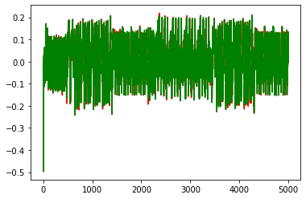

Part 4, Topic 2: CPA on Firmware Implementation of AES
======================================================

**SUMMARY**: *By now, you'll have used a DPA attack to break AES. While
this method has its place in side channel attacks, it often requires a
large number of traces to break AES and can suffer from additional
issues like ghost peaks.*

*We've also learned in the previous lab that there is a very linear
relationship between the hamming weight of the SBox output and the power
consumption at that point. Instead of checking average power consumption
over many traces to see if a guessed subkey is correct, we can instead
check if our guessed subkey also has this linear relationship with the
device's power consumption across a set of traces. Like with DPA, we'll
need to repeat this measurement at each point in time along the power
trace.*

*To get an objective measurement of how linear this relationship is,
we'll be developing some code to calculate the Pearson correlation
coefficient.*

**LEARNING OUTCOMES:** \* Developing an algorithm based on a
mathematical description \* Verify that correlation can be used to break
a single byte of AES \* Extend the single byte attack to the rest of the
key

Prerequisites
-------------

This notebook will build upon previous ones. Make sure you've completed
the following tutorials and their prerequisites:

-  ☑ Part 3 notebooks (you should be comfortable with running an attack
   on AES)
-  ☑ Power and Hamming Weight Relationship (we'll be using information
   from this tutorial)

AES Trace Capture
-----------------

Our first step will be to send some plaintext to the target device and
observe its power consumption during the encryption. The capture loop
will be the same as in the DPA attack. This time, however, we'll only
need 50 traces to recover the key, a major improvement over the last
attack!

Depending what you are using, you can complete this either by:

-  Capturing new traces from a physical device.
-  Reading pre-recorded data from a file.

You get to choose your adventure - see the two notebooks with the same
name of this, but called ``(SIMULATED)`` or ``(HARDWARE)`` to continue.
Inside those notebooks you should get some code to copy into the
following section, which will define the capture function.

Be sure you get the ``"✔️ OK to continue!"`` print once you run the next
cell, otherwise things will fail later on!


**In [1]:**

.. code:: ipython3

    SCOPETYPE = 'OPENADC'
    PLATFORM = 'CW308_STM32F3'
    CRYPTO_TARGET = 'TINYAES128C'
    VERSION = 'HARDWARE'
    allowable_exceptions = None
    SS_VER = 'SS_VER_2_1'


**In [2]:**

.. code:: ipython3

    if VERSION == 'HARDWARE':
        
        #!/usr/bin/env python
        # coding: utf-8
        
        # # Part 4, Topic 2: CPA on Firmware Implementation of AES (HARDWARE)
        
        # ---
        # **THIS IS NOT THE COMPLETE TUTORIAL - see file with `(MAIN)` in the name.**
        # 
        # ---
        
        # First you'll need to select which hardware setup you have. You'll need to select a `SCOPETYPE`, a `PLATFORM`, and a `CRYPTO_TARGET`. `SCOPETYPE` can either be `'OPENADC'` for the CWLite/CW1200 or `'CWNANO'` for the CWNano. `PLATFORM` is the target device, with `'CWLITEARM'`/`'CW308_STM32F3'` being the best supported option, followed by `'CWLITEXMEGA'`/`'CW308_XMEGA'`, then by `'CWNANO'`. `CRYPTO_TARGET` selects the crypto implementation, with `'TINYAES128C'` working on all platforms. An alternative for `'CWLITEXMEGA'` targets is `'AVRCRYPTOLIB'`. For example:
        # 
        # ```python
        # SCOPETYPE = 'OPENADC'
        # PLATFORM = 'CWLITEARM'
        # CRYPTO_TARGET='TINYAES128C'
        # SS_VER='SS_VER_1_1'
        # ```
        
        # In[ ]:
        
        
        
        
        
        # The following code will build the firmware for the target.
        
        # In[ ]:
        
        
        
        #!/usr/bin/env python
        # coding: utf-8
        
        # In[ ]:
        
        
        import chipwhisperer as cw
        
        try:
            if not scope.connectStatus:
                scope.con()
        except NameError:
            scope = cw.scope(hw_location=(5, 10))
        
        try:
            if SS_VER == "SS_VER_2_1":
                target_type = cw.targets.SimpleSerial2
            elif SS_VER == "SS_VER_2_0":
                raise OSError("SS_VER_2_0 is deprecated. Use SS_VER_2_1")
            else:
                target_type = cw.targets.SimpleSerial
        except:
            SS_VER="SS_VER_1_1"
            target_type = cw.targets.SimpleSerial
        
        try:
            target = cw.target(scope, target_type)
        except:
            print("INFO: Caught exception on reconnecting to target - attempting to reconnect to scope first.")
            print("INFO: This is a work-around when USB has died without Python knowing. Ignore errors above this line.")
            scope = cw.scope(hw_location=(5, 10))
            target = cw.target(scope, target_type)
        
        
        print("INFO: Found ChipWhisperer😍")
        
        
        # In[ ]:
        
        
        if "STM" in PLATFORM or PLATFORM == "CWLITEARM" or PLATFORM == "CWNANO":
            prog = cw.programmers.STM32FProgrammer
        elif PLATFORM == "CW303" or PLATFORM == "CWLITEXMEGA":
            prog = cw.programmers.XMEGAProgrammer
        elif "neorv32" in PLATFORM.lower():
            prog = cw.programmers.NEORV32Programmer
        else:
            prog = None
        
        
        # In[ ]:
        
        
        import time
        time.sleep(0.05)
        scope.default_setup()
        def reset_target(scope):
            if PLATFORM == "CW303" or PLATFORM == "CWLITEXMEGA":
                scope.io.pdic = 'low'
                time.sleep(0.1)
                scope.io.pdic = 'high_z' #XMEGA doesn't like pdic driven high
                time.sleep(0.1) #xmega needs more startup time
            elif "neorv32" in PLATFORM.lower():
                raise IOError("Default iCE40 neorv32 build does not have external reset - reprogram device to reset")
            else:  
                scope.io.nrst = 'low'
                time.sleep(0.05)
                scope.io.nrst = 'high_z'
                time.sleep(0.05)
        
        
    
        
        
        # In[ ]:
        
        
        try:
            get_ipython().run_cell_magic('bash', '-s "$PLATFORM" "$CRYPTO_TARGET" "$SS_VER"', 'cd ../../../hardware/victims/firmware/simpleserial-aes\nmake PLATFORM=$1 CRYPTO_TARGET=$2 SS_VER=$3\n &> /tmp/tmp.txt')
        except:
            x=open("/tmp/tmp.txt").read(); print(x); raise OSError(x)
    
        
        
        # In[ ]:
        
        
        cw.program_target(scope, prog, "../../../hardware/victims/firmware/simpleserial-aes/simpleserial-aes-{}.hex".format(PLATFORM))
        
        
        # We only need 50 traces this time to break AES!
        
        # In[ ]:
        
        
        from tqdm.notebook import trange
        import numpy as np
        import time
        
        ktp = cw.ktp.Basic()
        trace_array = []
        textin_array = []
        
        key, text = ktp.next()
        
        target.set_key(key)
        
        N = 100 #increase nano reliability
        if PLATFORM=="CWNANO":
            N = 200
        for i in trange(N, desc='Capturing traces'):
            scope.arm()
            
            target.simpleserial_write('p', text)
            
            ret = scope.capture()
            if ret:
                print("Target timed out!")
                continue
            
            response = target.simpleserial_read('r', 16)
            
            trace_array.append(scope.get_last_trace())
            textin_array.append(text)
            
            key, text = ktp.next()
            
        trace_array = np.array(trace_array)
        
        
        # We don't need the hardware anymore, so we'll disconnect:
        
        # In[ ]:
        
        
        scope.dis()
        target.dis()
        
        
    
    elif VERSION == 'SIMULATED':
        
        #!/usr/bin/env python
        # coding: utf-8
        
        # # Part 4, Topic 2: CPA on Firmware Implementation of AES (SIMULATED)
        
        # ---
        # **THIS IS NOT THE COMPLETE TUTORIAL - see file with `(MAIN)` in the name.**
        # 
        # ---
        
        # Instead of performing a capture - just copy this data into the referenced code block. It is a copy of the previously recorded data.
        
        # In[ ]:
        
        
        import numpy as np
        from tqdm import tnrange
        
        aes_traces_50_tracedata = np.load(r"traces/lab4_2_traces.npy")
        aes_traces_50_textindata = np.load(r"traces/lab4_2_textin.npy")
        key = np.load(r"traces/lab4_2_key.npy")
        
        trace_array = aes_traces_50_tracedata
        textin_array = aes_traces_50_textindata
        
        


**Out [2]:**


.. parsed-literal::

    INFO: Found ChipWhisperer😍
    Building for platform CW308\_STM32F3 with CRYPTO\_TARGET=TINYAES128C
    SS\_VER set to SS\_VER\_2\_1
    Blank crypto options, building for AES128
    make clean\_objs .dep 
    make[1]: Entering directory '/home/cwtests/chipwhisperer/hardware/victims/firmware/simpleserial-aes'
    Building for platform CW308\_STM32F3 with CRYPTO\_TARGET=TINYAES128C
    SS\_VER set to SS\_VER\_2\_1
    Blank crypto options, building for AES128
    rm -f -- simpleserial-aes-CW308\_STM32F3.hex
    rm -f -- simpleserial-aes-CW308\_STM32F3.eep
    rm -f -- simpleserial-aes-CW308\_STM32F3.cof
    rm -f -- simpleserial-aes-CW308\_STM32F3.elf
    rm -f -- simpleserial-aes-CW308\_STM32F3.map
    rm -f -- simpleserial-aes-CW308\_STM32F3.sym
    rm -f -- simpleserial-aes-CW308\_STM32F3.lss
    rm -f -- objdir-CW308\_STM32F3/\*.o
    rm -f -- objdir-CW308\_STM32F3/\*.lst
    rm -f -- simpleserial-aes.s simpleserial.s stm32f3\_hal.s stm32f3\_hal\_lowlevel.s stm32f3\_sysmem.s aes.s aes-independant.s
    rm -f -- simpleserial-aes.d simpleserial.d stm32f3\_hal.d stm32f3\_hal\_lowlevel.d stm32f3\_sysmem.d aes.d aes-independant.d
    rm -f -- simpleserial-aes.i simpleserial.i stm32f3\_hal.i stm32f3\_hal\_lowlevel.i stm32f3\_sysmem.i aes.i aes-independant.i
    make[1]: '.dep' is up to date.
    make[1]: Leaving directory '/home/cwtests/chipwhisperer/hardware/victims/firmware/simpleserial-aes'
    make begin gccversion build sizeafter fastnote end
    make[1]: Entering directory '/home/cwtests/chipwhisperer/hardware/victims/firmware/simpleserial-aes'
    Building for platform CW308\_STM32F3 with CRYPTO\_TARGET=TINYAES128C
    SS\_VER set to SS\_VER\_2\_1
    Blank crypto options, building for AES128
    .
    Welcome to another exciting ChipWhisperer target build!!
    arm-none-eabi-gcc (15:6.3.1+svn253039-1build1) 6.3.1 20170620
    Copyright (C) 2016 Free Software Foundation, Inc.
    This is free software; see the source for copying conditions.  There is NO
    warranty; not even for MERCHANTABILITY or FITNESS FOR A PARTICULAR PURPOSE.
    
    mkdir -p objdir-CW308\_STM32F3 
    .
    Compiling C: simpleserial-aes.c
    arm-none-eabi-gcc -c -mcpu=cortex-m4 -I. -DNO\_EXTRA\_OPTS -mthumb -mfloat-abi=soft -fmessage-length=0 -ffunction-sections -gdwarf-2 -DSS\_VER=SS\_VER\_2\_1 -DSTM32F303xC -DSTM32F3 -DSTM32 -DDEBUG -DHAL\_TYPE=HAL\_stm32f3 -DPLATFORM=CW308\_STM32F3 -DTINYAES128C -DF\_CPU=7372800UL -DSS\_VER\_2\_0=2 -DSS\_VER\_2\_1=3 -DSS\_VER\_1\_1=1 -DSS\_VER\_1\_0=0 -Os -funsigned-char -funsigned-bitfields -fshort-enums -Wall -Wstrict-prototypes -Wa,-adhlns=objdir-CW308\_STM32F3/simpleserial-aes.lst -I.././simpleserial/ -I.././hal -I.././hal/stm32f3 -I.././hal/stm32f3/CMSIS -I.././hal/stm32f3/CMSIS/core -I.././hal/stm32f3/CMSIS/device -I.././hal/stm32f4/Legacy -I.././crypto/ -I.././crypto/tiny-AES128-C -std=gnu99  -MMD -MP -MF .dep/simpleserial-aes.o.d simpleserial-aes.c -o objdir-CW308\_STM32F3/simpleserial-aes.o
    .
    Compiling C: .././simpleserial/simpleserial.c
    arm-none-eabi-gcc -c -mcpu=cortex-m4 -I. -DNO\_EXTRA\_OPTS -mthumb -mfloat-abi=soft -fmessage-length=0 -ffunction-sections -gdwarf-2 -DSS\_VER=SS\_VER\_2\_1 -DSTM32F303xC -DSTM32F3 -DSTM32 -DDEBUG -DHAL\_TYPE=HAL\_stm32f3 -DPLATFORM=CW308\_STM32F3 -DTINYAES128C -DF\_CPU=7372800UL -DSS\_VER\_2\_0=2 -DSS\_VER\_2\_1=3 -DSS\_VER\_1\_1=1 -DSS\_VER\_1\_0=0 -Os -funsigned-char -funsigned-bitfields -fshort-enums -Wall -Wstrict-prototypes -Wa,-adhlns=objdir-CW308\_STM32F3/simpleserial.lst -I.././simpleserial/ -I.././hal -I.././hal/stm32f3 -I.././hal/stm32f3/CMSIS -I.././hal/stm32f3/CMSIS/core -I.././hal/stm32f3/CMSIS/device -I.././hal/stm32f4/Legacy -I.././crypto/ -I.././crypto/tiny-AES128-C -std=gnu99  -MMD -MP -MF .dep/simpleserial.o.d .././simpleserial/simpleserial.c -o objdir-CW308\_STM32F3/simpleserial.o
    .
    Compiling C: .././hal/stm32f3/stm32f3\_hal.c
    arm-none-eabi-gcc -c -mcpu=cortex-m4 -I. -DNO\_EXTRA\_OPTS -mthumb -mfloat-abi=soft -fmessage-length=0 -ffunction-sections -gdwarf-2 -DSS\_VER=SS\_VER\_2\_1 -DSTM32F303xC -DSTM32F3 -DSTM32 -DDEBUG -DHAL\_TYPE=HAL\_stm32f3 -DPLATFORM=CW308\_STM32F3 -DTINYAES128C -DF\_CPU=7372800UL -DSS\_VER\_2\_0=2 -DSS\_VER\_2\_1=3 -DSS\_VER\_1\_1=1 -DSS\_VER\_1\_0=0 -Os -funsigned-char -funsigned-bitfields -fshort-enums -Wall -Wstrict-prototypes -Wa,-adhlns=objdir-CW308\_STM32F3/stm32f3\_hal.lst -I.././simpleserial/ -I.././hal -I.././hal/stm32f3 -I.././hal/stm32f3/CMSIS -I.././hal/stm32f3/CMSIS/core -I.././hal/stm32f3/CMSIS/device -I.././hal/stm32f4/Legacy -I.././crypto/ -I.././crypto/tiny-AES128-C -std=gnu99  -MMD -MP -MF .dep/stm32f3\_hal.o.d .././hal/stm32f3/stm32f3\_hal.c -o objdir-CW308\_STM32F3/stm32f3\_hal.o
    .
    Compiling C: .././hal/stm32f3/stm32f3\_hal\_lowlevel.c
    arm-none-eabi-gcc -c -mcpu=cortex-m4 -I. -DNO\_EXTRA\_OPTS -mthumb -mfloat-abi=soft -fmessage-length=0 -ffunction-sections -gdwarf-2 -DSS\_VER=SS\_VER\_2\_1 -DSTM32F303xC -DSTM32F3 -DSTM32 -DDEBUG -DHAL\_TYPE=HAL\_stm32f3 -DPLATFORM=CW308\_STM32F3 -DTINYAES128C -DF\_CPU=7372800UL -DSS\_VER\_2\_0=2 -DSS\_VER\_2\_1=3 -DSS\_VER\_1\_1=1 -DSS\_VER\_1\_0=0 -Os -funsigned-char -funsigned-bitfields -fshort-enums -Wall -Wstrict-prototypes -Wa,-adhlns=objdir-CW308\_STM32F3/stm32f3\_hal\_lowlevel.lst -I.././simpleserial/ -I.././hal -I.././hal/stm32f3 -I.././hal/stm32f3/CMSIS -I.././hal/stm32f3/CMSIS/core -I.././hal/stm32f3/CMSIS/device -I.././hal/stm32f4/Legacy -I.././crypto/ -I.././crypto/tiny-AES128-C -std=gnu99  -MMD -MP -MF .dep/stm32f3\_hal\_lowlevel.o.d .././hal/stm32f3/stm32f3\_hal\_lowlevel.c -o objdir-CW308\_STM32F3/stm32f3\_hal\_lowlevel.o
    .
    Compiling C: .././hal/stm32f3/stm32f3\_sysmem.c
    arm-none-eabi-gcc -c -mcpu=cortex-m4 -I. -DNO\_EXTRA\_OPTS -mthumb -mfloat-abi=soft -fmessage-length=0 -ffunction-sections -gdwarf-2 -DSS\_VER=SS\_VER\_2\_1 -DSTM32F303xC -DSTM32F3 -DSTM32 -DDEBUG -DHAL\_TYPE=HAL\_stm32f3 -DPLATFORM=CW308\_STM32F3 -DTINYAES128C -DF\_CPU=7372800UL -DSS\_VER\_2\_0=2 -DSS\_VER\_2\_1=3 -DSS\_VER\_1\_1=1 -DSS\_VER\_1\_0=0 -Os -funsigned-char -funsigned-bitfields -fshort-enums -Wall -Wstrict-prototypes -Wa,-adhlns=objdir-CW308\_STM32F3/stm32f3\_sysmem.lst -I.././simpleserial/ -I.././hal -I.././hal/stm32f3 -I.././hal/stm32f3/CMSIS -I.././hal/stm32f3/CMSIS/core -I.././hal/stm32f3/CMSIS/device -I.././hal/stm32f4/Legacy -I.././crypto/ -I.././crypto/tiny-AES128-C -std=gnu99  -MMD -MP -MF .dep/stm32f3\_sysmem.o.d .././hal/stm32f3/stm32f3\_sysmem.c -o objdir-CW308\_STM32F3/stm32f3\_sysmem.o
    .
    Compiling C: .././crypto/tiny-AES128-C/aes.c
    arm-none-eabi-gcc -c -mcpu=cortex-m4 -I. -DNO\_EXTRA\_OPTS -mthumb -mfloat-abi=soft -fmessage-length=0 -ffunction-sections -gdwarf-2 -DSS\_VER=SS\_VER\_2\_1 -DSTM32F303xC -DSTM32F3 -DSTM32 -DDEBUG -DHAL\_TYPE=HAL\_stm32f3 -DPLATFORM=CW308\_STM32F3 -DTINYAES128C -DF\_CPU=7372800UL -DSS\_VER\_2\_0=2 -DSS\_VER\_2\_1=3 -DSS\_VER\_1\_1=1 -DSS\_VER\_1\_0=0 -Os -funsigned-char -funsigned-bitfields -fshort-enums -Wall -Wstrict-prototypes -Wa,-adhlns=objdir-CW308\_STM32F3/aes.lst -I.././simpleserial/ -I.././hal -I.././hal/stm32f3 -I.././hal/stm32f3/CMSIS -I.././hal/stm32f3/CMSIS/core -I.././hal/stm32f3/CMSIS/device -I.././hal/stm32f4/Legacy -I.././crypto/ -I.././crypto/tiny-AES128-C -std=gnu99  -MMD -MP -MF .dep/aes.o.d .././crypto/tiny-AES128-C/aes.c -o objdir-CW308\_STM32F3/aes.o
    .
    Compiling C: .././crypto/aes-independant.c
    arm-none-eabi-gcc -c -mcpu=cortex-m4 -I. -DNO\_EXTRA\_OPTS -mthumb -mfloat-abi=soft -fmessage-length=0 -ffunction-sections -gdwarf-2 -DSS\_VER=SS\_VER\_2\_1 -DSTM32F303xC -DSTM32F3 -DSTM32 -DDEBUG -DHAL\_TYPE=HAL\_stm32f3 -DPLATFORM=CW308\_STM32F3 -DTINYAES128C -DF\_CPU=7372800UL -DSS\_VER\_2\_0=2 -DSS\_VER\_2\_1=3 -DSS\_VER\_1\_1=1 -DSS\_VER\_1\_0=0 -Os -funsigned-char -funsigned-bitfields -fshort-enums -Wall -Wstrict-prototypes -Wa,-adhlns=objdir-CW308\_STM32F3/aes-independant.lst -I.././simpleserial/ -I.././hal -I.././hal/stm32f3 -I.././hal/stm32f3/CMSIS -I.././hal/stm32f3/CMSIS/core -I.././hal/stm32f3/CMSIS/device -I.././hal/stm32f4/Legacy -I.././crypto/ -I.././crypto/tiny-AES128-C -std=gnu99  -MMD -MP -MF .dep/aes-independant.o.d .././crypto/aes-independant.c -o objdir-CW308\_STM32F3/aes-independant.o
    .
    Assembling: .././hal/stm32f3/stm32f3\_startup.S
    arm-none-eabi-gcc -c -mcpu=cortex-m4 -I. -x assembler-with-cpp -mthumb -mfloat-abi=soft -fmessage-length=0 -ffunction-sections -DF\_CPU=7372800 -Wa,-gstabs,-adhlns=objdir-CW308\_STM32F3/stm32f3\_startup.lst -I.././simpleserial/ -I.././hal -I.././hal/stm32f3 -I.././hal/stm32f3/CMSIS -I.././hal/stm32f3/CMSIS/core -I.././hal/stm32f3/CMSIS/device -I.././hal/stm32f4/Legacy -I.././crypto/ -I.././crypto/tiny-AES128-C .././hal/stm32f3/stm32f3\_startup.S -o objdir-CW308\_STM32F3/stm32f3\_startup.o
    .
    Linking: simpleserial-aes-CW308\_STM32F3.elf
    arm-none-eabi-gcc -mcpu=cortex-m4 -I. -DNO\_EXTRA\_OPTS -mthumb -mfloat-abi=soft -fmessage-length=0 -ffunction-sections -gdwarf-2 -DSS\_VER=SS\_VER\_2\_1 -DSTM32F303xC -DSTM32F3 -DSTM32 -DDEBUG -DHAL\_TYPE=HAL\_stm32f3 -DPLATFORM=CW308\_STM32F3 -DTINYAES128C -DF\_CPU=7372800UL -DSS\_VER\_2\_0=2 -DSS\_VER\_2\_1=3 -DSS\_VER\_1\_1=1 -DSS\_VER\_1\_0=0 -Os -funsigned-char -funsigned-bitfields -fshort-enums -Wall -Wstrict-prototypes -Wa,-adhlns=objdir-CW308\_STM32F3/simpleserial-aes.o -I.././simpleserial/ -I.././hal -I.././hal/stm32f3 -I.././hal/stm32f3/CMSIS -I.././hal/stm32f3/CMSIS/core -I.././hal/stm32f3/CMSIS/device -I.././hal/stm32f4/Legacy -I.././crypto/ -I.././crypto/tiny-AES128-C -std=gnu99  -MMD -MP -MF .dep/simpleserial-aes-CW308\_STM32F3.elf.d objdir-CW308\_STM32F3/simpleserial-aes.o objdir-CW308\_STM32F3/simpleserial.o objdir-CW308\_STM32F3/stm32f3\_hal.o objdir-CW308\_STM32F3/stm32f3\_hal\_lowlevel.o objdir-CW308\_STM32F3/stm32f3\_sysmem.o objdir-CW308\_STM32F3/aes.o objdir-CW308\_STM32F3/aes-independant.o objdir-CW308\_STM32F3/stm32f3\_startup.o --output simpleserial-aes-CW308\_STM32F3.elf --specs=nano.specs --specs=nosys.specs -T .././hal/stm32f3/LinkerScript.ld -Wl,--gc-sections -lm -Wl,-Map=simpleserial-aes-CW308\_STM32F3.map,--cref   -lm  
    .
    Creating load file for Flash: simpleserial-aes-CW308\_STM32F3.hex
    arm-none-eabi-objcopy -O ihex -R .eeprom -R .fuse -R .lock -R .signature simpleserial-aes-CW308\_STM32F3.elf simpleserial-aes-CW308\_STM32F3.hex
    .
    Creating load file for Flash: simpleserial-aes-CW308\_STM32F3.bin
    arm-none-eabi-objcopy -O binary -R .eeprom -R .fuse -R .lock -R .signature simpleserial-aes-CW308\_STM32F3.elf simpleserial-aes-CW308\_STM32F3.bin
    .
    Creating load file for EEPROM: simpleserial-aes-CW308\_STM32F3.eep
    arm-none-eabi-objcopy -j .eeprom --set-section-flags=.eeprom="alloc,load" \
    --change-section-lma .eeprom=0 --no-change-warnings -O ihex simpleserial-aes-CW308\_STM32F3.elf simpleserial-aes-CW308\_STM32F3.eep \|\| exit 0
    .
    Creating Extended Listing: simpleserial-aes-CW308\_STM32F3.lss
    arm-none-eabi-objdump -h -S -z simpleserial-aes-CW308\_STM32F3.elf > simpleserial-aes-CW308\_STM32F3.lss
    .
    Creating Symbol Table: simpleserial-aes-CW308\_STM32F3.sym
    arm-none-eabi-nm -n simpleserial-aes-CW308\_STM32F3.elf > simpleserial-aes-CW308\_STM32F3.sym
    Size after:
       text	   data	    bss	    dec	    hex	filename
       5736	    532	   1572	   7840	   1ea0	simpleserial-aes-CW308\_STM32F3.elf
    +--------------------------------------------------------
    + Default target does full rebuild each time.
    + Specify buildtarget == allquick == to avoid full rebuild
    +--------------------------------------------------------
    +--------------------------------------------------------
    + Built for platform CW308T: STM32F3 Target with:
    + CRYPTO\_TARGET = TINYAES128C
    + CRYPTO\_OPTIONS = AES128C
    +--------------------------------------------------------
    make[1]: Leaving directory '/home/cwtests/chipwhisperer/hardware/victims/firmware/simpleserial-aes'
    Detected known STMF32: STM32F302xB(C)/303xB(C)
    Extended erase (0x44), this can take ten seconds or more
    Attempting to program 6267 bytes at 0x8000000
    STM32F Programming flash...
    STM32F Reading flash...
    Verified flash OK, 6267 bytes


.. parsed-literal::

    Capturing traces:   0%|          | 0/100 [00:00<?, ?it/s]


Again, let's quickly plot a trace to make sure everything looks as
expected:


**In [3]:**

.. code:: ipython3

    %matplotlib inline
    import matplotlib.pylab as plt
    
    # ###################
    # START SOLUTION
    # ###################
    plt.figure()
    plt.plot(trace_array[0], 'r')
    plt.plot(trace_array[1], 'g')
    plt.show()
    # ###################
    # END SOLUTION
    # ###################


**Out [3]:**





AES Model and Hamming Weight
----------------------------

Like with the previous tutorial, we'll need to be able to easily grab
what the sbox output will be for a given plaintext and key, as well as
get the hamming weight of numbers between 0 and 255:


**In [4]:**

.. code:: ipython3

    # ###################
    # Add your code here
    # ###################
    #raise NotImplementedError("Add your code here, and delete this.")
    
    # ###################
    # START SOLUTION
    # ###################
    sbox = [
        # 0    1    2    3    4    5    6    7    8    9    a    b    c    d    e    f 
        0x63,0x7c,0x77,0x7b,0xf2,0x6b,0x6f,0xc5,0x30,0x01,0x67,0x2b,0xfe,0xd7,0xab,0x76, # 0
        0xca,0x82,0xc9,0x7d,0xfa,0x59,0x47,0xf0,0xad,0xd4,0xa2,0xaf,0x9c,0xa4,0x72,0xc0, # 1
        0xb7,0xfd,0x93,0x26,0x36,0x3f,0xf7,0xcc,0x34,0xa5,0xe5,0xf1,0x71,0xd8,0x31,0x15, # 2
        0x04,0xc7,0x23,0xc3,0x18,0x96,0x05,0x9a,0x07,0x12,0x80,0xe2,0xeb,0x27,0xb2,0x75, # 3
        0x09,0x83,0x2c,0x1a,0x1b,0x6e,0x5a,0xa0,0x52,0x3b,0xd6,0xb3,0x29,0xe3,0x2f,0x84, # 4
        0x53,0xd1,0x00,0xed,0x20,0xfc,0xb1,0x5b,0x6a,0xcb,0xbe,0x39,0x4a,0x4c,0x58,0xcf, # 5
        0xd0,0xef,0xaa,0xfb,0x43,0x4d,0x33,0x85,0x45,0xf9,0x02,0x7f,0x50,0x3c,0x9f,0xa8, # 6
        0x51,0xa3,0x40,0x8f,0x92,0x9d,0x38,0xf5,0xbc,0xb6,0xda,0x21,0x10,0xff,0xf3,0xd2, # 7
        0xcd,0x0c,0x13,0xec,0x5f,0x97,0x44,0x17,0xc4,0xa7,0x7e,0x3d,0x64,0x5d,0x19,0x73, # 8
        0x60,0x81,0x4f,0xdc,0x22,0x2a,0x90,0x88,0x46,0xee,0xb8,0x14,0xde,0x5e,0x0b,0xdb, # 9
        0xe0,0x32,0x3a,0x0a,0x49,0x06,0x24,0x5c,0xc2,0xd3,0xac,0x62,0x91,0x95,0xe4,0x79, # a
        0xe7,0xc8,0x37,0x6d,0x8d,0xd5,0x4e,0xa9,0x6c,0x56,0xf4,0xea,0x65,0x7a,0xae,0x08, # b
        0xba,0x78,0x25,0x2e,0x1c,0xa6,0xb4,0xc6,0xe8,0xdd,0x74,0x1f,0x4b,0xbd,0x8b,0x8a, # c
        0x70,0x3e,0xb5,0x66,0x48,0x03,0xf6,0x0e,0x61,0x35,0x57,0xb9,0x86,0xc1,0x1d,0x9e, # d
        0xe1,0xf8,0x98,0x11,0x69,0xd9,0x8e,0x94,0x9b,0x1e,0x87,0xe9,0xce,0x55,0x28,0xdf, # e
        0x8c,0xa1,0x89,0x0d,0xbf,0xe6,0x42,0x68,0x41,0x99,0x2d,0x0f,0xb0,0x54,0xbb,0x16  # f
    ]
    
    def aes_internal(inputdata, key):
        return sbox[inputdata ^ key]
    
    HW = [bin(n).count("1") for n in range(0, 256)]
    # ###################
    # END SOLUTION
    # ###################

Verify that your model is correct:


**In [5]:**

.. code:: ipython3

    assert HW[aes_internal(0xA1, 0x79)] == 3
    assert HW[aes_internal(0x22, 0xB1)] == 5
    print("✔️ OK to continue!")


**Out [5]:**


.. parsed-literal::

    ✔️ OK to continue!


Developing our Correlation Algorithm
------------------------------------

As we discussed earlier, we'll be testing how good our guess is using a
measurement called the Pearson correlation coefficient, which measures
the linear correlation between two datasets.

The actual algorithm is as follows for datasets :math:`X` and :math:`Y`
of length :math:`N`, with means of :math:`\bar{X}` and :math:`\bar{Y}`,
respectively:

.. math:: r = \frac{cov(X, Y)}{\sigma_X \sigma_Y}

:math:`cov(X, Y)` is the covariance of ``X`` and ``Y`` and can be
calculated as follows:

.. math:: cov(X, Y) = \sum_{n=1}^{N}[(Y_n - \bar{Y})(X_n - \bar{X})]

:math:`\sigma_X` and :math:`\sigma_Y` are the standard deviation of the
two datasets. This value can be calculated with the following equation:

.. math:: \sigma_X = \sqrt{\sum_{n=1}^{N}(X_n - \bar{X})^2}

As you can see, the calulation is actually broken down pretty nicely
into some smaller chunks that we can implement with some simple
functions. While we could use a library to calculate all this stuff for
us, being able to implement a mathematical algorithm in code is a useful
skill to develop.

To start, build the following functions:

1. ``mean(X)`` to calculate the mean of a dataset
2. ``std_dev(X, X_bar)`` to calculate the standard deviation of a
   dataset. We'll need to reuse the mean for the covariance, so it makes
   more sense to calculate it once and pass it in to each function
3. ``cov(X, X_bar, Y, Y_bar)`` to calculate the covariance of two
   datasets. Again, we can just pass in the means we calculate for
   std\_dev here.

**HINT: You can use ``np.sum(X, axis=0)`` to replace all of the
:math:`\sum` from earlier. The argument ``axis=0`` will sum across
columns, allowing us to use a single ``mean``, ``std_dev``, and ``cov``
call for the entire power trace**


**In [6]:**

.. code:: ipython3

    # ###################
    # Add your code here
    # ###################
    #raise NotImplementedError("Add your code here, and delete this.")
    
    # ###################
    # START SOLUTION
    # ###################
    def mean(X):
        return np.sum(X, axis=0)/len(X)
    
    def std_dev(X, X_bar):
        return np.sqrt(np.sum((X-X_bar)**2, axis=0))
    
    def cov(X, X_bar, Y, Y_bar):
        return np.sum((X-X_bar)*(Y-Y_bar), axis=0)
    # ###################
    # END SOLUTION
    # ###################

Let's quickly check to make sure everything's as expected:


**In [7]:**

.. code:: ipython3

    a = np.array([[5, 3, 4, 4, 5, 6],
                 [27, 2, 3, 4, 12, 6],
                  [1, 3, 5, 4, 5, 6],
                  [1, 2, 3, 4, 5, 6],
                 ]).transpose()
    a_bar = mean(a)
    b = np.array([[5, 4, 3, 2, 1, 3]]).transpose()
    b_bar = mean(b)
    
    o_a = std_dev(a, a_bar)
    o_b = std_dev(b, b_bar)
    
    ab_cov = cov(a, a_bar, b, b_bar)


**In [8]:**

.. code:: ipython3

    assert (a_bar == np.array([4.5, 9., 4., 3.5])).all()
    assert (b_bar == np.array([3.])).all()
    assert (o_a[3] > 4.1833001 and o_a[3] < 4.1833002)
    assert (o_b[0] > 3.162277 and o_b[0] < 3.162278)
    assert (ab_cov == np.array([-1., 28., -9., -10.])).all()
    print("✔️ OK to continue!")


**Out [8]:**


.. parsed-literal::

    ✔️ OK to continue!


Now that we've got all the building blocks to our correlation function,
let's see if we can put everything together and break a single byte of
AES. In order to do this, let's take a closer look at what we're trying
to do and the data we've got:


**In [9]:**

.. code:: ipython3

    print(trace_array)


**Out [9]:**


.. parsed-literal::

    [[-0.02490234 -0.0456543   0.01367188 ...  0.02856445  0.09643555
       0.07202148]
     [-0.02587891 -0.04394531  0.01196289 ...  0.02978516  0.09619141
       0.07324219]
     [-0.02954102 -0.04370117  0.00976562 ...  0.03393555  0.10473633
       0.07861328]
     ...
     [-0.02856445 -0.04418945  0.00561523 ...  0.02636719  0.09570312
       0.0715332 ]
     [-0.02734375 -0.04272461  0.01074219 ...  0.03442383  0.1015625
       0.07592773]
     [-0.02905273 -0.04248047  0.01245117 ...  0.0324707   0.09643555
       0.07495117]]


You should have something like the following:

.. code:: python

    [
        [point_0, point_1, point_2, ...], # trace 0
        [point_0, point_1, point_2, ...], # trace 1
        [point_0, point_1, point_2, ...], # trace 2
        ...
    ]

where the rows of the array are the different traces we captured and the
columns of the array are the different points in those traces. The
columns here will be one of the two datasets for our correlation
equation. The other dataset will be the hamming weight of the SBox
output:

.. code:: python

    [
          [HW[aes_internal(plaintext0[0], key[0])], # trace 0
          [HW[aes_internal(plaintext1[0], key[0])], # trace 1
          [HW[aes_internal(plaintext2[0], key[0])], # trace 2
          ...
    ]

which we'll shorten to:

.. code:: python

    [
          [hw], # trace 1
          [hw], # trace 2
          [hw], # trace 3
          ...
    ]

Like with the DPA attack, we don't know where the encryption is
occurring, meaning we have to repeat the correlation calculation for
each column in the trace array, with the largest correlation being our
best guess for where the SBox output is happening. We obviously also
don't know the key (that's the thing we're trying to find!), so we'll
also need to repeat the best correlation calculation for each possible
value of ``key[0]`` (0 to 255). The key with the highest absolute
correlation is our best guess for the value of the key byte.

A really nice feature of numpy is that we can do the correlation
calculations across the entire trace at once (mean, std\_dev, cov). That
means there's no need to do:

.. code:: python

    t_bar = []
    for point_num in range(len(trace_array[0])):
        t_bar.append(mean(trace_array[:,point_num]))
        # and so on...

    t_bar = np.array(t_bar)

when we can do

.. code:: python

    t_bar = mean(trace_array)

and get the same thing back. The only caveat being that we need to make
sure that the columns and rows of our arrays are the right way around
(i.e. make sure your hamming weight array has 1 column and 50 rows and
not the other way around). If you find it easier to construct and array
one way and not the other, you can use the ``.transpose()`` method to
swap the rows and columns.

Once you've got all your correlations for a particular key guess, you
want to find the largest absolute correlation. We're taking the absolute
value of the correlation here since we only care that the relation
between hamming weight and the power trace is linear, not that the slope
is positive or negative. ``max(abs(correlations))`` will do that for
you.

Perform this for every possible value of the key byte (aka 0 to 255) and
the one with the largest correlation is your best guess for the key.
It's up to you how you want to extract this information from your loop,
but one way of doing it is to stick the best guess for each of your key
guesses in an array. Once you've gone through all the key guesses, you
can extract the best guess with ``np.argmax(maxcpa)`` and the
correlation of that guess with ``max(maxcpa)``.


**In [10]:**

.. code:: ipython3

    from tqdm import tnrange
    maxcpa = [0] * 256
    
    # we don't need to redo the mean and std dev calculations 
    # for each key guess
    t_bar = mean(trace_array) 
    o_t = std_dev(trace_array, t_bar)
    
    for kguess in tnrange(0, 256):
        hws = np.array([[HW[aes_internal(textin[0],kguess)] for textin in textin_array]]).transpose()
        
        # ###################
        # Add your code here
        # ###################
        #raise NotImplementedError("Add your code here, and delete this.")
        
        # ###################
        # START SOLUTION
        # ###################
        hws_bar = mean(hws)
        o_hws = std_dev(hws, hws_bar)
        correlation = cov(trace_array, t_bar, hws, hws_bar)
        cpaoutput = correlation/(o_t*o_hws)
        maxcpa[kguess] = max(abs(cpaoutput))
        
    
    guess = np.argmax(maxcpa)
    guess_corr = max(maxcpa)
    # ###################
    # END SOLUTION
    # ###################
    print("Key guess: ", hex(guess))
    print("Correlation: ", guess_corr)


**Out [10]:**


.. parsed-literal::

    /tmp/ipykernel\_1321/3969154439.py:9: TqdmDeprecationWarning: Please use \`tqdm.notebook.trange\` instead of \`tqdm.tnrange\`
      for kguess in tnrange(0, 256):


.. parsed-literal::

      0%|          | 0/256 [00:00<?, ?it/s]


.. parsed-literal::

    Key guess:  0x2b
    Correlation:  0.8269588459177212


Let's make sure we've recovered the byte correctly:


**In [11]:**

.. code:: ipython3

    assert guess == 0x2b
    print("✔️ OK to continue!")


**Out [11]:**


.. parsed-literal::

    ✔️ OK to continue!


To break the rest of the key, simply repeat the attack for the rest of
the bytes of the key. Don't forget to update your code from above to use
the correct byte of the plaintext!


**In [12]:**

.. code:: ipython3

    t_bar = np.sum(trace_array, axis=0)/len(trace_array)
    o_t = np.sqrt(np.sum((trace_array - t_bar)**2, axis=0))
    
    cparefs = [0] * 16 #put your key byte guess correlations here
    bestguess = [0] * 16 #put your key byte guesses here
    
    for bnum in tnrange(0, 16):
        maxcpa = [0] * 256
        for kguess in range(0, 256):
        # ###################
        # Add your code here
        # ###################
        #raise NotImplementedError("Add your code here, and delete this.")
        
        # ###################
        # START SOLUTION
        # ###################
            hws = np.array([[HW[aes_internal(textin[bnum],kguess)] for textin in textin_array]]).transpose()
            hws_bar = mean(hws)
            o_hws = std_dev(hws, hws_bar)
            correlation = cov(trace_array, t_bar, hws, hws_bar)
            cpaoutput = correlation/(o_t*o_hws)
            maxcpa[kguess] = max(abs(cpaoutput))
        bestguess[bnum] = np.argmax(maxcpa)
        cparefs[bnum] = max(maxcpa)
        # ###################
        # END SOLUTION
        # ###################
    
    print("Best Key Guess: ", end="")
    for b in bestguess: print("%02x " % b, end="")
    print("\n", cparefs)


**Out [12]:**


.. parsed-literal::

    /tmp/ipykernel\_1321/1283320264.py:7: TqdmDeprecationWarning: Please use \`tqdm.notebook.trange\` instead of \`tqdm.tnrange\`
      for bnum in tnrange(0, 16):


.. parsed-literal::

      0%|          | 0/16 [00:00<?, ?it/s]


.. parsed-literal::

    Best Key Guess: 2b 7e 15 16 28 ae d2 a6 ab f7 15 88 09 cf 4f 3c 
     [0.8269588459177212, 0.8893632277912904, 0.8657909151223315, 0.8508915813085488, 0.8405018214174422, 0.8975928723724651, 0.8893695240292399, 0.8643015963078573, 0.8784292105506705, 0.8058610458604063, 0.8844660730045303, 0.812334708507586, 0.8649639840371355, 0.8597868608291006, 0.8375066334039908, 0.8792266163601928]


With one final check to make sure you've got the correct key:


**In [13]:**

.. code:: ipython3

    for bnum in range(16):
        assert bestguess[bnum] == key[bnum], \
        "Byte {} failed, expected {:02X} got {:02X}".format(bnum, key[bnum], bestguess[bnum])
    print("✔️ OK to continue!")


**Out [13]:**


.. parsed-literal::

    ✔️ OK to continue!


We're done! There's actually a lot of room to expand on this attack:

1. Currently, the loop needs to go through all the traces before it can
   return a correlation. This isn't too bad for a short attack, for a
   much longer one (think 10k+ traces) we won't get any feedback from
   the attack until it's finished. Also, if we didn't capture enough
   traces for the attack, the entire analysis calculation needs to be
   repeated! Instead of using the original correlation equation, we can
   instead use an equivalent "online" version that can be easily updated
   with more traces:

   .. math:: r_{i,j} = \frac{D\sum_{d=1}^{D}h_{d,i}t_{d,j}-\sum_{d=1}^{D}h_{d,i}\sum_{d=1}^{D}t_{d,j}}{\sqrt{((\sum_{d=1}^Dh_{d,i})^2-D\sum_{d=1}^Dh_{d,i}^2)-((\sum_{d=1}^Dt_{d,j})^2-D\sum_{d=1}^Dh_{d,j}^2)}}

    where

+----------------+-----------------------+-------------------------------+
| **Equation**   | **Python Variable**   | **Value**                     |
+================+=======================+===============================+
| d              | tnum                  | trace number                  |
+----------------+-----------------------+-------------------------------+
| i              | kguess                | subkey guess                  |
+----------------+-----------------------+-------------------------------+
| j              | j index trace point   | sample point in trace         |
+----------------+-----------------------+-------------------------------+
| h              | hypint                | guess for power consumption   |
+----------------+-----------------------+-------------------------------+
| t              | traces                | traces                        |
+----------------+-----------------------+-------------------------------+

2. There's a lot more we can learn from the attack other than the key.
   For example, we could plot how far away the correct key guess is from
   the top spot (called the partial guessing entropy or PGE) vs. how
   many traces we used, giving us a better idea of how many traces we
   needed to actually recover the correct key. We also might want to
   plot how correlation for a given key guess changes over time.

This "online" correlation equation is the one that the subject of the
next tutorial, ChipWhisperer Analyzer, actually uses. It also provides
functions and methods for gathering and plotting some interesting
statistics.

--------------

NO-FUN DISCLAIMER: This material is Copyright (C) NewAE Technology Inc.,
2015-2020. ChipWhisperer is a trademark of NewAE Technology Inc.,
claimed in all jurisdictions, and registered in at least the United
States of America, European Union, and Peoples Republic of China.

Tutorials derived from our open-source work must be released under the
associated open-source license, and notice of the source must be
*clearly displayed*. Only original copyright holders may license or
authorize other distribution - while NewAE Technology Inc. holds the
copyright for many tutorials, the github repository includes community
contributions which we cannot license under special terms and **must**
be maintained as an open-source release. Please contact us for special
permissions (where possible).

THE SOFTWARE IS PROVIDED "AS IS", WITHOUT WARRANTY OF ANY KIND, EXPRESS
OR IMPLIED, INCLUDING BUT NOT LIMITED TO THE WARRANTIES OF
MERCHANTABILITY, FITNESS FOR A PARTICULAR PURPOSE AND NONINFRINGEMENT.
IN NO EVENT SHALL THE AUTHORS OR COPYRIGHT HOLDERS BE LIABLE FOR ANY
CLAIM, DAMAGES OR OTHER LIABILITY, WHETHER IN AN ACTION OF CONTRACT,
TORT OR OTHERWISE, ARISING FROM, OUT OF OR IN CONNECTION WITH THE
SOFTWARE OR THE USE OR OTHER DEALINGS IN THE SOFTWARE.
