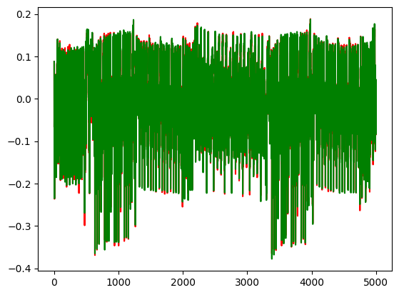

Part 4, Topic 1: Power and Hamming Weight Relationship
======================================================


**SUMMARY:** *In the previous part of SCA101, we used the fact a
relationship exists between the value of the bits being manipulated on a
microcontroller to recover an AES key*

*In this lab, we’ll improve our model by looking at how power relates to
hamming weight.*

**LEARNING OUTCOMES:**

-  Understand hamming weight
-  Calculate hamming weight of a byte
-  Identify the point where the SBox output is being written
-  Plot power consumption at the SBox output vs. hamming weight


**In [1]:**

.. code:: ipython3

    SCOPETYPE = 'OPENADC'
    PLATFORM = 'CWLITEARM'
    CRYPTO_TARGET = 'TINYAES128C'
    VERSION = 'HARDWARE'
    allowable_exceptions = None
    SS_VER = 'SS_VER_2_1'


**In [2]:**

.. code:: ipython3

    if VERSION == 'HARDWARE':
        
        #!/usr/bin/env python
        # coding: utf-8
        
        # # Part 4, Topic 1: Power and Hamming Weight Relationship (HARDWARE)
        
        # ---
        # **THIS IS NOT THE COMPLETE TUTORIAL - see file with `(MAIN)` in the name.**
        # 
        # ---
        
        # First you'll need to select which hardware setup you have. You'll need to select a `SCOPETYPE`, a `PLATFORM`, and a `CRYPTO_TARGET`. `SCOPETYPE` can either be `'OPENADC'` for the CWLite/CW1200 or `'CWNANO'` for the CWNano. `PLATFORM` is the target device, with `'CWLITEARM'`/`'CW308_STM32F3'` being the best supported option, followed by `'CWLITEXMEGA'`/`'CW308_XMEGA'`, then by `'CWNANO'`. `CRYPTO_TARGET` selects the crypto implementation, with `'TINYAES128C'` working on all platforms. An alternative for `'CWLITEXMEGA'` targets is `'AVRCRYPTOLIB'`. For example:
        # 
        # ```python
        # SCOPETYPE = 'OPENADC'
        # PLATFORM = 'CWLITEARM'
        # CRYPTO_TARGET='TINYAES128C' 
        # SS_VER='SS_VER_1_1'
        # ```
        
        # In[ ]:
        
        
        
        
        
        # The following code will build the firmware for the target.
        
        # In[ ]:
        
        
        
        #!/usr/bin/env python
        # coding: utf-8
        
        # In[ ]:
        
        
        import chipwhisperer as cw
        
        try:
            if not scope.connectStatus:
                scope.con()
        except NameError:
            scope = cw.scope(hw_location=(5, 25))
        
        try:
            if SS_VER == "SS_VER_2_1":
                target_type = cw.targets.SimpleSerial2
            elif SS_VER == "SS_VER_2_0":
                raise OSError("SS_VER_2_0 is deprecated. Use SS_VER_2_1")
            else:
                target_type = cw.targets.SimpleSerial
        except:
            SS_VER="SS_VER_1_1"
            target_type = cw.targets.SimpleSerial
        
        try:
            target = cw.target(scope, target_type)
        except:
            print("INFO: Caught exception on reconnecting to target - attempting to reconnect to scope first.")
            print("INFO: This is a work-around when USB has died without Python knowing. Ignore errors above this line.")
            scope = cw.scope(hw_location=(5, 25))
            target = cw.target(scope, target_type)
        
        
        print("INFO: Found ChipWhisperer😍")
        
        
        # In[ ]:
        
        
        if "STM" in PLATFORM or PLATFORM == "CWLITEARM" or PLATFORM == "CWNANO":
            prog = cw.programmers.STM32FProgrammer
        elif PLATFORM == "CW303" or PLATFORM == "CWLITEXMEGA":
            prog = cw.programmers.XMEGAProgrammer
        elif "neorv32" in PLATFORM.lower():
            prog = cw.programmers.NEORV32Programmer
        elif PLATFORM == "CW308_SAM4S":
            prog = cw.programmers.SAM4SProgrammer
        else:
            prog = None
        
        
        # In[ ]:
        
        
        import time
        time.sleep(0.05)
        scope.default_setup()
        
        if PLATFORM == "CW308_SAM4S":
            scope.io.target_pwr = 0
            time.sleep(0.2)
            scope.io.target_pwr = 1
            time.sleep(0.2)
        def reset_target(scope):
            if PLATFORM == "CW303" or PLATFORM == "CWLITEXMEGA":
                scope.io.pdic = 'low'
                time.sleep(0.1)
                scope.io.pdic = 'high_z' #XMEGA doesn't like pdic driven high
                time.sleep(0.1) #xmega needs more startup time
            elif "neorv32" in PLATFORM.lower():
                raise IOError("Default iCE40 neorv32 build does not have external reset - reprogram device to reset")
            elif PLATFORM == "CW308_SAM4S":
                scope.io.nrst = 'low'
                time.sleep(0.25)
                scope.io.nrst = 'high_z'
                time.sleep(0.25)
            else:  
                scope.io.nrst = 'low'
                time.sleep(0.05)
                scope.io.nrst = 'high_z'
                time.sleep(0.05)
        
        
    
        
        
        # In[ ]:
        
        
        try:
            get_ipython().run_cell_magic('bash', '-s "$PLATFORM" "$CRYPTO_TARGET" "$SS_VER"', 'cd ../../../hardware/victims/firmware/simpleserial-aes\nmake PLATFORM=$1 CRYPTO_TARGET=$2 SS_VER=$3\n &> /tmp/tmp.txt')
        except:
            x=open("/tmp/tmp.txt").read(); print(x); raise OSError(x)
    
        
        
        # In[ ]:
        
        
        cw.program_target(scope, prog, "../../../hardware/victims/firmware/simpleserial-aes/simpleserial-aes-{}.hex".format(PLATFORM))
        
        
        # In[ ]:
        
        
        from tqdm import tnrange
        import numpy as np
        import time
        
        ktp = cw.ktp.Basic()
        trace_array = []
        textin_array = []
        
        key, text = ktp.next()
        
        target.set_key(key)
        
        N = 1000
        for i in tnrange(N, desc='Capturing traces'):
            scope.arm()
            
            target.simpleserial_write('p', text)
            
            ret = scope.capture()
            if ret:
                print("Target timed out!")
                continue
            
            response = target.simpleserial_read('r', 16)
            
            trace_array.append(scope.get_last_trace())
            textin_array.append(text)
            
            key, text = ktp.next() 
        
        
        # In[ ]:
        
        
        scope.dis()
        target.dis()
        
        
    
    elif VERSION == 'SIMULATED':
        
        #!/usr/bin/env python
        # coding: utf-8
        
        # # Part 4, Topic 2: CPA on Firmware Implementation of AES (SIMULATED)
        
        # ---
        # **THIS IS NOT THE COMPLETE TUTORIAL - see file with `(MAIN)` in the name.**
        # 
        # ---
        
        # Instead of performing a capture - just copy this data into the referenced code block. It is a copy of the previously recorded data.
        
        # In[ ]:
        
        
        import numpy as np
        from tqdm import tnrange
        
        aes_traces_2500_tracedata = np.load(r"traces/lab4_1_traces.npy")
        aes_traces_2500_textindata = np.load(r"traces/lab4_1_textin.npy")
        key = np.load(r"traces/lab4_1_key.npy")
        
        trace_array = aes_traces_2500_tracedata
        textin_array = aes_traces_2500_textindata
        
        


**Out [2]:**


.. parsed-literal::

    INFO: Found ChipWhisperer😍
    Building for platform CWLITEARM with CRYPTO\_TARGET=TINYAES128C
    SS\_VER set to SS\_VER\_2\_1
    Blank crypto options, building for AES128
    Building for platform CWLITEARM with CRYPTO\_TARGET=TINYAES128C
    SS\_VER set to SS\_VER\_2\_1
    Blank crypto options, building for AES128
    make[1]: '.dep' is up to date.
    Building for platform CWLITEARM with CRYPTO\_TARGET=TINYAES128C
    SS\_VER set to SS\_VER\_2\_1
    Blank crypto options, building for AES128
    .
    Welcome to another exciting ChipWhisperer target build!!
    arm-none-eabi-gcc (15:9-2019-q4-0ubuntu1) 9.2.1 20191025 (release) [ARM/arm-9-branch revision 277599]
    Copyright (C) 2019 Free Software Foundation, Inc.
    This is free software; see the source for copying conditions.  There is NO
    warranty; not even for MERCHANTABILITY or FITNESS FOR A PARTICULAR PURPOSE.
    
    .
    Compiling:
    -en     simpleserial-aes.c ...
    -e Done!
    .
    Compiling:
    -en     .././simpleserial/simpleserial.c ...
    -e Done!
    .
    Compiling:
    -en     .././hal/stm32f3/stm32f3\_hal.c ...
    -e Done!
    .
    Compiling:
    -en     .././hal/stm32f3/stm32f3\_hal\_lowlevel.c ...
    -e Done!
    .
    Compiling:
    -en     .././hal/stm32f3/stm32f3\_sysmem.c ...
    -e Done!
    .
    Compiling:
    -en     .././crypto/tiny-AES128-C/aes.c ...
    -e Done!
    .
    Compiling:
    -en     .././crypto/aes-independant.c ...
    -e Done!
    .
    Assembling: .././hal/stm32f3/stm32f3\_startup.S
    arm-none-eabi-gcc -c -mcpu=cortex-m4 -I. -x assembler-with-cpp -mthumb -mfloat-abi=soft -fmessage-length=0 -ffunction-sections -DF\_CPU=7372800 -Wa,-gstabs,-adhlns=objdir-CWLITEARM/stm32f3\_startup.lst -I.././simpleserial/ -I.././hal -I.././hal/stm32f3 -I.././hal/stm32f3/CMSIS -I.././hal/stm32f3/CMSIS/core -I.././hal/stm32f3/CMSIS/device -I.././hal/stm32f4/Legacy -I.././crypto/ -I.././crypto/tiny-AES128-C .././hal/stm32f3/stm32f3\_startup.S -o objdir-CWLITEARM/stm32f3\_startup.o
    .
    LINKING:
    -en     simpleserial-aes-CWLITEARM.elf ...
    -e Done!
    .
    Creating load file for Flash: simpleserial-aes-CWLITEARM.hex
    arm-none-eabi-objcopy -O ihex -R .eeprom -R .fuse -R .lock -R .signature simpleserial-aes-CWLITEARM.elf simpleserial-aes-CWLITEARM.hex
    .
    Creating load file for Flash: simpleserial-aes-CWLITEARM.bin
    arm-none-eabi-objcopy -O binary -R .eeprom -R .fuse -R .lock -R .signature simpleserial-aes-CWLITEARM.elf simpleserial-aes-CWLITEARM.bin
    .
    Creating load file for EEPROM: simpleserial-aes-CWLITEARM.eep
    arm-none-eabi-objcopy -j .eeprom --set-section-flags=.eeprom="alloc,load" \
    --change-section-lma .eeprom=0 --no-change-warnings -O ihex simpleserial-aes-CWLITEARM.elf simpleserial-aes-CWLITEARM.eep \|\| exit 0
    .
    Creating Extended Listing: simpleserial-aes-CWLITEARM.lss
    arm-none-eabi-objdump -h -S -z simpleserial-aes-CWLITEARM.elf > simpleserial-aes-CWLITEARM.lss
    .
    Creating Symbol Table: simpleserial-aes-CWLITEARM.sym
    arm-none-eabi-nm -n simpleserial-aes-CWLITEARM.elf > simpleserial-aes-CWLITEARM.sym
    Building for platform CWLITEARM with CRYPTO\_TARGET=TINYAES128C
    SS\_VER set to SS\_VER\_2\_1
    Blank crypto options, building for AES128
    Size after:
       text	   data	    bss	    dec	    hex	filename
       5704	    532	   1572	   7808	   1e80	simpleserial-aes-CWLITEARM.elf
    +--------------------------------------------------------
    + Default target does full rebuild each time.
    + Specify buildtarget == allquick == to avoid full rebuild
    +--------------------------------------------------------
    +--------------------------------------------------------
    + Built for platform CW-Lite Arm \(STM32F3\) with:
    + CRYPTO\_TARGET = TINYAES128C
    + CRYPTO\_OPTIONS = AES128C
    +--------------------------------------------------------
    Detected known STMF32: STM32F302xB(C)/303xB(C)
    Extended erase (0x44), this can take ten seconds or more
    Attempting to program 6235 bytes at 0x8000000
    STM32F Programming flash...
    STM32F Reading flash...
    Verified flash OK, 6235 bytes


.. parsed-literal::

    /tmp/ipykernel\_1050896/3973800620.py:153: TqdmDeprecationWarning: Please use \`tqdm.notebook.trange\` instead of \`tqdm.tnrange\`
      for i in tnrange(N, desc='Capturing traces'):


.. parsed-literal::

    Capturing traces:   0%|          | 0/1000 [00:00<?, ?it/s]


**In [3]:**

.. code:: ipython3

    %matplotlib inline
    import matplotlib.pylab as plt
    
    # ###################
    # START SOLUTION
    # ###################
    plt.figure()
    plt.plot(trace_array[0], 'r')
    plt.plot(trace_array[1], 'g')
    plt.show()
    # ###################
    # END SOLUTION
    # ###################


**Out [3]:**





**In [4]:**

.. code:: ipython3

    numtraces = np.shape(trace_array)[0] #total number of traces
    numpoints = np.shape(trace_array)[1] #samples per trace

AES Model
---------

We’ll be looking at the SBox again, so grab your implementation from the
last section:


**In [5]:**

.. code:: ipython3

    # ###################
    # Add your code here
    # ###################
    #raise NotImplementedError("Add your code here, and delete this.")
    
    # ###################
    # START SOLUTION
    # ###################
    sbox = [
        # 0    1    2    3    4    5    6    7    8    9    a    b    c    d    e    f 
        0x63,0x7c,0x77,0x7b,0xf2,0x6b,0x6f,0xc5,0x30,0x01,0x67,0x2b,0xfe,0xd7,0xab,0x76, # 0
        0xca,0x82,0xc9,0x7d,0xfa,0x59,0x47,0xf0,0xad,0xd4,0xa2,0xaf,0x9c,0xa4,0x72,0xc0, # 1
        0xb7,0xfd,0x93,0x26,0x36,0x3f,0xf7,0xcc,0x34,0xa5,0xe5,0xf1,0x71,0xd8,0x31,0x15, # 2
        0x04,0xc7,0x23,0xc3,0x18,0x96,0x05,0x9a,0x07,0x12,0x80,0xe2,0xeb,0x27,0xb2,0x75, # 3
        0x09,0x83,0x2c,0x1a,0x1b,0x6e,0x5a,0xa0,0x52,0x3b,0xd6,0xb3,0x29,0xe3,0x2f,0x84, # 4
        0x53,0xd1,0x00,0xed,0x20,0xfc,0xb1,0x5b,0x6a,0xcb,0xbe,0x39,0x4a,0x4c,0x58,0xcf, # 5
        0xd0,0xef,0xaa,0xfb,0x43,0x4d,0x33,0x85,0x45,0xf9,0x02,0x7f,0x50,0x3c,0x9f,0xa8, # 6
        0x51,0xa3,0x40,0x8f,0x92,0x9d,0x38,0xf5,0xbc,0xb6,0xda,0x21,0x10,0xff,0xf3,0xd2, # 7
        0xcd,0x0c,0x13,0xec,0x5f,0x97,0x44,0x17,0xc4,0xa7,0x7e,0x3d,0x64,0x5d,0x19,0x73, # 8
        0x60,0x81,0x4f,0xdc,0x22,0x2a,0x90,0x88,0x46,0xee,0xb8,0x14,0xde,0x5e,0x0b,0xdb, # 9
        0xe0,0x32,0x3a,0x0a,0x49,0x06,0x24,0x5c,0xc2,0xd3,0xac,0x62,0x91,0x95,0xe4,0x79, # a
        0xe7,0xc8,0x37,0x6d,0x8d,0xd5,0x4e,0xa9,0x6c,0x56,0xf4,0xea,0x65,0x7a,0xae,0x08, # b
        0xba,0x78,0x25,0x2e,0x1c,0xa6,0xb4,0xc6,0xe8,0xdd,0x74,0x1f,0x4b,0xbd,0x8b,0x8a, # c
        0x70,0x3e,0xb5,0x66,0x48,0x03,0xf6,0x0e,0x61,0x35,0x57,0xb9,0x86,0xc1,0x1d,0x9e, # d
        0xe1,0xf8,0x98,0x11,0x69,0xd9,0x8e,0x94,0x9b,0x1e,0x87,0xe9,0xce,0x55,0x28,0xdf, # e
        0x8c,0xa1,0x89,0x0d,0xbf,0xe6,0x42,0x68,0x41,0x99,0x2d,0x0f,0xb0,0x54,0xbb,0x16  # f
    ]
    
    def aes_internal(inputdata, key):
        return sbox[inputdata ^ key]
    # ###################
    # END SOLUTION
    # ###################


**In [6]:**

.. code:: ipython3

    #Simple test vectors - if you get the check-mark printed all OK.
    assert(aes_internal(0xAB, 0xEF) == 0x1B)
    assert(aes_internal(0x22, 0x01) == 0x26)
    print("✔️ OK to continue!")


**Out [6]:**


.. parsed-literal::

    ✔️ OK to continue!


Hamming Weight
--------------

Recall that the reason that there’s a relationship between power
consumption and the microcontroller’s internal data is that setting this
data takes power. We’ve also seen that the more data that is set, the
greater the average power draw. It’s not far fetched, then, that there
should be some sort of consistant relationship between the number of
bits set to 1, called the **Hamming weight** and the power consumed by
doing so.

Hamming weight, despite being a pretty simple idea, actually isn’t
trivial to calculate (see
https://en.wikipedia.org/wiki/Hamming_weight#Efficient_implementation).
You can write a function to do this, but in Python it’s far easier to
just convert to a string of bits and count the ``"1"``\ s:


**In [7]:**

.. code:: ipython3

    def calc_hamming_weight(n):
        return bin(n).count("1")

Even better, create a lookup table (aka do the calculation for each
number between 0 and 255 and stick them in an array):


**In [8]:**

.. code:: ipython3

    # ###################
    # Add your code here
    # ###################
    #raise NotImplementedError("Add Your Code Here")
    
    # ###################
    # START SOLUTION
    # ###################
    HW = [bin(n).count("1") for n in range(0, 256)]
    # ###################
    # END SOLUTION
    # ###################


**In [9]:**

.. code:: ipython3

    assert HW[0x53] == 4
    print("✔️ OK to continue!")


**Out [9]:**


.. parsed-literal::

    ✔️ OK to continue!


Our first issue that we run into is that we don’t know where the SBox
operation is happening. It should be happening pretty close to the
beginning (let’s guess and say within the first 2000 samples). One
thought is that we could group the traces by hamming weight and assign a
colour to each one. If we plot that, we might be able to find a pattern:


**In [10]:**

.. code:: ipython3

    from bokeh.plotting import figure, show
    from bokeh.io import output_notebook
    from bokeh.palettes import brewer
    
    output_notebook()
    p = figure()
    
    plot_start = 0
    plot_end = 2000
    xrange = range(len(trace_array[0]))[plot_start:plot_end]
    bnum = 0
    color_mapper = brewer['PRGn'][9]
    
    for tnum in range(len(trace_array)):
        hw_of_byte = HW[aes_internal(textin_array[tnum][bnum], key[bnum])]
        p.line(xrange, trace_array[tnum][plot_start:plot_end], line_color=color_mapper[hw_of_byte])
    
    show(p)


**Out [10]:**


.. raw:: html

    <div class="data_html">
        <div class="bk-root">
            <a href="https://bokeh.org" target="_blank" class="bk-logo bk-logo-small bk-logo-notebook"></a>
            <span id="1002">Loading BokehJS ...</span>
        </div>

    </div>


.. raw:: html

    <div class="data_html">
        
    <div class="bk-root" id="069e653b-8e36-4513-86e1-f0b4e609f0b7" data-root-id="1003"></div>

    </div>


Unfortunately, you’ll probably find that this plot doesn’t really tell
us much; the part of power consumption associated with the SBox output
is just too small to pick out. We could try averaging the hamming weight
groups to make things more distinct, but that doesn’t solve the
fundamental issue of the SBox output being lost in the noise of
everything else happening on the chip.

Instead, let’s approach this from a different angle. Really, what we
want here is to remove the overall “shape” of the trace and just leave
the signal from the SBox output. We could just pick a trace and subtract
it from each group, but subtracting an average of all the traces instead
will make the plot more distinct. Even better would be to have an even
weighting between all of the hamming weight groups, since the extreme
hamming weights (0 and 8) are far less common than the middle values,
but this won’t end up being super necessary (though you can still
attempt this if you’d like). The plot will also be more distinct (and
plot a lot faster) if we average all the hamming weight groups to remove
any outliers as well. Try implementing this (we’ll again handle the
plotting for you):


**In [11]:**

.. code:: ipython3

    # ###################
    # Add your code here
    # ###################
    #raise NotImplementedError("Add Your Code Here")
    
    # ###################
    # START SOLUTION
    # ###################
    output_notebook()
    p = figure()
    
    hw_groups = [[], [], [], [], [], [], [], [], []]
    for tnum in range(len(trace_array)):
        hw_of_byte = HW[aes_internal(textin_array[tnum][bnum], key[bnum])]
        hw_groups[hw_of_byte].append(trace_array[tnum])
    hw_averages = np.array([np.average(hw_groups[hw], axis=0) for hw in range(9)])
    avg_trace = np.average(hw_averages, axis=0)
    # ###################
    # END SOLUTION
    # ###################
    
    xrange = range(len(trace_array[0]))[plot_start:plot_end]
    color_mapper = brewer['PRGn'][9]
    for hw in range(9):  
        p.line(xrange, (hw_averages[hw]-avg_trace)[plot_start:plot_end], line_color=color_mapper[hw])
        
    show(p)


**Out [11]:**


.. raw:: html

    <div class="data_html">
        <div class="bk-root">
            <a href="https://bokeh.org" target="_blank" class="bk-logo bk-logo-small bk-logo-notebook"></a>
            <span id="19088">Loading BokehJS ...</span>
        </div>

    </div>


.. raw:: html

    <div class="data_html">
        
    <div class="bk-root" id="4f7fe0cc-29fd-4132-aca7-343d26cbf9ab" data-root-id="19089"></div>

    </div>


Plotting this, you should get a very distinct spot where the colours
separate. This is where the SBox operation is occuring. In fact, it’s
probably distinct enough that you can choose the SBox loction solely by
where the graph is largest:


**In [12]:**

.. code:: ipython3

    sbox_loc = np.argmax(abs(hw_averages[0]-avg_trace))

Now that we know where the SBox operation is happening, plot the hamming
weight averages by their hamming weight at ``sboc_loc``.

**HINT: You may want to convert your hw_averages to a numpy array to
allow you to access by column. ``hw_averages[:,sbox_loc]`` will give you
``hw_averages`` at the sbox_loc.**


**In [13]:**

.. code:: ipython3

    # ###################
    # Add your code here
    # ###################
    #raise NotImplementedError("Add Your Code Here")
    
    # ###################
    # START SOLUTION
    # ###################
    output_notebook()
    p = figure(title="HW vs Voltage Measurement")
    p.line(range(0, 9), hw_averages[:,sbox_loc], line_color="red")
    p.xaxis.axis_label = "Hamming Weight of Intermediate Value"
    p.yaxis.axis_label = "Average Value of Measurement"
    show(p)
    # ###################
    # END SOLUTION
    # ###################


**Out [13]:**


.. raw:: html

    <div class="data_html">
        <div class="bk-root">
            <a href="https://bokeh.org" target="_blank" class="bk-logo bk-logo-small bk-logo-notebook"></a>
            <span id="21345">Loading BokehJS ...</span>
        </div>

    </div>


.. raw:: html

    <div class="data_html">
        
    <div class="bk-root" id="80743bd9-54e3-422d-8184-396a117814af" data-root-id="21346"></div>

    </div>


You should find that the relationship is mostly linear, which probably
won’t come out of left field. It makes sense that setting 8 data bits
will take roughly 8x the power that setting one does.

You will likely also find that the slope of the relationship is
negative, unless you’re on the ChipWhisperer Nano. This happens for a
good reason. If you remember how we are measuring the current into the
device, you’ll find out that the voltage will go DOWN for an INCREASE in
current. You can see this in the following figure:

::

           Rshunt
   (Vin)----v^v^v^----------||------(To ChipWhisperer)
                   |
                   |
          (To microcontroller)

For the ChipWhisperer Nano, the slope is positive due to the presence of
an inverting amplifier on the input of the measurement port.

We are measuring the drop across the shunt resistor. An increase in the
current causes a higher voltage across the resistor. When no current
flows there is no drop across the resistor. But since we only measure a
single end of the resistor, we see a higher voltage when no current
flows.

We can fix the slope by simply inverting the measurement direction
(adding a - in front of the measurement).

Now that we know where the SBox operation is happening, try going back
to the original plot and zoom in to that section. Can you pick out the
difference between the hamming weights now?

Conclusions & Next Steps
------------------------

With this lab, you should be reasonably convinced that there is a linear
relationship between the hamming weight of data being set in a
microcontroller and the power it consumes from doing so.

In the next lab, we’ll see how this can be used to greatly improve over
our DPA attack.

--------------

NO-FUN DISCLAIMER: This material is Copyright (C) NewAE Technology Inc.,
2015-2020. ChipWhisperer is a trademark of NewAE Technology Inc.,
claimed in all jurisdictions, and registered in at least the United
States of America, European Union, and Peoples Republic of China.

Tutorials derived from our open-source work must be released under the
associated open-source license, and notice of the source must be
*clearly displayed*. Only original copyright holders may license or
authorize other distribution - while NewAE Technology Inc. holds the
copyright for many tutorials, the github repository includes community
contributions which we cannot license under special terms and **must**
be maintained as an open-source release. Please contact us for special
permissions (where possible).

THE SOFTWARE IS PROVIDED “AS IS”, WITHOUT WARRANTY OF ANY KIND, EXPRESS
OR IMPLIED, INCLUDING BUT NOT LIMITED TO THE WARRANTIES OF
MERCHANTABILITY, FITNESS FOR A PARTICULAR PURPOSE AND NONINFRINGEMENT.
IN NO EVENT SHALL THE AUTHORS OR COPYRIGHT HOLDERS BE LIABLE FOR ANY
CLAIM, DAMAGES OR OTHER LIABILITY, WHETHER IN AN ACTION OF CONTRACT,
TORT OR OTHERWISE, ARISING FROM, OUT OF OR IN CONNECTION WITH THE
SOFTWARE OR THE USE OR OTHER DEALINGS IN THE SOFTWARE.
