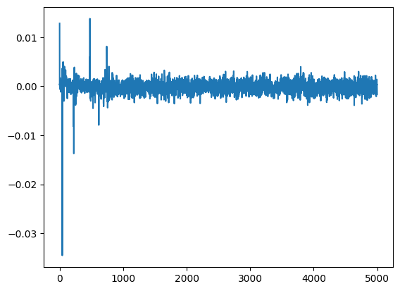

Part 3, Topic 1: Large Hamming Weight Swings (MAIN)
===================================================


**SUMMARY:** *In the previous part of the course, you saw that a
microcontroller’s power consumption changes based on what it’s doing. In
the case of a simple password check, this allowed us to see how many
characters of the password we had correct, eventually resulting in the
password being broken.*

*That attack was based on different code execution paths showing up
differently in power traces. In this next set of labs, we’ll posit that,
not only does different instructions affect power consumption, the data
being manipulated in the microcontroller also affects power
consumption.*

**LEARNING OUTCOMES:**

-  Using a power measurement to ‘validate’ a possible device model.
-  Detecting the value of a single bit using power measurement.
-  Breaking AES using the classic DPA attack.

Prerequisites
-------------

Hold up! Before you continue, check you’ve done the following tutorials:

-  ☑ Jupyter Notebook Intro (you should be OK with plotting & running
   blocks).
-  ☑ SCA101 Intro (you should have an idea of how to get
   hardware-specific versions running).
-  ☑ SCA101 Part 2 (you should understand how power consupmtion changes
   based on what code is being run)

Power Trace Gathering
---------------------

At this point you’ve got to insert code to perform the power trace
capture. There are two options here: \* Capture from physical device. \*
Read from a file.

You get to choose your adventure - see the two notebooks with the same
name of this, but called ``(SIMULATED)`` or ``(HARDWARE)`` to continue.
Inside those notebooks you should get some code to copy into the
following section, which will define the capture function.

Be sure you get the ``"✔️ OK to continue!"`` print once you run the next
cell, otherwise things will fail later on!


**In [1]:**

.. code:: ipython3

    SCOPETYPE = 'CWNANO'
    PLATFORM = 'CWNANO'
    CRYPTO_TARGET = 'TINYAES128C'
    VERSION = 'HARDWARE'
    
    SS_VER = 'SS_VER_2_1'
    allowable_exceptions = None


**In [2]:**

.. code:: ipython3

    if VERSION == 'HARDWARE':
        
        #!/usr/bin/env python
        # coding: utf-8
        
        # # Part 3, Topic 1: Large Hamming Weight Swings (HARDWARE)
        
        # ---
        # **THIS IS NOT THE COMPLETE TUTORIAL - see file with `(MAIN)` in the name.**
        # 
        # ---
        
        # First you'll need to select which hardware setup you have. You'll need to select a `SCOPETYPE`, a `PLATFORM`, and a `CRYPTO_TARGET`. `SCOPETYPE` can either be `'OPENADC'` for the CWLite/CW1200 or `'CWNANO'` for the CWNano. `PLATFORM` is the target device, with `'CWLITEARM'`/`'CW308_STM32F3'` being the best supported option, followed by `'CWLITEXMEGA'`/`'CW308_XMEGA'`, then by `'CWNANO'`. `CRYPTO_TARGET` selects the crypto implementation, with `'TINYAES128C'` working on all platforms. An alternative for `'CWLITEXMEGA'` targets is `'AVRCRYPTOLIB'`. For example:
        # 
        # ```python
        # SCOPETYPE = 'OPENADC'
        # PLATFORM = 'CWLITEARM'
        # CRYPTO_TARGET='TINYAES128C'
        # SS_VER='SS_VER_2_1'
        # ```
        
        # In[ ]:
        
        
        
        
        
        # The following code will build the firmware for the target.
        
        # In[ ]:
        
        
        
        #!/usr/bin/env python
        # coding: utf-8
        
        # In[ ]:
        
        
        import chipwhisperer as cw
        
        try:
            if not scope.connectStatus:
                scope.con()
        except NameError:
            scope = cw.scope(hw_location=(5, 7))
        
        try:
            if SS_VER == "SS_VER_2_1":
                target_type = cw.targets.SimpleSerial2
            elif SS_VER == "SS_VER_2_0":
                raise OSError("SS_VER_2_0 is deprecated. Use SS_VER_2_1")
            else:
                target_type = cw.targets.SimpleSerial
        except:
            SS_VER="SS_VER_1_1"
            target_type = cw.targets.SimpleSerial
        
        try:
            target = cw.target(scope, target_type)
        except:
            print("INFO: Caught exception on reconnecting to target - attempting to reconnect to scope first.")
            print("INFO: This is a work-around when USB has died without Python knowing. Ignore errors above this line.")
            scope = cw.scope(hw_location=(5, 7))
            target = cw.target(scope, target_type)
        
        
        print("INFO: Found ChipWhisperer😍")
        
        
        # In[ ]:
        
        
        if "STM" in PLATFORM or PLATFORM == "CWLITEARM" or PLATFORM == "CWNANO":
            prog = cw.programmers.STM32FProgrammer
        elif PLATFORM == "CW303" or PLATFORM == "CWLITEXMEGA":
            prog = cw.programmers.XMEGAProgrammer
        elif "neorv32" in PLATFORM.lower():
            prog = cw.programmers.NEORV32Programmer
        elif PLATFORM == "CW308_SAM4S" or PLATFORM == "CWHUSKY":
            prog = cw.programmers.SAM4SProgrammer
        else:
            prog = None
        
        
        # In[ ]:
        
        
        import time
        time.sleep(0.05)
        scope.default_setup()
        
        def reset_target(scope):
            if PLATFORM == "CW303" or PLATFORM == "CWLITEXMEGA":
                scope.io.pdic = 'low'
                time.sleep(0.1)
                scope.io.pdic = 'high_z' #XMEGA doesn't like pdic driven high
                time.sleep(0.1) #xmega needs more startup time
            elif "neorv32" in PLATFORM.lower():
                raise IOError("Default iCE40 neorv32 build does not have external reset - reprogram device to reset")
            elif PLATFORM == "CW308_SAM4S" or PLATFORM == "CWHUSKY":
                scope.io.nrst = 'low'
                time.sleep(0.25)
                scope.io.nrst = 'high_z'
                time.sleep(0.25)
            else:  
                scope.io.nrst = 'low'
                time.sleep(0.05)
                scope.io.nrst = 'high_z'
                time.sleep(0.05)
        
        
    
        
        
        # In[ ]:
        
        
        try:
            get_ipython().run_cell_magic('bash', '-s "$PLATFORM" "$CRYPTO_TARGET" "$SS_VER"', 'cd ../../../hardware/victims/firmware/simpleserial-aes\nmake PLATFORM=$1 CRYPTO_TARGET=$2 SS_VER=$3 -j\n &> /tmp/tmp.txt')
        except:
            x=open("/tmp/tmp.txt").read(); print(x); raise OSError(x)
    
        
        
        # In[ ]:
        
        
        cw.program_target(scope, prog, "../../../hardware/victims/firmware/simpleserial-aes/simpleserial-aes-{}.hex".format(PLATFORM))
        
        
        # The thing we want to test here is how hamming weight affects the power trace. To get as big a swing as possible, we'll convert all of the first bytes we send to be either `0x00` (HW of 0) or `0xFF` (HW of 8). 100 traces should be enough to see a difference:
        
        # In[ ]:
        
        
        from tqdm.notebook import trange
        import numpy as np
        import time
        
        ktp = cw.ktp.Basic()
        trace_array = []
        textin_array = []
        
        key, text = ktp.next()
        
        target.set_key(key)
        
        N = 100
        for i in trange(N, desc='Capturing traces'):
            scope.arm()
            if text[0] & 0x01:
                text[0] = 0xFF
            else:
                text[0] = 0x00
            target.simpleserial_write('p', text)
            
            ret = scope.capture()
            if ret:
                print("Target timed out!")
                continue
            
            response = target.simpleserial_read('r', 16)
            
            trace_array.append(scope.get_last_trace())
            textin_array.append(text)
            
            key, text = ktp.next() 
        
        
    
    elif VERSION == 'SIMULATED':
        
        #!/usr/bin/env python
        # coding: utf-8
        
        # # Part 3, Topic 1: Large Hamming Weight Swings (SIMULATED)
        
        # ---
        # **THIS IS NOT THE COMPLETE TUTORIAL - see file with `(MAIN)` in the name.**
        # 
        # ---
        
        # Instead of performing a capture - just copy this data into the referenced code block. It is a copy of the previously recorded data.
        
        # In[ ]:
        
        
        import numpy as np
        
        aes_traces_100_tracedata = np.load(r"traces/lab3_1_traces.npy")
        aes_traces_100_textindata = np.load(r"traces/lab3_1_textin.npy")
        
        trace_array = aes_traces_100_tracedata
        textin_array = aes_traces_100_textindata
        
        


**Out [2]:**


.. parsed-literal::

    INFO: Found ChipWhisperer😍
    Building for platform CWNANO with CRYPTO\_TARGET=TINYAES128C
    SS\_VER set to SS\_VER\_2\_1
    SS\_VER set to SS\_VER\_2\_1
    Blank crypto options, building for AES128
    Building for platform CWNANO with CRYPTO\_TARGET=TINYAES128C
    SS\_VER set to SS\_VER\_2\_1
    SS\_VER set to SS\_VER\_2\_1
    Blank crypto options, building for AES128
    make[1]: '.dep' is up to date.
    Building for platform CWNANO with CRYPTO\_TARGET=TINYAES128C
    SS\_VER set to SS\_VER\_2\_1
    SS\_VER set to SS\_VER\_2\_1
    Blank crypto options, building for AES128
    .
    Welcome to another exciting ChipWhisperer target build!!
    arm-none-eabi-gcc (15:9-2019-q4-0ubuntu1) 9.2.1 20191025 (release) [ARM/arm-9-branch revision 277599]
    Copyright (C) 2019 Free Software Foundation, Inc.
    This is free software; see the source for copying conditions.  There is NO
    warranty; not even for MERCHANTABILITY or FITNESS FOR A PARTICULAR PURPOSE.
    
    .
    .
    Compiling:
    Compiling:
    -en     simpleserial-aes.c ...
    -en     .././simpleserial/simpleserial.c ...
    .
    Compiling:
    .
    -en     .././hal/stm32f0\_nano/stm32f0\_hal\_nano.c ...
    Compiling:
    -en     .././hal/stm32f0/stm32f0\_hal\_lowlevel.c ...
    .
    Compiling:
    .
    -en     .././crypto/tiny-AES128-C/aes.c ...
    Compiling:
    -en     .././crypto/aes-independant.c ...
    .
    Assembling: .././hal/stm32f0/stm32f0\_startup.S
    arm-none-eabi-gcc -c -mcpu=cortex-m0 -I. -x assembler-with-cpp -mthumb -mfloat-abi=soft -ffunction-sections -DF\_CPU=7372800 -Wa,-gstabs,-adhlns=objdir-CWNANO/stm32f0\_startup.lst -I.././simpleserial/ -I.././hal -I.././hal/stm32f0 -I.././hal/stm32f0/CMSIS -I.././hal/stm32f0/CMSIS/core -I.././hal/stm32f0/CMSIS/device -I.././hal/stm32f0/Legacy -I.././simpleserial/ -I.././crypto/ -I.././crypto/tiny-AES128-C .././hal/stm32f0/stm32f0\_startup.S -o objdir-CWNANO/stm32f0\_startup.o
    -e Done!
    -e Done!
    -e Done!
    -e Done!
    -e Done!
    -e Done!
    .
    LINKING:
    -en     simpleserial-aes-CWNANO.elf ...
    -e Done!
    .
    .
    Creating load file for Flash: simpleserial-aes-CWNANO.hex
    Creating load file for Flash: simpleserial-aes-CWNANO.bin
    arm-none-eabi-objcopy -O ihex -R .eeprom -R .fuse -R .lock -R .signature simpleserial-aes-CWNANO.elf simpleserial-aes-CWNANO.hex
    .
    arm-none-eabi-objcopy -O binary -R .eeprom -R .fuse -R .lock -R .signature simpleserial-aes-CWNANO.elf simpleserial-aes-CWNANO.bin
    .
    Creating load file for EEPROM: simpleserial-aes-CWNANO.eep
    Creating Extended Listing: simpleserial-aes-CWNANO.lss
    .
    arm-none-eabi-objcopy -j .eeprom --set-section-flags=.eeprom="alloc,load" \
    --change-section-lma .eeprom=0 --no-change-warnings -O ihex simpleserial-aes-CWNANO.elf simpleserial-aes-CWNANO.eep \|\| exit 0
    Creating Symbol Table: simpleserial-aes-CWNANO.sym
    arm-none-eabi-nm -n simpleserial-aes-CWNANO.elf > simpleserial-aes-CWNANO.sym
    arm-none-eabi-objdump -h -S -z simpleserial-aes-CWNANO.elf > simpleserial-aes-CWNANO.lss
    Building for platform CWNANO with CRYPTO\_TARGET=TINYAES128C
    SS\_VER set to SS\_VER\_2\_1
    SS\_VER set to SS\_VER\_2\_1
    Blank crypto options, building for AES128
    Size after:
    +--------------------------------------------------------
    +--------------------------------------------------------
    + Default target does full rebuild each time.
       text	   data	    bss	    dec	    hex	filename
       5564	    536	   1568	   7668	   1df4	simpleserial-aes-CWNANO.elf
    + Built for platform CWNANO Built-in Target (STM32F030) with:
    + Specify buildtarget == allquick == to avoid full rebuild
    + CRYPTO\_TARGET = TINYAES128C
    +--------------------------------------------------------
    + CRYPTO\_OPTIONS = AES128C
    +--------------------------------------------------------
    Detected known STMF32: STM32F04xxx
    Extended erase (0x44), this can take ten seconds or more
    Attempting to program 6099 bytes at 0x8000000
    STM32F Programming flash...
    STM32F Reading flash...
    Verified flash OK, 6099 bytes


.. parsed-literal::

    Capturing traces:   0%|          | 0/100 [00:00<?, ?it/s]


**In [3]:**

.. code:: ipython3

    print(len(trace_array))


**Out [3]:**


.. parsed-literal::

    100


**In [4]:**

.. code:: ipython3

    assert len(trace_array) == 100
    print("✔️ OK to continue!")


**Out [4]:**


.. parsed-literal::

    ✔️ OK to continue!


Grouping Traces
---------------

As we’ve seen in the slides, we’ve made an assumption that setting bits
on the data lines consumes a measurable amount of power. Now, we’re
going test that theory by getting our target to manipulate data with a
very high Hamming weight (0xFF) and a very low Hamming weight (0x00).
For this purpose, the target is currently running AES, and it encrypted
the text we sent it. If we’re correct in our assumption, we should see a
measurable difference between power traces with a high Hamming weight
and a low one.

Currently, these traces are all mixed up. Separate them into two groups:
``one_list`` and ``zero_list``:


**In [5]:**

.. code:: ipython3

    # ###################
    # Add your code here
    # ###################
    #raise NotImplementedError("Add Your Code Here")
    
    # ###################
    # START SOLUTION
    # ###################
    one_list = []
    zero_list = []
    
    for i in range(len(trace_array)):
        if textin_array[i][0] == 0x00:
            one_list.append(trace_array[i])
        else:
            zero_list.append(trace_array[i])
    # ###################
    # END SOLUTION
    # ###################
    
    assert len(one_list) > len(zero_list)/2
    assert len(zero_list) > len(one_list)/2

We should have two different lists. Whether we sent 0xFF or 0x00 was
random, so these lists likely won’t be evenly dispersed. Next, we’ll
want to take an average of each group (make sure you take an average of
each trace at each point! We don’t want an average of the traces in
time), which will help smooth out any outliers and also fix our issue of
having a different number of traces for each group:


**In [6]:**

.. code:: ipython3

    # ###################
    # Add your code here
    # ###################
    #raise NotImplementedError("Add Your Code Here")
    
    # ###################
    # START SOLUTION
    # ###################
    one_avg = np.mean(one_list, axis=0)
    zero_avg = np.mean(zero_list, axis=0)
    # ###################
    # END SOLUTION
    # ###################

Finally, subtract the two averages and plot the resulting data:


**In [7]:**

.. code:: ipython3

    # ###################
    # Add your code here
    # ###################
    #raise NotImplementedError("Add Your Code Here")
    
    # ###################
    # START SOLUTION
    # ###################
    %matplotlib inline
    import matplotlib.pyplot as plt
    
    diff = one_avg - zero_avg
    
    plt.plot(diff)
    plt.show()
    # ###################
    # END SOLUTION
    # ###################


**Out [7]:**





You should see a very distinct trace near the beginning of the plot,
meaning that the data being manipulated in the target device is visible
in its power trace! Again, there’s a lot of room to explore here:

-  Try setting multiple bytes to 0x00 and 0xFF.
-  Try using smaller hamming weight differences. Is the spike still
   distinct? What about if you capture more traces?
-  We focused on the first byte here. Try putting the difference plots
   for multiple different bytes on the same plot.
-  The target is running AES here. Can you get the spikes to appear in
   different places if you set a byte in a later round of AES (say round
   5) to 0x00 or 0xFF?

--------------

NO-FUN DISCLAIMER: This material is Copyright (C) NewAE Technology Inc.,
2015-2020. ChipWhisperer is a trademark of NewAE Technology Inc.,
claimed in all jurisdictions, and registered in at least the United
States of America, European Union, and Peoples Republic of China.

Tutorials derived from our open-source work must be released under the
associated open-source license, and notice of the source must be
*clearly displayed*. Only original copyright holders may license or
authorize other distribution - while NewAE Technology Inc. holds the
copyright for many tutorials, the github repository includes community
contributions which we cannot license under special terms and **must**
be maintained as an open-source release. Please contact us for special
permissions (where possible).

THE SOFTWARE IS PROVIDED “AS IS”, WITHOUT WARRANTY OF ANY KIND, EXPRESS
OR IMPLIED, INCLUDING BUT NOT LIMITED TO THE WARRANTIES OF
MERCHANTABILITY, FITNESS FOR A PARTICULAR PURPOSE AND NONINFRINGEMENT.
IN NO EVENT SHALL THE AUTHORS OR COPYRIGHT HOLDERS BE LIABLE FOR ANY
CLAIM, DAMAGES OR OTHER LIABILITY, WHETHER IN AN ACTION OF CONTRACT,
TORT OR OTHERWISE, ARISING FROM, OUT OF OR IN CONNECTION WITH THE
SOFTWARE OR THE USE OR OTHER DEALINGS IN THE SOFTWARE.
