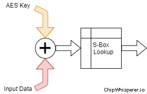
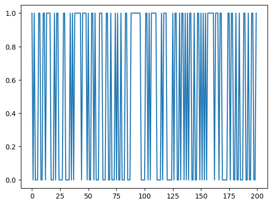
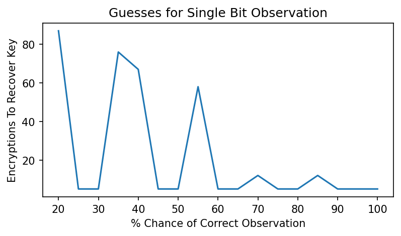

Part 3, Topic 2: Recovering AES Key from a Single Bit of Data
=============================================================

Let’s do a basic demo to recover a single bit of data from an internal
state of an AES implementation, and see how far we can take our attack.

**SUMMARY:** *This lab will take you through the associated information
about how to recover an AES key from a single “bit” of leakage. We
already saw how power analysis can be used to understand device leakage,
but how does that mean we can recover cryptographic information?*

**LEARNING OUTCOMES:**

-  Understand some basics of the AES algorithm.
-  See how a single bit of leakage can translate to a full key reveal.
-  See how to sort and ranking lists.

1. AES Refresher
----------------

You’ll be an expert at AES (or recognizing AES figures) by the end of
this course! Remember that the input data flow for AES is something like
this:

   aes-input-sbox

Where the input data is XOR’d with a key byte, and then passed through
an S-Box. First, let’s build our AES model. I’m going to make your life
slightly easier by giving you the S-Box data:

**In [ ]:**

**In [1]:**

.. code:: ipython3

    sbox = [
        # 0    1    2    3    4    5    6    7    8    9    a    b    c    d    e    f 
        0x63,0x7c,0x77,0x7b,0xf2,0x6b,0x6f,0xc5,0x30,0x01,0x67,0x2b,0xfe,0xd7,0xab,0x76, # 0
        0xca,0x82,0xc9,0x7d,0xfa,0x59,0x47,0xf0,0xad,0xd4,0xa2,0xaf,0x9c,0xa4,0x72,0xc0, # 1
        0xb7,0xfd,0x93,0x26,0x36,0x3f,0xf7,0xcc,0x34,0xa5,0xe5,0xf1,0x71,0xd8,0x31,0x15, # 2
        0x04,0xc7,0x23,0xc3,0x18,0x96,0x05,0x9a,0x07,0x12,0x80,0xe2,0xeb,0x27,0xb2,0x75, # 3
        0x09,0x83,0x2c,0x1a,0x1b,0x6e,0x5a,0xa0,0x52,0x3b,0xd6,0xb3,0x29,0xe3,0x2f,0x84, # 4
        0x53,0xd1,0x00,0xed,0x20,0xfc,0xb1,0x5b,0x6a,0xcb,0xbe,0x39,0x4a,0x4c,0x58,0xcf, # 5
        0xd0,0xef,0xaa,0xfb,0x43,0x4d,0x33,0x85,0x45,0xf9,0x02,0x7f,0x50,0x3c,0x9f,0xa8, # 6
        0x51,0xa3,0x40,0x8f,0x92,0x9d,0x38,0xf5,0xbc,0xb6,0xda,0x21,0x10,0xff,0xf3,0xd2, # 7
        0xcd,0x0c,0x13,0xec,0x5f,0x97,0x44,0x17,0xc4,0xa7,0x7e,0x3d,0x64,0x5d,0x19,0x73, # 8
        0x60,0x81,0x4f,0xdc,0x22,0x2a,0x90,0x88,0x46,0xee,0xb8,0x14,0xde,0x5e,0x0b,0xdb, # 9
        0xe0,0x32,0x3a,0x0a,0x49,0x06,0x24,0x5c,0xc2,0xd3,0xac,0x62,0x91,0x95,0xe4,0x79, # a
        0xe7,0xc8,0x37,0x6d,0x8d,0xd5,0x4e,0xa9,0x6c,0x56,0xf4,0xea,0x65,0x7a,0xae,0x08, # b
        0xba,0x78,0x25,0x2e,0x1c,0xa6,0xb4,0xc6,0xe8,0xdd,0x74,0x1f,0x4b,0xbd,0x8b,0x8a, # c
        0x70,0x3e,0xb5,0x66,0x48,0x03,0xf6,0x0e,0x61,0x35,0x57,0xb9,0x86,0xc1,0x1d,0x9e, # d
        0xe1,0xf8,0x98,0x11,0x69,0xd9,0x8e,0x94,0x9b,0x1e,0x87,0xe9,0xce,0x55,0x28,0xdf, # e
        0x8c,0xa1,0x89,0x0d,0xbf,0xe6,0x42,0x68,0x41,0x99,0x2d,0x0f,0xb0,0x54,0xbb,0x16  # f
    ]

Alright - that should be enough for you to build a simple function that
XORs a secret key value with the input data, and then performs a lookup
in the above table. Before you continue, modify the following code block
to implement the correct function:

1.1 ``aes_internal()``
~~~~~~~~~~~~~~~~~~~~~~

**In [2]:**

.. code:: ipython3

    def aes_internal(inputdata, key):
        return sbox[inputdata ^ key]

With that working - go ahead and run the following test vectors. If the
values are not as expected, check your implementation. If the following
executes without error, then go onto the next part.

**In [3]:**

.. code:: ipython3

    #Simple test vectors - if you get the check-mark printed all OK.
    assert(aes_internal(0xAB, 0xEF) == 0x1B)
    assert(aes_internal(0x22, 0x01) == 0x26)
    print("✔️ OK to continue!")

**Out [3]:**

.. parsed-literal::

    ✔️ OK to continue!

Finally - we’ll make a new function which doesn’t expose the key. The
following function has some hard-coded key. You can change this key byte
if you’d like, and see it recovered at a later step!

1.2 ``aes_secret()``
--------------------

**In [4]:**

.. code:: ipython3

    def aes_secret(inputdata):
        secret_key = 0xEF
        return aes_internal(secret_key, inputdata)

At this point, we can get the value of some internal part of the AES
algorithm. For our first attack, we’re going to assume that we can’t
observe this entire value. Let’s just observe a single bit of the value
- imagine that someone put a probe down inside the chip to get this. We
can do this by simply throwing away all the other data besides a single
bit, and only expose that single bit to the observer.

Let’s build the watcher now.

2. AES Watcher
--------------

The watcher is going to observe a single bit of data. We’ll need to
build lists of input we feed to the algorithm (we’re just going to send
in 1000 random bytes that get ‘encrypted’), as well as lists to hold our
observation. In case you’re still picking up Python, here are a few
handy little things you might need in this section:

**In [5]:**

.. code:: ipython3

    ##Some Python hints/useful functions:
    
    # You can use this function to generate the random data
    import random
    random.randint(0, 255)
    
    # List comprehension can be used to shovel data through a function
    def somefunc(a):
        return a + 4
    input_data = [1,2,5,6]
    output_data = [somefunc(a) for a in input_data]
    
    # You can use this while ignoring the index variable too
    output_data = [somefunc(random.randint(0,255)) for _ in range(0, 1000)]

Your first objective is to build a list of data you are encrypted with
aes_secret(). This should be a 1000-item random number which ranges from
0 to 255. Call it ``input_data``. For example if you print the
``input_data`` list it could look like
``[2, 49, 0, 212, 94, 255, ... , 7]``, where there are 1000 elements in
total. Fill in the following code to make a list of the 1000 random
values in the correct range (see hints above if you need some Python
syntax).

2.1 Generation of ``input_data``
~~~~~~~~~~~~~~~~~~~~~~~~~~~~~~~~

**In [6]:**

.. code:: ipython3

    input_data = [random.randint(0,255) for _ in range(0, 1000)]

**In [7]:**

.. code:: ipython3

    #Simple test vectors - if you get the check-mark printed all OK.
    assert(len(input_data) == 1000)
    #assert(max(input_data) == 0xFF) #Possibly not true for random variables (re-run if you get an error)
    #assert(min(input_data) == 0x00) #Possibly not true for random variables (re-run if you get an error)
    print("✔️ OK to continue!")

**Out [7]:**

.. parsed-literal::

    ✔️ OK to continue!

Now, feed all those inputs through the ``aes_secret`` function. Because
this is a secret function we are only going to observe a single bit of
output (the ‘leakage’). The following will perform the encryptions and
mask off all but the lowest bit for you, and build a new array called
``leaked_data`` which contains just the 1 or 0 status of the lowest bit.

2.2 Definition of ``leaked_data``
~~~~~~~~~~~~~~~~~~~~~~~~~~~~~~~~~

**In [8]:**

.. code:: ipython3

    leaked_data = [(aes_secret(a) & 0x01) for a in input_data]

If you run the following too cells, it will then print some of the data
so you can see the sequence of 1 and 0.

**In [9]:**

.. code:: ipython3

    print(leaked_data)

**Out [9]:**

.. parsed-literal::

    [1, 1, 1, 0, 0, 1, 1, 0, 0, 1, 1, 0, 1, 0, 1, 0, 0, 1, 1, 1, 1, 1, 0, 1, 1, 0, 0, 1, 1, 1, 1, 0, 0, 1, 1, 1, 1, 1, 0, 0, 0, 1, 0, 0, 1, 0, 1, 1, 1, 1, 0, 1, 0, 1, 0, 0, 1, 0, 0, 1, 1, 0, 1, 1, 1, 1, 1, 1, 0, 1, 1, 1, 0, 0, 0, 1, 0, 0, 1, 0, 0, 0, 0, 0, 0, 1, 0, 1, 0, 1, 1, 1, 0, 1, 0, 1, 0, 0, 0, 0, 1, 0, 1, 1, 0, 1, 0, 0, 1, 0, 1, 0, 0, 1, 0, 0, 0, 1, 1, 0, 1, 0, 0, 1, 1, 0, 0, 0, 1, 1, 1, 1, 1, 0, 0, 1, 0, 1, 0, 0, 0, 0, 0, 0, 0, 1, 0, 1, 1, 0, 1, 0, 1, 1, 0, 1, 1, 0, 1, 0, 1, 1, 0, 1, 1, 0, 1, 1, 0, 1, 1, 1, 1, 0, 1, 1, 0, 1, 0, 0, 0, 1, 1, 1, 1, 1, 0, 1, 0, 1, 1, 0, 0, 1, 1, 0, 0, 0, 1, 1, 1, 1, 0, 0, 0, 0, 0, 1, 1, 0, 0, 1, 0, 0, 0, 0, 1, 0, 1, 0, 1, 1, 1, 1, 0, 1, 1, 1, 1, 1, 0, 1, 1, 0, 1, 0, 1, 1, 0, 1, 1, 0, 0, 0, 1, 0, 1, 1, 0, 0, 0, 1, 1, 0, 1, 0, 1, 1, 0, 0, 1, 0, 0, 1, 0, 0, 1, 0, 1, 0, 0, 0, 0, 1, 1, 0, 1, 1, 0, 1, 1, 0, 1, 1, 1, 0, 1, 0, 0, 0, 0, 0, 1, 0, 0, 1, 1, 0, 0, 0, 0, 0, 1, 1, 1, 0, 0, 0, 0, 1, 1, 0, 0, 0, 1, 0, 0, 1, 0, 1, 0, 1, 1, 0, 1, 0, 0, 1, 0, 0, 1, 0, 0, 1, 0, 1, 0, 1, 1, 1, 1, 0, 0, 0, 0, 1, 0, 0, 1, 1, 1, 0, 1, 1, 1, 1, 0, 1, 0, 1, 0, 0, 0, 1, 0, 1, 1, 0, 1, 0, 0, 1, 0, 1, 0, 0, 0, 1, 0, 1, 1, 1, 0, 0, 1, 0, 0, 0, 1, 0, 0, 0, 0, 1, 1, 1, 1, 0, 0, 0, 0, 1, 0, 0, 1, 1, 0, 0, 0, 1, 1, 1, 1, 1, 0, 1, 0, 1, 0, 0, 1, 1, 0, 0, 1, 0, 0, 0, 0, 0, 1, 0, 0, 1, 1, 1, 1, 0, 1, 1, 0, 1, 0, 1, 0, 1, 1, 0, 1, 0, 1, 0, 1, 1, 0, 0, 1, 1, 1, 0, 1, 1, 1, 0, 0, 1, 1, 1, 1, 1, 1, 0, 1, 1, 0, 1, 1, 0, 0, 0, 0, 1, 0, 1, 0, 0, 0, 1, 1, 0, 1, 0, 0, 0, 1, 0, 0, 0, 1, 0, 0, 0, 0, 1, 1, 1, 1, 0, 1, 0, 0, 0, 1, 1, 0, 0, 0, 0, 1, 1, 1, 0, 0, 1, 0, 1, 0, 1, 1, 1, 1, 1, 0, 0, 0, 0, 0, 0, 1, 1, 0, 1, 1, 0, 0, 0, 0, 1, 0, 0, 1, 0, 1, 0, 0, 0, 1, 1, 1, 1, 1, 0, 0, 1, 1, 1, 0, 0, 0, 0, 0, 1, 1, 1, 1, 1, 0, 1, 1, 1, 1, 0, 0, 0, 1, 0, 1, 0, 1, 0, 0, 1, 0, 1, 1, 0, 1, 1, 1, 0, 1, 0, 1, 0, 1, 1, 1, 0, 0, 0, 0, 0, 0, 0, 1, 0, 0, 1, 0, 0, 0, 1, 1, 0, 0, 1, 0, 0, 0, 0, 0, 0, 0, 0, 1, 0, 1, 1, 0, 1, 1, 1, 0, 1, 1, 0, 0, 0, 0, 1, 1, 1, 0, 1, 0, 0, 0, 0, 1, 1, 0, 1, 0, 1, 1, 0, 1, 1, 0, 1, 1, 0, 1, 0, 0, 1, 0, 1, 1, 1, 1, 0, 1, 1, 0, 1, 1, 0, 1, 0, 0, 1, 1, 0, 1, 1, 1, 1, 1, 0, 0, 0, 1, 1, 0, 0, 0, 0, 1, 0, 0, 1, 0, 0, 0, 0, 1, 1, 0, 0, 0, 0, 1, 0, 0, 0, 1, 0, 0, 0, 1, 0, 1, 1, 1, 1, 1, 0, 0, 0, 0, 1, 1, 1, 0, 1, 1, 1, 1, 1, 1, 0, 0, 0, 1, 1, 1, 1, 1, 0, 0, 1, 1, 0, 1, 1, 1, 1, 1, 0, 0, 0, 0, 0, 0, 1, 0, 0, 1, 0, 0, 0, 1, 1, 1, 0, 1, 0, 0, 0, 0, 1, 0, 0, 0, 1, 1, 1, 0, 0, 1, 0, 1, 1, 0, 1, 0, 0, 0, 1, 0, 0, 1, 0, 0, 0, 0, 0, 0, 1, 1, 1, 1, 1, 0, 0, 0, 0, 0, 1, 0, 1, 1, 1, 0, 1, 0, 0, 0, 0, 0, 1, 1, 1, 1, 1, 1, 0, 1, 0, 0, 0, 0, 0, 0, 0, 0, 0, 0, 1, 1, 0, 0, 0, 1, 1, 1, 1, 0, 1, 0, 0, 0, 0, 0, 0, 1, 1, 1, 1, 1, 1, 1, 1, 1, 0, 1, 1, 0, 0, 0, 0, 1, 0, 1, 1, 1, 1, 1, 1, 0, 1, 0, 0, 1, 0, 1, 1, 1, 0, 1, 0, 0, 0, 1, 1, 0, 0, 1, 1, 1, 1, 1, 0, 0, 0, 1, 0, 0, 0, 0, 1, 0, 0, 1, 1, 0, 1, 1, 1, 1, 1, 0, 1, 1, 1, 1, 1, 0, 1, 0, 0, 0, 0, 1, 0, 1, 1, 1, 1, 1, 0, 0, 0, 0, 1, 1, 0, 0, 1, 0, 1, 1, 0, 1, 1, 0, 0, 0, 1, 0, 0, 1, 0, 1, 0, 0, 1, 1, 0, 1, 1, 1, 0, 0, 1, 0, 1, 1, 0]

You can also plot for example the patterns of 1’s and 0’s - this gets
pretty squashed, so let’s just look at a few hundred transitions:

**In [10]:**

.. code:: ipython3

    import matplotlib.pylab as plt
    plt.plot(leaked_data[0:200])
    plt.show()

**Out [10]:**

Do you think we’ll be able to get something useful out of this? Let’s
attack it to find out.

3. AES Guesser
--------------

The attack is pretty simple. Let’s just use our model of the device (we
know what the encryption does after all, just not the secret key). And
we’ll feed in the observed data for each possible value of the key. And
then we can observe how many (if any) of the keys result in the
observation and simulation matching each other. If the observation and
simulation match, this suggets our simulation is running in the same
“setup” as the implementation we are attacking!

First, build a function to count the number of elements in a list that
match between two lists (that is - same value of the element at the same
list index). An easy way is to just iterate through the number of
elements in the list and count the number that are the same. Fill in the
following - there is already some bounds checking code to get you
started.

3.1 ``num_same()``
~~~~~~~~~~~~~~~~~~

**In [11]:**

.. code:: ipython3

    def num_same(a, b):
        
        if len(a) != len(b):
            raise ValueError("Arrays must be same length!")
    
        if max(a) != max(b):
            raise ValueError("Arrays max() should be the same!")
        
        #Count how many list items match up
        same = 0
        for i, _ in enumerate(a):
            if a[i] == b[i]:
                same += 1
        
        return same

**In [12]:**

.. code:: ipython3

    #Simple test vectors - if you get the check-mark printed all OK.
    assert(num_same([0,1,0,1,1,1,1,0], [0,1,0,1,1,1,1,0]) == 8)
    assert(num_same([1,1,1,0,0,0,0,0], [0,1,0,1,1,1,1,0]) == 2)
    assert(num_same([1, 0], [0, 1]) == 0)
    print("✔️ OK to continue!")

**Out [12]:**

.. parsed-literal::

    ✔️ OK to continue!

The next block is the most important. You’ll need to “apply” the leakage
function - that is for each known input byte, pass it through the
``aes_internal(input_data, key_guess)`` function. The value of
``key_guess`` is just integers in ``[0x00, 0x01,...,0xFF]`` - aka every
possible value of the key byte. We’ll compare the number of matching
bits between our observed (leaked) data bit and the hypothetical data
bit.

3.2 Guessing Loop
~~~~~~~~~~~~~~~~~

**In [13]:**

.. code:: ipython3

    for guess in range(0, 256):   
        
        #Get a hypothetical leakage list - use aes_internal(guess, input_byte) and mask off to only get value of lowest bit.
        #You'll need to make this into a list as wel.
        hypothetical_leakage = [aes_internal(guess, input_byte) & 0x01 for input_byte in input_data]
        
        #Use our function
        same_count = num_same(hypothetical_leakage, leaked_data)   
        
        #Print for debug
        print("Guess {:02X}: {:4d} bits same".format(guess, same_count))

**Out [13]:**

.. parsed-literal::

    Guess 00:  458 bits same
    Guess 01:  451 bits same
    Guess 02:  514 bits same
    Guess 03:  539 bits same
    Guess 04:  469 bits same
    Guess 05:  478 bits same
    Guess 06:  478 bits same
    Guess 07:  498 bits same
    Guess 08:  491 bits same
    Guess 09:  487 bits same
    Guess 0A:  519 bits same
    Guess 0B:  502 bits same
    Guess 0C:  558 bits same
    Guess 0D:  563 bits same
    Guess 0E:  533 bits same
    Guess 0F:  527 bits same
    Guess 10:  503 bits same
    Guess 11:  524 bits same
    Guess 12:  454 bits same
    Guess 13:  501 bits same
    Guess 14:  489 bits same
    Guess 15:  509 bits same
    Guess 16:  506 bits same
    Guess 17:  551 bits same
    Guess 18:  465 bits same
    Guess 19:  465 bits same
    Guess 1A:  425 bits same
    Guess 1B:  528 bits same
    Guess 1C:  517 bits same
    Guess 1D:  452 bits same
    Guess 1E:  464 bits same
    Guess 1F:  527 bits same
    Guess 20:  469 bits same
    Guess 21:  543 bits same
    Guess 22:  471 bits same
    Guess 23:  477 bits same
    Guess 24:  495 bits same
    Guess 25:  475 bits same
    Guess 26:  583 bits same
    Guess 27:  463 bits same
    Guess 28:  492 bits same
    Guess 29:  457 bits same
    Guess 2A:  497 bits same
    Guess 2B:  474 bits same
    Guess 2C:  442 bits same
    Guess 2D:  500 bits same
    Guess 2E:  506 bits same
    Guess 2F:  529 bits same
    Guess 30:  494 bits same
    Guess 31:  516 bits same
    Guess 32:  452 bits same
    Guess 33:  520 bits same
    Guess 34:  564 bits same
    Guess 35:  453 bits same
    Guess 36:  509 bits same
    Guess 37:  581 bits same
    Guess 38:  499 bits same
    Guess 39:  469 bits same
    Guess 3A:  466 bits same
    Guess 3B:  536 bits same
    Guess 3C:  482 bits same
    Guess 3D:  576 bits same
    Guess 3E:  466 bits same
    Guess 3F:  503 bits same
    Guess 40:  526 bits same
    Guess 41:  529 bits same
    Guess 42:  472 bits same
    Guess 43:  466 bits same
    Guess 44:  507 bits same
    Guess 45:  483 bits same
    Guess 46:  528 bits same
    Guess 47:  469 bits same
    Guess 48:  492 bits same
    Guess 49:  441 bits same
    Guess 4A:  516 bits same
    Guess 4B:  498 bits same
    Guess 4C:  466 bits same
    Guess 4D:  494 bits same
    Guess 4E:  473 bits same
    Guess 4F:  446 bits same
    Guess 50:  560 bits same
    Guess 51:  516 bits same
    Guess 52:  491 bits same
    Guess 53:  553 bits same
    Guess 54:  503 bits same
    Guess 55:  548 bits same
    Guess 56:  483 bits same
    Guess 57:  470 bits same
    Guess 58:  477 bits same
    Guess 59:  489 bits same
    Guess 5A:  505 bits same
    Guess 5B:  469 bits same
    Guess 5C:  543 bits same
    Guess 5D:  504 bits same
    Guess 5E:  452 bits same
    Guess 5F:  462 bits same
    Guess 60:  497 bits same
    Guess 61:  510 bits same
    Guess 62:  577 bits same
    Guess 63:  497 bits same
    Guess 64:  504 bits same
    Guess 65:  505 bits same
    Guess 66:  549 bits same
    Guess 67:  454 bits same
    Guess 68:  475 bits same
    Guess 69:  494 bits same
    Guess 6A:  503 bits same
    Guess 6B:  562 bits same
    Guess 6C:  528 bits same
    Guess 6D:  528 bits same
    Guess 6E:  450 bits same
    Guess 6F:  469 bits same
    Guess 70:  518 bits same
    Guess 71:  487 bits same
    Guess 72:  509 bits same
    Guess 73:  513 bits same
    Guess 74:  528 bits same
    Guess 75:  468 bits same
    Guess 76:  457 bits same
    Guess 77:  482 bits same
    Guess 78:  443 bits same
    Guess 79:  485 bits same
    Guess 7A:  548 bits same
    Guess 7B:  454 bits same
    Guess 7C:  413 bits same
    Guess 7D:  544 bits same
    Guess 7E:  473 bits same
    Guess 7F:  469 bits same
    Guess 80:  512 bits same
    Guess 81:  566 bits same
    Guess 82:  544 bits same
    Guess 83:  458 bits same
    Guess 84:  529 bits same
    Guess 85:  501 bits same
    Guess 86:  436 bits same
    Guess 87:  532 bits same
    Guess 88:  479 bits same
    Guess 89:  552 bits same
    Guess 8A:  552 bits same
    Guess 8B:  501 bits same
    Guess 8C:  449 bits same
    Guess 8D:  518 bits same
    Guess 8E:  530 bits same
    Guess 8F:  512 bits same
    Guess 90:  450 bits same
    Guess 91:  546 bits same
    Guess 92:  544 bits same
    Guess 93:  539 bits same
    Guess 94:  474 bits same
    Guess 95:  482 bits same
    Guess 96:  482 bits same
    Guess 97:  405 bits same
    Guess 98:  491 bits same
    Guess 99:  541 bits same
    Guess 9A:  505 bits same
    Guess 9B:  451 bits same
    Guess 9C:  485 bits same
    Guess 9D:  475 bits same
    Guess 9E:  530 bits same
    Guess 9F:  486 bits same
    Guess A0:  499 bits same
    Guess A1:  469 bits same
    Guess A2:  498 bits same
    Guess A3:  581 bits same
    Guess A4:  540 bits same
    Guess A5:  482 bits same
    Guess A6:  542 bits same
    Guess A7:  455 bits same
    Guess A8:  505 bits same
    Guess A9:  518 bits same
    Guess AA:  476 bits same
    Guess AB:  510 bits same
    Guess AC:  493 bits same
    Guess AD:  520 bits same
    Guess AE:  431 bits same
    Guess AF:  470 bits same
    Guess B0:  561 bits same
    Guess B1:  463 bits same
    Guess B2:  503 bits same
    Guess B3:  548 bits same
    Guess B4:  520 bits same
    Guess B5:  483 bits same
    Guess B6:  477 bits same
    Guess B7:  508 bits same
    Guess B8:  535 bits same
    Guess B9:  565 bits same
    Guess BA:  515 bits same
    Guess BB:  483 bits same
    Guess BC:  458 bits same
    Guess BD:  478 bits same
    Guess BE:  461 bits same
    Guess BF:  472 bits same
    Guess C0:  410 bits same
    Guess C1:  443 bits same
    Guess C2:  475 bits same
    Guess C3:  475 bits same
    Guess C4:  511 bits same
    Guess C5:  554 bits same
    Guess C6:  495 bits same
    Guess C7:  534 bits same
    Guess C8:  497 bits same
    Guess C9:  546 bits same
    Guess CA:  460 bits same
    Guess CB:  522 bits same
    Guess CC:  497 bits same
    Guess CD:  504 bits same
    Guess CE:  486 bits same
    Guess CF:  540 bits same
    Guess D0:  497 bits same
    Guess D1:  519 bits same
    Guess D2:  527 bits same
    Guess D3:  454 bits same
    Guess D4:  450 bits same
    Guess D5:  550 bits same
    Guess D6:  477 bits same
    Guess D7:  562 bits same
    Guess D8:  523 bits same
    Guess D9:  522 bits same
    Guess DA:  532 bits same
    Guess DB:  422 bits same
    Guess DC:  500 bits same
    Guess DD:  536 bits same
    Guess DE:  522 bits same
    Guess DF:  541 bits same
    Guess E0:  481 bits same
    Guess E1:  518 bits same
    Guess E2:  476 bits same
    Guess E3:  478 bits same
    Guess E4:  500 bits same
    Guess E5:  459 bits same
    Guess E6:  467 bits same
    Guess E7:  453 bits same
    Guess E8:  546 bits same
    Guess E9:  469 bits same
    Guess EA:  542 bits same
    Guess EB:  476 bits same
    Guess EC:  527 bits same
    Guess ED:  526 bits same
    Guess EE:  463 bits same
    Guess EF: 1000 bits same
    Guess F0:  463 bits same
    Guess F1:  471 bits same
    Guess F2:  482 bits same
    Guess F3:  466 bits same
    Guess F4:  531 bits same
    Guess F5:  464 bits same
    Guess F6:  484 bits same
    Guess F7:  521 bits same
    Guess F8:  452 bits same
    Guess F9:  556 bits same
    Guess FA:  456 bits same
    Guess FB:  478 bits same
    Guess FC:  524 bits same
    Guess FD:  473 bits same
    Guess FE:  481 bits same
    Guess FF:  530 bits same

If your key guess is wrong, about half of the guesses should be wrong.
Looking through the list, you’ll see that most of the “bits same”
numbers will be around 500. But scroll down to the correct key value
(should be ``0xEF`` if you haven’t changed it earlier). With any luck,
that number should be fully correct - 1000 matching bits. This is only
possible if the internal “secret key” byte matches the observed key.

3.3 ``argsort`` background
~~~~~~~~~~~~~~~~~~~~~~~~~~

Now a handy thing to do will be to sort based on the values by number of
correct bits so we don’t have to look through that list. An easy way to
do this is with ``numpy.argsort`` - this returns the indicies that would
sort the list. To start small, take the following for example:

**In [14]:**

.. code:: ipython3

    import numpy as np
    
    count_list = [2, 7, 24, 4, 5]
    
    np.argsort(count_list)

**Out [14]:**

.. parsed-literal::

    array([0, 3, 4, 1, 2])

This should return ``[0, 3, 4, 1, 2]`` - you can cast the above to
``list()`` type if you want to get rid of the ``array()`` type around
it.

Inspecting the above, notice that this is the position of each from
lowest to highest. We can reverse this to give us a highest to lowest
sort instead:

**In [15]:**

.. code:: ipython3

    import numpy as np
    
    count_list = [2, 7, 24, 4, 5]
    
    np.argsort(count_list)[::-1]

**Out [15]:**

.. parsed-literal::

    array([2, 1, 4, 3, 0])

Taking your previous code, simply make a new list which contains the
number of elements which are the same, where the list index is the *key
guess*. As a rough outline, see the following (you’ll need to add back
in your hypothetical code):

3.4 Guessing loop with sort
~~~~~~~~~~~~~~~~~~~~~~~~~~~

**In [16]:**

.. code:: ipython3

    import numpy as np
    
    guess_list = [0] * 256
    
    for guess in range(0, 256):   
        
        #Get a hypothetical leakage list - use aes_internal(guess, input_byte) and mask off to only get value of lowest bit
        hypothetical_leakage = [aes_internal(guess, input_byte) & 0x01 for input_byte in input_data]
        
        #Use our function
        same_count = num_same(hypothetical_leakage, leaked_data)   
        
        #Track the number of correct bits
        guess_list[guess] = same_count
    
    #Use np.argsort to generate a list of indicies from low to high, then [::-1] to reverse the list to get high to low.
    sorted_list = np.argsort(guess_list)[::-1]
    
    #Print top 5 only
    for guess in sorted_list[0:5]:
            print("Key Guess {:02X} = {:04d} matches".format(guess, guess_list[guess]))

**Out [16]:**

.. parsed-literal::

    Key Guess EF = 1000 matches
    Key Guess 26 = 0583 matches
    Key Guess A3 = 0581 matches
    Key Guess 37 = 0581 matches
    Key Guess 62 = 0577 matches

In this case we know that bit ‘0’ was the leakage. What if we didn’t
know that? Imagine putting our needle down onto the internal bus, but we
aren’t sure what bit we touched.

Luckily we can easily test that. To do so, we’ll need to adjust our
leakage function to take in a bit number that is leaking. First, define
a function which returns the value of a bit being 1 or 0:

3.5 ``get_bit()``
~~~~~~~~~~~~~~~~~

**In [17]:**

.. code:: ipython3

    def get_bit(data, bit):
        if data & (1<<bit):
            return 1
        else:
            return 0

**In [18]:**

.. code:: ipython3

    assert(get_bit(0xAA, 7) == 1)
    assert(get_bit(0xAA, 0) == 0)
    assert(get_bit(0x00, 7) == 0)
    print("✔️ OK to continue!")

**Out [18]:**

.. parsed-literal::

    ✔️ OK to continue!

Now let’s make a slightly fancier leakage function with it:

**In [19]:**

.. code:: ipython3

    def aes_leakage_guess(keyguess, inputdata, bit):
        return get_bit(aes_internal(keyguess, inputdata), bit)

**In [20]:**

.. code:: ipython3

    assert(aes_leakage_guess(0xAB, 0x22, 4) == 0)
    assert(aes_leakage_guess(0xAB, 0x22, 3) == 0)
    assert(aes_leakage_guess(0xAB, 0x22, 2) == 1)
    assert(aes_leakage_guess(0xAB, 0x22, 1) == 1)
    assert(aes_leakage_guess(0xAB, 0x22, 0) == 1)
    print("✔️ OK to continue!")

**Out [20]:**

.. parsed-literal::

    ✔️ OK to continue!

Finally, finish off this loop by adding your leakage function into it.
Running the loop should print results for each bit option - hopefully
you see that only the matching bit shows the full number of matches. If
you want to try a different leaky bit, you’ll then need to go back up to
the actual secret observation to make the leak happen from a different
bit. But you can see the following code makes no assumptions about ‘bit
0’ being the leaky one - it will work with any other bit leaking now.

3.6 Bitwise Guessing Loop
~~~~~~~~~~~~~~~~~~~~~~~~~

**In [21]:**

.. code:: ipython3

    for bit_guess in range(0, 8):
        guess_list = [0] * 256
        print("Checking bit {:d}".format(bit_guess))
        for guess in range(0, 256):
    
            #Get a hypothetical leakage for guessed bit (ensure returns 1/0 only)
            #Use bit_guess as the bit number, guess as the key guess, and data from input_data
            hypothetical_leakage = [aes_leakage_guess(guess, input_byte, bit_guess) for input_byte in input_data]
    
            #Use our function
            same_count = num_same(hypothetical_leakage, leaked_data)   
    
            #Track the number of correct bits
            guess_list[guess] = same_count
    
        sorted_list = np.argsort(guess_list)[::-1]
    
        #Print top 5 only
        for guess in sorted_list[0:5]:
                print("Key Guess {:02X} = {:04d} matches".format(guess, guess_list[guess]))

**Out [21]:**

.. parsed-literal::

    Checking bit 0
    Key Guess EF = 1000 matches
    Key Guess 26 = 0583 matches
    Key Guess A3 = 0581 matches
    Key Guess 37 = 0581 matches
    Key Guess 62 = 0577 matches
    Checking bit 1
    Key Guess 5F = 0590 matches
    Key Guess E2 = 0572 matches
    Key Guess 65 = 0572 matches
    Key Guess 58 = 0561 matches
    Key Guess 8B = 0561 matches
    Checking bit 2
    Key Guess 97 = 0592 matches
    Key Guess 5A = 0574 matches
    Key Guess 84 = 0573 matches
    Key Guess DB = 0571 matches
    Key Guess A9 = 0566 matches
    Checking bit 3
    Key Guess 8A = 0581 matches
    Key Guess AF = 0573 matches
    Key Guess 47 = 0569 matches
    Key Guess 95 = 0564 matches
    Key Guess B3 = 0564 matches
    Checking bit 4
    Key Guess BE = 0574 matches
    Key Guess F4 = 0568 matches
    Key Guess 55 = 0565 matches
    Key Guess 2B = 0562 matches
    Key Guess 7F = 0561 matches
    Checking bit 5
    Key Guess CA = 0580 matches
    Key Guess 7C = 0570 matches
    Key Guess D6 = 0568 matches
    Key Guess C7 = 0566 matches
    Key Guess B7 = 0566 matches
    Checking bit 6
    Key Guess AD = 0586 matches
    Key Guess 64 = 0582 matches
    Key Guess 69 = 0580 matches
    Key Guess D1 = 0571 matches
    Key Guess 36 = 0569 matches
    Checking bit 7
    Key Guess 95 = 0586 matches
    Key Guess 7A = 0580 matches
    Key Guess 7E = 0579 matches
    Key Guess 26 = 0577 matches
    Key Guess FB = 0576 matches

🥳🥳🥳🥳🥳🥳🥳🥳🥳🥳🥳🥳🥳 Congrats - you did it!!!!

This all assumed you get some way to observe the value of the bit - in
our next act, we’ll see how power analysis gives us the ability to
observe a given bit.

4. Bonus: Adding Noise and Plotting Success Rates
-------------------------------------------------

Are you not satisified by your attack? Why not see what happens when you
add some noise into the equation?

Remember this simple leakage from earlier:

.. code:: python

       leaked_data = [(aes_secret(a) & 0x01) for a in input_data]

This relied on another function ``aes_secret()``, which we could define
as such to return incorrect responses sometimes:

.. code:: python

       import random
       def aes_secret(inputdata):
           secret_key = 0xEF
           correct = aes_internal(secret_key, inputdata)
           
           if random.randint(0, 100) < 10:
               return correct
           else:
               return 0 
           

What happens now? While it should take more guesses to get the correct
byte out. In fact, we could even make a plot of the percentage of
returned wrong results, and how many observations it took to get the
correct answer.

The end result should look something like this:

Give it a try. If you get stuck of course you can check out the solution
lab too.

**In [22]:**

.. code:: ipython3

    import random
    
    def aes_secret_chance(inputdata, chance_correct):
            secret_key = 0xEF
            correct = aes_internal(secret_key, inputdata)
    
            if random.randint(0, 100) <= chance_correct:
                return correct
            else:
                return 0
    
            
    def num_same(a, b):
        
        if len(a) != len(b):
            raise ValueError("Arrays must be same length!")
        
        #Count how many list items match up
        same = 0
        for i, _ in enumerate(a):
            if a[i] == b[i]:
                same += 1
        
        return same
            
    #This sets the percentage of correct observations
    chances_to_try = range(20, 105, 5)
    traces_needed = []
        
    for chance_correct in chances_to_try:
        leaked_data = [(aes_secret_chance(a, chance_correct) & 0x01) for a in input_data]
            
        #Try for number of traces
        for traces in range(1, len(input_data), 1):
            
            guess_list = [0] * 256
    
            for guess in range(0, 256):
        
                #Get a hypothetical leakage list - use aes_internal(guess, input_byte) and mask off to only get value of lowest bit
                hypothetical_leakage = [aes_internal(guess, input_byte) & 0x01 for input_byte in input_data[0:traces]]
    
                #Use our function
                same_count = num_same(hypothetical_leakage, leaked_data[0:traces])
    
                #Track the number of correct bits
                guess_list[guess] = same_count
    
            #Use np.argsort to generate a list of indicies from low to high, then [::-1] to reverse the list to get high to low.
            sorted_list = np.argsort(guess_list)[::-1]
            
            if sorted_list[0] == 0xEF:
                print("Found key at %d %% correct data with %d encryptions"%(chance_correct, traces))
                traces_needed.append(traces)
                break
                
        if sorted_list[0] != 0xEF:
            raise ValueError("Failed to find answer for %d %% - need more traces"%(chance_correct))

**Out [22]:**

.. parsed-literal::

    Found key at 20 % correct data with 347 encryptions
    Found key at 25 % correct data with 197 encryptions
    Found key at 30 % correct data with 109 encryptions
    Found key at 35 % correct data with 95 encryptions
    Found key at 40 % correct data with 20 encryptions
    Found key at 45 % correct data with 33 encryptions
    Found key at 50 % correct data with 63 encryptions
    Found key at 55 % correct data with 43 encryptions
    Found key at 60 % correct data with 51 encryptions
    Found key at 65 % correct data with 26 encryptions
    Found key at 70 % correct data with 7 encryptions
    Found key at 75 % correct data with 27 encryptions
    Found key at 80 % correct data with 27 encryptions
    Found key at 85 % correct data with 7 encryptions
    Found key at 90 % correct data with 7 encryptions
    Found key at 95 % correct data with 7 encryptions
    Found key at 100 % correct data with 7 encryptions

**In [23]:**

.. code:: ipython3

    import matplotlib.pylab as plt
    
    plt.figure(figsize=(6,3), dpi=150)
    plt.plot(chances_to_try, traces_needed)
    plt.title('Guesses for Single Bit Observation')
    plt.xlabel('% Chance of Correct Observation')
    plt.ylabel('Encryptions To Recover Key')

**Out [23]:**

.. parsed-literal::

    Text(0, 0.5, 'Encryptions To Recover Key')

--------------

NO-FUN DISCLAIMER: This material is Copyright (C) NewAE Technology Inc.,
2015-2020. ChipWhisperer is a trademark of NewAE Technology Inc.,
claimed in all jurisdictions, and registered in at least the United
States of America, European Union, and Peoples Republic of China.

Tutorials derived from our open-source work must be released under the
associated open-source license, and notice of the source must be
*clearly displayed*. Only original copyright holders may license or
authorize other distribution - while NewAE Technology Inc. holds the
copyright for many tutorials, the github repository includes community
contributions which we cannot license under special terms and **must**
be maintained as an open-source release. Please contact us for special
permissions (where possible).

THE SOFTWARE IS PROVIDED “AS IS”, WITHOUT WARRANTY OF ANY KIND, EXPRESS
OR IMPLIED, INCLUDING BUT NOT LIMITED TO THE WARRANTIES OF
MERCHANTABILITY, FITNESS FOR A PARTICULAR PURPOSE AND NONINFRINGEMENT.
IN NO EVENT SHALL THE AUTHORS OR COPYRIGHT HOLDERS BE LIABLE FOR ANY
CLAIM, DAMAGES OR OTHER LIABILITY, WHETHER IN AN ACTION OF CONTRACT,
TORT OR OTHERWISE, ARISING FROM, OUT OF OR IN CONNECTION WITH THE
SOFTWARE OR THE USE OR OTHER DEALINGS IN THE SOFTWARE.
